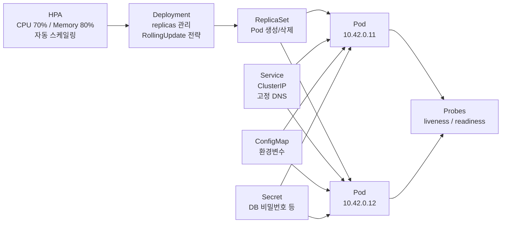
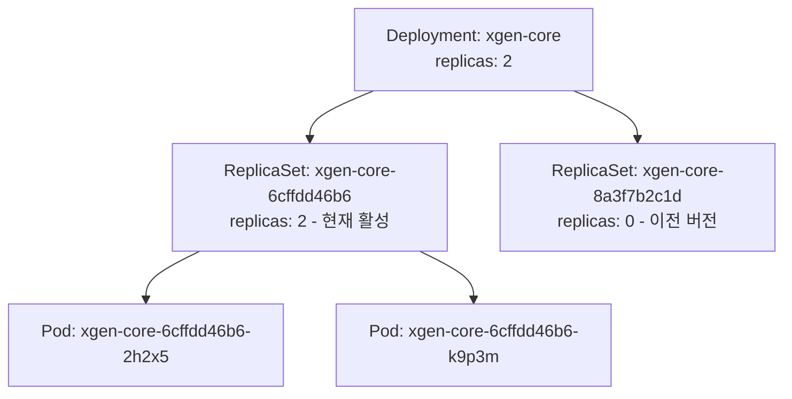
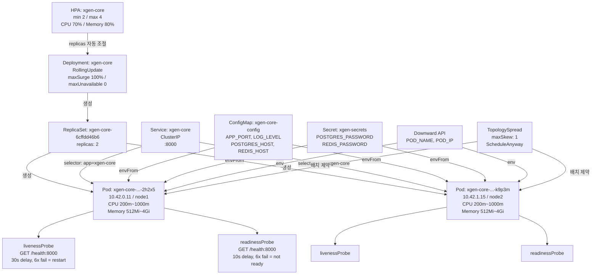

# XGEN K3s 인프라 완전 해부 (2) -- Kubernetes 핵심 오브젝트와 스케일링 전략

1편에서 XGEN 인프라의 전체 구조와 Dockerfile 빌드 전략을 다뤘다. 이미지를 빌드하여 레지스트리에 올렸으니, 이제 그 이미지가 K3s 클러스터 안에서 어떤 형태로 실행되는지 분석할 차례다.

Kubernetes는 애플리케이션을 직접 실행하지 않는다. 대신 여러 종류의 **오브젝트**를 선언하면, 클러스터가 그 선언에 맞는 상태를 유지한다. Pod은 컨테이너를 감싸고, Deployment는 Pod의 개수와 업데이트 전략을 관리하고, Service는 Pod에 접근하는 고정 주소를 제공한다. ConfigMap은 환경변수를 분리하고, HPA는 부하에 따라 Pod 수를 자동 조절한다.

이 글에서는 XGEN의 실제 Helm 템플릿과 클러스터 상태를 기반으로, 각 오브젝트가 어떤 역할을 하고 서로 어떻게 연결되는지 분석한다.

## 시리즈 목차

- 1편: 전체 구조와 컨테이너 빌드 전략
- **2편: Kubernetes 핵심 오브젝트와 스케일링 전략** (현재 글)
- 3편: Helm 차트 설계 -- 하나의 Chart로 6개 서비스 배포하기
- 4편: CI/CD 파이프라인 -- Jenkins 빌드에서 ArgoCD 배포까지
- 5편: Istio 서비스 메시와 Observability 스택

---

## 전체 그림 -- 오브젝트 간 관계

먼저 이 글에서 다루는 Kubernetes 오브젝트들의 관계를 한 눈에 보자.



HPA가 Deployment의 replicas를 제어하고, Deployment는 ReplicaSet을 통해 Pod을 생성한다. Service는 Pod에 고정 DNS 주소를 부여하고, ConfigMap과 Secret은 환경변수를 주입한다. Probe는 Pod의 상태를 지속적으로 확인한다.

이제 각 오브젝트를 하나씩 분석한다.

---

## Pod -- 최소 실행 단위

Pod은 Kubernetes에서 실행 가능한 가장 작은 단위다. 하나의 Pod은 하나 이상의 컨테이너를 포함하며, XGEN에서는 서비스당 하나의 컨테이너를 실행한다.

실제 클러스터에서 `kubectl get pods -n xgen`을 실행하면 이런 출력이 나온다.

```
NAME                                     READY   STATUS    IP           NODE
xgen-core-6cffdd46b6-2h2x5              1/1     Running   10.42.0.11   node1
xgen-core-6cffdd46b6-k9p3m              1/1     Running   10.42.1.15   node2
xgen-workflow-7b8f4d5c9a-x4t2n          1/1     Running   10.42.0.12   node1
xgen-workflow-7b8f4d5c9a-m7j6q          1/1     Running   10.42.1.16   node2
xgen-backend-gateway-5d9e8f7a3b-r8w5k   1/1     Running   10.42.0.13   node1
xgen-backend-gateway-5d9e8f7a3b-v2n9p   1/1     Running   10.42.1.17   node2
xgen-frontend-4c6a2b1d8e-h3f7j         1/1     Running   10.42.0.14   node1
xgen-frontend-4c6a2b1d8e-q5m8t         1/1     Running   10.42.1.18   node2
xgen-documents-8e3b7c2d1f-n6k4w        1/1     Running   10.42.0.15   node1
xgen-documents-8e3b7c2d1f-y9s2r        1/1     Running   10.42.1.19   node2
xgen-mcp-station-3a7d9e4f6c-p1x8v      1/1     Running   10.42.0.16   node1
xgen-mcp-station-3a7d9e4f6c-t4b7z      1/1     Running   10.42.1.20   node2
```

Pod 이름에는 규칙이 있다. `xgen-core-6cffdd46b6-2h2x5`를 분해하면 이렇다.

```
xgen-core       - 서비스명 (Deployment 이름)
6cffdd46b6      - ReplicaSet 해시 (Deployment가 생성한 ReplicaSet의 ID)
2h2x5           - Pod 고유 ID (같은 ReplicaSet 내에서 Pod을 구분)
```

Deployment를 업데이트하면 새 ReplicaSet이 생성되고, 해시값이 바뀐다. 예를 들어 이미지 태그가 변경되면 `6cffdd46b6` 대신 `8a3f7b2c1d` 같은 새 해시가 부여된다. 이 해시를 보면 현재 어떤 버전의 ReplicaSet에서 생성된 Pod인지 알 수 있다.

각 Pod은 고유한 IP 주소를 가진다. 위 예시에서 `10.42.0.x`와 `10.42.1.x`는 K3s가 할당한 Pod CIDR로, 첫 번째 숫자가 노드를 나타낸다. `10.42.0.x`는 node1, `10.42.1.x`는 node2에서 실행 중인 Pod이다.

중요한 점은, **Pod을 직접 만들지 않는다**는 것이다. Pod이 죽으면 아무도 되살리지 않는다. 그래서 Deployment가 필요하다.

---

## Deployment -- Pod 관리자

Deployment는 "이 Pod을 몇 개 유지하라"는 선언이다. Pod이 죽으면 자동으로 새 Pod을 생성하고, 이미지가 바뀌면 기존 Pod을 새 Pod으로 교체한다.

XGEN의 실제 `deployment.yaml` 템플릿이다.

```yaml
apiVersion: apps/v1
kind: Deployment
metadata:
  name: {{ include "xgen-service.name" . }}
  labels:
    {{- include "xgen-service.labels" . | nindent 4 }}
spec:
  replicas: {{ include "xgen-service.replicas" . }}
  strategy:
    type: RollingUpdate
    rollingUpdate:
      maxSurge: 100%
      maxUnavailable: 0
  selector:
    matchLabels:
      {{- include "xgen-service.selectorLabels" . | nindent 6 }}
  template:
    metadata:
      labels:
        {{- include "xgen-service.selectorLabels" . | nindent 8 }}
    spec:
      containers:
        - name: {{ include "xgen-service.name" . }}
          image: {{ include "xgen-service.image" . }}
          imagePullPolicy: {{ .Values.image.pullPolicy }}
          ports:
            - containerPort: {{ .Values.port }}
          # ... (환경변수, 프로브, 리소스 등 후술)
```

Helm 템플릿 문법(`{{ }}`)이 섞여 있지만, 구조는 표준 Kubernetes Deployment 매니페스트와 동일하다. `include "xgen-service.replicas"`는 Helm의 헬퍼 함수로, 환경별(dev/stg/prd) replicas 값을 자동으로 결정한다. 이 부분은 3편(Helm 차트 설계)에서 상세히 다룬다.

### replicas -- Pod 개수 유지

`replicas` 필드가 Pod의 목표 개수다. XGEN 프로덕션 환경에서 각 서비스의 replicas 설정은 이렇다.

| 서비스 | replicas | HPA min/max | 비고 |
|--------|----------|-------------|------|
| xgen-frontend | 2 | 2~4 | Next.js |
| xgen-backend-gateway | 2 | 2~4 | Rust/Axum |
| xgen-core | 2 | 2~4 | Python/FastAPI |
| xgen-workflow | 2 | 2~4 | Python/FastAPI |
| xgen-documents | 2 | 2~4 | Python/FastAPI, 임베딩 처리 |
| xgen-mcp-station | 2 | 2~4 | Python + Node.js |
| xgen-model | 1 | HPA 비활성화 | GPU 서비스, 노드당 1개 |

대부분의 서비스가 최소 2개의 Pod을 유지한다. 이유는 단순하다 -- Pod 하나가 죽더라도 나머지 하나가 트래픽을 처리할 수 있어야 하기 때문이다. `xgen-model`만 예외인데, GPU를 사용하는 모델 서빙 서비스라 스케일링 단위가 GPU 노드에 종속된다.

dev 환경에서는 비용 절감을 위해 모든 서비스를 replicas 1로 실행한다.

```yaml
# k3s/argocd/projects/xgen.yaml (발췌)
environments:
  prd:
    services:
      - name: xgen-core
        replicas: 2
        autoscaling: { minReplicas: 2, maxReplicas: 4 }
        resources:
          requests: { memory: "512Mi", cpu: "200m" }
          limits:   { memory: "4Gi",  cpu: "1000m" }
  dev:
    services:
      - name: xgen-core
        replicas: 1
        autoscaling:
          minReplicas: 1
```

### RollingUpdate -- 무중단 배포

Deployment의 `strategy` 섹션이 배포 방식을 결정한다. XGEN은 `RollingUpdate`를 사용한다.

```yaml
strategy:
  type: RollingUpdate
  rollingUpdate:
    maxSurge: 100%
    maxUnavailable: 0
```

이 설정의 의미를 정리한다.

- **maxSurge: 100%** -- 새 Pod을 기존 Pod 수만큼 추가로 만들 수 있다. replicas가 2이면, 새 Pod 2개를 한꺼번에 생성한다.
- **maxUnavailable: 0** -- 기존 Pod을 먼저 제거하지 않는다. 새 Pod이 Ready가 될 때까지 기존 Pod은 그대로 유지한다.

이 조합은 "먼저 새 Pod을 전부 띄우고, Ready 확인 후, 기존 Pod을 제거"하는 전략이다. 단 한 순간도 서비스 가능한 Pod 수가 줄어들지 않는다.

실제 배포 과정을 단계별로 보면 이렇다.

```
[배포 시작] replicas=2, 이미지 v1 → v2 업데이트

1단계: 새 ReplicaSet 생성, 새 Pod 2개 시작
  기존 Pod: xgen-core-aaa-111 (v1, Running)
  기존 Pod: xgen-core-aaa-222 (v1, Running)
  새 Pod:   xgen-core-bbb-333 (v2, ContainerCreating)
  새 Pod:   xgen-core-bbb-444 (v2, ContainerCreating)
  → 트래픽은 기존 v1 Pod 2개가 처리

2단계: 새 Pod이 readinessProbe 통과
  기존 Pod: xgen-core-aaa-111 (v1, Running)
  기존 Pod: xgen-core-aaa-222 (v1, Running)
  새 Pod:   xgen-core-bbb-333 (v2, Ready)
  새 Pod:   xgen-core-bbb-444 (v2, Ready)
  → 트래픽이 새 Pod으로도 분산됨 (4개 Pod 모두 활성)

3단계: 기존 Pod 종료 (Terminating)
  기존 Pod: xgen-core-aaa-111 (v1, Terminating)
  기존 Pod: xgen-core-aaa-222 (v1, Terminating)
  새 Pod:   xgen-core-bbb-333 (v2, Ready)
  새 Pod:   xgen-core-bbb-444 (v2, Ready)
  → 트래픽은 새 v2 Pod 2개가 처리

[배포 완료] 기존 ReplicaSet의 replicas=0, 새 ReplicaSet의 replicas=2
```

핵심은 2단계에서 `readinessProbe`가 통과해야만 새 Pod을 Ready로 판단한다는 점이다. 새 이미지에 버그가 있어서 헬스체크에 실패하면, 기존 Pod을 제거하지 않으므로 서비스는 그대로 유지된다.

### Deployment -- ReplicaSet -- Pod 관계

Deployment가 직접 Pod을 만들지는 않는다. Deployment가 ReplicaSet을 만들고, ReplicaSet이 Pod을 만든다.



RollingUpdate가 완료된 후에도 이전 ReplicaSet은 `replicas: 0`으로 유지된다. 삭제하지 않는 이유는 **롤백** 때문이다. `kubectl rollout undo` 명령으로 이전 ReplicaSet의 replicas를 다시 올려서 즉시 롤백할 수 있다.

---

## Service -- Pod 접근 고정 주소

Pod은 생성될 때마다 새로운 IP를 받는다. RollingUpdate로 Pod이 교체되면 IP도 바뀐다. 다른 서비스가 Pod IP를 직접 사용하면, 배포할 때마다 주소를 갱신해야 한다. Service가 이 문제를 해결한다.

XGEN의 `service.yaml` 템플릿이다.

```yaml
apiVersion: v1
kind: Service
metadata:
  name: {{ include "xgen-service.name" . }}
  labels:
    {{- include "xgen-service.labels" . | nindent 4 }}
spec:
  type: ClusterIP
  ports:
    - port: {{ .Values.port }}
      targetPort: {{ .Values.port }}
      protocol: TCP
      name: http
  selector:
    {{- include "xgen-service.selectorLabels" . | nindent 4 }}
```

렌더링 결과를 보면 이해가 쉽다. `xgen-core`의 경우 이렇게 생성된다.

```yaml
apiVersion: v1
kind: Service
metadata:
  name: xgen-core
spec:
  type: ClusterIP
  ports:
    - port: 8000
      targetPort: 8000
      protocol: TCP
      name: http
  selector:
    app: xgen-core
    app.kubernetes.io/part-of: xgen-platform
```

### ClusterIP -- 클러스터 내부 전용

`type: ClusterIP`는 클러스터 내부에서만 접근 가능한 가상 IP를 할당한다. XGEN의 모든 서비스는 ClusterIP 타입이다. 외부 트래픽은 Istio IngressGateway를 통해 들어오므로, 서비스 자체가 외부에 노출될 필요가 없다.

### selector -- Pod 매칭

Service의 `selector`는 어떤 Pod에 트래픽을 보낼지 결정한다. `app: xgen-core` 레이블을 가진 모든 Pod이 이 Service의 백엔드가 된다. Pod이 2개든 4개든, selector에 매칭되는 Pod 전체에 자동으로 로드밸런싱된다.

### DNS 규칙

Kubernetes 클러스터 내부에서 Service에 접근할 때는 DNS를 사용한다. 규칙은 이렇다.

```
서비스명.네임스페이스.svc.cluster.local
```

같은 네임스페이스 안에서는 서비스명만으로도 접근 가능하다.

```
xgen-core                               → 같은 네임스페이스에서 접근
xgen-core.xgen.svc.cluster.local        → 전체 FQDN
postgresql.xgen-system.svc.cluster.local → 다른 네임스페이스의 서비스 접근
```

XGEN workflow 서비스가 core 서비스를 호출할 때 사용하는 주소가 바로 이것이다.

```yaml
# k3s/helm-chart/values/xgen-workflow.yaml (발췌)
config:
  CORE_SERVICE_BASE_URL: "http://xgen-core:8000"
  DOCUMENTS_SERVICE_BASE_URL: "http://xgen-documents:8000"
  MCP_STATION_BASE_URL: "http://xgen-mcp-station:8000"
```

`http://xgen-core:8000`은 xgen-core Service의 ClusterIP 주소로 해석된다. Pod IP가 바뀌어도 Service DNS는 변하지 않으므로, 앱 코드에서 하드코딩해도 문제없다.

---

## ConfigMap & Secret -- 환경변수 관리

애플리케이션 설정을 컨테이너 이미지 안에 넣으면, 설정 하나 바꿀 때마다 이미지를 다시 빌드해야 한다. ConfigMap은 환경변수를 Pod 정의와 분리하여, 이미지 재빌드 없이 설정을 변경할 수 있게 한다.

### ConfigMap

XGEN의 `configmap.yaml` 템플릿이다.

```yaml
apiVersion: v1
kind: ConfigMap
metadata:
  name: {{ include "xgen-service.name" . }}-config
  labels:
    {{- include "xgen-service.labels" . | nindent 4 }}
data:
  APP_PORT: {{ .Values.port | quote }}
  {{- $config := fromYaml (include "xgen-service.config" .) }}
  {{- range $key, $value := $config }}
  {{ $key }}: {{ $value | quote }}
  {{- end }}
```

`xgen-service.config` 헬퍼 함수는 여러 소스의 환경변수를 병합한다. 우선순위는 이렇다.

```
(낮음) global.infra 자동 주입
       → global.config (전역 기본값)
       → 서비스별 config (values/xgen-core.yaml 등)
       → 환경별 config (environments.dev.config 등)
(높음) → projects/*.yaml의 vars (프로젝트 공통 변수)
```

예를 들어 `xgen-core`의 ConfigMap은 최종적으로 이런 데이터를 가진다.

```yaml
data:
  APP_PORT: "8000"
  APP_HOST: "0.0.0.0"
  LOG_LEVEL: "WARNING"          # prd 환경별 config
  DEBUG_MODE: "false"           # prd 환경별 config
  POSTGRES_HOST: "postgresql.xgen-system.svc.cluster.local"  # global.infra
  REDIS_HOST: "redis.xgen-system.svc.cluster.local"          # global.infra
  QDRANT_HOST: "qdrant.xgen-system.svc.cluster.local"        # global.infra
  MINIO_ENDPOINT: "http://minio.xgen-system.svc.cluster.local:9000"  # global.infra
  REDIS_PASSWORD: "redis_secure_password123!"  # global.config
  APP_SITE: "xgen-x2bee-com"    # projects/xgen.yaml vars (최우선)
```

### Secret

Secret은 민감 정보를 저장한다. ConfigMap과 사용법은 동일하지만, 값이 Base64로 인코딩된다(보안 암호화가 아니라 직렬화 목적이다).

```yaml
apiVersion: v1
kind: Secret
metadata:
  name: xgen-secrets
  namespace: xgen
type: Opaque
stringData:
  POSTGRES_HOST: "postgresql.xgen-system.svc.cluster.local"
  POSTGRES_PORT: "5432"
  POSTGRES_DB: "plateerag"
  POSTGRES_USER: "ailab"
  POSTGRES_PASSWORD: "***"
  REDIS_HOST: "redis.xgen-system.svc.cluster.local"
  REDIS_PASSWORD: "***"
```

XGEN에서는 DB 접속 정보, Redis 비밀번호 등을 Secret으로 관리한다. Secret은 Helm Chart가 아닌 수동으로 `kubectl apply`하여 클러스터에 적용한다. Git에 비밀번호가 올라가면 안 되기 때문이다.

### envFrom -- 일괄 주입

Deployment 템플릿에서 ConfigMap과 Secret을 Pod에 주입하는 부분이다.

```yaml
envFrom:
  - configMapRef:
      name: {{ include "xgen-service.name" . }}-config
  - secretRef:
      name: {{ .Values.global.secrets.name }}
      optional: true
```

`envFrom`은 ConfigMap(또는 Secret)의 모든 키-값 쌍을 환경변수로 일괄 주입한다. `env`로 하나씩 매핑하는 것보다 간결하다. `optional: true`는 Secret이 없어도 Pod 시작에 실패하지 않게 한다 -- dev 환경에서는 Secret 없이 ConfigMap만으로 실행하는 경우가 있기 때문이다.

이 구조의 장점은 **환경변수 하나 추가할 때 이미지를 재빌드할 필요가 없다**는 것이다. ConfigMap만 수정하고 Pod을 재시작(또는 롤아웃)하면 새 환경변수가 적용된다.

---

## Resources -- CPU/메모리 제한

Kubernetes에서 리소스 제한 없이 Pod을 실행하면, 하나의 Pod이 노드의 자원을 전부 소모하여 다른 Pod을 죽일 수 있다. `resources` 설정으로 각 Pod의 CPU와 메모리 사용량을 제한한다.

### requests vs limits

```yaml
resources:
  requests:
    memory: "512Mi"
    cpu: "200m"
  limits:
    memory: "4Gi"
    cpu: "1000m"
```

**requests**는 스케줄러의 배치 기준이다. "이 Pod을 실행하려면 최소 512Mi 메모리와 200m CPU가 필요하다"는 뜻이다. 스케줄러는 requests를 만족하는 노드에만 Pod을 배치한다. 실제 사용량이 requests보다 적어도 그만큼의 자원은 예약된다.

**limits**는 사용 상한선이다. 메모리가 limits를 초과하면 **OOM Kill** -- 커널이 프로세스를 강제 종료한다. CPU가 limits를 초과하면 **쓰로틀링** -- 실행 속도가 느려지지만 프로세스가 죽지는 않는다.

CPU 단위는 밀리코어다. `1000m = 1코어`, `200m = 0.2코어`다. 8코어 서버에서 200m은 전체 CPU의 2.5%에 해당한다.

### 서비스별 리소스 설정 (prd 환경)

XGEN 프로덕션에서 각 서비스에 할당된 리소스다.

| 서비스 | requests (mem / cpu) | limits (mem / cpu) | 특성 |
|--------|----------------------|--------------------|------|
| xgen-frontend | 512Mi / 200m | 2Gi / 1000m | Next.js SSR |
| xgen-backend-gateway | 512Mi / 200m | 2Gi / 1000m | Rust, 매우 효율적 |
| xgen-core | 512Mi / 200m | 4Gi / 1000m | Python, 세션 관리 |
| xgen-workflow | 1Gi / 200m | 8Gi / 1000m | LLM 호출, 대용량 처리 |
| xgen-documents | 1Gi / 500m | 16Gi / 4000m | 임베딩 처리, CPU 집약적 |
| xgen-mcp-station | 512Mi / 200m | 2Gi / 1000m | MCP 서버 관리 |
| xgen-model | 8Gi / 2000m | 24Gi / 8000m | GPU 모델 서빙 |

서비스마다 리소스 편차가 크다. 실제 운영에서 관찰된 메모리 사용량을 보면 서비스 특성이 분명하게 드러난다.

- **xgen-backend-gateway**: 약 3~4Mi 사용. Rust로 작성된 API Gateway라 메모리 효율이 극단적으로 좋다. limits 2Gi 대비 0.2%만 사용한다.
- **xgen-core**: 약 104Mi. Python/FastAPI 기반으로 안정적인 메모리 사용.
- **xgen-documents**: 약 280Mi. 문서 임베딩 처리 시 일시적으로 급증할 수 있어 limits를 16Gi로 넉넉하게 잡았다. CPU도 4000m으로 다른 서비스의 4배다.
- **xgen-workflow**: 1.8~3.2Gi로 변동폭이 크다. LLM 호출 결과를 메모리에 쌓으면서 처리하기 때문이다. limits 8Gi에 근접하면 OOM Kill 위험이 있어 모니터링 대상이다.

xgen-model은 GPU를 사용하므로 리소스 설정에 `nvidia.com/gpu: 1`이 추가된다.

```yaml
# k3s/helm-chart/values/xgen-model.yaml (발췌)
resources:
  requests:
    memory: "8Gi"
    cpu: "2000m"
    nvidia.com/gpu: 1
  limits:
    memory: "24Gi"
    cpu: "8000m"
    nvidia.com/gpu: 1
```

---

## Probes -- 상태 확인

Pod이 실행 중이라고 해서 트래픽을 처리할 수 있는 것은 아니다. 애플리케이션이 초기화 중이거나, 내부 오류로 요청을 받지 못하는 상태일 수 있다. Probe는 이 상태를 Kubernetes가 자동으로 감지하여 대응할 수 있게 한다.

### livenessProbe -- "살아있나?"

livenessProbe가 실패하면 Kubernetes가 Pod을 **재시작**한다. 프로세스가 데드락에 빠지거나, 메모리 릭으로 응답 불능 상태가 되었을 때 자동 복구하는 메커니즘이다.

### readinessProbe -- "트래픽 받을 준비 됐나?"

readinessProbe가 실패하면 Service의 엔드포인트에서 해당 Pod을 **제외**한다. Pod은 재시작하지 않지만, 트래픽이 가지 않는다. 앱이 초기화 중이거나, 일시적으로 과부하 상태일 때 유용하다.

XGEN Deployment 템플릿의 Probe 설정이다.

```yaml
{{- if eq .Values.healthCheck.type "http" }}
livenessProbe:
  httpGet:
    path: {{ .Values.healthCheck.path }}
    port: {{ .Values.port }}
  initialDelaySeconds: {{ .Values.healthCheck.livenessProbe.initialDelaySeconds | default 30 }}
  periodSeconds: {{ .Values.healthCheck.livenessProbe.periodSeconds | default 10 }}
  timeoutSeconds: {{ .Values.healthCheck.livenessProbe.timeoutSeconds | default 5 }}
  failureThreshold: {{ .Values.healthCheck.livenessProbe.failureThreshold | default 6 }}
readinessProbe:
  httpGet:
    path: {{ .Values.healthCheck.path }}
    port: {{ .Values.port }}
  initialDelaySeconds: {{ .Values.healthCheck.readinessProbe.initialDelaySeconds | default 10 }}
  periodSeconds: {{ .Values.healthCheck.readinessProbe.periodSeconds | default 5 }}
  timeoutSeconds: {{ .Values.healthCheck.readinessProbe.timeoutSeconds | default 5 }}
  failureThreshold: {{ .Values.healthCheck.readinessProbe.failureThreshold | default 6 }}
{{- end }}
```

기본값을 정리하면 이렇다.

```yaml
readinessProbe:
  httpGet:
    path: /health
    port: 8000
  initialDelaySeconds: 10   # Pod 시작 후 10초 대기
  periodSeconds: 5           # 5초마다 체크
  timeoutSeconds: 5          # 5초 내 응답 없으면 실패
  failureThreshold: 6        # 6번 연속 실패 시 Not Ready

livenessProbe:
  httpGet:
    path: /health
    port: 8000
  initialDelaySeconds: 30    # Pod 시작 후 30초 대기 (초기화 여유)
  periodSeconds: 10           # 10초마다 체크
  timeoutSeconds: 5           # 5초 내 응답 없으면 실패
  failureThreshold: 6         # 6번 연속 실패 시 Pod 재시작
```

readinessProbe는 `initialDelaySeconds: 10`으로 빠르게 체크를 시작하지만, livenessProbe는 `initialDelaySeconds: 30`으로 더 여유를 준다. 앱이 아직 초기화 중인데 livenessProbe가 실패하면 불필요하게 Pod을 재시작하기 때문이다.

### 서비스별 Probe 커스터마이징

서비스 특성에 따라 Probe 설정을 오버라이드한다.

**xgen-core** -- Python FastAPI 서비스로 초기화 시간이 길다.

```yaml
# k3s/helm-chart/values/xgen-core.yaml (발췌)
healthCheck:
  livenessProbe:
    initialDelaySeconds: 90   # DB 마이그레이션 등 초기화에 시간 필요
  readinessProbe:
    initialDelaySeconds: 60
```

**xgen-documents** -- 문서 임베딩 처리 중 CPU 부하가 높아져서 헬스체크 타임아웃이 발생할 수 있다.

```yaml
# k3s/helm-chart/values/xgen-documents.yaml (발췌)
healthCheck:
  type: http
  path: /health
  livenessProbe:
    initialDelaySeconds: 60
    periodSeconds: 15        # 기본 10초보다 넉넉하게
    timeoutSeconds: 10       # 기본 5초보다 넉넉하게 (임베딩 중 느린 응답 허용)
    failureThreshold: 6
  readinessProbe:
    initialDelaySeconds: 30
    periodSeconds: 10
    timeoutSeconds: 10
    failureThreshold: 6
```

**xgen-backend-gateway** -- Rust로 작성되어 HTTP 엔드포인트가 아닌 TCP 포트 체크를 사용한다.

```yaml
# k3s/helm-chart/values/xgen-backend-gateway.yaml (발췌)
healthCheck:
  type: tcp
```

TCP 타입 Probe는 포트가 열려 있는지만 확인한다. HTTP GET 요청을 보내지 않으므로, `/health` 엔드포인트가 없는 서비스에 적합하다.

### RollingUpdate와 Probe의 연동

앞서 설명한 RollingUpdate 전략에서, **readinessProbe가 통과해야 새 Pod을 Ready로 판단**한다는 점이 핵심이다.

```
maxSurge: 100%, maxUnavailable: 0 + readinessProbe 조합:

1. 새 Pod 생성 → readinessProbe 시작
2. /health가 200 OK 반환 → Ready 상태로 전환
3. Service 엔드포인트에 새 Pod 추가 → 트래픽 수신 시작
4. 기존 Pod Terminating → 트래픽 점진적 이동
```

만약 새 이미지에 버그가 있어서 `/health`가 500을 반환하면, readinessProbe가 계속 실패한다. 새 Pod은 Ready가 되지 않고, `maxUnavailable: 0` 정책에 의해 기존 Pod도 제거되지 않는다. 결과적으로 배포가 중단되고, 서비스는 기존 버전으로 계속 운영된다.

---

## HPA -- 자동 스케일링

HPA(Horizontal Pod Autoscaler)는 CPU/메모리 사용률을 모니터링하여, 임계값을 초과하면 Pod 수를 자동으로 늘린다. 수동으로 `kubectl scale`을 실행할 필요 없이, 부하에 따라 탄력적으로 대응한다.

### HPA 템플릿

XGEN의 `hpa.yaml` 템플릿이다.

```yaml
{{- $autoscaling := fromYaml (include "xgen-service.autoscaling" .) }}
{{- if $autoscaling.enabled }}
apiVersion: autoscaling/v2
kind: HorizontalPodAutoscaler
metadata:
  name: {{ include "xgen-service.name" . }}
spec:
  scaleTargetRef:
    apiVersion: apps/v1
    kind: Deployment
    name: {{ include "xgen-service.name" . }}
  minReplicas: {{ $autoscaling.minReplicas }}
  maxReplicas: {{ $autoscaling.maxReplicas }}
  metrics:
    - type: Resource
      resource:
        name: cpu
        target:
          type: Utilization
          averageUtilization: {{ $autoscaling.cpuThreshold | default 70 }}
    - type: Resource
      resource:
        name: memory
        target:
          type: Utilization
          averageUtilization: {{ $autoscaling.memoryThreshold | default 80 }}
  behavior:
    scaleUp:
      stabilizationWindowSeconds: 30
      policies:
        - type: Pods
          value: 2
          periodSeconds: 30
    scaleDown:
      stabilizationWindowSeconds: 120
      policies:
        - type: Pods
          value: 2
          periodSeconds: 60
{{- end }}
```

### 스케일링 기준

두 가지 메트릭을 동시에 감시한다.

- **CPU 평균 사용률 70% 초과** -- 스케일 업
- **메모리 평균 사용률 80% 초과** -- 스케일 업

"평균"이라는 점이 중요하다. Pod 2개 중 하나가 CPU 100%, 다른 하나가 40%면 평균 70%로, 딱 임계점에 도달한다. 두 메트릭 중 하나라도 초과하면 스케일 업이 트리거된다.

### behavior -- 안정화 전략

스케일링을 너무 민감하게 하면 Pod이 자주 생겼다 사라진다(thrashing). `behavior` 섹션이 이를 방지한다.

```yaml
behavior:
  scaleUp:
    stabilizationWindowSeconds: 30    # 30초간 안정적으로 초과해야 스케일 업
    policies:
      - type: Pods
        value: 2                       # 한 번에 최대 2개 Pod 추가
        periodSeconds: 30              # 30초마다 최대 2개

  scaleDown:
    stabilizationWindowSeconds: 120   # 120초간 안정적으로 감소해야 스케일 다운
    policies:
      - type: Pods
        value: 2                       # 한 번에 최대 2개 Pod 제거
        periodSeconds: 60              # 60초마다 최대 2개
```

**scaleUp은 30초 안정화**, **scaleDown은 120초 안정화**다. 의도적으로 비대칭이다. 트래픽 급증 시에는 빠르게 Pod을 추가해야 하지만, 트래픽이 줄어들 때 서둘러 Pod을 줄이면 다시 급증할 때 대응이 늦어진다. 스케일 다운을 보수적으로 설정하여 안정성을 확보한 것이다.

실제 스케일링 시나리오를 시뮬레이션하면 이렇다.

```
[00:00] CPU 평균 사용률 75% (70% 초과)
[00:30] 30초간 지속 확인 → scaleUp 트리거
        → Pod 2개 → 4개 (maxReplicas 한도 내)
[00:45] CPU 평균 45%로 하락 (Pod 분산 효과)
[02:45] 120초간 지속 확인 → scaleDown 트리거
        → Pod 4개 → 2개 (minReplicas까지)
```

### HPA가 Deployment의 replicas를 덮어쓴다

HPA가 활성화되면, Deployment의 `spec.replicas` 필드를 HPA가 직접 수정한다. 문제는 ArgoCD다. ArgoCD는 Git의 선언(replicas: 2)과 실제 클러스터 상태(replicas: 4, HPA가 변경)가 다르면 "OutOfSync"로 표시한다.

이를 해결하기 위해 ArgoCD Application에서 replicas 차이를 무시하도록 설정했다.

```yaml
# k3s/argocd/templates/application.yaml (발췌)
# HPA가 replicas를 관리하므로 차이 무시
ignoreDifferences:
  - group: apps
    kind: Deployment
    jsonPointers:
      - /spec/replicas
```

`/spec/replicas` 경로의 차이를 무시하면, HPA가 replicas를 4로 올려도 ArgoCD는 이를 정상으로 판단한다.

### HPA 비활성화 케이스

GPU 서비스인 xgen-model은 HPA를 비활성화한다.

```yaml
# k3s/helm-chart/values/xgen-model.yaml (발췌)
autoscaling:
  enabled: false
replicas: 2
```

GPU는 CPU처럼 자유롭게 늘릴 수 없다. 물리 GPU 카드가 노드에 장착되어 있어야 하고, `nvidia.com/gpu` 리소스 요청이 가능한 노드에서만 Pod이 스케줄링된다. HPA가 Pod을 늘려도 GPU가 없는 노드에는 배치할 수 없으므로, 수동으로 관리하는 것이 더 적절하다.

---

## Topology Spread -- 노드 분산

Pod이 2개인데 모두 같은 노드에 배치되면, 그 노드가 죽으면 서비스가 전면 중단된다. `topologySpreadConstraints`로 Pod을 노드 간 균등하게 배치한다.

```yaml
# k3s/helm-chart/templates/deployment.yaml (발췌)
{{- if not .Values.nodeSelector }}
# 노드 간 균등 분산 (nodeSelector 없는 경우에만)
topologySpreadConstraints:
  - maxSkew: 1
    topologyKey: kubernetes.io/hostname
    whenUnsatisfiable: ScheduleAnyway
    labelSelector:
      matchLabels:
        {{- include "xgen-service.selectorLabels" . | nindent 14 }}
{{- end }}
```

설정의 의미를 정리한다.

- **maxSkew: 1** -- 노드 간 Pod 수 차이가 최대 1개까지만 허용. Pod 2개면 각 노드에 1개씩 배치된다.
- **topologyKey: kubernetes.io/hostname** -- 노드 단위로 분산한다.
- **whenUnsatisfiable: ScheduleAnyway** -- 분산 조건을 만족하지 못하더라도 스케줄링한다. `DoNotSchedule`이면 조건 불충족 시 Pod이 Pending 상태로 남는다.

`ScheduleAnyway`를 선택한 이유가 있다. 노드가 1대뿐인 개발 환경에서도 Pod이 정상적으로 스케줄링되어야 하기 때문이다. 완벽한 분산보다 서비스 가용성을 우선한 결정이다.

주목할 점은 `nodeSelector`가 설정된 서비스에는 topologySpreadConstraints를 적용하지 않는다는 것이다. GPU 서비스(xgen-model)는 `nodeSelector: { gpu: nvidia }`로 GPU 노드에만 배치하되, 별도의 `podAntiAffinity`로 노드당 1개씩 배치한다.

```yaml
# k3s/helm-chart/values/xgen-model.yaml (발췌)
nodeSelector:
  gpu: nvidia

affinity:
  podAntiAffinity:
    requiredDuringSchedulingIgnoredDuringExecution:
      - labelSelector:
          matchLabels:
            app: xgen-model
        topologyKey: kubernetes.io/hostname
```

`required`는 반드시 충족해야 한다는 뜻이다. 같은 노드에 xgen-model Pod이 이미 있으면, 새 Pod은 해당 노드에 배치되지 않는다. GPU 1장을 두 Pod이 나눠 쓰면 메모리가 부족해지기 때문이다.

---

## Downward API -- Pod 정보 주입

Kubernetes Downward API는 Pod 자체의 메타데이터를 환경변수로 주입하는 기능이다. XGEN에서는 `POD_NAME`과 `POD_IP`를 주입한다.

```yaml
# k3s/helm-chart/templates/deployment.yaml (발췌)
env:
  # Kubernetes Downward API - POD 정보 (멀티 POD 세션 라우팅용)
  - name: POD_NAME
    valueFrom:
      fieldRef:
        fieldPath: metadata.name
  - name: POD_IP
    valueFrom:
      fieldRef:
        fieldPath: status.podIP
```

이 환경변수는 멀티 Pod 세션 라우팅에 활용된다. XGEN은 AI 에이전트 플랫폼으로, 사용자 세션이 특정 Pod에서 시작되면 같은 Pod에서 처리가 계속되어야 하는 경우가 있다. Pod이 자신의 이름과 IP를 알아야 Redis에 세션 정보를 등록하고, 다른 Pod이 해당 세션의 소유자를 찾을 수 있다.

```
사용자 A 세션 시작:
  → xgen-core-6cffdd46b6-2h2x5 (POD_NAME)
  → Redis에 session:A → pod:xgen-core-6cffdd46b6-2h2x5 기록

사용자 A 후속 요청:
  → Service 로드밸런서가 다른 Pod(k9p3m)으로 라우팅
  → k9p3m이 Redis에서 session:A의 소유자 Pod 확인
  → 소유자 Pod(2h2x5)으로 내부 프록시
```

ConfigMap과 달리 Downward API는 Pod 생성 시점에 자동으로 결정되는 값이다. Pod 이름이나 IP는 스케줄링 전에는 알 수 없으므로, 선언 시점이 아닌 실행 시점에 주입된다.

---

## 오브젝트 간 관계 정리

지금까지 다룬 오브젝트들이 어떻게 연결되는지, XGEN 프로덕션 환경의 xgen-core를 예로 정리한다.



이 오브젝트들의 라이프사이클을 시간순으로 보면 이렇다.

```
1. ConfigMap, Secret 생성 (환경변수 준비)
2. Deployment 생성 → ReplicaSet 생성 → Pod 2개 생성
3. TopologySpread에 따라 Pod이 각 노드에 1개씩 배치
4. Downward API가 POD_NAME, POD_IP 주입
5. ConfigMap과 Secret의 환경변수 일괄 주입
6. 컨테이너 시작 → readinessProbe 체크 시작
7. readinessProbe 통과 → Service 엔드포인트에 Pod 등록
8. livenessProbe 주기적 체크 시작
9. Service가 트래픽을 두 Pod에 로드밸런싱
10. HPA가 metrics-server에서 CPU/메모리 사용률 모니터링
11. 임계값 초과 시 HPA가 Deployment의 replicas 수정 → Pod 추가 생성
```

---

## dev vs prd -- 환경별 차이

같은 Helm 템플릿이지만, 환경에 따라 배포되는 모습이 상당히 다르다.

| 항목 | dev | prd |
|------|-----|-----|
| replicas | 1 | 2 |
| HPA minReplicas | 1 | 2 |
| HPA maxReplicas | 4 | 4 |
| xgen-core memory limits | 2Gi | 4Gi |
| xgen-workflow memory limits | 4Gi | 8Gi |
| xgen-documents memory limits | 4Gi | 16Gi |
| xgen-model | 미배포 | 1 (GPU 노드) |
| LOG_LEVEL | DEBUG | WARNING |

dev 환경에서는 리소스를 절반 이하로 줄이고, replicas를 1로 유지하여 서버 자원을 아낀다. xgen-model은 dev에서 아예 서비스 목록에서 빠진다 -- GPU 노드가 dev 클러스터에 없기 때문이다.

이 환경별 분기는 모두 `k3s/argocd/projects/xgen.yaml` 파일의 `environments` 섹션에서 관리한다. 하나의 프로젝트 설정 파일이 dev/prd 모든 환경을 제어하는 구조다.

---

## 정리

2편에서 다룬 Kubernetes 오브젝트들을 요약한다.

- **Pod**: 컨테이너 실행 단위. 고유 IP를 갖지만 직접 생성하지 않는다.
- **Deployment**: Pod의 수와 업데이트 전략을 선언적으로 관리한다. XGEN은 `maxSurge: 100%, maxUnavailable: 0` RollingUpdate로 무중단 배포를 구현했다.
- **Service**: Pod에 고정 DNS를 부여하고 로드밸런싱한다. 모든 서비스가 ClusterIP 타입이다.
- **ConfigMap/Secret**: 환경변수를 이미지 밖으로 분리한다. Helm 헬퍼 함수가 global, 서비스별, 환경별 설정을 자동 병합한다.
- **Resources**: requests로 스케줄링 보장, limits로 자원 폭주를 방지한다. Rust Gateway는 3~4Mi, workflow는 3.2Gi로 서비스 특성에 따라 편차가 크다.
- **Probes**: readinessProbe가 RollingUpdate의 안전망 역할을 한다. 서비스별로 타임아웃을 커스터마이징했다.
- **HPA**: CPU 70%/메모리 80% 기준으로 2~4개 Pod을 자동 스케일링한다. scaleDown은 120초 안정화로 보수적 운영한다.
- **TopologySpread**: Pod을 노드 간 균등 배치하여 단일 노드 장애에 대응한다.
- **Downward API**: POD_NAME, POD_IP를 주입하여 멀티 Pod 세션 라우팅에 활용한다.

이 오브젝트들은 모두 Helm 템플릿에 정의되어 있고, 서비스별 차이는 values 파일로만 표현된다. 3편에서는 이 Deployment, Service, ConfigMap, HPA가 전부 하나의 Helm Chart에서 어떻게 생성되는지, `_helpers.tpl`의 config 병합 로직과 values 파일 계층화 구조를 분석한다.
