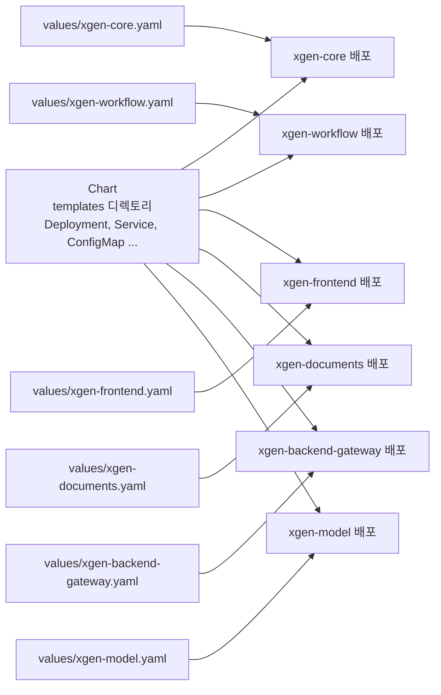
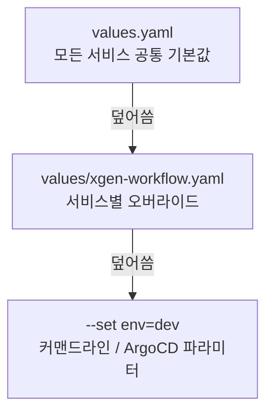
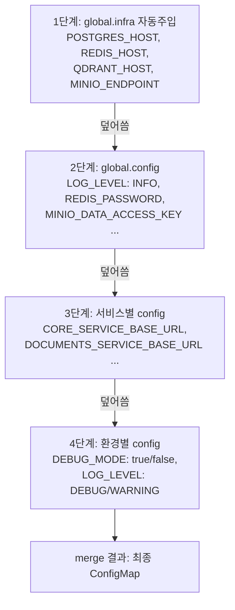
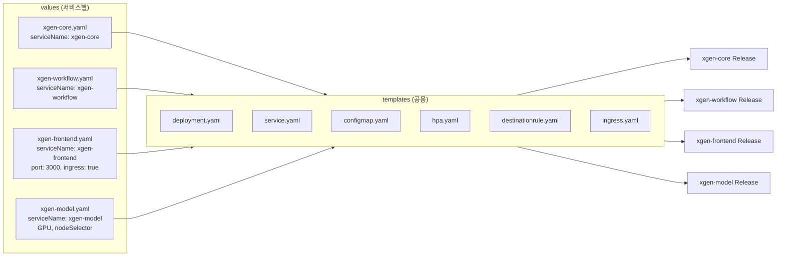

# XGEN K3s 인프라 완전 해부 (3) — Helm 차트 설계: 하나의 Chart로 6개 서비스 배포

## 시리즈 목차

- 1편: 전체 구조와 컨테이너 빌드 전략
- 2편: Kubernetes 핵심 오브젝트와 스케일링 전략
- **3편: Helm 차트 설계 — 하나의 Chart로 6개 서비스 배포하기** (현재 글)
- 4편: CI/CD 파이프라인 — Jenkins 빌드에서 ArgoCD 배포까지
- 5편: Istio 서비스 메시와 Observability 스택

---

## 왜 Helm이 필요한가

XGEN 2.0에는 6개의 마이크로서비스가 있다. 각 서비스를 Kubernetes에 배포하려면 최소한 Deployment, Service, ConfigMap, HPA 4개의 YAML 매니페스트가 필요하다. 서비스가 6개면 24개, 환경이 dev/prd 2개면 48개의 YAML 파일을 관리해야 한다. 서비스 간 차이는 이미지 경로, 포트 번호, 환경변수 정도인데, 그 차이를 위해 거의 동일한 YAML을 48벌 복사해서 유지보수하는 것은 명백한 낭비다.

Helm은 이 문제를 **Chart(템플릿 묶음)와 Values(값)의 분리**로 해결한다.



Helm의 3가지 핵심 개념은 이렇다.

- **Chart**: 템플릿 묶음이다. Deployment, Service, ConfigMap 등의 K8s 매니페스트를 Go 템플릿 문법으로 작성한 파일들의 집합이다. 틀(mold)에 해당한다.
- **Values**: 값이다. 서비스 이름, 이미지 경로, 포트, 환경변수 등 Chart의 빈칸을 채우는 데이터다.
- **Release**: Chart + Values로 실제 렌더링된 K8s 매니페스트를 클러스터에 배포한 인스턴스다.

같은 Chart에 다른 Values를 넣으면 다른 서비스가 배포된다. 템플릿은 1벌만 관리하면 되고, 서비스별 차이는 values 파일로만 표현한다.

---

## Chart 디렉토리 구조

XGEN의 Helm Chart는 `k3s/helm-chart/` 디렉토리에 있다.

```
k3s/helm-chart/
├── Chart.yaml                   # 차트 메타데이터
├── values.yaml                  # 기본값 (모든 서비스 공통)
├── values/
│   ├── xgen-core.yaml           # 서비스별 오버라이드
│   ├── xgen-workflow.yaml
│   ├── xgen-frontend.yaml
│   ├── xgen-backend-gateway.yaml
│   ├── xgen-documents.yaml
│   ├── xgen-model.yaml
│   └── xgen-mcp-station.yaml
└── templates/
    ├── _helpers.tpl             # 헬퍼 함수 (이 글의 핵심)
    ├── deployment.yaml          # Deployment 템플릿
    ├── service.yaml             # Service 템플릿
    ├── configmap.yaml           # ConfigMap 템플릿
    ├── hpa.yaml                 # HPA 템플릿
    ├── destinationrule.yaml     # Istio DestinationRule
    └── ingress.yaml             # Istio Gateway + VirtualService
```

각 디렉토리의 역할을 정리한다.

**Chart.yaml** -- 차트의 이름과 버전 정보다. 단순하다.

```yaml
apiVersion: v2
name: xgen-service
description: XGEN 2.0 서비스 배포용 Helm 차트
type: application
version: 1.0.0
appVersion: "1.0.0"
```

`name: xgen-service`가 차트의 이름이다. 서비스 이름은 values에서 `serviceName`으로 주입하므로, 차트 이름 자체는 범용적으로 지었다.

**values.yaml** -- 모든 서비스에 공통으로 적용되는 기본값이다. 서비스별 values 파일에서 명시하지 않은 값은 여기서 가져간다. 이 파일의 구조가 곧 Chart의 설정 스키마다.

**values/ 디렉토리** -- 서비스별 오버라이드 파일이다. 7개 서비스 각각 하나씩 있다. values.yaml의 기본값 중 서비스에 맞게 바꿔야 하는 것만 명시한다.

**templates/ 디렉토리** -- Go 템플릿 문법으로 작성된 K8s 매니페스트들이다. `_helpers.tpl`은 다른 템플릿에서 재사용하는 헬퍼 함수를 모아둔 파일이다. 밑줄(`_`)로 시작하는 파일은 Helm이 독립적인 K8s 리소스로 렌더링하지 않는다.

---

## values 오버라이드 우선순위

Helm에서 values가 병합되는 우선순위를 이해하는 것이 중요하다. XGEN에서는 3단계로 값이 결정된다.



1단계는 `values.yaml`이다. 포트 8000, 메모리 요청 256Mi, HPA min 2 / max 4 같은 모든 서비스의 공통 기본값이 여기 있다.

2단계는 `values/xgen-workflow.yaml` 같은 서비스별 파일이다. helm 명령의 `-f` 옵션으로 지정한다. 1단계 값을 덮어쓴다. xgen-frontend는 포트를 3000으로, xgen-model은 오토스케일링을 비활성화하는 식이다.

3단계는 `--set` 옵션이다. 커맨드라인에서 직접 값을 넣거나, ArgoCD가 파라미터로 주입한다. 가장 높은 우선순위를 가진다. XGEN에서는 주로 `env=dev` 또는 `env=prd`를 이 단계에서 넣는다.

실제 helm template 명령은 이렇게 생겼다.

```bash
# xgen-workflow를 dev 환경으로 렌더링
helm template test ./k3s/helm-chart \
  -f ./k3s/helm-chart/values/xgen-workflow.yaml \
  --set env=dev
```

---

## values.yaml 기본값 분석

모든 서비스의 시작점인 `values.yaml`을 분석한다. 이 파일의 구조를 이해해야 서비스별 오버라이드가 어떤 맥락에서 동작하는지 파악할 수 있다.

```yaml
# ── 프로젝트 전역 설정 ──
global:
  platform: "xgen-platform"           # app.kubernetes.io/part-of 레이블
  registry:
    host: "docker.x2bee.com"          # Docker Registry 호스트
    project: "xgen"                   # Registry 내 프로젝트 경로
    site: "main"                      # 사이트명
  secrets:
    name: "xgen-secrets"              # 공통 시크릿 (DB, Redis 등)
    imagePull: "registry-credentials"  # 이미지 풀 시크릿
  # 인프라 서비스 호스트
  infra:
    namespace: "xgen-system"
    postgres:
      host: "postgresql.xgen-system.svc.cluster.local"
    redis:
      host: "redis.xgen-system.svc.cluster.local"
    qdrant:
      host: "qdrant.xgen-system.svc.cluster.local"
    minio:
      endpoint: "http://minio.xgen-system.svc.cluster.local:9000"
  # 공통 환경변수 기본값
  config:
    LOG_LEVEL: "INFO"
    DEBUG_MODE: "false"
    REDIS_PASSWORD: "redis_secure_password123!"
    MINIO_DATA_ACCESS_KEY: "minio"
    MINIO_DATA_SECRET_KEY: "minio123"
    MINIO_DOCUMENT_BUCKET: "documents"
    MINIO_SECURE: "false"
```

`global` 섹션은 크게 4가지 역할을 한다.

**registry** -- Docker 이미지 레지스트리 주소를 정의한다. `_helpers.tpl`의 이미지 경로 생성 함수가 이 값을 조합하여 `docker.x2bee.com/xgen/main/xgen-core:latest-amd64` 같은 전체 경로를 자동으로 만든다.

**secrets** -- K8s Secret 이름을 정의한다. 모든 서비스의 Deployment에서 동일한 Secret을 참조한다. DB 비밀번호 같은 민감한 값은 values에 넣지 않고 Secret으로 분리한다.

**infra** -- 인프라 서비스(PostgreSQL, Redis, Qdrant, MinIO)의 K8s 내부 DNS 주소를 정의한다. 1편에서 다룬 External Services 패턴으로 연결된 주소다. 이 값은 `_helpers.tpl`의 config 함수가 자동으로 환경변수(`POSTGRES_HOST`, `REDIS_HOST` 등)로 변환하여 ConfigMap에 주입한다.

**config** -- 모든 서비스에 공통으로 적용되는 환경변수 기본값이다. `LOG_LEVEL`, `DEBUG_MODE`, MinIO/Redis 접속 정보가 여기 있다.

나머지 섹션은 서비스 수준의 기본값이다.

```yaml
# ── 필수 ──
serviceName: ""

# ── 이미지 ──
image:
  repository: ""
  tag: latest-amd64
  pullPolicy: Always

# ── 포트 ──
port: 8000

# ── 리소스 ──
resources:
  requests:
    memory: "256Mi"
    cpu: "100m"
  limits:
    memory: "1Gi"
    cpu: "500m"

# ── 헬스체크 ──
healthCheck:
  type: http      # http | tcp
  path: /health

# ── 오토스케일링 ──
autoscaling:
  enabled: true
  minReplicas: 2
  maxReplicas: 4

# ── 환경변수 ──
config:
  APP_HOST: "0.0.0.0"
```

`serviceName`이 빈 문자열인 것에 주목해야 한다. 이 값은 서비스별 values 파일에서 반드시 지정해야 한다. `_helpers.tpl`의 `xgen-service.name` 함수가 `serviceName`이 비어있으면 `Chart.Name`(= `xgen-service`)을 fallback으로 사용하지만, 실제 배포에서는 각 서비스 이름이 들어가야 한다.

---

## 서비스별 values 파일 분석

7개 서비스의 values 파일을 분석한다. 기본값과 다른 부분만 명시하는 것이 핵심이다.

### xgen-workflow — 표준적인 Python 서비스

```yaml
# xgen-workflow: 워크플로우 처리 (Python/FastAPI)
serviceName: xgen-workflow

config:
  CORE_SERVICE_BASE_URL: "http://xgen-core:8000"
  DOCUMENTS_SERVICE_BASE_URL: "http://xgen-documents:8000"
  MCP_STATION_BASE_URL: "http://xgen-mcp-station:8000"

environments:
  dev:
    config:
      DEBUG_MODE: "true"
      LOG_LEVEL: "DEBUG"
  prd:
    config:
      DEBUG_MODE: "false"
      LOG_LEVEL: "WARNING"
```

xgen-workflow의 values 파일은 XGEN Helm Chart의 전형적인 패턴을 보여준다.

`serviceName`으로 서비스 이름을 설정하고, `config`에 이 서비스만의 고유 환경변수(다른 서비스 호출 URL)를 정의한다. `environments` 블록에서 dev와 prd 환경별로 다른 값을 오버라이드한다.

`POSTGRES_HOST`, `REDIS_HOST`, `MINIO_ENDPOINT` 같은 인프라 주소는 여기에 없다. `values.yaml`의 `global.infra`에서 자동으로 주입되기 때문이다. `REDIS_PASSWORD`, `MINIO_DATA_ACCESS_KEY` 같은 공통 값도 `global.config`에서 내려온다. 이 서비스가 직접 정의해야 하는 것은 **이 서비스만의 고유한 환경변수**뿐이다.

### xgen-frontend — Ingress와 라우팅이 추가된 서비스

```yaml
# xgen-frontend: Next.js 프론트엔드
serviceName: xgen-frontend

port: 3000

healthCheck:
  type: http
  path: /

config:
  K3S_ENV: "true"
  NEXT_PUBLIC_BACKEND_HOST: "http://xgen-backend-gateway"
  NEXT_PUBLIC_BACKEND_PORT: "8000"

ingress:
  enabled: true
  hosts: []
  frontendRoutes:
    - /api/workflow/execute/based_id/stream
    - /api/workflow/execute/deploy/stream
  routes:
    - prefix: /api/
      service: xgen-backend-gateway
      port: 8000
```

xgen-frontend는 몇 가지 기본값을 오버라이드한다. 포트가 8000이 아니라 3000이고, 헬스체크 경로가 `/health`가 아니라 `/`다. Next.js는 `/health` 엔드포인트가 없으므로 루트 경로로 확인한다.

`ingress.enabled: true`는 이 서비스만의 특수한 설정이다. 6개 서비스 중 frontend만 외부 트래픽을 받으므로, Istio Gateway와 VirtualService가 생성된다. `routes` 설정으로 `/api/` 경로는 backend-gateway로, SSE 스트리밍 경로는 Next.js의 API Route로 직접 라우팅한다.

### xgen-model — GPU 노드 전용 서비스

```yaml
# xgen-model: LLM 모델 서버 (vLLM/llama-cpp)
serviceName: xgen-model

image:
  tag: latest-amd64
  pullPolicy: Always

resources:
  requests:
    memory: "8Gi"
    cpu: "2000m"
    nvidia.com/gpu: 1
  limits:
    memory: "24Gi"
    cpu: "8000m"
    nvidia.com/gpu: 1

autoscaling:
  enabled: false

replicas: 2

nodeSelector:
  gpu: nvidia

affinity:
  podAntiAffinity:
    requiredDuringSchedulingIgnoredDuringExecution:
      - labelSelector:
          matchLabels:
            app: xgen-model
        topologyKey: kubernetes.io/hostname

config:
  PROXY_PORT: "8000"
  LLM_SERVER_PORT: "8001"
  DEFAULT_BACKEND: "vllm"
  CUDA_VISIBLE_DEVICES: "0"
  DEFAULT_GPU_MEMORY_UTIL: "0.9"
  VLLM_ATTENTION_BACKEND: "FLASH_ATTN"

environments:
  prd:
    image:
      repository: 192.168.2.243:30500/xgen/main
```

xgen-model은 기본값과 가장 크게 차이나는 서비스다. 리소스에 `nvidia.com/gpu: 1`을 요청하고, `nodeSelector`로 GPU 노드에만 배포되며, `podAntiAffinity`로 한 노드에 하나만 뜨도록 강제한다. HPA는 비활성화했다 -- GPU는 CPU처럼 탄력적으로 스케일할 수 없기 때문이다.

주목할 점은 `environments.prd.image.repository`다. 프로덕션 환경에서는 로컬 레지스트리(`192.168.2.243:30500`)에서 이미지를 가져온다. GPU 모델 서빙 이미지는 서버에서 직접 빌드하기 때문이다. 이 값이 `_helpers.tpl`의 이미지 경로 함수에서 최우선으로 적용된다.

### xgen-backend-gateway — TCP 헬스체크

```yaml
# xgen-backend-gateway: API 게이트웨이 (Rust/Axum)
serviceName: xgen-backend-gateway

healthCheck:
  type: tcp

environments:
  dev:
    config:
      RUST_LOG: "debug"
      APP_ENV: "development"
  prd:
    config:
      RUST_LOG: "info"
      APP_ENV: "production"
```

Rust로 작성된 Gateway는 HTTP `/health` 엔드포인트 대신 TCP 소켓 체크를 사용한다. `healthCheck.type: tcp`로 지정하면, templates/deployment.yaml에서 `httpGet` 대신 `tcpSocket` probe가 렌더링된다. 환경변수명도 Python 서비스(`LOG_LEVEL`, `DEBUG_MODE`)와 다르게 Rust 관례(`RUST_LOG`, `APP_ENV`)를 따른다.

### xgen-documents — 커스텀 커맨드 오버라이드

```yaml
# xgen-documents: 문서 처리 (embedding, retrieval)
serviceName: xgen-documents

config:
  CORE_SERVICE_BASE_URL: "http://xgen-core:8000"

healthCheck:
  livenessProbe:
    initialDelaySeconds: 60
    periodSeconds: 15
    timeoutSeconds: 10
    failureThreshold: 6
  readinessProbe:
    initialDelaySeconds: 30
    periodSeconds: 10
    timeoutSeconds: 10
    failureThreshold: 6

command:
  - /bin/sh
  - -c
  - |
    sed -i "s|MINIO_ENDPOINT=.*|MINIO_ENDPOINT=${MINIO_ENDPOINT}|" /app/.env
    sed -i "s/MINIO_DATA_ACCESS_KEY=.*/MINIO_DATA_ACCESS_KEY=${MINIO_DATA_ACCESS_KEY}/" /app/.env
    sed -i "s/MINIO_DATA_SECRET_KEY=.*/MINIO_DATA_SECRET_KEY=${MINIO_DATA_SECRET_KEY}/" /app/.env
    sed -i "s/MINIO_DOCUMENT_BUCKET=.*/MINIO_DOCUMENT_BUCKET=${MINIO_DOCUMENT_BUCKET}/" /app/.env
    sed -i "s/MINIO_SECURE=.*/MINIO_SECURE=${MINIO_SECURE}/" /app/.env
    exec python main.py
```

xgen-documents는 두 가지 특이점이 있다. 첫째, 헬스체크 타임아웃을 기본값(5초)보다 넉넉하게 10초로 올렸다. 문서 임베딩 처리 중 CPU 부하가 높아서 기본 타임아웃으로는 불필요한 Pod 재시작이 발생했기 때문이다.

둘째, `command` 오버라이드로 컨테이너 시작 명령을 바꿨다. xgen-documents 앱은 `.env` 파일을 직접 읽는 구조라서, ConfigMap 환경변수가 자동으로 적용되지 않는다. 그래서 `sed`로 `.env` 파일의 값을 환경변수로 치환한 뒤 앱을 실행한다. 이것은 레거시 앱의 하드코딩을 K8s 환경에 맞추기 위한 워크어라운드다.

---

## _helpers.tpl — 핵심 헬퍼 함수

`_helpers.tpl`은 이 Chart의 두뇌다. 8개 함수가 정의되어 있으며, 모든 templates 파일이 이 함수들을 호출한다. 서비스 이름 결정, 환경 판별, 리소스 계산, config 병합, 이미지 경로 생성 등 핵심 로직이 여기에 집중되어 있다.

### 패턴: 환경별 오버라이드

대부분의 헬퍼 함수는 동일한 패턴을 따른다.

```
1. 현재 환경(env)을 알아낸다
2. environments.{env} 설정을 꺼낸다
3. 환경별 값이 있으면 그것을, 없으면 기본값을 사용한다
```

이 패턴이 반복되므로, 하나를 이해하면 나머지도 자연스럽게 이해된다.

### xgen-service.name — 서비스 이름

```go-template
{{- define "xgen-service.name" -}}
{{- .Values.serviceName | default .Chart.Name }}
{{- end }}
```

가장 단순한 함수다. `serviceName`이 있으면 그 값을, 없으면 Chart.Name(`xgen-service`)을 사용한다. 모든 K8s 리소스의 `metadata.name`에 이 함수가 들어간다.

### xgen-service.env — 현재 환경

```go-template
{{- define "xgen-service.env" -}}
{{- .Values.env | default "dev" }}
{{- end }}
```

`env` 값이 없으면 기본적으로 `dev`다. 이 값은 `--set env=prd`로 주입하거나, ArgoCD가 파라미터로 넣는다. 나머지 모든 함수에서 이 함수를 호출하여 현재 환경을 판단한다.

### xgen-service.resources — 리소스 (환경별 오버라이드)

```go-template
{{- define "xgen-service.resources" -}}
{{- $env := include "xgen-service.env" . -}}
{{- $envConfig := dict -}}
{{- if .Values.environments -}}
  {{- $envConfig = index .Values.environments $env | default dict -}}
{{- end -}}
{{- $resources := $envConfig.resources | default .Values.resources -}}
{{- toYaml $resources -}}
{{- end }}
```

환경별 오버라이드 패턴의 전형이다. `environments.prd.resources`가 있으면 그것을, 없으면 `.Values.resources`(기본값)를 사용한다. dev 환경에서는 256Mi 메모리를 주고, prd에서는 1Gi를 주는 식의 환경별 리소스 분리가 가능하다.

### xgen-service.config — 4단계 config 병합 (핵심)

이 함수가 Helm Chart의 핵심 설계다. 4곳에서 값을 수집하고, 우선순위에 따라 병합하여 최종 ConfigMap을 만든다.

```go-template
{{- define "xgen-service.config" -}}
{{- $env := include "xgen-service.env" . -}}
{{- $envConfig := dict -}}
{{- if .Values.environments -}}
  {{- $envConfig = index .Values.environments $env | default dict -}}
{{- end -}}

{{/* 1단계: global.infra에서 인프라 주소 자동 생성 */}}
{{- $infraConfig := dict -}}
{{- if .Values.global.infra -}}
  {{- if .Values.global.infra.postgres -}}
    {{- $_ := set $infraConfig "POSTGRES_HOST" .Values.global.infra.postgres.host -}}
  {{- end -}}
  {{- if .Values.global.infra.redis -}}
    {{- $_ := set $infraConfig "REDIS_HOST" .Values.global.infra.redis.host -}}
  {{- end -}}
  {{- if .Values.global.infra.qdrant -}}
    {{- $_ := set $infraConfig "QDRANT_HOST" .Values.global.infra.qdrant.host -}}
  {{- end -}}
  {{- if .Values.global.infra.minio -}}
    {{- $_ := set $infraConfig "MINIO_ENDPOINT" .Values.global.infra.minio.endpoint -}}
  {{- end -}}
{{- end -}}

{{/* 2단계: global.config에서 공통 환경변수 */}}
{{- $globalConfig := .Values.global.config | default dict -}}

{{/* 3단계: 서비스별 config */}}
{{/* .Values.config는 서비스별 values 파일의 config 블록 */}}

{{/* 4단계: 환경별 config */}}
{{- $envSpecificConfig := $envConfig.config | default dict -}}

{{/* 병합: 오른쪽일수록 우선순위 낮음 */}}
{{- $merged := merge $envSpecificConfig .Values.config $globalConfig $infraConfig -}}
{{- toYaml $merged -}}
{{- end }}
```

Helm의 `merge` 함수는 **왼쪽 인자가 우선**한다. 따라서 병합 우선순위는 이렇다.

```
① $infraConfig           (가장 낮음) — POSTGRES_HOST, REDIS_HOST 등
② $globalConfig          — LOG_LEVEL: "INFO", REDIS_PASSWORD 등
③ .Values.config         — 서비스별 고유 변수 (CORE_SERVICE_BASE_URL 등)
④ $envSpecificConfig     (가장 높음) — 환경별 오버라이드 (DEBUG_MODE, LOG_LEVEL)
```



이 설계가 해결하는 문제는 명확하다. 인프라 주소는 모든 서비스가 동일하므로 1단계에서 한 번만 정의한다. MinIO 접속 정보 같은 공통 값은 2단계에서 정의한다. 서비스 간 호출 URL 같은 서비스 고유 값은 3단계에서 정의한다. dev에서만 디버그 모드를 켜는 것은 4단계에서 처리한다.

새로운 서비스를 추가할 때 `POSTGRES_HOST`나 `REDIS_PASSWORD`를 일일이 values 파일에 넣을 필요가 없다. 자동으로 들어간다.

---

## 실제 렌더링 결과 비교

`helm template`으로 같은 Chart에서 서로 다른 결과가 나오는 것을 직접 확인한다.

### xgen-workflow: dev vs prd

```bash
# dev 환경
helm template test ./k3s/helm-chart \
  -f ./k3s/helm-chart/values/xgen-workflow.yaml \
  --set env=dev

# prd 환경
helm template test ./k3s/helm-chart \
  -f ./k3s/helm-chart/values/xgen-workflow.yaml \
  --set env=prd
```

렌더링된 ConfigMap을 비교하면 이렇다.

**dev 환경:**

```yaml
apiVersion: v1
kind: ConfigMap
metadata:
  name: xgen-workflow-config
data:
  APP_PORT: "8000"
  APP_HOST: "0.0.0.0"
  CORE_SERVICE_BASE_URL: "http://xgen-core:8000"
  DOCUMENTS_SERVICE_BASE_URL: "http://xgen-documents:8000"
  MCP_STATION_BASE_URL: "http://xgen-mcp-station:8000"
  POSTGRES_HOST: "postgresql.xgen-system.svc.cluster.local"
  REDIS_HOST: "redis.xgen-system.svc.cluster.local"
  QDRANT_HOST: "qdrant.xgen-system.svc.cluster.local"
  MINIO_ENDPOINT: "http://minio.xgen-system.svc.cluster.local:9000"
  REDIS_PASSWORD: "redis_secure_password123!"
  MINIO_DATA_ACCESS_KEY: "minio"
  MINIO_DATA_SECRET_KEY: "minio123"
  MINIO_DOCUMENT_BUCKET: "documents"
  MINIO_SECURE: "false"
  LOG_LEVEL: "DEBUG"          # ← dev 오버라이드
  DEBUG_MODE: "true"          # ← dev 오버라이드
```

**prd 환경:**

```yaml
apiVersion: v1
kind: ConfigMap
metadata:
  name: xgen-workflow-config
data:
  APP_PORT: "8000"
  APP_HOST: "0.0.0.0"
  CORE_SERVICE_BASE_URL: "http://xgen-core:8000"
  DOCUMENTS_SERVICE_BASE_URL: "http://xgen-documents:8000"
  MCP_STATION_BASE_URL: "http://xgen-mcp-station:8000"
  POSTGRES_HOST: "postgresql.xgen-system.svc.cluster.local"
  REDIS_HOST: "redis.xgen-system.svc.cluster.local"
  QDRANT_HOST: "qdrant.xgen-system.svc.cluster.local"
  MINIO_ENDPOINT: "http://minio.xgen-system.svc.cluster.local:9000"
  REDIS_PASSWORD: "redis_secure_password123!"
  MINIO_DATA_ACCESS_KEY: "minio"
  MINIO_DATA_SECRET_KEY: "minio123"
  MINIO_DOCUMENT_BUCKET: "documents"
  MINIO_SECURE: "false"
  LOG_LEVEL: "WARNING"        # ← prd 오버라이드
  DEBUG_MODE: "false"         # ← prd 오버라이드
```

같은 Chart, 같은 서비스 values 파일인데 `env` 값만 다르게 넣었다. 결과를 비교하면:

- `CORE_SERVICE_BASE_URL`, `DOCUMENTS_SERVICE_BASE_URL` -- 환경 무관 동일 (서비스별 config, 3단계)
- `POSTGRES_HOST`, `REDIS_HOST` -- 환경 무관 동일 (infra 자동주입, 1단계)
- `REDIS_PASSWORD`, `MINIO_*` -- 환경 무관 동일 (global.config, 2단계)
- `DEBUG_MODE` -- dev: `"true"`, prd: `"false"` (환경별 config, 4단계)
- `LOG_LEVEL` -- dev: `"DEBUG"`, prd: `"WARNING"` (환경별 config, 4단계)

4단계 병합이 정확하게 동작한다. 2단계의 `LOG_LEVEL: "INFO"`는 4단계의 환경별 값에 의해 덮어씌워졌다.

---

## 이미지 경로 자동 생성

`_helpers.tpl`의 `xgen-service.image` 함수는 3단계 우선순위로 이미지 경로를 결정한다.

```go-template
{{- define "xgen-service.image" -}}
{{- $env := include "xgen-service.env" . -}}
{{- $envConfig := dict -}}
{{- if .Values.environments -}}
  {{- $envConfig = index .Values.environments $env | default dict -}}
{{- end -}}
{{- $tag := .Values.image.tag -}}
{{- $repository := "" -}}

{{/* 우선순위 1: 환경별 직접 지정 */}}
{{- if and $envConfig $envConfig.image -}}
  {{- if $envConfig.image.repository -}}
    {{- $repository = $envConfig.image.repository -}}
  {{- end -}}
  {{- if $envConfig.image.tag -}}
    {{- $tag = $envConfig.image.tag -}}
  {{- end -}}
{{- end -}}

{{/* 우선순위 2: 서비스별 직접 지정 */}}
{{- if and (not $repository) .Values.image.repository -}}
  {{- $repository = .Values.image.repository -}}
{{- end -}}

{{/* 우선순위 3: global.registry에서 자동 조합 */}}
{{- if not $repository -}}
  {{- $host := .Values.global.registry.host -}}
  {{- $project := .Values.global.registry.project -}}
  {{- $site := .Values.global.registry.site | default "" -}}
  {{- if $site -}}
    {{- $repository = printf "%s/%s/%s" $host $project $site -}}
  {{- else -}}
    {{- $repository = printf "%s/%s" $host $project -}}
  {{- end -}}
{{- end -}}

{{- printf "%s/%s:%s" $repository (include "xgen-service.name" .) $tag }}
{{- end }}
```

3단계 우선순위를 정리하면 이렇다.

| 우선순위 | 소스 | 사용하는 경우 |
|---------|------|-------------|
| 1 | `environments.{env}.image.repository` | 환경별로 다른 레지스트리를 사용할 때 |
| 2 | `image.repository` | 서비스별로 레지스트리를 직접 지정할 때 |
| 3 | `global.registry`에서 자동 조합 | 대부분의 경우 (기본) |

대부분의 서비스는 3번, 즉 `global.registry`에서 자동 조합한다. `host`/`project`/`site` 세 값을 합치고, 서비스 이름과 태그를 붙여서 전체 경로를 만든다.

```
global.registry.host    = docker.x2bee.com
global.registry.project = xgen
global.registry.site    = main
serviceName             = xgen-core
image.tag               = latest-amd64

→ docker.x2bee.com/xgen/main/xgen-core:latest-amd64
```

xgen-model의 prd 환경은 1번 우선순위를 사용하는 유일한 케이스다.

```yaml
# values/xgen-model.yaml
environments:
  prd:
    image:
      repository: 192.168.2.243:30500/xgen/main
```

이렇게 하면 prd 환경에서의 이미지 경로는 `192.168.2.243:30500/xgen/main/xgen-model:latest-amd64`가 된다. GPU 이미지는 프로덕션 서버에서 로컬 빌드하기 때문에, 중앙 레지스트리(docker.x2bee.com)가 아닌 로컬 레지스트리를 사용하는 것이다.

---

## templates 분석 — Chart의 골격

`_helpers.tpl`의 함수들이 어떻게 templates에서 사용되는지 핵심 부분을 분석한다.

### configmap.yaml

```yaml
apiVersion: v1
kind: ConfigMap
metadata:
  name: {{ include "xgen-service.name" . }}-config
  labels:
    {{- include "xgen-service.labels" . | nindent 4 }}
data:
  APP_PORT: {{ .Values.port | quote }}
  {{- $config := fromYaml (include "xgen-service.config" .) }}
  {{- range $key, $value := $config }}
  {{ $key }}: {{ $value | quote }}
  {{- end }}
```

ConfigMap 템플릿은 단순하다. `xgen-service.config` 함수가 4단계 병합을 완료한 결과를 YAML로 파싱하고, `range`로 순회하면서 key-value 쌍을 나열한다. 모든 값에 `quote`를 적용하여 문자열로 보장한다. 이 ConfigMap이 Deployment의 `envFrom`으로 마운트되어 컨테이너 환경변수가 된다.

### deployment.yaml의 핵심 부분

```yaml
spec:
  replicas: {{ include "xgen-service.replicas" . }}
  strategy:
    type: RollingUpdate
    rollingUpdate:
      maxSurge: 100%
      maxUnavailable: 0
  template:
    spec:
      {{- if not .Values.nodeSelector }}
      topologySpreadConstraints:
        - maxSkew: 1
          topologyKey: kubernetes.io/hostname
          whenUnsatisfiable: ScheduleAnyway
          labelSelector:
            matchLabels:
              {{- include "xgen-service.selectorLabels" . | nindent 14 }}
      {{- end }}
      containers:
        - name: {{ include "xgen-service.name" . }}
          image: {{ include "xgen-service.image" . }}
          env:
            - name: POD_NAME
              valueFrom:
                fieldRef:
                  fieldPath: metadata.name
            - name: POD_IP
              valueFrom:
                fieldRef:
                  fieldPath: status.podIP
          envFrom:
            - configMapRef:
                name: {{ include "xgen-service.name" . }}-config
            - secretRef:
                name: {{ .Values.global.secrets.name }}
                optional: true
```

Deployment 템플릿에서 주목할 설계 포인트가 몇 가지 있다.

**topologySpreadConstraints**: `nodeSelector`가 없는 일반 서비스에만 자동 적용된다. Pod을 노드 간에 균등 분산하여 한 노드 장애 시 영향을 최소화한다. xgen-model처럼 GPU 노드를 지정한 서비스에는 적용되지 않는다 -- `podAntiAffinity`로 자체 분산 로직을 가지고 있기 때문이다.

**POD_NAME, POD_IP**: Kubernetes Downward API로 Pod 자신의 이름과 IP를 환경변수로 주입한다. 멀티 Pod 세션 라우팅에서 "이 요청을 어느 Pod에서 처리하고 있는지" 식별하는 데 사용한다.

**envFrom 2개**: ConfigMap(환경변수)과 Secret(민감한 값)을 동시에 마운트한다. `optional: true`로 Secret이 없어도 Pod 생성에 실패하지 않는다.

### hpa.yaml — 조건부 렌더링

```yaml
{{- $autoscaling := fromYaml (include "xgen-service.autoscaling" .) }}
{{- if $autoscaling.enabled }}
apiVersion: autoscaling/v2
kind: HorizontalPodAutoscaler
metadata:
  name: {{ include "xgen-service.name" . }}
spec:
  scaleTargetRef:
    apiVersion: apps/v1
    kind: Deployment
    name: {{ include "xgen-service.name" . }}
  minReplicas: {{ $autoscaling.minReplicas }}
  maxReplicas: {{ $autoscaling.maxReplicas }}
  metrics:
    - type: Resource
      resource:
        name: cpu
        target:
          type: Utilization
          averageUtilization: {{ $autoscaling.cpuThreshold | default 70 }}
    - type: Resource
      resource:
        name: memory
        target:
          type: Utilization
          averageUtilization: {{ $autoscaling.memoryThreshold | default 80 }}
  behavior:
    scaleUp:
      stabilizationWindowSeconds: 30
    scaleDown:
      stabilizationWindowSeconds: 120
{{- end }}
```

`autoscaling.enabled`가 `true`일 때만 HPA가 생성된다. xgen-model처럼 `autoscaling.enabled: false`를 지정한 서비스에서는 이 파일 전체가 렌더링되지 않는다. 같은 Chart인데 서비스에 따라 HPA가 있기도 하고 없기도 한 것은 이 조건부 렌더링 덕분이다.

### destinationrule.yaml — Istio 트래픽 정책

```yaml
{{- if .Values.istio.destinationRule.enabled }}
apiVersion: networking.istio.io/v1alpha3
kind: DestinationRule
metadata:
  name: {{ include "xgen-service.name" . }}
spec:
  host: {{ include "xgen-service.name" . }}
  trafficPolicy:
    connectionPool:
      tcp:
        maxConnections: 100
        connectTimeout: 10s
        tcpKeepalive:
          time: 300s
          interval: 60s
          probes: 3
      http:
        h2UpgradePolicy: DO_NOT_UPGRADE
        http1MaxPendingRequests: 1024
        maxRetries: 3
        idleTimeout: 3600s
    loadBalancer:
      simple: LEAST_CONN
      warmupDurationSecs: 30s
    outlierDetection:
      consecutive5xxErrors: 5
      interval: 30s
      baseEjectionTime: 30s
      maxEjectionPercent: 50
{{- end }}
```

Istio DestinationRule은 기본적으로 모든 서비스에 적용된다(`istio.destinationRule.enabled: true`가 기본값). `LEAST_CONN` 로드밸런싱, 30초 warmup, 5xx 에러 5회 시 서킷 브레이커 발동 등의 정책이 일괄 적용된다. Istio 관련 상세 내용은 5편에서 다룬다.

---

## 같은 Chart, 다른 서비스

여기까지 분석한 내용을 종합하면, 한 Chart로 7개 서비스를 배포하는 원리가 명확해진다.

```bash
# xgen-core (Python/FastAPI)
helm template test ./k3s/helm-chart \
  -f ./k3s/helm-chart/values/xgen-core.yaml \
  --set env=prd

# xgen-frontend (Next.js)
helm template test ./k3s/helm-chart \
  -f ./k3s/helm-chart/values/xgen-frontend.yaml \
  --set env=prd

# xgen-model (GPU/vLLM)
helm template test ./k3s/helm-chart \
  -f ./k3s/helm-chart/values/xgen-model.yaml \
  --set env=prd
```

같은 `helm template` 명령에 `-f` 옵션만 다르게 넣는다. 그러면:

- xgen-core는 포트 8000, HTTP 헬스체크, HPA 활성화, 기본 이미지 경로로 렌더링된다.
- xgen-frontend는 포트 3000, Ingress(Gateway + VirtualService) 포함, API 라우팅 규칙이 추가된다.
- xgen-model은 GPU 리소스 요청, nodeSelector, podAntiAffinity, HPA 비활성화, 로컬 레지스트리 이미지로 렌더링된다.

templates 디렉토리의 파일은 모두 동일하다. 차이는 오직 values 파일에서만 발생한다. 서비스를 하나 추가하더라도 `values/` 디렉토리에 새 YAML 파일 하나만 만들면 된다. templates를 수정할 필요가 없다.



---

## 환경변수 추가 시 수정 위치 가이드

실무에서 가장 자주 하는 작업은 "환경변수 하나 추가"다. 어디를 수정해야 하는지 상황별로 정리한다.

| 추가 대상 | 수정 파일 | 예시 |
|---|---|---|
| 모든 서비스, 모든 환경 | `values.yaml`의 `global.config` | `REDIS_PASSWORD`, `MINIO_*` |
| 특정 서비스만 | `values/xgen-xxx.yaml`의 `config` | `CORE_SERVICE_BASE_URL` |
| 특정 환경만 | `values/xgen-xxx.yaml`의 `environments.dev.config` | `DEBUG_MODE: "true"` |
| 인프라 주소 변경 | `values.yaml`의 `global.infra` | `postgres.host` 변경 |

핵심은 `_helpers.tpl`이나 `templates/` 디렉토리의 파일은 건드릴 필요가 없다는 것이다. 4단계 config 병합 로직이 이미 구현되어 있으므로, 올바른 위치의 values 파일에 key-value 쌍만 추가하면 자동으로 ConfigMap에 반영된다.

예를 들어 xgen-workflow에 새로운 환경변수 `NOTIFICATION_URL`을 추가하고 싶다면:

```yaml
# values/xgen-workflow.yaml
config:
  CORE_SERVICE_BASE_URL: "http://xgen-core:8000"
  DOCUMENTS_SERVICE_BASE_URL: "http://xgen-documents:8000"
  MCP_STATION_BASE_URL: "http://xgen-mcp-station:8000"
  NOTIFICATION_URL: "http://notification:8080"  # ← 이 한 줄만 추가
```

모든 환경에 공통으로 새 외부 서비스 URL이 필요하다면:

```yaml
# values.yaml
global:
  config:
    LOG_LEVEL: "INFO"
    ...
    NEW_EXTERNAL_API_KEY: "some-api-key"  # ← global.config에 추가
```

dev 환경에서만 디버그용 옵션을 켜고 싶다면:

```yaml
# values/xgen-workflow.yaml
environments:
  dev:
    config:
      DEBUG_MODE: "true"
      LOG_LEVEL: "DEBUG"
      ENABLE_PROFILER: "true"  # ← environments.dev.config에 추가
```

이 구조 덕분에 운영자는 "이 값이 어느 레벨의 설정인가"만 판단하면 된다. 나머지는 `_helpers.tpl`의 merge 함수가 처리한다.

---

## 레이블 체계

`_helpers.tpl`의 레이블 함수도 Chart 설계에서 중요한 부분이다.

```go-template
{{- define "xgen-service.labels" -}}
app: {{ include "xgen-service.name" . }}
app.kubernetes.io/name: {{ include "xgen-service.name" . }}
app.kubernetes.io/part-of: {{ .Values.global.platform }}
app.kubernetes.io/managed-by: helm
env: {{ include "xgen-service.env" . }}
{{- end }}

{{- define "xgen-service.selectorLabels" -}}
app: {{ include "xgen-service.name" . }}
app.kubernetes.io/part-of: {{ .Values.global.platform }}
{{- end }}
```

두 종류의 레이블이 있다.

**labels**: 모든 리소스(Deployment, Service, ConfigMap, HPA 등)의 `metadata.labels`에 붙는다. `app`, `app.kubernetes.io/name`, `part-of`, `managed-by`, `env` 5개다. `env` 레이블이 있으므로 `kubectl get pods -l env=prd` 같은 환경별 필터링이 가능하다.

**selectorLabels**: Deployment의 `spec.selector.matchLabels`와 Service의 `spec.selector`에 사용한다. `app`과 `part-of` 2개만 포함한다. selector에 `env`를 넣으면 환경을 변경할 때 Deployment를 재생성해야 하므로 의도적으로 빠져 있다.

---

## 설계의 핵심 원칙

이 Chart의 설계를 관통하는 원칙을 정리한다.

**설정과 로직의 분리**: templates는 "어떻게 배포할지"의 구조를 정의하고, values는 "무엇을 배포할지"의 데이터를 담는다. 새 서비스를 추가하거나 설정을 변경할 때 templates를 건드릴 필요가 없다.

**기본값 + 오버라이드 패턴**: values.yaml에 합리적인 기본값을 두고, 서비스별/환경별로 다른 부분만 오버라이드한다. 7개 서비스의 values 파일 대부분은 20~50줄 이내다. 나머지는 기본값을 그대로 가져간다.

**자동 주입**: 인프라 주소(POSTGRES_HOST 등)는 `global.infra`에서 자동으로 환경변수로 변환된다. 서비스 개발자가 "DB 주소가 뭐지?"를 신경 쓸 필요가 없다. 인프라 담당자가 `global.infra`만 관리하면 모든 서비스에 일괄 반영된다.

**조건부 렌더링**: HPA, Ingress, DestinationRule 등은 설정에 따라 생성 여부가 결정된다. xgen-model은 HPA가 없고, xgen-frontend만 Ingress가 있다. 하지만 templates 파일은 동일하다. `if` 조건문이 values의 플래그를 보고 판단한다.

---

4편에서는 이 Helm Chart가 Jenkins와 ArgoCD를 통해 어떻게 빌드되고 배포되는지, CI/CD 파이프라인 전체를 분석한다. Jenkins가 서비스별 Docker 이미지를 빌드하는 과정, ArgoCD가 Helm Chart의 values를 참조하여 K3s 클러스터에 배포하는 과정, 그리고 이 둘을 연결하는 App of Apps 패턴까지 다룬다.
