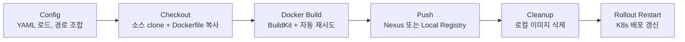
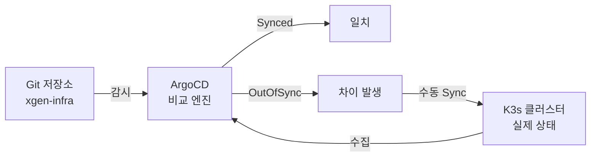
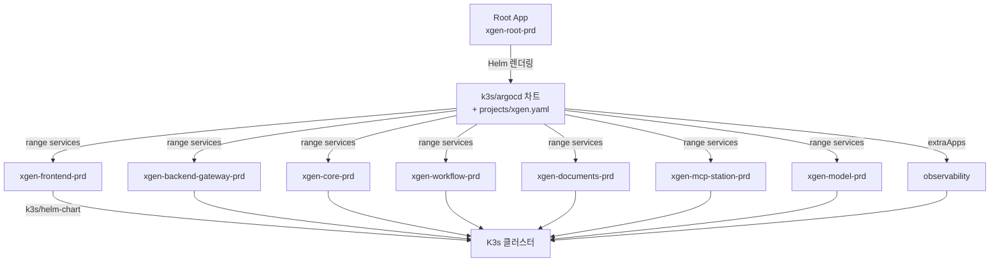
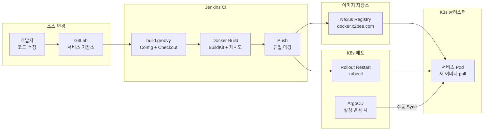

# XGEN K3s 인프라 완전 해부 (4) — CI/CD 파이프라인: Jenkins 빌드에서 ArgoCD 배포까지

XGEN 2.0의 6개 마이크로서비스는 GitLab에서 코드를 커밋하면 Jenkins가 Docker 이미지를 빌드하고, ArgoCD가 K3s 클러스터에 배포하는 구조로 동작한다. 이 글에서는 빌드 파이프라인의 내부 설계부터 GitOps 기반 배포의 전체 흐름까지, 실제 코드를 기반으로 해부한다.

## 시리즈 목차

- 1편: 전체 구조와 컨테이너 빌드 전략
- 2편: Kubernetes 핵심 오브젝트와 스케일링 전략
- 3편: Helm 차트 설계 — 하나의 Chart로 6개 서비스 배포하기
- **4편: CI/CD 파이프라인 — Jenkins 빌드에서 ArgoCD 배포까지** (현재 글)
- 5편: Istio 서비스 메시와 Observability 스택

---

## Part A: Jenkins 빌드 파이프라인

### 1. 설정 3파일 분리 아키텍처

Jenkins 파이프라인 설계의 핵심 원칙은 **코드와 설정의 완전 분리**다. 빌드 로직을 담은 Groovy 스크립트와, 무엇을/어디서/어디에 빌드할지를 정의하는 YAML 설정이 독립적으로 존재한다.

```
k3s/jenkins/
├── build.groovy              ← 파이프라인 로직 (어떻게 빌드할지)
├── build-all.groovy          ← 전체 서비스 병렬 빌드
├── seed-jobs.groovy          ← Job 자동 생성 스크립트
├── config/
│   ├── project.yaml          ← 프로젝트 공통 (어디서 소스를 가져오고 어디에 push할지)
│   ├── services.yaml         ← 서비스 정의 (뭘 빌드할지)
│   └── environments.yaml     ← 환경별 설정 (어디에 배포할지)
├── casc-config.yaml          ← Jenkins Configuration as Code
├── values-override.yaml      ← Jenkins Helm 설치 설정
└── rbac.yaml                 ← K8s RBAC (Jenkins → Deployment 권한)
```

이 구조의 장점은 명확하다. 새 서비스를 추가할 때 `build.groovy`는 한 줄도 건드리지 않는다. `services.yaml`에 블록 하나를 추가하면 끝이다.

#### project.yaml — 프로젝트 공통 설정

모든 빌드 Job이 공유하는 인프라 좌표를 정의한다.

```yaml
# ── 프로젝트 정보 ──
project:
  name: "xgen"                    # K8s namespace, 이미지 경로 등에 사용
  platform: "xgen-platform"      # app.kubernetes.io/part-of 레이블
  group: "xgen2.0"               # GitLab 그룹명
  infraRepo: "xgen-infra"        # 인프라 저장소명

# ── GitLab ──
gitlab:
  url: "https://gitlab.x2bee.com"
  credentialId: "gitlab-credentials"

# ── Docker Registry ──
registry:
  nexus:
    host: "docker.x2bee.com"
    credentialId: "nexus-credentials"
  local:
    host: "localhost:30500"

# ── Kubernetes ──
kubernetes:
  namespace: "xgen"

# ── 사이트 (브랜치 = 사이트) ──
sites:
  - main
  - lotteimall
  - aww

# ── 사이트별 레지스트리 오버라이드 ──
siteRegistries:
  aww:
    host: "43.202.115.195:5000"
    credentialId: "aww-nexus-credentials"
```

`sites` 목록은 Git 브랜치명과 동일하다. `main` 사이트는 `main` 브랜치에서 소스를 가져오고, `lotteimall` 사이트는 `lotteimall` 브랜치에서 가져온다. 브랜치 하나가 곧 배포 단위인 셈이다.

`siteRegistries`는 사이트별로 이미지를 push하는 레지스트리를 오버라이드한다. AWW 고객사는 AWS 환경에 별도 레지스트리가 있어 `aww` 사이트만 다른 호스트로 push한다. 여기에 없는 사이트는 `registry.nexus` 기본값을 사용한다.

#### services.yaml — 서비스 정의

6개 서비스 각각의 빌드 메타데이터를 정의한다.

```yaml
services:
  xgen-frontend:
    repo: "xgen-frontend"
    dockerfile: "dockerfiles/xgen-frontend/Dockerfile.local"
    port: 3000
    healthCheck: "/"

  xgen-backend-gateway:
    repo: "xgen-backend-gateway"
    dockerfile: "dockerfiles/xgen-backend-gateway/Dockerfile"
    port: 8080
    healthCheck: "/health"

  xgen-core:
    repo: "xgen-core"
    dockerfile: "dockerfiles/xgen-python/Dockerfile.local"
    port: 8000
    healthCheck: "/health"

  xgen-workflow:
    repo: "xgen-workflow"
    dockerfile: "dockerfiles/xgen-python/Dockerfile.local"
    port: 8000
    healthCheck: "/health"

  xgen-documents:
    repo: "xgen-documents"
    dockerfile: "dockerfiles/xgen-python/Dockerfile.local"
    port: 8000
    healthCheck: "/health"

  xgen-mcp-station:
    repo: "xgen-mcp-station"
    dockerfile: "dockerfiles/xgen-mcp-station/Dockerfile.local"
    port: 8000
    healthCheck: "/"
```

여기서 주목할 점은 **repo와 dockerfile의 분리**다. 서비스 소스코드(`repo`)는 각 서비스의 GitLab 저장소에 있고, Dockerfile은 `xgen-infra` 저장소의 `dockerfiles/` 디렉토리에 있다. 소스코드와 빌드 정의가 다른 저장소에 존재하는 구조다. 이 설계의 이유는 뒤에서 Checkout 스테이지를 분석할 때 설명한다.

Python 서비스(core, workflow, documents) 3개는 동일한 `xgen-python/Dockerfile.local`을 공유한다. 언어와 런타임이 같으므로 Dockerfile을 복제할 이유가 없다.

#### environments.yaml — 환경별 배포 설정

dev(244 서버)와 prd(243 서버)의 배포 대상 정보를 정의한다.

```yaml
environments:
  dev:
    server:
      ip: "192.168.2.244"
      kubeconfig: ""     # 빈 값 = in-cluster (244 Jenkins가 직접 k3s에 접근)
    argocd:
      server: "localhost:30092"
      appSuffix: "-dev"

  prd:
    server:
      ip: "192.168.2.243"
      kubeconfig: ""     # 빈 값 = in-cluster (243 Jenkins가 직접 k3s에 접근)
    argocd:
      server: "localhost:30092"
      appSuffix: "-prd"
```

`kubeconfig`가 빈 문자열이면 Jenkins Pod가 실행 중인 클러스터에 직접 접근한다(in-cluster). dev와 prd가 물리적으로 다른 서버(244, 243)에 있고, 각 서버에 Jenkins가 별도로 설치되어 있기 때문에 이 구조가 가능하다.

폐쇄망 배포를 위한 `airgapped` 설정도 별도로 존재한다. Nexus 레지스트리에서 이미지를 가져올 수 없는 환경을 위해 이미지를 파일로 export하여 전달하는 경로와 대상 레지스트리를 정의한다.

---

### 2. 빌드 파라미터

Jenkins Job을 실행할 때 7개 파라미터를 선택/입력한다.

| 파라미터 | 타입 | 기본값 | 의미 |
|---|---|---|---|
| `SITE` | choice | main | 소스 브랜치이자 배포 사이트 |
| `TARGET_ENV` | choice | dev | 배포 대상 환경 (dev, prd, both) |
| `TAG` | string | latest | 이미지 버전 태그 |
| `ARCH` | choice | amd64 | CPU 아키텍처 |
| `PUSH_TO_NEXUS` | boolean | true | Nexus Registry에 push 여부 |
| `DEPLOY` | boolean | true | 빌드 후 즉시 K8s 배포 여부 |
| `NO_CACHE` | boolean | false | Docker 캐시 무시하고 처음부터 빌드 |

`SITE`가 브랜치명과 동일한 설계 덕분에, `lotteimall` 사이트를 빌드하면 자동으로 `lotteimall` 브랜치에서 소스를 checkout한다. `PUSH_TO_NEXUS`를 끄면 K3s 내장 로컬 레지스트리(`localhost:30500`)에 push하여, 외부 네트워크 없이도 빌드-배포가 가능하다.

---

### 3. 파이프라인 스테이지별 해부

`build.groovy`는 5개 스테이지로 구성된다. 각 스테이지가 하는 일을 코드 레벨에서 분석한다.



#### Config 스테이지 — YAML 로드와 이미지 경로 조합

3개 YAML을 읽고, Job 이름에서 서비스명을 자동 추출한 뒤, 이미지 경로를 조합하는 단계다.

```groovy
// Job 이름에서 서비스명 추출 (예: xgen-frontend 또는 xgen-build/xgen-frontend)
def jobName = env.JOB_NAME
def serviceName = jobName.contains('/') ? jobName.split('/').last() : jobName
env.SERVICE_NAME = serviceName

// 서비스 설정 로드
def servicesConfig = readYaml file: 'k3s/jenkins/config/services.yaml'
def svc = servicesConfig.services[serviceName]
if (!svc) error "Unknown service: ${serviceName} (Job: ${jobName})"
```

Jenkins Job 이름이 곧 서비스명이다. `seed-jobs.groovy`가 `services.yaml`의 키(`xgen-frontend`, `xgen-core` 등)를 그대로 Job 이름으로 사용하기 때문에, 여기서 `JOB_NAME`을 파싱하면 어떤 서비스를 빌드해야 하는지 바로 알 수 있다. 폴더 구조(`xgen-build/xgen-frontend`)도 `/`로 split하여 처리한다.

이미지 경로 조합 로직은 Nexus와 Local Registry를 분기한다.

```groovy
// 이미지 태그: {tag}-{arch}
def imageTag = "${params.TAG}-${params.ARCH}"

// 빌드 번호 태그: b{번호}-{arch} (롤백/추적용)
def buildTag = "b${env.BUILD_NUMBER}-${params.ARCH}"

if (params.PUSH_TO_NEXUS) {
    // Nexus: {nexus.host}/{project}/{site}/{service}:{tag}-{arch}
    def imageBase = "${env.NEXUS_REGISTRY}/${env.NEXUS_PROJECT}/${params.SITE}/${serviceName}"
    env.TARGET_IMAGE = "${imageBase}:${imageTag}"
    env.BUILD_IMAGE = "${imageBase}:${buildTag}"
} else {
    // Local: {local.host}/{project}/{service}:{tag}-{arch}
    def imageBase = "${env.LOCAL_REGISTRY}/${env.NEXUS_PROJECT}/${serviceName}"
    env.TARGET_IMAGE = "${imageBase}:${imageTag}"
    env.BUILD_IMAGE = "${imageBase}:${buildTag}"
}
```

`TARGET_IMAGE`와 `BUILD_IMAGE` 두 개의 태그를 동시에 생성한다. 이 **듀얼 태깅** 전략은 뒤에서 별도로 분석한다.

사이트별 레지스트리 오버라이드도 이 단계에서 처리한다.

```groovy
// 사이트별 레지스트리 오버라이드 확인
def siteReg = projectConfig.siteRegistries?.get(params.SITE)
if (siteReg) {
    env.NEXUS_REGISTRY = siteReg.host
    env.NEXUS_CRED = siteReg.credentialId
} else {
    env.NEXUS_REGISTRY = projectConfig.registry.nexus.host
    env.NEXUS_CRED = projectConfig.registry.nexus.credentialId
}
```

`aww` 사이트를 선택하면 `siteRegistries.aww.host`인 `43.202.115.195:5000`으로 push하고, `main`이나 `lotteimall`은 기본 Nexus(`docker.x2bee.com`)를 사용한다.

#### Checkout 스테이지 — 소스코드와 Dockerfile이 만나는 지점

Checkout은 두 저장소에서 파일을 가져오는 과정이다.

```groovy
stage('Checkout') {
    steps {
        dir('app') {
            git branch: env.BUILD_BRANCH,
                credentialsId: GITLAB_CRED,
                url: env.SERVICE_REPO
        }

        // Dockerfile 복사 (.local 확장자 처리)
        script {
            def dockerfile = env.DOCKERFILE
            def dockerDir = dockerfile.replaceAll('/Dockerfile(\\.local)?$', '')
            sh """
                cp ${dockerfile} app/Dockerfile
                [ -f ${dockerDir}/.dockerignore ] && cp ${dockerDir}/.dockerignore app/ || true
                [ -f ${dockerDir}/entrypoint.sh ] && cp ${dockerDir}/entrypoint.sh app/ || true
            """
        }
    }
}
```

동작 순서는 다음과 같다.

1. `app/` 디렉토리에 서비스 소스코드를 clone한다 (예: `xgen-core` 저장소의 `main` 브랜치)
2. 현재 워크스페이스(xgen-infra)의 `dockerfiles/` 디렉토리에서 Dockerfile을 `app/Dockerfile`로 복사한다
3. `.dockerignore`와 `entrypoint.sh`가 있으면 함께 복사한다

소스코드와 Dockerfile이 다른 저장소에 있는 이유가 여기서 드러난다. Dockerfile은 인프라 관심사(베이스 이미지, 빌드 도구, 실행 환경)를 정의하고, 서비스 소스코드는 비즈니스 로직만 담는다. 인프라 팀이 Dockerfile을 중앙에서 관리하면서, 서비스 개발자는 소스코드만 수정하면 되는 구조다. Python 서비스 3개가 같은 Dockerfile을 공유할 수 있는 것도 이 분리 덕분이다.

#### Docker Build 스테이지 — BuildKit 캐시와 자동 재시도

빌드 스테이지의 핵심은 캐시 오류 자동 감지 및 재시도 메커니즘이다.

```groovy
environment {
    DOCKER_BUILDKIT = '1'
}

stage('Docker Build') {
    steps {
        dir('app') {
            script {
                def buildArgs = "--build-arg TARGETARCH=${params.ARCH}"

                if (params.NO_CACHE) {
                    buildArgs += " --no-cache"
                    sh "docker builder prune -af || true"
                }

                def maxRetries = 2
                def retryCount = 0
                def buildSuccess = false

                while (!buildSuccess && retryCount < maxRetries) {
                    try {
                        sh """
                            docker build ${buildArgs} \
                                -t ${env.TARGET_IMAGE} \
                                -t ${env.BUILD_IMAGE} \
                                -f Dockerfile .
                        """
                        buildSuccess = true
                    } catch (Exception e) {
                        retryCount++
                        def errorMsg = e.getMessage()

                        if (errorMsg.contains('unknown parent image') ||
                            errorMsg.contains('failed to export image') ||
                            errorMsg.contains('failed to set parent')) {

                            if (retryCount < maxRetries) {
                                sh """
                                    docker builder prune -f || true
                                    docker image prune -f || true
                                """
                                buildArgs = "--build-arg TARGETARCH=${params.ARCH} --no-cache"
                            } else {
                                error "Docker 빌드 실패 (캐시 오류)"
                            }
                        } else {
                            throw e
                        }
                    }
                }
            }
        }
    }
}
```

`DOCKER_BUILDKIT=1`로 BuildKit을 활성화한다. BuildKit은 레이어 병렬 빌드, 캐시 마운트(`--mount=type=cache`), 더 나은 캐시 관리를 제공하지만, 간헐적으로 캐시가 깨지는 문제가 있었다. `unknown parent image`, `failed to export image`, `failed to set parent` — 이 세 가지 에러는 BuildKit 캐시 손상 시 발생하는 대표적 증상이다.

자동 재시도 로직은 이 문제를 해결한다.

1. 첫 빌드 시도에서 캐시 오류가 발생하면
2. `docker builder prune -f`로 BuildKit 캐시를 정리하고
3. `--no-cache` 옵션을 추가하여 재시도한다
4. 최대 2회까지 시도하고, 그래도 실패하면 에러를 던진다

이 패턴 덕분에 개발자가 수동으로 Jenkins 서버에 접속하여 `docker system prune`을 실행할 일이 대폭 줄었다. 캐시 오류가 아닌 다른 예외(소스코드 컴파일 에러 등)는 즉시 `throw`하여 불필요한 재시도를 하지 않는다.

빌드 시 `-t` 옵션을 두 번 사용하여 하나의 이미지에 두 개의 태그를 동시에 부여한다는 점도 중요하다. 이것이 듀얼 태깅의 시작점이다.

#### Push 스테이지 — Nexus와 Local Registry 분기

```groovy
stage('Push to Registry') {
    steps {
        script {
            if (params.PUSH_TO_NEXUS) {
                withCredentials([usernamePassword(
                    credentialsId: NEXUS_CRED,
                    usernameVariable: 'NEXUS_USER',
                    passwordVariable: 'NEXUS_PASS'
                )]) {
                    sh """
                        echo "\${NEXUS_PASS}" | docker login -u "\${NEXUS_USER}" \
                            --password-stdin ${NEXUS_REGISTRY}
                        docker push ${env.TARGET_IMAGE}
                        docker push ${env.BUILD_IMAGE}
                    """
                }
            } else {
                sh """
                    docker push ${env.TARGET_IMAGE}
                    docker push ${env.BUILD_IMAGE}
                """
            }
        }
    }
}
```

Nexus는 인증이 필요하므로 `withCredentials`로 Jenkins Credentials를 주입한다. Local Registry(`localhost:30500`)는 K3s 클러스터 내부이므로 인증 없이 push한다. 두 경우 모두 `TARGET_IMAGE`와 `BUILD_IMAGE` 두 태그를 push한다.

Push 후에는 로컬 디스크 정리를 위해 이미지를 삭제한다.

```groovy
stage('Cleanup') {
    steps {
        sh """
            docker rmi ${env.TARGET_IMAGE} || true
            docker rmi ${env.BUILD_IMAGE} || true
        """
    }
}
```

#### Rollout Restart 스테이지 — K8s 배포 갱신

`DEPLOY` 파라미터가 true일 때만 실행되는 마지막 스테이지다.

```groovy
stage('Rollout Restart') {
    when {
        expression { params.DEPLOY }
    }
    steps {
        script {
            def deploymentName = env.SERVICE_NAME
            def namespace = env.K8S_NAMESPACE
            def targetEnv = env.TARGET_ENV
            def envConfig = readYaml file: 'k3s/jenkins/config/environments.yaml'

            // dev 환경 배포
            if (targetEnv == 'dev' || targetEnv == 'both') {
                def devKubeconfig = envConfig.environments.dev?.server?.kubeconfig ?: ''
                def kubeconfigOpt = devKubeconfig ? "--kubeconfig=${devKubeconfig}" : ''
                sh """
                    kubectl ${kubeconfigOpt} rollout restart \
                        deployment/${deploymentName} -n ${namespace} \
                        || echo "Rollout restart skipped on dev"
                    kubectl ${kubeconfigOpt} rollout status \
                        deployment/${deploymentName} -n ${namespace} --timeout=120s \
                        || echo "Rollout status check skipped on dev"
                """
            }

            // prd 환경 배포
            if (targetEnv == 'prd' || targetEnv == 'both') {
                def prdKubeconfig = envConfig.environments.prd?.server?.kubeconfig ?: ''
                if (prdKubeconfig) {
                    sh """
                        if [ -f ${prdKubeconfig} ]; then
                            kubectl --kubeconfig=${prdKubeconfig} rollout restart \
                                deployment/${deploymentName} -n ${namespace}
                            kubectl --kubeconfig=${prdKubeconfig} rollout status \
                                deployment/${deploymentName} -n ${namespace} --timeout=120s
                        fi
                    """
                } else {
                    sh """
                        kubectl rollout restart deployment/${deploymentName} -n ${namespace}
                        kubectl rollout status deployment/${deploymentName} -n ${namespace} --timeout=120s
                    """
                }
            }
        }
    }
}
```

`kubectl rollout restart`는 Deployment의 Pod를 순차적으로 재생성한다. `latest` 태그를 사용하는 경우 이미지 내용이 바뀌어도 태그 자체는 동일하므로 K8s가 변경을 감지하지 못한다. 그래서 `rollout restart`로 강제 재시작하여 새 이미지를 pull하게 만든다.

`rollout status --timeout=120s`는 새 Pod가 Ready 상태가 될 때까지 최대 2분간 대기한다. 이 타임아웃 내에 Health Check가 통과하지 못하면 경고를 출력하지만, 빌드 자체를 실패시키지는 않는다(`|| echo`).

`TARGET_ENV`가 `both`이면 dev와 prd 모두에 순차적으로 배포한다. 이 기능은 hotfix 시 두 환경을 한 번에 갱신할 때 사용한다.

Jenkins가 `kubectl`을 실행하려면 K8s RBAC 권한이 필요하다. `rbac.yaml`에서 `jenkins-deploy` ClusterRole을 정의한다.

```yaml
apiVersion: rbac.authorization.k8s.io/v1
kind: ClusterRole
metadata:
  name: jenkins-deploy
rules:
  - apiGroups: ["apps"]
    resources: ["deployments"]
    verbs: ["get", "list", "watch", "patch", "update"]
  - apiGroups: ["apps"]
    resources: ["deployments/scale"]
    verbs: ["get", "patch"]
  - apiGroups: [""]
    resources: ["pods"]
    verbs: ["get", "list", "watch"]
```

최소 권한 원칙에 따라 Deployment의 get/list/watch/patch/update만 허용한다. Pod를 직접 삭제하거나 Secret에 접근하는 권한은 주지 않는다. `deployments/scale`은 `rollout restart`가 내부적으로 Deployment의 annotation을 patch하기 위해 필요하다.

---

### 4. seed-jobs.groovy — Job 자동 생성

Jenkins Job을 수동으로 하나씩 만드는 것은 6개 서비스 규모에서도 번거롭고 실수가 발생하기 쉽다. `seed-jobs.groovy`는 `services.yaml`을 읽어 모든 Job을 코드로 자동 생성한다.

```groovy
// ── 프로젝트 설정 로드 ──
def projectConfig = new groovy.yaml.YamlSlurper().parseText(
    readFileFromWorkspace('k3s/jenkins/config/project.yaml')
)
def servicesConfig = new groovy.yaml.YamlSlurper().parseText(
    readFileFromWorkspace('k3s/jenkins/config/services.yaml')
)

def infraRepoUrl = "${gitlabUrl}/${projectGroup}/${infraRepo}.git"
def sites = projectConfig.sites ?: ['main']
def services = servicesConfig.services.keySet().toList()

// ── 서비스별 빌드 Job ──
services.each { svc ->
    pipelineJob("${svc}") {
        displayName("${svc}")
        description("${svc} 서비스 빌드")

        parameters {
            choiceParam('SITE', sites, '배포 대상 사이트')
            choiceParam('TARGET_ENV', ['dev', 'prd', 'both'], '배포 대상 환경')
            stringParam('TAG', 'latest', '이미지 버전 태그')
            choiceParam('ARCH', ['amd64', 'arm64'], '서버 CPU 아키텍처')
            booleanParam('PUSH_TO_NEXUS', true, 'Nexus에 업로드')
            booleanParam('DEPLOY', true, '빌드 후 K8s에 자동 배포')
            booleanParam('NO_CACHE', false, '캐시 무시하고 새로 빌드')
        }

        definition {
            cpsScm {
                scm {
                    git {
                        remote {
                            url(infraRepoUrl)
                            credentials('gitlab-credentials')
                        }
                        branches('*/refactoring')
                    }
                }
                scriptPath('k3s/jenkins/build.groovy')
            }
        }
    }
}
```

`services.yaml`의 키를 순회하며 `pipelineJob`을 생성한다. 모든 Job이 동일한 `build.groovy`를 `scriptPath`로 지정하되, Job 이름이 서비스명이므로 `build.groovy`의 Config 스테이지에서 `JOB_NAME`으로 어떤 서비스를 빌드할지 자동 결정된다.

`SITE` choice의 선택지는 `project.yaml`의 `sites` 목록에서 가져온다. 사이트가 추가되면 `project.yaml`에 한 줄 추가하면 모든 Job의 파라미터가 자동 갱신된다.

#### build-all Job — 6개 서비스 병렬 빌드

`seed-jobs.groovy`는 개별 서비스 Job 외에 `build-all` Job도 생성한다. `build-all.groovy`는 전체 서비스를 병렬로 빌드한다.

```groovy
stage('Build All') {
    steps {
        script {
            def services = env.SERVICE_LIST.split(',')
            def builds = [:]

            services.each { svc ->
                builds[svc] = {
                    build job: svc,
                        parameters: [
                            string(name: 'SITE', value: params.SITE),
                            string(name: 'TARGET_ENV', value: params.TARGET_ENV),
                            string(name: 'TAG', value: params.TAG),
                            string(name: 'ARCH', value: params.ARCH),
                            [$class: 'BooleanParameterValue', name: 'PUSH_TO_NEXUS', value: params.PUSH_TO_NEXUS],
                            [$class: 'BooleanParameterValue', name: 'DEPLOY', value: params.DEPLOY],
                            [$class: 'BooleanParameterValue', name: 'NO_CACHE', value: params.NO_CACHE]
                        ],
                        wait: true,
                        propagate: false
                }
            }

            def results = parallel builds

            // 결과 집계
            def failed = []
            def succeeded = []
            results.each { name, run ->
                if (run.result == 'SUCCESS') {
                    succeeded << name
                } else {
                    failed << name
                }
            }

            if (failed) {
                currentBuild.result = 'UNSTABLE'
            }
        }
    }
}
```

핵심은 `propagate: false`다. 이 옵션이 없으면 한 서비스 빌드가 실패했을 때 전체 병렬 빌드가 중단된다. `propagate: false`로 설정하면 개별 서비스 실패와 관계없이 나머지 서비스는 계속 빌드한다. 결과를 집계하여 하나라도 실패하면 전체 빌드를 `UNSTABLE`로 표시하되, 성공한 서비스의 배포는 진행된다.

---

### 5. 이미지 태그 전략 — 듀얼 태깅

초기에는 `latest` 태그 하나만 사용했다. 빌드할 때마다 `latest`를 덮어씀으로써 항상 최신 이미지가 배포되는 구조였다. 단순하지만 치명적인 문제가 있었다 — **롤백이 불가능하다**.

`latest`는 항상 마지막 빌드를 가리키므로, 이전 버전으로 되돌리려면 소스를 revert하고 다시 빌드해야 한다. 장애 대응 시 이 과정은 너무 느리다.

듀얼 태깅은 이 문제를 해결한다. 매 빌드마다 두 개의 태그를 동시에 생성한다.

```
docker.x2bee.com/xgen/main/xgen-core:latest-amd64     ← 항상 최신 (기존과 동일)
docker.x2bee.com/xgen/main/xgen-core:b42-amd64         ← 빌드 번호 고정 (롤백용)
```

- `latest-amd64`: 매 빌드마다 덮어쓴다. K8s `imagePullPolicy: Always` 환경에서 `rollout restart`만으로 최신 이미지를 적용할 수 있다.
- `b{BUILD_NUMBER}-amd64`: Jenkins 빌드 번호가 포함된 불변 태그. 레지스트리에 빌드 이력이 쌓인다.

롤백 시에는 빌드 번호 태그를 지정하면 된다.

```bash
# 빌드 42번으로 롤백
kubectl set image deploy/xgen-core \
    xgen-core=docker.x2bee.com/xgen/main/xgen-core:b42-amd64 \
    -n xgen
```

빌드 성공 시 출력되는 메시지에도 롤백 명령어가 포함되어, 복사-붙여넣기만으로 즉시 실행할 수 있다.

```
╔════════════════════════════════════════════════════╗
║              BUILD SUCCESS                          ║
╠════════════════════════════════════════════════════╣
║ Image   : docker.x2bee.com/xgen/main/xgen-core:latest-amd64
║ Build   : docker.x2bee.com/xgen/main/xgen-core:b42-amd64
╠════════════════════════════════════════════════════╣
║ 롤백 시:
║ kubectl set image deploy/xgen-core
║   xgen-core=docker.x2bee.com/xgen/main/xgen-core:b42-amd64
║   -n xgen
╚════════════════════════════════════════════════════╝
```

---

## Part B: ArgoCD GitOps 배포

### 6. GitOps — Git이 진실의 원천

Jenkins가 "이미지를 어떻게 빌드하는가"에 집중한다면, ArgoCD는 "클러스터 상태가 어떠해야 하는가"를 관리한다. GitOps의 핵심 원칙은 단순하다.

**Git 저장소의 선언적 설정이 클러스터의 기대 상태(Desired State)다.** ArgoCD는 Git의 설정과 실제 클러스터 상태를 지속적으로 비교하여, 일치하면 `Synced`, 불일치하면 `OutOfSync`로 표시한다.



XGEN에서는 `xgen-infra` 저장소의 `k3s/` 디렉토리가 클러스터의 기대 상태를 정의한다. Helm Chart, ArgoCD 설정, Observability 스택 — 모두 이 저장소에 선언되어 있고, ArgoCD가 이를 클러스터에 반영한다.

---

### 7. App of Apps 패턴 — 3단계 계층 구조

6개 서비스를 ArgoCD에 하나씩 등록하면, 서비스가 추가될 때마다 ArgoCD Application을 수동으로 만들어야 한다. App of Apps 패턴은 이 문제를 해결한다. ArgoCD Application이 다른 Application을 생성하는 계층 구조다.



3단계로 동작한다.

**1단계: Root App이 ArgoCD 차트를 렌더링한다.**
Root App(`xgen-root-prd.yaml`)은 `k3s/argocd` 경로의 Helm 차트를 `projects/xgen.yaml`을 values 파일로 사용하여 렌더링한다.

**2단계: 템플릿이 서비스 목록을 순회하며 Application을 생성한다.**
`templates/application.yaml`이 `projects/xgen.yaml`의 `environments.prd.services[]`를 `range`로 순회하며, 서비스별 ArgoCD Application 리소스를 생성한다.

**3단계: 각 Application이 Helm Chart를 사용하여 K8s 리소스를 배포한다.**
생성된 각 Application(`xgen-frontend-prd`, `xgen-core-prd` 등)은 `k3s/helm-chart`를 소스로 하여 Deployment, Service, ConfigMap 등을 클러스터에 배포한다.

#### Root App — 진입점

```yaml
# k3s/argocd/root-apps/xgen-root-prd.yaml
apiVersion: argoproj.io/v1alpha1
kind: Application
metadata:
  name: xgen-root-prd
  namespace: argocd
spec:
  project: default
  source:
    repoURL: https://gitlab.x2bee.com/xgen2.0/xgen-infra.git
    targetRevision: main
    path: k3s/argocd
    helm:
      valueFiles:
        - projects/xgen.yaml
      parameters:
        - name: env
          value: prd
  destination:
    server: https://kubernetes.default.svc
    namespace: argocd
  syncPolicy:
    syncOptions:
      - CreateNamespace=true
```

이 파일은 각 서버에서 최초 1회만 `kubectl apply`로 등록한다. 이후 모든 변경은 `projects/xgen.yaml`을 수정하고 git push한 뒤 ArgoCD에서 수동 sync하면 반영된다.

`path: k3s/argocd`가 Helm 차트 경로이고, `valueFiles`로 `projects/xgen.yaml`을 주입한다. `parameters`로 `env=prd`를 전달하여 환경을 결정한다. dev 환경은 별도 Root App(`xgen-root-dev.yaml`)이 `env=dev`를 전달한다.

---

### 8. projects/xgen.yaml — 단일 진입점

이 파일이 전체 배포 설정의 단일 진입점이다. 프로젝트 정보, 환경별 도메인, 이미지 경로, 공통 환경변수, 서비스별 리소스 할당까지 모든 것이 여기에 있다.

```yaml
project:
  name: xgen
  description: "xgen2.0 Platform"
  namespace: xgen

source:
  repoURL: https://gitlab.x2bee.com/xgen2.0/xgen-infra.git
  targetRevision: main

# ── 환경별 배포 대상 클러스터 + 도메인 ──
destinations:
  prd:
    server: https://kubernetes.default.svc
    domain: "jeju-xgen.x2bee.com"
  dev:
    server: https://kubernetes.default.svc
    domain: "xgen.x2bee.com"

site: main

# ── 프로젝트 공통 환경변수 (모든 서비스 ConfigMap에 주입) ──
vars:
  APP_SITE: "xgen-x2bee-com"
  MINIO_PUBLIC_ENDPOINT: "https://minio-xgen.x2bee.com"
```

`destinations`는 환경별로 클러스터 주소와 도메인을 정의한다. 두 환경 모두 `kubernetes.default.svc`인 이유는, 각 서버(243/244)에 ArgoCD가 별도로 설치되어 있고, 각자의 로컬 클러스터만 관리하기 때문이다.

`vars`에 정의된 환경변수는 ArgoCD가 모든 서비스의 Helm 파라미터로 주입한다. 서비스별 ConfigMap의 `config.APP_SITE`, `config.MINIO_PUBLIC_ENDPOINT`로 들어가게 된다.

핵심은 `environments` 섹션이다. 환경별로 어떤 서비스를 몇 개의 replica로, 얼마만큼의 리소스를 할당하여 배포할지를 정의한다.

```yaml
environments:
  prd:
    services:
      - name: xgen-frontend
        hasDomain: true
        replicas: 2
        autoscaling: { minReplicas: 2, maxReplicas: 4 }
        resources:
          requests: { memory: "512Mi", cpu: "200m" }
          limits:   { memory: "2Gi",   cpu: "1000m" }

      - name: xgen-core
        replicas: 2
        autoscaling: { minReplicas: 2, maxReplicas: 4 }
        resources:
          requests: { memory: "512Mi", cpu: "200m" }
          limits:   { memory: "4Gi",  cpu: "1000m" }

      - name: xgen-documents
        replicas: 2
        autoscaling: { minReplicas: 2, maxReplicas: 4 }
        resources:
          requests: { memory: "1Gi",  cpu: "500m" }
          limits:   { memory: "16Gi", cpu: "4000m" }

      - name: xgen-model
        replicas: 1
        autoscaling: { enabled: false }
        resources:
          requests: { memory: "8Gi",  cpu: "2000m" }
          limits:   { memory: "24Gi", cpu: "8000m" }

  dev:
    services:
      - name: xgen-frontend
        hasDomain: true
        replicas: 1
        autoscaling:
          minReplicas: 1

      - name: xgen-core
        replicas: 1
        autoscaling:
          minReplicas: 1
        resources:
          requests: { memory: "512Mi", cpu: "100m" }
          limits:   { memory: "2Gi",   cpu: "500m" }
      # xgen-model은 dev 미배포 (목록에서 제외)
```

prd와 dev의 차이가 선명하다. prd는 모든 서비스가 2 replica + 오토스케일링(최대 4)이고, `xgen-documents`는 임베딩 처리를 위해 메모리 16Gi까지 허용한다. `xgen-model`은 LLM 서빙이므로 메모리 24Gi를 할당하되, 오토스케일링은 비활성화한다.

dev는 모든 서비스가 1 replica이고, `xgen-model`은 dev 환경에서 배포하지 않는다(목록에서 제외). 서비스 목록에서 빼기만 하면 ArgoCD가 해당 Application을 생성하지 않으므로, 배포에서 자동 제외된다.

이 파일 하나를 수정하는 것으로 다음이 모두 가능하다.

- 서비스 추가/제거: `services` 배열에 항목 추가/삭제
- 리소스 조정: `resources` 값 변경
- 스케일링 정책 변경: `autoscaling` 값 변경
- 환경변수 추가: `vars`에 키-값 추가
- 도메인 변경: `destinations.{env}.domain` 수정

#### 멀티 프로젝트 확장

같은 템플릿으로 다른 고객사도 배포할 수 있다. AWW(AWS EKS) 고객사의 `projects/xgen-aww.yaml`은 `xgen.yaml`과 동일한 구조를 따르되, 인프라 주소만 오버라이드한다.

```yaml
# projects/xgen-aww.yaml (일부)
site: aww
registryHost: "10.100.1.65:5000"

infra:
  postgres:
    host: "10.100.1.70"
  redis:
    host: "10.100.1.70"
  minio:
    endpoint: "https://s3.ap-northeast-2.amazonaws.com"
```

온프레미스(`xgen.yaml`)와 AWS(`xgen-aww.yaml`)가 동일한 ArgoCD 템플릿과 Helm Chart를 공유하면서, 환경 차이는 values 파일로만 표현한다. 새 고객사가 추가되면 `projects/` 디렉토리에 YAML 파일 하나와 Root App 하나를 만들면 된다.

---

### 9. application.yaml 템플릿 — 서비스 자동 생성의 핵심

`templates/application.yaml`은 `projects/xgen.yaml`의 서비스 목록을 순회하며 ArgoCD Application 리소스를 생성하는 Go 템플릿이다.

```go-template
{{- $env := $.Values.env | default "dev" }}
{{- $envCfg := dict }}
{{- if $.Values.environments }}
  {{- $envCfg = index $.Values.environments $env | default dict }}
{{- end }}
{{- $serviceList := $envCfg.services | default $.Values.services }}
{{- $destServer := $.Values.destination.server }}
{{- $domain := $.Values.domain | default "" }}
{{- if $.Values.destinations }}
  {{- $envDest := index $.Values.destinations $env }}
  {{- if $envDest }}
    {{- if $envDest.server }}
      {{- $destServer = $envDest.server }}
    {{- end }}
    {{- if $envDest.domain }}
      {{- $domain = $envDest.domain }}
    {{- end }}
  {{- end }}
{{- end }}
```

서비스 목록을 결정하는 로직이 중요하다. `environments.{env}.services`가 있으면 이를 사용하고, 없으면 최상위 `services[]`로 fallback한다. prd 환경에서 `xgen-model`을 배포하지만 dev에서는 빼는 것이 이 로직으로 가능하다.

각 서비스에 대해 Application을 생성하는 핵심 부분은 다음과 같다.

```go-template
{{- range $serviceList }}
---
apiVersion: argoproj.io/v1alpha1
kind: Application
metadata:
  name: {{ .name }}-{{ $env }}
  namespace: argocd
  finalizers:
    - resources-finalizer.argocd.argoproj.io
spec:
  project: {{ $.Values.project.name }}

  source:
    repoURL: {{ $.Values.source.repoURL }}
    targetRevision: {{ $.Values.source.targetRevision }}
    path: {{ $.Values.source.chartPath }}
    helm:
      valueFiles:
        - values/{{ .valuesFile | default (printf "%s.yaml" .name) }}
      parameters:
        - name: env
          value: {{ $env | quote }}
        {{- if $.Values.site }}
        - name: global.registry.site
          value: {{ $.Values.site | quote }}
        {{- end }}
        {{- if and .hasDomain $domain }}
        - name: domain
          value: {{ $domain | quote }}
        {{- end }}
        {{- range $k, $v := $.Values.vars }}
        - name: config.{{ $k }}
          value: {{ $v | quote }}
        {{- end }}
        {{- with .resources }}
        - name: resources.requests.memory
          value: {{ .requests.memory | quote }}
        - name: resources.requests.cpu
          value: {{ .requests.cpu | quote }}
        - name: resources.limits.memory
          value: {{ .limits.memory | quote }}
        - name: resources.limits.cpu
          value: {{ .limits.cpu | quote }}
        {{- end }}
        {{- if .replicas }}
        - name: replicas
          value: {{ .replicas | quote }}
        {{- end }}
        {{- with .autoscaling }}
        {{- if .minReplicas }}
        - name: autoscaling.minReplicas
          value: {{ .minReplicas | quote }}
        {{- end }}
        {{- if .maxReplicas }}
        - name: autoscaling.maxReplicas
          value: {{ .maxReplicas | quote }}
        {{- end }}
        {{- end }}

  destination:
    server: {{ $destServer }}
    namespace: {{ .namespace | default $.Values.project.namespace }}

  syncPolicy:
    syncOptions:
      - CreateNamespace=true
      - PruneLast=true

  ignoreDifferences:
    - group: apps
      kind: Deployment
      jsonPointers:
        - /spec/replicas
{{- end }}
```

이 템플릿이 하는 일을 단계별로 정리한다.

1. **Application 이름**: `{서비스명}-{환경}` 형식 (예: `xgen-core-prd`, `xgen-frontend-dev`)
2. **소스 설정**: `k3s/helm-chart` 경로의 Helm 차트를 사용하고, `values/{서비스명}.yaml`을 values 파일로 지정
3. **파라미터 주입**: 환경(`env`), 레지스트리 경로(`global.registry.site`), 도메인, 공통 환경변수(`config.*`), 리소스, replica, 오토스케일링 — 모두 Helm 파라미터로 전달
4. **도메인 선택적 주입**: `hasDomain: true`인 서비스(frontend)에만 도메인 파라미터를 주입
5. **리소스 오버라이드**: `projects/xgen.yaml`에서 정의한 `resources`, `replicas`, `autoscaling` 값이 서비스별 values 파일의 기본값을 오버라이드

`vars`의 처리 방식이 흥미롭다. `range $k, $v := $.Values.vars`로 모든 키-값 쌍을 순회하며 `config.{키}` 형태의 Helm 파라미터로 변환한다. 이렇게 하면 Helm Chart의 `configMap.yaml` 템플릿에서 `{{ .Values.config }}` 아래의 모든 값이 ConfigMap 데이터로 들어간다. 서비스 코드에서는 환경변수 `APP_SITE`, `MINIO_PUBLIC_ENDPOINT`로 접근할 수 있다.

`extraApps`도 처리한다. Observability 스택처럼 Helm이 아닌 Kustomize 기반 앱도 같은 패턴으로 Application을 생성한다.

```go-template
{{- range .Values.extraApps }}
---
apiVersion: argoproj.io/v1alpha1
kind: Application
metadata:
  name: {{ .name }}
  namespace: argocd
spec:
  project: {{ $.Values.project.name }}
  source:
    repoURL: {{ $.Values.source.repoURL }}
    targetRevision: {{ $.Values.source.targetRevision }}
    path: {{ .path }}
  destination:
    server: {{ .server | default $destServer }}
    namespace: {{ .namespace | default $.Values.project.namespace }}
{{- end }}
```

---

### 10. syncPolicy — 수동 Sync를 선택한 이유

Root App과 서비스 Application 모두 **자동 sync를 사용하지 않는다**. `syncPolicy`에 `automated`가 없다.

```yaml
syncPolicy:
  syncOptions:
    - CreateNamespace=true
    - PruneLast=true
```

자동 sync를 비활성화한 이유는 세 가지다.

**안전성**: 실수로 잘못된 설정을 push해도 즉시 클러스터에 반영되지 않는다. push 후 ArgoCD UI에서 diff를 확인하고, 문제가 없을 때만 수동 sync를 실행한다. git revert할 시간이 확보된다.

**배포 타이밍 컨트롤**: 야간에 push해두고 업무 시간에 배포하거나, 여러 설정 변경을 모아서 한 번에 sync하는 것이 가능하다. 자동 sync는 push할 때마다 즉시 반영되므로 이런 유연성이 없다.

**HPA와의 충돌 방지**: HPA(Horizontal Pod Autoscaler)가 부하에 따라 replicas를 조정하면, Git에 선언된 replicas 값과 실제 클러스터 값이 달라진다. 자동 sync가 켜져 있으면 ArgoCD가 이를 OutOfSync로 판단하고 다시 Git 값으로 되돌려 HPA의 스케일링을 무효화한다.

`ignoreDifferences`로 이 문제를 추가로 방어한다.

```yaml
ignoreDifferences:
  - group: apps
    kind: Deployment
    jsonPointers:
      - /spec/replicas
```

Deployment의 `/spec/replicas` 필드 차이를 무시하도록 설정하여, HPA가 replicas를 변경해도 ArgoCD가 OutOfSync로 표시하지 않는다.

---

### 11. 두 가지 배포 방식

XGEN의 배포 경로는 두 가지다. 무엇이 변경되었는지에 따라 경로가 달라진다.

| 변경 대상 | 배포 방식 | 트리거 | 동작 |
|---|---|---|---|
| 서비스 소스코드 | Jenkins `DEPLOY=true` | Jenkins 수동 빌드 | 이미지 빌드 → Registry push → `rollout restart` |
| 인프라 설정 (Helm values, 리소스, 환경변수) | ArgoCD 수동 Sync | `xgen-infra` push 후 ArgoCD UI에서 Sync | Git 설정 → K8s 클러스터 반영 |

**소스코드 변경 시**: 개발자가 서비스 소스코드를 수정하고 GitLab에 push하면, Jenkins에서 해당 서비스의 빌드 Job을 실행한다. `DEPLOY=true`이면 빌드 완료 후 자동으로 `rollout restart`를 실행하여 새 이미지가 적용된다. 이 경로에서 ArgoCD는 관여하지 않는다.

**인프라 설정 변경 시**: `xgen-infra` 저장소의 Helm values, `projects/xgen.yaml`의 리소스/환경변수, ConfigMap 등을 수정하고 push하면, ArgoCD가 변경을 감지하여 OutOfSync를 표시한다. 운영자가 ArgoCD UI에서 diff를 확인하고 수동 sync를 실행하면 클러스터에 반영된다.

두 경로가 분리되어 있어, 소스코드 배포와 인프라 설정 변경을 독립적으로 관리할 수 있다.

---

### 12. 전체 CI/CD 플로우

소스코드 변경부터 클러스터 배포까지의 전체 흐름을 다이어그램으로 정리한다.



**코드 변경 배포 경로** (실선): GitLab → Jenkins → Docker Build → Nexus Push → Rollout Restart → Pod 재생성

**설정 변경 배포 경로**: xgen-infra push → ArgoCD 감지 → 수동 Sync → 클러스터 반영

---

## Jenkins 인프라 설정

Jenkins 자체도 Helm으로 설치하고 JCasC(Jenkins Configuration as Code)로 설정을 자동화했다. `values-override.yaml`에 Credentials, 플러그인, Job 정의까지 모두 포함되어, Jenkins를 삭제하고 다시 설치해도 동일한 상태가 복원된다.

```yaml
controller:
  admin:
    username: admin
    password: xgen-jenkins

  serviceType: NodePort
  nodePort: 30090

  JCasC:
    defaultConfig: false
    configScripts:
      xgen-config: |
        jenkins:
          systemMessage: "XGEN 2.0 CI/CD Server"
          numExecutors: 6
```

`numExecutors: 6`은 6개 서비스를 `build-all`로 동시에 빌드할 수 있는 설정이다. 서비스 수와 executor 수가 일치해야 병렬 빌드에서 대기가 발생하지 않는다.

Docker와 kubectl 바이너리는 호스트에서 마운트한다.

```yaml
persistence:
  volumes:
    - name: docker-socket
      hostPath:
        path: /var/run/docker.sock
    - name: docker-bin
      hostPath:
        path: /usr/bin/docker
    - name: kubectl-bin
      hostPath:
        path: /usr/local/bin/k3s
  mounts:
    - name: docker-socket
      mountPath: /var/run/docker.sock
    - name: docker-bin
      mountPath: /usr/bin/docker
    - name: kubectl-bin
      mountPath: /usr/local/bin/kubectl
```

Jenkins Pod 안에서 호스트의 Docker 데몬 소켓을 직접 사용한다(DinD가 아닌 DooD 방식). K3s 바이너리는 `kubectl`과 호환되므로 `/usr/local/bin/kubectl`로 마운트한다.

---

## 정리

### 설정 변경 → 배포 시나리오별 수정 포인트

**서비스 소스코드 변경** (가장 빈번):

1. 서비스 저장소에서 코드 수정 → GitLab push
2. Jenkins에서 해당 서비스 Job 실행 (`DEPLOY=true`)
3. 끝. 수정할 설정 파일 없음.

**서비스 추가** (예: `xgen-analytics` 서비스 신규):

1. `k3s/jenkins/config/services.yaml`: 서비스 블록 추가
2. `k3s/helm-chart/values/xgen-analytics.yaml`: 서비스별 Helm values 생성
3. `k3s/argocd/projects/xgen.yaml`: `environments.{env}.services[]`에 서비스 추가
4. Jenkins seed job 재실행 (새 Job 자동 생성)

**리소스/스케일링 조정**:

1. `k3s/argocd/projects/xgen.yaml`: 해당 서비스의 `resources` 또는 `autoscaling` 수정
2. `xgen-infra`에 push → ArgoCD 수동 sync

**환경변수 추가**:

1. `k3s/argocd/projects/xgen.yaml`: `vars` 섹션에 키-값 추가
2. `xgen-infra`에 push → ArgoCD 수동 sync → 모든 서비스에 자동 반영

### 설계 판단 요약

- **코드-설정 분리**: `build.groovy` 로직과 YAML 설정을 분리하여, 서비스 추가 시 파이프라인 코드 변경 없이 YAML만 수정
- **듀얼 태깅**: `latest` + 빌드 번호 태그로 최신 배포 편의성과 롤백 가능성을 동시 확보
- **캐시 오류 자동 재시도**: BuildKit 캐시 손상을 감지하고 자동 복구하여 수동 개입 최소화
- **App of Apps**: 단일 YAML(`projects/xgen.yaml`)이 전체 배포를 제어하고, 서비스 추가가 배열 항목 추가로 완결
- **수동 Sync**: 자동 sync의 위험성(실수 즉시 반영, HPA 충돌)을 회피하면서 GitOps의 이점을 유지

---

5편에서는 K3s 클러스터의 네트워크 계층인 Istio 서비스 메시와, 관측성 스택(Prometheus, Loki, Tempo, Grafana)을 분석한다. 서비스 간 트래픽 라우팅, mTLS, 분산 트레이싱이 어떻게 구성되어 있는지를 다룬다.
