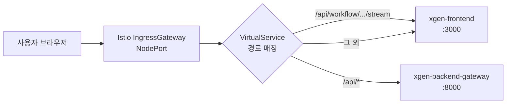
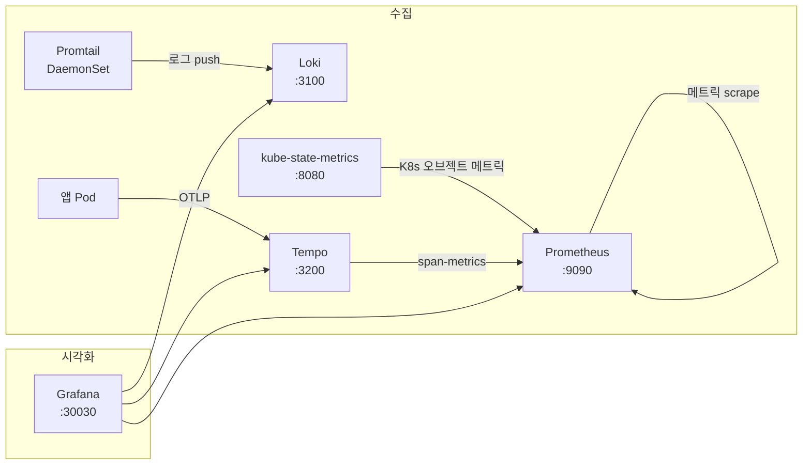
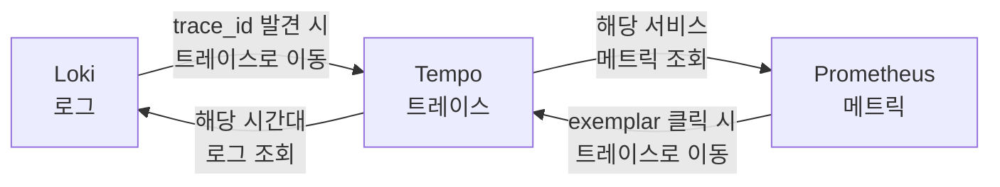
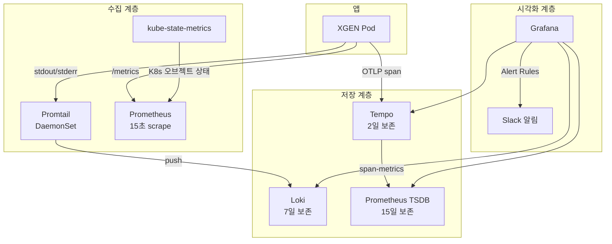

# XGEN K3s 인프라 완전 해부 (5) — Istio 서비스 메시와 Observability 스택

XGEN 2.0은 6개 마이크로서비스가 K3s 위에서 동작하는 AI 에이전트 플랫폼이다. 1편에서 컨테이너 빌드를, 2편에서 K8s 오브젝트를, 3편에서 Helm 차트를, 4편에서 CI/CD 파이프라인을 다뤘다. 5편에서는 네트워크 계층(Istio)과 관측성 스택(Prometheus, Loki, Tempo, Grafana)을 분석한다.

서비스가 배포되어 동작하는 것만으로는 부족하다. 외부 요청이 어떤 경로로 어떤 서비스에 도달하는지, 서비스 간 트래픽이 어떻게 관리되는지, 장애가 발생했을 때 어떻게 감지하고 알림을 받는지 — 이 글은 그 질문에 대한 답이다.

## 시리즈 목차

- [1편: 전체 구조와 컨테이너 빌드 전략](xgen-k3s-anatomy-1-docker-build-strategy.md)
- [2편: Kubernetes 핵심 오브젝트와 스케일링 전략](xgen-k3s-anatomy-2-kubernetes-core-objects.md)
- [3편: Helm 차트 설계 — 하나의 Chart로 6개 서비스 배포하기](xgen-k3s-anatomy-3-helm-chart-design.md)
- [4편: CI/CD 파이프라인 — Jenkins 빌드에서 ArgoCD 배포까지](xgen-k3s-anatomy-4-cicd-jenkins-argocd.md)
- **5편: Istio 서비스 메시와 Observability 스택** (현재 글)

---

## Part A: Istio 서비스 메시

### Istio가 하는 일

Kubernetes 기본 네트워킹만으로도 서비스 간 통신은 가능하다. Service 리소스가 Pod들 앞에 로드밸런서 역할을 하고, kube-proxy가 라운드 로빈으로 트래픽을 분배한다. 그런데 이것만으로는 부족한 상황이 생긴다.

Istio 없이:

```
요청 → Service → Pod (라운드 로빈, 그 외 제어 불가)
```

Istio가 있으면:

```
요청 → Service → Istio Sidecar(Envoy)가 가로챔
     → 로드밸런싱(LEAST_CONN)
     → 커넥션 풀 관리
     → 장애 Pod 자동 제외 (Outlier Detection)
     → mTLS 암호화
     → Pod
```

Envoy 프록시가 모든 트래픽을 가로채서 애플리케이션 코드를 수정하지 않고도 고급 네트워크 정책을 적용할 수 있다. XGEN 프로젝트에서 Istio의 역할은 크게 두 가지다.

1. **외부 -> 내부 트래픽 라우팅**: Gateway + VirtualService로 도메인 기반, 경로 기반 라우팅
2. **내부 -> 내부 트래픽 최적화**: DestinationRule로 로드밸런싱, 커넥션 풀, 장애 감지

### Gateway + VirtualService — 외부 요청 라우팅

사용자가 `https://jeju-xgen.x2bee.com`에 접속하면 요청이 어떤 경로를 거치는지 추적해보자.



외부에서 클러스터 내부로 들어오는 진입점은 Istio IngressGateway 하나뿐이다. Gateway 리소스가 어떤 도메인의 트래픽을 받을지 결정하고, VirtualService가 URI 경로에 따라 목적지 서비스를 분배한다.

Helm 차트의 `ingress.yaml` 템플릿이 이 두 리소스를 자동 생성한다.

```yaml
# k3s/helm-chart/templates/ingress.yaml
{{- if .Values.ingress.enabled }}
{{- $hosts := fromYamlArray (include "xgen-service.ingressHosts" .) }}
{{- if $hosts }}
apiVersion: networking.istio.io/v1alpha3
kind: Gateway
metadata:
  name: {{ include "xgen-service.name" . }}-gateway
spec:
  selector:
    istio: ingressgateway
  servers:
    - hosts:
        {{- range $hosts }}
        - {{ . }}
        {{- end }}
      port:
        name: http
        number: 80
        protocol: HTTP
    {{- if .Values.ingress.tls }}
    - hosts:
        {{- range $hosts }}
        - {{ . }}
        {{- end }}
      port:
        name: https
        number: 443
        protocol: HTTPS
      tls:
        mode: SIMPLE
        credentialName: {{ .Values.ingress.tls.credentialName }}
    {{- end }}
---
apiVersion: networking.istio.io/v1alpha3
kind: VirtualService
metadata:
  name: {{ include "xgen-service.name" . }}-vs
spec:
  hosts:
    {{- range $hosts }}
    - {{ . }}
    {{- end }}
  gateways:
    - {{ include "xgen-service.name" . }}-gateway
  http:
    {{- range .Values.ingress.frontendRoutes }}
    - match:
        - uri:
            prefix: {{ . }}
      route:
        - destination:
            host: {{ include "xgen-service.name" $ }}
            port:
              number: {{ $.Values.port }}
    {{- end }}
    {{- range .Values.ingress.routes }}
    - match:
        - uri:
            prefix: {{ .prefix }}
      route:
        - destination:
            host: {{ .service }}
            port:
              number: {{ .port }}
    {{- end }}
    - route:
        - destination:
            host: {{ include "xgen-service.name" . }}
            port:
              number: {{ $.Values.port }}
{{- end }}
{{- end }}
```

이 템플릿이 `xgen-frontend.yaml`의 값과 결합되어 실제 Gateway와 VirtualService를 만든다.

```yaml
# k3s/helm-chart/values/xgen-frontend.yaml
ingress:
  enabled: true
  hosts: []  # domain은 projects/*.yaml에서 주입
  frontendRoutes:
    - /api/workflow/execute/based_id/stream
    - /api/workflow/execute/deploy/stream
  routes:
    - prefix: /api/
      service: xgen-backend-gateway
      port: 8000
```

`frontendRoutes`, `routes`, 그리고 마지막 기본 route — 이 세 단계의 매칭 순서가 핵심이다. VirtualService의 `http` 블록은 위에서 아래로 순서대로 매칭된다. 먼저 `frontendRoutes`에 정의된 SSE 스트리밍 경로를 매칭하고, 그 다음 `/api/*` 패턴을 매칭하고, 어디에도 해당하지 않으면 frontend로 보낸다.

도메인은 `projects/xgen.yaml`에서 환경별로 주입된다.

```yaml
# k3s/argocd/projects/xgen.yaml
destinations:
  prd:
    server: https://kubernetes.default.svc
    domain: "jeju-xgen.x2bee.com"
  dev:
    server: https://kubernetes.default.svc
    domain: "xgen.x2bee.com"
```

`_helpers.tpl`의 `ingressHosts` 함수가 이 domain 값을 우선 사용하고, 없으면 서비스별 `ingress.hosts`로 폴백한다. 결과적으로 PRD 환경에서는 `jeju-xgen.x2bee.com`, DEV 환경에서는 `xgen.x2bee.com`이 자동으로 Gateway에 설정된다.

### SSE 스트리밍 문제와 해결

VirtualService의 라우팅 규칙에서 한 가지 이상한 점이 있다. `/api/workflow/execute/based_id/stream` 경로는 `/api/`로 시작하므로 원래 `xgen-backend-gateway`로 가야 한다. 그런데 이 경로를 `frontendRoutes`에 넣어서 frontend(Next.js)로 보내고 있다.

이유는 SSE(Server-Sent Events) 스트리밍에 있다. 워크플로우 실행 결과는 실시간으로 스트리밍된다. 사용자가 워크플로우를 실행하면 결과가 한 번에 오는 게 아니라, LLM이 토큰을 생성할 때마다 조금씩 전송된다. 문제는 Istio의 Envoy 프록시가 HTTP 응답을 버퍼링한다는 점이다. 서버가 `data: {"token": "안녕"}\n\n`을 보내도 Envoy가 이걸 모아뒀다가 한꺼번에 전달하면 실시간 스트리밍이 끊긴다.

해결 방법은 SSE 경로를 Next.js의 API Route로 직접 보내는 것이다.

```
일반 API:     브라우저 → Istio → gateway → core/workflow
SSE 스트림:   브라우저 → Istio → frontend(Next.js) → workflow (ReadableStream 프록시)
```

Next.js 서버에서 내부적으로 `xgen-workflow` 서비스에 직접 HTTP 요청을 보내고, 응답을 `ReadableStream`으로 브라우저에 전달한다. Next.js 내부의 HTTP 클라이언트 -> 워크플로우 서비스 구간은 Kubernetes 내부 통신이라 Istio IngressGateway의 버퍼링을 우회할 수 있다.

`frontendRoutes`의 경로들은 이런 이유로 frontend로 직접 라우팅된다.

```yaml
frontendRoutes:
  - /api/workflow/execute/based_id/stream    # 워크플로우 실행 스트리밍
  - /api/workflow/execute/deploy/stream      # 배포 워크플로우 스트리밍
```

### DestinationRule — 내부 트래픽 최적화

Gateway와 VirtualService가 외부 -> 내부 트래픽을 라우팅한다면, DestinationRule은 내부 -> 내부 트래픽을 최적화한다. 모든 서비스에 동일한 DestinationRule이 적용된다.

```yaml
# k3s/helm-chart/templates/destinationrule.yaml
{{- if .Values.istio.destinationRule.enabled }}
apiVersion: networking.istio.io/v1alpha3
kind: DestinationRule
metadata:
  name: {{ include "xgen-service.name" . }}
spec:
  host: {{ include "xgen-service.name" . }}
  trafficPolicy:
    connectionPool:
      tcp:
        maxConnections: 100
        connectTimeout: 10s
        tcpKeepalive:
          time: 300s
          interval: 60s
          probes: 3
      http:
        h2UpgradePolicy: DO_NOT_UPGRADE
        http1MaxPendingRequests: 1024
        http2MaxRequests: 1000
        maxRequestsPerConnection: 0
        maxRetries: 3
        idleTimeout: 3600s
    loadBalancer:
      simple: LEAST_CONN
      warmupDurationSecs: 30s
    outlierDetection:
      consecutive5xxErrors: 5
      interval: 30s
      baseEjectionTime: 30s
      maxEjectionPercent: 50
{{- end }}
```

이 설정을 구간별로 분석한다.

**로드밸런싱: LEAST_CONN**

Kubernetes 기본 라운드 로빈 대신 현재 연결이 가장 적은 Pod에 새 요청을 분배한다. XGEN의 워크플로우 서비스는 LLM 추론 때문에 요청마다 처리 시간이 크게 달라진다. 짧은 요청과 긴 요청이 섞여 있을 때, 라운드 로빈은 긴 요청을 처리 중인 Pod에도 동일하게 새 요청을 보낸다. LEAST_CONN은 현재 바쁜 Pod을 피하고 여유 있는 Pod에 요청을 보내므로 더 균등한 부하 분산이 가능하다.

`warmupDurationSecs: 30`은 새로 뜬 Pod에 30초 동안 트래픽을 점진적으로 증가시킨다. Python FastAPI 서비스는 첫 요청에서 모델 로딩이나 캐시 초기화가 필요할 수 있어서, 워밍업 없이 바로 전체 트래픽을 보내면 시작 직후 느린 응답이 발생한다.

**커넥션 풀**

```
maxConnections: 100        # Pod당 TCP 연결 제한
idleTimeout: 3600s         # 1시간 idle timeout
tcpKeepalive: 300s/60s/3   # 5분마다 keepalive, 60초 재시도, 3번 실패 시 끊기
maxRetries: 3              # HTTP 요청 최대 3회 재시도
```

`idleTimeout`이 1시간으로 설정된 이유가 있다. XGEN의 백엔드 서비스들은 Python FastAPI 기반이다. Istio 기본 idle timeout은 짧은데, Python 프로세스의 cold start가 느리다. 연결이 일찍 끊기면 새 요청마다 TCP 핸드셰이크 + 프로세스 웜업이 반복된다. 1시간으로 설정하면 한번 맺은 연결을 최대한 재사용할 수 있다.

`maxRequestsPerConnection: 0`은 하나의 연결에서 무제한 요청을 처리한다는 뜻이다. 연결 재사용을 극대화한다.

**아웃라이어 감지 (Outlier Detection)**

```
consecutive5xxErrors: 5     # 5xx 에러 연속 5번 발생 시
baseEjectionTime: 30s       # 30초간 트래픽에서 제외 (격리)
maxEjectionPercent: 50      # 최대 50%만 격리 가능
interval: 30s               # 30초마다 체크
```

어떤 Pod이 연속으로 5xx 에러를 5번 반환하면, 해당 Pod을 30초간 트래픽에서 제외한다. 장애 Pod으로 계속 요청이 가는 것을 자동으로 막는 서킷 브레이커 역할이다.

`maxEjectionPercent: 50`은 안전장치다. Pod 2개 중 2개 모두 에러를 내더라도, 최대 50%(1개)만 격리한다. 전체 Pod이 격리되면 서비스 자체가 다운되므로, 최악의 경우에도 절반은 살려두는 전략이다.

### Ingress가 Frontend에만 있는 이유

`values.yaml`에서 기본값은 `ingress.enabled: false`다.

```yaml
# k3s/helm-chart/values.yaml
ingress:
  enabled: false
```

`xgen-frontend.yaml`만 이를 `true`로 오버라이드한다.

```yaml
# k3s/helm-chart/values/xgen-frontend.yaml
ingress:
  enabled: true
```

6개 서비스 중 외부에 노출되는 것은 frontend 하나뿐이다. backend-gateway, core, workflow, documents, model, mcp-station은 모두 클러스터 내부에서만 접근 가능하다. 외부 사용자가 직접 API를 호출할 수 없고, 반드시 frontend의 VirtualService를 통해 경로 기반으로 라우팅된다. 공격 표면(attack surface)을 최소화하는 설계다.

Observability 스택은 별도의 Gateway를 사용한다. `k3s/observability/istio-ingress.yaml`에서 Grafana와 ArgoCD에 대한 외부 접근을 설정했다.

```yaml
# k3s/observability/istio-ingress.yaml
apiVersion: networking.istio.io/v1alpha3
kind: Gateway
metadata:
  name: infoedu-gateway
  namespace: istio-system
spec:
  selector:
    istio: ingressgateway
  servers:
    - hosts:
        - grafana.infoedu.co.kr
        - argocd.infoedu.co.kr
      port:
        name: http
        number: 80
        protocol: HTTP
---
apiVersion: networking.istio.io/v1alpha3
kind: VirtualService
metadata:
  name: grafana-vs
  namespace: observability
spec:
  hosts:
    - grafana.infoedu.co.kr
  gateways:
    - istio-system/infoedu-gateway
  http:
    - route:
        - destination:
            host: grafana.observability.svc.cluster.local
            port:
              number: 3000
```

XGEN 서비스와 운영 도구(Grafana, ArgoCD)의 Gateway를 분리한 것이다. XGEN Gateway는 `xgen-frontend-gateway`로 Helm이 관리하고, 운영 도구 Gateway는 `infoedu-gateway`로 Kustomize가 관리한다. 관심사 분리이면서 동시에 배포 도구도 분리한 셈이다.

---

## Part B: Observability 스택

서비스가 동작하고 트래픽이 흐르면, 다음 질문은 "지금 상태가 정상인가?"다. Observability(관측성)는 세 가지 축으로 이루어진다.

| 축 | 도구 | 질문 |
|---|---|---|
| Metrics | Prometheus | CPU 사용률이 몇 %인가? 초당 요청 수는? |
| Logs | Loki | 에러 로그가 언제 발생했는가? 내용은? |
| Traces | Tempo | 이 요청이 어떤 서비스를 거쳤고, 각 구간이 얼마나 걸렸는가? |

Grafana가 이 세 축을 하나의 대시보드에서 연결한다.

### 전체 아키텍처



전체 스택은 `observability` 네임스페이스에 배포된다. Kustomize로 한 번에 적용한다.

```bash
kubectl apply -k k3s/observability/
```

`kustomization.yaml`이 모든 리소스를 묶는다.

```yaml
# k3s/observability/kustomization.yaml
apiVersion: kustomize.config.k8s.io/v1beta1
kind: Kustomization

namespace: observability

resources:
  - namespace.yaml
  - prometheus/rbac.yaml
  - prometheus/configmap.yaml
  - prometheus/deployment.yaml
  - prometheus/service.yaml
  - loki/configmap.yaml
  - loki/deployment.yaml
  - loki/service.yaml
  - tempo/configmap.yaml
  - tempo/deployment.yaml
  - tempo/service.yaml
  - grafana/configmap.yaml
  - grafana/dashboards.yaml
  - grafana/dashboards-service.yaml
  - grafana/dashboards-k3s.yaml
  - grafana/alerting.yaml
  - grafana/alert-rules.yaml
  - grafana/deployment.yaml
  - grafana/service.yaml
  - promtail/rbac.yaml
  - promtail/configmap.yaml
  - promtail/daemonset.yaml
  - kube-state-metrics/rbac.yaml
  - kube-state-metrics/deployment.yaml
  - kube-state-metrics/service.yaml

labels:
  - pairs:
      app.kubernetes.io/part-of: observability-stack
```

Helm이 아니라 Kustomize를 사용한 이유가 있다. XGEN 서비스는 동일한 Chart 구조를 6번 반복 배포하므로 Helm이 적합하다. 반면 Observability 스택은 Prometheus, Loki, Tempo, Grafana 각각 설정이 완전히 다르고, 배포 단위가 `kubectl apply -k` 한 번이면 충분하다. 템플릿 반복이 없으니 Kustomize가 더 단순하다.

### Prometheus — 메트릭 수집

Prometheus는 Pull 방식으로 동작한다. 대상 서비스가 `/metrics` 엔드포인트를 노출하면, Prometheus가 주기적으로 그 엔드포인트를 호출해서 메트릭을 가져온다(scrape).

```yaml
# k3s/observability/prometheus/configmap.yaml (발췌)
global:
  scrape_interval: 15s
  evaluation_interval: 15s
```

15초마다 모든 scrape 대상에게 메트릭을 요청한다. 6개의 scrape job이 설정되어 있다.

| Job | 대상 | 수집 내용 |
|---|---|---|
| prometheus | localhost:9090 | Prometheus 자체 메트릭 |
| kubernetes-apiservers | API 서버 | API 요청 수, 지연시간 |
| kubernetes-nodes | 노드 kubelet | 노드 상태 메트릭 |
| kubernetes-cadvisor | 노드 cAdvisor | 컨테이너 CPU/메모리/네트워크 |
| xgen-services | xgen 네임스페이스 Pod | 앱 커스텀 메트릭 |
| kube-state-metrics | kube-state-metrics | K8s 오브젝트 상태 |

이 중 `xgen-services` job이 XGEN 모니터링의 핵심이다. Kubernetes Service Discovery를 사용하여 `xgen` 네임스페이스의 Pod을 자동으로 발견하고, Pod annotation 기반으로 scrape 여부를 판단한다.

```yaml
- job_name: 'xgen-services'
  kubernetes_sd_configs:
    - role: pod
      namespaces:
        names:
          - xgen
  relabel_configs:
    # prometheus.io/scrape: "true" 어노테이션이 있는 Pod만
    - source_labels: [__meta_kubernetes_pod_annotation_prometheus_io_scrape]
      action: keep
      regex: true
    # prometheus.io/path 어노테이션으로 메트릭 경로 지정
    - source_labels: [__meta_kubernetes_pod_annotation_prometheus_io_path]
      action: replace
      target_label: __metrics_path__
      regex: (.+)
    # prometheus.io/port 어노테이션으로 포트 지정
    - source_labels: [__address__, __meta_kubernetes_pod_annotation_prometheus_io_port]
      action: replace
      regex: ([^:]+)(?::\d+)?;(\d+)
      replacement: $1:$2
      target_label: __address__
```

새 서비스를 추가할 때 Prometheus 설정을 수정할 필요가 없다. Pod에 다음 annotation만 달면 자동으로 메트릭 수집이 시작된다.

```yaml
annotations:
  prometheus.io/scrape: "true"
  prometheus.io/port: "8000"
  prometheus.io/path: "/metrics"
```

**cAdvisor vs kube-state-metrics**

둘 다 K8s 관련 메트릭을 수집하지만 성격이 다르다.

- **cAdvisor**: 각 노드의 kubelet에 내장된 컨테이너 런타임 메트릭 수집기. 실시간 CPU 사용량, 메모리 사용량, 네트워크 I/O 등 "지금 이 컨테이너가 리소스를 얼마나 쓰고 있는가"에 대한 답.
- **kube-state-metrics**: K8s API 서버에서 오브젝트 상태를 읽어 메트릭으로 변환. Deployment의 desired/available replicas, Pod의 phase(Running/Pending/Failed), 컨테이너의 restart 횟수 등 "K8s 오브젝트가 어떤 상태인가"에 대한 답.

Alert Rules에서 `container_memory_working_set_bytes`는 cAdvisor에서 오고, `kube_pod_status_phase`는 kube-state-metrics에서 온다.

Prometheus 데이터 보존 기간은 15일이다.

```yaml
args:
  - "--storage.tsdb.retention.time=15d"
```

### Loki — 로그 집계

Loki는 Grafana에서 만든 로그 집계 시스템이다. Elasticsearch 같은 전문 검색 엔진과 달리, 로그 본문을 인덱싱하지 않는다. 라벨(namespace, service, pod, container)만 인덱싱하고, 로그 본문은 압축해서 저장한다. 인덱스 크기가 작아서 리소스 사용량이 낮다.

```yaml
# k3s/observability/loki/configmap.yaml (발췌)
common:
  instance_addr: 127.0.0.1
  path_prefix: /loki
  storage:
    filesystem:
      chunks_directory: /loki/chunks
      rules_directory: /loki/rules
  replication_factor: 1
  ring:
    kvstore:
      store: inmemory

schema_config:
  configs:
    - from: 2020-10-24
      store: tsdb
      object_store: filesystem
      schema: v13
      index:
        prefix: index_
        period: 24h

limits_config:
  retention_period: 168h      # 7일 보존
  ingestion_rate_mb: 10       # 초당 최대 10MB 수집
  ingestion_burst_size_mb: 20 # 버스트 시 20MB
  max_streams_per_user: 10000
  max_line_size: 256kb        # 단일 로그 라인 최대 256KB
```

단일 인스턴스 구성(`replication_factor: 1`, `ring.kvstore: inmemory`)이다. 운영 환경에서는 스토리지를 S3나 GCS로 변경하고 다중 인스턴스를 구성해야 하지만, XGEN의 개발 서버에서는 로컬 파일시스템으로 충분하다.

보존 기간은 7일이다. 메트릭(15일)보다 짧은데, 로그는 메트릭보다 데이터 양이 훨씬 크기 때문이다.

### Promtail — 로그 수집 에이전트

Promtail은 DaemonSet으로 모든 노드에 1개씩 배치된다. 각 노드의 `/var/log/pods/` 디렉토리에서 컨테이너 로그를 읽어 Loki로 전송한다.

```yaml
# k3s/observability/promtail/daemonset.yaml (발췌)
spec:
  tolerations:
    - key: node-role.kubernetes.io/master
      operator: Exists
      effect: NoSchedule
    - key: node-role.kubernetes.io/control-plane
      operator: Exists
      effect: NoSchedule
  containers:
    - name: promtail
      image: grafana/promtail:2.9.3
      volumeMounts:
        - name: pods
          mountPath: /var/log/pods
          readOnly: true
        - name: containers
          mountPath: /var/lib/docker/containers
          readOnly: true
      securityContext:
        readOnlyRootFilesystem: true
        capabilities:
          drop:
            - ALL
        allowPrivilegeEscalation: false
```

`tolerations`으로 마스터 노드에도 배치된다. K3s 단일 노드 환경에서는 마스터와 워커가 같은 노드이므로 이 설정이 필수다. 볼륨은 읽기 전용으로 마운트하고, `securityContext`에서 모든 권한을 제거한다. 로그를 읽기만 하면 되므로 최소 권한 원칙을 적용했다.

Promtail의 핵심은 relabel 설정이다. Kubernetes 메타데이터를 라벨로 변환하여 Grafana에서 쿼리할 때 사용한다.

```yaml
# k3s/observability/promtail/configmap.yaml (발췌)
relabel_configs:
  # namespace 라벨
  - action: replace
    source_labels:
      - __meta_kubernetes_namespace
    target_label: namespace
  # 서비스 라벨 (Pod의 app 레이블에서 추출)
  - action: replace
    source_labels:
      - __meta_kubernetes_pod_label_app
    target_label: service
  # Pod 이름
  - action: replace
    source_labels:
      - __meta_kubernetes_pod_name
    target_label: pod
  # 컨테이너 이름
  - action: replace
    source_labels:
      - __meta_kubernetes_pod_container_name
    target_label: container
```

이 설정 덕분에 Grafana에서 다음과 같은 LogQL 쿼리가 가능하다.

```
{namespace="xgen", service="xgen-core"} |~ "(?i)error"
```

`xgen` 네임스페이스의 `xgen-core` 서비스에서 "error"를 포함하는 로그만 필터링한다.

multiline 설정도 있다.

```yaml
pipeline_stages:
  - cri: {}
  - multiline:
      firstline: '^\d{4}-\d{2}-\d{2}|\[?\d{4}[-/]\d{2}[-/]\d{2}'
      max_wait_time: 3s
```

Python traceback 같은 여러 줄 로그를 하나의 로그 엔트리로 묶는다. `firstline` 정규식이 날짜 패턴(`2026-02-21` 또는 `[2026/02/21]`)으로 시작하는 줄을 새 로그의 시작으로 인식한다. 이게 없으면 traceback의 각 줄이 별도 로그로 분리되어 Grafana에서 읽기 어렵다.

### Tempo — 분산 트레이싱

"이 API 요청이 gateway -> core -> workflow를 거치며 각각 얼마나 걸렸는가?" — 메트릭은 서비스별 평균/P95를 알려주지만, 특정 요청 하나의 전체 경로를 추적하려면 분산 트레이싱이 필요하다.

Tempo는 여러 트레이싱 프로토콜을 동시에 수신한다.

```yaml
# k3s/observability/tempo/configmap.yaml (발췌)
distributor:
  receivers:
    jaeger:
      protocols:
        thrift_http:
          endpoint: 0.0.0.0:14268
        grpc:
          endpoint: 0.0.0.0:14250
    zipkin:
      endpoint: 0.0.0.0:9411
    otlp:
      protocols:
        http:
          endpoint: 0.0.0.0:4318
        grpc:
          endpoint: 0.0.0.0:4317
```

OTLP(OpenTelemetry Protocol), Jaeger, Zipkin 세 가지 프로토콜을 모두 지원한다. 앱에서 어떤 트레이싱 라이브러리를 사용하든 Tempo가 받을 수 있다.

보존 기간은 2일이다.

```yaml
compactor:
  compaction:
    block_retention: 48h
```

메트릭(15일), 로그(7일)에 비해 가장 짧다. 트레이스 데이터는 요청 하나하나의 전체 경로를 기록하므로 데이터 양이 매우 크다. 2일이면 최근 이슈를 디버깅하기에 충분하다.

`metrics_generator`가 트레이스 데이터에서 자동으로 메트릭을 생성한다.

```yaml
metrics_generator:
  registry:
    external_labels:
      source: tempo
      cluster: xgen
  storage:
    path: /var/tempo/generator/wal
    remote_write:
      - url: http://prometheus:9090/api/v1/write
        send_exemplars: true

overrides:
  defaults:
    metrics_generator:
      processors: [service-graphs, span-metrics]
```

`service-graphs` 프로세서는 서비스 간 호출 관계를 메트릭으로 만든다. `span-metrics`는 각 span의 duration을 히스토그램 메트릭으로 변환한다. 이 메트릭이 Prometheus로 전송되면, Grafana의 Service Map 기능에서 서비스 간 호출 토폴로지와 지연시간을 시각화할 수 있다.

### Grafana — 통합 대시보드

Grafana는 세 개의 데이터소스를 하나의 화면에서 연결하는 통합 대시보드다.

```yaml
# k3s/observability/grafana/configmap.yaml (발췌 — datasources)
datasources:
  # Prometheus - 메트릭
  - name: Prometheus
    type: prometheus
    uid: prometheus
    url: http://prometheus:9090
    access: proxy
    isDefault: true

  # Loki - 로그
  - name: Loki
    type: loki
    uid: loki
    url: http://loki:3100
    access: proxy
    jsonData:
      derivedFields:
        - datasourceUid: tempo
          matcherRegex: "trace_id=(\\w+)"
          name: TraceID
          url: "$${__value.raw}"

  # Tempo - 트레이싱
  - name: Tempo
    type: tempo
    uid: tempo
    url: http://tempo:3200
    access: proxy
    jsonData:
      tracesToLogsV2:
        datasourceUid: loki
        spanStartTimeShift: "-1h"
        spanEndTimeShift: "1h"
        filterByTraceID: true
      tracesToMetrics:
        datasourceUid: prometheus
        spanStartTimeShift: "-1h"
        spanEndTimeShift: "1h"
      serviceMap:
        datasourceUid: prometheus
      nodeGraph:
        enabled: true
      lokiSearch:
        datasourceUid: loki
```

데이터소스 설정에서 가장 중요한 것은 **세 축 간의 연결**이다.



- **Loki -> Tempo**: 로그에서 `trace_id=abc123` 패턴을 발견하면 자동으로 링크를 생성한다. 클릭하면 해당 트레이스의 전체 경로를 볼 수 있다.
- **Tempo -> Loki**: 트레이스를 보다가 특정 span의 로그가 궁금하면, 해당 시간대(+-1시간)의 로그를 바로 조회한다.
- **Tempo -> Prometheus**: 트레이스에서 해당 서비스의 메트릭(CPU, 메모리, 요청 수)을 바로 확인한다.

에러가 발생했을 때의 디버깅 흐름을 예로 들면:

1. Grafana 대시보드에서 에러율 급증을 발견 (Prometheus 메트릭)
2. 해당 시간대 에러 로그를 조회 (Loki)
3. 로그에서 trace_id를 클릭 (Tempo)
4. 트레이스에서 어느 서비스, 어느 구간에서 에러가 발생했는지 확인
5. 해당 서비스의 리소스 메트릭 확인 (다시 Prometheus)

세 축이 분리되어 있지만 하나의 워크플로우로 연결되는 것이 Observability 스택의 핵심 가치다.

Grafana 설정에서 `feature_toggles`로 `traceToMetrics`를 활성화한 점도 주목한다.

```ini
[feature_toggles]
enable = traceToMetrics
```

이 기능이 없으면 Tempo에서 Prometheus로 넘어가는 링크가 생성되지 않는다.

**대시보드 3종**

Grafana에 자동으로 프로비저닝되는 대시보드가 3종이다.

```yaml
providers:
  - name: 'xgen-overview'
    folder: 'XGEN'
    options:
      path: /var/lib/grafana/dashboards/overview
  - name: 'xgen-service'
    folder: 'XGEN - Services'
    options:
      path: /var/lib/grafana/dashboards/service
  - name: 'k3s-cluster'
    folder: 'K3s Cluster'
    options:
      path: /var/lib/grafana/dashboards/k3s
```

| 대시보드 | 폴더 | 내용 |
|---|---|---|
| XGEN Overview | XGEN | 6개 서비스 Running Pod 수, CPU/메모리 사용량, 에러 로그 |
| XGEN Service Detail | XGEN - Services | 변수(dropdown)로 서비스 선택, 해당 서비스의 상세 메트릭 |
| K3s Cluster | K3s Cluster | 노드 CPU/메모리/디스크, 전체 클러스터 리소스 현황 |

대시보드 JSON은 ConfigMap으로 관리되어 `kubectl apply -k`로 함께 배포된다. 새 환경에 Observability 스택을 배포하면 대시보드가 자동으로 구성되므로 수동 설정이 필요 없다.

### Alert Rules — 6개 알림 규칙

모니터링은 대시보드를 들여다보는 것만으로는 부족하다. 문제가 발생하면 자동으로 알려줘야 한다. Grafana의 Unified Alerting으로 6개의 알림 규칙을 설정했다.

```yaml
# k3s/observability/grafana/alert-rules.yaml
groups:
  - orgId: 1
    name: xgen-alerts
    folder: XGEN
    interval: 1m
```

1분마다 모든 알림 조건을 평가한다. 각 알림을 분석한다.

**1. Pod Not Running (critical, 2분 대기)**

```yaml
expr: |
  kube_pod_status_phase{namespace="xgen", phase!="Running", phase!="Succeeded"} > 0
for: 2m
```

Pod이 Running이나 Succeeded가 아닌 상태(Pending, Failed, Unknown)로 2분 이상 지속되면 알림이 발생한다. `kube_pod_status_phase`는 kube-state-metrics에서 온다.

**2. High Memory Usage (warning, 5분 대기)**

```yaml
expr: |
  (sum by (pod, namespace) (container_memory_working_set_bytes{
    namespace="xgen", container!="", container!="istio-proxy", container!="POD"})
  / sum by (pod, namespace) (kube_pod_container_resource_limits{
    namespace="xgen", resource="memory", container!="istio-proxy"})) * 100 > 80
for: 5m
```

메모리 사용량이 limit의 80%를 5분 이상 초과하면 경고한다. OOM Kill 직전에 알림을 받을 수 있다. `container!="istio-proxy"`로 Istio sidecar의 메모리는 제외한다. sidecar는 앱 컨테이너와 별개로 관리되므로 앱의 메모리 사용률에 포함하면 정확도가 떨어진다.

**3. Pod Restart Detected (warning, 2분 대기)**

```yaml
expr: |
  increase(kube_pod_container_status_restarts_total{namespace="xgen"}[15m]) >= 2
for: 2m
```

15분 내 2회 이상 재시작이 감지되면 알림이 발생한다. CrashLoopBackOff 상태를 조기에 감지하기 위한 규칙이다. 한 번 재시작은 정상적인 롤링 업데이트일 수 있으므로 2회 이상일 때만 알린다.

**4. High Error Rate (critical, 5분 대기)**

```yaml
expr: |
  (
    (sum by (destination_service_name) (rate(istio_requests_total{
      destination_service_namespace="xgen", response_code=~"5.."}[10m]))
    / sum by (destination_service_name) (rate(istio_requests_total{
      destination_service_namespace="xgen"}[10m]))) * 100 > 20
  )
  and
  (sum by (destination_service_name) (rate(istio_requests_total{
    destination_service_namespace="xgen"}[10m])) > 0.1)
for: 5m
```

5xx 에러율이 20%를 초과하면 알림이 발생한다. 여기서 핵심은 **최소 트래픽 조건** `> 0.1 req/s`다. 이 조건이 없으면 트래픽이 거의 없는 시간대에 요청 1건이 실패해도 에러율 100%로 계산되어 오탐(false positive)이 발생한다. 초당 0.1건 이상의 트래픽이 있을 때만 에러율을 계산한다.

`istio_requests_total` 메트릭은 Istio가 자동으로 생성하는 메트릭이다. 앱 코드를 수정하지 않아도 모든 HTTP 요청의 response_code, destination_service 등이 기록된다.

**5. High Response Latency (warning, 10분 대기)**

```yaml
expr: |
  (
    histogram_quantile(0.95, sum by (le, destination_service_name) (
      rate(istio_request_duration_milliseconds_bucket{
        destination_service_namespace="xgen",
        destination_service_name!~"xgen-model|xgen-workflow"}[10m]))) > 60000
  )
  and
  (sum by (destination_service_name) (rate(istio_requests_total{
    destination_service_namespace="xgen",
    destination_service_name!~"xgen-model|xgen-workflow"}[10m])) > 0.1)
for: 10m
```

P95 응답 시간이 60초를 초과하면 경고한다. `xgen-model`과 `xgen-workflow`는 명시적으로 **제외**한다. LLM 추론은 원래 수십 초가 걸리므로, 이 서비스들에 latency 알림을 걸면 상시 알림이 울린다. 대기시간도 10분으로 다른 알림보다 길게 설정했다. 일시적인 지연과 지속적인 성능 문제를 구분하기 위해서다.

**6. Deployment Replicas Mismatch (critical, 5분 대기)**

```yaml
expr: |
  kube_deployment_status_replicas_available{namespace="xgen"}
    < kube_deployment_spec_replicas{namespace="xgen"}
for: 5m
```

실제 가용 Pod 수가 원하는 Pod 수보다 적으면 알림이 발생한다. 노드 리소스 부족, 이미지 풀 실패, readiness probe 실패 등 다양한 원인으로 Pod이 정상 기동하지 못하는 상황을 감지한다.

### Slack 알림 전송

알림이 발생하면 Slack으로 메시지가 전송된다.

```yaml
# k3s/observability/grafana/alerting.yaml (발췌)
contactPoints:
  - orgId: 1
    name: slack-xgen
    receivers:
      - uid: slack-xgen-receiver
        type: slack
        settings:
          url: "https://hooks.slack.com/services/..."
          recipient: "#xgen"
          title: |
            {{ if eq .Status "firing" }}[DEV ALERT] {{ .CommonLabels.alertname }}
            {{ else }}[DEV RESOLVED] {{ .CommonLabels.alertname }}{{ end }}
```

DEV 환경은 `#xgen` 채널, PRD 환경은 `#xgen-prd` 채널로 분리했다. 알림 메시지에는 서비스명, 심각도, Pod 이름, 발생 시각이 포함되며, Grafana 로그 탐색 링크도 자동 생성된다. "View Logs in Grafana"를 클릭하면 해당 네임스페이스의 에러 로그를 바로 조회할 수 있다.

알림 정책도 설정되어 있다.

```yaml
policies:
  - orgId: 1
    receiver: slack-xgen-243
    group_by:
      - alertname
      - destination_service_name
    group_wait: 30s
    group_interval: 5m
    repeat_interval: 4h
```

`group_by`로 같은 알림이름 + 같은 서비스의 알림을 묶는다. `group_wait: 30s`는 알림 발생 후 30초 동안 같은 그룹의 알림을 모아서 한 번에 보낸다. `repeat_interval: 4h`는 해소되지 않은 알림을 4시간마다 반복 전송한다. 알림 폭풍(alert fatigue)을 방지하면서도 미해결 문제를 잊지 않게 하는 균형점이다.

### 데이터 흐름 요약

전체 Observability 스택의 데이터 흐름을 정리한다.



보존 기간이 각각 다르다. Metrics 15일, Logs 7일, Traces 2일. 데이터 양이 큰 순서대로 보존 기간이 짧다. 트레이스가 가장 용량이 크고, 메트릭이 가장 작다.

### Pod 자동 재시작 — 메모리 누수 대응

Observability 스택의 보너스 기능으로, `pod-restarter` CronJob이 있다.

```yaml
# k3s/observability/pod-restarter/cronjob.yaml (발췌)
spec:
  schedule: "0 19 * * *"    # UTC 19:00 = KST 04:00
  timeZone: "Asia/Seoul"
  jobTemplate:
    spec:
      template:
        metadata:
          annotations:
            sidecar.istio.io/inject: "false"
        spec:
          containers:
          - name: kubectl
            image: bitnami/kubectl:latest
            command:
            - /bin/sh
            - -c
            - |
              echo "$(date): Restarting xgen-workflow deployment..."
              kubectl rollout restart deployment/xgen-workflow -n xgen
              echo "$(date): Restart initiated successfully"
```

매일 새벽 4시에 `xgen-workflow` deployment를 rollout restart한다. LangChain 내부 캐시로 인한 메모리 누수가 있어서 주기적 재시작으로 대응하고 있다. `sidecar.istio.io/inject: "false"` annotation으로 CronJob Pod에는 Istio sidecar를 주입하지 않는다. kubectl만 실행하면 되는 Job에 Envoy를 붙이면 Job이 완료되어도 sidecar가 종료되지 않아 Pod이 Completed 상태로 전환되지 않는 문제가 있다.

---

## 시리즈 마무리 — 설계 원칙 정리

5편에 걸쳐 XGEN K3s 인프라를 해부했다. 개별 기술보다 중요한 것은 전체를 관통하는 설계 원칙이다.

### 1. 설정과 로직의 분리

Helm 템플릿은 "어떻게 배포하는가"를, values 파일은 "무엇을 배포하는가"를 담당한다. DestinationRule 템플릿은 모든 서비스에 동일하게 적용되는 트래픽 정책을 정의하고, `values.yaml`의 `istio.destinationRule.enabled`가 서비스별로 켜고 끈다. Prometheus 설정은 annotation 기반 자동 발견이라 서비스가 추가되어도 설정을 수정하지 않는다.

### 2. 단일 진입점

`projects/xgen.yaml` 하나가 전체 배포의 진입점이다. 도메인, 환경, 리소스, 서비스 목록이 모두 이 파일에 선언되어 있다. 외부 트래픽의 진입점도 하나(Istio IngressGateway)다. Gateway -> VirtualService -> 개별 서비스 순서로 트래픽이 흐르며, 외부에 노출되는 서비스는 frontend 하나뿐이다.

### 3. 환경별 오버라이드 체계

기본값(values.yaml) -> 서비스별(values/xgen-*.yaml) -> 환경별(projects/xgen.yaml의 environments) -> 프로젝트 변수(vars) 순서로 값이 오버라이드된다. Observability 스택에서도 같은 원칙이 적용된다. 알림 정책의 contact point만 바꾸면 DEV와 PRD가 다른 Slack 채널로 알림을 보낸다.

### 4. 관측 가능한 시스템

서비스가 동작하는 것과 서비스가 "잘" 동작하는 것은 다르다. Prometheus가 15초마다 메트릭을 수집하고, Promtail이 모든 로그를 Loki로 보내고, Tempo가 요청의 전체 경로를 기록한다. 6개의 알림 규칙이 이상 징후를 감지하면 Slack으로 알린다. 대시보드를 보지 않아도 문제가 발생하면 알 수 있는 시스템이다.

1편의 Dockerfile에서 시작해서 5편의 Observability 스택까지, XGEN 인프라의 모든 계층을 다뤘다. 컨테이너 빌드 -> K8s 오브젝트 -> Helm 차트 -> CI/CD 파이프라인 -> 네트워크/관측성. 각 계층이 독립적으로 동작하면서도 전체가 하나의 일관된 배포 시스템을 이루는 것이 이 인프라의 설계 목표였다.
