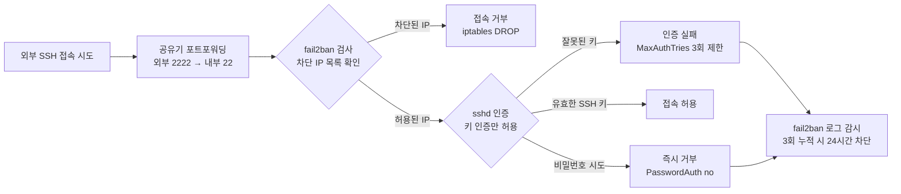
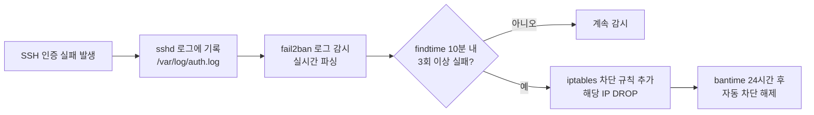

# 홈서버 SSH 보안 강화: 키 인증, fail2ban, 포트 우회까지

## 배경

공유기 포트포워딩으로 SSH를 외부에 개방하면, 전 세계에서 무작위로 로그인을 시도하는 봇들의 공격을 받는다. 기본 설정 그대로 두면 비밀번호 무차별 대입(brute force) 공격에 그대로 노출된다.

실제로 SSH를 개방한 직후 `journalctl -u sshd`를 확인하면, 수분 내에 `root`, `admin`, `ubuntu` 같은 계정으로 로그인 시도가 쏟아지는 것을 볼 수 있다. 이 봇들은 24시간 쉬지 않고 전 세계의 22번 포트를 스캔하며, 약한 비밀번호 하나만 뚫리면 서버가 통째로 넘어간다.

이 글에서는 다음 네 가지를 다룬다.

1. SSH 키 인증만 허용 (비밀번호 로그인 차단)
2. SSH 데몬 보안 설정 강화
3. fail2ban으로 무차별 대입 공격 자동 차단
4. 공유기 포트 우회로 기본 스캔 방어

Ubuntu 22.04 / 24.04 기준으로 작성했다.

---

## 전체 보안 구조

아래 다이어그램은 외부에서 SSH 접속을 시도할 때 각 보안 계층이 어떤 순서로 동작하는지를 보여준다.



네 가지 보안 계층이 순차적으로 동작한다.

- **1차 방어**: 비표준 포트(2222)로 자동 스캔 봇 대부분을 회피한다
- **2차 방어**: fail2ban이 반복 실패 IP를 iptables로 자동 차단한다
- **3차 방어**: sshd 설정으로 비밀번호 인증 자체를 비활성화한다
- **4차 방어**: 유효한 SSH 키가 있는 클라이언트만 접속에 성공한다

---

## 사전 준비: SSH 키 등록 확인

비밀번호 인증을 끄기 전에, **반드시 SSH 키가 서버에 등록되어 있어야 한다.** 이 단계를 건너뛰면 서버에 접근할 수 없게 되므로 주의가 필요하다.

```bash
# 등록된 공개키 확인
cat ~/.ssh/authorized_keys
```

비어 있다면 로컬 PC에서 키를 먼저 등록한다.

```bash
# 로컬 PC에서 실행
ssh-copy-id -i ~/.ssh/id_rsa.pub user@서버IP
```

키가 없다면 새로 생성한다. RSA보다 Ed25519를 권장한다. 키 길이가 짧으면서도 보안 강도는 동등 이상이다.

```bash
# 로컬 PC에서 실행
ssh-keygen -t ed25519 -C "my-server-key"
ssh-copy-id -i ~/.ssh/id_ed25519.pub user@서버IP
```

등록 후 비밀번호 없이 로그인이 되는지 반드시 확인한다.

```bash
ssh user@서버IP
```

이 단계에서 키 인증 로그인이 성공해야만 다음 단계로 진행할 수 있다.

---

## 1단계: SSH 데몬 보안 설정 강화

### 설정 파일 구조

Ubuntu는 `/etc/ssh/sshd_config.d/` 디렉토리에 설정 파일을 추가하는 방식을 권장한다. 기존 `sshd_config`를 직접 수정하지 않아 패키지 업데이트 시 충돌이 없고, 설정 관리가 깔끔하다.

```bash
sudo nano /etc/ssh/sshd_config.d/99-hardening.conf
```

### 설정 내용

```
# SSH Hardening

# 비밀번호 로그인 차단 (SSH 키만 허용)
PasswordAuthentication no

# root 계정 직접 로그인 차단
PermitRootLogin no

# 인증 실패 허용 횟수 (3회 초과 시 연결 끊김)
MaxAuthTries 3

# 로그인 대기 시간 제한 (30초 안에 인증 안 되면 차단)
LoginGraceTime 30

# X11 그래픽 포워딩 비활성화
X11Forwarding no

# TCP 포워딩 비활성화
AllowTcpForwarding no

# 유휴 세션 타임아웃 (5분 응답 없으면 2회 확인 후 종료)
ClientAliveInterval 300
ClientAliveCountMax 2
```

### 각 설정의 역할

**PasswordAuthentication no**

가장 중요한 설정이다. SSH 키 인증만 허용하고 비밀번호 로그인을 완전히 차단한다. 무차별 대입 공격의 99%는 비밀번호를 대상으로 하므로, 이 한 줄만으로도 대부분의 공격이 무력화된다.

**PermitRootLogin no**

root 계정으로의 직접 로그인을 차단한다. 공격자는 거의 항상 `root`를 첫 번째 타겟으로 삼는다. 일반 계정으로 로그인한 후 `sudo`를 사용하는 것이 올바른 운영 방식이다.

**MaxAuthTries 3**

하나의 SSH 연결에서 인증 시도를 3회로 제한한다. 기본값은 6회인데, 3회면 충분하다. 키 인증은 보통 한 번에 성공하므로 정상 사용에는 영향이 없다.

**LoginGraceTime 30**

연결 후 30초 안에 인증을 완료하지 못하면 연결을 끊는다. 느린 무차별 대입 공격(slow brute force)을 방어하고, 인증 없이 연결만 점유하는 리소스 낭비를 막는다.

**X11Forwarding no / AllowTcpForwarding no**

사용하지 않는 기능은 꺼두는 것이 원칙이다. X11 포워딩은 GUI를 터널링하는 기능인데, 서버에서 쓸 일이 없다. TCP 포워딩도 마찬가지로, 필요하지 않다면 비활성화하여 터널링 악용을 방지한다.

**ClientAliveInterval 300 / ClientAliveCountMax 2**

5분(300초)마다 클라이언트에 alive 확인 패킷을 보내고, 2회 연속 응답이 없으면 세션을 종료한다. 네트워크가 끊긴 채 남아있는 좀비 세션을 자동으로 정리한다.

### 적용

```bash
# 설정 파일 문법 검사
sudo sshd -t

# 문제 없으면 재시작 없이 적용
sudo systemctl reload sshd
```

`reload`는 재시작 없이 설정만 반영하므로 기존 연결이 끊기지 않는다. 설정 적용 후에도 현재 SSH 세션은 유지되므로, 새 터미널에서 접속을 테스트해볼 수 있다. 만약 설정에 문제가 있어도 기존 세션으로 복구가 가능하다.

---

## 2단계: fail2ban 설치 및 설정

### fail2ban이란

fail2ban은 시스템 로그를 실시간으로 모니터링하면서, 인증 실패가 반복되는 IP를 자동으로 방화벽에 추가하여 차단하는 도구다. SSH뿐 아니라 Nginx, Apache, 메일 서버 등 다양한 서비스에 적용할 수 있다.

동작 흐름은 다음과 같다.



### 설치

```bash
sudo apt-get update
sudo apt-get install -y fail2ban
```

### 설정 파일 작성

fail2ban은 `/etc/fail2ban/jail.conf`를 기본으로 사용하지만, 패키지 업데이트 시 덮어쓰일 수 있다. 반드시 `jail.local`에 커스텀 설정을 작성해야 한다. `jail.local`이 `jail.conf`보다 우선 적용된다.

```bash
sudo nano /etc/fail2ban/jail.local
```

```ini
[DEFAULT]
# 기본 차단 시간: 1시간
bantime  = 1h
# 실패 횟수 집계 기간: 10분
findtime = 10m
# 허용 실패 횟수
maxretry = 3
# 차단 방식
banaction = iptables-multiport

[sshd]
enabled  = true
# 내부 포트 22 + 공유기 외부 포트 2222 모두 감시
port     = 22,2222
logpath  = %(sshd_log)s
backend  = %(sshd_backend)s
# SSH는 더 엄격하게: 3회 실패 시 24시간 차단
maxretry = 3
bantime  = 24h
```

### 설정값 선택 이유

**bantime = 24h (SSH)**

기본값(1시간)보다 길게 잡았다. SSH에 대한 무차별 대입 공격은 보통 장시간 지속되므로, 1시간 후 풀려나면 다시 시도한다. 24시간이면 대부분의 자동화 봇이 다른 타겟으로 이동한다.

**findtime = 10m**

10분 이내에 발생한 실패만 집계한다. 너무 길면 정상적인 오타까지 잡히고, 너무 짧으면 느린 공격을 놓친다. 10분은 적절한 균형점이다.

**maxretry = 3**

3회 실패면 차단한다. SSH 키 인증은 보통 한 번에 성공하므로 3회면 넉넉하다. 비밀번호 인증을 이미 꺼둔 상태에서 3회 실패는 거의 확실히 공격이다.

**banaction = iptables-multiport**

iptables를 사용하여 해당 IP의 지정 포트 접근을 DROP한다. UFW를 사용하는 환경이라면 `banaction = ufw`로 변경할 수 있다.

### 활성화 및 시작

```bash
sudo systemctl enable fail2ban
sudo systemctl restart fail2ban
```

### 동작 확인

```bash
# sshd jail 상태 확인
sudo fail2ban-client status sshd
```

출력 예시:

```
Status for the jail: sshd
|- Filter
|  |- Currently failed: 2
|  |- Total failed:     847
|  `- File list:        /var/log/auth.log
`- Actions
   |- Currently banned: 5
   |- Total banned:     128
   `- Banned IP list:   103.x.x.x 45.x.x.x ...
```

```bash
# 특정 IP 수동 차단 해제 (실수로 본인 IP가 차단됐을 때)
sudo fail2ban-client set sshd unbanip <IP주소>
```

본인 IP가 차단되는 상황을 대비하여, 서버에 물리적으로 접근할 수 있는 수단(모니터+키보드, IPMI 등)을 확보해두는 것을 권장한다. 또는 `jail.local`의 `[DEFAULT]` 섹션에 `ignoreip = 127.0.0.1/8 192.168.0.0/16`을 추가하여 내부망 IP를 화이트리스트에 등록할 수 있다.

---

## 3단계: 공유기 포트포워딩으로 기본 스캔 우회

대부분의 자동화 공격 봇은 기본 포트(22)만 스캔한다. 공유기에서 외부 포트를 다르게 설정하면 자동 스캔의 대부분을 회피할 수 있다.

### 공유기 설정

| 설정 항목 | 값 |
|-----------|-----|
| 서비스 포트 (외부) | `2222` |
| 프로토콜 | TCP |
| 내부 IP | `192.168.x.x` (서버 IP) |
| 내부 포트 | `22` |

이 방식의 장점은 **서버의 sshd 설정을 변경하지 않아도 된다**는 것이다. 서버는 그대로 22번 포트에서 리슨하고, 공유기가 외부 2222 → 내부 22로 포워딩한다. 서버 내부에서는 아무것도 바뀌지 않으므로 로컬 스크립트나 서비스 간 SSH 연결에 영향이 없다.

### 접속 방법

```bash
ssh -p 2222 user@공인IP
```

매번 포트를 입력하는 것은 번거로우므로, `~/.ssh/config`에 등록한다.

```
Host myserver
    HostName 공인IP
    User son
    Port 2222
    IdentityFile ~/.ssh/id_ed25519
```

이후 `ssh myserver`만 입력하면 된다.

### 비표준 포트의 한계

비표준 포트는 "보안"이 아니라 "회피"에 가깝다. 의도적으로 타겟팅하는 공격자는 nmap 등으로 전체 포트를 스캔할 수 있다. 하지만 현실적으로 홈서버를 타겟팅하는 경우는 거의 없고, 대부분은 전 세계 IP의 22번 포트를 무작위로 두드리는 봇이다. 비표준 포트만으로도 로그에 찍히는 공격 시도가 90% 이상 줄어드는 것을 체감할 수 있다.

---

## 적용 결과 요약

| 보안 계층 | 설정 | 효과 |
|-----------|------|------|
| 비밀번호 인증 | 비활성화 | 비밀번호 탈취/추측 공격 무력화 |
| root 로그인 | 차단 | 최고 권한 계정 직접 공격 차단 |
| 최대 인증 시도 | 3회 제한 | 연결당 무차별 시도 제한 |
| 로그인 타임아웃 | 30초 | 느린 무차별 대입, 리소스 점유 방어 |
| X11/TCP 포워딩 | 비활성화 | 불필요한 터널링 경로 차단 |
| 유휴 세션 | 5분 타임아웃 | 좀비 세션 자동 정리 |
| fail2ban | 3회 실패 시 24시간 차단 | 반복 공격 IP 자동 차단 |
| 외부 SSH 포트 | 22 → 2222 | 자동화 스캔 봇 회피 |

---

## 추가 고려 사항

### 클라우드 환경과의 차이

홈서버는 공유기가 방화벽 역할을 일부 수행하지만, AWS/GCP 같은 클라우드 환경에서는 보안 그룹(Security Group)이나 방화벽 규칙을 별도로 설정해야 한다. 클라우드에서는 포트포워딩 대신 보안 그룹에서 소스 IP를 제한하는 방식이 더 효과적이다.

### UFW와의 조합

Ubuntu에서 UFW(Uncomplicated Firewall)를 함께 사용한다면, SSH 포트를 명시적으로 허용해야 한다.

```bash
sudo ufw allow 22/tcp
sudo ufw enable
```

fail2ban의 `banaction`도 `ufw`로 변경한다.

```ini
[DEFAULT]
banaction = ufw
```

### 모니터링

설정 후 정기적으로 fail2ban 상태를 확인하는 것을 권장한다.

```bash
# 차단 통계 확인
sudo fail2ban-client status sshd

# 최근 SSH 로그 확인
journalctl -u sshd --since "1 hour ago" --no-pager
```

공격 시도가 지속적으로 많다면 `bantime`을 더 늘리거나, `recidive` jail을 추가하여 반복 차단되는 IP를 영구 차단할 수도 있다.

```ini
[recidive]
enabled  = true
logpath  = /var/log/fail2ban.log
bantime  = 1w
findtime = 1d
maxretry = 3
```

이 설정은 fail2ban에 의해 하루에 3번 이상 차단된 IP를 1주일간 완전 차단한다. 상습범을 효과적으로 걸러낸다.
