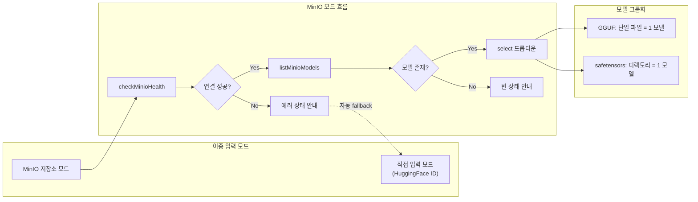

# MinIO 기반 모델 선택 UI: 로딩 상태와 에러 처리

## 개요

XGEN 2.0에서 모델을 배포하려면 "어떤 모델을 배포할지" 선택해야 한다. 모델은 두 곳에서 올 수 있다 — MinIO 오브젝트 스토리지에 이미 다운로드된 모델을 선택하거나, HuggingFace 모델 ID를 직접 입력하는 방식이다.

MinIO 모델 선택 UI는 단순한 드롭다운처럼 보이지만, 실제로는 상당히 복잡한 상태 관리가 필요하다. MinIO 서버가 꺼져 있을 수 있고, 연결은 됐는데 모델이 없을 수 있고, 모델은 있는데 로딩 중일 수 있다. 각 상황에 맞는 UI를 보여줘야 한다.

이 글에서는 MinIO 모델 선택 UI의 3단계 상태 분기 렌더링, MinIO/직접입력 이중 모드, safetensors 샤드 그룹화, 백엔드 마이그레이션 시의 Adapter 패턴 적용 등을 다룬다.

## 아키텍처



### 핵심 설계: 3단계 상태 분기

MinIO 모델 선택 영역은 세 가지 상태를 정확히 구분해서 렌더링한다:

1. **연결 성공 + 모델 있음** → select 드롭다운으로 모델 선택
2. **연결 성공 + 모델 없음** → 회색 배경의 빈 상태 안내
3. **연결 실패** → 빨간 배경의 에러 안내 + 직접 입력 모드로 자동 전환

## 핵심 구현

### 상태 관리

```typescript
// MinIO 관련 상태
const [minioModels, setMinioModels] = useState<MinioModel[]>([]);
const [minioLoading, setMinioLoading] = useState(false);
const [minioConnected, setMinioConnected] = useState(false);
const [modelInputMode, setModelInputMode] = useState<'minio' | 'manual'>('minio');
```

네 개의 상태가 조합되어 UI를 결정한다. `minioLoading`이 true면 스피너를 보여주고, false가 되면 `minioConnected`와 `minioModels.length`를 조합해서 세 가지 중 하나의 UI를 렌더링한다.

### MinIO 모델 인터페이스

```typescript
interface MinioModel {
    key: string;              // MinIO 오브젝트 키 (경로)
    size_mb: number;          // 파일 크기 (MB)
    last_modified: string;    // 마지막 수정일
    model_name: string;       // 모델 표시명
    model_id?: string;        // 내부 식별자
    version?: string;
    backend?: string;         // llamacpp, vllm 등
    path?: string;
    runtime?: {
        state: string;        // running, stopped, loading
        loaded_at?: string;
        memory_usage?: number;
    };
}
```

### 모델 로딩과 헬스체크

모델 목록을 로드하기 전에 반드시 MinIO 헬스체크를 먼저 수행한다. 헬스체크가 실패하면 모델 목록 API를 호출할 필요가 없다.

```typescript
const loadMinioModels = async () => {
    setMinioLoading(true);
    try {
        // 1. 헬스체크
        const healthResult = await checkMinioHealth() as {
            status: string;
            accessible: boolean;
        };
        setMinioConnected(healthResult.accessible);

        if (healthResult.accessible) {
            // 2. 모델 목록 조회
            const result = await listMinioModels() as {
                models: MinioModel[];
            };
            // LLM 모델만 필터링 (/llm/ 경로 기반)
            const llmModels = (result.models || []).filter(
                m => m.key.includes('/llm/')
            );
            setMinioModels(llmModels);
        }
    } catch (error) {
        devLog.error('Failed to load MinIO models:', error);
        setMinioConnected(false);
    } finally {
        setMinioLoading(false);
    }
};
```

```
# 커밋: Enhance AdminVectordbConfig and AdminGpuOfferSearchModal to support MinIO model selection
# 날짜: 2025-11-30 23:03
```

LLM과 임베딩 모델을 경로 기반으로 필터링한다. MinIO의 디렉토리 구조가 `models/llm/모델명/` 또는 `models/embedding/모델명/` 형태이므로, `/llm/`을 포함하는 오브젝트만 LLM 모델로 간주한다.

### 3단계 상태 분기 렌더링

```tsx
{/* 모드 토글 버튼 */}
<div style={{ display: 'flex', gap: '0.5rem' }}>
    <button
        onClick={() => setModelInputMode('minio')}
        className={modelInputMode === 'minio' ? styles.active : ''}
    >
        <FiHardDrive /> MinIO 저장소
    </button>
    <button
        onClick={() => setModelInputMode('manual')}
        className={modelInputMode === 'manual' ? styles.active : ''}
    >
        <SiHuggingface /> 직접 입력
    </button>
</div>

{/* MinIO 모델 선택 */}
{modelInputMode === 'minio' && (
    minioLoading ? (
        // 로딩 중
        <div className={styles.loadingContainer}>
            <FiRefreshCw className={styles.spinning} />
            <span>모델 목록 로딩 중...</span>
        </div>
    ) : minioConnected ? (
        minioModels.length > 0 ? (
            // 상태 1: 연결 성공 + 모델 있음
            <select
                value={selectedModel}
                onChange={(e) => setSelectedModel(e.target.value)}
            >
                <option value="">모델을 선택하세요</option>
                {minioModels.map((model) => (
                    <option key={model.key} value={model.key}>
                        {model.model_name} ({model.size_mb.toFixed(1)} MB)
                    </option>
                ))}
            </select>
        ) : (
            // 상태 2: 연결 성공 + 모델 없음
            <div className={styles.emptyState}>
                MinIO에 저장된 LLM 모델이 없습니다.
                HuggingFace에서 모델을 다운로드하세요.
            </div>
        )
    ) : (
        // 상태 3: 연결 실패
        <div className={styles.errorState}>
            MinIO 저장소에 연결할 수 없습니다.
            직접 입력 모드를 사용하세요.
        </div>
    )
)}

{/* 직접 입력 모드 */}
{modelInputMode === 'manual' && (
    <input
        type="text"
        placeholder="HuggingFace 모델 ID (예: meta-llama/Llama-3.1-8B)"
        value={manualModelId}
        onChange={(e) => setManualModelId(e.target.value)}
    />
)}
```

연결 실패 시 에러 메시지와 함께 "직접 입력 모드를 사용하세요"라는 안내를 보여준다. 이것이 **그레이스풀 디그레이데이션** 패턴이다. MinIO가 죽어도 사용자는 HuggingFace 모델 ID를 직접 입력해서 배포를 계속할 수 있다.

### safetensors 샤드 그룹화

대형 모델은 파일이 여러 개로 분할된다. 예를 들어 Qwen3-32B 모델은 safetensors 파일이 8개다:

```
models/llm/Qwen_Qwen3-32B/
  model-00001-of-00008.safetensors  (4.5 GB)
  model-00002-of-00008.safetensors  (4.5 GB)
  ...
  model-00008-of-00008.safetensors  (3.2 GB)
  config.json
  tokenizer.json
```

이걸 그대로 목록에 보여주면 8개가 따로 나온다. `GroupedModel` 인터페이스로 디렉토리 단위로 묶어서 하나의 모델로 표시한다.

```typescript
interface GroupedModel {
    directory: string;
    displayName: string;
    modelType: 'llm' | 'embedding';
    format: 'safetensors' | 'gguf' | 'unknown';
    files: MinioModel[];
    totalSizeMb: number;
    lastModified: string;
    fileCount: number;
    model_id?: string;
}

const groupMinioModels = (models: MinioModel[]): GroupedModel[] => {
    const groups: Record<string, GroupedModel> = {};

    models.forEach(model => {
        const isGGUF = model.backend === 'llamacpp'
            || model.key.endsWith('.gguf');

        if (isGGUF) {
            // GGUF: 단일 파일 = 1 모델
            groups[model.key] = {
                directory: model.key,
                displayName: model.model_name,
                format: 'gguf',
                files: [model],
                totalSizeMb: model.size_mb,
                fileCount: 1,
                lastModified: model.last_modified,
                modelType: 'llm',
            };
        } else {
            // safetensors: 디렉토리 기반 그룹화
            const pathParts = model.key.split('/');
            const directory = pathParts.slice(0, -1).join('/');

            if (!groups[directory]) {
                groups[directory] = {
                    directory,
                    displayName: pathParts[pathParts.length - 2] || directory,
                    format: 'safetensors',
                    files: [],
                    totalSizeMb: 0,
                    fileCount: 0,
                    lastModified: model.last_modified,
                    modelType: model.key.includes('/embedding/')
                        ? 'embedding' : 'llm',
                };
            }
            groups[directory].files.push(model);
            groups[directory].totalSizeMb += model.size_mb;
            groups[directory].fileCount++;
        }
    });

    return Object.values(groups).sort(
        (a, b) => b.lastModified.localeCompare(a.lastModified)
    );
};
```

```
# 커밋: Implement model grouping and enhanced display in AdminModelServingManager
# 날짜: 2025-12-16 07:45
```

GGUF와 safetensors의 근본적인 차이를 반영한 로직이다. GGUF는 양자화된 단일 파일이므로 파일 하나가 곧 모델이지만, safetensors는 원본 가중치를 샤딩한 것이므로 같은 디렉토리의 파일들이 하나의 모델이다.

### Adapter 패턴: 백엔드 마이그레이션

2026년 1월에 백엔드가 `xgen-vllm`에서 `xgen-model`로 전면 교체됐다. API 응답 구조가 바뀌었지만, 프론트엔드의 MinioModel 인터페이스는 유지해야 했다.

```typescript
// AdminModelServingManager.tsx — Adapter 로직
const loadMinioModels = async () => {
    setStorageLoading(true);
    try {
        await checkMinioStatus();
        const result = await listMinioModels() as { models: any[] };

        // Adapter: 새 백엔드 구조 -> 기존 MinioModel 구조 변환
        const adaptedModels: MinioModel[] = (result.models || []).map(
            (model: any) => {
                const key = model.path
                    || model.model_id
                    || model.model_name;
                const size_mb = model.size_bytes
                    ? model.size_bytes / (1024 * 1024)
                    : 0;
                const last_modified = model.updated_at
                    || model.created_at
                    || new Date().toISOString();

                return {
                    key,
                    size_mb,
                    last_modified,
                    model_name: model.model_name,
                    model_id: model.model_id,
                    backend: model.backend,
                    runtime: model.runtime,
                };
            }
        );

        setMinioModels(adaptedModels);
    } catch (error) {
        showErrorToastKo('MinIO 모델 목록을 가져오는데 실패했습니다.');
    } finally {
        setStorageLoading(false);
    }
};
```

`model.path || model.model_id || model.model_name` 같은 폴백 체인은 새/구 API 구조 모두를 지원하기 위한 것이다. `size_bytes`를 `size_mb`로 변환하는 것도 같은 이유다.

API 함수 레벨에서도 하위 호환성을 유지했다:

```javascript
// modelAPI.js — 하위 호환 래퍼
export const listMinioModels = async () => {
    devLog.warn('listMinioModels is deprecated, using fetchVllmModels');
    return fetchVllmModels();
};
```

deprecation 경고를 남기면서 새 함수로 포워딩한다. 이렇게 하면 기존 코드를 한 번에 다 고치지 않아도 되고, 콘솔에서 어디서 아직 구 API를 사용하는지 추적할 수 있다.

## 트러블슈팅

### GPU layers -1 검증 오류

```
# 커밋: fix: Update GPU layers configuration to allow -1 for all layers
# 날짜: 2025-11-06 15:20
```

llamacpp의 `-ngl -1` 옵션은 "모든 레이어를 GPU에 올린다"는 의미다. 하지만 UI의 검증 로직이 음수를 거부해서 -1을 입력할 수 없었다. `-1`만 특별히 허용하도록 검증을 수정했다.

### NaN 기본값

```
# 커밋: fix: Update input handling to provide default values
# 날짜: 2025-11-05 13:04
```

숫자 입력 필드에서 값을 지우면 빈 문자열이 되고, 이게 `parseInt('')` 를 거치면 `NaN`이 된다. `NaN`이 API에 전달되면 백엔드에서 에러가 난다. 모든 숫자 필드에 기본값을 설정해서 이 문제를 해결했다.

### tool_call_format 옵션 추가

```
# 커밋: feat: Add tool call format option to model deployment configuration
# 날짜: 2025-11-06 08:13
```

vLLM에서 function calling을 사용할 때 tool call 포맷을 지정해야 하는데, 이 옵션이 UI에 빠져 있었다. 모델에 따라 `auto`, `hermes`, `mistral` 등의 포맷이 필요하다.

## 결과 및 회고

MinIO 모델 선택 UI는 간단해 보이는 기능이지만, 네트워크 상태, 스토리지 상태, 모델 포맷이라는 세 변수가 조합되면서 복잡도가 올라간다.

가장 효과적이었던 패턴은 **3단계 상태 분기 렌더링**이다. "연결됨+모델있음", "연결됨+모델없음", "연결안됨" 세 가지를 명확히 분리하면 각 상태의 UI를 독립적으로 설계할 수 있다. 여기에 "로딩 중"을 앞에 추가하면 총 4가지 상태가 되는데, 이 정도면 복잡도가 관리 가능하다.

이중 입력 모드(MinIO/직접입력)는 그레이스풀 디그레이데이션의 좋은 예시다. MinIO가 안 되면 직접 입력으로 전환할 수 있으니, 사용자가 완전히 막히는 상황이 없다. 이런 폴백 경로를 설계해두면 운영 환경에서 예상치 못한 장애에도 대응할 수 있다.

Adapter 패턴은 백엔드 마이그레이션 시 필수적이었다. 프론트엔드 전체를 한 번에 새 API에 맞추기보다, 어댑터 레이어에서 변환하고 점진적으로 마이그레이션하는 것이 훨씬 안전하다. deprecation 경고를 남겨두면 남은 마이그레이션 범위를 추적하기도 쉽다.
