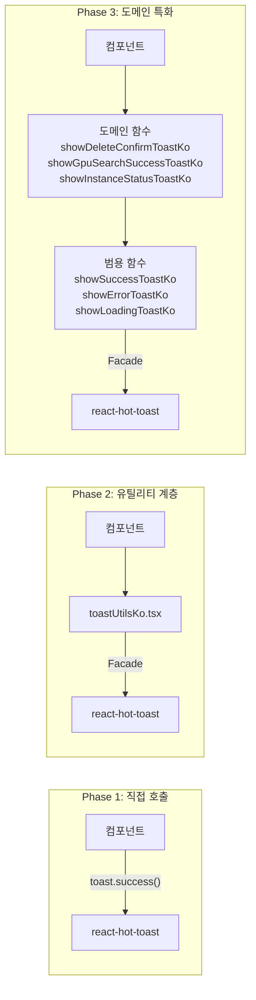

# React Hot Toast로 알림 시스템 개선하기

## 개요

XGEN 2.0 데스크톱 앱(Tauri + Next.js)은 초기에 알림 처리를 `window.alert()`와 `window.confirm()`으로 하고 있었다. 기능상 문제는 없지만 네이티브 다이얼로그는 앱의 디자인 톤과 어울리지 않고, Tauri 환경에서는 동작이 미묘하게 달라지는 경우도 있었다. 무엇보다 "성공", "실패", "경고", "확인" 같은 다양한 상황에 맞는 시각적 피드백이 필요했다.

`react-hot-toast`를 도입해서 이 문제를 해결했다. 단순히 라이브러리를 교체한 것이 아니라, 3단계에 걸쳐 알림 시스템 전체를 재설계했다. 최종적으로는 30개 이상의 도메인 특화 토스트 함수를 갖춘 중앙 집중화된 알림 시스템이 완성됐다.

## 아키텍처



## Phase 1: 라이브러리 도입 (2025-07-07)

```
# 커밋: feat: Integrate react-hot-toast for enhanced notification handling
# 날짜: 2025-07-07
```

첫 단계는 단순했다. `react-hot-toast`를 설치하고, `ToastProvider` 컴포넌트를 만들어 전역에 마운트하고, 기존 `alert()` 호출을 `toast.success()`/`toast.error()`로 교체했다.

```bash
# package.json
"react-hot-toast": "^2.5.2"
```

### ToastProvider 컴포넌트

```jsx
// ToastProvider.jsx
"use client";
import { Toaster } from 'react-hot-toast';

const ToastProvider = () => {
    return (
        <Toaster
            position="top-center"
            reverseOrder={false}
            toastOptions={{
                style: {
                    background: '#333',
                    color: '#fff',
                    borderRadius: '10px',
                    fontFamily: 'system-ui, -apple-system, sans-serif',
                },
                success: {
                    duration: 3000,
                    iconTheme: { primary: '#10b981', secondary: '#fff' },
                    style: {
                        background: '#ffffff',
                        color: '#374151',
                        borderWidth: '2px',
                        borderStyle: 'solid',
                        borderColor: '#10b981',
                        borderRadius: '10px',
                        fontWeight: '500',
                        boxShadow: '0 4px 12px rgba(16, 185, 129, 0.15)',
                    },
                },
                error: {
                    style: {
                        background: '#ffffff',
                        color: '#374151',
                        borderWidth: '2px',
                        borderStyle: 'solid',
                        borderColor: '#ef4444',
                    },
                    iconTheme: { primary: '#ef4444', secondary: '#fff' },
                },
                loading: {
                    style: { background: '#6b7280', color: '#fff', fontWeight: '500' },
                },
                custom: {
                    style: {
                        background: '#f9fafb',
                        color: '#374151',
                        borderWidth: '2px',
                        borderStyle: 'solid',
                        borderColor: '#374151',
                        borderRadius: '12px',
                        boxShadow: '0 8px 25px rgba(0, 0, 0, 0.15)',
                        maxWidth: '420px',
                        padding: '20px',
                    },
                },
            }}
        />
    );
};
```

5가지 토스트 타입(success, error, loading, blank, custom)에 각각 글로벌 스타일을 설정했다. 성공은 녹색 테두리, 에러는 빨간색 테두리, 로딩은 회색 배경, 커스텀은 큰 패딩과 그림자로 차별화했다.

layout.tsx에 마운트:

```tsx
// layout.tsx
import ToastProvider from "@/app/(common)/components/ToastProvider";

export default function RootLayout({ children }) {
    return (
        <html lang="en">
            <body>
                <ToastProvider />
                {children}
            </body>
        </html>
    );
};
```

### 첫 번째 적용: nodeHook.js

워크플로우 에디터의 `nodeHook.js`에서 노드 실행 결과를 알림으로 보여주던 코드가 첫 번째 전환 대상이었다:

```javascript
// Before
alert("노드 실행 완료");

// After
import toast from 'react-hot-toast';
toast.success("노드 실행 완료");
```

## Phase 2: 중앙 집중화 (2025-09-02)

```
# 커밋: Refactor and enhance modals, update styles, and add utility functions
# 날짜: 2025-09-02
```

직접 `toast.success()`를 호출하는 방식은 금방 한계에 부딪혔다. 컴포넌트마다 스타일이 미묘하게 달라지고, 한국어 메시지의 일관성이 깨졌다. 또한 `window.confirm()` 대체를 위한 커스텀 확인 토스트가 필요했는데, 이걸 각 컴포넌트에서 직접 구현하면 코드 중복이 심해진다.

해결 방법은 **Facade 패턴**으로 토스트 유틸리티 모듈을 만드는 것이었다.

### toastUtilsKo.tsx 구조

영문(`toastUtils.tsx`, 490줄)과 한국어(`toastUtilsKo.tsx`, 700줄+)를 병렬로 관리한다. 실제 앱에서는 한국어 버전이 주로 사용되고, 영문 버전은 다국어 지원 대비용이다.

#### 범용 함수

```typescript
// toastUtilsKo.tsx — 범용 토스트 함수
export const showSuccessToastKo = (message: string, duration: number = 3000) => {
    toast.success(message, {
        duration,
        style: {
            background: '#ffffff',
            color: '#374151',
            border: '2px solid #10b981',
            borderRadius: '10px',
            fontWeight: '500',
            fontFamily: 'system-ui, -apple-system, sans-serif',
            boxShadow: '0 4px 12px rgba(16, 185, 129, 0.15)',
        },
        iconTheme: { primary: '#10b981', secondary: '#fff' },
    });
};

export const showErrorToastKo = (message: string, duration: number = 4000) => {
    toast.error(message, {
        duration,
        style: {
            background: '#ef4444',
            color: '#fff',
            borderRadius: '10px',
            fontWeight: '500',
        },
        iconTheme: { primary: '#dc2626', secondary: '#fff' },
    });
};

export const showLoadingToastKo = (message: string, id?: string) => {
    return toast.loading(message, {
        id,
        style: { /* ... */ },
    });
};

export const dismissToastKo = (id?: string) => {
    toast.dismiss(id);
};
```

#### 삭제 확인 토스트 — window.confirm() 대체

가장 복잡한 부분이 `window.confirm()` 대체다. react-hot-toast의 커스텀 렌더링 기능을 활용해서 확인/취소 버튼이 포함된 토스트를 구현했다.

```typescript
export const showDeleteConfirmToastKo = ({
    title = '삭제 확인',
    message,
    itemName,
    onConfirm,
    onCancel,
    confirmText = '삭제',
    cancelText = '취소',
    duration = Infinity,
    enableEnterKey = false,
}: DeleteConfirmOptions & { enableEnterKey?: boolean }) => {
    // 기존 키보드 핸들러 제거
    if (currentKeyHandler) {
        document.removeEventListener('keydown', currentKeyHandler);
        currentKeyHandler = null;
    }

    // Enter/Escape 키보드 지원
    if (enableEnterKey) {
        currentKeyHandler = (e: KeyboardEvent) => {
            if (e.key === 'Enter') {
                e.preventDefault();
                document.removeEventListener('keydown', currentKeyHandler!);
                currentKeyHandler = null;
                toast.dismiss();
                onConfirm();
            }
            if (e.key === 'Escape') {
                e.preventDefault();
                document.removeEventListener('keydown', currentKeyHandler!);
                currentKeyHandler = null;
                toast.dismiss();
                onCancel?.();
            }
        };
        document.addEventListener('keydown', currentKeyHandler);
    }

    return toast(
        (t) => (
            <div style={{ display: 'flex', flexDirection: 'column', gap: '12px' }}>
                <div style={{
                    fontWeight: '600',
                    color: '#dc2626',
                    fontSize: '1rem'
                }}>
                    {title}
                </div>
                <div style={{
                    fontSize: '0.9rem',
                    color: '#374151',
                    lineHeight: '1.4'
                }}>
                    {message}
                </div>
                <div style={{
                    display: 'flex',
                    gap: '8px',
                    justifyContent: 'flex-end'
                }}>
                    <button
                        onClick={() => {
                            toast.dismiss(t.id);
                            onCancel?.();
                        }}
                        style={{ /* 취소 버튼 스타일 */ }}
                    >
                        {cancelText}
                    </button>
                    <button
                        onClick={async () => {
                            toast.dismiss(t.id);
                            await onConfirm();
                        }}
                        style={{ /* 삭제 버튼 — 빨간색 배경 */ }}
                    >
                        {confirmText}
                    </button>
                </div>
            </div>
        ),
        {
            duration,
            style: { maxWidth: '420px', padding: '20px' },
        }
    );
};
```

핵심 설계 결정:

- **duration: Infinity** — 확인 토스트는 자동으로 사라지면 안 된다. 사용자가 명시적으로 선택해야 한다.
- **async onConfirm** — 확인 콜백에 `await`를 지원해서 API 호출이 완료될 때까지 기다릴 수 있다.
- **커스텀 JSX 렌더링** — `toast()` 함수에 콜백을 전달하면 임의의 JSX를 렌더링할 수 있다. toast ID(`t.id`)로 개별 토스트를 dismiss한다.

### 전역 키보드 핸들러

```
# 커밋: feat: Add keyboard support to delete confirm toast
# 날짜: 2025-09-16
```

삭제 확인 토스트에 Enter(확인)/Escape(취소) 키보드 핸들러를 추가했다. 싱글톤 패턴으로 `currentKeyHandler`를 관리해서 중복 핸들러를 방지한다.

```typescript
// 전역 키보드 핸들러 — 싱글톤
let currentKeyHandler: ((e: KeyboardEvent) => void) | null = null;
```

이 변수가 모듈 스코프에 선언되어 있어서, 확인 토스트가 떠 있는 동안 다른 확인 토스트가 열리면 이전 핸들러를 자동으로 제거하고 새 핸들러를 등록한다. 토스트가 닫힐 때도 핸들러를 반드시 제거한다.

## Phase 3: 전면 적용과 도메인 특화 (2025-09-03)

```
# 커밋: Refactor toast notifications to use Korean utility functions across the application
# 날짜: 2025-09-03
```

이 커밋 하나로 **20개 파일**에서 `import toast from 'react-hot-toast'`를 `import { ... } from '@/app/_common/utils/toastUtilsKo'`로 전환했다. 238줄이 추가됐다.

적용 범위:

| 영역 | 적용 파일 |
|------|----------|
| 인증 | login, signup, logout, create-superuser |
| 관리자 | AdminSettings, AdminLLMConfig, AdminVectordbConfig, AdminVastAi, AdminGroupContent, AdminUserContent, AdminRegisterUser, AdminWorkflowLogs |
| 캔버스 | Canvas page, Header, HistoryPanel |
| 모델 | EvaluationTable, JobDetailModal |
| 모니터링 | Monitor, Executor, Tester, TesterLogs |
| 문서 | Documents, DocumentCollectionModal |
| 공통 | nodeHook, logoutUtils |

```
# 커밋: Refactor JobDetailModal component for improved readability and error handling
# 날짜: 2025-09-03
```

같은 날 두 번째 커밋으로 남은 `alert()`와 `window.confirm()`을 전부 제거했다.

### 도메인 특화 함수

범용 함수 위에 도메인별 함수를 계층화했다. 30개 이상의 함수가 있으며, 몇 가지 대표적인 예시:

```typescript
// 워크플로우 관련
export const showWorkflowDeleteConfirmKo = (
    workflowName: string,
    onConfirm: () => void,
    onCancel?: () => void
) => {
    showDeleteConfirmToastKo({
        title: '워크플로우 삭제',
        message: `"${workflowName}" 워크플로우를 삭제하시겠습니까?`,
        onConfirm,
        onCancel,
    });
};

export const showNewWorkflowConfirmKo = (
    onConfirm: () => void,
    onCancel?: () => void
) => {
    showDeleteConfirmToastKo({
        title: '새 워크플로우',
        message: '현재 작업 중인 워크플로우를 저장하지 않으면 변경사항이 사라집니다.',
        confirmText: '계속',
        onConfirm,
        onCancel,
    });
};

// GPU/인스턴스 관련
export const showGpuSearchSuccessToastKo = (count: number) => {
    showSuccessToastKo(`${count}개의 GPU를 발견했습니다.`);
};

export const showInstanceStatusToastKo = {
    creating: (id: string) => showLoadingToastKo(`인스턴스 ${id} 생성 중...`),
    running: (id: string) => showSuccessToastKo(`인스턴스 ${id} 실행 중`),
    error: (id: string, err: string) => showErrorToastKo(`인스턴스 ${id} 오류: ${err}`),
};

// 연결 테스트
export const showConnectionSuccessToastKo = (service: string, message?: string) => {
    showSuccessToastKo(message || `${service} 연결 성공`);
};

export const showConnectionErrorToastKo = (service: string, error: string) => {
    showErrorToastKo(`${service} 연결 실패: ${error}`);
};

// LLM/임베딩 제공자 변경
export const showLLMProviderChangeConfirmKo = (
    currentProvider: string,
    newProvider: string,
    onConfirm: () => void,
    onCancel?: () => void
) => {
    showDeleteConfirmToastKo({
        title: 'LLM 제공자 변경',
        message: `${currentProvider}에서 ${newProvider}로 변경하시겠습니까? 기존 설정이 초기화됩니다.`,
        confirmText: '변경',
        onConfirm,
        onCancel,
    });
};

// 히스토리 초기화 경고
export const showHistoryClearWarningKo = (
    onConfirm: () => void,
    onCancel?: () => void
) => {
    showDeleteConfirmToastKo({
        title: '히스토리 초기화',
        message: '캔버스를 나가면 작업 히스토리가 초기화됩니다. 계속하시겠습니까?',
        confirmText: '나가기',
        onConfirm,
        onCancel,
    });
};
```

```
# 커밋: feat: Add history clear warning toast and enhance header functionality
# 날짜: 2025-09-17
```

`showHistoryClearWarningKo` 함수는 캔버스 뒤로가기 시 히스토리 초기화를 경고하기 위해 추가됐다. 기존에는 확인 없이 바로 나가졌는데, Undo/Redo 히스토리가 날아가는 문제가 있었다.

## 트러블슈팅

### border shorthand vs 개별 속성

```
# 커밋: style: Refactor border styles in components
# 날짜: 2025-09-22
```

react-hot-toast의 인라인 스타일에서 `border` shorthand를 사용하면 일부 환경에서 제대로 적용되지 않는 문제가 있었다. `borderWidth`, `borderStyle`, `borderColor`로 개별 지정하니 해결됐다.

```typescript
// Before — 간헐적으로 테두리가 안 보임
style: { border: '2px solid #10b981' }

// After — 안정적으로 동작
style: {
    borderWidth: '2px',
    borderStyle: 'solid',
    borderColor: '#10b981',
}
```

이건 React의 인라인 스타일 처리 방식과 관련된 미묘한 이슈다. shorthand를 개별 속성으로 풀어쓰면 React가 각 속성을 명시적으로 DOM에 설정하므로 우선순위 충돌이 줄어든다.

### confirm 토스트의 비동기 콜백

`window.confirm()`은 동기적으로 true/false를 반환하지만, 토스트 기반 확인은 비동기다. 기존 코드가 동기적 흐름에 의존하는 경우가 많아서 전환 시 주의가 필요했다.

```typescript
// Before — 동기 흐름
if (window.confirm('삭제하시겠습니까?')) {
    await deleteItem(id);
    refreshList();
}

// After — 비동기 콜백
showDeleteConfirmToastKo({
    message: '삭제하시겠습니까?',
    onConfirm: async () => {
        await deleteItem(id);
        refreshList();
    },
});
```

`onConfirm` 콜백에 `async`를 지원하도록 설계한 덕분에, API 호출 후 후속 작업도 자연스럽게 처리된다.

### 토스트 중첩 문제

확인 토스트(`duration: Infinity`)가 열려 있는 상태에서 다른 토스트가 뜨면 화면이 복잡해졌다. `toast.dismiss()`로 확인 토스트를 닫은 뒤에 결과 토스트를 보여주는 순서를 지켜야 했다.

```typescript
onConfirm: async () => {
    toast.dismiss(t.id);  // 먼저 확인 토스트를 닫고
    try {
        await deleteItem(id);
        showSuccessToastKo('삭제되었습니다.');  // 그 다음 성공 토스트
    } catch (error) {
        showErrorToastKo('삭제 실패');
    }
}
```

## 결과 및 회고

9개 커밋에 걸쳐 약 2.5개월(7/7~9/22)간 진행된 알림 시스템 개선은 세 단계로 깔끔하게 나뉜다:

1. **Phase 1 (7/7)**: 라이브러리 도입 + 최소 적용
2. **Phase 2 (9/2)**: 유틸리티 모듈 중앙 집중화 + 커스텀 확인 토스트
3. **Phase 3 (9/3~9/22)**: 20개 파일 전면 전환 + 키보드 지원 + 도메인 특화

Facade 패턴이 핵심이었다. `toastUtilsKo.tsx`가 react-hot-toast API를 래핑하면서, 각 컴포넌트는 `showDeleteConfirmToastKo`처럼 의미가 명확한 함수만 호출하면 된다. 라이브러리 교체가 필요해지더라도 이 Facade 레이어만 수정하면 된다.

도메인 특화 함수 30개가 과도하다고 느낄 수 있지만, 실제로 메시지 일관성 유지에 큰 도움이 됐다. "삭제하시겠습니까?"라는 메시지가 10곳에서 사용되는데 한 곳만 "삭제할까요?"로 다르면 어색하다. 도메인 함수로 통일하면 이런 불일치가 원천적으로 방지된다.
