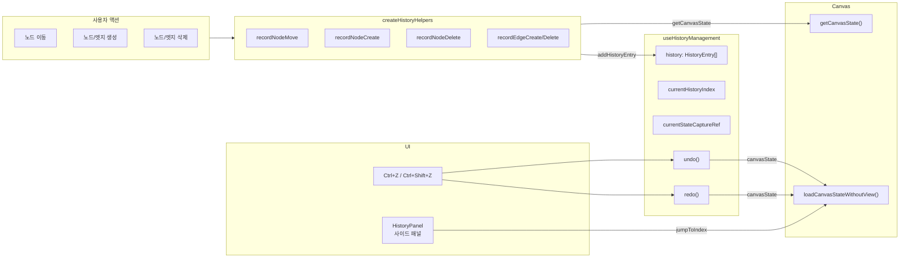
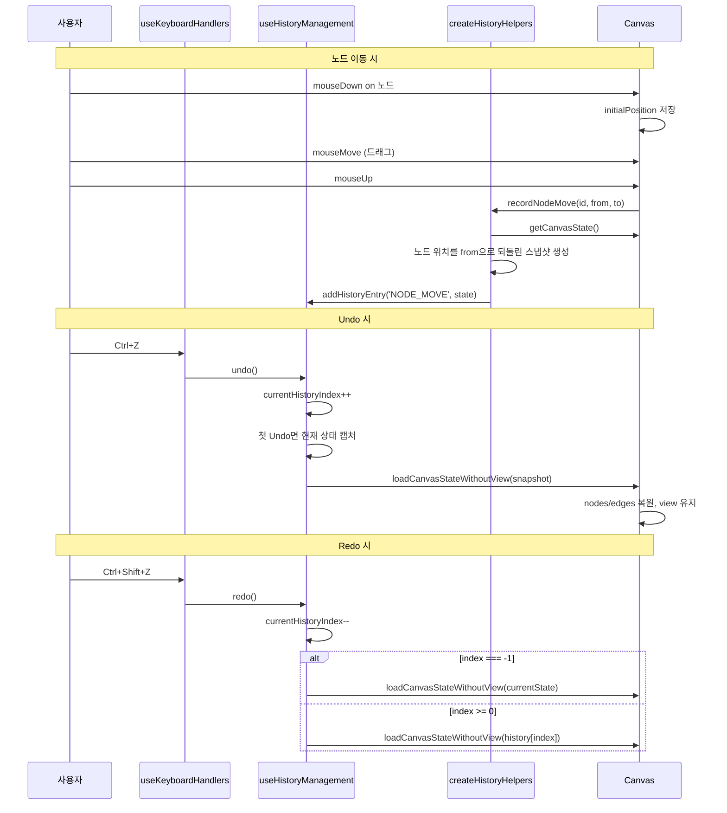

# React에서 Undo/Redo 구현: 워크플로우 에디터 히스토리 관리

## 개요

워크플로우 에디터를 운영하다 보니 Undo/Redo가 꼭 필요한 순간이 왔다. 노드를 잘못 삭제하거나 엣지를 잘못 연결했을 때, 브라우저를 새로고침하면 마지막 저장 시점으로 돌아가서 작업이 날아간다. Ctrl+Z 한 번이면 해결될 일에 전체 워크플로우를 다시 구성하는 건 생산성 낭비다.

Undo/Redo 구현에는 크게 두 가지 패턴이 있다: **Command 패턴**(각 액션의 do/undo를 정의)과 **Snapshot(Memento) 패턴**(전체 상태를 저장). 이 프로젝트에서는 Snapshot 패턴을 선택했고, 2025년 9월 17~18일 이틀간 18개 커밋, 3개 PR로 구현을 완료했다.

## 패턴 선택: Command vs Snapshot

### Command 패턴의 한계

Command 패턴은 각 액션에 대해 `execute()`와 `undo()`를 정의한다. 이론적으로 메모리 효율적이지만, 워크플로우 에디터에서는 심각한 문제가 있다.

1. **Cascade 효과**: 노드를 삭제하면 연결된 엣지도 함께 삭제된다. `undo()`에서 노드만 복원하면 안 되고, 삭제된 엣지들도 복원해야 한다. 노드에 연결된 엣지가 5개면 5개 모두 기억해야 한다.

2. **상호 의존성**: 엣지 연결 시 단일 연결 포트(`multi: false`)의 기존 엣지를 교체한다. 이 교체 로직의 역연산은 "교체된 원래 엣지를 복원"인데, 교체된 엣지가 무엇이었는지 별도로 저장해야 한다.

3. **구현 복잡도**: 액션 종류가 늘어날 때마다 `execute/undo` 쌍을 정의해야 한다. NODE_MOVE, NODE_CREATE, NODE_DELETE, EDGE_CREATE, EDGE_DELETE, EDGE_UPDATE, MULTI_ACTION... 각각의 역연산을 정확히 구현하는 비용이 크다.

### Snapshot 패턴의 장점

워크플로우 에디터의 Canvas 상태는 `{ nodes: CanvasNode[], edges: CanvasEdge[] }` 두 배열이다. 노드 수십 개, 엣지 수십 개 수준이라 직렬화해도 수 KB에 불과하다. 이 정도면 스냅샷을 50개 저장해도 수백 KB밖에 안 된다.

```typescript
// Snapshot 한 장의 크기가 작다
const canvasState = { nodes, edges };  // 수 KB
// 50장 저장해도 수백 KB -> 메모리 문제 없음
```

또한 React의 상태 관리 특성상 `getCanvasState()` 한 번 호출이면 전체 상태를 깊은 복사 없이 캡처할 수 있고, `loadCanvasState()` 한 번 호출이면 완벽한 복원이 된다. 역연산 로직을 별도로 구현할 필요가 없다.

## 아키텍처



## 핵심 구현: useHistoryManagement

### 타입 정의

```typescript
export type HistoryActionType =
    | 'NODE_MOVE'
    | 'NODE_CREATE'
    | 'NODE_DELETE'
    | 'EDGE_CREATE'
    | 'EDGE_DELETE'
    | 'EDGE_UPDATE'
    | 'MULTI_ACTION';

export interface HistoryEntry {
    id: string;
    timestamp: Date;
    actionType: HistoryActionType;
    description: string;
    canvasState?: any;    // 액션 실행 전의 Canvas 상태 스냅샷
    details: {
        nodeId?: string;
        edgeId?: string;
        fromPosition?: { x: number; y: number };
        toPosition?: { x: number; y: number };
        actions?: Array<{
            actionType: HistoryActionType;
            description: string;
            nodeId?: string;
            edgeId?: string;
        }>;
        [key: string]: any;
    };
}
```

# 커밋: feat: Implement history management feature with UI panel
# 날짜: 2025-09-17 07:09

`canvasState`에는 해당 액션이 실행되기 **이전**의 상태가 저장된다. Undo 시 이 스냅샷으로 Canvas를 복원하면 액션이 실행되기 전 상태로 돌아간다.

### 히스토리 스택 관리

```typescript
const MAX_HISTORY_SIZE = 50;
const DUPLICATE_PREVENTION_WINDOW_MS = 100;

export const useHistoryManagement = () => {
    const [history, setHistory] = useState<HistoryEntry[]>([]);
    const [currentHistoryIndex, setCurrentHistoryIndex] = useState(-1);
    // -1: 현재 상태 (최신)
    //  0: 가장 최근 히스토리 (한 단계 undo한 상태)
    //  1: 두 단계 전
    // ...

    const currentStateCaptureRef = useRef<(() => any) | null>(null);
    const [currentState, setCurrentState] = useState<any>(null);
    const canvasStateRestorerRef = useRef<((state: any) => void) | null>(null);

    const canUndo = history.length > 0 && currentHistoryIndex < history.length - 1;
    const canRedo = currentHistoryIndex > -1;
```

`currentHistoryIndex`의 의미가 핵심이다. `-1`은 현재(최신) 상태를 보고 있다는 뜻이고, `0` 이상이면 과거 상태를 보고 있다는 뜻이다. 숫자가 커질수록 더 과거다.

### addHistoryEntry: 히스토리 추가

```typescript
    const addHistoryEntry = useCallback((
        actionType: HistoryActionType,
        description: string,
        details: HistoryEntry['details'],
        canvasState?: any
    ) => {
        const now = Date.now();

        // 100ms 내 동일 액션 중복 방지
        if (history.length > 0) {
            const lastEntry = history[0];
            const timeDiff = now - lastEntry.timestamp.getTime();
            if (timeDiff < DUPLICATE_PREVENTION_WINDOW_MS
                && lastEntry.actionType === actionType
                && lastEntry.details?.nodeId === details?.nodeId) {
                return;
            }
        }

        const newEntry: HistoryEntry = {
            id: `history-${now}-${Math.random().toString(36).substr(2, 5)}`,
            timestamp: new Date(now),
            actionType,
            description,
            canvasState,
            details
        };

        setHistory(prev => {
            let newHistory = prev;

            // Undo 상태에서 새 액션 -> 미래 히스토리 삭제 (분기 처리)
            if (currentHistoryIndex >= 0) {
                newHistory = prev.slice(currentHistoryIndex);
            }

            // 최대 크기 제한
            const updated = [newEntry, ...newHistory];
            if (updated.length > MAX_HISTORY_SIZE) {
                return updated.slice(0, MAX_HISTORY_SIZE);
            }
            return updated;
        });

        // 새 액션이 추가되면 인덱스를 현재(-1)로 리셋
        setCurrentHistoryIndex(-1);
    }, [history, currentHistoryIndex]);
```

# 커밋: feat: Enhance history management with undo/redo functionality and canvas state restoration
# 날짜: 2025-09-17 07:50

히스토리 분기 처리가 중요하다. Undo로 과거 상태에 있을 때 새로운 액션을 수행하면, 현재 인덱스보다 미래에 해당하는 히스토리 항목들은 버린다. Git의 `reset --hard` 후 새 커밋을 하면 이전 커밋들이 사라지는 것과 같은 원리다.

### Undo 함수

```typescript
    const undo = useCallback(() => {
        if (!canUndo) return null;

        // 최신 상태에서 첫 Undo: 현재 상태 캡처
        if (currentHistoryIndex === -1 && currentStateCaptureRef.current) {
            const capturedState = currentStateCaptureRef.current();
            setCurrentState(capturedState);
        }

        const newIndex = currentHistoryIndex + 1;
        const targetEntry = history[newIndex];
        setCurrentHistoryIndex(newIndex);

        // Canvas 상태 복원
        if (canvasStateRestorerRef.current && targetEntry?.canvasState) {
            canvasStateRestorerRef.current(targetEntry.canvasState);
        }

        return targetEntry || null;
    }, [canUndo, currentHistoryIndex, history]);
```

첫 번째 Undo가 특별한 이유가 있다. `history[0]`에는 "가장 최근 액션 실행 전"의 상태가 들어있다. 그런데 Redo를 하려면 "가장 최근 액션 실행 후"의 상태, 즉 **현재 상태**가 필요하다. 그래서 첫 Undo 시점에 현재 상태를 별도로 캡처해둔다(`currentStateCaptureRef`).

### Redo 함수

```typescript
    const redo = useCallback(() => {
        if (!canRedo) return null;

        const newIndex = currentHistoryIndex - 1;
        setCurrentHistoryIndex(newIndex);

        if (newIndex === -1) {
            // 최신 상태로 복귀 -> 캡처해둔 현재 상태로 복원
            if (canvasStateRestorerRef.current && currentState) {
                canvasStateRestorerRef.current(currentState);
            }
        } else {
            // 중간 상태로 복귀
            const targetEntry = history[newIndex];
            if (canvasStateRestorerRef.current && targetEntry?.canvasState) {
                canvasStateRestorerRef.current(targetEntry.canvasState);
            }
        }

        return null;
    }, [canRedo, currentHistoryIndex, history, currentState]);
```

`newIndex === -1`이면 히스토리 스택의 끝을 넘어서 "현재"로 돌아온 것이다. 이때 첫 Undo에서 캡처해둔 `currentState`를 사용해 복원한다.

### jumpToHistoryIndex: 특정 시점으로 이동

```typescript
    const jumpToHistoryIndex = useCallback((targetIndex: number) => {
        if (targetIndex < 0 || targetIndex >= history.length) return;

        // 현재 상태 캡처 (나중에 최신으로 돌아올 수 있도록)
        if (currentHistoryIndex === -1 && currentStateCaptureRef.current) {
            const capturedState = currentStateCaptureRef.current();
            setCurrentState(capturedState);
        }

        setCurrentHistoryIndex(targetIndex);

        const targetEntry = history[targetIndex];
        if (canvasStateRestorerRef.current && targetEntry?.canvasState) {
            canvasStateRestorerRef.current(targetEntry.canvasState);
        }
    }, [currentHistoryIndex, history]);
```

HistoryPanel에서 특정 히스토리 항목을 클릭하면 해당 시점으로 바로 이동한다. Undo를 여러 번 누르지 않아도 원하는 시점으로 점프할 수 있다.

## createHistoryHelpers: 액션별 기록 함수

`useHistoryManagement`에서 범용 `addHistoryEntry`를 제공하고, `createHistoryHelpers`에서 각 액션 타입에 맞는 편의 함수를 생성한다.

### recordNodeMove: 노드 이동 기록

노드 이동은 가장 빈번한 액션이다. 이동 전 위치를 스냅샷에 포함해야 Undo 시 원래 위치로 돌아간다.

```typescript
const createHistoryHelpers = (addHistoryEntry, historyManagement, getCanvasState) => {
    return {
        recordNodeMove: (nodeId: string, fromPosition: Position, toPosition: Position) => {
            const currentCanvasState = getCanvasState?.();
            if (!currentCanvasState) return;

            // 현재 상태에서 해당 노드만 이동 전 위치로 되돌린 스냅샷 생성
            const nodesWithOriginalPosition = currentCanvasState.nodes.map((node) => {
                if (node.id === nodeId) {
                    return { ...node, position: { ...fromPosition } };
                }
                return node;
            });

            const beforeMoveState = createHistoryCanvasState({
                ...currentCanvasState,
                nodes: nodesWithOriginalPosition
            });

            addHistoryEntry('NODE_MOVE', description, {
                nodeId,
                fromPosition,
                toPosition
            }, beforeMoveState);
        },
```

핵심은 "이동 후" 상태가 아닌 "이동 전" 상태를 스냅샷에 저장하는 것이다. Undo는 "이전 상태로 돌아가기"이므로 스냅샷에는 액션 실행 전 상태가 들어가야 한다. `getCanvasState()`가 반환하는 건 이동 후 상태이므로, 해당 노드의 위치만 `fromPosition`으로 되돌린 복사본을 만든다.

### recordNodeCreate / recordNodeDelete

```typescript
        recordNodeCreate: (nodeId: string, nodeType: string) => {
            const currentCanvasState = getCanvasState?.();
            if (!currentCanvasState) return;

            // 생성 전 상태 = 현재 상태에서 해당 노드 제거
            const stateBeforeCreate = createHistoryCanvasState({
                ...currentCanvasState,
                nodes: currentCanvasState.nodes.filter(n => n.id !== nodeId)
            });

            addHistoryEntry('NODE_CREATE', `노드 생성: ${nodeType}`, {
                nodeId
            }, stateBeforeCreate);
        },

        recordNodeDelete: (nodeId: string, nodeType: string) => {
            const currentCanvasState = getCanvasState?.();
            if (!currentCanvasState) return;

            // 삭제 전 상태 = 현재 상태 그대로 (아직 삭제 전이므로)
            const stateBeforeDelete = createHistoryCanvasState(currentCanvasState);

            addHistoryEntry('NODE_DELETE', `노드 삭제: ${nodeType}`, {
                nodeId
            }, stateBeforeDelete);
        },
```

`recordNodeCreate`에서는 현재 상태에서 새로 생성된 노드를 제거한 상태를 스냅샷으로 저장한다. Undo하면 이 스냅샷이 복원되면서 새 노드가 사라진다.

`recordNodeDelete`에서는 삭제가 실행되기 전에 호출되므로, 현재 상태를 그대로 저장하면 된다. 삭제될 노드와 연결된 엣지가 모두 포함되어 있어서 Undo 시 완벽하게 복원된다.

### MULTI_ACTION: 복합 액션 처리

AI 채팅에서 "PredictedNode"(AI가 추천한 노드)를 생성하면 노드와 엣지가 동시에 생성된다. 이를 하나의 히스토리 항목으로 묶는다.

```typescript
        recordMultiAction: (actions: Array<{
            actionType: HistoryActionType;
            description: string;
            nodeId?: string;
            edgeId?: string;
        }>) => {
            const currentCanvasState = getCanvasState?.();
            if (!currentCanvasState) return;

            const stateBeforeMulti = createHistoryCanvasState(currentCanvasState);

            addHistoryEntry('MULTI_ACTION', `통합 작업 (${actions.length}개)`, {
                actions
            }, stateBeforeMulti);
        },
```

# 커밋: feat: Enhance history management by adding MULTI_ACTION type and updating usePortHandlers for edge handling
# 날짜: 2025-09-18 00:33

MULTI_ACTION이 없으면 노드 생성과 엣지 생성이 별도 히스토리로 기록되어, Undo를 두 번 눌러야 "AI 추천 노드 추가"가 완전히 취소된다. 사용자 관점에서는 하나의 동작이므로 하나의 Undo로 처리하는 것이 자연스럽다.

## View 제외 스냅샷

초기 구현에서 Undo/Redo를 하면 줌 레벨과 패닝 위치까지 과거 상태로 돌아가는 문제가 있었다. 노드를 2x 줌에서 이동한 후 Undo하면 갑자기 1x 줌으로 바뀌는 것이다.

```typescript
// View를 제외한 스냅샷 생성
const createHistoryCanvasState = (fullState: CanvasState) => {
    return {
        nodes: fullState.nodes.map(n => ({
            ...n,
            position: { ...n.position },
            data: { ...n.data }
        })),
        edges: fullState.edges.map(e => ({
            ...e,
            source: { ...e.source },
            target: { ...e.target }
        }))
        // view는 포함하지 않음!
    };
};
```

Canvas에 `loadCanvasStateWithoutView` 메서드를 추가해서 view를 유지한 채 nodes/edges만 복원하도록 했다.

```typescript
// Canvas/index.tsx
useImperativeHandle(ref, () => ({
    getCanvasState: (): CanvasState => ({ view, nodes, edges }),

    // 전체 복원 (워크플로우 로드 시)
    loadCanvasState: (state: Partial<CanvasState>) => {
        if (state.nodes) setNodes(state.nodes);
        if (state.edges) setEdges(state.edges);
        if (state.view) setView(state.view);
    },

    // View 제외 복원 (Undo/Redo 시)
    loadCanvasStateWithoutView: (state: Partial<CanvasState>) => {
        if (state.nodes) setNodes(state.nodes);
        if (state.edges) setEdges(state.edges);
        // view는 건드리지 않음 -> 현재 줌/패닝 유지
    },
}));
```

# 커밋: feat: Implement history management enhancements to exclude view state during restoration
# 날짜: 2025-09-17 23:34

## skipHistory: API 로드 시 기록 방지

워크플로우를 파일에서 로드하면 노드와 엣지가 대량으로 추가된다. 이 과정에서 `addNode`, `addEdge`가 호출될 때마다 히스토리가 기록되면, "워크플로우 로드" 한 번에 히스토리가 30개씩 쌓이는 문제가 발생한다.

```typescript
// useNodeManagement.ts
const addNode = useCallback((nodeData: NodeData, position: Position, skipHistory = false) => {
    const newNode: CanvasNode = {
        id: generateId(),
        data: { ...nodeData },
        position
    };
    setNodes(prev => [...prev, newNode]);

    // skipHistory가 true면 히스토리 기록하지 않음
    if (!skipHistory && historyHelpers) {
        historyHelpers.recordNodeCreate(newNode.id, nodeData.nodeName);
    }

    return newNode;
}, [historyHelpers]);

// 워크플로우 로드 시
const loadWorkflow = (workflowData: WorkflowData) => {
    workflowData.nodes?.forEach(node => {
        addNode(node.data, node.position, true);  // skipHistory = true
    });
    workflowData.edges?.forEach(edge => {
        addEdge(edge, true);  // skipHistory = true
    });
};
```

# 커밋: feat: Enhance edge and node management with optional history recording and multi-action support
# 날짜: 2025-09-17 11:57

## 키보드 단축키: useKeyboardHandlers

```typescript
const isCtrlOrCmdPressed = (e: KeyboardEvent): boolean => {
    const isMac = typeof navigator !== "undefined"
        && /Mac|iPod|iPhone|iPad/.test(navigator.platform);
    return isMac ? e.metaKey : e.ctrlKey;
};

export const useKeyboardHandlers = ({
    selectedNodeId, selectedEdgeId,
    undo, redo, canUndo, canRedo,
    // ... 기타 핸들러
}) => {
    const handleKeyDown = useCallback((e: KeyboardEvent) => {
        // INPUT, SELECT, TEXTAREA 내부에서는 무시
        const target = e.target as HTMLElement;
        if (['INPUT', 'SELECT', 'TEXTAREA'].includes(target.tagName)) return;

        const isCtrlOrCmd = isCtrlOrCmdPressed(e);

        // Ctrl+Shift+Z = Redo
        if (isCtrlOrCmd && e.shiftKey && e.key === 'Z') {
            e.preventDefault();
            if (canRedo) redo();
            return;
        }

        // Ctrl+Z = Undo
        if (isCtrlOrCmd && e.key === 'z') {
            e.preventDefault();
            if (canUndo) undo();
            return;
        }

        // Delete / Backspace = 선택된 노드/엣지 삭제
        if (e.key === 'Delete' || e.key === 'Backspace') {
            e.preventDefault();
            if (selectedNodeId) deleteSelectedNode();
            else if (selectedEdgeId) deleteSelectedEdge();
        }

        // Ctrl+C = 복사, Ctrl+V = 붙여넣기
        // ...
    }, [selectedNodeId, selectedEdgeId, canUndo, canRedo, undo, redo]);

    return { handleKeyDown };
};
```

# 커밋: refactor: Extract isCtrlOrCmdPressed function for better readability
# 날짜: 2025-09-18 07:06

Redo 단축키(`Ctrl+Shift+Z`)를 Undo(`Ctrl+Z`)보다 먼저 체크하는 순서가 중요하다. `Shift+Z`는 `key === 'Z'`(대문자)이고, `z`는 `key === 'z'`(소문자)다. Redo 체크를 나중에 하면 Undo 조건(`e.key === 'z'`)에 걸리지 않아서 문제없지만, 실제로는 `Shift` 키가 눌린 상태에서 `e.key`가 대문자 `Z`가 되므로 Undo 조건에 걸리지 않는다. 그래도 명시적 순서로 안전하게 처리한다.

`isCtrlOrCmdPressed`를 별도 함수로 추출한 이유는 Mac에서는 `Cmd` 키를, Windows/Linux에서는 `Ctrl` 키를 사용하는 크로스 플랫폼 호환성 때문이다. `navigator.platform`으로 OS를 감지한다.

## 드래그 종료 시 NODE_MOVE 기록

노드 이동은 `mouseMove`마다 발생하지만, 히스토리는 `mouseUp`(드래그 종료) 시 한 번만 기록해야 한다. 또한 클릭만 하고 실제로 이동하지 않은 경우는 기록하지 않는다.

```typescript
// useDragState.ts
const startDrag = useCallback((nodeId: string, position: Position) => {
    // 드래그 시작 시 초기 위치 저장
    initialNodePositionRef.current = { ...position };
    setDragState({ type: 'node', nodeId });
}, []);

const stopDrag = useCallback(() => {
    if (dragState.type === 'node' && dragState.nodeId) {
        const currentNode = nodes.find(n => n.id === dragState.nodeId);
        const initialPos = initialNodePositionRef.current;

        if (currentNode && initialPos) {
            // 5px 이상 이동했을 때만 히스토리 기록
            const dx = Math.abs(currentNode.position.x - initialPos.x);
            const dy = Math.abs(currentNode.position.y - initialPos.y);
            if (dx > 5 || dy > 5) {
                historyHelpers.recordNodeMove(
                    dragState.nodeId,
                    initialPos,
                    currentNode.position
                );
            }
        }
    }
    initialNodePositionRef.current = null;
    setDragState({ type: 'none' });
}, [dragState, nodes, historyHelpers]);
```

# 커밋: feat: Enhance drag and history management with detailed logging and NODE_MOVE handling
# 날짜: 2025-09-17 12:34

5px 임계값은 "클릭은 했지만 의도하지 않은 미세한 움직임"을 필터링한다. 노드를 선택하려고 클릭했을 때 마우스가 살짝 움직이는 것까지 히스토리에 기록하면 쓸모없는 항목이 쌓인다.

## HistoryPanel: 히스토리 UI

오른쪽에서 슬라이드-인하는 사이드 패널로, 전체 히스토리 목록을 시각적으로 보여준다.

```typescript
// HistoryPanel.tsx
const actionTypeLabels: Record<HistoryActionType, string> = {
    'NODE_MOVE': '이동',
    'NODE_CREATE': '생성',
    'NODE_DELETE': '삭제',
    'EDGE_CREATE': '연결',
    'EDGE_DELETE': '연결해제',
    'EDGE_UPDATE': '연결수정',
    'MULTI_ACTION': '통합작업'
};

const actionTypeColors: Record<HistoryActionType, string> = {
    'NODE_MOVE': '#3b82f6',
    'NODE_CREATE': '#10b981',
    'NODE_DELETE': '#ef4444',
    'EDGE_CREATE': '#8b5cf6',
    'EDGE_DELETE': '#f59e0b',
    'EDGE_UPDATE': '#6366f1',
    'MULTI_ACTION': '#ec4899'
};

const HistoryPanel: React.FC<HistoryPanelProps> = ({
    isOpen, onClose, history, currentHistoryIndex,
    onUndo, onRedo, onJumpToIndex, onClear,
    canUndo, canRedo
}) => {
    return (
        <div className={`${styles.panel} ${isOpen ? styles.open : ''}`}>
            <div className={styles.header}>
                <h3 className={styles.title}>History</h3>
                <div className={styles.headerControls}>
                    <span className={styles.count}>{history.length}</span>
                    <button onClick={handleClear} className={styles.clearButton}
                            disabled={history.length === 0}>
                        Clear
                    </button>
                    <button onClick={onClose} className={styles.closeButton}>X</button>
                </div>
            </div>

            <div className={styles.historyList}>
                {/* 현재 상태 표시 */}
                <div className={`${styles.historyItem} ${currentHistoryIndex === -1 ? styles.current : ''}`}
                     onClick={() => onJumpToIndex(-1)}>
                    <span className={styles.badge} style={{ background: '#22c55e' }}>현재</span>
                    <span>Current State</span>
                </div>

                {/* 히스토리 목록 */}
                {history.map((entry, index) => (
                    <div
                        key={entry.id}
                        className={`${styles.historyItem} ${index === currentHistoryIndex ? styles.current : ''} ${index > currentHistoryIndex && currentHistoryIndex !== -1 ? styles.future : ''}`}
                        onClick={() => onJumpToIndex(index)}
                    >
                        <span className={styles.badge}
                              style={{ background: actionTypeColors[entry.actionType] }}>
                            {actionTypeLabels[entry.actionType]}
                        </span>
                        <span className={styles.description}>{entry.description}</span>
                        <span className={styles.timestamp}>
                            {entry.timestamp.toLocaleTimeString()}
                        </span>
                    </div>
                ))}
            </div>
        </div>
    );
};
```

# 커밋: feat: Reintroduce HistoryPanel component with complete functionality and styling
# 날짜: 2025-09-17 13:32

현재 인덱스보다 "미래"에 해당하는 항목은 흐릿하게(`opacity: 0.5`) 표시되고, 현재 항목은 파란색 테두리로 하이라이트된다. 항목을 클릭하면 `jumpToHistoryIndex`가 호출되어 해당 시점으로 바로 이동한다.

### 히스토리 삭제 시 토스트 경고

```typescript
const handleClear = () => {
    showLoadingToastKo('히스토리를 삭제하시겠습니까?', {
        duration: 3000,
        icon: 'warning'
    });
    onClear();
};
```

# 커밋: feat: Add history clear warning toast and enhance header functionality
# 날짜: 2025-09-17 13:48

## 시행착오 타임라인

이틀간의 구현 과정을 커밋 순서대로 정리한다.

### Day 1 (2025-09-17)

**07:09 - 최초 구현**: 히스토리 기록만 있고 Undo가 없는 단순 로그 형태로 시작. HistoryPanel에 히스토리 목록이 표시되지만 클릭해도 아무 일도 안 일어남.

**07:50 - Undo/Redo 추가**: `canvasState` 스냅샷을 각 히스토리 항목에 저장하고, `undo()` / `redo()`로 상태를 복원하는 핵심 로직 구현. `currentStateCaptureRef`로 첫 Undo 시 현재 상태를 캡처하는 패턴 도입.

**11:57 - skipHistory 도입**: API 로드 시 노드/엣지가 대량 추가되면서 히스토리가 폭발하는 문제 해결. `addNode(data, pos, true)`처럼 `skipHistory` 파라미터 추가.

**12:34 - NODE_MOVE 개선**: 드래그 종료 시에만 기록, 5px 이상 이동만 기록. `initialNodePosition` 저장으로 이동 전/후 위치 비교.

**13:32 - HistoryPanel 재구현**: 한 번 삭제했다가 다시 만든 HistoryPanel. 액션 타입별 색상 배지, 타임스탬프, jump-to-index 기능.

**22:53 - PR #190 머지**: feature-undo_redo 브랜치의 첫 번째 PR.

**23:34 - View 제외**: Undo 시 줌/패닝이 변경되는 문제 해결. `createHistoryCanvasState`에서 view 제외, `loadCanvasStateWithoutView` 메서드 추가.

### Day 2 (2025-09-18)

**00:18 - HistoryPanel 리팩토링**: 필터 기능 제거(쓸모없음), 버튼 아이콘 업데이트.

**00:33 - MULTI_ACTION**: PredictedNode 생성 시 노드+엣지를 하나의 히스토리로 묶는 기능.

**06:40 - NODE_UPDATE 제거**: 파라미터 변경(Temperature, Model 등)마다 스냅샷이 저장되어 히스토리가 너무 빨리 50개에 도달. 파라미터 변경은 히스토리 대상에서 제외하기로 결정.

**07:06 - isCtrlOrCmdPressed 추출**: Mac/Windows 분기를 유틸 함수로 리팩토링.

**08:38, 09:35 - PR #191, #193 머지**: 최종 마무리.

# 커밋: refactor: Remove NODE_UPDATE action handling and related history recording
# 날짜: 2025-09-18 06:40

NODE_UPDATE를 제거한 것은 중요한 설계 판단이다. Temperature를 0.7에서 0.8로 바꾸고, 다시 0.9로 바꾸면 히스토리 두 개가 쌓인다. Model을 GPT-4에서 GPT-4o로 바꾸면 또 하나. 파라미터 조정은 빈번하고, 각각 전체 Canvas 스냅샷을 저장하면 50개 한도에 금방 도달해서 정작 중요한 노드 이동/삭제 히스토리가 밀려나간다.

## 전체 데이터 흐름 정리



## 결과 및 회고

이틀간의 집중 작업으로 18개 커밋, 3개 PR을 통해 완전한 Undo/Redo 시스템을 구현했다.

Snapshot 패턴을 선택한 것은 정확한 판단이었다. 워크플로우 상태의 크기가 작아서 메모리 문제가 없고, 역연산 정의의 복잡도를 완전히 회피할 수 있었다. 특히 노드 삭제 시 연결된 엣지까지 자동으로 복원되는 것은 Command 패턴이었다면 상당히 복잡했을 것이다.

NODE_UPDATE를 제거한 결정도 실전에서 검증되었다. 파라미터 변경이 Undo 대상에서 빠지면서 히스토리가 "의미 있는 구조 변경"만 추적하게 되었고, 50개 한도 내에서 충분한 히스토리를 유지할 수 있었다.

아쉬운 점은 100ms 중복 방지 윈도우가 때때로 빠른 연속 액션을 씹는 것이다. 노드를 빠르게 두 개 연속 삭제하면 두 번째가 기록되지 않을 수 있다. 이 값을 50ms로 줄이거나, 같은 nodeId인 경우에만 중복 체크하는 것이 개선 방향이다.
