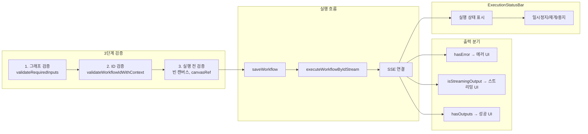

# Workflow Execution Panel: 검증과 에러 핸들링 UI 패턴

## 개요

워크플로우 에디터에서 "Run" 버튼을 누르면 무슨 일이 일어날까? 단순히 API를 호출하고 결과를 보여주는 것처럼 보이지만, 실제로는 여러 단계의 검증, 에러 분기, SSE 스트리밍 처리가 겹쳐 있다. 필수 입력 포트가 연결되지 않았는지, 워크플로우 ID가 유효한지, 빈 캔버스가 아닌지 확인한 후에야 실행이 시작되고, 실행 결과는 에러/스트리밍/성공 세 가지 타입으로 분기해서 렌더링해야 한다.

이 글에서는 ExecutionPanel 컴포넌트와 그 주변 시스템을 다룬다. TypeScript 타입 가드로 출력 타입을 안전하게 분기하는 패턴, 3단계 검증 레이어, SSE 기반 실시간 출력, 일시정지/재개 기능까지가 범위다.

## 아키텍처



## 핵심 구현

### 타입 시스템: ExecutionOutput

워크플로우 실행 결과는 세 가지 형태 중 하나다. TypeScript의 유니언 타입과 타입 가드를 사용해서 각 경우를 안전하게 분기한다.

```typescript
// canvas/types.ts
export interface ExecutionError {
    error: string;
}

export interface ExecutionSuccess {
    outputs: Record<string, any>;
}

export interface ExecutionStream {
    stream: string;
}

export type ExecutionOutput =
    | ExecutionError
    | ExecutionSuccess
    | ExecutionStream
    | null;
```

타입 가드 함수는 `output is ExecutionError` 같은 타입 서술어(type predicate)를 사용한다. 이렇게 하면 타입 가드를 통과한 후의 코드에서 TypeScript가 자동으로 타입을 좁혀준다.

```typescript
// 타입 가드 함수
export const hasError = (output: ExecutionOutput): output is ExecutionError => {
    return output !== null && typeof (output as ExecutionError).error === 'string';
};

export const hasOutputs = (output: ExecutionOutput): output is ExecutionSuccess => {
    return output !== null && typeof (output as ExecutionSuccess).outputs !== 'undefined';
};

export const isStreamingOutput = (output: ExecutionOutput): output is ExecutionStream => {
    return output !== null && typeof (output as ExecutionStream).stream === 'string';
};
```

### OutputRenderer — 타입 가드 기반 렌더링

ExecutionPanel의 핵심 컴포넌트인 OutputRenderer는 타입 가드를 사용해서 출력 타입별로 다른 UI를 렌더링한다.

```typescript
const OutputRenderer: React.FC<OutputRendererProps> = ({ output }) => {
    if (!output) {
        return (
            <div className={styles.placeholder}>
                Click 'Run' to execute the workflow.
            </div>
        );
    }

    if (hasError(output)) {
        return (
            <div className={`${styles.resultContainer} ${styles.error}`}>
                <div className={styles.status}>
                    <LuCircleX />
                    <span>Execution Failed</span>
                </div>
                <div className={styles.message}>{output.error}</div>
            </div>
        );
    }

    if (isStreamingOutput(output)) {
        return (
            <div className={`${styles.resultContainer} ${styles.success}`}>
                <div className={styles.outputDataSection}>
                    <pre className={styles.outputContent}>
                        {output.stream}
                    </pre>
                </div>
            </div>
        );
    }

    if (hasOutputs(output)) {
        return (
            <div className={`${styles.resultContainer} ${styles.success}`}>
                <div className={styles.outputDataSection}>
                    <pre className={styles.outputContent}>
                        {JSON.stringify(output.outputs, null, 2)}
                    </pre>
                </div>
            </div>
        );
    }

    return (
        <div className={styles.placeholder}>
            Unexpected output format.
        </div>
    );
};
```

이 패턴의 장점은 **완전성(exhaustiveness)**이다. 네 가지 경우(null, error, stream, outputs)를 모두 처리하고, 예상치 못한 형태에 대한 폴백도 있다. 새로운 출력 타입이 추가되면 타입 가드를 추가하고 분기를 넣으면 된다.

### 3단계 검증 레이어

실행 전에 세 단계의 검증을 거친다.

#### 1단계: 그래프 레벨 검증

캔버스의 모든 노드를 순회하면서 필수 입력 포트에 연결이 있는지 확인한다.

```typescript
// canvasUtils.ts
export const validateRequiredInputs = (
    nodes: CanvasNode[],
    edges: CanvasEdge[]
): ValidationResult => {
    for (const node of nodes) {
        if (!node.data.inputs || node.data.inputs.length === 0) continue;

        for (const input of node.data.inputs) {
            if (input.required) {
                const hasConnection = edges.some(edge =>
                    edge.target.nodeId === node.id &&
                    edge.target.portId === input.id
                );
                if (!hasConnection) {
                    return {
                        isValid: false,
                        nodeId: node.id,
                        nodeName: node.data.nodeName,
                        inputName: input.name
                    };
                }
            }
        }
    }
    return { isValid: true };
};
```

검증 실패 시 어떤 노드의 어떤 입력이 문제인지를 정확히 알려준다. `ValidationResult`에 `nodeId`와 `inputName`이 포함되어 있어서, UI에서 해당 노드를 하이라이트하거나 포커스할 수 있다.

```typescript
export interface ValidationResult {
    isValid: boolean;
    error?: string;
    nodeId?: string;
    nodeName?: string;
    inputName?: string;
}
```

#### 2단계: 워크플로우 ID 검증

```
# 커밋: feat: Implement workflow ID validation across multiple components and hooks
# 날짜: 2025-12-17
```

워크플로우 ID가 유효한지 검증하는 레이어다. 이 검증이 필요했던 이유가 재밌다 — URL 파라미터에서 `user_id`가 `workflowId`로 혼입되는 버그가 있었다. URL이 `/canvas?user_id=123&workflowId=workflow_abc`인데, 파싱 로직 오류로 `workflowId`에 `123`이 들어가는 경우가 있었다.

```javascript
// workflowStorage.js
export const isValidWorkflowId = (workflowId) => {
    if (!workflowId || typeof workflowId !== 'string') return false;

    const trimmedId = workflowId.trim();
    if (trimmedId === 'None') return false;       // Python None이 문자열로 넘어오는 경우
    if (trimmedId === 'default_mode') return true; // 특수 값
    if (/^\d+$/.test(trimmedId)) return false;     // 숫자만 있으면 user_id 혼입

    if (trimmedId.startsWith('workflow_')) return true;
    return true;  // 하위 호환성
};

export const validateWorkflowIdWithContext = (workflowId, context) => {
    const isValid = isValidWorkflowId(workflowId);
    if (!isValid) {
        devLog.error(
            `[${context}] Invalid workflowId detected: "${workflowId}"`
        );
    }
    return isValid;
};
```

`context` 파라미터는 디버깅용이다. 어디서 잘못된 ID가 사용됐는지 로그로 추적할 수 있다.

#### 3단계: 실행 전 검증

handleExecute 함수에서 최종 검증을 수행한다:

```typescript
// page.tsx
const handleExecute = async () => {
    // canvasRef 존재 여부
    if (!canvasRef.current) {
        showErrorToastKo('캔버스가 준비되지 않았습니다');
        return;
    }

    // 그래프 검증 (1단계 호출)
    const validationResult =
        (canvasRef.current as any).validateAndPrepareExecution();
    if (validationResult.error) {
        showErrorToastKo(validationResult.error);
        return;
    }

    setIsExecuting(true);
    setExecutionOutput(null);
    const toastId = showLoadingToastKo('워크플로우 실행 중...');

    try {
        let workflowData = (canvasRef.current as any).getCanvasState();

        // 빈 워크플로우 검사
        if (!workflowData.nodes || workflowData.nodes.length === 0) {
            throw new Error('Cannot execute an empty workflow.');
        }

        // 먼저 저장, 그 다음 실행
        await saveWorkflow(workflowData);
        await executeWorkflowByIdStream({
            workflowId,
            onData: (data) => {
                setExecutionOutput({ stream: data });
            },
            onError: (error) => {
                setExecutionOutput({ error: error.message });
            },
        });

        dismissToastKo(toastId);
        showSuccessToastKo('워크플로우 실행 완료');
    } catch (err) {
        dismissToastKo(toastId);
        setExecutionOutput({
            error: err.message || 'An error occurred'
        });
        showErrorToastKo(
            err.message || '워크플로우 실행 중 오류가 발생했습니다'
        );
    } finally {
        setIsExecuting(false);
    }
};
```

"먼저 저장, 그 다음 실행"이라는 패턴이 중요하다. 실행 전에 항상 현재 캔버스 상태를 저장하므로, 실행 도중 에러가 발생해도 최신 상태가 보존된다.

### SSE 스트리밍 실행

워크플로우 실행은 SSE(Server-Sent Events)로 결과를 스트리밍한다. 실행이 수 초~수 분 걸릴 수 있으므로, 실시간으로 진행 상황을 보여줘야 한다.

```typescript
// useWorkflowExecution.ts — SSE 콜백 구조
await executeWorkflowByIdStream({
    workflowId,
    onData: (data) => {
        // 실시간 텍스트 출력 누적
        setStreamContent(prev => prev + data);
    },
    onLog: (log) => {
        // 실행 로그 수집
        setExecutionLogs(prev => [...prev, log]);
    },
    onTool: (tool) => {
        // 도구 호출 추적 (도구 배지 표시용)
        setToolEvents(prev => [...prev, tool]);
    },
    onNodeStatus: (nodeId, status) => {
        // 캔버스에서 현재 실행 중인 노드 하이라이팅
        setActiveNodeId(nodeId);
    },
    onEnd: () => {
        showSuccessToastKo('실행 완료');
    },
    onError: (error) => {
        showErrorToastKo(error.message);
    },
});
```

### SSE 연결 관리: sseManager

SSE 연결의 생명주기를 관리하는 싱글톤 클래스다. 연결 생성, 중단, 일시정지, 재개를 상태 머신으로 관리한다.

```typescript
// sseManager.ts
class SSEManager {
    private connections: Map<string, AbortController> = new Map();
    private pausedConnections: Set<string> = new Set();
    private pausedBuffers: Map<string, { type: string; data: any }[]>
        = new Map();

    // 일시정지: 연결은 유지하되 콜백 실행 중단, 데이터는 버퍼에 축적
    public pauseConnection(workflowId: string, callbacks?: any) {
        this.pausedConnections.add(workflowId);
        if (!this.pausedBuffers.has(workflowId)) {
            this.pausedBuffers.set(workflowId, []);
        }
    }

    // 재개: 버퍼의 축적된 데이터를 한 번에 flush
    public resumeConnection(workflowId: string) {
        this.pausedConnections.delete(workflowId);
        const buffer = this.pausedBuffers.get(workflowId);
        if (buffer && buffer.length > 0) {
            // 버퍼 데이터를 순서대로 콜백에 전달
            buffer.forEach(item => {
                this.processBufferedItem(workflowId, item);
            });
            this.pausedBuffers.set(workflowId, []);
        }
    }

    // 일시정지 중 데이터 수신 시 버퍼에 축적
    public bufferData(
        workflowId: string,
        type: string,
        data: any
    ) {
        const buffer = this.pausedBuffers.get(workflowId);
        if (buffer) {
            buffer.push({ type, data });
        }
    }

    // 전체 정리
    public closeAllConnections() {
        this.connections.forEach((controller) => controller.abort());
        this.connections.clear();
        this.pausedConnections.clear();
        this.pausedBuffers.clear();
    }
}
```

```
# 커밋: feat: Add SSE pause/resume and CLI exec block support
# 날짜: 2026-02-11
```

일시정지/재개 기능은 디버깅 시 유용하다. 실행 중간에 일시정지하면 SSE 연결은 유지되지만 UI 업데이트가 중단되고, 그 사이에 도착하는 데이터는 버퍼에 쌓인다. 재개하면 버퍼의 데이터를 한꺼번에 보여주고 실시간 업데이트가 다시 시작된다.

### ExecutionStatusBar

실행 상태를 화면 하단에 표시하는 상태 바 컴포넌트다:

```typescript
const ExecutionStatusBar: React.FC<ExecutionStatusBarProps> = ({
    executing,
    toolCount,
    currentTool,
    cliState,
    onPause,
    onResume,
    onStop,
    isPaused = false,
}) => {
    const statusClass = executing
        ? (isPaused ? styles.paused : styles.active)
        : styles.idle;

    const statusLabel = executing
        ? (isPaused ? '일시정지' : '실행 중')
        : '대기';

    return (
        <div className={`${styles.statusBar} ${statusClass}`}>
            <div className={styles.statusDot} />
            <span className={styles.statusLabel}>{statusLabel}</span>
            {toolCount > 0 && (
                <span className={styles.toolBadge}>
                    Tools: {toolCount}
                </span>
            )}
            {executing && (
                <div className={styles.controls}>
                    {isPaused ? (
                        <button onClick={onResume}>재개</button>
                    ) : (
                        <button onClick={onPause}>일시정지</button>
                    )}
                    <button onClick={onStop}>중지</button>
                </div>
            )}
        </div>
    );
};
```

```
# 커밋: feat: Add execution status bar and tool badges with CLI bridge status
# 날짜: 2026-02-11
```

### AbortError 분리 처리

사용자가 "중지" 버튼을 눌러 실행을 취소하면 `AbortError`가 발생한다. 이건 실제 에러가 아니라 의도된 동작이므로, 에러 토스트를 보여주면 안 된다.

```typescript
try {
    await executeWorkflowByIdStream({ ... });
} catch (err) {
    if (err.name === 'AbortError') {
        // 사용자가 직접 중지한 경우 — 에러 메시지 표시하지 않음
        showSuccessToastKo('실행이 중지되었습니다');
    } else {
        // 실제 에러
        showErrorToastKo(err.message);
        setExecutionOutput({ error: err.message });
    }
}
```

```
# 커밋: feat: Add abort signal support to workflow streaming
# 날짜: 2025-11-20
```

## 트러블슈팅

### 스트리밍/비스트리밍 분기 통합

```
# 커밋: refactor: Remove executeWorkflowById and unify workflow execution handling
# 날짜: 2025-11-14
```

초기에는 스트리밍 실행(`executeWorkflowByIdStream`)과 비스트리밍 실행(`executeWorkflowById`)이 별도 함수였다. 워크플로우 설정에 따라 분기하는 코드가 여러 곳에 산재해 있었고, 유지보수가 어려웠다. 결국 비스트리밍 함수를 제거하고 모든 실행을 스트리밍 방식으로 통일했다. 짧은 실행도 SSE로 처리하면 실시간 피드백을 줄 수 있어서 UX 측면에서도 낫다.

### 워크플로우 상태 초기화 버그

```
# 커밋: fix: Correct workflow state initialization and update
# 날짜: 2025-07-25
```

워크플로우 ID가 바뀔 때 이전 실행 결과가 남아있는 문제가 있었다. `workflowId`나 `name`이 변경될 때 실행 상태를 초기화하지 않아서, 다른 워크플로우의 결과가 새 워크플로우에 표시됐다.

```typescript
useEffect(() => {
    // 워크플로우 전환 시 상태 초기화
    setExecutionOutput(null);
    setIsExecuting(false);
    setStreamContent('');
    setExecutionLogs([]);
}, [workflowId]);
```

### Python None이 문자열로 넘어오는 문제

백엔드가 Python으로 구현되어 있어서, `None` 값이 문자열 `"None"`으로 프론트엔드에 전달되는 경우가 있었다. `isValidWorkflowId`에서 `"None"` 문자열을 명시적으로 거부한다.

## 결과 및 회고

ExecutionPanel과 주변 시스템은 약 7개월(7/25~2/11)에 걸쳐 점진적으로 발전했다:

1. **7월**: 기본 실행 + 스트리밍 도입
2. **10~11월**: xgen-frontend 분리, 타입 시스템 구축, AbortSignal
3. **12월**: 워크플로우 ID 검증 전면 도입
4. **2월**: SSE 일시정지/재개, ExecutionStatusBar

가장 중요한 설계 결정은 **타입 가드 패턴**이다. `ExecutionOutput` 유니언 타입을 `hasError()`, `isStreamingOutput()`, `hasOutputs()`로 분기하는 패턴은 간결하면서도 타입 안전성을 보장한다. 새로운 출력 타입이 추가되면 인터페이스와 타입 가드만 추가하면 OutputRenderer가 자연스럽게 확장된다.

3단계 검증 레이어(그래프 → ID → 실행 전)는 과도해 보일 수 있지만, 각 레이어가 다른 종류의 문제를 잡아낸다. 그래프 검증은 연결 누락, ID 검증은 URL 파라미터 혼입, 실행 전 검증은 빈 캔버스 같은 엣지 케이스를 담당한다. 특히 user_id 혼입 버그는 ID 검증 없이는 발견하기 어려운 문제였다.
