# 데이터 프로세서 UI: 파일 업로드/내보내기/통계 대시보드

## 개요

XGEN 2.0 플랫폼에서 AI 워크플로우에 투입할 데이터를 관리하는 도구가 필요했다. CSV/Parquet 파일을 업로드하고, 컬럼별 통계를 확인하고, 값 치환/연산/삭제 등의 전처리를 하고, 결과를 내보내는 일련의 과정을 웹 UI에서 처리할 수 있는 데이터 프로세서를 구현했다.

HuggingFace Hub와 직접 연동해서 데이터셋을 다운로드/업로드할 수 있고, PyArrow 콜백 코드를 직접 작성해서 커스텀 변환을 실행할 수도 있다. 약 5일간의 집중 작업으로 13개의 모달 컴포넌트와 26개의 API 함수를 포함하는 완전한 데이터 프로세서를 만들었다.

## 전체 아키텍처

```mermaid
flowchart LR
    subgraph Entry["진입점"]
        DataStation["DataStation<br/>매니저 인스턴스 목록"]
    end

    subgraph Processor["DataProcessor"]
        Table["데이터 테이블<br/>샘플 뷰"]
        Sidebar["DataProcessorSidebar<br/>4카테고리 메뉴"]
    end

    subgraph Modals["13개 모달"]
        Stats["StatisticsModal<br/>기술통계정보"]
        Download["DownloadDialog<br/>HF 다운로드"]
        Upload["HuggingFaceUploadModal<br/>HF 업로드"]
        ColDel["ColumnDeleteModal"]
        ColReplace["ColumnValueReplaceModal"]
        ColOp["ColumnOperationModal"]
        ColCalc["ColumnCalculationModal"]
        ColFormat["ColumnFormatModal"]
        ColCopy["ColumnCopyModal"]
        ColRename["ColumnRenameModal"]
        ColInfo["ColumnInfoModal"]
        NullRemove["SpecificColumnNullRemoveModal"]
        Callback["DatasetCallbackModal<br/>PyArrow 코드"]
    end

    subgraph API["Data Manager API"]
        CRUD["매니저 CRUD"]
        Process["데이터 처리 26개"]
        Export["CSV/Parquet 내보내기"]
    end

    Entry -->|매니저 선택| Processor
    Sidebar -->|메뉴 클릭| Modals
    Modals -->|API 호출| API
    API -->|결과 반영| Table
```



## 디렉토리 구조

```
src/app/main/dataSection/
  components/
    DataStation.tsx              # 매니저 인스턴스 목록 (진입점)
    DataProcessor.tsx            # 메인 프로세서 (테이블 + 모달 관리)
    DataProcessorSidebar.tsx     # 4카테고리 사이드바
    DataStorage.tsx              # HuggingFace 저장소 브라우저
    DataStorageInfoModal.tsx     # 데이터셋 상세 정보
    modals/
      index.ts                   # export 통합
      types.ts                   # 모달 Props 타입
      StatisticsModal.tsx        # 기술통계정보
      DownloadDialog.tsx         # HF 다운로드
      HuggingFaceUploadModal.tsx # HF 업로드
      ColumnDeleteModal.tsx      # 컬럼 삭제
      ColumnValueReplaceModal.tsx # 값 치환
      ColumnOperationModal.tsx   # 단일 컬럼 연산
      ColumnCalculationModal.tsx # 컬럼 간 연산
      ColumnFormatModal.tsx      # 문자열 포맷팅
      ColumnCopyModal.tsx        # 컬럼 복사
      ColumnRenameModal.tsx      # 이름 변경
      ColumnInfoModal.tsx        # 컬럼 정보
      SpecificColumnNullRemoveModal.tsx
      DatasetCallbackModal.tsx   # PyArrow 코드
  assets/
    DataProcessor.module.scss
    DataProcessorSidebar.module.scss
    DataStation.module.scss
    ...
```

## DataStation: 매니저 인스턴스 관리

DataStation은 데이터 프로세서의 진입점이다. Data Manager 인스턴스를 생성/조회/삭제하는 CRUD 화면을 제공한다. 각 매니저 인스턴스는 독립적인 데이터 처리 세션으로, 메모리에 데이터셋을 로드하고 있다.

```typescript
// DataStation.tsx - 매니저 카드 표시
interface DataManagerInfo {
    manager_id: string;
    status: 'active' | 'inactive';
    memory_usage: {
        current: number;
        max: number;
        dataset: number;
    };
    username: string;
    created_at: string;
}

const DataStation: React.FC = () => {
    const [managers, setManagers] = useState<DataManagerInfo[]>([]);
    const [selectedManager, setSelectedManager] = useState<string | null>(null);

    const loadManagers = async () => {
        const response = await listDataManagers();
        // API 응답이 객체 형태 -> 배열로 변환
        const managerArray = Object.entries(response.managers).map(
            ([id, info]) => ({ manager_id: id, ...info })
        );
        setManagers(managerArray);
    };

    // 매니저 선택 시 DataProcessor로 전환
    if (selectedManager) {
        return <DataProcessor managerId={selectedManager} onBack={() => setSelectedManager(null)} />;
    }

    return (
        <div className={styles.grid}>
            {managers.map(manager => (
                <div key={manager.manager_id} className={styles.card}
                     onClick={() => setSelectedManager(manager.manager_id)}>
                    <span className={styles.status}>{manager.status}</span>
                    <span>메모리: {manager.memory_usage.current}MB / {manager.memory_usage.max}MB</span>
                    <span>데이터셋: {manager.memory_usage.dataset}MB</span>
                </div>
            ))}
        </div>
    );
};
```

# 커밋: feat: Add DataProcessor and DataStation components with styling and functionality
# 날짜: 2025-09-19 08:23

## DataProcessor: 메인 데이터 처리 화면

DataProcessor는 데이터 테이블과 13개 모달을 관리하는 중앙 컴포넌트다.

```typescript
// DataProcessor.tsx - 핵심 구조
interface DataTableInfo {
    success: boolean;
    sample_data: Record<string, any>[];
    total_rows: number;
    total_columns: number;
    columns: string[];
    column_info: Record<string, { dtype: string; null_count: number }>;
}

const DataProcessor: React.FC<{ managerId: string }> = ({ managerId }) => {
    const [tableData, setTableData] = useState<DataTableInfo | null>(null);

    // 13개 모달 open/close 상태
    const [showStatistics, setShowStatistics] = useState(false);
    const [showDownload, setShowDownload] = useState(false);
    const [showUploadHF, setShowUploadHF] = useState(false);
    const [showColumnDelete, setShowColumnDelete] = useState(false);
    const [showColumnReplace, setShowColumnReplace] = useState(false);
    const [showColumnOperation, setShowColumnOperation] = useState(false);
    const [showColumnCalculation, setShowColumnCalculation] = useState(false);
    const [showColumnFormat, setShowColumnFormat] = useState(false);
    const [showColumnCopy, setShowColumnCopy] = useState(false);
    const [showColumnRename, setShowColumnRename] = useState(false);
    const [showNullRemove, setShowNullRemove] = useState(false);
    const [showCallback, setShowCallback] = useState(false);
    const [showColumnInfo, setShowColumnInfo] = useState(false);

    // 데이터 샘플 로드
    const loadData = async () => {
        const result = await getDatasetSample(managerId, 10);
        setTableData(result);
    };

    // 데이터 테이블 렌더링
    return (
        <div className={styles.container}>
            <DataProcessorSidebar
                onAction={(action) => handleSidebarAction(action)}
                columns={tableData?.columns || []}
            />
            <div className={styles.tableArea}>
                <table>
                    <thead>
                        <tr>
                            {tableData?.columns.map(col => (
                                <th key={col}>
                                    {col}
                                    <button onClick={() => handleDeleteColumn(col)}>X</button>
                                </th>
                            ))}
                        </tr>
                    </thead>
                    <tbody>
                        {tableData?.sample_data.map((row, i) => (
                            <tr key={i}>
                                {tableData.columns.map(col => (
                                    <td key={col}>{String(row[col] ?? '')}</td>
                                ))}
                            </tr>
                        ))}
                    </tbody>
                </table>
            </div>
            {/* 13개 모달 렌더링 */}
            {showStatistics && <StatisticsModal managerId={managerId} onClose={() => setShowStatistics(false)} />}
            {showDownload && <DownloadDialog onSubmit={handleDownloadDataset} onClose={() => setShowDownload(false)} />}
            {/* ... 나머지 모달들 ... */}
        </div>
    );
};
```

# 커밋: feat: Enhance Data Processor with file upload, export functionality, and sidebar component
# 날짜: 2025-09-22 03:55

## DataProcessorSidebar: 4카테고리 메뉴

사이드바는 데이터 처리 작업을 4개 카테고리로 분류한다.

```typescript
// DataProcessorSidebar.tsx
const CATEGORIES = [
    {
        id: 'load',
        name: '불러오기',
        items: [
            { id: 'hf-download', name: '허깅페이스 다운로드' },
            { id: 'file-upload', name: '파일 업로드 (CSV/Parquet)' }
        ]
    },
    {
        id: 'analyze',
        name: '분석',
        items: [
            { id: 'statistics', name: '기본 통계' }
        ]
    },
    {
        id: 'edit',
        name: '편집',
        items: [
            { id: 'col-edit', name: '컬럼 편집', sub: [
                { id: 'col-replace', name: '값 변경' },
                { id: 'col-operation', name: '연산' },
                { id: 'col-rename', name: '이름 변경' },
                { id: 'col-callback', name: 'PyArrow 콜백' }
            ]},
            { id: 'col-add', name: '컬럼 추가', sub: [
                { id: 'col-copy', name: '복사' },
                { id: 'col-format', name: '포맷팅' },
                { id: 'col-calc', name: '컬럼 간 연산' }
            ]},
            { id: 'col-delete', name: '컬럼 삭제' },
            { id: 'data-clean', name: '데이터 정제', sub: [
                { id: 'null-remove-all', name: '전체 NULL 제거' },
                { id: 'null-remove-col', name: '특정 컬럼 NULL 제거' }
            ]}
        ]
    },
    {
        id: 'save',
        name: '저장',
        items: [
            { id: 'hf-upload', name: 'HuggingFace 업로드' },
            { id: 'export-csv', name: 'CSV 내보내기' },
            { id: 'export-parquet', name: 'Parquet 내보내기' }
        ]
    }
];
```

### 파일 업로드 구현

```typescript
const handleFileUpload = () => {
    const input = document.createElement('input');
    input.type = 'file';
    input.accept = '.csv,.parquet';
    input.onchange = async (e) => {
        const file = (e.target as HTMLInputElement).files?.[0];
        if (!file) return;

        // 확장자 검증
        const ext = file.name.split('.').pop()?.toLowerCase();
        if (!['csv', 'parquet'].includes(ext || '')) {
            showErrorToast('CSV 또는 Parquet 파일만 업로드 가능합니다.');
            return;
        }

        const formData = new FormData();
        formData.append('file', file);
        formData.append('manager_id', managerId);

        await uploadLocalDataset(formData);
        onAction('refresh');  // 테이블 새로고침
    };
    input.click();
};
```

### CSV/Parquet 내보내기

```typescript
const handleExport = async (format: 'csv' | 'parquet') => {
    const response = format === 'csv'
        ? await exportCSV(managerId)
        : await exportParquet(managerId);

    // Blob -> URL -> 자동 다운로드
    const blob = new Blob([response], {
        type: format === 'csv' ? 'text/csv' : 'application/octet-stream'
    });
    const url = URL.createObjectURL(blob);
    const a = document.createElement('a');
    a.href = url;
    a.download = `dataset.${format}`;
    a.click();
    URL.revokeObjectURL(url);
};
```

## StatisticsModal: 기술통계 대시보드

데이터셋의 컬럼별 통계를 보여주는 모달이다. `createPortal`로 body에 렌더링한다.

```typescript
// StatisticsModal.tsx
interface ColumnStatistics {
    column: string;
    dtype: string;
    null_count: number;
    null_ratio: number;
    unique_count: number;
    min?: number | string;
    max?: number | string;
    mean?: number;
    q1?: number;
    q3?: number;
}

const StatisticsModal: React.FC<{ managerId: string; onClose: () => void }> = ({ managerId, onClose }) => {
    const [stats, setStats] = useState<ColumnStatistics[]>([]);
    const [overview, setOverview] = useState({ totalRows: 0, totalColumns: 0, createdAt: '' });
    const [selectedColumn, setSelectedColumn] = useState<string | null>(null);

    useEffect(() => {
        const loadStats = async () => {
            const result = await getDatasetStatistics(managerId);
            setStats(result.columns);
            setOverview({
                totalRows: result.total_rows,
                totalColumns: result.total_columns,
                createdAt: result.created_at
            });
        };
        loadStats();
    }, [managerId]);

    return createPortal(
        <div className={styles.overlay}>
            <div className={styles.modal}>
                {/* 데이터셋 개요 */}
                <div className={styles.overview}>
                    <span>총 행 수: {overview.totalRows.toLocaleString()}</span>
                    <span>총 열 수: {overview.totalColumns}</span>
                    <span>생성: {overview.createdAt}</span>
                </div>

                {/* 컬럼별 통계 테이블 */}
                <table>
                    <thead>
                        <tr>
                            <th>컬럼명</th><th>타입</th><th>NULL</th><th>NULL%</th>
                            <th>고유값</th><th>최솟값</th><th>최댓값</th>
                            <th>평균</th><th>Q1</th><th>Q3</th><th>상세</th>
                        </tr>
                    </thead>
                    <tbody>
                        {stats.map(col => (
                            <tr key={col.column}>
                                <td>{col.column}</td>
                                <td>{col.dtype}</td>
                                <td>{col.null_count}</td>
                                <td>{(col.null_ratio * 100).toFixed(1)}%</td>
                                <td>{col.unique_count}</td>
                                <td>{col.min ?? '-'}</td>
                                <td>{col.max ?? '-'}</td>
                                <td>{col.mean?.toFixed(2) ?? '-'}</td>
                                <td>{col.q1?.toFixed(2) ?? '-'}</td>
                                <td>{col.q3?.toFixed(2) ?? '-'}</td>
                                <td>
                                    {col.unique_count <= 30 && (
                                        <button onClick={() => setSelectedColumn(col.column)}>
                                            Detail
                                        </button>
                                    )}
                                </td>
                            </tr>
                        ))}
                    </tbody>
                </table>

                {/* 고유값 분포 상세 뷰 */}
                {selectedColumn && (
                    <UniqueValueDetail
                        managerId={managerId}
                        column={selectedColumn}
                        onClose={() => setSelectedColumn(null)}
                    />
                )}
            </div>
        </div>,
        document.body
    );
};
```

# 커밋: feat: Enhance StatisticsModal with unique value detail view and improved styling
# 날짜: 2025-09-22 05:59

고유값이 30개 이하인 컬럼에만 "Detail" 버튼을 표시하는 것은 UX 판단이다. 고유값이 수천 개인 컬럼의 분포를 모달에 전부 표시하면 렌더링 성능도 나빠지고 정보도 의미가 없다.

## DatasetCallbackModal: PyArrow 코드 에디터

가장 복잡한 모달이다. 사용자가 PyArrow 코드를 직접 작성해서 데이터를 변환할 수 있다.

```typescript
// DatasetCallbackModal.tsx
const EXAMPLE_CODES = [
    {
        name: '컬럼 필터링',
        code: `# 특정 컬럼만 선택
result = table.select(['column1', 'column2'])`
    },
    {
        name: '행 필터링',
        code: `# 조건에 맞는 행만 선택
mask = pc.greater(table['price'], 1000)
result = table.filter(mask)`
    },
    {
        name: '새 컬럼 추가',
        code: `# 기존 컬럼 조합으로 새 컬럼 생성
new_col = pc.multiply(table['price'], table['quantity'])
result = table.append_column('total', new_col)`
    },
    {
        name: '문자열 조작',
        code: `# 문자열 소문자 변환
lower = pc.utf8_lower(table['name'])
result = table.set_column(table.column_names.index('name'), 'name', lower)`
    },
    {
        name: '정렬',
        code: `# 특정 컬럼 기준 정렬
indices = pc.sort_indices(table['price'], sort_keys=[('price', 'ascending')])
result = table.take(indices)`
    },
    {
        name: '중복 제거',
        code: `# 중복 행 제거
result = table.group_by(table.column_names).aggregate([])`
    }
];

const DatasetCallbackModal: React.FC<Props> = ({ managerId, sampleData, onClose, onExecute }) => {
    const [code, setCode] = useState('');

    // 코드 에디터: 줄 번호 + Tab 들여쓰기
    const handleKeyDown = (e: React.KeyboardEvent<HTMLTextAreaElement>) => {
        if (e.key === 'Tab') {
            e.preventDefault();
            const target = e.target as HTMLTextAreaElement;
            const start = target.selectionStart;
            const end = target.selectionEnd;
            if (e.shiftKey) {
                // Shift+Tab: 들여쓰기 제거
                // ...
            } else {
                // Tab: 4칸 들여쓰기
                const newCode = code.substring(0, start) + '    ' + code.substring(end);
                setCode(newCode);
                setTimeout(() => {
                    target.selectionStart = target.selectionEnd = start + 4;
                }, 0);
            }
        }
    };

    const handleExecute = async () => {
        await executeDatasetCallback(managerId, code);
        onExecute();  // 테이블 새로고침
        onClose();
    };

    return (
        <div className={styles.modal}>
            <div className={styles.header}>
                <h3>PyArrow 콜백 코드</h3>
                <small>사전 import: pyarrow, pyarrow.compute(pc), sys</small>
                <small>실행 시간 제한: 30초</small>
            </div>

            {/* 예제 코드 버튼 */}
            <div className={styles.examples}>
                {EXAMPLE_CODES.map(ex => (
                    <button key={ex.name} onClick={() => setCode(ex.code)}>
                        {ex.name}
                    </button>
                ))}
            </div>

            {/* 코드 에디터 */}
            <div className={styles.editor}>
                <div className={styles.lineNumbers}>
                    {code.split('\n').map((_, i) => (
                        <span key={i}>{i + 1}</span>
                    ))}
                </div>
                <textarea
                    value={code}
                    onChange={(e) => setCode(e.target.value)}
                    onKeyDown={handleKeyDown}
                    spellCheck={false}
                />
            </div>

            {/* 현재 데이터 미리보기 (3행) */}
            <div className={styles.preview}>
                <h4>현재 데이터 미리보기</h4>
                <table>
                    {/* sampleData 상위 3행 표시 */}
                </table>
            </div>
        </div>
    );
};
```

# 커밋: feat: Add ColumnFormatModal and DatasetCallbackModal components with styling
# 날짜: 2025-09-23 02:23

## 13개 모달 시스템

9월 23일에 13개 모달을 `modals/` 디렉토리로 분리하고 `types.ts`에 Props 타입을 통합 정의하는 대규모 리팩토링을 진행했다.

```typescript
// modals/types.ts
export interface BaseModalProps {
    onClose: () => void;
    managerId: string;
}

export interface ColumnDeleteModalProps extends BaseModalProps {
    columns: string[];
    onDelete: (columns: string[]) => Promise<void>;
}

export interface ColumnValueReplaceModalProps extends BaseModalProps {
    columns: string[];
    onReplace: (column: string, oldValue: string, newValue: string) => Promise<void>;
}

export interface ColumnOperationModalProps extends BaseModalProps {
    columns: string[];
    onApply: (column: string, operation: string, value: number) => Promise<void>;
}

// ... 10개 추가 타입
```

# 커밋: feat(modals): add new modal components and styles
# 날짜: 2025-09-23 00:50

### 모달 카테고리별 정리

**불러오기**: DownloadDialog(HuggingFace 다운로드), 파일 업로드(사이드바에서 직접 처리)

**분석**: StatisticsModal(기술통계), ColumnInfoModal(컬럼 상세)

**편집 - 컬럼 편집**: ColumnValueReplaceModal(값 치환), ColumnOperationModal(단일 연산 +5, *2 등), ColumnRenameModal(이름 변경), DatasetCallbackModal(PyArrow)

**편집 - 컬럼 추가**: ColumnCopyModal(복사), ColumnFormatModal(문자열 포맷팅), ColumnCalculationModal(컬럼 간 사칙연산)

**편집 - 삭제/정제**: ColumnDeleteModal(컬럼 삭제), SpecificColumnNullRemoveModal(특정 컬럼 NULL 행 제거)

**저장**: HuggingFaceUploadModal(HF 업로드)

## Data Manager API (26개 함수)

```javascript
// dataManagerAPI.js - 핵심 API 함수들

// 매니저 관리
export const createDataManager = async (maxMemory) => { ... };
export const listDataManagers = async () => { ... };
export const getDataManagerStatus = async (managerId) => { ... };
export const deleteDataManager = async (managerId) => { ... };

// 데이터 로드
export const downloadHuggingFaceDataset = async (managerId, repoId, filename, split) => { ... };
export const uploadLocalDataset = async (formData) => { ... };

// 데이터 조회
export const getDatasetSample = async (managerId, rows) => { ... };
export const getDatasetStatistics = async (managerId) => { ... };

// 데이터 변환
export const dropColumns = async (managerId, columns) => { ... };
export const replaceValues = async (managerId, column, oldValue, newValue) => { ... };
export const applyOperation = async (managerId, column, operation, value) => { ... };
export const removeNullRows = async (managerId, column) => { ... };
export const copyColumn = async (managerId, sourceColumn, targetColumn) => { ... };
export const renameColumn = async (managerId, oldName, newName) => { ... };
export const formatColumns = async (managerId, template, targetColumn) => { ... };
export const calculateColumns = async (managerId, col1, col2, operation, targetColumn) => { ... };
export const executeDatasetCallback = async (managerId, code) => { ... };

// 내보내기
export const exportCSV = async (managerId) => { ... };
export const exportParquet = async (managerId) => { ... };

// HuggingFace
export const uploadToHuggingFace = async (managerId, repoId, filename, userId, token, isPrivate) => { ... };
export const getAllHuggingFaceResources = async () => { ... };
```

# 커밋: feat: Implement Data Manager API with health check, creation, listing, status retrieval, deletion, and statistics
# 날짜: 2025-09-18 04:08

## HuggingFace 업로드 파라미터 검증

```typescript
// HuggingFaceUploadModal.tsx
const handleUpload = async () => {
    // 필수 파라미터 검증
    if (!repoId.trim()) {
        showErrorToast('Repository ID를 입력해주세요.');
        return;
    }

    // Repository ID 형식 검증 (owner/repo)
    if (!repoId.includes('/')) {
        showErrorToast('Repository ID는 "소유자/저장소명" 형식이어야 합니다.');
        return;
    }

    await uploadToHuggingFace(
        managerId, repoId,
        filename || null,    // 선택사항
        hfUserId || null,    // 선택사항
        hfToken || null,     // 선택사항 (보안: 서버 설정 사용 권장)
        isPrivate
    );
};
```

# 커밋: feat: Enhance uploadToHuggingFace function with parameter validation and improved error handling
# 날짜: 2025-09-23 04:24

## 개발 타임라인

| 날짜 | 핵심 작업 |
|------|----------|
| 09-18 | Data Manager REST API 26개 함수 구현 |
| 09-19 | DataProcessor/DataStation 초기 컴포넌트 |
| 09-22 01시 | DataStorage (HuggingFace 저장소 브라우저) |
| 09-22 04시 | 파일 업로드(CSV/Parquet), 내보내기, 사이드바 분리 |
| 09-22 06시 | StatisticsModal 기술통계 + 고유값 상세 뷰 |
| 09-22 08시 | 컬럼 관리 기능 대량 추가 (삭제/치환/연산/NULL 제거) |
| 09-23 01시 | 13개 모달 `modals/` 디렉토리 분리, types.ts 통합 |
| 09-23 02시 | ColumnFormatModal, DatasetCallbackModal 추가 |
| 09-23 04시 | HuggingFace 업로드 파라미터 검증 강화 |

## 트러블슈팅

### API 응답 형태 불일치

`listDataManagers` API가 배열이 아닌 객체를 반환했다. `{ "managers": { "mgr-001": {...}, "mgr-002": {...} } }` 형태여서 `Object.entries()`로 변환해야 했다.

### 모달 이벤트 전파

모달 내부 클릭이 뒤쪽 테이블에 전파되는 문제가 있었다. `createPortal`로 body에 마운트하고, overlay div에 `onClick={(e) => e.stopPropagation()}`을 추가해 해결했다.

### PyArrow 콜백 보안

사용자가 임의의 Python 코드를 실행할 수 있으므로 서버 측에서 안전한 PyArrow 함수만 허용하고 30초 실행 시간 제한을 걸었다. 프론트엔드에서는 이 제약을 UI에 명시적으로 표시했다.

## 결과 및 회고

5일간 11개 커밋으로 완전한 데이터 프로세서를 구현했다. 13개 모달이라는 규모가 크지만, `modals/` 디렉토리로 분리하고 `types.ts`로 Props를 통합 정의한 덕분에 관리가 가능했다. PyArrow 콜백 기능은 예상보다 유용했는데, 미리 정의된 연산(치환, 삭제 등)으로 처리할 수 없는 복잡한 변환을 코드로 직접 작성할 수 있어서 데이터 엔지니어들의 만족도가 높았다.
