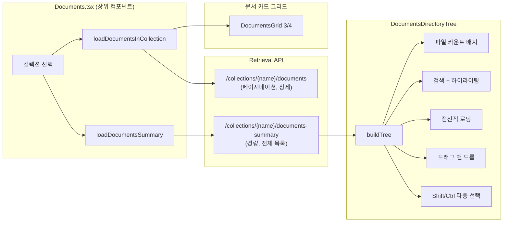

# 문서 디렉토리 트리 UI: 파일 카운트와 컴팩트 레이아웃

## 개요

XGEN 2.0의 문서 관리 시스템은 RAG 파이프라인에 필요한 문서를 컬렉션 단위로 관리한다. 초기에는 카드 그리드 형태로 문서 목록을 보여줬는데, 문서가 수십~수백 개로 늘어나자 폴더 구조로 정리해도 한눈에 파악하기 어려워졌다. 결국 파일 탐색기 스타일의 디렉토리 트리 사이드패널을 도입했다.

이 글에서는 DocumentsDirectoryTree 컴포넌트의 구현 과정을 다룬다. 단순한 트리 렌더링을 넘어서, 파일 카운트 배지, 컴팩트 레이아웃, 검색 + 하이라이팅, 점진적 로딩, 드래그 앤 드롭 이동, Shift/Ctrl 다중 선택까지 사이드패널 하나에 많은 기능을 욱여넣어야 했다.

## 아키텍처



핵심 설계 결정은 **경량 API 분리**다. 디렉토리 트리는 파일명, ID, 경로 정도만 필요한데, 기존 문서 목록 API는 청크 정보까지 포함해서 응답이 무거웠다. `documents-summary` 엔드포인트를 별도로 만들어 트리용 전체 목록을 한 번에 가져오되, 그리드에는 기존 페이지네이션 API를 그대로 사용했다.

```javascript
// retrievalAPI.js — 경량 summary API
export const listDocumentsSummary = async (collectionName) => {
    const response = await apiClient(
        `${API_BASE_URL}/api/retrieval/collections/${collectionName}/documents-summary`,
    );
    if (!response.ok) {
        throw new Error(`HTTP error! status: ${response.status}`);
    }
    return await response.json();
};
```

Documents.tsx에서 컬렉션 선택 시 두 API를 **병렬 호출**한다:

```typescript
// Documents.tsx — 병렬 데이터 로딩
const [docs] = await Promise.all([
    loadDocumentsInCollection(collection.collection_name, 1),
    loadDocumentsSummary(collection.collection_name),
    loadEmbeddingConfig()
]);
```

## 핵심 구현

### 트리 데이터 구조와 빌드 로직

디렉토리 트리의 핵심은 플랫한 문서 배열을 계층 구조로 변환하는 `buildTree()` 함수다. 백엔드에서 별도의 `Folder` 테이블을 관리하고, 문서에는 `directory_full_path` 메타데이터가 붙어 있다. 이 두 데이터를 합쳐서 트리를 구성한다.

```typescript
interface DocumentsDirectoryTreeProps {
    loading: boolean;
    selectedCollection: Collection | null;
    folders: Folder[];
    documents: DocumentInCollection[];
    onFileSelect?: (document: DocumentInCollection) => void;
    expandedNodes?: Set<string>;
    onToggleNode?: (updater: (prev: Set<string>) => Set<string>) => void;
    paginationInfo?: PaginationInfo | null;
    showFiles?: boolean;
    // ... 드래그 앤 드롭, 다중 선택 관련 props
}
```

트리 빌드 과정은 5단계로 진행된다:

```typescript
const buildTree = (): TreeNode[] => {
    // 1. 컬렉션 루트 노드 생성
    const rootNode: TreeNode = {
        id: `collection-${selectedCollection.collection_name}`,
        label: selectedCollection.collection_name,
        type: 'collection',
        children: []
    };

    // 2. 폴더 노드 생성 (nodeMap으로 빠른 참조)
    const nodeMap = new Map<string, TreeNode>();
    folders.forEach(folder => {
        nodeMap.set(folder.full_path, {
            id: `folder-${folder.id}`,
            label: folder.folder_name,
            type: 'folder',
            children: [],
            data: folder
        });
    });

    // 3. 문서 노드 생성 (검색 필터링 적용)
    const filteredDocuments = searchQuery
        ? documents.filter(doc =>
            doc.file_name.toLowerCase().includes(searchQuery.toLowerCase()))
        : documents;

    // 4. processed_at 내림차순 정렬 + 표시 제한
    const sortedDocs = [...filteredDocuments].sort(
        (a, b) => new Date(b.processed_at).getTime() - new Date(a.processed_at).getTime()
    );
    const visibleDocs = sortedDocs.slice(0, visibleFileCount);

    // 5. 부모-자식 관계 구성 (directory_full_path 기반)
    // 폴더 먼저 -> 이름순, 파일 -> 날짜 내림차순 정렬
    return [rootNode];
};
```

### 파일 카운트 배지

사이드패널이 좁기 때문에 파일 수를 한눈에 보여주는 배지가 중요했다. `paginationInfo`에서 전체 문서 수를 가져오되, 없으면 현재 로드된 documents 배열 길이로 폴백한다.

```typescript
const totalFileCount = paginationInfo?.total_documents ?? documents.length;

// JSX
<div className={styles.treeHeader}>
    <span className={styles.headerTitle}>파일 목록</span>
    <span className={styles.fileCountBadge}>{totalFileCount}</span>
</div>
```

```scss
// DocumentsDirectoryTree.module.scss
.fileCountBadge {
    font-size: 10px;
    font-weight: 600;
    color: #fff;
    background: #1976d2;
    padding: 1px 6px;
    border-radius: 8px;
}
```

PaginationInfo 타입은 백엔드 API 응답 구조를 그대로 반영한다:

```typescript
export interface PaginationInfo {
    page: number;
    page_size: number;
    total_pages: number;
    total_documents: number;
    has_next: boolean;
    has_prev: boolean;
}
```

### 검색과 하이라이팅

파일이 많아지면 검색이 필수다. 클라이언트 사이드 필터링으로 구현했고, 검색어와 일치하는 부분을 `<mark>` 태그로 하이라이팅한다.

```typescript
// 검색어 하이라이팅 함수
const highlightText = (text: string, query: string): React.ReactNode => {
    if (!query) return text;

    const parts = text.split(new RegExp(`(${query})`, 'gi'));
    return parts.map((part, i) =>
        part.toLowerCase() === query.toLowerCase()
            ? <mark key={i} className={styles.highlight}>{part}</mark>
            : part
    );
};
```

```scss
.highlight {
    background-color: #b3e5fc;
    color: #0277bd;
    padding: 0 2px;
    border-radius: 2px;
}
```

검색 입력 시 `visibleFileCount`를 리셋하여 검색 결과 전체를 보여주고, 검색어 지우면 다시 10개부터 시작한다.

```scss
.searchInput {
    padding: 5px 24px 5px 8px;
    font-size: 11px;
    border-radius: 4px;
    border: 1px solid #e0e0e0;
    width: 100%;
}
```

### 점진적 로딩 (Progressive Disclosure)

컬렉션에 수백 개 파일이 있을 수 있다. 전부 렌더링하면 DOM 성능이 떨어지므로, 초기에는 10개만 보여주고 "더 보기" 버튼으로 10개씩 추가 로딩한다.

```typescript
const [visibleFileCount, setVisibleFileCount] = useState(10);

const handleLoadMore = () => {
    setVisibleFileCount(prev => prev + 10);
};

const handleShowAll = () => {
    setVisibleFileCount(filteredDocuments.length);
};

// 트리 빌드 시 적용
const visibleDocs = sortedDocs.slice(0, visibleFileCount);
```

"더 보기" 버튼에는 남은 파일 수를 표시해서 사용자가 전체 규모를 파악할 수 있게 했다:

```typescript
{visibleFileCount < filteredDocuments.length && (
    <div className={styles.loadMoreContainer}>
        <button onClick={handleLoadMore}>
            더 보기 ({filteredDocuments.length - visibleFileCount}개 남음)
        </button>
        <button onClick={handleShowAll}>전체 보기</button>
    </div>
)}
```

### 드래그 앤 드롭 파일 이동

트리에서 파일을 폴더로 드래그해서 이동할 수 있다. 다중 선택된 파일도 한 번에 이동 가능하다. HTML5 Drag and Drop API를 직접 사용했다.

```typescript
// 파일 노드의 드래그 시작
const handleDragStart = (e: React.DragEvent, document: DocumentInCollection) => {
    const dragData = isMultiSelectMode && selectedDocumentIds?.includes(document.document_id)
        ? selectedDocumentIds  // 다중 선택 시 선택된 모든 파일
        : [document.document_id];  // 단일 파일
    e.dataTransfer.setData('text/plain', JSON.stringify(dragData));
};

// 폴더 노드의 드롭 처리
const handleDrop = async (e: React.DragEvent, folder: Folder) => {
    const documentIds = JSON.parse(e.dataTransfer.getData('text/plain'));
    await moveDocumentsToFolder(documentIds, folder.id);
    onDocumentFolderUpdated?.();
};
```

### Shift/Ctrl 다중 선택

파일 탐색기와 동일한 선택 동작을 구현했다. Shift 클릭은 범위 선택, Ctrl(Cmd) 클릭은 토글 선택이다.

```typescript
const handleFileClick = (e: React.MouseEvent, document: DocumentInCollection) => {
    if (!isMultiSelectMode) {
        onFileSelect?.(document);
        return;
    }

    if (e.shiftKey && anchorId) {
        // Shift 범위 선택: anchor부터 현재 클릭까지의 모든 파일
        const visibleIds = getVisibleFileIdsInOrder();
        const anchorIdx = visibleIds.indexOf(anchorId);
        const clickIdx = visibleIds.indexOf(document.document_id);
        const [start, end] = [Math.min(anchorIdx, clickIdx), Math.max(anchorIdx, clickIdx)];
        const rangeIds = visibleIds.slice(start, end + 1);
        setSelectedDocumentIds?.(prev => [...new Set([...prev, ...rangeIds])]);
    } else if (e.ctrlKey || e.metaKey) {
        // Ctrl 토글 선택
        setSelectedDocumentIds?.(prev =>
            prev.includes(document.document_id)
                ? prev.filter(id => id !== document.document_id)
                : [...prev, document.document_id]
        );
    }
};
```

`getVisibleFileIdsInOrder()`는 트리의 가시적 순서를 flatten해서 배열로 반환한다. Shift 범위 선택에서 정확한 인덱스 계산에 필수적이다.

## 컴팩트 레이아웃

사이드패널은 전체 화면의 1/4 정도를 차지한다. 이 좁은 공간에 트리를 효과적으로 표시하려면 모든 요소를 극도로 축소해야 했다. 총 7개 커밋에 걸쳐 padding, margin, font-size를 반복적으로 미세 조정했다.

```scss
// DocumentsDirectoryTree.module.scss — 컴팩트 레이아웃
.directoryTreeContainer {
    height: 100%;
    background: white;
    border-radius: 6px;
    box-shadow: 0 1px 3px rgba(0, 0, 0, 0.08);
}

.treeHeader {
    padding: 8px 12px;     // 원래 16px에서 축소
    font-size: 13px;       // 원래 18px에서 축소
    display: flex;
    align-items: center;
    gap: 8px;
}

.nodeContent {
    padding: 4px 6px;      // 원래 6px 8px에서 축소
    min-height: 26px;      // 원래 32px에서 축소
    display: flex;
    align-items: center;
    gap: 4px;
    cursor: pointer;
    border-radius: 4px;

    &:hover {
        background: #f5f5f5;
    }
}

.nodeLabel {
    font-size: 11px;       // 극도로 작은 폰트
    white-space: nowrap;
    overflow: hidden;
    text-overflow: ellipsis;
}
```

이 과정에서 시행착오가 많았다. 처음에는 2컬럼 레이아웃으로 시도했다가 단일 컬럼으로 전환했고, padding을 줄일 때마다 터치 영역이 너무 작아지는 문제와 씨름했다. 결국 `min-height: 26px`이 클릭 가능한 최소 크기라는 결론에 도달했다.

```
# 커밋: style: implement compact layout for file upload tab
# 날짜: 2025-12-14 12:56

# 커밋: style: refine DocumentFileModal layout with compact design adjustments
# 날짜: 2025-12-14 13:06

# 커밋: style: further refine DocumentFileModal with adjustments to padding
# 날짜: 2025-12-14 13:17

# 커밋: style: update DocumentFileModal styling with compact adjustments
# 날짜: 2025-12-14 15:00
```

4개의 연속 커밋이 모두 같은 파일의 padding과 font-size를 조정하는 내용이다. CSS 미세 조정은 결국 눈으로 확인하며 반복해야 한다.

## 트러블슈팅

### 수평 스크롤 문제

긴 파일명이 컨테이너를 넘어가면서 수평 스크롤바가 생기는 문제가 있었다. `overflow: hidden auto`로 수평 스크롤을 막고, `text-overflow: ellipsis`로 긴 이름을 잘라냈다.

```
# 커밋: style: Update overflow property in DocumentsDirectoryTree SCSS
# 날짜: 2025-12-26 10:43
```

```scss
.treeContent {
    overflow: hidden auto;  // 수평: hidden, 수직: auto
    flex: 1;
}
```

### 경량 API 도입 배경

처음에는 기존 문서 목록 API로 트리를 구성했는데, 페이지네이션 때문에 트리에 전체 파일이 표시되지 않는 문제가 있었다. 1페이지에 20개만 나오면 트리에도 20개만 보인다. 전체 파일 목록이 필요한 트리와, 페이지네이션이 필요한 그리드의 요구사항이 충돌한 것이다.

```
# 커밋: feat: Add document summary retrieval and enhance UI for document management
# 날짜: 2025-12-26 09:53
```

해결 방법은 `documents-summary` 엔드포인트를 새로 만드는 것이었다. 청크 상세 정보를 제외하고 파일명, ID, 경로, 처리 일시만 반환하는 경량 API다. 트리에서는 이 API로 전체 파일 목록을 가져오고, 그리드는 기존 페이지네이션 API를 그대로 사용한다.

### 검색 시 visibleFileCount 초기화

검색 기능을 추가한 뒤 발견한 버그가 있었다. 검색 결과가 5개인데 `visibleFileCount`가 10이면 문제없지만, 검색어를 지웠을 때 `visibleFileCount`가 5로 남아있으면 전체 파일 중 5개만 보이는 문제가 생겼다. 검색어 변경 시 `visibleFileCount`를 항상 10으로 리셋하도록 수정했다.

```typescript
useEffect(() => {
    setVisibleFileCount(10);
}, [searchQuery]);
```

### 2컬럼에서 단일 컬럼으로

파일 업로드 모달에서도 비슷한 컴팩트 레이아웃 작업을 병행했다. 처음에는 설정 패널과 파일 리스트를 2컬럼으로 배치했는데, 모달 자체가 크지 않아서 2컬럼이 답답했다. 결국 단일 컬럼 + 아코디언 구조로 전환했다.

```
# 커밋: style: enhance DocumentFileModal layout with new single-column design
# 날짜: 2025-12-14 12:24
```

## 타입 정의

트리 컴포넌트의 핵심 타입들이다. `DocumentInCollection`은 백엔드 API 응답 구조를 그대로 반영하고, `Folder`는 디렉토리 관리용 별도 테이블의 구조다.

```typescript
export interface DocumentInCollection {
    document_id: string;
    file_name: string;
    file_path?: string;
    file_type: string;
    processed_at: string;
    total_chunks: number;
    actual_chunks?: number;
    metadata?: {
        folder_path?: string;
        directory_full_path?: string;
        original_file_name?: string;
        process_type?: string;
        file_size?: number;
        [key: string]: any;
    };
    chunks: ChunkInfo[];
}

export interface Folder {
    id: number;
    collection_name: string;
    folder_name: string;
    parent_folder_id: number | null;
    is_root: boolean;
    full_path: string;
    order_index: number;
}
```

## 결과 및 회고

DocumentsDirectoryTree 컴포넌트는 총 15개 커밋에 걸쳐 2일간(12/14, 12/26) 집중적으로 개발됐다.

첫째 날은 컴팩트 레이아웃 잡기에 집중했다. CSS 미세 조정이 대부분이었고, 4개의 연속 커밋이 같은 파일의 padding과 font-size를 조정하는 내용이었다. 디자이너 없이 개발자가 직접 UI를 잡을 때 흔히 겪는 과정이다.

둘째 날에는 기능적인 개선에 집중했다. 경량 API 분리, 검색 + 하이라이팅, 더 보기/전체 보기, 버튼 라벨 개선까지 사용성을 높이는 작업이었다. 특히 `documents-summary` 경량 API를 분리한 결정이 효과적이었다 — 트리와 그리드가 각각 필요한 데이터만 요청하게 되면서 로딩 성능이 개선됐다.

사이드패널 형태의 트리 UI는 정보 밀도와 사용성 사이의 트레이드오프가 핵심이다. 폰트를 줄이면 더 많이 보이지만 읽기 어려워지고, padding을 줄이면 클릭이 어려워진다. `font-size: 11px`, `min-height: 26px`이 이 프로젝트에서 찾은 최적점이었다.
