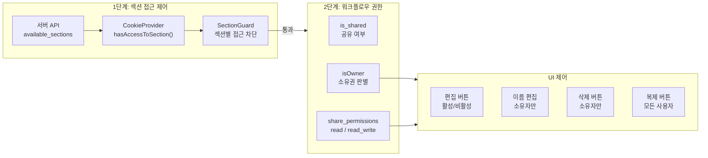

# 워크플로우 공유 권한 시스템: 읽기 전용 vs 편집 모드

## 개요

XGEN 2.0에서 여러 사용자가 워크플로우를 공유하려면 권한 체계가 필요했다. 단순히 "공유함/안 함"만으로는 부족하고, 공유받은 사용자가 워크플로우를 수정할 수 있는지 여부까지 제어해야 한다. 운영 환경에서 검증된 워크플로우를 다른 팀원에게 공유할 때, 실수로 수정되는 것을 방지하면서도 필요한 경우 편집 권한을 줄 수 있어야 한다.

이 시스템은 2단계로 설계했다. 첫 번째는 **섹션 레벨 접근 제어**(SectionGuard)로, 관리자 페이지/워크플로우 페이지 등 기능 단위의 접근을 제어한다. 두 번째는 **워크플로우 레벨 권한**(share_permissions)으로, 개별 워크플로우의 읽기 전용 vs 편집 모드를 제어한다.

## 권한 체계 아키텍처



## 1단계: SectionGuard - 섹션 접근 제어

사용자 그룹별로 접근 가능한 섹션(페이지)이 다르다. 관리자만 접근할 수 있는 모델 서빙 페이지, 데이터 팀만 접근할 수 있는 데이터 프로세서 페이지 등이 있다.

```typescript
// SectionGuard.tsx
interface SectionGuardProps {
    children: React.ReactNode;
    requiredSection: string;    // 'workflow' | 'admin' | 'data' 등
    fallback?: React.ReactNode;
    redirectTo?: string;
}

const SectionGuard: React.FC<SectionGuardProps> = ({
    children, requiredSection, fallback, redirectTo = '/chat'
}) => {
    const { hasAccessToSection, isInitialized, availableSections } = useAuth();
    const [hasAccess, setHasAccess] = useState<boolean | null>(null);
    const router = useRouter();

    useEffect(() => {
        if (isInitialized) {
            const access = hasAccessToSection(requiredSection);
            setHasAccess(access);
        }
    }, [requiredSection, hasAccessToSection, isInitialized, availableSections]);

    // 접근 권한 없으면 리다이렉트
    useEffect(() => {
        if (hasAccess === false) {
            router.push(redirectTo);
        }
    }, [hasAccess]);

    if (hasAccess === null) return null;  // 로딩 중
    if (!hasAccess) return fallback || null;

    return <>{children}</>;
};
```

# 커밋: feat: Implement section-based access control with SectionGuard and update related components for authorization checks
# 날짜: 2025-08-29 03:08

### HOC 패턴도 제공

```typescript
export const withSectionGuard = <P extends object>(
    WrappedComponent: React.ComponentType<P>,
    requiredSection: string,
    fallback?: React.ReactNode,
    redirectTo?: string
) => {
    const GuardedComponent: React.FC<P> = (props) => (
        <SectionGuard requiredSection={requiredSection}
                      fallback={fallback}
                      redirectTo={redirectTo}>
            <WrappedComponent {...props} />
        </SectionGuard>
    );
    return GuardedComponent;
};

// 사용 예
const AdminPage = withSectionGuard(AdminModelServingManager, 'admin');
```

### CookieProvider: 섹션 권한 확인

```typescript
// CookieProvider.tsx - 서버에서 사용자 그룹의 가용 섹션 목록 로드
const hasAccessToSection = useCallback((sectionId: string): boolean => {
    if (!availableSections || !availableSections.available_sections) {
        return false;
    }
    return availableSections.available_sections.includes(sectionId);
}, [availableSections]);

// 로그인 시 섹션 정보 로드
const loadUserSections = useCallback(async (userId: number) => {
    const sectionsData = await getGroupAvailableSections(userId);
    setAvailableSections(sectionsData);
}, []);
```

## 2단계: 워크플로우 공유 권한

### Workflow 타입에 권한 필드 추가

```typescript
// types/index.ts
export interface Workflow {
    id: string;
    name: string;
    author: string;
    status: 'active' | 'draft' | 'archived' | 'unactive';
    user_id?: number;
    is_shared?: boolean;           // 공유 여부
    share_group?: string | null;   // 공유 그룹 (null이면 전체 공유)
    share_permissions?: string;    // 'read' | 'read_write'
    // ...
}
```

# 커밋: feat: Add share permissions handling and disable edit button for read-only workflows
# 날짜: 2025-09-18 08:27

`share_permissions` 필드가 핵심이다. `'read'`이면 읽기 전용, `'read_write'`이면 편집 가능. 이 값은 워크플로우 소유자가 WorkflowEditModal에서 설정한다.

### WorkflowEditModal: 공유 설정 UI

```typescript
// WorkflowEditModal.tsx
const WorkflowEditModal: React.FC<Props> = ({ workflow, onClose, onSave }) => {
    const [isShared, setIsShared] = useState(workflow?.is_shared || false);
    const [shareGroup, setShareGroup] = useState(workflow?.share_group || '');
    const [sharePermissions, setSharePermissions] = useState(
        workflow?.share_permissions || 'read'
    );

    const handleSubmit = async () => {
        const updateDict = {
            is_shared: isShared,
            share_group: isShared ? shareGroup || null : null,
            share_permissions: isShared ? sharePermissions : null,
        };
        await updateWorkflow(workflow.name, updateDict);
        onSave();
    };

    return (
        <div className={styles.modal}>
            {/* 공유 토글 */}
            <div className={styles.formGroup}>
                <label>공유</label>
                <input
                    type="checkbox"
                    checked={isShared}
                    onChange={(e) => setIsShared(e.target.checked)}
                />
            </div>

            {/* 공유 ON일 때만 표시 */}
            {isShared && (
                <>
                    <div className={styles.formGroup}>
                        <label>공유 그룹</label>
                        <input
                            value={shareGroup}
                            onChange={(e) => setShareGroup(e.target.value)}
                            placeholder="비워두면 전체 공유"
                        />
                    </div>

                    <div className={styles.formGroup}>
                        <label>권한</label>
                        <select
                            value={sharePermissions}
                            onChange={(e) => setSharePermissions(e.target.value)}
                        >
                            <option value="read">Read Only</option>
                            <option value="read_write">Read and Write</option>
                        </select>
                        <small>공유된 워크플로우에 대한 접근 권한을 설정합니다.</small>
                    </div>
                </>
            )}
        </div>
    );
};
```

# 커밋: feat: Refactor workflow handling to use 'workflowName' instead of 'workflowId' and add workflow editing capabilities
# 날짜: 2025-09-03 01:16

### CompletedWorkflows: 권한에 따른 UI 분기

워크플로우 목록에서 소유자와 비소유자의 UI가 다르다.

```typescript
// CompletedWorkflows.tsx
const CompletedWorkflows: React.FC = () => {
    const { user } = useAuth();
    const [workflowFilter, setWorkflowFilter] = useState<'all' | 'personal' | 'shared'>('all');

    // 필터링
    const getFilteredWorkflows = () => {
        switch (workflowFilter) {
            case 'personal':
                return workflows.filter(wf => !wf.is_shared);
            case 'shared':
                return workflows.filter(wf => wf.is_shared === true);
            default:
                return workflows;
        }
    };

    return (
        <div>
            {/* 필터 탭 */}
            <div className={styles.filterTabs}>
                <button onClick={() => setWorkflowFilter('all')}>전체</button>
                <button onClick={() => setWorkflowFilter('personal')}>내 워크플로우</button>
                <button onClick={() => setWorkflowFilter('shared')}>공유됨</button>
            </div>

            {getFilteredWorkflows().map(workflow => (
                <div key={workflow.id} className={styles.workflowCard}>
                    <span>{workflow.name}</span>

                    {/* 소유자 여부에 따른 액션 버튼 분기 */}
                    {user && workflow.user_id === user.user_id ? (
                        // 소유자: 편집, 설정, 삭제 가능
                        <>
                            <button title="편집" onClick={() => handleEdit(workflow)}>
                                <FiEdit />
                            </button>
                            <button title="설정" onClick={() => handleEditSettings(workflow)}>
                                <FiSettings />
                            </button>
                            <button title="삭제" onClick={() => handleDelete(workflow)}>
                                <FiTrash2 />
                            </button>
                        </>
                    ) : (
                        // 비소유자: 권한에 따라 편집 버튼 활성/비활성
                        <>
                            <button
                                className={`${styles.actionButton} ${
                                    workflow.share_permissions !== 'read_write'
                                        ? styles.disabled : ''
                                }`}
                                title={
                                    workflow.share_permissions !== 'read_write'
                                        ? "읽기 전용으로 공유되었습니다"
                                        : "편집"
                                }
                                onClick={() => {
                                    if (workflow.share_permissions === 'read_write') {
                                        handleEdit(workflow);
                                    }
                                }}
                                disabled={workflow.share_permissions !== 'read_write'}
                            >
                                <FiEdit />
                            </button>
                            <button title="복사" onClick={() => handleDuplicate(workflow)}>
                                <FiCopy />
                            </button>
                        </>
                    )}
                </div>
            ))}
        </div>
    );
};
```

읽기 전용 워크플로우의 편집 버튼에 `cursor: not-allowed`, `opacity: 0.45`, `pointer-events: none`을 적용해 시각적으로 비활성화 상태를 표현한다. 비소유자에게는 항상 "복사" 버튼을 제공해서, 공유 워크플로우를 자기 계정으로 복제하여 수정할 수 있게 했다.

## 캔버스 에디터에서의 소유권 판별

워크플로우를 캔버스 에디터에서 열 때, URL의 `user_id` 파라미터로 소유권을 판별한다.

```typescript
// canvas/page.tsx
const [workflowOriginUserId, setWorkflowOriginUserId] = useState<string | null>(null);
const [isOwner, setIsOwner] = useState(true);

const getUserId = () => getAuthCookie('user_id');

useEffect(() => {
    const loadWorkflowName = searchParams.get('workflow');
    const userId = searchParams.get('user_id');

    if (loadWorkflowName) {
        const decodedName = decodeURIComponent(loadWorkflowName);
        setCurrentWorkflowName(decodedName);
        setWorkflowOriginUserId(userId);

        // 소유권 판별: user_id 없거나 현재 유저와 같으면 소유자
        const currentUserId = getUserId();
        const isWorkflowOwner = !userId || userId === currentUserId;
        setIsOwner(isWorkflowOwner);

        // 다른 사용자의 워크플로우 로드 시 user_id 전달
        const workflowData = await loadWorkflow(decodedName, userId);
        canvasRef.current?.loadCanvasState(workflowData);
    }
}, [searchParams]);

// 저장 시 원래 소유자의 user_id 유지
const handleSave = async () => {
    const canvasState = canvasRef.current?.getCanvasState();
    await saveWorkflow(
        currentWorkflowName,
        canvasState,
        workflowOriginUserId  // 원래 소유자 ID
    );
};
```

# 커밋: feat: Enhance workflow saving functionality with user ID and improve shared workflow handling
# 날짜: 2025-09-18 08:15

### Header에서 소유권 표시

```typescript
// Header.tsx
const Header: React.FC<HeaderProps> = ({ workflowName, isOwner, onSave, ... }) => {
    return (
        <header className={styles.header}>
            <div className={styles.workflowNameSection}>
                {!isOwner && (
                    <span className={styles.sharedIndicator}
                          title="공유받은 워크플로우입니다. 이름을 수정할 수 없습니다.">
                        <LuUsers />
                    </span>
                )}
                {isOwner ? (
                    // 소유자: 더블클릭으로 이름 편집 가능
                    <span onDoubleClick={handleEditClick}>{workflowName}</span>
                ) : (
                    // 비소유자: 이름만 표시 (편집 불가)
                    <span>{workflowName}</span>
                )}
            </div>
            <div className={styles.rightSection}>
                <button onClick={onSave} title="Save Workflow">
                    <LuSave />
                </button>
            </div>
        </header>
    );
};
```

비소유자에게도 저장 버튼을 제공하되, `read_write` 권한이 있을 때만 실제 저장이 성공한다. 서버에서도 권한을 체크하기 때문에 프론트엔드만 우회해서는 수정할 수 없다.

## 워크플로우 API

```javascript
// workflowAPI.js

// 저장: 공유 워크플로우는 원래 소유자의 user_id로
export const saveWorkflow = async (workflowName, workflowContent, userId = null) => {
    const requestBody = {
        workflow_name: workflowName,
        content: workflowContent
    };
    // userId가 유효한 숫자이면 포함
    if (userId !== null &&
        (typeof userId === 'number' ||
         (typeof userId === 'string' && /^\d+$/.test(userId)))) {
        requestBody.user_id = userId;
    }
    return await apiClient(`${API_BASE_URL}/api/workflow/save`, {
        method: 'POST',
        body: JSON.stringify(requestBody)
    });
};

// 로드: user_id로 다른 사용자의 워크플로우 접근
export const loadWorkflow = async (workflowName, userId) => {
    const cleanName = workflowName.replace(/\.json$/, '');
    return await apiClient(
        `${API_BASE_URL}/api/workflow/load/${encodeURIComponent(cleanName)}?user_id=${userId}`
    );
};

// 복제: 공유 워크플로우를 내 계정으로 복사
export const duplicateWorkflow = async (workflowName, userId) => {
    return await apiClient(
        `${API_BASE_URL}/api/workflow/duplicate/${encodeURIComponent(workflowName)}?user_id=${userId}`
    );
};

// 공유 설정 업데이트
export const updateWorkflow = async (workflowName, updateDict) => {
    return await apiClient(
        `${API_BASE_URL}/api/workflow/update/${encodeURIComponent(workflowName)}`,
        { method: 'POST', body: JSON.stringify(updateDict) }
    );
};
```

# 커밋: feat: Enhance workflow management with user ID and sharing capabilities
# 날짜: 2025-09-02 08:59

## 개발 타임라인

| 날짜 | 핵심 작업 |
|------|----------|
| 08-29 | SectionGuard + AuthGuard 리팩토링, 사용자 역할(role) 지원 |
| 09-01 | 인증/인가 가드 체계 정리 |
| 09-02 | 워크플로우 user_id 기반 공유 기능 (loadWorkflow, duplicateWorkflow) |
| 09-03 | WorkflowEditModal 최초 생성 (공유 토글 + 그룹 선택) |
| 09-18 08:15 | 캔버스 isOwner 판별 + 공유 워크플로우 저장 시 원래 소유자 ID 유지 |
| 09-18 08:27 | share_permissions 필드 추가 (read / read_write), 편집 버튼 비활성화 |

## 트러블슈팅

### user_id 타입 불일치

URL 쿼리 파라미터는 항상 문자열인데, 서버의 user_id는 숫자다. `saveWorkflow`에서 정규식(`/^\d+$/.test(userId)`)으로 숫자 형태인지 검증한 후에만 포함시킨다. 초기에 문자열 "123"을 그대로 보내서 서버에서 타입 에러가 나는 문제가 있었다.

### 공유 워크플로우 덮어쓰기 방지

`read_write` 권한이 있는 사용자가 워크플로우를 저장할 때, 자신의 user_id가 아닌 원래 소유자의 user_id(`workflowOriginUserId`)로 저장해야 한다. 그렇지 않으면 새로운 워크플로우가 생성되거나, 소유자가 바뀌는 문제가 발생한다.

### 비활성 버튼의 접근성

`pointer-events: none`만으로는 키보드 포커스를 차단하지 못한다. `disabled` 속성을 HTML button에도 추가하고, `aria-label`에 "읽기 전용으로 공유되었습니다" 메시지를 포함해서 스크린 리더에서도 상태를 인지할 수 있게 했다.

## 결과 및 회고

2단계 권한 체계를 약 3주에 걸쳐 점진적으로 구현했다. 8월 말에 SectionGuard로 페이지 단위 접근 제어를 만들고, 9월 초에 워크플로우 단위 공유 기능을 추가하고, 9월 중순에 `share_permissions`로 읽기/쓰기 구분을 완성했다.

HOC 패턴의 `withSectionGuard`는 사용이 편리했지만, 대부분의 경우 JSX에서 직접 `<SectionGuard>`를 사용하는 것이 더 직관적이었다. 워크플로우 권한은 프론트엔드만으로는 완전한 보안이 불가능하므로, 서버 측에서도 동일한 권한 체크를 하는 이중 검증 구조가 필수적이다. 프론트엔드의 역할은 UX 차원에서 권한 없는 동작을 미리 차단하는 것이다.
