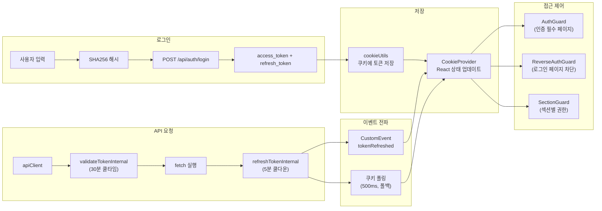

# 인증 플로우 개선: 토큰 검증과 리프레시 처리

## 개요

XGEN 2.0은 웹과 Tauri 데스크톱 앱 두 가지 형태로 배포된다. 인증 시스템은 JWT 기반(access_token + refresh_token)이며, 약 한 달간(10/28~11/25) 5단계에 걸쳐 점진적으로 개선됐다. 초기에는 단순한 토큰 검증만 있었는데, 토큰 만료 시 자동 갱신, 깜빡임 방지, embed 모드의 인증 스킵, Tauri Standalone 모드 지원까지 추가됐다.

이 글에서는 인증 플로우의 핵심 컴포넌트인 CookieProvider, apiClient, AuthGuard를 중심으로 설계 결정과 시행착오를 다룬다.

## 아키텍처



### 파일 구조

```
src/
  middleware.ts                       -- CORS, 보안 헤더
  app/
    (auth)/
      login/page.tsx
      signup/page.tsx
    _common/
      api/
        authAPI.js                   -- login, logout, validateToken, refreshToken
        helper/
          apiClient.js               -- 전역 fetch 래퍼 (토큰 자동 갱신)
      components/
        CookieProvider.tsx           -- 인증 Context (React Context API)
        authGuard/
          AuthGuard.tsx              -- 인증 필수 가드
          ReverseAuthGuard.tsx       -- 로그인 페이지 접근 차단
          SectionGuard.tsx           -- 섹션별 권한 가드
      utils/
        cookieUtils.js               -- 쿠키 CRUD
        logoutUtils.ts               -- 로그아웃 훅 (4가지 변형)
```

## 핵심 구현

### CookieProvider — 인증 Context

전체 앱의 인증 상태를 관리하는 React Context다. user 정보, 섹션 권한, 초기화 상태를 하위 컴포넌트에 제공한다.

```typescript
// 핵심 상태
const [user, setUser] = useState<User | null>(null);
const [availableSections, setAvailableSections] = useState<AvailableSections | null>(null);
const [isInitialized, setIsInitialized] = useState(false);
const [isLoggingOut, setIsLoggingOut] = useState(false);
```

토큰이 갱신되면 두 가지 경로로 CookieProvider에 전파된다:

1. **CustomEvent (주)**: apiClient가 토큰을 갱신하면 `tokenRefreshed` 이벤트를 발행하고, CookieProvider가 이를 감지해서 즉시 상태를 업데이트한다.

2. **쿠키 폴링 (폴백)**: 500ms 간격으로 쿠키를 확인해서, 이벤트가 누락됐을 때를 대비한다.

```typescript
// 1. CustomEvent 리스너
useEffect(() => {
    const handleTokenRefreshed = (event: CustomEvent) => {
        const newToken = event.detail?.access_token;
        if (newToken && user && newToken !== user.access_token) {
            setUser({ ...user, access_token: newToken });
        }
    };
    window.addEventListener('tokenRefreshed', handleTokenRefreshed);
    return () => window.removeEventListener('tokenRefreshed', handleTokenRefreshed);
}, [user]);

// 2. 쿠키 폴링 (폴백)
useEffect(() => {
    const interval = setInterval(() => {
        const currentToken = getAuthCookie('access_token');
        if (user && currentToken && currentToken !== user.access_token) {
            setUser({ ...user, access_token: currentToken });
        }
    }, 500);
    return () => clearInterval(interval);
}, [user]);
```

이중 감지 메커니즘이 과도해 보일 수 있지만, 실전에서는 필요했다. 브라우저 탭이 백그라운드에 있을 때 이벤트 처리가 지연되는 경우가 있었고, Tauri WebView에서 CustomEvent가 간헐적으로 누락되는 현상도 있었다.

### apiClient — 자동 토큰 갱신

모든 API 요청이 통과하는 래퍼 함수다. 핵심 기능은 **주기적 토큰 검증**과 **자동 토큰 리프레시**다.

```javascript
// apiClient.js 핵심 흐름
export const apiClient = async (url, options = {}, skipAuth = false) => {
    // 1. Tauri 환경 분기
    if (isTauriStandalone()) {
        return tauriClient(url, options);
    }

    // 2. skipAuth면 인증 건너뛰기 (embed/deploy 모드)
    if (skipAuth) {
        return fetch(url, options);
    }

    // 3. 토큰 검증 (30분 쿨타임)
    await validateTokenInternal();

    // 4. 최신 토큰으로 헤더 설정
    const token = getAuthCookie('access_token');
    const headers = {
        ...options.headers,
        'Authorization': `Bearer ${token}`,
    };

    // 5. fetch 실행
    const response = await fetch(url, { ...options, headers });

    // 6. 401 → 로그아웃
    if (response.status === 401) {
        clearAllAuth();
        window.location.href = '/login';
        return;
    }

    // 7. 성공 → 토큰 리프레시 시도 (5분 쿨다운)
    if (response.ok) {
        refreshTokenInternal();  // 비동기, await하지 않음
    }

    return response;
};
```

#### 토큰 리프레시 상세

```javascript
let isRefreshing = false;
const REFRESH_COOLDOWN = 5 * 60 * 1000; // 5분

const refreshTokenInternal = async () => {
    if (isRefreshing) return false;
    if (Date.now() - getLastRefreshTime() < REFRESH_COOLDOWN) return false;

    isRefreshing = true;
    try {
        const response = await fetch(`${API_BASE_URL}/api/auth/refresh`, {
            method: 'POST',
            headers: { 'Content-Type': 'application/json' },
            body: JSON.stringify({
                refresh_token: getAuthCookie('refresh_token')
            }),
        });

        const result = await response.json();

        if (result.success && result.access_token) {
            setCookieAuth('access_token', result.access_token);
            // 쿠키가 브라우저에 반영될 때까지 10ms 대기
            await new Promise(resolve => setTimeout(resolve, 10));
            // CookieProvider에 이벤트 전파
            window.dispatchEvent(new CustomEvent('tokenRefreshed', {
                detail: { access_token: result.access_token }
            }));
        }
    } finally {
        isRefreshing = false;
    }
};
```

```
# 커밋: feat: Implement token refresh functionality in apiClient and apiClientV2
# 날짜: 2025-11-12
```

`isRefreshing` 플래그로 동시 갱신 요청을 방지하고, 5분 쿨다운으로 불필요한 갱신을 억제한다. `await new Promise(resolve => setTimeout(resolve, 10))`은 쿠키가 브라우저에 반영되기 전에 이벤트가 발행되는 타이밍 이슈를 해결한다.

```
# 커밋: fix: Ensure synchronous waiting for token refresh completion in apiClient
# 날짜: 2025-11-13
```

#### 리프레시 제외 엔드포인트

토큰 갱신 로직이 모든 API에 무차별 적용되면 문제가 생긴다. 리프레시 API 자체에 대해 다시 리프레시를 시도하면 무한루프가 된다.

```javascript
const REFRESH_EXCLUDED_ENDPOINTS = [
    '/api/auth/refresh',
    '/api/auth/login',
    '/api/auth/validate-token',
    '/api/node/refresh',
    '/upload/progress',
];
```

```
# 커밋: fix: Exclude auto token refresh for specific endpoints
# 날짜: 2025-11-14
```

### AuthGuard — 깜빡임 방지

인증이 필요한 페이지를 감싸는 가드 컴포넌트다. 토큰이 유효하면 children을 렌더링하고, 아니면 로그인 페이지로 리다이렉트한다.

가장 까다로운 문제는 **깜빡임 방지**였다. 토큰이 갱신되면 AuthGuard가 재검증을 수행하는데, 그동안 로딩 화면이 잠깐 보이면 사용자 경험이 나빠진다.

```typescript
const [isRevalidating, setIsRevalidating] = useState(false);
const [lastCheckedToken, setLastCheckedToken] = useState<string | null>(null);

useEffect(() => {
    const checkAuth = async () => {
        const token = getAuthCookie('access_token');
        if (!token) {
            router.push('/login');
            return;
        }

        // 토큰이 변경되지 않으면 서버 검증 스킵
        if (token === lastCheckedToken) return;

        // 이전에 확인한 토큰이 있으면 재검증 (갱신된 것)
        const isTokenRefresh = lastCheckedToken !== null;
        if (isTokenRefresh) {
            setIsRevalidating(true);
            // 재검증 중에는 로딩 화면 대신 기존 children 유지
        }

        const result = await validateToken(token);
        if (result.valid) {
            setLastCheckedToken(token);
            setIsRevalidating(false);
        } else {
            router.push('/login');
        }
    };

    checkAuth();
}, [user?.access_token]);  // user 변경 시 트리거
```

```
# 커밋: feat: Enhance authentication flow with improved logout and token validation
# 날짜: 2025-11-25
```

`isRevalidating`이 true인 동안에는 children을 그대로 보여준다. 로딩 화면이 깜빡이지 않으면서도 백그라운드에서 토큰 유효성을 확인한다.

### 로그아웃 — 4가지 변형

```typescript
// logoutUtils.ts
export const useLogout = (options?: LogoutOptions) => { ... };
export const useQuickLogout = () => { ... };
export const useCompleteLogout = () => { ... };
export const useSessionExpiredLogout = () => { ... };
```

- **useLogout**: 커스텀 옵션 지원 (clearStorage, showToast 등)
- **useQuickLogout**: 기본 옵션으로 빠른 로그아웃
- **useCompleteLogout**: 설정 포함 완전 정리
- **useSessionExpiredLogout**: 토스트 없이 세션 만료 처리 (사용자 동작 없이 자동 로그아웃)

중복 호출 방지가 핵심이다:

```typescript
const clearAuth = async (clearStorage: boolean) => {
    if (isLoggingOut) return;  // 중복 방지
    setIsLoggingOut(true);

    clearAllAuth();           // 쿠키 전체 삭제
    if (clearStorage) {
        clearAllUserData();   // localStorage 정리
    }

    setTimeout(() => {
        setIsLoggingOut(false);
    }, 100);
};
```

### skipAuth: embed/deploy 모드

워크플로우를 iframe으로 임베드하거나 deploy 모드로 공개할 때는 인증이 필요 없다. `skipAuth` 파라미터로 이를 제어한다.

```
# 커밋: feat: Add skipAuth parameter to API functions for enhanced authentication control
# 날짜: 2025-11-13
```

```javascript
// 사용 예시
const result = await executeWorkflow(workflowId, {
    skipAuth: isEmbedMode
});
```

embed 레이아웃에서는 CookieProvider 자체를 제외한다:

```typescript
// chatbot/embed/[chatId]/layout.tsx
export default function EmbedLayout({ children }) {
    // CookieProvider 없음 → 토큰 갱신 시도 없음
    return <>{children}</>;
}
```

### 쿠키 관리

인증 관련 쿠키 6개를 관리한다:

```javascript
// cookieUtils.js
// access_token  — 7일 만료
// refresh_token — 7일 만료
// user_id       — 30일 만료
// username      — 30일 만료
// available_user_section  — 쉼표 구분 문자열
// available_admin_section — 쉼표 구분 문자열
```

`clearAllAuth()`에도 중복 실행 방지가 있다:

```javascript
let isClearingAuth = false;

export const clearAllAuth = () => {
    if (isClearingAuth) return;
    isClearingAuth = true;
    // 6개 쿠키 삭제
    setTimeout(() => { isClearingAuth = false; }, 100);
};
```

## 트러블슈팅

### API 엔드포인트 prefix 누락

```
# 커밋: fix: update API endpoints to include '/api' prefix
# 날짜: 2025-10-28
```

초기에 인증 API가 `/auth/login`으로 호출됐는데, 실제 경로는 `/api/auth/login`이었다. Next.js의 API Route가 프록시 역할을 하면서 `/api` prefix가 필요한 것을 간과했다.

### 비동기 쿠키 반영 타이밍

```
# 커밋: fix: Ensure synchronous waiting for token refresh completion
# 날짜: 2025-11-13
```

`setCookieAuth()`로 쿠키를 설정한 직후에 `getAuthCookie()`로 읽으면, 브라우저가 아직 쿠키를 반영하지 않아 이전 값이 돌아오는 경우가 있었다. 10ms `setTimeout`으로 해결했는데, 이건 브라우저의 쿠키 반영 타이밍에 의존하는 워어라운드다.

### 섹션 정보 동기화

```
# 커밋: refactor: enhance token validation and user section management
# 날짜: 2025-10-29
```

`validateToken` API 응답에 `available_user_section`과 `available_admin_section`이 포함되어 있는데, 초기에는 이를 활용하지 않았다. 섹션 권한 정보를 별도 API로 가져오고 있었다. validateToken 응답에서 섹션 정보를 추출해서 쿠키에도 저장하고 CookieProvider 상태에도 반영하도록 수정했다.

### Tauri Standalone 모드

Tauri 데스크톱 앱은 세 가지 모드로 동작한다:
- **Standalone**: 로컬 서버와 IPC로 통신, 인증 불필요
- **Connected**: 원격 서버와 fetch로 통신, 인증 필요
- **Remote WebView**: 웹과 동일하게 동작

Standalone 모드에서는 AuthGuard를 완전히 우회한다. IPC 통신에는 토큰이 필요 없기 때문이다.

## 결과 및 회고

5단계에 걸쳐 약 한 달간(10/28~11/25) 인증 시스템을 개선했다. 가장 중요한 설계 결정은 **이중 감지 메커니즘**(CustomEvent + 쿠키 폴링)이다. 단일 메커니즘으로는 모든 환경(웹, Tauri, 백그라운드 탭)에서 안정적으로 동작하지 않았다.

쿨다운 시스템(토큰 검증 30분, 토큰 갱신 5분)은 서버 부하를 크게 줄였다. 이 없이는 페이지 이동할 때마다 검증 API가 호출되어 불필요한 트래픽이 발생했다.

중복 방지 플래그(`isRefreshing`, `isLoggingOut`, `isClearingAuth`, `isHandling401`)가 4개나 있는데, 각각이 서로 다른 레이스 컨디션을 방지한다. 인증 관련 코드에서 동시성 문제는 가장 발견하기 어렵고 재현하기 어려운 버그를 만든다.
