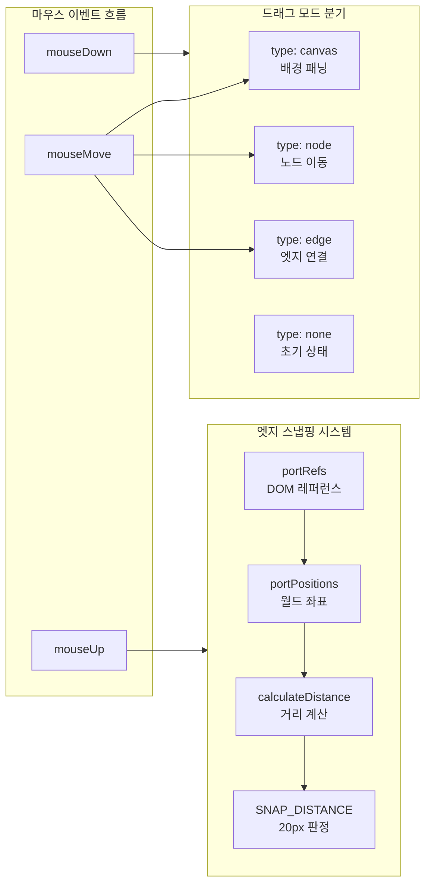
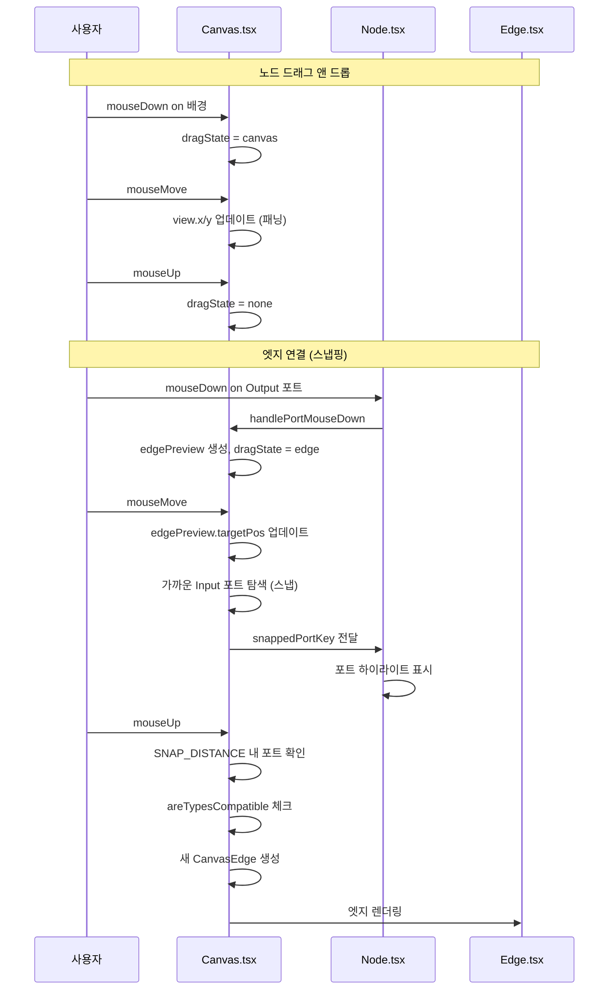

# 커스텀 노드 에디터: 드래그 앤 드롭 + 엣지 스냅핑 구현

## 개요

이전 글에서 Next.js 기반 워크플로우 에디터의 전체 구조를 다뤘다. 이 글에서는 에디터의 핵심 인터랙션인 **노드 드래그 앤 드롭**, **엣지 스냅핑(자동 연결)**, **포트 타입 호환성 체크**, **줌/패닝 최적화**를 깊이 있게 다룬다.

노드 기반 에디터에서 가장 까다로운 부분은 좌표 변환이다. 캔버스의 줌/패닝 상태에서 마우스 좌표를 월드 좌표로 정확하게 변환해야 하고, 포트 간 거리 계산으로 스냅핑 판정을 내려야 한다. 이 과정에서 겪은 시행착오와 해결 과정을 커밋 기록을 따라가며 정리한다.

## 인터랙션 아키텍처



## 노드 드래그 앤 드롭

### AddNodePanel에서 캔버스로 노드 추가

사이드 패널의 노드 목록에서 캔버스로 드래그하여 노드를 추가하는 기능이다. HTML5 Drag and Drop API를 사용했다.

```typescript
// DraggableNodeItem.tsx
const DraggableNodeItem: React.FC<DraggableNodeItemProps> = ({ nodeData }) => {
    const handleDragStart = (e: React.DragEvent) => {
        // 노드 데이터를 JSON으로 직렬화해서 전달
        e.dataTransfer.setData('application/json', JSON.stringify(nodeData));
        e.dataTransfer.effectAllowed = 'copy';
    };

    return (
        <div
            draggable
            onDragStart={handleDragStart}
            className={styles.draggableItem}
        >
            <span>{nodeData.nodeName}</span>
            {nodeData.functionId && <small>({nodeData.functionId})</small>}
        </div>
    );
};
```

캔버스에서 드롭 이벤트를 받으면, 마우스 위치를 월드 좌표로 변환해서 노드를 생성한다.

```typescript
// Canvas.tsx - 드롭 핸들러
const handleDrop = (e: React.DragEvent) => {
    e.preventDefault();
    const jsonData = e.dataTransfer.getData('application/json');
    if (!jsonData) return;

    const nodeData: NodeData = JSON.parse(jsonData);
    // 클라이언트 좌표 -> 월드 좌표 변환
    const rect = canvasRef.current.getBoundingClientRect();
    const worldX = (e.clientX - rect.left - view.x) / view.scale;
    const worldY = (e.clientY - rect.top - view.y) / view.scale;

    const newNode: CanvasNode = {
        id: `node-${Date.now()}-${Math.random().toString(36).substr(2, 9)}`,
        data: { ...nodeData, id: nodeData.id },
        position: { x: worldX - 175, y: worldY - 20 }  // 노드 중앙에 배치
    };
    setNodes(prev => [...prev, newNode]);
};

const handleDragOver = (e: React.DragEvent) => {
    e.preventDefault();
    e.dataTransfer.dropEffect = 'copy';
};
```

# 커밋: feat: implement draggable nodes and enhance canvas functionality; add save feature and node styles
# 날짜: 2025-06-11 07:16

`worldX - 175`로 노드 너비의 절반만큼 보정해서, 드롭 지점이 노드 중앙에 오도록 했다. 노드 너비가 350px이므로 175px을 빼는 것이다.

### 캔버스 위 노드 이동

캔버스에 배치된 노드를 드래그해서 이동하는 기능은 HTML5 Drag API가 아닌 순수 마우스 이벤트로 구현했다. HTML5 Drag API는 드래그 중 실시간 위치 업데이트가 불편하고, `dragImage`를 커스텀하기 어렵기 때문이다.

```typescript
const handleNodeMouseDown = useCallback((e: React.MouseEvent, nodeId: string) => {
    if (e.button !== 0) return;
    e.stopPropagation();  // 캔버스 패닝 방지

    setSelectedNodeId(nodeId);
    const node = nodes.find(n => n.id === nodeId);
    if (!node) return;

    // 마우스 클릭 지점과 노드 원점의 offset 저장
    const worldPos = clientToWorld(e.clientX, e.clientY);
    setDragState({
        type: 'node',
        nodeId,
        offsetX: worldPos.x - node.position.x,
        offsetY: worldPos.y - node.position.y
    });
}, [nodes, view]);
```

`offsetX/offsetY`를 저장하는 이유는 노드의 왼쪽 상단이 아닌, 사용자가 클릭한 정확한 지점을 기준으로 드래그하기 위해서다. 이 값을 저장해두면 `mouseMove`에서 노드 위치를 계산할 때 마우스와 노드가 항상 동일한 상대 위치를 유지한다.

```typescript
// mouseMove 핸들러 - 노드 이동
if (dragState.type === 'node' && dragState.nodeId) {
    const worldPos = clientToWorld(e.clientX, e.clientY);
    const newX = worldPos.x - dragState.offsetX!;
    const newY = worldPos.y - dragState.offsetY!;

    setNodes(prev => prev.map(n =>
        n.id === dragState.nodeId
            ? { ...n, position: { x: newX, y: newY } }
            : n
    ));
}
```

# 커밋: feat: enhance Node and Canvas components; implement node selection and drag functionality
# 날짜: 2025-06-11 07:22

### stopPropagation의 중요성

노드 위의 마우스 이벤트가 캔버스까지 전파되면, 노드 드래그와 캔버스 패닝이 동시에 발생하는 문제가 생긴다. `stopPropagation()`으로 이벤트 버블링을 차단하는 것이 핵심이다.

```typescript
// Node.tsx - 이벤트 전파 차단 지점들
<div onMouseDown={(e) => {
    e.stopPropagation();          // 노드 클릭 시 캔버스 패닝 방지
    onNodeMouseDown(e, id);
}}>

// 포트 이벤트도 동일하게 차단
<div onMouseDown={(e) => {
    e.stopPropagation();          // 포트 클릭 시 노드 드래그 방지
    onPortMouseDown({...});
}}>

// 파라미터 입력에서도 차단
<input onKeyDown={(e) => {
    e.stopPropagation();          // 키보드 이벤트가 캔버스 단축키를 트리거하지 않도록
}} />
```

이벤트 전파 차단이 필요한 위치가 많다. 노드 헤더의 이름 편집 input, 파라미터 select/input, 고급 파라미터 토글 버튼 등 노드 내부의 모든 인터랙티브 요소에서 `stopPropagation()`을 호출해야 한다.

## 엣지 스냅핑 시스템

엣지 스냅핑은 이 에디터에서 가장 복잡한 인터랙션이다. Output 포트에서 엣지를 드래그한 후 마우스를 놓았을 때, 가까운 Input 포트에 자동으로 연결되는 기능이다.

### 기본 엣지 연결 흐름

먼저 스냅핑 없이 정확히 포트 위에서 마우스를 놓아야 연결되는 기본 흐름부터 구현했다.

```typescript
// 포트에서 드래그 시작
const handlePortMouseDown = useCallback(({ nodeId, portId, portType, type }) => {
    if (portType !== 'output') return;  // Output -> Input 방향만 허용

    const portKey = `${nodeId}__PORTKEYDELIM__${portId}__PORTKEYDELIM__${portType}`;
    const startPos = portPositions[portKey];
    if (!startPos) return;

    setEdgePreview({
        source: { nodeId, portId, portType, type },
        startPos,
        targetPos: startPos  // 초기에는 시작 위치
    });
    setDragState({ type: 'edge' });
}, [portPositions]);

// 포트 위에서 마우스 놓기 -> 엣지 생성
const handlePortMouseUp = useCallback(({ nodeId, portId, portType, type }) => {
    const currentEdgePreview = edgePreviewRef.current;
    if (!currentEdgePreview) return;
    if (currentEdgePreview.source.portType === portType) return;  // 같은 타입 거부

    // 자기 자신 연결 방지
    if (currentEdgePreview.source.nodeId === nodeId) return;

    // 중복 엣지 방지
    const signature = `${currentEdgePreview.source.nodeId}:${currentEdgePreview.source.portId}-${nodeId}:${portId}`;
    const isDuplicate = edges.some(edge =>
        `${edge.source.nodeId}:${edge.source.portId}-${edge.target.nodeId}:${edge.target.portId}` === signature
    );
    if (isDuplicate) return;

    // 단일 연결 포트: 기존 엣지 제거
    let newEdges = [...edges];
    if (portType === 'input') {
        const targetPort = findPortData(nodeId, portId, 'input');
        if (targetPort && !targetPort.multi) {
            newEdges = newEdges.filter(edge =>
                !(edge.target.nodeId === nodeId && edge.target.portId === portId)
            );
        }
    }

    // 새 엣지 생성
    const newEdge: CanvasEdge = {
        id: `edge-${Date.now()}`,
        source: currentEdgePreview.source,
        target: { nodeId, portId, portType }
    };
    setEdges([...newEdges, newEdge]);
    setEdgePreview(null);
}, [edges, nodes]);
```

# 커밋: feat: implement edge connections and enhance node interaction; add Edge component, update Node for port handling
# 날짜: 2025-06-12 00:19

### 스냅핑 로직 구현

기본 연결만으로는 UX가 불편하다. 포트가 작은 원형(약 12px)이라 정확히 클릭해야 연결된다. 스냅핑을 추가해서 포트 근처에서 마우스를 놓으면 자동 연결되도록 했다.

```typescript
const SNAP_DISTANCE = 20;  // 월드 좌표 기준 20px 이내면 스냅

const calculateDistance = (pos1: Position, pos2: Position): number => {
    if (!pos1 || !pos2) return Infinity;
    return Math.sqrt(
        Math.pow(pos1.x - pos2.x, 2) + Math.pow(pos1.y - pos2.y, 2)
    );
};

const handleMouseUp = useCallback(() => {
    const currentDragState = dragState.type;
    const currentEdgePreview = edgePreviewRef.current;

    setDragState({ type: 'none' });

    // 엣지 드래그 중 마우스를 놓았을 때
    if (currentDragState === 'edge' && currentEdgePreview) {
        if (currentEdgePreview.source.portType === 'output') {
            const { source: edgeSource, targetPos: mouseUpPos } = currentEdgePreview;
            let snappedPortDetails = null;
            let minSnapDistance = SNAP_DISTANCE;

            // 모든 포트를 순회하며 가장 가까운 Input 포트 찾기
            portRefs.current.forEach((portEl, key) => {
                const parts = key.split('__PORTKEYDELIM__');
                if (parts.length !== 3) return;

                const [targetNodeId, targetPortId, targetPortType] = parts;

                // Input 포트만 대상
                if (targetPortType !== 'input') return;
                // 자기 자신 제외
                if (edgeSource.nodeId === targetNodeId) return;

                const targetPortWorldPos = portPositions[key];
                if (!targetPortWorldPos) return;

                const distance = calculateDistance(mouseUpPos, targetPortWorldPos);
                if (distance < minSnapDistance) {
                    minSnapDistance = distance;
                    snappedPortDetails = {
                        nodeId: targetNodeId,
                        portId: targetPortId,
                        portType: targetPortType
                    };
                }
            });

            // 스냅 대상이 있으면 엣지 생성
            if (snappedPortDetails) {
                // 타입 호환성 확인
                const targetPort = findPortData(
                    snappedPortDetails.nodeId,
                    snappedPortDetails.portId,
                    'input'
                );
                if (targetPort && areTypesCompatible(edgeSource.type, targetPort.type)) {
                    // 중복/단일 연결 체크 후 엣지 생성
                    createEdge(edgeSource, snappedPortDetails);
                }
            }
        }
        setEdgePreview(null);
    }
}, [dragState, portPositions, edges, nodes]);
```

# 커밋: Implement robust edge snapping and connection logic
# 날짜: 2025-06-16 06:19

이 커밋은 PR #2로 머지되었으며, 스냅핑 로직의 핵심을 담고 있다. 모든 포트의 월드 좌표를 순회하며 유클리드 거리를 계산하고, `SNAP_DISTANCE`(20px) 이내의 가장 가까운 호환 가능한 Input 포트를 찾는다.

### 포트 키 구분자 문제와 해결

스냅핑 구현 과정에서 치명적인 버그를 만났다. 포트 키를 `nodeId-portId-portType` 형식으로 만들었는데, `chat-openai` 같은 노드 ID에 이미 하이픈이 포함되어 있었다.

```
// 기존 키 형식
"chat-openai-in-msg-input"
// split('-') 결과: ["chat", "openai", "in", "msg", "input"]
// 기대: ["chat-openai", "in-msg", "input"]  -> 파싱 실패!
```

`findPortData`가 `"chat"`이라는 존재하지 않는 nodeId를 받아서 항상 `undefined`를 반환했고, 결과적으로 단일 연결 포트의 기존 엣지 제거 로직이 작동하지 않았다.

해결책으로 `__PORTKEYDELIM__`이라는 고유 구분자를 도입했다.

```typescript
// 수정된 키 형식
const key = `${nodeId}__PORTKEYDELIM__${portId}__PORTKEYDELIM__${portType}`;
// "chat-openai__PORTKEYDELIM__in-msg__PORTKEYDELIM__input"
// split('__PORTKEYDELIM__') 결과: ["chat-openai", "in-msg", "input"]  -> 정상!
```

# 커밋: Implement robust edge snapping and connection logic
# 날짜: 2025-06-16 06:19

### 실시간 스냅 시각 피드백

엣지를 드래그하는 도중에도 가까운 포트에 시각적 하이라이트를 표시해야 사용자가 어디에 연결될지 예측할 수 있다.

```typescript
// Canvas.tsx - mouseMove 중 스냅 대상 추적
const [snappedPortKey, setSnappedPortKey] = useState<string | null>(null);
const [isSnapTargetInvalid, setIsSnapTargetInvalid] = useState(false);

// edge 드래그 중
if (dragState.type === 'edge' && edgePreview) {
    const mouseWorldPos = clientToWorld(e.clientX, e.clientY);
    setEdgePreview(prev => prev ? { ...prev, targetPos: mouseWorldPos } : null);

    // 가장 가까운 포트 찾기
    let closestPort = null;
    let closestDistance = SNAP_DISTANCE;

    portRefs.current.forEach((_, key) => {
        const parts = key.split('__PORTKEYDELIM__');
        if (parts[2] !== 'input') return;
        if (parts[0] === edgePreview.source.nodeId) return;

        const pos = portPositions[key];
        if (!pos) return;
        const dist = calculateDistance(mouseWorldPos, pos);
        if (dist < closestDistance) {
            closestDistance = dist;
            closestPort = { key, parts };
        }
    });

    if (closestPort) {
        setSnappedPortKey(closestPort.key);
        // 타입 호환성 체크 결과로 유효/무효 표시
        const targetPort = findPortData(closestPort.parts[0], closestPort.parts[1], 'input');
        const isInvalid = !areTypesCompatible(edgePreview.source.type, targetPort?.type);
        setIsSnapTargetInvalid(isInvalid);
    } else {
        setSnappedPortKey(null);
        setIsSnapTargetInvalid(false);
    }
}
```

Node 컴포넌트에서 스냅 상태에 따라 포트 스타일을 변경한다.

```typescript
// Node.tsx - 포트 렌더링
const portKey = `${id}__PORTKEYDELIM__${portData.id}__PORTKEYDELIM__input`;
const isSnapping = snappedPortKey === portKey;

const portClasses = [
    styles.port,
    styles.inputPort,
    portData.multi ? styles.multi : '',
    styles[`type-${portData.type}`],        // 타입별 색상
    isSnapping ? styles.snapping : '',       // 스냅 대상 하이라이트
    isSnapping && isSnapTargetInvalid ? styles['invalid-snap'] : ''  // 비호환 표시
].filter(Boolean).join(' ');
```

# 커밋: feat: update snapping logic for edges and ports in Canvas and Node components
# 날짜: 2025-06-17 00:02

## 포트 타입 호환성 체크

포트에는 `STR`, `INT`, `FLOAT`, `ANY` 네 가지 타입이 있다. 서로 다른 타입의 포트는 연결할 수 없되, `ANY` 타입은 모든 타입과 호환된다.

```typescript
const areTypesCompatible = (sourceType: string, targetType: string): boolean => {
    if (!sourceType || !targetType) return true;  // 타입 정보 없으면 허용
    if (sourceType === 'ANY' || targetType === 'ANY') return true;
    return sourceType === targetType;
};
```

비호환 타입으로 연결을 시도하면 엣지 프리뷰가 빨간색으로 바뀌고, 마우스를 놓아도 연결이 생성되지 않는다.

```typescript
// 타입 불일치 시 엣지 프리뷰 초기화
const handlePortMouseUp = useCallback(({ nodeId, portId, portType, type }) => {
    const currentEdgePreview = edgePreviewRef.current;
    if (!currentEdgePreview) return;

    // 타입 호환성 확인
    if (!areTypesCompatible(currentEdgePreview.source.type, type)) {
        // 비호환 -> 연결 거부, 프리뷰 초기화
        setEdgePreview(null);
        setSnappedPortKey(null);
        setIsSnapTargetInvalid(false);
        return;
    }

    // 호환 -> 엣지 생성 진행
    // ...
}, [edges, nodes]);
```

# 커밋: feat: enhance node and canvas components with improved snapping logic and type handling
# 날짜: 2025-06-17 03:46

### 타입별 포트 스타일

```scss
// Node.module.scss - 포트 타입별 색상
.port {
    width: 12px;
    height: 12px;
    border-radius: 50%;
    cursor: crosshair;
    transition: all 0.15s ease;

    &.type-STR { background: #10b981; }   // 초록
    &.type-INT { background: #3b82f6; }   // 파랑
    &.type-FLOAT { background: #f59e0b; } // 주황
    &.type-ANY { background: #8b5cf6; }   // 보라

    &.snapping {
        transform: scale(1.5);
        box-shadow: 0 0 8px rgba(16, 185, 129, 0.6);
    }

    &.invalid-snap {
        transform: scale(1.5);
        box-shadow: 0 0 8px rgba(239, 68, 68, 0.6);
        background: #ef4444 !important;
    }
}
```

스냅 대상이 되면 포트가 1.5배로 커지면서 glow 효과가 나타난다. 타입이 맞으면 초록색 glow, 안 맞으면 빨간색으로 바뀐다.

## 단일 연결 포트(multi: false) 처리

포트에는 `multi` 속성이 있다. `multi: true`이면 여러 엣지를 연결할 수 있고, `multi: false`(기본값)이면 하나의 엣지만 연결 가능하다.

```typescript
// 단일 연결 포트에 새 엣지 연결 시 기존 엣지 교체
let newEdges = [...edges];
if (portType === 'input') {
    const targetPort = findPortData(nodeId, portId, 'input');
    if (targetPort && !targetPort.multi) {
        // 이 포트에 연결된 기존 엣지 제거
        newEdges = newEdges.filter(edge =>
            !(edge.target.nodeId === nodeId && edge.target.portId === portId)
        );
    }
}

// 새 엣지 추가
const newEdge: CanvasEdge = {
    id: `edge-${Date.now()}`,
    source: edgePreview.source,
    target: { nodeId, portId, portType }
};
setEdges([...newEdges, newEdge]);
```

예를 들어 ChatOpenAI의 `Messages` 포트는 `multi: true`라서 여러 소스에서 메시지를 받을 수 있지만, `Stop Sequence` 포트는 `multi: false`라서 하나의 연결만 허용된다. 새로 연결하면 기존 엣지가 자동으로 교체된다.

## 엣지 재편집 (기존 엣지 드래그)

이미 연결된 엣지를 수정하려면, 엣지의 한쪽 끝(Input 포트)에서 드래그를 시작해 다른 포트로 옮길 수 있다.

```typescript
const handlePortMouseDown = useCallback(({ nodeId, portId, portType, isMulti, type }) => {
    if (portType === 'output') {
        // Output 포트: 새 엣지 드래그 시작
        const portKey = `${nodeId}__PORTKEYDELIM__${portId}__PORTKEYDELIM__output`;
        const startPos = portPositions[portKey];
        setEdgePreview({
            source: { nodeId, portId, portType: 'output', type },
            startPos,
            targetPos: startPos
        });
        setDragState({ type: 'edge' });
    } else if (portType === 'input' && !isMulti) {
        // Input 포트 (단일 연결): 기존 엣지 분리 후 재연결 모드
        const existingEdge = edges.find(e =>
            e.target.nodeId === nodeId && e.target.portId === portId
        );
        if (existingEdge) {
            // 기존 엣지 제거
            setEdges(prev => prev.filter(e => e.id !== existingEdge.id));
            // 원래 소스 포트에서 드래그 시작으로 전환
            const sourcePortKey = `${existingEdge.source.nodeId}__PORTKEYDELIM__${existingEdge.source.portId}__PORTKEYDELIM__output`;
            const startPos = portPositions[sourcePortKey];
            setEdgePreview({
                source: existingEdge.source,
                startPos,
                targetPos: startPos
            });
            setDragState({ type: 'edge' });
        }
    }
}, [edges, portPositions]);
```

# 커밋: feat: refactor handlePortMouseDown to improve edge handling and support multi-port selection
# 날짜: 2025-06-18 04:26

이 동작은 기존 엣지를 삭제하고 새 엣지 프리뷰를 시작하는 것으로 구현된다. 사용자가 Input 포트를 클릭하면 연결된 엣지가 해제되면서 원래 Output 포트에서 드래그하는 것처럼 전환된다.

## 줌/패닝 최적화

### 마우스 포인터 기준 줌

줌 시 캔버스 중앙이 아닌 마우스 포인터 위치를 기준으로 확대/축소하는 것이 자연스럽다.

```typescript
const handleWheel = (e: WheelEvent) => {
    e.preventDefault();
    const rect = canvasRef.current.getBoundingClientRect();
    const mouseX = e.clientX - rect.left;
    const mouseY = e.clientY - rect.top;

    const delta = e.deltaY > 0 ? -ZOOM_SENSITIVITY : ZOOM_SENSITIVITY;
    const newScale = Math.max(MIN_SCALE, Math.min(MAX_SCALE, view.scale + delta));

    // 마우스 포인터 고정 줌 공식
    const scaleRatio = newScale / view.scale;
    setView({
        x: mouseX - (mouseX - view.x) * scaleRatio,
        y: mouseY - (mouseY - view.y) * scaleRatio,
        scale: newScale
    });
};
```

수학적 원리는 다음과 같다. 마우스 포인터가 가리키는 월드 좌표가 줌 전후로 동일해야 한다. 줌 전 마우스가 가리키는 월드 좌표는 `(mouseX - view.x) / view.scale`이고, 줌 후에도 같은 월드 좌표를 가리키려면 `(mouseX - newView.x) / newScale`이 같아야 한다. 이를 풀면 `newView.x = mouseX - (mouseX - view.x) * (newScale / view.scale)`이 된다.

### 중앙 뷰 계산

워크플로우를 로드한 후 모든 노드가 화면에 보이도록 뷰를 조정하는 기능이다.

```typescript
const getCenteredView = (): View => {
    if (nodes.length === 0) return { x: 0, y: 0, scale: 1 };

    // 노드들의 바운딩 박스 계산
    const minX = Math.min(...nodes.map(n => n.position.x));
    const maxX = Math.max(...nodes.map(n => n.position.x + 350));  // 노드 너비
    const minY = Math.min(...nodes.map(n => n.position.y));
    const maxY = Math.max(...nodes.map(n => n.position.y + 200));  // 노드 높이 추정

    const canvasRect = canvasRef.current.getBoundingClientRect();
    const padding = 100;

    // 노드 전체가 캔버스에 들어오는 스케일 계산
    const scaleX = (canvasRect.width - padding * 2) / (maxX - minX);
    const scaleY = (canvasRect.height - padding * 2) / (maxY - minY);
    const scale = Math.min(Math.max(scaleX, scaleY, MIN_SCALE), 1);  // 1배 이상은 제한

    // 중앙 정렬 offset 계산
    const centerX = (minX + maxX) / 2;
    const centerY = (minY + maxY) / 2;
    const x = canvasRect.width / 2 - centerX * scale;
    const y = canvasRect.height / 2 - centerY * scale;

    return { x, y, scale };
};
```

# 커밋: feat: Add centered view calculation and integrate with Canvas state initialization
# 날짜: 2025-07-09 06:01

## 트러블슈팅

### 스냅 후 상태 초기화 누락

엣지를 연결한 후 `snappedPortKey`와 `isSnapTargetInvalid` 상태를 초기화하지 않아서, 다음 엣지 드래그 시 이전 스냅 대상이 하이라이트된 채로 남는 버그가 있었다. 엣지 생성/타입 불일치 시 모두 초기화하도록 수정했다.

```typescript
// 엣지 생성 후
setEdges([...newEdges, newEdge]);
setEdgePreview(null);
setSnappedPortKey(null);           // 추가
setIsSnapTargetInvalid(false);     // 추가
```

# 커밋: feat: reset snapped port key and snap target validity on edge addition
# 날짜: 2025-06-17 04:01

### edgePreview ref 동기화 문제

`edgePreview` 상태가 React의 비동기 배칭으로 인해 `handleMouseUp`에서 최신 값을 참조하지 못하는 문제가 있었다. `useRef`로 항상 최신 값을 추적하도록 했다.

```typescript
const edgePreviewRef = useRef<EdgePreview | null>(null);

useEffect(() => {
    edgePreviewRef.current = edgePreview;
}, [edgePreview]);

const handleMouseUp = useCallback(() => {
    // state 대신 ref 사용
    const currentEdgePreview = edgePreviewRef.current;
    // ...
}, [/* edgePreview를 의존성에서 제거 */]);
```

React 18+의 automatic batching 때문에 `setEdgePreview`와 `setDragState`가 같은 렌더 사이클에서 처리되는데, `handleMouseUp`이 이전 렌더의 클로저를 캡처하고 있으면 `edgePreview`가 아직 업데이트되지 않은 값을 참조한다. `useRef`는 항상 최신 값을 보장하므로 이 문제를 해결할 수 있다.

### 줌 레벨에 따른 포트 좌표 오차

`getBoundingClientRect()`는 화면에 렌더링된 크기(줌이 적용된)를 반환한다. 이를 월드 좌표로 변환할 때 `/ view.scale`을 빠뜨리면 줌 비율이 높을수록 포트 위치 계산이 크게 어긋난다.

```typescript
// 잘못된 코드 (줌 무시)
positions[key] = {
    x: rect.left + rect.width / 2 - canvasRect.left - view.x,
    y: rect.top + rect.height / 2 - canvasRect.top - view.y
};

// 수정된 코드 (줌 반영)
positions[key] = {
    x: (rect.left + rect.width / 2 - canvasRect.left - view.x) / view.scale,
    y: (rect.top + rect.height / 2 - canvasRect.top - view.y) / view.scale
};
```

# 커밋: feat: improve port position calculation; consider zoom level for accurate world coordinates
# 날짜: 2025-06-12 00:22

줌 레벨이 1x일 때는 차이가 없어서 이 버그를 놓치기 쉬웠다. 줌을 2x, 5x, 10x로 올리자 포트 위치가 점점 어긋나면서 엣지 연결이 전혀 안 되는 것을 발견했다.

## 엣지 프리뷰 렌더링

엣지를 드래그하는 동안 실시간으로 Bezier 곡선 프리뷰가 표시된다.

```typescript
// Canvas.tsx - SVG 레이어
<svg className={styles.edgesSvg}>
    {/* 기존 엣지들 */}
    {edges.map(edge => {
        const sourceKey = `${edge.source.nodeId}__PORTKEYDELIM__${edge.source.portId}__PORTKEYDELIM__output`;
        const targetKey = `${edge.target.nodeId}__PORTKEYDELIM__${edge.target.portId}__PORTKEYDELIM__input`;
        const sourcePos = portPositions[sourceKey];
        const targetPos = portPositions[targetKey];

        return sourcePos && targetPos ? (
            <Edge
                key={edge.id}
                id={edge.id}
                sourcePos={sourcePos}
                targetPos={targetPos}
                isSelected={selectedEdgeId === edge.id}
                onEdgeClick={handleEdgeClick}
            />
        ) : null;
    })}

    {/* 엣지 프리뷰 (드래그 중) */}
    {edgePreview && (
        <Edge
            sourcePos={edgePreview.startPos}
            targetPos={edgePreview.targetPos}
            isPreview={true}
        />
    )}
</svg>
```

프리뷰 엣지는 점선 스타일로 렌더링해서 기존 엣지와 시각적으로 구분한다.

```scss
.edgePath {
    fill: none;
    stroke: #6b7280;
    stroke-width: 2;
    transition: stroke 0.15s ease;
}

// 프리뷰 엣지
.preview .edgePath {
    stroke: #3b82f6;
    stroke-dasharray: 6 4;
    animation: dash 0.5s linear infinite;
}

@keyframes dash {
    to { stroke-dashoffset: -10; }
}
```

점선이 흐르는 애니메이션으로 드래그 방향을 시각적으로 표현했다.

## 전체 인터랙션 시퀀스



## 결과 및 회고

엣지 스냅핑 시스템은 약 5일간의 집중 작업(2025-06-12~18)으로 완성되었다. 핵심 커밋 14개에 걸쳐 기본 연결 -> 스냅핑 -> 타입 호환성 -> 시각 피드백 -> 엣지 재편집까지 단계적으로 기능을 쌓아갔다.

`__PORTKEYDELIM__` 구분자가 다소 못생겨 보이지만, 실전에서 하이픈 포함 ID로 인한 파싱 버그를 확실하게 해결해주었다. 정규식이나 마지막 하이픈 기준 분할 같은 "깔끔한" 해결책도 고려했으나, 예외 케이스가 없는 확실한 구분자가 유지보수 면에서 낫다고 판단했다.

React의 `useRef`로 edgePreview를 동기적으로 추적한 것도 중요한 교훈이다. 복잡한 마우스 이벤트 체인에서 React state의 비동기 특성은 빈번하게 버그를 일으킨다. 이벤트 핸들러 내에서 최신 state가 필요한 경우 ref로 미러링하는 패턴은 이후 다른 기능 개발에서도 반복적으로 사용하게 되었다.
