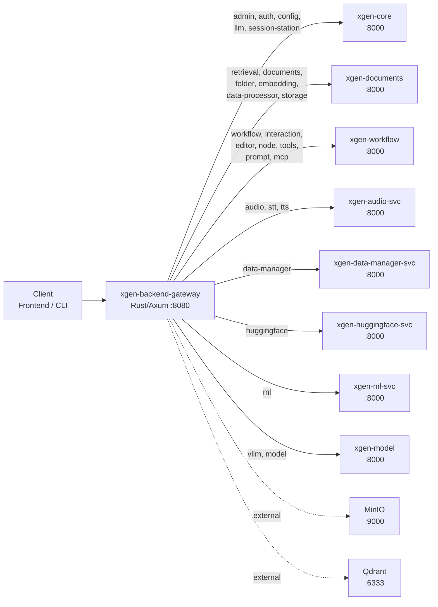

# Gateway 서비스 매핑: LLM/Crawler/ML 통합 구성

> 2025.10 ~ 2026.02 | Rust, Axum, YAML, Microservices

## 개요

XGEN 2.0 플랫폼은 LLM 서빙, 워크플로우, 문서 처리, 크롤러, ML, 오디오, HuggingFace 연동 등 다양한 마이크로서비스로 구성된다. 이 서비스들이 각각 독립적인 호스트와 포트를 가지고 있고, 프론트엔드에서는 단일 엔드포인트로 모든 API에 접근해야 한다. 전형적인 API Gateway 패턴이다.

문제는 서비스가 계속 늘어난다는 점이다. 2025년 10월 초기에는 xgen-core, xgen-workflow, xgen-model 3개뿐이었지만, 12월에 xgen-documents, xgen-crawler, xgen-ml, xgen-audio, xgen-huggingface까지 추가되면서 8개로 늘어났다. 그리고 각 서비스 안에서도 여러 모듈이 있다. xgen-documents 하나만 해도 retrieval, documents, folder, embedding, data-processor, storage까지 6개 모듈을 담당한다.

초기에는 라우팅 정보를 Rust 코드에 하드코딩했다. 서비스가 3개일 때는 그래도 괜찮았지만, 8개가 되고 모듈이 30개를 넘어가면서 코드를 수정하고 재컴파일하는 비용이 무시할 수 없게 됐다. 서비스 하나 추가할 때마다 Gateway를 다시 빌드하고 배포해야 한다니, 이건 아니다.

이 글은 하드코딩된 라우팅을 YAML 기반 서비스 매핑으로 전환하고, K8s/Docker/로컬 3가지 환경을 단일 구조로 지원하며, 환경변수 오버라이드까지 적용한 전체 과정을 다룬다.

## 전체 아키텍처

Gateway가 클라이언트 요청을 받아 적절한 업스트림 서비스로 프록시하는 구조다. 핵심은 URL 경로의 첫 번째 세그먼트(모듈명)를 기준으로 어떤 서비스에 보낼지 결정하는 것이다.



8개의 애플리케이션 서비스에 총 30개 이상의 모듈이 매핑되어 있고, MinIO와 Qdrant 같은 외부 인프라 서비스도 Gateway를 통해 접근할 수 있다.

## YAML 기반 서비스 매핑 설계

### 하드코딩에서 YAML로

초기 구현은 단순했다. Rust 코드에 `match` 문으로 모듈별 라우팅을 처리했다.

```rust
// 초기 하드코딩 방식 (2025.10)
fn get_upstream_url(module: &str) -> &str {
    match module {
        "workflow" | "editor" | "node" => "http://xgen-workflow:8000",
        "admin" | "auth" => "http://xgen-core:8000",
        "model" | "vllm" => "http://xgen-model:8000",
        _ => "http://xgen-core:8000", // fallback
    }
}
```

3개 서비스일 때는 이게 충분했다. 하지만 서비스가 8개로 늘어나면서 문제가 드러났다.

- 서비스 추가 시 Rust 코드 수정 -> 재컴파일 -> 재배포 필요
- K8s, Docker, 로컬 환경마다 호스트가 다름 (서비스명 vs localhost)
- 환경별로 분기 로직이 코드에 섞임
- 실수로 모듈 매핑을 빠뜨려도 컴파일 에러가 나지 않음 (fallback 처리)

2025년 10월 28일, 서비스 설정 구조를 근본적으로 리팩토링했다.

```
# 커밋: Refactor service configuration management by introducing a structured format for service mappings
# 날짜: 2025-10-28
```

### ServicesConfig 구조체

YAML 파일을 파싱할 Rust 구조체를 설계했다. serde의 `Deserialize`를 사용해 YAML과 1:1로 매핑되는 타입 안전한 구조를 만들었다.

```rust
#[derive(Debug, Clone, Deserialize)]
pub struct ServiceInfo {
    pub host: String,
    pub modules: Vec<String>,
}

#[derive(Debug, Clone, Deserialize)]
pub struct ServicesConfig {
    pub base_path: Option<String>,       // 기본 "/api"
    pub services: HashMap<String, ServiceInfo>,
    #[serde(default)]
    pub external: HashMap<String, String>,
}
```

설계 포인트가 몇 가지 있다.

**`base_path`는 `Option<String>`이다.** YAML에서 생략하면 코드에서 기본값 `/api`를 사용한다. 대부분의 서비스가 `/api` 접두사를 사용하지만, 향후 다른 접두사가 필요해질 가능성을 열어뒀다.

**`services`는 `HashMap<String, ServiceInfo>`다.** 서비스 이름이 키, 호스트와 모듈 목록이 값이다. Vec이 아닌 HashMap을 쓴 이유는 서비스 이름으로 직접 조회할 일이 생길 수 있기 때문이다. 실제로 디버그 로그에서 "어떤 서비스가 이 모듈을 처리하는가"를 출력할 때 유용했다.

**`external`은 `#[serde(default)]`로 비어있어도 된다.** 로컬 개발 환경에서는 MinIO나 Qdrant에 직접 접근할 필요가 없는 경우가 많다. `serde(default)`를 붙이면 YAML에 external 섹션이 없어도 빈 HashMap으로 초기화된다.

### services.yaml 구조

최종 완성된 services.yaml이다. 2025년 12월 23일 대규모 통합 이후의 버전이다.

```yaml
base_path: /api

services:
  xgen-core:
    host: http://xgen-core:8000
    modules: [admin, auth, config, llm, session-station]
  retrieval-service:
    host: http://xgen-documents:8000
    modules: [retrieval, documents, folder, embedding, data-processor, storage]
  workflow-service:
    host: http://xgen-workflow:8000
    modules: [workflow, interaction, editor, node, tools, prompt, mcp]
  audio-service:
    host: http://xgen-audio-svc:8000
    modules: [audio, stt, tts]
  data-manager-service:
    host: http://xgen-data-manager-svc:8000
    modules: [data-manager]
  huggingface-service:
    host: http://xgen-huggingface-svc:8000
    modules: [huggingface]
  ml-service:
    host: http://xgen-ml-svc:8000
    modules: [ml]
  xgen-model:
    host: http://xgen-model:8000
    modules: [vllm, model]

external:
  minio: http://minio:9000
  qdrant: http://qdrant:6333
```

몇 가지 설계 결정을 설명한다.

**서비스명과 호스트명이 다를 수 있다.** `retrieval-service`라는 키 이름은 Gateway 내부에서만 쓰이는 논리적 이름이고, 실제 호스트는 `xgen-documents`다. 초기에 retrieval 전용 서비스였다가 documents, embedding 등이 합쳐지면서 호스트명은 바뀌었지만, YAML 키는 유지했다. 이 분리가 서비스 통합/분리 시 호스트만 변경하면 되는 유연성을 준다.

**모듈 목록은 배열로 관리한다.** YAML의 flow sequence `[a, b, c]` 문법을 사용해 한 줄로 표현했다. 모듈이 적을 때는 가독성이 좋고, 많을 때는 block sequence로 전환할 수 있다.

**external은 단순 키-값 매핑이다.** 인프라 서비스는 모듈 개념이 없다. MinIO URL, Qdrant URL을 그대로 매핑한다. Gateway 코드에서 MinIO에 직접 프록시할 때 사용한다.

## 모듈 기반 라우팅

### URL 패턴

Gateway의 라우팅은 URL 경로에서 모듈명을 추출하는 것에서 시작한다.

```
/{base_path}/{module}/{rest_of_path}

예시:
GET /api/workflow/execute      → module="workflow", path="execute"
POST /api/embedding/batch      → module="embedding", path="batch"
GET /api/documents/list        → module="documents", path="list"
PUT /api/model/deploy          → module="model", path="deploy"
```

Axum의 라우터에서 이 패턴을 캡처한다.

```rust
// proxy.rs - 라우팅 핸들러
async fn proxy_stub(
    Path((service, tail)): Path<(String, String)>,
    req: Request<Body>,
) -> Result<Response<Body>, StatusCode> {
    let upstream_url = get_service_base_url(&service)
        .ok_or(StatusCode::BAD_GATEWAY)?;

    let target = format!("{}/{}", upstream_url, tail);
    proxy_request(target, req).await
}
```

`service`가 모듈명이고, `tail`이 나머지 경로다. `get_service_base_url`이 모듈명을 받아 전체 업스트림 URL을 반환한다.

### get_service_base_url: 3단계 검색

모듈명으로 업스트림 URL을 찾는 로직은 3단계 우선순위를 가진다.

```rust
pub fn get_service_base_url(module: &str) -> Option<String> {
    // 1단계: 환경변수 오버라이드
    if let Some(from_env) = env_override(module) {
        return Some(from_env);
    }
    // 2단계: services.yaml 모듈 매핑
    if let Some(url) = find_module_url(module) {
        return Some(url);
    }
    // 3단계: external 서비스 검색
    if let Some(url) = find_external_service(module) {
        return Some(url);
    }
    None
}
```

이 우선순위가 중요한 이유가 있다. 환경변수가 최우선이면 운영 중 YAML을 수정하지 않고도 특정 모듈의 라우팅을 임시로 변경할 수 있다. 디버깅할 때 특정 서비스를 로컬로 포워딩하거나, 카나리 배포 시 일부 트래픽을 새 버전으로 보낼 때 유용하다.

### normalize_simple: 모듈명 정규화

서비스 이름과 모듈 이름에 하이픈(`-`)과 언더스코어(`_`)가 혼용되는 문제가 있었다. YAML에는 `data-processor`로 적었는데, 프론트엔드에서 `data_processor`로 호출하면 매칭이 안 된다.

```rust
fn normalize_simple(name: &str) -> String {
    name.to_lowercase()
        .replace('-', "_")
        .replace(' ', "_")
}
```

하이픈과 공백을 모두 언더스코어로 변환하고 소문자로 통일한다. 이 정규화 덕분에 `data-processor`, `data_processor`, `Data-Processor` 모두 같은 모듈로 매핑된다.

### find_module_url: YAML에서 모듈 검색

services.yaml을 순회하며 모듈명이 일치하는 서비스를 찾는다.

```rust
fn find_module_url(module: &str) -> Option<String> {
    let config = SERVICES_CONFIG.get()?;
    let normalized_module = normalize_simple(module);
    let base_path = config.base_path.as_deref().unwrap_or("/api");

    for (service_name, service_info) in &config.services {
        for svc_module in &service_info.modules {
            if normalize_simple(svc_module) == normalized_module {
                let url = format!(
                    "{}{}/{}",
                    service_info.host, base_path, normalized_module
                );
                return Some(url);
            }
        }
    }
    None
}
```

`SERVICES_CONFIG`는 `OnceLock<ServicesConfig>`로 프로세스 시작 시 한 번만 로드된다. 이후 모든 요청에서 잠금 없이 읽기만 한다.

반환하는 URL 형식은 `{host}{base_path}/{module}`이다. 예를 들어 `workflow` 모듈 요청이면:
- host: `http://xgen-workflow:8000`
- base_path: `/api`
- module: `workflow`
- 결과: `http://xgen-workflow:8000/api/workflow`

이 URL에 요청의 나머지 경로(`tail`)를 붙여 최종 프록시 대상이 된다.

### 전체 라우팅 흐름 예시

구체적인 예시로 전체 흐름을 따라가 본다.

```
1. 클라이언트 요청:
   GET /api/workflow/execute?id=abc123

2. Axum 라우터:
   Path(("workflow", "execute?id=abc123"))

3. proxy_stub 호출:
   service = "workflow"
   tail = "execute?id=abc123"

4. get_service_base_url("workflow"):
   4-1. env_override("workflow") → None (환경변수 없음)
   4-2. find_module_url("workflow"):
        - normalize_simple("workflow") = "workflow"
        - services.yaml 순회
        - workflow-service.modules에 "workflow" 있음
        - URL = "http://xgen-workflow:8000/api/workflow"
   4-3. 반환: Some("http://xgen-workflow:8000/api/workflow")

5. 최종 프록시 대상:
   http://xgen-workflow:8000/api/workflow/execute?id=abc123
```

## 환경변수 오버라이드

### SERVICE_{NAME}_URL 패턴

환경변수 오버라이드는 `SERVICE_{모듈명}_URL` 패턴을 따른다.

```bash
# 워크플로우 서비스를 로컬로 오버라이드
SERVICE_WORKFLOW_URL=http://localhost:8001/api/workflow

# 임베딩 서비스를 특정 호스트로 오버라이드
SERVICE_EMBEDDING_URL=http://gpu-server:8000/api/embedding
```

코드에서 환경변수를 검색하는 로직은 다음과 같다.

```rust
fn env_override(module: &str) -> Option<String> {
    let env_key = format!(
        "SERVICE_{}_URL",
        module.to_uppercase().replace('-', "_")
    );
    std::env::var(&env_key).ok()
}
```

모듈명을 대문자로 변환하고 하이픈을 언더스코어로 바꿔 환경변수 키를 만든다. `data-processor`면 `SERVICE_DATA_PROCESSOR_URL`이 된다.

### 우선순위 정리

3단계 검색의 우선순위를 표로 정리하면 다음과 같다.

| 우선순위 | 소스 | 예시 | 용도 |
|----------|------|------|------|
| 1 | 환경변수 | `SERVICE_WORKFLOW_URL` | 런타임 오버라이드, 디버깅 |
| 2 | services.yaml | `modules: [workflow]` | 기본 서비스 매핑 |
| 3 | external | `minio: http://minio:9000` | 인프라 서비스 |

이 우선순위가 실전에서 유용한 시나리오 두 가지가 있다.

**시나리오 1: 개발 중 특정 서비스만 로컬에서 실행**

K8s 클러스터의 Gateway를 사용하면서, 디버깅 중인 워크플로우 서비스만 로컬에서 실행하고 싶을 때:

```bash
# Gateway Pod에 환경변수 주입
SERVICE_WORKFLOW_URL=http://host.k3s.internal:8001/api/workflow
```

services.yaml은 건드리지 않고 워크플로우 트래픽만 로컬로 보낼 수 있다.

**시나리오 2: 카나리 배포**

새 버전의 xgen-model을 `xgen-model-v2`라는 이름으로 배포한 뒤:

```bash
SERVICE_MODEL_URL=http://xgen-model-v2:8000/api/model
SERVICE_VLLM_URL=http://xgen-model-v2:8000/api/vllm
```

모델 관련 트래픽만 새 버전으로 보내면서 나머지는 기존 서비스를 사용한다.

## 환경별 설정 파일

### 3종 파일 체계

동일한 YAML 구조를 환경별로 3개 파일로 관리한다.

| 파일 | 호스트 형식 | 용도 |
|------|------------|------|
| `services.yaml` | K8s 서비스명 (`http://xgen-core:8000`) | K3s 클러스터 운영 |
| `services.docker.yaml` | Docker 네트워크명 (`http://xgen-core:8000`) | Docker Compose 개발 |
| `services.local.yaml` | localhost (`http://localhost:8001`) | 로컬 직접 실행 |

K8s와 Docker Compose에서 호스트명이 같은 것처럼 보이지만, 실제로는 DNS 해석 방식이 다르다. K8s에서는 CoreDNS가 서비스명을 클러스터 IP로 해석하고, Docker Compose에서는 Docker의 내장 DNS가 컨테이너명을 IP로 해석한다.

### services.local.yaml 예시

로컬 개발 환경에서는 각 서비스가 다른 포트로 실행된다.

```yaml
base_path: /api

services:
  xgen-core:
    host: http://localhost:8001
    modules: [admin, auth, config, llm, session-station]
  retrieval-service:
    host: http://localhost:8002
    modules: [retrieval, documents, folder, embedding, data-processor, storage]
  workflow-service:
    host: http://localhost:8003
    modules: [workflow, interaction, editor, node, tools, prompt, mcp]
  audio-service:
    host: http://localhost:8004
    modules: [audio, stt, tts]
  data-manager-service:
    host: http://localhost:8005
    modules: [data-manager]
  huggingface-service:
    host: http://localhost:8006
    modules: [huggingface]
  ml-service:
    host: http://localhost:8007
    modules: [ml]
  xgen-model:
    host: http://localhost:8008
    modules: [vllm, model]

external:
  minio: http://localhost:9000
  qdrant: http://localhost:6333
```

### 환경 선택 로직

어떤 파일을 로드할지는 환경변수 `SERVICES_CONFIG_PATH`로 결정한다.

```rust
fn load_services_config() -> Option<ServicesConfig> {
    let config_path = std::env::var("SERVICES_CONFIG_PATH")
        .unwrap_or_else(|_| "services.yaml".to_string());

    let content = std::fs::read_to_string(&config_path).ok()?;
    serde_yaml::from_str(&content).ok()
}
```

K8s 배포에서는 ConfigMap으로 services.yaml을 마운트하고, Docker Compose에서는 volumes로 services.docker.yaml을 마운트하며, 로컬에서는 `SERVICES_CONFIG_PATH=services.local.yaml`을 설정한다.

```yaml
# K8s Deployment에서 ConfigMap 마운트
volumeMounts:
  - name: services-config
    mountPath: /app/services.yaml
    subPath: services.yaml
```

```yaml
# Docker Compose에서 바인드 마운트
volumes:
  - ./services.docker.yaml:/app/services.yaml
```

이렇게 하면 Gateway 바이너리는 하나인데 설정만 교체해서 환경을 전환할 수 있다. 재컴파일 없이.

## site/env별 external 오버라이드

services.yaml의 external 섹션은 기본값이고, 배포 사이트별로 다른 인프라 주소가 필요한 경우가 있다. 예를 들어 롯데홈쇼핑 폐쇄망에서는 MinIO가 다른 호스트에 있다.

이를 위해 config.yml(사이트 설정 파일)의 external 섹션이 services.yaml의 external을 오버라이드하는 구조를 만들었다.

```rust
fn init_service_map_from_file() {
    // 1. services.yaml 로드
    let mut config = load_services_config()
        .expect("services.yaml 파일을 로드할 수 없습니다");

    // 2. config.yml의 external 오버라이드 적용
    if let Some(site_config) = SITE_CONFIG.get() {
        if let Some(ref site_external) = site_config.external {
            for (k, v) in site_external {
                config.external.insert(k.clone(), v.clone());
            }
        }
    }

    // 3. 전역 설정에 저장
    let _ = SERVICES_CONFIG.set(config);
}
```

이 패턴의 핵심은 **병합(merge)** 이다. services.yaml의 external을 완전히 대체하는 게 아니라, config.yml에 명시된 키만 오버라이드한다. services.yaml에 `minio`와 `qdrant`가 있고 config.yml에 `minio`만 있으면, minio URL만 바뀌고 qdrant는 services.yaml의 기본값을 유지한다.

```yaml
# config.yml (롯데홈쇼핑 사이트)
external:
  minio: http://lotte-minio.internal:9000
  # qdrant는 기본값 유지
```

이 2단계 오버라이드(services.yaml -> config.yml)에 환경변수 오버라이드까지 합치면 총 3단계 설정 레이어가 된다.

```
환경변수 > config.yml (사이트) > services.yaml (기본)
```

## 서비스 통합 히스토리

서비스 매핑은 한 번에 완성된 게 아니다. 3개월에 걸쳐 서비스가 추가되고, 합쳐지고, 이름이 바뀌었다. 이 히스토리가 YAML 기반 설정의 가치를 증명한다.

### 타임라인

**2025-10-28: 구조화된 서비스 매핑 도입**

```
# 커밋: Refactor service configuration management by introducing a structured format for service mappings
# 날짜: 2025-10-28
```

하드코딩에서 YAML 파싱으로 전환. 이 시점에서 xgen-core, xgen-workflow, vllm-ray-serve 3개 서비스만 존재했다.

**2025-12-01: 서비스 매핑 본격 확장**

```
# 커밋: feat: Add service mapping configuration for various services
# 날짜: 2025-12-01
```

audio, data-manager, huggingface, ml 서비스가 한꺼번에 추가됐다. YAML 파일에 섹션만 추가하면 됐다. Gateway 코드 변경 없음.

**2025-12-01: vllm-ray-serve를 vllm-service로 이름 변경**

```
# 커밋: refactor: Rename vllm-ray-serve to vllm-service and update configuration
# 날짜: 2025-12-01
```

초기에 Ray Serve 위에 vLLM을 올렸지만, Ray 의존성을 제거하면서 서비스명도 변경했다. YAML에서 키와 host만 수정.

**2025-12-17: citations, performance 모듈 추가**

```
# 커밋: feat: Add citations and performance modules
# 날짜: 2025-12-17
```

xgen-workflow에 citations, performance 모듈이 추가됐다. modules 배열에 2개 항목만 추가.

**2025-12-18: xgen-crawler-service 추가**

```
# 커밋: feat: Add xgen-crawler-service configuration to k3s
# 날짜: 2025-12-18
```

크롤러 서비스가 독립 서비스로 추가됐다. K3s 매니페스트와 services.yaml에 동시 반영.

**2025-12-23: 대규모 서비스 통합**

```
# 커밋: feat: Update services configuration to integrate new services and modules, including LLM, data management
# 날짜: 2025-12-23
```

여러 서비스의 모듈 구성을 재정리. LLM 관련 모듈을 xgen-core로, 데이터 관련 모듈을 xgen-documents로 통합.

**2026-01-15: data-processor, embedding을 xgen-documents로 통합**

```
# 커밋: data-processor 모듈을 xgen-documents로 통합
# 날짜: 2026-01-15
```

```
# 커밋: embedding 모듈을 xgen-documents로 통합
# 날짜: 2026-01-15
```

원래 독립 서비스였던 data-processor와 embedding이 xgen-documents에 합류했다. services.yaml에서 해당 모듈을 retrieval-service의 modules 배열로 옮기기만 하면 끝이었다.

**2026-01-26: vllm 모듈명을 inference로 변경**

```
# 커밋: 모듈명 변경: vllm -> inference
# 날짜: 2026-01-26
```

외부 노출 API에서 `vllm`이라는 구현 세부사항을 드러내는 게 적절하지 않다고 판단. `inference`로 변경했다가, 내부 호환성 문제로 `vllm`을 유지하는 것으로 롤백. 이 과정에서 YAML 수정만으로 테스트할 수 있었다.

**2026-02-04: storage 모듈 추가**

```
# 커밋: feat: storage 모듈 라우팅 추가 (xgen-documents)
# 날짜: 2026-02-04
```

xgen-documents에 storage 모듈이 추가. MinIO 파일 관리를 위한 API가 추가되면서 라우팅도 필요해졌다.

### 변경 사항 요약

| 날짜 | 변경 내용 | YAML 수정 | Gateway 코드 수정 |
|------|-----------|-----------|-------------------|
| 10-28 | 구조화된 매핑 도입 | 전체 재작성 | 전체 재작성 |
| 12-01 | 5개 서비스 추가 | 섹션 추가 | 없음 |
| 12-01 | 서비스명 변경 | 키/host 수정 | 없음 |
| 12-17 | 모듈 2개 추가 | 배열 항목 추가 | 없음 |
| 12-18 | 크롤러 서비스 추가 | 섹션 추가 | 없음 |
| 12-23 | 대규모 모듈 재배치 | 모듈 이동 | 없음 |
| 01-15 | 2개 서비스 통합 | 모듈 이동 | 없음 |
| 01-26 | 모듈명 변경 | 배열 항목 수정 | 없음 |
| 02-04 | storage 모듈 추가 | 배열 항목 추가 | 없음 |

10월 28일 최초 도입 이후, **Gateway Rust 코드를 한 번도 수정하지 않고** 9번의 서비스 구성 변경을 처리했다. 이것이 YAML 기반 서비스 매핑의 핵심 가치다.

## External 서비스 매핑

### MinIO와 Qdrant

external 섹션은 Gateway가 직접 프록시해야 하는 인프라 서비스를 정의한다.

```yaml
external:
  minio: http://minio:9000
  qdrant: http://qdrant:6333
```

일반 서비스 매핑과 다른 점은 `base_path`가 적용되지 않는다는 것이다. MinIO와 Qdrant는 자체 API 경로를 가지고 있어 `/api` 접두사를 붙이면 안 된다.

```rust
fn find_external_service(module: &str) -> Option<String> {
    let config = SERVICES_CONFIG.get()?;
    let normalized = normalize_simple(module);

    config.external.get(&normalized)
        .or_else(|| {
            // 정규화된 키로도 검색
            config.external.iter()
                .find(|(k, _)| normalize_simple(k) == normalized)
                .map(|(_, v)| v)
        })
        .cloned()
}
```

external 서비스를 찾을 때도 `normalize_simple`을 적용해 대소문자나 하이픈/언더스코어 불일치를 방지한다.

### external 사용 사례

Gateway에서 external 서비스를 쓰는 대표적인 경우:

- **MinIO 파일 업로드/다운로드**: 프론트엔드에서 직접 MinIO에 접근하면 CORS 문제가 생긴다. Gateway를 경유하면 단일 도메인에서 해결된다.
- **Qdrant 컬렉션 조회**: 관리자 UI에서 벡터DB 상태를 확인할 때 Qdrant REST API를 Gateway를 통해 호출한다.

## 트러블슈팅

### 모듈 이름 불일치

가장 흔한 문제는 프론트엔드와 Gateway 간의 모듈 이름 불일치였다.

**증상**: 프론트엔드에서 `/api/data_processor/upload`를 호출하면 502 Bad Gateway가 반환된다.

**원인**: services.yaml에는 `data-processor`(하이픈)로 등록했는데, 프론트엔드에서 `data_processor`(언더스코어)로 호출.

**해결**: `normalize_simple` 함수를 도입해 하이픈과 언더스코어를 통일. 이 함수가 없었으면 프론트엔드와 YAML을 하나씩 맞춰야 했다.

```rust
// 이 정규화 덕분에 다음이 모두 동일하게 처리된다
normalize_simple("data-processor")  // "data_processor"
normalize_simple("data_processor")  // "data_processor"
normalize_simple("Data-Processor")  // "data_processor"
```

### 서비스 통합 시 라우팅 깨짐

**증상**: data-processor 서비스를 xgen-documents로 통합한 뒤, `/api/data-processor/` 요청이 404로 반환된다.

**원인**: services.yaml에서 모듈을 이동했지만, xgen-documents 서비스 자체에서 `/api/data-processor/` 경로를 등록하지 않은 상태였다. Gateway는 올바르게 프록시했지만, 업스트림에서 404를 반환한 것.

**해결**: 서비스 통합 시 체크리스트를 만들었다.

1. services.yaml에서 모듈을 새 서비스의 modules 배열로 이동
2. 새 서비스(xgen-documents)에서 해당 API 경로를 등록
3. Gateway 로그에서 프록시 대상 URL이 올바른지 확인
4. 기존 서비스에서 해당 모듈 제거

이 4단계를 빠뜨리면 라우팅이 깨진다. 특히 2번을 놓치기 쉽다. Gateway가 올바르게 프록시해도 업스트림이 준비되지 않으면 의미가 없다.

### YAML 로드 실패 시 Fallback

YAML 파일이 손상되거나 누락되면 Gateway가 아예 시작되지 않는 문제가 있었다.

```rust
fn init_service_map_from_file() {
    match load_services_config() {
        Some(config) => {
            log::info!(
                "서비스 매핑 로드 완료: {} services, {} external",
                config.services.len(),
                config.external.len()
            );
            // ... 오버라이드 적용 후 저장
        }
        None => {
            log::error!("services.yaml 로드 실패 - 서비스 매핑 없이 시작");
            // 빈 설정으로 시작 (환경변수 오버라이드만 사용 가능)
        }
    }
}
```

YAML 로드에 실패해도 Gateway는 시작된다. 다만 YAML 기반 매핑이 동작하지 않고, 환경변수 오버라이드만 사용할 수 있다. 이 방어적 설계 덕분에 설정 파일 문제로 Gateway 전체가 죽는 상황은 방지할 수 있다.

시작 시 로드된 서비스 수와 external 수를 로그로 출력하는 것도 중요하다. `0 services`가 찍히면 YAML 경로나 파싱에 문제가 있다는 신호다.

### 순환 참조 방지

초기에 xgen-core에 `llm` 모듈을 넣고, xgen-model에도 `llm` 모듈을 넣는 실수가 있었다.

```yaml
# 잘못된 설정 - 동일 모듈이 두 서비스에 존재
xgen-core:
    modules: [admin, auth, llm]
xgen-model:
    modules: [vllm, llm, model]
```

`find_module_url`은 HashMap을 순회하므로 어떤 서비스가 먼저 매칭될지 보장되지 않는다. 요청마다 다른 서비스로 라우팅될 수 있다.

이 문제를 감지하기 위해 시작 시 중복 모듈 검사를 추가했다.

```rust
fn validate_config(config: &ServicesConfig) {
    let mut module_map: HashMap<String, Vec<String>> = HashMap::new();

    for (service_name, service_info) in &config.services {
        for module in &service_info.modules {
            let normalized = normalize_simple(module);
            module_map.entry(normalized.clone())
                .or_default()
                .push(service_name.clone());
        }
    }

    for (module, services) in &module_map {
        if services.len() > 1 {
            log::warn!(
                "모듈 '{}' 이(가) 여러 서비스에 등록됨: {:?}",
                module, services
            );
        }
    }
}
```

경고만 출력하고 시작을 막지는 않는다. 의도적으로 같은 모듈을 여러 서비스에 등록하는 경우(부하 분산 등)가 있을 수 있기 때문이다. 하지만 대부분의 경우 실수이므로 경고로 주의를 환기한다.

## 설정 초기화와 OnceLock 패턴

전역 설정은 `OnceLock`으로 관리한다. Rust의 `OnceLock`은 최초 한 번만 값을 설정할 수 있고, 이후에는 불변 참조만 허용하는 스레드 안전 컨테이너다.

```rust
use std::sync::OnceLock;

static SERVICES_CONFIG: OnceLock<ServicesConfig> = OnceLock::new();
static SITE_CONFIG: OnceLock<SiteConfig> = OnceLock::new();
```

Gateway 시작 시 초기화 순서:

```rust
// 1. site config 로드 (config.yml)
SITE_CONFIG.set(load_site_config()).ok();

// 2. services config 로드 + site config 오버라이드 적용
init_service_map_from_file();

// 3. Axum 서버 시작
let app = Router::new()
    .route("/api/:service/*tail", any(proxy_stub))
    // ...
```

SITE_CONFIG가 먼저 로드되어야 `init_service_map_from_file`에서 site external 오버라이드를 적용할 수 있다. 이 순서가 바뀌면 오버라이드가 누락된다.

`OnceLock` 대신 `Mutex<Option<T>>`를 쓸 수도 있지만, 읽기 성능에서 차이가 난다. `OnceLock`은 초기화 이후 잠금 없이 `&T`를 반환하지만, `Mutex`는 매 읽기마다 잠금을 획득해야 한다. 모든 HTTP 요청이 서비스 매핑을 조회하는 상황에서 이 차이는 유의미하다.

## 결과

3개월간의 서비스 매핑 진화를 정리한다.

**정량적 성과:**

- 관리 대상: 3개 서비스 -> 8개 서비스, 10개 모듈 -> 30개 이상 모듈
- Gateway 코드 수정 없이 처리한 설정 변경: 9회
- 환경별 설정 파일: 3종 (K8s, Docker, Local)
- 서비스 추가/변경 시 소요 시간: 재컴파일 10분 -> YAML 수정 1분

**아키텍처 결정의 핵심:**

1. **YAML 기반 서비스 매핑** — 코드 변경 없이 서비스 구성 변경. serde_yaml + HashMap 조합으로 타입 안전성 확보.
2. **3단계 URL 해석 우선순위** — 환경변수 > YAML > external. 운영 중 유연한 오버라이드 가능.
3. **normalize_simple** — 모듈명 정규화로 하이픈/언더스코어/대소문자 불일치 문제 원천 차단.
4. **site config 오버라이드** — 배포 사이트별 인프라 주소를 YAML 레이어링으로 관리.
5. **OnceLock 패턴** — 초기화 후 잠금 없는 읽기로 요청당 오버헤드 최소화.

이 구조가 자리 잡은 뒤로는 새 서비스를 추가할 때 services.yaml에 3줄(host + modules)만 추가하면 된다. Gateway는 재배포할 필요도 없고, K8s ConfigMap만 업데이트하면 Pod 재시작 시 자동으로 반영된다. 마이크로서비스 아키텍처에서 Gateway의 서비스 디스커버리가 왜 중요한지, 그리고 그것을 과도하게 복잡한 도구(Consul, etcd) 없이도 YAML + 환경변수로 충분히 해결할 수 있다는 것을 3개월간의 실전에서 확인했다.
