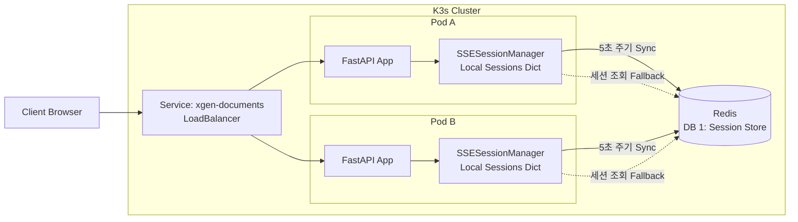
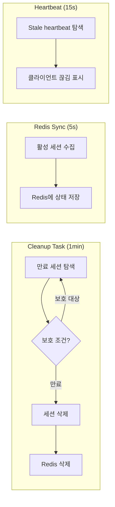

# Redis 기반 SSE 세션 상태 공유: 멀티 POD 환경

> 2026.01 | xgen-documents 서비스의 SSE 세션 관리를 단일 POD에서 멀티 POD로 전환한 과정

## 배경

XGEN 2.0의 문서 처리 서비스(xgen-documents)는 사용자가 업로드한 문서를 파싱하고, 청킹하고, 임베딩하여 벡터 DB에 저장하는 파이프라인을 제공한다. 이 파이프라인은 파일 크기와 OCR 여부에 따라 수십 초에서 수 분까지 소요되기 때문에 SSE(Server-Sent Events)로 실시간 진행 상황을 클라이언트에 스트리밍한다.

단일 POD로 운영할 때는 문제가 없었다. 세션 상태는 Python 프로세스의 메모리에 딕셔너리로 관리했고, SSE 연결도 같은 프로세스 내에서 유지됐다. 하지만 K3s 클러스터에서 `replicas: 2` 이상으로 스케일아웃하는 순간 상황이 달라졌다.

Kubernetes의 Service 로드밸런서가 요청을 라운드 로빈으로 분배하면서, 업로드 요청이 Pod A로 갔는데 이후 진행 상황 조회 요청이 Pod B로 라우팅되는 일이 발생했다. Pod B에는 해당 세션이 없으니 404를 반환하고, 프론트엔드에서는 업로드가 실패한 것으로 표시됐다. 클라이언트가 브라우저를 새로고침한 후 SSE 재연결을 시도하면, 역시 다른 Pod로 빠질 확률이 50%였다.

이 문제를 해결하기 위해 Redis를 세션 상태의 중앙 저장소로 도입했다.

## 문제 분석

구체적으로 세 가지 문제가 있었다.

**1. 세션 격리**: 각 Pod의 `SSESessionManager`는 독립적인 `self.sessions: Dict[str, SSESession]` 딕셔너리를 갖고 있다. Pod A에서 생성한 세션을 Pod B에서 조회할 수 없다.

**2. SSE 재연결 실패**: 문서 처리 중 네트워크 일시 단절이나 브라우저 탭 전환으로 SSE 연결이 끊어지면 클라이언트가 재연결을 시도한다. 이때 Kubernetes Service가 다른 Pod로 라우팅하면, 재연결 대상 세션이 존재하지 않는다.

**3. 진행 상황 폴링**: 프론트엔드의 세션 목록 페이지에서 GET `/sessions/{session_id}`로 진행 상황을 폴링할 때, 매 요청마다 다른 Pod로 갈 수 있어 간헐적으로 세션이 보이다 안 보이다 했다.

근본적인 해결은 두 가지 선택지가 있었다:

- **Sticky Session**: Ingress에서 클라이언트별로 특정 Pod에 고정 라우팅. 간단하지만 Pod 장애 시 세션 유실 문제가 그대로 남는다.
- **Redis 중앙 세션 스토어**: 세션 상태를 Redis에 저장하여 모든 Pod에서 조회 가능. 처리 자체는 원래 Pod에서만 수행하되, 상태 정보는 공유한다.

Sticky Session은 Pod 장애나 오토스케일링 시 취약하다. 결국 Redis 기반 세션 상태 공유를 선택했다.

## 아키텍처



핵심 설계 원칙은 다음과 같다:

- **처리(Processing)는 단일 Pod에서만**: asyncio.Queue, asyncio.Task 같은 비직렬화 자원은 Pod 간 공유가 불가능하다. 문서 처리 자체는 세션을 생성한 Pod에서만 수행한다.
- **상태(State)는 Redis에서 공유**: 세션의 현재 상태(status, phase, progress, error, result)는 직렬화 가능한 데이터이므로 Redis에 저장하여 모든 Pod에서 조회 가능하게 한다.
- **Graceful Degradation**: Redis가 다운되어도 서비스는 단일 Pod 모드로 계속 동작한다. Redis는 있으면 좋고, 없어도 서비스가 죽지 않는다.

## SSESession 상태 머신

문서 업로드 세션은 명확한 상태 머신으로 관리한다.

### 세션 상태 (SessionStatus)

```python
class SessionStatus(Enum):
    INITIALIZING = "initializing"   # 세션 생성 직후
    PROCESSING = "processing"       # 문서 처리 진행 중
    RETRYING = "retrying"          # 에러 발생 후 재시도 중
    PAUSED = "paused"              # 일시 정지
    COMPLETED = "completed"         # 처리 완료
    ERROR = "error"                # 복구 불가 에러
    CANCELLED = "cancelled"         # 사용자 취소
    RECOVERING = "recovering"       # 체크포인트에서 복구 중
```

### 처리 단계 (ProcessingPhase)

문서 처리 파이프라인의 각 단계를 별도 Enum으로 추적한다:

```python
class ProcessingPhase(Enum):
    INIT = "init"                       # 초기화
    FILE_SAVING = "file_saving"         # 파일 저장 (MinIO)
    TEXT_EXTRACTION = "text_extraction"  # 텍스트 추출
    CHUNKING = "chunking"               # 청킹
    OCR = "ocr"                         # OCR 처리
    LLM_METADATA = "llm_metadata"       # LLM 메타데이터 생성
    EMBEDDING = "embedding"             # 임베딩 생성
    VECTOR_STORAGE = "vector_storage"   # 벡터 DB 저장
    FINALIZATION = "finalization"       # 마무리
    COMPLETED = "completed"             # 완료
```

SessionStatus는 세션의 "건강 상태"를, ProcessingPhase는 "지금 뭘 하고 있는지"를 나타낸다. 예를 들어 `status=RETRYING, phase=EMBEDDING`이면 "임베딩 단계에서 에러가 발생해 재시도 중"이라는 의미다.

### 재시도 설정

```python
@dataclass
class RetryConfig:
    max_retries: int = 5
    base_delay: float = 3.0          # 지수 백오프 기본 딜레이
    max_delay: float = 60.0          # 최대 딜레이 (1분)
    exponential_base: float = 1.5    # 백오프 지수
    jitter: bool = True              # 랜덤 지터 추가
    connection_timeout: float = 300.0  # 클라이언트 재연결 대기 (5분)
    keep_alive_after_disconnect: bool = True  # 연결 끊겨도 백그라운드 계속
```

`keep_alive_after_disconnect`가 핵심이다. 클라이언트의 SSE 연결이 끊어져도 서버 측 문서 처리는 계속 진행된다. 임베딩이나 OCR은 수 분이 걸리는 작업인데, 브라우저 탭을 닫았다가 다시 열었을 때 처음부터 재시작하면 GPU 리소스 낭비가 심하다.

지수 백오프의 딜레이 계산 로직은 다음과 같다:

```python
def calculate_retry_delay(self, attempt: int) -> float:
    import random
    delay = min(
        self.retry_config.base_delay * (self.retry_config.exponential_base ** attempt),
        self.retry_config.max_delay
    )
    if self.retry_config.jitter:
        jitter_range = delay * 0.25
        delay += random.uniform(-jitter_range, jitter_range)
    return max(delay, 1.0)
```

지수 1.5를 사용해 백오프 곡선을 완만하게 설정했다. 기본 2.0이면 5번째 재시도에서 이미 96초에 도달하는데, 1.5로 하면 5번째가 22.8초 정도로 사용자 체감상 적절한 수준이다. 여기에 +-25% 지터를 추가해 여러 세션이 동시에 재시도할 때 thundering herd 문제를 완화했다.

### 이벤트 히스토리와 시퀀스 번호

SSE 재연결 시 놓친 이벤트를 복구하기 위해 세션별로 이벤트 히스토리를 관리한다:

```python
# 최근 300개 이벤트만 유지 (메모리 최적화)
self._event_history: deque = deque(maxlen=300)
self._event_sequence_number = 0
```

모든 이벤트에 시퀀스 번호(`_seq`)를 부여하고, 클라이언트가 재연결 시 마지막으로 받은 시퀀스 번호를 전달하면 그 이후 이벤트만 전송한다:

```python
async def put_event(self, event_data: Dict[str, Any]):
    async with self._event_lock:
        self._event_sequence_number += 1
        event_data['_seq'] = self._event_sequence_number
        event_data['_timestamp'] = datetime.now(TIMEZONE).isoformat()

        # 히스토리에 저장 (재연결 시 복구용)
        self._event_history.append(event_data.copy())

        # 큐에 추가 (큐가 가득 차면 오래된 이벤트 제거)
        try:
            self.progress_queue.put_nowait(event_data)
        except asyncio.QueueFull:
            try:
                self.progress_queue.get_nowait()
                self.progress_queue.put_nowait(event_data)
            except (asyncio.QueueEmpty, asyncio.QueueFull):
                pass
```

`progress_queue`의 `maxsize=1000`은 메모리 누수를 방지하기 위한 안전장치다. 초기에는 무제한 큐를 사용했는데, 클라이언트가 연결을 끊은 상태에서 긴 문서 처리가 진행되면 큐에 수천 개의 이벤트가 쌓여 메모리 사용량이 급증하는 문제가 있었다.

```
# 커밋: feat: Optimize memory management in SSE session handling and upload progress tracking
# 날짜: 2026-01-12 02:11
```

이 커밋에서 Queue maxsize 설정, deque maxlen 설정, 완료 세션 리소스 즉시 해제 등 메모리 관리 최적화를 일괄 적용했다.

## Redis 세션 백엔드 구현

### 설계 원칙

Redis 세션 백엔드의 설계 원칙은 단순하다: **절대 예외를 던지지 않는다**.

```python
# Redis 설정
REDIS_HOST = os.getenv('REDIS_HOST', 'redis')
REDIS_PORT = int(os.getenv('REDIS_PORT', '6379'))
REDIS_PASSWORD = os.getenv('REDIS_PASSWORD', None)
REDIS_DB = int(os.getenv('REDIS_SESSION_DB', '1'))  # 세션용 별도 DB
SESSION_TTL = 3600  # 1시간 후 자동 만료
SESSION_KEY_PREFIX = "sse_session:"
```

Redis DB를 1번으로 분리한 이유는 세션 데이터와 다른 캐시 데이터(업로드 진행률 등)를 격리하기 위해서다. `FLUSHDB` 명령으로 세션만 일괄 삭제할 수 있다.

### Graceful Degradation

`RedisSessionBackend`의 모든 public 메서드는 Redis 실패 시 `None` 또는 `False`를 반환한다. 절대 예외를 호출자에게 전파하지 않는다:

```python
async def save_session_state(self, session_id: str, state: Dict[str, Any], ttl: int = SESSION_TTL) -> bool:
    """세션 상태 저장 (Redis 불가시 False, 예외 없음)"""
    try:
        redis = await self._get_redis()
        if redis is None:
            return False

        key = self._session_key(session_id)
        state_copy = state.copy()
        for k, v in state_copy.items():
            if isinstance(v, datetime):
                state_copy[k] = v.isoformat()

        await redis.set(key, json.dumps(state_copy), ex=ttl)
        self._record_success()
        return True
    except Exception as e:
        self._record_failure(e)
        return False
```

`datetime` 객체를 ISO 포맷 문자열로 자동 변환하는 처리도 포함했다. Redis에 저장할 때는 JSON 직렬화가 필수인데, Python의 `datetime`은 기본적으로 JSON 직렬화가 안 되기 때문이다.

### Circuit Breaker 패턴

Redis에 반복적으로 연결을 시도하는 것은 비용이 크다. 연결 타임아웃 5초, 소켓 타임아웃 5초가 매 요청마다 걸리면 응답 시간이 크게 저하된다. 그래서 Circuit Breaker 패턴을 적용했다:

```python
# Circuit breaker 설정
REDIS_RETRY_INTERVAL = 60.0  # 재시도 간격 (초)
MAX_CONSECUTIVE_FAILURES = 3

class RedisSessionBackend:
    def __init__(self):
        self._disabled = False        # 영구 오류시 비활성화
        self._consecutive_failures = 0
        self._last_failure_time = 0.0

    def _is_permanent_error(self, error: Exception) -> bool:
        """재시도해도 안 되는 영구 오류인지 확인"""
        err_str = str(error).lower()
        permanent = ['authentication required', 'invalid password',
                     'wrongpass', 'noauth']
        return any(p in err_str for p in permanent)

    def _should_skip(self) -> bool:
        """Redis 연결 시도를 건너뛸지 결정"""
        if self._disabled:
            return True
        if self._consecutive_failures >= MAX_CONSECUTIVE_FAILURES:
            elapsed = time.time() - self._last_failure_time
            if elapsed < REDIS_RETRY_INTERVAL:
                return True
            self._consecutive_failures = 0  # 재시도 허용
        return False
```

동작 방식을 정리하면:

1. Redis 연결이 3회 연속 실패하면 Circuit을 연다 (60초간 연결 시도 차단).
2. 60초 후 Circuit을 반만 열어(half-open) 한 번 시도한다.
3. 성공하면 Circuit을 닫고, 실패하면 다시 60초 대기한다.
4. 인증 오류(`WRONGPASS`, `NOAUTH`) 같은 영구적 오류가 감지되면 `_disabled = True`로 설정하여 서비스 재시작 전까지 Redis 시도를 완전히 중단한다.

```
# 커밋: feat: enhance session management with race condition protection and multi-user support
# 날짜: 2026-02-12 06:53
```

이 커밋에서 Circuit Breaker의 영구 오류 감지 로직과 Graceful Degradation 전반을 고도화했다.

### Redis 연결 초기화

```python
async def _get_redis(self) -> Optional[aioredis.Redis]:
    """Redis 연결 반환 (실패시 None, 예외 없음)"""
    if self._should_skip():
        return None

    if self._redis is None:
        try:
            self._redis = aioredis.Redis(
                host=REDIS_HOST,
                port=REDIS_PORT,
                password=REDIS_PASSWORD,
                db=REDIS_DB,
                decode_responses=True,
                socket_timeout=5.0,
                socket_connect_timeout=5.0
            )
            await self._redis.ping()
            self._record_success()
        except Exception as e:
            self._record_failure(e)
            if self._redis:
                try:
                    await self._redis.close()
                except:
                    pass
            self._redis = None
            return None
    return self._redis
```

`redis.asyncio`(`aioredis`)를 사용한 비동기 Redis 클라이언트다. `decode_responses=True`로 설정하면 바이트가 아닌 문자열로 응답을 받을 수 있어 JSON 파싱이 간편해진다. `socket_timeout`과 `socket_connect_timeout`을 5초로 설정하여 Redis가 무응답일 때 빠르게 실패하도록 했다.

```
# 커밋: Redis 비밀번호 인증 및 연결 타임아웃 추가
# 날짜: 2026-01-26 01:12
```

초기 구현에서는 비밀번호 없이 연결했는데, K3s 클러스터의 Redis에 `requirepass`를 설정한 후 인증 실패가 발생했다. 이 커밋에서 `REDIS_PASSWORD` 환경변수와 타임아웃 설정을 추가했다.

## 프록시 세션: 다른 Pod의 세션 조회

멀티 POD 환경에서 가장 중요한 부분이 **프록시 세션**이다. Pod A에서 처리 중인 세션의 상태를 Pod B에서 조회할 수 있어야 한다.

### 세션 조회 로직

`SSESessionManager.get_session()`의 조회 순서는 다음과 같다:

```python
async def get_session(self, session_id: str) -> Optional[SSESession]:
    async with self._lock:
        # 1. 로컬 세션 조회
        local_session = self.sessions.get(session_id)
        if local_session:
            return local_session

        # 2. Redis에서 세션 상태 조회 (다른 Pod에서 처리 중인 세션)
        redis_state = await self._get_session_from_redis(session_id)
        if redis_state:
            return self._create_proxy_session_from_redis(redis_state)

        return None
```

로컬에 있으면 로컬 세션을 반환하고, 없으면 Redis에서 찾는다. Redis에서 찾은 세션은 다른 Pod에서 처리 중인 것이므로, 읽기 전용 프록시 객체를 생성한다.

### 프록시 세션 생성

```python
def _create_proxy_session_from_redis(self, redis_state: Dict[str, Any]) -> SSESession:
    session = SSESession(
        session_id=redis_state["session_id"],
        user_id=redis_state["user_id"],
        collection_name=redis_state["collection_name"],
        filename=redis_state["filename"],
    )

    # Redis에서 복원한 상태 적용
    session._status = SessionStatus(redis_state.get("status", "processing"))
    session.current_phase = ProcessingPhase(redis_state.get("phase", "init"))
    session.processed_chunks = redis_state.get("processed_chunks", 0)
    session.total_chunks = redis_state.get("total_chunks", 0)
    session.error = redis_state.get("error")
    session.result = redis_state.get("result")
    session._is_finalized = redis_state.get("is_finalized", False)
    session.background_task_running = redis_state.get("background_task_running", False)

    # 프록시 세션임을 표시
    session._is_proxy = True
    session._source_pod = redis_state.get("pod_name", "unknown")

    return session
```

프록시 세션은 `_is_proxy = True` 플래그가 설정되어 있다. 이 플래그는 디버깅과 상태 조회 API에서 "이 세션은 현재 Pod에서 처리 중이 아니라 다른 Pod의 상태를 보여주는 것"임을 명시한다.

`get_progress_summary()` 호출 시 프록시 정보가 포함된다:

```python
def get_progress_summary(self) -> Dict[str, Any]:
    summary = {
        "session_id": self.session_id,
        "status": self.status,
        "phase": self.current_phase.value,
        # ... 기타 필드
    }

    if self._is_proxy:
        summary["is_proxy"] = True
        summary["source_pod"] = self._source_pod

    return summary
```

프론트엔드에서는 `is_proxy` 필드를 확인하여 "처리 중 (Pod: xgen-documents-7d8f9b6c4-abc12)" 같은 정보를 표시할 수 있다.

### Redis에 저장하는 세션 상태

모든 세션 데이터가 아닌, 직렬화 가능한 핵심 상태만 Redis에 저장한다:

```python
def to_redis_state(self) -> Dict[str, Any]:
    return {
        "session_id": self.session_id,
        "user_id": self.user_id,
        "collection_name": self.collection_name,
        "filename": self.filename,
        "status": self.status,
        "phase": self.current_phase.value,
        "processed_chunks": self.processed_chunks,
        "total_chunks": self.total_chunks,
        "error": self.error,
        "result": self.result,
        "is_finalized": self._is_finalized,
        "created_at": self.created_at.isoformat(),
        "updated_at": self.updated_at.isoformat(),
        "completed_at": self.completed_at.isoformat() if self.completed_at else None,
        "retry_count": self.current_retry_count,
        "reconnection_count": self.reconnection_count,
        "background_task_running": self.background_task_running,
        "pod_name": os.getenv("HOSTNAME", "unknown"),
    }
```

`asyncio.Queue`, `asyncio.Task`, `asyncio.Lock` 같은 런타임 객체는 직렬화할 수 없으므로 제외한다. `pod_name`은 Kubernetes의 `HOSTNAME` 환경변수에서 가져오며, 디버깅 시 어느 Pod에서 처리 중인지 식별하는 데 쓴다.

## Race Condition 방지

멀티 POD뿐 아니라 멀티 유저 환경에서도 세션 충돌이 발생할 수 있다. 세 가지 보호 메커니즘을 구현했다.

### 1. 사용자 ID 검증

```python
async def create_session(self, session_id, user_id, collection_name, filename, retry_config=None):
    async with self._lock:
        if session_id in self.sessions:
            old_session = self.sessions[session_id]

            # 다른 사용자의 세션은 절대 건드리지 않음
            if int(old_session.user_id) != int(user_id):
                raise ValueError(
                    f"Session ID '{session_id}' is already in use by another user."
                )
```

같은 `session_id`로 다른 `user_id`가 접근하면 즉시 예외를 발생시킨다. UUID 기반 세션 ID를 사용하면 충돌 확률이 극히 낮지만, 방어적 코딩 차원에서 명시적으로 차단한다.

### 2. 파일명 기반 세션 재사용 판단

같은 사용자가 같은 `session_id`로 요청하더라도 파일이 다를 수 있다. 파일명을 비교하여 재연결인지, 새 업로드인지 판단한다:

```python
            is_same_file = old_session.filename == filename

            if is_same_file:
                # 같은 파일: 재연결 처리
                if old_session.is_finalized():
                    if not old_session.should_be_deleted():
                        old_session.mark_client_reconnected()
                        return old_session
                elif old_session._status in [SessionStatus.COMPLETED, SessionStatus.ERROR, SessionStatus.CANCELLED]:
                    old_session.cancel()
                    old_session.full_cleanup()
                    del self.sessions[session_id]
                else:
                    # 진행 중인 세션 -> 재연결
                    old_session.mark_client_reconnected()
                    return old_session
            else:
                # 다른 파일이 같은 session_id로 들어온 경우
                if old_session.background_task_running or (old_session.task and not old_session.task.done()):
                    # 진행 중인 작업이 있으면 기존 세션 보호
                    return old_session
                else:
                    old_session.full_cleanup()
                    del self.sessions[session_id]
```

중요한 포인트는 "진행 중인 작업이 있으면 기존 세션을 보호"하는 것이다. 프론트엔드 버그로 같은 `session_id`에 다른 파일이 올라와도 이미 진행 중인 임베딩 작업이 취소되지 않는다.

### 3. 삭제 시 파일명/사용자 검증

세션 삭제 API에서도 Race Condition을 방지한다:

```python
async def remove_session(self, session_id, force=False,
                          expected_filename=None, expected_user_id=None):
    async with self._lock:
        session = self.sessions[session_id]

        # 다른 사용자의 세션은 삭제하지 않음
        if expected_user_id is not None and int(session.user_id) != int(expected_user_id):
            return False

        # 다른 파일의 세션은 삭제하지 않음
        if expected_filename is not None and session.filename != expected_filename:
            return False
```

프론트엔드가 파일 A의 세션 삭제를 요청했는데, 그 사이에 같은 `session_id`로 파일 B가 업로드됐다면 삭제를 거부한다. 이 패턴은 Optimistic Locking의 일종이다.

```
# 커밋: feat: enhance session management with race condition protection and multi-user support
# 날짜: 2026-02-12 06:53
```

## 주기적 동기화 태스크

세 가지 백그라운드 태스크가 세션 관리를 자동화한다.

### 1. Redis 동기화 (5초 주기)

```python
def start_redis_sync_task(self, interval_seconds: float = 5.0):
    async def sync_loop():
        while True:
            await asyncio.sleep(interval_seconds)
            await self._sync_all_active_sessions()

    self._redis_sync_task = asyncio.create_task(sync_loop())

async def _sync_all_active_sessions(self):
    async with self._lock:
        for session in self.sessions.values():
            if session.is_active() or session.background_task_running:
                try:
                    await self._sync_session_to_redis(session)
                except Exception as e:
                    logger.warning(f"Failed to sync session {session.session_id}: {e}")
```

5초 간격으로 활성 세션(`is_active()` 또는 `background_task_running`)의 상태를 Redis에 저장한다. 이벤트가 발생할 때마다 동기화하는 것이 아니라 주기적으로 배치 동기화하여 Redis 부하를 최소화했다. 5초 지연은 진행률 표시에 크게 영향을 주지 않는 수준이다.

### 2. 세션 정리 (1분 주기)

```python
def start_cleanup_task(self, interval_minutes: int = 1):
    async def cleanup_loop():
        while True:
            await asyncio.sleep(interval_minutes * 60)
            await self.cleanup_expired_sessions()
```

세션 정리에는 보호 조건이 있다. 다음 상태의 세션은 만료되었더라도 삭제하지 않는다:

```python
async def cleanup_expired_sessions(self, timeout_minutes: int = 60):
    async with self._lock:
        for session_id, session in self.sessions.items():
            # 보호 조건 1: 백그라운드 작업 진행 중
            if session.background_task_running:
                continue
            # 보호 조건 2: 태스크 실행 중
            if session.task and not session.task.done():
                continue
            # 보호 조건 3: 활성 연결 존재
            if session.active_connections > 0:
                continue
            # 보호 조건 4: 재연결 대기 중
            if session.is_waiting_for_reconnect():
                continue
```

초기에는 단순히 `updated_at`만 보고 만료 판단을 했는데, 대용량 PDF 처리 시 `updated_at`이 갱신되지 않는 구간(OCR 처리 등)에서 세션이 조기 삭제되는 버그가 있었다. `background_task_running` 플래그와 `task.done()` 체크를 추가하여 해결했다.

### 3. Heartbeat 모니터 (15초 주기)

```python
def start_heartbeat_monitor(self, interval_seconds: float = 15.0, stale_threshold: float = 30.0):
    async def heartbeat_loop():
        while True:
            await asyncio.sleep(interval_seconds)
            await self.check_stale_heartbeats(stale_threshold)

async def check_stale_heartbeats(self, threshold_seconds: float = 30.0):
    async with self._lock:
        for session_id, session in self.sessions.items():
            if session.is_active() and session.is_heartbeat_stale(threshold_seconds):
                if session.is_client_connected:
                    session.mark_client_disconnected()
```

클라이언트가 30초 이상 heartbeat를 보내지 않으면 연결 끊김으로 판정한다. `mark_client_disconnected()`는 `is_client_connected = False`로 설정하고 `active_connections`를 감소시키지만, `keep_alive_after_disconnect = True` 설정 덕분에 백그라운드 작업은 계속 진행된다.



## 메모리 관리 최적화

SSE 세션은 장시간 유지되는 객체이므로 메모리 관리가 중요하다. 특히 대용량 파일의 `file_content`가 세션에 참조로 남아있으면 GC가 회수하지 못한다.

### 리소스 정리 전략

세션 완료 후 리소스를 단계적으로 정리한다:

```python
def cleanup_resources(self):
    """완료 이벤트 전송 후 호출 -- 대용량 데이터만 해제"""
    # 파일 내용 해제 (가장 큰 메모리 사용)
    self.file_content = None

    # 이벤트 큐 비우기
    while not self.progress_queue.empty():
        try:
            self.progress_queue.get_nowait()
        except asyncio.QueueEmpty:
            break

    # 이벤트 히스토리 최근 10개만 유지
    if len(self._event_history) > 10:
        recent_events = list(self._event_history)[-10:]
        self._event_history.clear()
        self._event_history.extend(recent_events)

    # 에러 트레이스백 정리
    self.error_traceback = None
    # 태스크 참조 해제
    self.task = None
    # 체크포인트 정리
    self.checkpoint = None

def full_cleanup(self):
    """세션 삭제 전 호출 -- 완전 정리"""
    self.cleanup_resources()
    self._event_history.clear()
    self.retry_attempts.clear()
    self.result = None
    self.error = None
```

`cleanup_resources()`는 세션 완료 직후 호출하여 파일 내용과 큐를 비운다. 세션 객체 자체는 `completion_retention_minutes`(1분) 동안 유지되어 상태 조회가 가능하다. `full_cleanup()`은 세션을 완전히 삭제할 때 호출한다.

### UploadProgressManager의 분산 모드

세션 상태 공유와 별도로, 업로드 진행률 추적도 Redis 기반 분산 모드를 지원한다:

```python
class UploadProgressManager:
    def __init__(self):
        self._distributed_mode = _is_distributed_mode()
        redis_config = _get_redis_config()

        if self._distributed_mode and redis_config:
            self._redis_client = redis.Redis(
                host=redis_config["host"],
                port=redis_config["port"],
                password=redis_config["password"],
                db=redis_config["db"],
                decode_responses=True,
            )
            self._progress_store = None
        else:
            self._redis_client = None
            self._progress_store: Dict[str, UploadProgress] = {}
```

`REDIS_HOST` 환경변수의 유무로 분산 모드를 자동 판별한다. 분산 모드에서는 Redis의 SET/GET으로 진행률을 관리하고, TTL 10분으로 자동 만료 처리한다. 단독 모드에서는 메모리 딕셔너리를 사용한다.

사용자별 작업 조회를 위해 Redis SET 자료구조를 활용한 인덱싱도 구현했다:

```python
def _save_to_redis(self, progress: UploadProgress):
    key = self._get_redis_key(progress.task_id)
    self._redis_client.setex(key, 600, json.dumps(progress.to_dict()))
    # 사용자 인덱스에 추가
    user_key = self._get_user_index_key(progress.user_id)
    self._redis_client.sadd(user_key, progress.task_id)
    self._redis_client.expire(user_key, 600)
```

`sadd`로 사용자의 작업 ID 목록을 유지하고, `expire`로 TTL을 설정한다. `get_user_tasks()` 호출 시 사용자의 모든 작업을 O(N)이 아닌 O(1)에 인덱스를 조회한 후 개별 로드할 수 있다.

## 트러블슈팅

### Redis 인증 실패

```
# 커밋: Redis 비밀번호 인증 및 연결 타임아웃 추가
# 날짜: 2026-01-26 01:12
```

K3s 클러스터의 Redis에 `requirepass`를 설정한 후 xgen-documents의 세션 백엔드가 연결에 실패했다. 로그에 `NOAUTH Authentication required` 에러가 반복적으로 찍혔다.

처음에는 Circuit Breaker가 없었기 때문에 매 요청마다 5초 타임아웃이 걸렸고, 문서 업로드 API의 응답 시간이 5초씩 추가되는 상황이 됐다. 해결은 두 단계로 진행했다:

1. `REDIS_PASSWORD` 환경변수 추가 및 K3s Secret으로 주입
2. Circuit Breaker 도입: 인증 실패를 영구 오류로 분류하여 즉시 비활성화

### 멀티 Pod에서 세션 조기 삭제

```
# 커밋: Multi-Pod 지원을 위한 Redis 세션 상태 공유 구현
# 날짜: 2026-01-26 00:52
```

Redis 도입 전, Pod A에서 생성한 세션이 Pod B의 cleanup 태스크에 의해 삭제되는 일은 없었다(애초에 Pod B에 세션이 없으니까). 하지만 Redis 도입 후 cleanup 시 Redis에서도 삭제하게 되면서, Pod B의 cleanup이 Pod A의 세션을 Redis에서 삭제할 수 있는 문제가 생겼다.

해결 방법은 cleanup에서 로컬 세션만 대상으로 하는 것이다. `self.sessions.items()`를 순회하므로 로컬 세션만 정리하고, 해당 세션의 Redis 레코드만 삭제한다. 다른 Pod의 Redis 레코드는 그 Pod의 cleanup이 담당한다.

### 메모리 누수: 무제한 Queue

초기 구현에서 `asyncio.Queue()`를 maxsize 없이 생성했다. 대용량 PDF(500페이지)를 OCR 처리하면 수천 개의 진행 이벤트가 생성되는데, 클라이언트가 연결을 끊은 상태에서 이 이벤트들이 큐에 계속 쌓였다.

모니터링에서 Pod의 메모리 사용량이 지속적으로 증가하는 것을 발견하고, 다음 변경을 적용했다:

- `asyncio.Queue(maxsize=1000)`: 큐 크기 제한
- `deque(maxlen=300)`: 이벤트 히스토리 크기 제한
- `completion_retention_minutes = 1`: 완료 세션 보관 시간을 1분으로 축소 (기존 무제한)
- `_max_task_age = 300`: 진행률 데이터 만료를 5분으로 축소 (기존 1시간)

```
# 커밋: feat: Optimize memory management in SSE session handling and upload progress tracking
# 날짜: 2026-01-12 02:11
```

## 결과

Redis 기반 세션 상태 공유를 도입한 후의 변화:

**안정성 개선**: `replicas: 2`로 운영하면서 세션 조회 실패율이 50% 근처에서 0%로 떨어졌다. 어떤 Pod로 요청이 가더라도 Redis를 통해 세션 상태를 확인할 수 있다.

**클라이언트 재연결**: 브라우저 새로고침이나 네트워크 일시 단절 후 재연결 시, 시퀀스 번호 기반으로 놓친 이벤트만 전송하므로 사용자 경험이 끊기지 않는다. 다른 Pod로 재연결되더라도 프록시 세션을 통해 진행 상황을 확인할 수 있다.

**Graceful Degradation**: Redis가 다운되어도 서비스는 단일 Pod 모드로 계속 동작한다. Circuit Breaker가 60초간 Redis 시도를 차단하므로 성능 저하 없이 동작한다.

**메모리 효율**: Queue maxsize, deque maxlen, 완료 세션 즉시 리소스 해제, 1분 retention 등의 최적화로 장시간 운영에도 메모리 사용량이 안정적이다.

아쉬운 점은 SSE 연결 자체는 여전히 한 Pod에 바인딩된다는 것이다. 처리 중인 Pod가 죽으면 해당 세션의 처리는 중단되고, Redis에 마지막 상태만 남는다. 완전한 장애 복구를 위해서는 다른 Pod가 체크포인트에서 처리를 이어받는 메커니즘이 필요한데, asyncio.Task의 특성상 단순하지 않다. 이 부분은 향후 분산 태스크 큐(Celery 등)와의 통합으로 해결할 계획이다.
