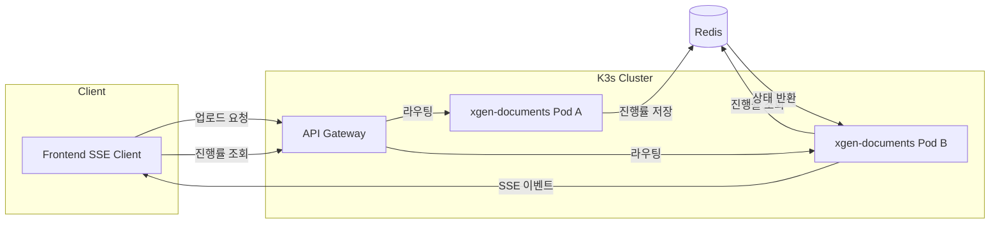
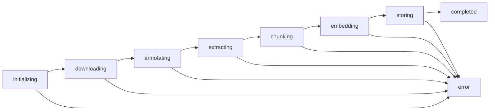
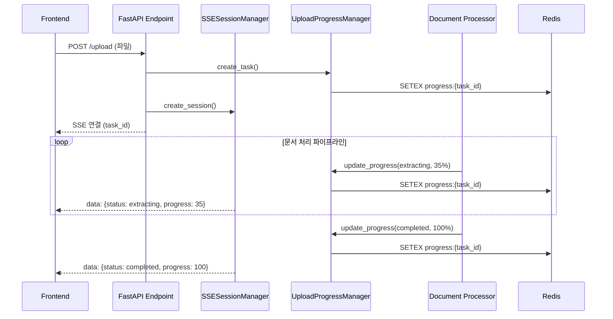

## 배경

XGEN 2.0의 xgen-documents 서비스는 문서 처리 파이프라인을 담당한다. 사용자가 PDF, DOCX, HWP 등의 파일을 업로드하면 텍스트 추출 → 청킹 → 임베딩 → 벡터 저장까지 여러 단계를 거치는데, 이 과정이 파일 크기와 수에 따라 수십 초에서 수 분까지 걸린다.

프론트엔드에서는 SSE(Server-Sent Events)를 통해 이 진행률을 실시간으로 받아서 사용자에게 보여준다. "텍스트 추출 중 (35%)", "임베딩 생성 중 (72%)" 같은 단계별 상태가 UI에 표시되어야 하므로, 백엔드에서는 각 업로드 작업의 진행 상태를 추적하고 관리하는 시스템이 필수다.

처음에는 Python 딕셔너리에 진행 상태를 저장하는 단순한 구조로 시작했다. Pod가 한 개일 때는 문제없었지만, K3s에서 xgen-documents를 멀티 Pod로 스케일 아웃하면서 상태 불일치 문제가 발생했다.

## 문제: 멀티 Pod 상태 불일치

xgen-documents를 2개 이상의 Pod로 운영하면 다음과 같은 상황이 생긴다.

1. 사용자가 Pod A에 파일을 업로드한다
2. Pod A의 메모리에 진행 상태가 저장된다
3. 프론트엔드가 진행률을 폴링하는데, Istio 로드밸런서가 Pod B로 라우팅한다
4. Pod B의 메모리에는 해당 작업 정보가 없다
5. 프론트엔드는 "작업을 찾을 수 없음" 에러를 받는다

```
# 커밋: feat: Optimize memory management in SSE session handling and upload progress tracking
# 날짜: 2026-01-12 02:11
```

이 커밋 시점에서는 메모리 최적화(만료 시간 축소, 큐 크기 제한)만 적용했다. 근본적인 멀티 Pod 문제는 해결하지 못한 상태였다. cleanup 주기를 1시간에서 5분으로 줄이고, 완료된 작업을 1분 후 삭제하고, 이벤트 히스토리 크기를 500에서 300으로 줄이는 등 메모리 관리를 강화했지만, Pod 간 상태 공유라는 근본 문제가 남아 있었다.

## 설계: 듀얼 모드 아키텍처



핵심 설계 원칙은 두 가지다.

**첫째, 듀얼 모드 자동 선택.** `REDIS_HOST` 환경변수가 설정되어 있고 Redis 패키지가 import 가능하면 분산 모드(Redis), 아니면 단독 모드(메모리)로 동작한다. 개발 환경에서는 Redis 없이도 동작하고, K3s 환경에서는 자동으로 Redis를 사용한다.

**둘째, 기존 인터페이스 유지.** `create_task()`, `update_progress()`, `get_progress()` 등의 메서드 시그니처는 그대로 두고, 내부 저장소만 메모리에서 Redis로 교체했다. 호출하는 쪽 코드를 수정할 필요가 없다.

```
# 커밋: feat: UploadProgressManager 분산 환경 지원 (Redis 기반)
# 날짜: 2026-02-04 09:11
```

## UploadProgress 데이터 클래스

진행 상태를 표현하는 데이터 구조다.

```python
# service/retrieval/upload_progress_manager.py
@dataclass
class UploadProgress:
    """업로드 진행 상태"""
    task_id: str
    user_id: int
    collection_name: str
    status: str  # 'initializing', 'downloading', 'annotating', 'extracting',
                 # 'chunking', 'embedding', 'storing', 'completed', 'error'
    progress: float  # 0.0 ~ 100.0
    current_step: str
    total_steps: int
    current_step_number: int
    message: str
    error: Optional[str] = None

    # 세부 정보
    repository_path: Optional[str] = None
    branch: Optional[str] = None
    total_files: int = 0
    processed_files: int = 0
    current_file: Optional[str] = None

    # 실패한 파일 목록
    failed_files: list = field(default_factory=list)

    # 타임스탬프
    created_at: float = field(default_factory=time.time)
    updated_at: float = field(default_factory=time.time)

    # 취소 플래그
    cancelled: bool = False

    def to_dict(self) -> Dict[str, Any]:
        """딕셔너리로 변환"""
        return asdict(self)

    @classmethod
    def from_dict(cls, data: Dict[str, Any]) -> 'UploadProgress':
        """딕셔너리에서 객체 생성"""
        return cls(**data)
```

`status` 필드가 상태 머신의 핵심이다. 문서 처리 파이프라인의 각 단계에 대응한다.

### 상태 머신



각 상태의 의미는 다음과 같다.

| 상태 | 설명 | 진행률 범위 |
|------|------|------------|
| `initializing` | 작업 생성, 준비 | 0% |
| `downloading` | Git 레포 클론 또는 파일 다운로드 | 0~15% |
| `annotating` | OCR, 레이아웃 감지 등 전처리 | 15~30% |
| `extracting` | 텍스트/테이블/이미지 추출 | 30~50% |
| `chunking` | 텍스트 분할 (페이지, 테이블, 의미 단위) | 50~65% |
| `embedding` | 임베딩 벡터 생성 (가장 오래 걸림) | 65~90% |
| `storing` | Qdrant 벡터 DB에 저장 | 90~100% |
| `completed` | 처리 완료 | 100% |
| `error` | 어느 단계에서든 에러 발생 | - |

`total_steps`는 7로 고정되어 있고, `current_step_number`가 0부터 증가하면서 프론트엔드에서 "3/7 단계" 같은 표시를 할 수 있다. `progress`는 0~100 사이의 float으로, 각 단계 내에서도 세밀한 진행률을 표현한다.

`failed_files` 리스트는 파일 단위 에러를 추적한다. 10개 파일 중 2개가 실패하더라도 나머지 8개는 정상 처리되고, 실패한 파일만 별도로 기록된다.

리팩토링 전에는 `failed_files`와 타임스탬프 필드가 `__post_init__`에서 초기화되었는데, `field(default_factory=...)`로 변경했다. `from_dict()`로 Redis에서 역직렬화할 때 `__post_init__`이 다시 호출되면서 값이 덮어써지는 문제가 있었기 때문이다.

## 싱글톤 패턴과 듀얼 모드

```python
class UploadProgressManager:
    """업로드 진행 상태 관리자 (Singleton)

    분산 모드: Redis를 사용하여 멀티 Pod 간 상태 공유
    단독 모드: 메모리 기반으로 단일 인스턴스에서만 동작
    """

    _instance = None
    _lock = Lock()

    def __new__(cls):
        if cls._instance is None:
            with cls._lock:
                if cls._instance is None:
                    cls._instance = super().__new__(cls)
                    cls._instance._initialized = False
        return cls._instance

    def __init__(self):
        if self._initialized:
            return

        # ========== 분산 모드 설정 ==========
        self._distributed_mode = _is_distributed_mode()
        redis_config = _get_redis_config()

        if self._distributed_mode and redis_config:
            logger.info("분산 모드로 UploadProgressManager 초기화 (Redis 사용)")
            self._redis_client = redis.Redis(
                host=redis_config["host"],
                port=redis_config["port"],
                password=redis_config["password"],
                db=redis_config["db"],
                decode_responses=True,
            )
            self._progress_store = None  # Redis 사용 시 메모리 스토어 불필요
        else:
            logger.info("단독 모드로 UploadProgressManager 초기화 (메모리 사용)")
            self._redis_client = None
            self._progress_store: Dict[str, UploadProgress] = {}

        self._store_lock = Lock()
        self._initialized = True
        self._cleanup_interval = 60   # 1분마다 정리
        self._max_task_age = 300      # 5분 후 만료
```

싱글톤은 더블 체크 락킹(double-checked locking)으로 구현했다. `__new__`에서 인스턴스 생성을, `__init__`에서 초기화를 담당하는데, `_initialized` 플래그로 중복 초기화를 방지한다.

분산 모드 판단은 모듈 수준 함수 두 개로 분리했다.

```python
try:
    import redis
    REDIS_AVAILABLE = True
except ImportError:
    REDIS_AVAILABLE = False

def _get_redis_config() -> Optional[Dict[str, Any]]:
    redis_host = os.getenv("REDIS_HOST")
    if not redis_host:
        return None
    return {
        "host": redis_host,
        "port": int(os.getenv("REDIS_PORT", "6379")),
        "password": os.getenv("REDIS_PASSWORD"),
        "db": int(os.getenv("REDIS_DB", "0")),
    }

def _is_distributed_mode() -> bool:
    return REDIS_AVAILABLE and _get_redis_config() is not None
```

`_is_distributed_mode()`는 두 가지 조건을 AND로 평가한다. redis 패키지가 설치되어 있고(`REDIS_AVAILABLE`), `REDIS_HOST` 환경변수가 설정되어 있어야 분산 모드가 활성화된다. 둘 중 하나라도 없으면 메모리 기반 단독 모드로 동작한다.

분산 모드에서 `self._progress_store`를 `None`으로 설정한 이유가 있다. 메모리 딕셔너리를 유지하면 Redis와 메모리 양쪽에 데이터가 중복 저장되어 불일치 문제가 생길 수 있다. 분산 모드에서는 Redis를 유일한 진실의 원천(single source of truth)으로 사용한다.

## Redis 저장 구조

```
# 진행률 데이터 (JSON, TTL 10분)
xgen_documents:upload_progress:{task_id} = JSON(UploadProgress)

# 사용자별 인덱스 (SET, TTL 10분)
xgen_documents:upload_progress:user:{user_id} = SET(task_id1, task_id2, ...)
```

두 종류의 키를 사용한다.

**진행률 데이터 키:** `xgen_documents:upload_progress:{task_id}`에 UploadProgress 객체를 JSON으로 직렬화해서 저장한다. TTL은 600초(10분)이다.

**사용자별 인덱스 키:** `xgen_documents:upload_progress:user:{user_id}`는 Redis SET으로, 해당 사용자의 모든 활성 task_id를 담고 있다. "사용자 A의 현재 진행 중인 작업 목록"을 조회할 때 사용한다.

```python
REDIS_KEY_PREFIX = "xgen_documents:upload_progress"

def _get_redis_key(self, task_id: str) -> str:
    return f"{REDIS_KEY_PREFIX}:{task_id}"

def _get_user_index_key(self, user_id: int) -> str:
    return f"{REDIS_KEY_PREFIX}:user:{user_id}"

def _save_to_redis(self, progress: UploadProgress):
    key = self._get_redis_key(progress.task_id)
    # 10분 TTL 설정 (자동 만료)
    self._redis_client.setex(key, 600, json.dumps(progress.to_dict()))
    # 사용자 인덱스에 추가
    user_key = self._get_user_index_key(progress.user_id)
    self._redis_client.sadd(user_key, progress.task_id)
    self._redis_client.expire(user_key, 600)

def _load_from_redis(self, task_id: str) -> Optional[UploadProgress]:
    key = self._get_redis_key(task_id)
    data = self._redis_client.get(key)
    if data:
        return UploadProgress.from_dict(json.loads(data))
    return None
```

`_save_to_redis()`에서 `setex`를 쓰는 이유가 있다. `set` + `expire`를 별도로 호출하면 두 명령 사이에 프로세스가 죽을 경우 TTL이 설정되지 않은 키가 남을 수 있다. `setex`는 원자적(atomic)으로 값 설정과 TTL 설정을 동시에 수행한다.

사용자 인덱스에도 `expire`를 건다. 사용자가 더 이상 업로드를 하지 않으면 인덱스 SET도 10분 후 자동 삭제된다. 다만 새 작업이 추가될 때마다 TTL이 갱신되므로 활성 사용자의 인덱스는 유지된다.

### 사용자별 인덱스가 필요한 이유

프론트엔드에서 "현재 진행 중인 내 업로드 목록"을 표시해야 한다. task_id 하나만 조회하는 게 아니라, 사용자의 모든 활성 작업을 가져와야 한다.

Redis에서 키 패턴 검색(`KEYS xgen_documents:upload_progress:*`)은 O(N)이고, 프로덕션에서 사용하면 안 된다. 대신 사용자별 SET 인덱스를 만들어 O(1)에 task_id 목록을 가져오고, 각 task_id로 O(1) 조회를 하는 구조다.

```python
def get_user_tasks(self, user_id: int) -> list:
    if self._distributed_mode:
        user_key = self._get_user_index_key(user_id)
        task_ids = self._redis_client.smembers(user_key)
        tasks = []
        for task_id in task_ids:
            progress_obj = self._load_from_redis(task_id)
            if progress_obj:
                tasks.append(progress_obj.to_dict())
        return tasks
    else:
        with self._store_lock:
            return [
                progress.to_dict()
                for progress in self._progress_store.values()
                if progress.user_id == user_id
            ]
```

분산 모드에서는 SET에서 task_id를 가져온 뒤 각각 `_load_from_redis()`로 조회한다. 단독 모드에서는 메모리 딕셔너리를 순회하면서 `user_id`로 필터링한다.

한 가지 엣지 케이스가 있다. 진행률 데이터 키가 TTL로 만료되었는데 사용자 인덱스 SET에는 task_id가 남아 있는 경우다. `_load_from_redis()`가 `None`을 반환하면 해당 task_id는 결과에서 제외된다. SET의 불필요한 항목은 다음 요청 때 자연스럽게 걸러진다. 명시적으로 SET에서 제거하지 않은 건 Redis TTL이 결국 SET 자체를 만료시키기 때문이다.

## 핵심 메서드: 작업 생성과 업데이트

### create_task

```python
def create_task(
    self,
    user_id: int,
    collection_name: str,
    repository_path: Optional[str] = None,
    branch: Optional[str] = None
) -> str:
    task_id = str(uuid.uuid4())

    progress = UploadProgress(
        task_id=task_id,
        user_id=user_id,
        collection_name=collection_name,
        status='initializing',
        progress=0.0,
        current_step='Initializing upload...',
        total_steps=7,
        current_step_number=0,
        message='Upload task created',
        repository_path=repository_path,
        branch=branch
    )

    if self._distributed_mode:
        self._save_to_redis(progress)
    else:
        with self._store_lock:
            self._progress_store[task_id] = progress

    logger.info(f"Created upload task: {task_id} for user {user_id}")
    return task_id
```

`create_task()`가 반환하는 `task_id`는 UUID v4다. 프론트엔드가 이 ID로 SSE 연결을 맺고, 이후 모든 상태 조회와 취소 요청에 이 ID를 사용한다.

`total_steps`가 7로 고정된 이유는 파이프라인 단계 수가 코드 레벨에서 결정되기 때문이다: initializing, downloading, annotating, extracting, chunking, embedding, storing. 파이프라인 단계를 동적으로 변경할 일은 없고, 프론트엔드에서 진행률 바의 세그먼트 수를 미리 알아야 하므로 고정값으로 충분하다.

### update_progress

```python
def update_progress(
    self,
    task_id: str,
    status: Optional[str] = None,
    progress: Optional[float] = None,
    current_step: Optional[str] = None,
    current_step_number: Optional[int] = None,
    message: Optional[str] = None,
    total_files: Optional[int] = None,
    processed_files: Optional[int] = None,
    current_file: Optional[str] = None,
    error: Optional[str] = None,
    failed_files: Optional[list] = None
):
    if self._distributed_mode:
        progress_obj = self._load_from_redis(task_id)
        if progress_obj is None:
            logger.warning(f"Task {task_id} not found in Redis")
            return

        if status is not None:
            progress_obj.status = status
        if progress is not None:
            progress_obj.progress = min(100.0, max(0.0, progress))
        if current_step is not None:
            progress_obj.current_step = current_step
        # ... 나머지 필드 업데이트 ...
        if error is not None:
            progress_obj.error = error
            progress_obj.status = 'error'

        progress_obj.updated_at = time.time()
        self._save_to_redis(progress_obj)
    else:
        with self._store_lock:
            if task_id not in self._progress_store:
                return
            progress_obj = self._progress_store[task_id]
            # ... 동일한 업데이트 로직 ...
            progress_obj.updated_at = time.time()
```

`update_progress()`의 모든 파라미터가 `Optional`인 이유가 있다. 문서 처리 파이프라인의 각 단계에서 업데이트하고 싶은 필드가 다르다. 텍스트 추출 단계에서는 `status`와 `progress`만, 파일 처리 루프에서는 `processed_files`와 `current_file`만 업데이트한다.

`progress` 값은 `min(100.0, max(0.0, progress))`로 클램핑한다. 부동소수점 연산 과정에서 100.1이나 -0.001 같은 값이 들어올 수 있기 때문이다.

`error`가 설정되면 자동으로 `status`를 `'error'`로 변경한다. 에러 상태 전환을 호출자가 잊어버리는 실수를 방지한다.

분산 모드에서는 Read-Modify-Write 패턴이다. Redis에서 로드하고, 메모리에서 수정하고, 다시 Redis에 저장한다. 이 과정이 원자적이지 않아서 동시에 같은 task_id를 업데이트하면 데이터가 유실될 수 있다. 그러나 하나의 업로드 작업은 하나의 처리 스레드에서만 업데이트하므로 실제로 충돌이 발생하지 않는다.

## Thread Safety

```python
def __init__(self):
    # ...
    self._store_lock = Lock()
```

단독 모드에서는 `threading.Lock()`으로 딕셔너리 접근을 보호한다. FastAPI가 uvicorn 위에서 동작하고, 백그라운드 태스크가 별도 스레드에서 실행되므로 동시 접근이 발생한다.

분산 모드에서는 `_store_lock`을 사용하지 않는다. Redis 자체가 단일 스레드로 명령을 처리하므로 `GET`/`SETEX` 수준의 원자성은 보장된다. 다만 앞서 언급한 Read-Modify-Write 패턴에서의 경합은 애플리케이션 레벨 문제인데, 업로드 작업의 특성상 문제가 되지 않는다.

한 가지 설계 결정이 있었다. 분산 모드에서도 로컬 캐시를 둘까? Redis에서 매번 읽는 것보다 로컬에 캐시하면 빠르겠지만, 캐시 무효화 문제가 생긴다. 다른 Pod에서 업데이트한 상태를 로컬 캐시가 모를 수 있다. 결국 "진행률 조회의 지연 시간보다 데이터 일관성이 중요하다"고 판단해서, 분산 모드에서는 항상 Redis에서 직접 읽도록 했다. Redis가 같은 네트워크에 있으므로 조회 지연은 1ms 이하다.

## 작업 취소

```python
def cancel_task(self, task_id: str) -> bool:
    if self._distributed_mode:
        progress_obj = self._load_from_redis(task_id)
        if progress_obj is None:
            logger.warning(f"Task {task_id} not found for cancellation")
            return False

        if progress_obj.status in ['completed', 'error']:
            logger.warning(f"Cannot cancel task {task_id} with status: {progress_obj.status}")
            return False

        progress_obj.cancelled = True
        progress_obj.status = 'error'
        progress_obj.error = 'Upload cancelled by user'
        progress_obj.updated_at = time.time()
        self._save_to_redis(progress_obj)
        return True
    else:
        # 단독 모드: 동일한 로직 (self._store_lock 사용)
        ...
```

취소는 `cancelled` 플래그를 `True`로 설정하고 `status`를 `'error'`로 변경한다. 문서 처리 루프에서는 각 단계 시작 전에 `is_cancelled()`를 확인하고, `True`이면 처리를 중단한다.

```python
def is_cancelled(self, task_id: str) -> bool:
    if self._distributed_mode:
        progress_obj = self._load_from_redis(task_id)
        if progress_obj is None:
            return False
        return progress_obj.cancelled
    else:
        with self._store_lock:
            if task_id not in self._progress_store:
                return False
            return self._progress_store[task_id].cancelled
```

이미 `completed`이거나 `error` 상태인 작업은 취소할 수 없다. 완료된 작업을 취소하면 이미 벡터 DB에 저장된 데이터와 불일치가 생기고, 에러 상태의 작업은 이미 중단된 것이므로 취소할 것이 없다.

## 자동 정리

메모리 누수를 방지하기 위한 자동 정리 메커니즘이 있다.

```python
def cleanup_old_tasks(self, max_age_seconds: int = None):
    """오래된 작업 정리 (기본 5분 - 메모리 최적화)"""
    if max_age_seconds is None:
        max_age_seconds = self._max_task_age

    if self._distributed_mode:
        # Redis TTL이 자동으로 만료 처리
        logger.debug("분산 모드: Redis TTL이 자동으로 만료 처리")
        return 0

    # 단독 모드: 메모리에서 정리
    current_time = time.time()
    with self._store_lock:
        tasks_to_delete = []
        for task_id, progress in self._progress_store.items():
            age = current_time - progress.created_at
            # 완료/에러 상태 작업은 1분 후 정리
            if progress.status in ['completed', 'error']:
                if age > 60:
                    tasks_to_delete.append(task_id)
            elif age > max_age_seconds:
                tasks_to_delete.append(task_id)

        for task_id in tasks_to_delete:
            del self._progress_store[task_id]

    return len(tasks_to_delete)
```

정리 정책은 두 가지 규칙을 따른다.

**규칙 1: 완료/에러 작업은 1분 후 삭제.** 프론트엔드가 최종 상태(completed/error)를 받았으면 더 이상 조회할 이유가 없다. 1분의 여유를 두는 건 SSE 이벤트 전달 지연이나 재연결 시 마지막 상태를 한 번 더 조회할 수 있도록 하기 위해서다.

**규칙 2: 활성 작업은 5분 후 만료.** 정상적인 문서 처리가 5분 이상 걸리는 경우는 드물다. 5분이 지났는데 `completed`나 `error`가 아니면 비정상 상태(Pod 재시작, 프로세스 크래시 등)로 판단하고 삭제한다.

분산 모드에서는 `cleanup_old_tasks()`가 아무것도 하지 않는다. Redis TTL(600초 = 10분)이 자동으로 만료 처리한다. `_save_to_redis()`에서 매번 `setex`로 TTL을 갱신하므로, 업데이트가 계속 되는 활성 작업은 만료되지 않고, 업데이트가 멈춘 비정상 작업은 10분 후 사라진다.

초기 구현(2026-01-12)에서는 만료 시간이 1시간이었다. 문서 수백 개를 한 번에 처리하면 메모리에 진행 상태 객체가 쌓여서 Pod 메모리 사용량이 올라갔다. 5분으로 줄이고, 완료 작업은 1분으로 더 공격적으로 정리하면서 문제가 해결됐다.

```python
def cleanup_completed_tasks(self):
    """완료된 작업 즉시 정리"""
    if self._distributed_mode:
        return 0

    with self._store_lock:
        tasks_to_delete = [
            task_id for task_id, progress in self._progress_store.items()
            if progress.status in ['completed', 'error']
        ]
        for task_id in tasks_to_delete:
            del self._progress_store[task_id]

    return len(tasks_to_delete)
```

`cleanup_completed_tasks()`는 SSE 세션이 완료 이벤트를 전송한 직후에 호출된다. `cleanup_old_tasks()`가 주기적 정리라면, 이 메서드는 즉시 정리다.

## 작업 삭제와 인덱스 정리

```python
def delete_task(self, task_id: str):
    if self._distributed_mode:
        key = self._get_redis_key(task_id)
        # 사용자 인덱스에서도 제거
        progress_obj = self._load_from_redis(task_id)
        if progress_obj:
            user_key = self._get_user_index_key(progress_obj.user_id)
            self._redis_client.srem(user_key, task_id)
        self._redis_client.delete(key)
    else:
        with self._store_lock:
            if task_id in self._progress_store:
                del self._progress_store[task_id]
```

분산 모드에서 `delete_task()`는 두 곳을 정리한다. 진행률 데이터 키와 사용자 인덱스 SET에서 해당 task_id를 제거한다. `srem`은 SET에서 특정 멤버를 제거하는 Redis 명령이다.

진행률 데이터를 먼저 로드해서 `user_id`를 알아낸 뒤 인덱스에서 제거하는 순서가 중요하다. 데이터를 먼저 삭제하면 `user_id`를 알 수 없어서 인덱스에 고아 항목이 남는다.

## 디버깅용 통계

```python
def get_stats(self) -> Dict[str, Any]:
    if self._distributed_mode:
        pattern = f"{REDIS_KEY_PREFIX}:*"
        keys = [k for k in self._redis_client.keys(pattern) if ":user:" not in k]
        status_counts = {}
        for key in keys:
            data = self._redis_client.get(key)
            if data:
                progress_dict = json.loads(data)
                status = progress_dict.get("status", "unknown")
                status_counts[status] = status_counts.get(status, 0) + 1

        return {
            "total_tasks": len(keys),
            "status_counts": status_counts,
            "mode": "distributed"
        }
    else:
        with self._store_lock:
            status_counts = {}
            for progress in self._progress_store.values():
                status_counts[progress.status] = status_counts.get(progress.status, 0) + 1
            return {
                "total_tasks": len(self._progress_store),
                "status_counts": status_counts,
                "mode": "standalone"
            }
```

`get_stats()`는 운영 중 현재 상태를 확인하는 디버깅 도구다. 분산 모드에서는 `KEYS` 명령을 사용하는데, 프로덕션에서 `KEYS`는 피해야 한다고 했다. 맞다. 이 메서드는 디버깅 엔드포인트에서만 호출되고, 진행률 키의 수가 많아봐야 수십 개이므로 허용 범위다. 그래도 `SCAN`으로 바꾸는 게 더 안전하긴 하다.

`":user:"`를 필터링하는 이유는 사용자 인덱스 키가 같은 프리픽스를 공유하기 때문이다. `xgen_documents:upload_progress:user:42` 같은 키가 진행률 데이터 키로 잘못 카운트되지 않도록 제외한다.

## SSE 세션과의 연동

UploadProgressManager는 단독으로 동작하지 않는다. SSE 세션 관리자(SSESessionManager)와 함께 동작하면서, 프론트엔드에 실시간 이벤트를 전달한다.



SSE 세션은 `asyncio.Queue`를 통해 이벤트를 프론트엔드에 전달하고, UploadProgressManager는 진행률 상태를 저장/조회하는 역할을 한다. 두 시스템은 `task_id`로 연결된다.

SSE 세션 매니저에도 비슷한 시기에 Redis 기반 상태 공유가 적용되었다. `redis_session_backend.py`가 그 구현인데, UploadProgressManager와 달리 `redis.asyncio`(비동기 Redis 클라이언트)를 사용한다. SSE 세션 매니저가 FastAPI의 async 컨텍스트에서 동작하기 때문이다. UploadProgressManager는 백그라운드 스레드에서도 호출되므로 동기 Redis 클라이언트를 사용한다.

## 트러블슈팅

### Redis 연결 실패 시 Graceful Fallback

Redis가 다운되거나 연결이 끊어지면 진행률 업데이트가 실패한다. 현재 구현에서는 `_load_from_redis()`가 `None`을 반환하고, `update_progress()`가 경고 로그를 남기고 조용히 넘어간다.

이 동작이 의도적이다. 진행률 표시가 실패한다고 문서 처리 자체가 중단되면 안 된다. 사용자 입장에서는 진행률 바가 멈추는 것뿐이고, 실제 처리는 계속 진행된다. 처리가 완료되면 벡터 DB에 데이터가 정상 저장되고, 프론트엔드에서 컬렉션 목록을 새로고침하면 결과를 확인할 수 있다.

같은 프로젝트의 `redis_session_backend.py`에서는 이 패턴을 더 정교하게 구현했다. Circuit breaker를 적용해서 연속 실패 3회 이후에는 60초간 Redis 연결 시도를 건너뛰고, 인증 오류 같은 영구적 오류가 감지되면 Redis를 완전히 비활성화한다.

```python
# redis_session_backend.py의 circuit breaker 패턴
class RedisSessionBackend:
    def _is_permanent_error(self, error: Exception) -> bool:
        err_str = str(error).lower()
        permanent = ['authentication required', 'invalid password', 'wrongpass', 'noauth']
        return any(p in err_str for p in permanent)

    def _should_skip(self) -> bool:
        if self._disabled:
            return True
        if self._consecutive_failures >= MAX_CONSECUTIVE_FAILURES:
            elapsed = time.time() - self._last_failure_time
            if elapsed < REDIS_RETRY_INTERVAL:
                return True
            self._consecutive_failures = 0  # 재시도 허용
        return False
```

UploadProgressManager에도 이 circuit breaker 패턴을 적용하는 것을 검토했지만, 당장은 적용하지 않았다. 이유는 두 가지다. 첫째, UploadProgressManager는 Redis 연결이 초기화 시점에 한 번 만들어지고, Redis가 K3s 내부 네트워크에 있어서 연결 자체가 끊어지는 경우가 드물다. 둘째, circuit breaker를 넣으면 "Redis 복구 후 자동 재연결" 로직까지 필요한데, 복잡도 대비 이득이 적었다.

### 메모리 누수 방지 (2026-01-12 최적화)

Redis 기반 분산 모드 이전에, 메모리 기반 단독 모드에서 발생한 메모리 누수 문제를 해결했다.

**문제 1: 이벤트 큐 무한 증가.** SSE 세션의 `asyncio.Queue`에 maxsize가 없어서, 클라이언트 연결이 끊어진 채로 처리가 계속되면 이벤트가 무한히 쌓였다. `maxsize=1000`으로 제한하고, 큐가 가득 차면 가장 오래된 이벤트를 제거하는 방식으로 수정했다.

```python
# 수정 전
self.progress_queue = asyncio.Queue()

# 수정 후
self.progress_queue = asyncio.Queue(maxsize=1000)

# 큐가 가득 찬 경우
try:
    self.progress_queue.put_nowait(event_data)
except asyncio.QueueFull:
    try:
        self.progress_queue.get_nowait()  # 가장 오래된 이벤트 제거
        self.progress_queue.put_nowait(event_data)
    except (asyncio.QueueEmpty, asyncio.QueueFull):
        logger.warning(f"Session {self.session_id}: Event queue full")
```

**문제 2: 완료 세션 잔류.** 완료된 세션의 유지 시간이 10분이었다. 대량 파일 업로드 시 완료된 세션 수십 개가 각각 이벤트 히스토리(deque, maxlen=500)를 갖고 있어서 메모리를 점유했다. 유지 시간을 1분으로 줄이고, 이벤트 히스토리도 300개로 축소했다.

**문제 3: 진행률 객체 잔류.** `_progress_store` 딕셔너리에 완료된 작업이 1시간 동안 남아 있었다. 5분으로 줄이고, 완료 작업은 1분 후 삭제하도록 변경했다.

이 세 가지 수정으로 메모리 사용량이 안정화되었고, 이후 Redis 기반 분산 모드에서는 메모리 스토어 자체를 사용하지 않으므로 이 문제가 근본적으로 해결되었다.

### 동기 vs 비동기 Redis 클라이언트

UploadProgressManager는 `redis.Redis`(동기), SSE 세션 백엔드는 `redis.asyncio.Redis`(비동기)를 사용한다. 둘 다 Redis에 접근하는데 왜 다른 클라이언트를 쓸까?

UploadProgressManager는 문서 처리 파이프라인에서 호출된다. 문서 처리는 CPU 바운드 작업(텍스트 추출, 청킹)과 I/O 바운드 작업(임베딩 API 호출)이 혼재되어 있고, 일부는 `threading`으로 병렬 처리한다. 이 스레드 컨텍스트에서 `await`를 쓸 수 없으므로 동기 Redis 클라이언트가 필요하다.

SSE 세션 백엔드는 FastAPI의 async 엔드포인트에서 호출된다. async 컨텍스트에서 동기 Redis 클라이언트를 쓰면 이벤트 루프가 블로킹되어 모든 SSE 연결이 멈춘다. 그래서 `redis.asyncio`를 사용한다.

## 같은 패턴의 확장: Repository Scheduler

UploadProgressManager와 동일한 듀얼 모드 패턴이 레포지토리 스케줄러(`repository_scheduler.py`)에도 적용되었다. 같은 날(2026-02-04) 바로 전 커밋이다.

```
# 커밋: feat: 레포지토리 스케줄러 분산 환경 지원 (Redis 기반)
# 날짜: 2026-02-04 09:04
```

스케줄러에서는 APScheduler의 JobStore를 Redis로 교체해서 멀티 Pod 환경에서 중복 실행을 방지한다. `_get_redis_config()`와 `_is_distributed_mode()` 함수 구조가 UploadProgressManager와 동일하다. 의도적으로 같은 패턴을 반복해서 코드 일관성을 유지했다.

```python
# repository_scheduler.py - 분산 모드
if self._distributed_mode and redis_config:
    jobstores = {
        'default': RedisJobStore(
            host=redis_config["host"],
            port=redis_config["port"],
            password=redis_config["password"],
            db=redis_config["db"],
            jobs_key=f'{REDIS_KEY_PREFIX}:jobs',
            run_times_key=f'{REDIS_KEY_PREFIX}:run_times',
        )
    }
```

xgen-documents 서비스 내에서 Redis를 활용하는 세 가지 컴포넌트가 같은 패턴으로 동작한다: UploadProgressManager(진행률), SSESessionManager(세션 상태), RepositoryScheduler(스케줄링). 모두 `REDIS_HOST` 환경변수 하나로 분산 모드가 활성화되고, 없으면 로컬 모드로 동작한다.

## 결과

단일 Pod 메모리 기반에서 Redis 기반 분산 진행률 관리로 전환하면서, 멀티 Pod 환경에서 파일 업로드 진행률이 정상적으로 동작하게 되었다.

**변경 전 (2026-01-12 이전):**

- 단일 Pod 메모리 기반, 만료 1시간
- 멀티 Pod에서 상태 불일치
- 메모리 누수 위험 (완료 작업 잔류, 무한 큐)

**1차 개선 (2026-01-12):**

- 만료 시간 1시간 → 5분, 완료 작업 1분 후 삭제
- 이벤트 큐 maxsize=1000 제한
- 이벤트 히스토리 500 → 300 축소
- 여전히 단일 Pod에서만 동작

**2차 개선 (2026-02-04):**

- Redis 기반 분산 모드 추가
- 듀얼 모드 자동 선택 (Redis 가용 시 분산, 미가용 시 메모리)
- 사용자별 인덱스 SET으로 효율적 조회
- Redis TTL 10분으로 자동 만료
- 기존 인터페이스 유지 (호출 코드 변경 불필요)

핵심은 "환경변수 하나로 모드가 전환되는" 설계다. 개발자 로컬에서는 Redis 없이 돌리고, K3s에 배포하면 자동으로 분산 모드가 활성화된다. 코드를 분기하거나 설정 파일을 따로 관리할 필요가 없다.
