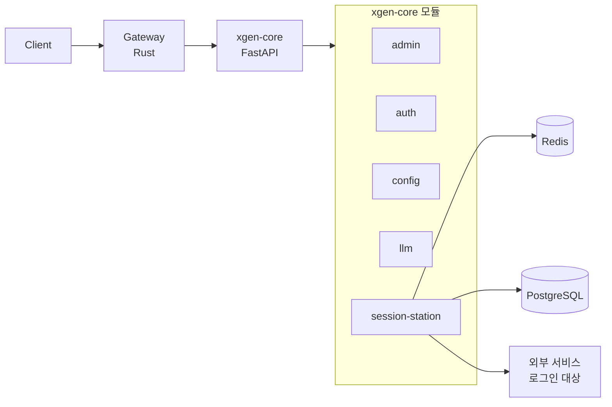
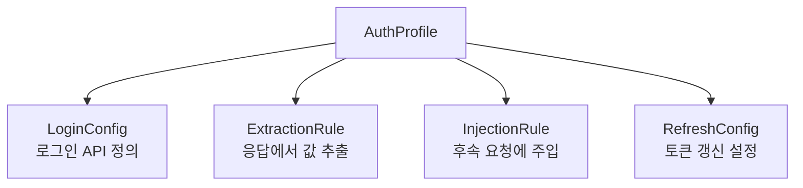
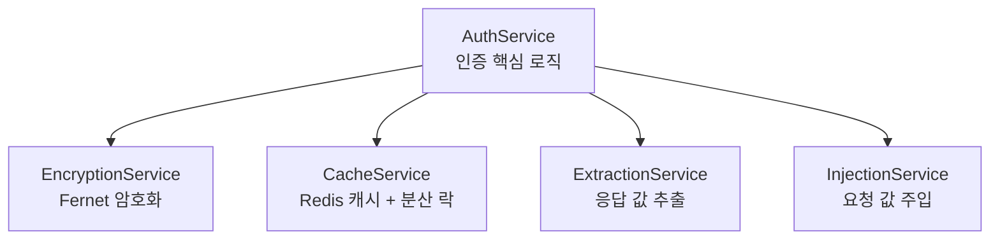
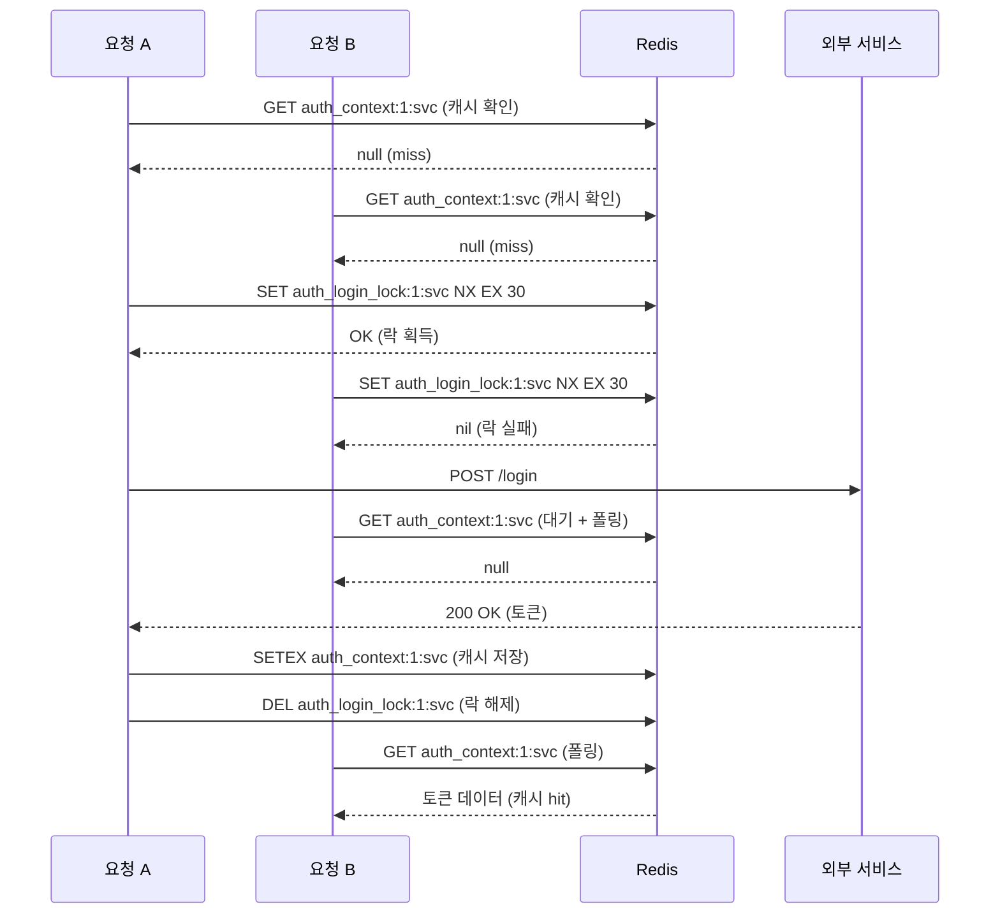
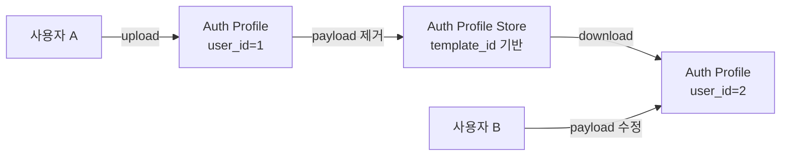

## 배경: session-station은 왜 독립 서비스였나

XGEN 2.0 플랫폼에서 AI Agent가 외부 서비스(고객사 API, 사내 시스템 등)에 접근할 때, 인증이 필수적이다. Agent가 대상 서비스에 로그인하고, 토큰이나 쿠키를 추출해서, 후속 요청에 자동으로 주입하는 과정 전체를 자동화해야 했다.

처음에는 이 기능을 `xgen-session-station`이라는 독립 서비스로 구현했다. 이유는 단순했다. 인증 프록시 로직이 다른 서비스와 성격이 달랐고, 독립적으로 스케일링할 수 있어야 한다고 판단했기 때문이다. 외부 서비스 로그인은 네트워크 I/O가 많고 타임아웃이 길어질 수 있어서, xgen-core에 묶으면 다른 API에 영향을 줄 수 있다는 우려도 있었다.

독립 서비스 구조는 이랬다:

```
Client → Gateway → xgen-session-station:8000 → 외부 서비스 로그인
                 → xgen-core:8000 → 일반 API
```

xgen-session-station은 별도의 FastAPI 서비스로, 자체 Dockerfile과 K3s Deployment를 갖고 있었다. Gateway의 `services.yaml`에서 `session-station` 모듈을 별도 호스트로 라우팅했다.

```yaml
# 커밋: feat: session station 추가
# 날짜: 2026-02-06 16:02
# Gateway services.yaml (초기 구성)
session-station-service:
  host: http://xgen-session-station:8000
  modules:
    - session-station
```

## 문제: 서비스 분리의 운영 오버헤드

4일 정도 운영하면서 문제가 명확해졌다.

첫째, 배포 파이프라인이 하나 더 늘었다. Jenkins에 xgen-session-station 빌드 Job을 추가하고, ArgoCD에 Helm chart를 등록하고, K3s에 Deployment/Service/ConfigMap을 만들어야 했다. XGEN 2.0은 이미 xgen-core, xgen-workflow, xgen-documents, xgen-model, xgen-backend-gateway, xgen-frontend 등 6개 이상의 서비스를 운영하고 있었다. 서비스 하나가 늘어날 때마다 인프라 관리 비용이 선형적으로 증가한다.

둘째, session-station은 xgen-core의 DB 모델과 설정 시스템을 공유해야 했다. 인증 프로파일은 PostgreSQL에 저장하는데, xgen-core의 `AppDatabaseManager`(psycopg3 기반)를 그대로 쓰고 싶었다. 독립 서비스로 가면 DB 접속 설정을 중복으로 관리하거나, 별도의 DB 추상화 레이어를 만들어야 했다.

셋째, Gateway에서 session-station으로의 네트워크 홉이 하나 더 생겼다. K3s 클러스터 내부라 레이턴시 자체는 미미하지만, 서비스 디스커버리 실패나 Pod 재시작 시 일시적 503 에러가 발생할 수 있는 지점이 늘어났다.

결론은 명확했다. session-station의 트래픽 규모나 독립 스케일링 필요성이 별도 서비스를 정당화할 수준이 아니었다. xgen-core에 모듈로 통합하는 것이 맞았다.

## 설계: 통합 아키텍처



통합 후 Gateway의 `services.yaml`에서 session-station은 xgen-core의 모듈 목록에 포함된다. 별도의 서비스 엔트리가 사라졌다.

```yaml
# 커밋: refactor: session-station 라우팅을 xgen-core로 통합
# 날짜: 2026-02-10 14:26
services:
  xgen-core:
    host: http://xgen-core:8000
    modules:
      - admin
      - auth
      - config
      - llm
      - session-station   # 추가
```

Gateway는 URL의 첫 번째 경로 세그먼트(모듈명)를 보고 대상 서비스를 결정한다. `/api/session-station/v1/auth-profiles`로 요청이 오면 `session-station` 모듈을 찾아서 `http://xgen-core:8000`으로 프록시한다. 기존에는 `http://xgen-session-station:8000`으로 갔지만, 이제 xgen-core가 직접 처리한다.

## 인증 프로파일 시스템 설계

session-station의 핵심은 인증 프로파일(Auth Profile) 시스템이다. 외부 서비스에 로그인하는 방법을 선언적으로 정의하고, 런타임에 자동으로 실행하는 구조다.

### 데이터 모델

인증 프로파일은 4개의 핵심 구성 요소로 이루어진다.



PostgreSQL 스키마는 다음과 같다.

```python
# 커밋: feat: 인증 모델 추가
# 날짜: 2026-02-09 00:53
class AuthProfile(BaseModel):
    def get_table_name(self) -> str:
        return "auth_profiles"

    def get_schema(self) -> Dict[str, str]:
        return {
            'user_id': 'INTEGER NOT NULL',
            'service_id': 'VARCHAR(100) NOT NULL',
            'name': 'VARCHAR(200) NOT NULL',
            'description': 'TEXT',
            'auth_type': 'VARCHAR(50) NOT NULL',
            'login_config': 'JSON NOT NULL',
            'extraction_rules': 'JSON NOT NULL',
            'injection_rules': 'JSON NOT NULL',
            'refresh_config': 'JSON',
            'ttl': 'INTEGER DEFAULT 3600',
            'refresh_before_expire': 'INTEGER DEFAULT 300',
            'status': 'VARCHAR(20) DEFAULT \'active\'',
            'last_refresh': 'TIMESTAMP WITH TIME ZONE',
            'last_error': 'TEXT',
            'created_by': 'VARCHAR(100)',
        }
```

`user_id`와 `service_id`의 조합이 유니크 키다. 같은 사용자가 같은 외부 서비스에 대해 하나의 프로파일만 가질 수 있다. `login_config`, `extraction_rules`, `injection_rules`는 JSON 컬럼으로 저장한다. 구조화된 설정을 유연하게 저장하기 위함이다.

### LoginConfig: 로그인 방법 정의

```python
class LoginConfigSchema(BaseModel):
    url: str = Field(..., description="로그인 API URL")
    method: str = Field(default="POST", description="HTTP 메서드")
    headers: Dict[str, str] = Field(default_factory=dict)
    payload: Dict[str, Any] = Field(default_factory=dict)
    timeout: int = Field(default=30)
```

`LoginConfig`는 외부 서비스의 로그인 엔드포인트를 정의한다. URL, HTTP 메서드, 헤더, 페이로드(아이디/비밀번호 등), 타임아웃을 포함한다. 대부분의 REST API 로그인은 POST 요청에 JSON body로 credentials를 보내는 패턴이므로, 이 구조로 대부분의 케이스를 커버할 수 있다.

중요한 점은 payload에 포함된 비밀번호 같은 민감 정보는 Fernet 암호화를 적용해서 DB에 저장한다는 것이다.

### ExtractionRule: 응답에서 값 추출

```python
class ExtractionRuleSchema(BaseModel):
    name: str = Field(..., description="추출할 값의 이름")
    source: str = Field(..., description="추출 소스: body, header, cookie, fixed")
    key_path: Optional[str] = None
    value: Optional[str] = None
```

로그인 응답에서 필요한 값을 추출하는 규칙이다. `source`가 `body`이면 JSON 응답의 `key_path` (JSONPath 형식, 예: `data.token`)에서 값을 가져온다. `header`이면 응답 헤더에서, `cookie`이면 Set-Cookie에서 추출한다. `fixed`는 고정값을 사용하는 경우다.

예를 들어 로그인 응답이 `{"data": {"access_token": "abc123", "refresh_token": "def456"}}`이면:

```json
[
  {"name": "access_token", "source": "body", "key_path": "data.access_token"},
  {"name": "refresh_token", "source": "body", "key_path": "data.refresh_token"}
]
```

### InjectionRule: 후속 요청에 주입

```python
class InjectionRuleSchema(BaseModel):
    source_field: str = Field(..., description="컨텍스트에서 가져올 필드명")
    target: str = Field(..., description="주입 대상: header, cookie, query, body")
    key: str = Field(..., description="주입할 키 이름")
    value_template: str = Field(..., description="값 템플릿 (예: Bearer {access_token})")
    required: bool = Field(default=False)
```

추출된 값을 후속 요청에 어떻게 주입할지 정의한다. `source_field`는 ExtractionRule에서 추출한 값의 `name`을 참조한다. `value_template`은 Python의 `str.format()` 문법을 사용한다. 예를 들어 `Bearer {access_token}`이면 추출된 `access_token` 값이 치환된다.

```json
[
  {
    "source_field": "access_token",
    "target": "header",
    "key": "Authorization",
    "value_template": "Bearer {access_token}",
    "required": true
  }
]
```

### RefreshConfig: 토큰 갱신

```python
class RefreshConfigSchema(BaseModel):
    enabled: bool = Field(default=False)
    refresh_token_field: str = Field(default="refresh_token")
    url: Optional[str] = None
    method: str = Field(default="POST")
    headers: Dict[str, str] = Field(default_factory=dict)
    payload: Dict[str, Any] = Field(default_factory=dict)
    timeout: int = Field(default=30)
```

Access Token이 만료되기 전에 Refresh Token으로 갱신하는 설정이다. `refresh_before_expire` 초 전에 갱신을 시도한다. 기본값은 300초(5분)이다.

이 4가지 구성 요소를 조합하면, 대부분의 인증 방식(Bearer Token, Cookie 세션, API Key, OAuth2)을 선언적으로 정의할 수 있다.

## 핵심 구현: AuthService 아키텍처

session-station의 비즈니스 로직은 4개의 서비스 클래스로 분리했다.



### EncryptionService: Fernet 기반 암호화

인증 프로파일의 `login_config.payload`에는 비밀번호, API Key 같은 민감 정보가 포함된다. 이 값들을 평문으로 DB에 저장하면 보안 사고 시 피해가 크다. Fernet 대칭키 암호화를 적용했다.

```python
# 커밋: feat: xgen-session-station을 xgen-core에 통합
# 날짜: 2026-02-10 14:07
class EncryptionService:
    def __init__(self, encryption_key: str):
        if encryption_key:
            self.fernet = Fernet(encryption_key.encode())
            self.enabled = True
        else:
            self.fernet = None
            self.enabled = False

    def encrypt_value(self, value: str) -> str:
        if not self.enabled:
            return value
        encrypted = self.fernet.encrypt(value.encode())
        return f"ENC({encrypted.decode()})"

    def decrypt_value(self, encrypted_value: str) -> str:
        if not encrypted_value.startswith("ENC(") or not encrypted_value.endswith(")"):
            return encrypted_value
        if not self.enabled:
            return encrypted_value
        encrypted_str = encrypted_value[4:-1]
        decrypted = self.fernet.decrypt(encrypted_str.encode())
        return decrypted.decode()

    def encrypt_login_config(self, login_config: dict) -> dict:
        if not self.enabled:
            return login_config
        result = dict(login_config)
        sensitive_keys = ["password", "client_secret", "api_key", "secret", "token"]
        if "payload" in result and isinstance(result["payload"], dict):
            for key in sensitive_keys:
                if key in result["payload"] and result["payload"][key]:
                    value = result["payload"][key]
                    if not value.startswith("ENC("):
                        result["payload"][key] = self.encrypt_value(value)
        return result
```

`ENC(...)` 접두어로 이미 암호화된 값을 식별한다. 프로파일 업데이트 시 이중 암호화를 방지하기 위함이다. `sensitive_keys` 리스트에 있는 키만 암호화 대상이다. payload 전체를 암호화하면 디버깅이 불가능해지기 때문에, 민감한 필드만 선택적으로 처리한다.

암호화 키는 xgen-core의 ConfigComposer를 통해 가져온다. 이 부분에서 통합 과정의 트러블슈팅이 하나 발생했는데, 뒤에서 다룬다.

### CacheService: Redis 기반 세션 캐시

외부 서비스에 매번 로그인하면 느리고, 대상 서비스에 부담을 준다. 로그인 결과(추출된 토큰/쿠키)를 Redis에 캐시한다.

```python
class CacheService:
    def __init__(self, redis_manager):
        self.redis = redis_manager

    def _build_key(self, user_id: int, service_id: str) -> str:
        return f"auth_context:{user_id}:{service_id}"

    def get_auth_context(self, user_id: int, service_id: str) -> Optional[Dict[str, Any]]:
        key = self._build_key(user_id, service_id)
        try:
            data = self.redis.redis_client.get(key)
            if data:
                return json.loads(data)
            return None
        except Exception as e:
            logger.error(f"Cache get failed: {e}")
            return None

    def set_auth_context(self, user_id: int, service_id: str,
                         context: Dict[str, Any], ttl: int) -> bool:
        key = self._build_key(user_id, service_id)
        try:
            self.redis.redis_client.setex(
                key, ttl, json.dumps(context, ensure_ascii=False)
            )
            return True
        except Exception as e:
            logger.error(f"Cache set failed: {e}")
            return False
```

캐시 키는 `auth_context:{user_id}:{service_id}` 형식이다. 사용자별, 서비스별로 독립된 세션을 유지한다. TTL은 프로파일에 설정된 값(기본 3600초)을 사용한다.

### ExtractionService: 응답에서 토큰/쿠키 추출

로그인 API 응답에서 필요한 값을 추출하는 로직이다. `source`에 따라 JSON body, 응답 헤더, 쿠키에서 값을 가져온다.

```python
class ExtractionService:
    @staticmethod
    def extract_from_body(response_body: dict, key_path: str) -> Optional[Any]:
        try:
            keys = key_path.split('.')
            current = response_body
            for key in keys:
                if isinstance(current, dict):
                    current = current.get(key)
                else:
                    return None
            return current
        except Exception:
            return None

    def extract_all(self, response: httpx.Response,
                    extraction_rules: List[Dict[str, Any]]) -> Dict[str, Any]:
        context = {}
        for rule in extraction_rules:
            name = rule["name"]
            source = rule["source"]
            key_path = rule.get("key_path")
            fixed_value = rule.get("value")
            try:
                value = None
                if source == "fixed":
                    value = fixed_value or key_path
                elif source == "body":
                    try:
                        value = self.extract_from_body(response.json(), key_path)
                    except Exception:
                        pass
                elif source == "header":
                    value = response.headers.get(key_path)
                elif source == "cookie":
                    value = response.cookies.get(key_path)
                if value is not None:
                    context[name] = value
            except Exception as e:
                logger.error(f"Failed to extract field '{name}': {e}")
        return context
```

`extract_from_body`는 점(`.`)으로 구분된 경로를 재귀적으로 탐색한다. `data.result.token`이면 `response["data"]["result"]["token"]`을 반환한다. JSONPath 라이브러리를 쓰지 않고 직접 구현한 이유는 의존성을 줄이기 위함이다. 실제 사용 케이스에서 깊은 중첩이 필요한 경우는 거의 없었다.

`fixed` 소스는 고정값을 컨텍스트에 넣는 용도다. 예를 들어 로그인 응답에 포함되지 않지만, 주입 시 필요한 고정 헤더 값을 설정할 때 쓴다.

### InjectionService: 후속 요청에 인증 정보 주입

추출된 컨텍스트를 실제 HTTP 헤더나 쿠키로 변환하는 서비스다.

```python
class InjectionService:
    @staticmethod
    def build_injection_instructions(
        context: Dict[str, Any],
        injection_rules: List[Dict[str, Any]]
    ) -> List[Dict[str, Any]]:
        instructions = []
        for rule in injection_rules:
            source_field = rule["source_field"]
            source_value = context.get(source_field)
            if not source_value:
                continue
            try:
                value = rule["value_template"].format(
                    **{source_field: source_value}
                )
            except KeyError:
                continue
            instructions.append({
                "target": rule["target"],
                "key": rule["key"],
                "value": value,
                "required": rule.get("required", False)
            })
        return instructions

    @staticmethod
    def build_headers_from_instructions(
        instructions: List[Dict[str, Any]]
    ) -> Dict[str, str]:
        headers = {}
        for inst in instructions:
            if inst["target"] != "header":
                continue
            key = inst["key"]
            value = inst["value"]
            if key in headers:
                headers[key] = headers[key] + "; " + value
            else:
                headers[key] = value
        return headers
```

`build_headers_from_instructions`에서 같은 헤더 키가 여러 번 등장하면 세미콜론(`;`)으로 병합한다. 이 로직은 Cookie 헤더를 위한 것이다. 여러 추출 규칙에서 각각 다른 쿠키를 추출하고, 주입 시 하나의 `Cookie` 헤더로 합쳐야 하는 경우가 있다.

```
# 커밋: 주입 규칙: 동일 헤더 키(Cookie) 다중 값 병합 지원
# 날짜: 2026-02-13 20:37
```

이 병합 로직은 초기 구현에 없다가, 실제 고객사 시스템에서 다중 쿠키 인증을 만나면서 추가했다.

## Gateway 라우팅 변경 과정

Gateway(Rust)에서의 변경은 세 단계로 진행했다.

### 1단계: 독립 서비스로 추가 (2월 6일)

```yaml
# 커밋: feat: session station 추가
# 날짜: 2026-02-06 16:02
session-station-service:
  host: http://xgen-session-station:8000
  modules:
    - session-station
```

session-station을 별도 서비스로 Gateway에 등록했다. 동시에 Rust Gateway의 `security.rs`에서 `auth-profile`과 `session-station` 섹션을 사용자 권한 목록에, `auth-profile-store`를 관리자 권한 목록에 추가했다.

```rust
// 커밋: feat: session-station 라우팅 및 auth-profile 권한 추가
// 날짜: 2026-02-08 22:34
fn get_all_sections() -> (String, String) {
    let all_user_sections = vec![
        "canvas", "workflows", "documents",
        "tool-storage", "tool-store", "auth-profile",  // 추가
        "prompt-store", "scenario-recorder",
        "data-station", "data-storage",
        "train", "train-monitor", "eval", "model-storage",
        "model-upload", "model-hub", "model-inference",
        "session-station",                              // 추가
        "admin-page"
    ];
    let all_admin_sections = vec![
        // ... 기존 섹션 ...
        "ml-model-control",
        "auth-profile-store"                            // 추가
    ];
    (all_user_sections.join(","), all_admin_sections.join(","))
}
```

`get_all_sections()` 함수는 superuser에게 부여할 전체 섹션 목록을 반환한다. Gateway가 JWT 토큰을 검증할 때, 사용자의 `available_user_sections`와 `available_admin_sections`를 비교해서 접근을 제어한다. 새 기능을 추가하면 반드시 이 목록에도 등록해야 한다.

### 2단계: xgen-core에 모듈 통합 (2월 10일)

```diff
# 커밋: refactor: session-station 라우팅을 xgen-core로 통합
# 날짜: 2026-02-10 14:26

 services:
   xgen-core:
     host: http://xgen-core:8000
     modules:
       - admin
       - auth
       - config
       - llm
+      - session-station

-  session-station-service:
-    host: http://xgen-session-station:8000
-    modules:
-      - session-station
```

변경 내용은 단순하다. `session-station` 모듈을 xgen-core의 모듈 목록에 추가하고, 독립 서비스 엔트리를 삭제한다. 이 변경은 `services.yaml`, `services.docker.yaml`, `services.local.yaml` 세 파일에 동일하게 적용했다.

Gateway의 라우팅 로직은 모듈명 기반이므로, 대상 호스트만 바뀔 뿐 URL 경로는 그대로다. 클라이언트 코드 변경이 필요 없다는 점이 모듈 기반 라우팅의 장점이다.

### 3단계: xgen-core 내부 라우터 등록

xgen-core의 `main.py`에서 session-station 라우터를 FastAPI 앱에 마운트했다.

```python
# 커밋: feat: xgen-session-station을 xgen-core에 통합
# 날짜: 2026-02-10 14:07
from controller.session_station.router import session_station_router

app.include_router(session_station_router)
```

session-station 라우터는 `/api/session-station/v1` prefix를 사용한다. xgen-core의 다른 라우터(`/api/admin/v1`, `/api/auth/v1`, `/api/config/v1`)와 prefix가 겹치지 않으므로 충돌이 없다.

## 분산 환경 문제: Redis 분산 락

통합 후 운영하면서 동시 로그인 충돌 문제가 발생했다.

### 문제 상황

Agent가 외부 서비스에 접근할 때 `get_auth_context()`를 호출한다. 캐시에 유효한 토큰이 없으면 로그인을 수행한다. 문제는 Agent가 병렬로 여러 요청을 보낼 때 발생했다.

```
요청 A: get_auth_context() → 캐시 miss → 로그인 시작
요청 B: get_auth_context() → 캐시 miss → 로그인 시작 (동시!)
요청 C: get_auth_context() → 캐시 miss → 로그인 시작 (동시!)
```

같은 사용자의 같은 서비스에 대해 3번의 로그인 요청이 동시에 발생한다. 대상 서비스에 따라서는 동시 로그인을 허용하지 않거나, 이전 세션을 무효화하는 경우가 있다. 결과적으로 A가 받은 토큰이 B의 로그인으로 무효화되고, C의 토큰만 유효한 상태가 된다.

### 해결: SET NX EX 기반 분산 락

```python
# 커밋: get_auth_context() Redis 분산 락: 동시 로그인으로 인한 세션 충돌 방지
# 날짜: 2026-02-13 11:09
def acquire_login_lock(self, user_id: int, service_id: str,
                       timeout: int = 30) -> bool:
    """로그인 분산 락 획득 (SET NX EX)"""
    lock_key = self._lock_key(user_id, service_id)
    try:
        return bool(self.redis.redis_client.set(
            lock_key, "1", nx=True, ex=timeout
        ))
    except Exception as e:
        logger.error(f"Lock acquire failed: {e}")
        return True  # 락 실패 시 로그인 허용 (안전 폴백)

def release_login_lock(self, user_id: int, service_id: str) -> None:
    """로그인 분산 락 해제"""
    lock_key = self._lock_key(user_id, service_id)
    try:
        self.redis.redis_client.delete(lock_key)
    except Exception as e:
        logger.error(f"Lock release failed: {e}")
```

Redis의 `SET key value NX EX timeout` 명령은 원자적이다. 키가 존재하지 않을 때만 값을 설정하고, 자동으로 만료된다. 이것만으로 간단한 분산 락을 구현할 수 있다.

락 키는 `auth_login_lock:{user_id}:{service_id}` 형식이다. 같은 사용자의 같은 서비스에 대해서만 락이 걸린다. 다른 사용자나 다른 서비스는 독립적으로 로그인할 수 있다.

`timeout=30`은 안전장치다. 로그인 요청이 비정상적으로 오래 걸리거나 프로세스가 죽으면 30초 후 자동 해제된다.

`acquire_login_lock`이 `False`를 반환하면(다른 요청이 이미 로그인 중), 대기 후 캐시를 재확인하는 로직이 필요하다.

```python
def get_auth_context(self, user_id: int, service_id: str,
                     force_refresh: bool = False) -> Dict[str, Any]:
    profile = self.get_profile(user_id, service_id)
    if not profile:
        return {"success": False, "message": "Auth profile not found", ...}

    profile_dict = _profile_to_dict(profile)

    # 1차 캐시 확인 (빠른 경로)
    if not force_refresh:
        cached = self._check_cache(user_id, service_id, profile_dict)
        if cached:
            return self._build_response(profile_dict, cached, from_cache=True)

        # 캐시 만료 시 OAuth2 Refresh Token 시도
        old_cached = self.cache.get_auth_context(user_id, service_id)
        if old_cached:
            refresh_cfg = profile_dict["refresh_config"]
            if refresh_cfg and refresh_cfg.get("enabled"):
                new_context = self._perform_refresh(
                    profile, profile_dict, old_cached
                )
                if new_context:
                    return self._build_response(profile_dict, new_context)

    # 분산 락 획득 시도
    lock_acquired = self.cache.acquire_login_lock(
        user_id, service_id, timeout=30
    )

    if not lock_acquired:
        # 다른 요청이 로그인 중 → 최대 10초 대기 후 캐시 재확인
        for _ in range(20):
            time.sleep(0.5)
            cached = self._check_cache(user_id, service_id, profile_dict)
            if cached:
                return self._build_response(
                    profile_dict, cached, from_cache=True
                )
        # 대기 만료 → 기존 캐시라도 반환
        fallback = self.cache.get_auth_context(user_id, service_id)
        if fallback:
            return self._build_response(
                profile_dict, fallback, from_cache=True
            )
        return {"success": False, "message": "Login in progress, timed out", ...}

    try:
        # 2차 캐시 확인 (더블체크)
        if not force_refresh:
            cached = self._check_cache(user_id, service_id, profile_dict)
            if cached:
                return self._build_response(
                    profile_dict, cached, from_cache=True
                )

        # 로그인 수행 (락 보유 중)
        context = self._perform_login(profile, profile_dict)
        if not context:
            return {"success": False, "message": "Login failed", ...}
        return self._build_response(profile_dict, context)
    finally:
        self.cache.release_login_lock(user_id, service_id)
```

전체 흐름은 다음과 같다:

1. 캐시에 유효한 토큰이 있으면 즉시 반환 (빠른 경로)
2. 캐시 만료 시 Refresh Token이 있으면 먼저 갱신 시도
3. 분산 락 획득 시도
4. 락 획득 실패 시 최대 10초 대기 (0.5초 간격으로 캐시 폴링)
5. 락 획득 성공 시 더블체크 후 로그인 수행
6. `finally` 블록에서 반드시 락 해제

더블체크 패턴(Double-Checked Locking)을 적용했다. 락을 획득한 후에도 다시 캐시를 확인하는 이유는, 락 대기 중에 다른 요청이 로그인을 완료하고 캐시에 저장했을 수 있기 때문이다.

`acquire_login_lock`이 예외를 던지면 `True`를 반환한다(안전 폴백). Redis 장애 시 락을 걸지 못하더라도 로그인 자체는 진행되어야 한다. 동시 로그인 충돌보다 서비스 불가가 더 나쁜 상황이기 때문이다.



## 트러블슈팅

### ConfigComposer.get_value 호환성 문제

통합 직후 session-station 라우터가 시작되지 않았다. 에러 메시지는 `AttributeError: 'ConfigComposer' object has no attribute 'get_value'`였다.

원래 session-station이 독립 서비스였을 때는 자체적으로 `config_composer.get_value("session_station.encryption_key", "")` 형태로 설정을 읽었다. 하지만 xgen-core의 `ConfigComposer`는 `get_value` 메서드가 없고, `get_config_by_name()` 메서드를 사용한다.

```python
# 커밋: fix: ConfigComposer.get_value -> get_config_by_name 수정
# 날짜: 2026-02-10 15:20

# Before (독립 서비스 시절)
encryption_key = config_composer.get_value(
    "session_station.encryption_key", ""
)

# After (xgen-core 통합)
try:
    encryption_key = config_composer.get_config_by_name(
        "SESSION_STATION_ENCRYPTION_KEY"
    ).value
except KeyError:
    encryption_key = ""
```

xgen-core의 ConfigComposer는 설정을 환경변수명 기반으로 관리한다. 점(`.`)으로 구분된 경로가 아니라, 대문자 + 언더스코어 형식의 환경변수명을 키로 사용한다. `try/except`로 감싸서 설정이 없을 때도 서비스가 시작되도록 했다. 암호화 키 없이도 동작은 하되, 암호화 기능만 비활성화된다.

### key_path fallback 지원

ExtractionRule에서 `key_path`가 실패했을 때 `value` 필드로 fallback하는 로직이 초기에 없었다. 실제 사용 중에 `fixed` 소스 타입에서 `key_path`와 `value`를 혼용하는 케이스가 나왔다. UI에서 사용자가 `value` 필드 대신 `key_path` 필드에 고정값을 입력하는 경우가 있었던 것이다.

```python
# 커밋: fixed 추출 규칙: key_path fallback 지원
# 날짜: 2026-02-13 20:50
if source == "fixed":
    value = fixed_value or key_path  # value가 없으면 key_path fallback
```

이런 종류의 문제는 사전에 예측하기 어렵다. UI와 백엔드의 스키마가 명확히 정의되어 있어도, 사용자가 필드를 혼동하는 경우는 발생한다. 방어적으로 fallback을 두는 것이 운영에서 유리하다.

### auth-profile 권한 등록 누락

session-station을 Gateway에 추가하면서 `security.rs`의 섹션 목록에 `auth-profile`과 `session-station`을 등록해야 했다. 처음에는 `scenario-recorder`와 `model-upload` 섹션만 추가하는 커밋에 같이 넣었다가, 위치가 맞지 않아서 Revert 후 다시 커밋했다.

```
# 커밋: fix: add scenario-recorder and model-upload to superuser section list
# 날짜: 2026-02-08 01:38
# 이후 Revert → 재커밋
```

Rust Gateway의 섹션 목록은 하드코딩이다. 새 기능을 추가할 때마다 이 목록을 수동으로 갱신해야 한다. 향후에는 DB에서 섹션 목록을 동적으로 읽는 방식으로 개선할 필요가 있다.

## Auth Profile Store: 템플릿 공유 시스템

인증 프로파일을 팀 내에서 공유할 수 있는 Store 기능도 구현했다.



사용자 A가 자신의 인증 프로파일을 Store에 업로드하면, login_config의 payload(비밀번호 등)는 제거한 상태로 저장된다. 사용자 B가 이 템플릿을 다운로드하면, 로그인 URL/추출 규칙/주입 규칙은 그대로 가져오되, payload에 자신의 credentials만 입력하면 된다.

```python
# upload 시 payload 제거
login_config_for_store = {
    "url": login_config.get("url", ""),
    "method": login_config.get("method", "POST"),
    "headers": login_config.get("headers", {}),
    "payload": {},       # 빈 dict로 대체
    "timeout": login_config.get("timeout", 30),
}
```

같은 외부 서비스를 사용하는 팀원들이 추출 규칙이나 주입 규칙을 일일이 설정하는 번거로움을 줄인다.

## 로그인 로그 시스템

모든 로그인/갱신 시도를 `auth_refresh_logs` 테이블에 기록한다.

```python
class AuthRefreshLog(BaseModel):
    def get_schema(self) -> Dict[str, str]:
        return {
            'profile_id': 'INTEGER NOT NULL',
            'service_id': 'VARCHAR(100) NOT NULL',
            'user_id': 'INTEGER',
            'refresh_type': 'VARCHAR(20)',       # "login" | "refresh"
            'success': 'BOOLEAN NOT NULL',
            'extracted_fields': 'JSON',          # 추출 성공한 필드 목록
            'error_message': 'TEXT',
            'response_status_code': 'INTEGER',
            'duration_ms': 'INTEGER',
        }
```

`duration_ms`는 외부 서비스의 응답 시간을 추적한다. 특정 서비스의 로그인이 느려지면 이 로그에서 확인할 수 있다. `extracted_fields`는 추출에 성공한 필드 목록이다. 추출 규칙이 잘못 설정되어 특정 필드가 빠지는 문제를 디버깅할 때 유용하다.

## 테스트 로그인 기능

프로파일 설정이 올바른지 확인하기 위한 테스트 엔드포인트도 제공한다.

```python
@session_station_router.post("/auth-profiles/{service_id}/test")
async def test_auth_profile(service_id: str, request: Request):
    _, _, _, auth_service = _get_services(request)
    user_id = _extract_user_id(request)

    result = auth_service.test_login(user_id, service_id)
    if not result["success"]:
        raise HTTPException(status_code=400, detail=result["message"])
    return result
```

`test_login()`은 실제 로그인을 수행하지만 결과를 캐시에 저장하지 않는다. 대신 응답 헤더, 추출 결과, 추출 규칙을 모두 반환해서 사용자가 설정을 검증할 수 있게 한다.

```python
# 커밋: test_login() 응답에 response_headers, extracted_context 추가
# 날짜: 2026-02-13 10:38
return {
    "success": success,
    "message": f"HTTP {response.status_code} ({duration_ms}ms)",
    "status_code": response.status_code,
    "response_body": response_body,
    "response_headers": response_headers,      # 전체 응답 헤더
    "extracted_context": extracted_context,     # 추출 결과
    "extraction_rules": extraction_rules,       # 적용된 규칙
}
```

사용자가 프론트엔드 UI에서 "테스트 로그인" 버튼을 누르면, 응답 본문에서 어떤 필드가 추출되었는지 즉시 확인할 수 있다. 추출 규칙의 `key_path`가 틀려서 값이 안 나오는 경우를 즉시 파악할 수 있다.

## 결과

통합 전후 변화를 정리하면 다음과 같다.

**인프라 측면**: xgen-session-station 서비스의 Dockerfile, K3s Deployment, Service, ConfigMap, Jenkins Job이 모두 제거됐다. 관리할 서비스가 하나 줄었다.

**네트워크 측면**: Gateway에서 session-station으로의 별도 네트워크 홉이 사라졌다. Gateway → xgen-core 한 번의 홉으로 모든 요청을 처리한다.

**코드 측면**: xgen-core의 `AppDatabaseManager`, `ConfigComposer`, `RedisManager`를 직접 사용하므로 DB/설정/캐시 코드 중복이 없다.

**기능 측면**: 인증 프로파일 CRUD, 자동 로그인/토큰 추출/주입, Redis 캐시, 분산 락, Refresh Token 갱신, 테스트 로그인, 프로파일 Store 공유까지 완성됐다.

타임라인을 정리하면 4일 만에 독립 서비스 → 모듈 통합을 완료했고, 이후 3일간 분산 락, 다중 쿠키 병합, fallback 로직 등 운영 안정화 작업을 진행했다.

| 날짜 | 작업 |
|------|------|
| 02-06 | session-station 독립 서비스로 Gateway에 추가 |
| 02-08 | auth-profile 권한 추가, 라우팅 설정 |
| 02-09 | 인증 모델 추가 (xgen-core) |
| 02-10 | xgen-core에 통합, Gateway 라우팅 변경, ConfigComposer 호환성 수정 |
| 02-13 | Redis 분산 락, 다중 쿠키 병합, key_path fallback, test_login 개선 |

마이크로서비스 분리는 만능이 아니다. 서비스의 트래픽 규모, 팀 구조, 배포 독립성 필요도를 따져서 판단해야 한다. 이 케이스에서는 독립 서비스의 오버헤드가 이점을 넘어섰고, 모듈 통합이 명백히 나은 선택이었다.
