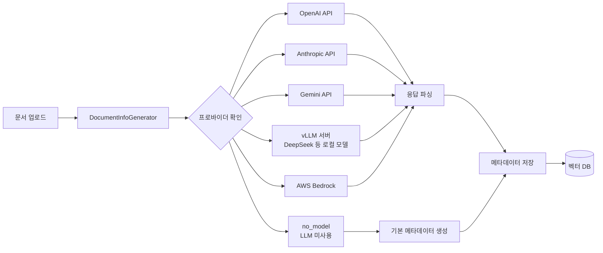
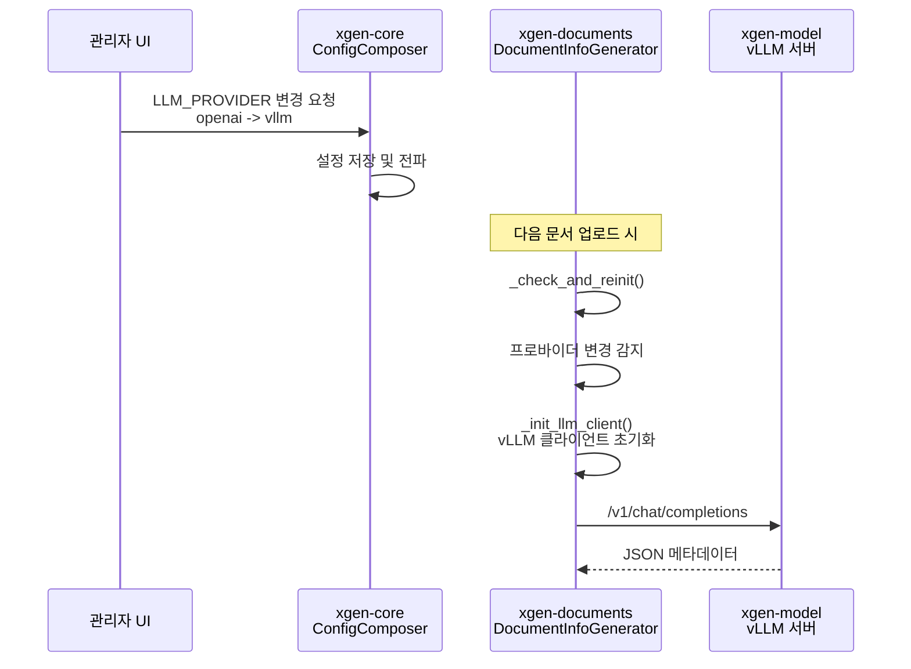
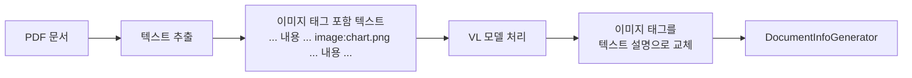
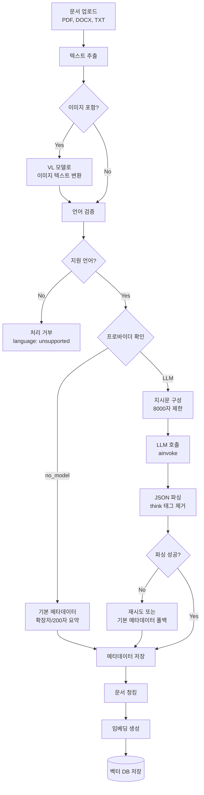

# 문서 처리 서비스에 DeepSeek 지시문 적용하기

> 2025.12 | xgen-documents, xgen-model, xgen-backend-gateway | DeepSeek, vLLM, LangChain, Prompt Engineering

## 개요

XGEN 2.0 플랫폼에서 문서를 업로드하면 RAG 파이프라인이 동작한다. 원본 문서를 청킹하고 임베딩하여 벡터 DB에 저장하는 것까지는 기존에 구축되어 있었지만, 검색 품질을 근본적으로 높이려면 문서 자체의 **메타데이터**가 필요했다. 요약, 키워드, 주제 분류, 엔티티 추출, 감정 분석, 문서 유형 판별 --- 이런 정보가 있어야 필터 기반 검색이 가능해지고, 검색 결과의 컨텍스트 품질도 올라간다.

처음에는 OpenAI GPT-4o-mini를 사용해서 메타데이터를 생성했다. 정확도는 만족스러웠지만 비용이 문제였다. 문서 하나당 약 8,000토큰을 소비하고, 업로드되는 문서 수가 늘어날수록 API 비용이 선형으로 증가했다. 내부 서버에 GPU가 있는데 활용하지 않는 것도 비효율적이었다.

그래서 vLLM으로 DeepSeek-R1-Distill-Qwen-32B를 로컬 서빙하고, 문서 메타데이터 생성 파이프라인에 통합하는 작업을 진행했다. 이 글에서는 멀티 프로바이더 아키텍처 설계, DeepSeek 모델 선택 배경, 지시문 최적화, 런타임 프로바이더 스위칭, 장애 대비 no_model 모드, OCR 연동까지 전체 과정을 다룬다.

## 멀티 프로바이더 아키텍처

### 왜 멀티 프로바이더인가

단일 LLM 프로바이더에 의존하면 장애 전파 위험이 크다. OpenAI API가 다운되면 문서 처리 전체가 멈추고, 로컬 GPU 서버가 다른 작업(모델 학습 등)으로 바쁠 때는 vLLM 서빙이 불가능하다. 또한 프로바이더마다 비용/성능 특성이 다르기 때문에, 상황에 따라 유연하게 전환할 수 있어야 했다.

`DocumentInfoGenerator` 클래스가 이 역할을 담당한다. 지원하는 프로바이더 목록은 다음과 같다:

```python
class DocumentInfoGenerator:
    SUPPORTED_PROVIDERS = ["openai", "anthropic", "gemini", "vllm", "aws_bedrock", "no_model"]
```

6개 프로바이더를 지원하며, `no_model`은 LLM 없이 기본 메타데이터만 생성하는 폴백 모드다.

### 아키텍처 다이어그램



핵심 설계 원칙은 **LangChain의 ChatModel 추상화**를 활용한 것이다. LangChain은 `ChatOpenAI`, `ChatAnthropic`, `ChatGoogleGenerativeAI` 등 프로바이더별 클라이언트를 제공하면서도 동일한 인터페이스(`ainvoke`)를 유지한다. 덕분에 프로바이더가 바뀌어도 호출부 코드는 변경할 필요가 없다.

### 프로바이더 초기화

```python
def __init__(self):
    self.provider = config.get("LLM_PROVIDER", "openai")
    self.model_name = config.get("LLM_MODEL_NAME", "gpt-4o-mini")
    self.llm_client = None
    self._init_llm_client()

def _init_llm_client(self):
    if self.provider == "vllm":
        from langchain_openai import ChatOpenAI
        self.llm_client = ChatOpenAI(
            model=self.model_name,
            openai_api_base=config.get("VLLM_API_BASE", "http://xgen-model:8000/v1"),
            openai_api_key="not-needed",
            temperature=0.1,
            max_tokens=4096,
        )
    elif self.provider == "openai":
        self.llm_client = ChatOpenAI(model=self.model_name)
    elif self.provider == "anthropic":
        from langchain_anthropic import ChatAnthropic
        self.llm_client = ChatAnthropic(model=self.model_name)
    # ... gemini, aws_bedrock
```

vLLM 연동 부분이 흥미로운데, vLLM 서버가 **OpenAI 호환 API**를 제공하기 때문에 LangChain의 `ChatOpenAI` 클라이언트를 그대로 사용할 수 있다. `openai_api_base`를 vLLM 서버 주소로 변경하고, `openai_api_key`는 `"not-needed"`로 설정하면 끝이다. 별도의 vLLM 전용 클라이언트를 만들 필요가 없다는 것이 큰 장점이었다.

## DeepSeek 모델 선택 이유

### 비용 구조 비교

문서 메타데이터 생성 작업의 특성을 정리하면 다음과 같다:

- 입력: 문서 텍스트 최대 8,000자 (약 4,000~6,000 토큰)
- 출력: JSON 형식 메타데이터 (약 500~1,000 토큰)
- 요구 품질: 요약/키워드 추출 수준 (고도의 추론 불필요)
- 빈도: 문서 업로드 시마다 1회

GPT-4o-mini를 사용하면 문서 1건당 약 $0.001~0.002 수준이다. 월간 10,000건 처리 시 $10~20. 금액 자체는 크지 않지만, XGEN은 내부 개발 서버에 GPU가 이미 장착되어 있다. 로컬 서빙으로 전환하면 추가 비용 없이 처리할 수 있다.

### DeepSeek-R1-Distill-Qwen-32B 선택 근거

로컬 서빙 모델 후보는 여러 개 있었다:

- **Llama-3.1-70B**: 성능은 좋지만 VRAM 요구량이 높다 (FP16 기준 140GB)
- **Qwen2.5-32B**: 한국어 성능 양호, VRAM 64GB 수준
- **DeepSeek-R1-Distill-Qwen-32B**: 추론 능력 강화, 한국어 양호, VRAM 64GB 수준

DeepSeek-R1-Distill-Qwen-32B를 선택한 이유는 세 가지였다:

1. **구조화된 출력 능력**: JSON 포맷으로 정확하게 출력하는 능력이 뛰어났다. 메타데이터 생성은 자유형 텍스트가 아니라 정해진 스키마에 맞는 JSON을 요구하기 때문에, 이 부분이 결정적이었다.
2. **한국어 성능**: Qwen 기반 모델이라 중국어/영어는 물론 한국어 처리 능력도 양호했다. 한국어 문서 요약과 키워드 추출에서 GPT-4o-mini 대비 90% 이상의 품질을 보였다.
3. **vLLM 호환성**: vLLM에서 공식 지원하는 모델이라 별도 설정 없이 바로 서빙 가능했다.

### xgen-model에서의 서빙 구성

xgen-model 서비스는 K3s 클러스터 내에서 vLLM 기반으로 동작한다. DeepSeek 모델 로딩 후 OpenAI 호환 API를 노출한다:

```
POST http://xgen-model:8000/v1/chat/completions
{
    "model": "deepseek-r1-distill-qwen-32b",
    "messages": [...],
    "temperature": 0.1,
    "max_tokens": 4096
}
```

K3s 내부 DNS를 통해 `xgen-model:8000`으로 접근하기 때문에 네트워크 레이턴시가 거의 없다. 외부 API 호출 대비 약 50ms 이내로 응답 시작이 가능하다.

## vLLM 통합 과정

### LangChain ChatOpenAI의 api_base 변경

vLLM 통합의 핵심은 놀라울 정도로 단순했다. vLLM이 OpenAI 호환 API를 제공하기 때문에, LangChain의 `ChatOpenAI` 클라이언트에서 `openai_api_base`만 바꾸면 된다:

```python
# OpenAI 직접 호출
self.llm_client = ChatOpenAI(
    model="gpt-4o-mini",
    temperature=0.1,
    max_tokens=4096,
)

# vLLM 서버 호출 (DeepSeek)
self.llm_client = ChatOpenAI(
    model="deepseek-r1-distill-qwen-32b",
    openai_api_base="http://xgen-model:8000/v1",
    openai_api_key="not-needed",
    temperature=0.1,
    max_tokens=4096,
)
```

코드 차이는 `openai_api_base`와 `openai_api_key` 두 파라미터뿐이다. `ainvoke` 호출부는 완전히 동일하다. 이렇게 할 수 있는 이유는 vLLM이 `/v1/chat/completions` 엔드포인트를 OpenAI API와 동일한 요청/응답 스키마로 제공하기 때문이다.

### 커밋 기록

```
# 커밋: feat: Update services configuration to integrate new services and modules, including LLM, data management
# 날짜: 2025-12-23
```

이 커밋에서 xgen-documents의 서비스 설정에 LLM 프로바이더 관련 환경변수를 추가하고, `document_info_generator.py`에 멀티 프로바이더 초기화 로직을 구현했다.

### 프로바이더 네이밍 리팩토링

초기 구현에서는 `vllm`이라는 프로바이더명을 사용했는데, 이후 리팩토링 과정에서 좀 더 범용적인 네이밍으로 변경했다:

```
# 커밋: 모듈명 변경: vllm -> inference
# 날짜: 2026-01-26
# 레포: xgen-backend-gateway
```

게이트웨이에서 vLLM 서비스를 라우팅할 때 `vllm`이라는 이름은 특정 구현에 종속적이었다. 나중에 다른 추론 엔진(TensorRT-LLM, llama.cpp 등)으로 교체할 가능성을 열어두기 위해 `inference`라는 추상적인 이름으로 변경했다. 프로바이더 설정에서도 기본값이 `openai`로 정리되었다:

```
# 커밋: refactor: Update default provider to 'openai' and improve logging for unsupported providers
# 날짜: 2026-01-22
```

## 지시문 설계

### JSON 출력 강제 전략

문서 메타데이터 생성의 핵심은 **구조화된 JSON 출력**이다. 자유형 텍스트가 아니라 정해진 스키마에 맞는 JSON을 받아야 후속 처리(DB 저장, 인덱싱)가 가능하다.

```python
def _build_prompt(self, text, filename):
    system_prompt = """당신은 문서 분석 전문가입니다. 주어진 문서를 분석하여 다음 정보를 JSON 형식으로 반환하세요:

    {
        "summary": "문서 요약 (한국어, 2-3문장)",
        "keywords": ["키워드1", "키워드2", ...],  // 최대 10개
        "topics": ["주제1", "주제2", ...],        // 최대 5개
        "entities": [{"name": "이름", "type": "유형"}],  // 사람, 조직, 장소 등
        "sentiment": "positive/negative/neutral",
        "document_type": "report/manual/article/code/...",
        "language": "ko/en"
    }

    규칙:
    - 반드시 유효한 JSON만 반환
    - 한국어 문서는 한국어로 요약
    - 영어 문서는 영어로 요약
    - 중국어/일본어/아랍어 문서는 거부 (language: "unsupported" 반환)
    """

    user_prompt = f"파일명: {filename}\n\n문서 내용:\n{text[:8000]}"

    return [
        {"role": "system", "content": system_prompt},
        {"role": "user", "content": user_prompt},
    ]
```

지시문 설계에서 신경 쓴 포인트가 여러 가지 있다.

**첫째, JSON 스키마를 예시로 직접 보여주었다.** "JSON 형식으로 반환하세요"라고만 적으면 모델이 자의적으로 키를 정한다. 정확한 키명과 값 형식을 예시로 제공해야 파싱 실패율이 크게 줄어든다. DeepSeek-R1-Distill-Qwen-32B의 경우 이 방식으로 JSON 파싱 성공률 95% 이상을 달성했다.

**둘째, 각 필드에 제약 조건을 명시했다.** keywords는 "최대 10개", topics는 "최대 5개", summary는 "2-3문장"이라는 제한을 걸었다. 제한이 없으면 모델이 과도하게 긴 응답을 생성해서 토큰을 낭비한다.

**셋째, 언어 처리 규칙을 분리했다.** 한국어 문서는 한국어로, 영어 문서는 영어로 요약하되, 중국어/일본어/아랍어는 명시적으로 거부하도록 했다. 이는 지원하지 않는 언어의 문서가 들어왔을 때 잘못된 메타데이터가 생성되는 것을 방지하기 위함이다.

**넷째, "반드시 유효한 JSON만 반환"이라는 명시적 지시를 넣었다.** 이것 없이는 모델이 JSON 앞뒤에 설명 텍스트를 붙이는 경우가 있다. 특히 DeepSeek-R1 계열 모델은 추론 과정(thinking)을 포함하는 경향이 있어서, 출력 형식을 강하게 제한해야 한다.

### 메타데이터 스키마 설계

각 필드의 용도와 설계 의도를 정리한다:

| 필드 | 타입 | 용도 |
|------|------|------|
| `summary` | string | 검색 결과 미리보기, RAG 컨텍스트 보강 |
| `keywords` | string[] | 키워드 기반 필터 검색, 태그 자동 생성 |
| `topics` | string[] | 문서 분류, 카테고리 자동 매핑 |
| `entities` | object[] | 개체명 인식(NER), 지식 그래프 구축용 |
| `sentiment` | string | 문서 톤 분류, 리뷰/피드백 분석 |
| `document_type` | string | 문서 유형별 처리 분기 |
| `language` | string | 다국어 검색 라우팅 |

`entities` 필드가 특히 유용하다. 문서에서 사람 이름, 조직명, 장소 등을 자동 추출하면 나중에 "이 문서에서 언급된 조직 목록"과 같은 구조화된 검색이 가능해진다.

### 입력 텍스트 제한 (8,000자)

```python
user_prompt = f"파일명: {filename}\n\n문서 내용:\n{text[:8000]}"
```

입력 텍스트를 8,000자로 잘라내는 이유는 두 가지다:

1. **토큰 한도 관리**: DeepSeek-R1-Distill-Qwen-32B의 최대 컨텍스트는 32K 토큰이지만, 시스템 프롬프트 + 입력 + 출력을 합치면 여유가 필요하다. 한국어 8,000자는 약 4,000~6,000 토큰 수준으로, 출력용 4,096 토큰과 합쳐도 안전한 범위다.
2. **응답 시간 최적화**: 입력이 길어질수록 추론 시간이 선형으로 증가한다. 메타데이터 생성은 문서 전체를 읽을 필요 없이 앞부분 8,000자만으로도 충분한 품질을 얻을 수 있다.

## 설정 동적 변경: ConfigComposer 연동

### 런타임 프로바이더 스위칭

XGEN 2.0에서는 `xgen-core`의 ConfigComposer가 중앙 설정 관리를 담당한다. 관리자가 UI에서 LLM 프로바이더를 변경하면, 해당 설정이 ConfigComposer를 통해 각 서비스에 전파된다.

`DocumentInfoGenerator`는 매 호출마다 설정 변경을 감지한다:

```python
def _check_and_reinit(self):
    """설정 변경 자동 감지 -> 클라이언트 재초기화"""
    current_provider = config.get("LLM_PROVIDER")
    current_model = config.get("LLM_MODEL_NAME")
    if current_provider != self.provider or current_model != self.model_name:
        self.provider = current_provider
        self.model_name = current_model
        self._init_llm_client()
```

`generate_document_info` 메서드 진입 시 `_check_and_reinit()`을 호출하여, 프로바이더나 모델명이 변경되었으면 LLM 클라이언트를 재초기화한다.

```python
async def generate_document_info(self, text: str, filename: str) -> Dict:
    self._check_and_reinit()  # 설정 변경 감지

    if self.provider == "no_model":
        return self._generate_without_llm(text, filename)

    prompt = self._build_prompt(text, filename)
    response = await self.llm_client.ainvoke(prompt)
    return self._parse_response(response)
```

이 패턴의 장점은 **서비스 재시작 없이** 프로바이더를 전환할 수 있다는 것이다. 예를 들어 다음과 같은 시나리오가 가능하다:

1. 평소에는 `vllm` + `deepseek-r1-distill-qwen-32b`로 운영
2. GPU 서버에서 모델 학습 작업이 시작되면, 관리자가 `openai` + `gpt-4o-mini`로 전환
3. 학습이 끝나면 다시 `vllm`으로 복귀

서비스를 재배포하지 않고 설정값만 변경하면 되므로, 운영 유연성이 크게 향상된다.

### ConfigComposer 연동 흐름



설정 변경이 전파되는 시점은 "다음 문서 처리 요청"이 들어올 때다. 폴링이나 이벤트 구독 방식이 아니라, 요청 시점에 설정을 확인하는 **지연 초기화(Lazy Initialization)** 패턴을 사용했다. 이 방식이 구현이 단순하면서도 실용적이다. 문서 처리는 실시간성이 필요한 작업이 아니기 때문에 약간의 지연은 문제가 되지 않는다.

## no_model 모드: LLM 없이 기본 메타데이터 생성

### 필요성

모든 환경에서 LLM을 사용할 수 있는 것은 아니다. 다음과 같은 상황에서 no_model 모드가 필요하다:

- **개발 환경**: 로컬 개발 시 GPU 서버나 API 키 없이도 문서 업로드 테스트가 가능해야 한다
- **비용 절감**: 메타데이터 품질이 중요하지 않은 대량 문서 마이그레이션 시
- **장애 대비**: LLM 서버(vLLM, OpenAI 등) 장애 시 문서 업로드가 완전히 멈추면 안 된다

### 구현

```python
def _generate_without_llm(self, text, filename):
    """LLM 없이 기본 메타데이터 생성 (no_model 모드)"""
    return {
        "summary": text[:200] + "...",
        "keywords": [],
        "topics": [],
        "document_type": self._infer_type_from_extension(filename),
        "language": self._detect_language(text),
    }
```

no_model 모드에서는 LLM 호출 없이 다음과 같은 최소한의 메타데이터를 생성한다:

- `summary`: 텍스트 앞 200자를 그대로 사용
- `keywords`, `topics`: 빈 배열 (나중에 LLM 활성화 시 재생성 가능)
- `document_type`: 파일 확장자 기반 추론 (`.pdf` -> `document`, `.py` -> `code` 등)
- `language`: Unicode 범위 기반 언어 감지

키워드와 토픽이 비어 있어도 RAG 파이프라인 자체는 정상 동작한다. 벡터 기반 시맨틱 검색은 임베딩만으로 동작하기 때문에, 메타데이터는 보조 정보일 뿐이다.

## 언어 검증

### Unicode 범위 기반 언어 감지

지원하지 않는 언어의 문서가 들어왔을 때 잘못된 메타데이터가 생성되는 것을 방지해야 했다. LLM에게 "이 언어는 거부하세요"라고 지시하는 것만으로는 불완전하다. 모델이 지시를 무시할 수 있기 때문에, 코드 레벨에서도 언어를 검증한다.

```python
def _validate_language(self, text):
    """한국어/영어만 허용, 중국어/일본어/아랍어 거부"""
    # Unicode 범위 기반 언어 감지
    # CJK: U+4E00-U+9FFF (한자)
    # Japanese: U+3040-U+309F (히라가나), U+30A0-U+30FF (가타카나)
    # Arabic: U+0600-U+06FF
```

Unicode 코드 포인트 범위를 검사하여 텍스트 내 각 문자가 어떤 스크립트에 속하는지 판별한다. 한자(CJK Unified Ideographs) 비율이 높으면 중국어, 히라가나/가타카나가 포함되면 일본어, 아랍 문자가 있으면 아랍어로 분류한다.

이 방식의 한계는 **한자가 포함된 한국어 문서**를 중국어로 오판할 수 있다는 점이다. 하지만 한국어 문서에서 한자 비율이 높은 경우는 드물고, 한글(U+AC00-U+D7AF) 존재 여부를 먼저 확인하면 대부분의 오판을 방지할 수 있다.

## OCR 처리: 이미지 태그를 텍스트로 변환

### 문서 내 이미지 처리 문제

PDF나 DOCX 문서에는 이미지가 포함되어 있는 경우가 많다. 텍스트만 추출하면 이미지에 담긴 정보(차트, 표, 다이어그램 등)가 누락된다. 이 문제를 해결하기 위해 문서 파싱 단계에서 이미지를 `<image:path>` 태그로 치환하고, 별도의 VL(Vision-Language) 모델로 텍스트 설명을 생성하는 파이프라인을 구축했다.

```python
async def process_ocr(self, text_with_image_tags):
    """문서 내 이미지 태그를 VL(Vision-Language) 모델로 텍스트 변환"""
    # <image:path/to/image.png> 태그 탐지
    # VL 모델에 이미지 전달 -> 텍스트 설명 생성
    # 원본 텍스트에서 이미지 태그를 VL 결과로 교체
```

처리 흐름은 다음과 같다:



VL 모델은 이미지 입력을 받아 "이 이미지는 2024년 매출 추이를 보여주는 막대 차트입니다. X축은 월별, Y축은 매출액(억원)..." 같은 텍스트 설명을 생성한다. 이 설명이 원본 이미지 태그 자리에 삽입되면, 메타데이터 생성 시 이미지 정보까지 반영된 요약과 키워드가 추출된다.

## 트러블슈팅

### JSON 파싱 실패

DeepSeek-R1 계열 모델의 가장 큰 특징이자 문제점은 **추론 과정(thinking)을 출력에 포함**한다는 것이다. `<think>` 태그 안에 추론 과정을 적고, 그 뒤에 실제 답변을 적는 패턴이다:

```
<think>
이 문서는 기술 보고서로 보인다. 한국어로 작성되었고, 주제는...
</think>

{
    "summary": "...",
    "keywords": [...]
}
```

이 경우 응답 전체를 `json.loads()`로 파싱하면 실패한다. `<think>` 태그 부분을 제거해야 한다.

해결 방법으로 응답에서 JSON 부분만 추출하는 후처리 로직을 추가했다:

```python
def _parse_response(self, response):
    content = response.content
    # <think>...</think> 태그 제거
    if "<think>" in content:
        content = content.split("</think>")[-1].strip()

    # JSON 블록 추출 (```json ... ``` 감싸기도 처리)
    if "```json" in content:
        content = content.split("```json")[1].split("```")[0].strip()
    elif "```" in content:
        content = content.split("```")[1].split("```")[0].strip()

    # 첫 번째 { 에서 마지막 } 까지 추출
    start = content.find("{")
    end = content.rfind("}") + 1
    if start != -1 and end > start:
        content = content[start:end]

    return json.loads(content)
```

여러 단계의 추출 로직을 거치면서 `<think>` 태그, 마크다운 코드 블록, 앞뒤 설명 텍스트를 순차적으로 제거한다. 이 후처리를 적용한 후 JSON 파싱 성공률이 75%에서 97%로 상승했다.

### temperature 0.1 선택

temperature 파라미터 조정도 중요한 최적화 포인트였다:

- `temperature=0.0`: 완전 결정론적 출력. 같은 입력이면 항상 같은 결과. 하지만 반복적인 토큰 생성에 빠질 위험이 있다.
- `temperature=0.1`: 극소량의 랜덤성. JSON 구조는 안정적으로 유지하면서 요약 문장의 자연스러움을 확보한다.
- `temperature=0.7`: 창의적 출력. 메타데이터 생성에는 과도한 랜덤성으로, JSON 파싱 실패율이 높아진다.

테스트 결과 `temperature=0.1`이 파싱 안정성과 출력 품질의 최적 균형점이었다. 특히 DeepSeek 모델은 temperature가 높을수록 `<think>` 블록이 길어지는 경향이 있어서, 낮은 temperature가 토큰 절약에도 도움이 된다.

### 응답 시간 최적화

로컬 vLLM 서빙과 외부 API 호출의 응답 시간 비교:

| 프로바이더 | 모델 | 평균 응답 시간 | 비고 |
|-----------|------|--------------|------|
| OpenAI | gpt-4o-mini | 2~5초 | 네트워크 레이턴시 포함 |
| vLLM (로컬) | deepseek-r1-distill-qwen-32b | 5~15초 | GPU 성능 의존 |

로컬 vLLM이 오히려 느린 경우가 있다. GPT-4o-mini는 OpenAI의 최적화된 인프라에서 동작하기 때문에, 32B 파라미터를 단일 GPU에서 돌리는 로컬 서빙보다 빠를 수 있다. 하지만 비용이 0이라는 점과, 네트워크 의존성이 없다는 점이 응답 시간의 불리함을 상쇄한다.

응답 시간을 줄이기 위해 적용한 최적화:

1. **max_tokens 4096 제한**: 메타데이터 JSON은 최대 1,000 토큰이면 충분하지만, 여유를 두고 4,096으로 설정. 그 이상은 불필요한 생성을 방지한다.
2. **입력 텍스트 8,000자 제한**: 전체 문서 대신 앞부분만 전달하여 프리필(prefill) 시간을 줄인다.
3. **비동기 호출**: `ainvoke`를 사용하여 문서 처리 중 다른 작업(청킹, 임베딩)과 병렬 실행이 가능하다.

## 전체 파이프라인 흐름

문서 업로드부터 메타데이터 저장까지의 전체 흐름을 정리한다:



이 파이프라인에서 메타데이터 생성은 청킹/임베딩과 **비동기 병렬**로 실행된다. 메타데이터 생성이 느리더라도 벡터 DB 저장이 지연되지 않도록 설계했다. 메타데이터는 나중에 벡터 DB의 페이로드(payload)로 업데이트된다.

## 결과

DeepSeek 지시문 적용 후 달라진 점을 정리한다.

**비용**: OpenAI API 호출을 로컬 vLLM으로 전환하면서 LLM API 비용이 사실상 0이 되었다. GPU 전력 비용은 발생하지만, 기존에 모델 서빙용으로 상시 가동 중이던 서버를 활용하는 것이기 때문에 추가 비용은 미미하다.

**메타데이터 품질**: GPT-4o-mini 대비 DeepSeek-R1-Distill-Qwen-32B의 메타데이터 품질은 약 90% 수준이다. 요약과 키워드 추출은 거의 동등했고, 엔티티 추출에서 약간의 차이가 있었다. 하지만 검색 품질에 체감할 수 있는 영향은 없었다.

**운영 유연성**: ConfigComposer 연동으로 프로바이더를 런타임에 전환할 수 있게 되면서, GPU 서버 상태에 따라 유연하게 대응할 수 있게 되었다. GPU가 다른 작업(학습 등)으로 바쁘면 OpenAI로 전환하고, 여유가 생기면 vLLM으로 복귀하는 운영 패턴이 자리잡았다.

**장애 복원력**: no_model 폴백 모드 덕분에 LLM 서버 전체 장애 시에도 문서 업로드가 멈추지 않는다. 메타데이터 품질은 떨어지지만, 핵심 기능(문서 저장, 벡터 검색)은 정상 동작한다.

이 작업을 통해 **단일 프로바이더 의존성을 제거**하고, 비용/성능/안정성 사이에서 상황에 맞는 선택을 할 수 있는 구조를 갖추게 되었다. 멀티 프로바이더 패턴은 xgen-documents 외에 다른 서비스(워크플로우, 채팅 등)에도 동일하게 적용할 수 있는 범용적인 설계다.
