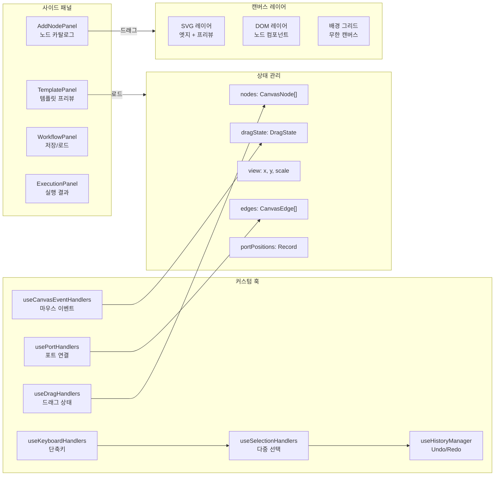

# 비주얼 워크플로우 에디터: 노드 기반 AI 파이프라인 설계

## 개요

XGEN 2.0은 AI 워크플로우를 비주얼하게 설계하는 플랫폼이다. LLM 호출, RAG 검색, 데이터 처리 같은 AI 작업을 노드로 표현하고, 노드 간 연결(엣지)로 데이터 흐름을 정의한다. React Flow 같은 기존 라이브러리를 검토했지만, XGEN 고유의 요구사항 — 포트 타입 호환성 검증, 예측 노드 자동 생성, 워크플로우 배포 연동 — 을 충족시키기 어려워 처음부터 직접 만들었다.

2025년 6월부터 9월까지 약 4개월간 xgen-app(Tauri 데스크톱 앱)과 xgen-frontend(Next.js 웹)에서 동시에 개발했다. 캔버스 렌더링, 노드/엣지 관리, 드래그 앤 드롭, 히스토리 관리, 워크플로우 저장/로드, 배포 시스템까지 모두 커스텀으로 구현했다.

```
# 커밋: feat(canvas): add Edge and Node components with Bezier path rendering and parameter handling
# 날짜: 2025-07-15 07:12
```

```
# 커밋: feat: Implement robust edge snapping and connection logic
# 날짜: 2025-06-16 06:19
```

## 전체 아키텍처



## 캔버스 렌더링 구조

워크플로우 에디터의 렌더링은 두 레이어로 분리된다. 엣지(연결선)는 SVG로, 노드는 일반 DOM으로 렌더링한다. 이 분리 덕분에 노드 내부에 인풋, 셀렉트, 텍스트에어리어 같은 HTML 폼 요소를 자유롭게 배치할 수 있다.

```typescript
// CanvasEdges.tsx — SVG 레이어
const CanvasEdges: React.FC<CanvasEdgesProps> = ({
    edges, selectedEdgeIds, edgePreview, portPositions, nodes, onEdgeClick
}) => {
    return (
        <svg style={{
            position: 'absolute',
            top: 0, left: 0,
            width: '100%', height: '100%',
            pointerEvents: 'none',
            zIndex: 1
        }}>
            <g>
                {/* 비선택 엣지를 먼저 렌더링 */}
                {edges
                    .filter(edge => !selectedEdgeIds.has(edge.id))
                    .map(edge => {
                        const sourceKey = generatePortKey(
                            edge.source.nodeId, edge.source.portId, 'output'
                        );
                        const targetKey = generatePortKey(
                            edge.target.nodeId, edge.target.portId, 'input'
                        );
                        return (
                            <Edge
                                key={edge.id}
                                sourcePos={portPositions[sourceKey]}
                                targetPos={portPositions[targetKey]}
                                isSelected={false}
                            />
                        );
                    })}
                {/* 선택된 엣지는 위에 렌더링 */}
                {edges
                    .filter(edge => selectedEdgeIds.has(edge.id))
                    .map(edge => (
                        <Edge key={edge.id} /* ... */ isSelected={true} />
                    ))}
                {/* 드래그 중인 엣지 프리뷰 */}
                {edgePreview?.targetPos && (
                    <Edge
                        sourcePos={edgePreview.startPos}
                        targetPos={edgePreview.targetPos}
                        isPreview={true}
                    />
                )}
            </g>
        </svg>
    );
};
```

엣지 렌더링에서 핵심은 선택 순서다. 비선택 엣지를 먼저 그리고 선택된 엣지를 나중에 그려서, 선택된 엣지가 항상 위에 보이도록 했다. SVG는 DOM 순서가 곧 z-index이므로 이 방식이 가장 깔끔하다.

## 엣지: 3차 베지어 곡선 렌더링

노드 간 연결선은 3차 베지어 곡선(Cubic Bezier)으로 그린다. 소스 포트 방향(출력은 오른쪽, 입력은 왼쪽)에 따라 컨트롤 포인트를 자동 계산한다.

```typescript
// Edge.tsx — 베지어 경로 계산
const calculateBezierPath = (
    source: Position, target: Position,
    sourcePortType: 'input' | 'output',
    targetPortType?: 'input' | 'output'
): string => {
    const dx = Math.abs(target.x - source.x);
    const offsetX = Math.max(dx * 0.5, 50);

    // 출력 포트는 오른쪽으로, 입력 포트는 왼쪽으로 컨트롤 포인트 배치
    const sourceDirection = sourcePortType === 'output' ? 1 : -1;
    const targetDirection = targetPortType === 'input' ? -1 : 1;

    const cp1x = source.x + offsetX * sourceDirection;
    const cp1y = source.y;
    const cp2x = target.x + offsetX * targetDirection;
    const cp2y = target.y;

    return `M ${source.x} ${source.y} C ${cp1x} ${cp1y}, ${cp2x} ${cp2y}, ${target.x} ${target.y}`;
};
```

컨트롤 포인트의 x 오프셋은 소스와 타겟 간 수평 거리의 50%로 설정하되, 최소 50px을 보장한다. 노드가 가까이 있어도 곡선이 너무 날카로워지지 않는다.

## 포트 스냅핑과 타입 호환성

엣지를 드래그할 때, 마우스가 호환 가능한 포트에 가까워지면 자동으로 스냅된다. 이 스냅핑 로직이 에디터의 사용성을 크게 높였다.

```typescript
// utils.ts — 스냅 타겟 탐색
export const SNAP_DISTANCE = 30;

export const findClosestSnapTarget = (
    mousePos: Position,
    portPositions: Record<string, Position>,
    maxDistance: number,
    filterFn: (key: string) => boolean
): string | null => {
    let closestKey: string | null = null;
    let closestDist = maxDistance;

    for (const [key, pos] of Object.entries(portPositions)) {
        if (!filterFn(key)) continue;
        const dist = Math.hypot(pos.x - mousePos.x, pos.y - mousePos.y);
        if (dist < closestDist) {
            closestDist = dist;
            closestKey = key;
        }
    }
    return closestKey;
};
```

포트 키는 `nodeId:portId:portType` 형식의 문자열이다. `portPositions`는 모든 노드의 모든 포트 위치를 캐시하는 Record 객체로, 노드가 이동할 때마다 업데이트된다. 스냅 판정 시 `filterFn`으로 조건을 걸어서, 같은 노드의 포트에는 스냅하지 않고 타입이 호환되는 포트만 대상으로 삼는다.

```
# 커밋: feat: enhance node and canvas components with improved snapping logic and type handling
# 날짜: 2025-06-17 03:46
```

타입 호환성 검증은 `areTypesCompatible` 함수가 담당한다. XGEN 노드의 입출력 타입은 `str`, `int`, `float`, `list`, `dict`, `any` 등이 있고, `any` 타입은 모든 타입과 호환된다. 호환되지 않는 타입끼리 연결하려 하면 스냅 인디케이터가 빨간색으로 바뀐다.

## 드래그 앤 드롭: 노드 추가와 이동

### 사이드바에서 노드 드래그

새 노드를 캔버스에 추가하는 방식은 HTML5 Drag and Drop API를 사용한다. 사이드바의 DraggableNodeItem에서 시작된 드래그 이벤트가 캔버스의 onDrop 핸들러에서 처리된다.

```typescript
// DraggableNodeItem.tsx
const onDragStart = (event: DragEvent<HTMLDivElement>): void => {
    const nodeDataString = JSON.stringify(nodeData);
    event.dataTransfer.setData('application/json', nodeDataString);
    event.dataTransfer.effectAllowed = 'copy';
};
```

캔버스의 onDrop에서는 드롭 좌표를 월드 좌표로 변환하고, 노드 데이터를 파싱해서 새 CanvasNode를 생성한다. 월드 좌표 변환은 현재 뷰(pan/zoom) 상태를 고려해야 한다.

```typescript
// Canvas에서 월드 좌표 변환
export const getWorldPosition = (
    clientX: number, clientY: number,
    rect: DOMRect, view: View
): Position => ({
    x: (clientX - rect.left - view.x) / view.scale,
    y: (clientY - rect.top - view.y) / view.scale
});
```

### 캔버스 내 노드 이동

캔버스 위의 노드를 클릭-드래그하면 이동한다. 다중 선택 상태에서는 선택된 모든 노드가 동시에 이동하는데, 이를 위해 startNodeDrag에서 선택된 노드들의 초기 위치를 스냅샷으로 저장한다.

```typescript
// useCanvasEventHandlers.ts — 노드 드래그 중 위치 업데이트
if (dragState.type === 'node') {
    const newX = (e.clientX / view.scale) - (dragState.offsetX || 0);
    const newY = (e.clientY / view.scale) - (dragState.offsetY || 0);
    const deltaX = newX - (dragState.initialNodePosition?.x || 0);
    const deltaY = newY - (dragState.initialNodePosition?.y || 0);

    setNodes(prevNodes =>
        prevNodes.map(node => {
            if (dragState.initialPositions?.[node.id]) {
                const initialPos = dragState.initialPositions[node.id];
                return {
                    ...node,
                    position: {
                        x: initialPos.x + deltaX,
                        y: initialPos.y + deltaY
                    }
                };
            }
            return node;
        })
    );
}
```

핵심은 `deltaX/deltaY` 계산이다. 마우스 커서의 현재 위치에서 드래그 시작 위치를 빼서 이동량을 구하고, 선택된 각 노드의 초기 위치에 이 이동량을 더한다. 이렇게 하면 다중 노드 이동 시 상대 위치가 유지된다.

```
# 커밋: feat: Enhance drag and history management with detailed logging and NODE_MOVE handling
# 날짜: 2025-09-17 12:34
```

## 셀렉션 박스: Ctrl+드래그 다중 선택

Ctrl 키를 누른 상태로 캔버스를 드래그하면 셀렉션 박스가 나타난다. 박스와 교차하는 노드와 엣지를 자동으로 선택한다.

```typescript
// 셀렉션 박스와 노드 교차 판정
const left = Math.min(startX, currentX);
const right = Math.max(startX, currentX);
const top = Math.min(startY, currentY);
const bottom = Math.max(startY, currentY);

const newSelectedNodes = new Set<string>();
const newSelectedEdges = new Set<string>();

nodes.forEach(node => {
    const nodeX = node.position.x;
    const nodeY = node.position.y;
    const nodeW = 200; // 근사치
    const nodeH = 100;

    if (nodeX < right && nodeX + nodeW > left &&
        nodeY < bottom && nodeY + nodeH > top) {
        newSelectedNodes.add(node.id);
    }
});

// 양쪽 노드가 모두 선택되면 엣지도 자동 선택
edges.forEach(edge => {
    if (newSelectedNodes.has(edge.source.nodeId) &&
        newSelectedNodes.has(edge.target.nodeId)) {
        newSelectedEdges.add(edge.id);
    }
});
```

엣지 선택 로직이 포인트다. 엣지 자체가 셀렉션 박스 안에 있는지 검사하는 것이 아니라, 양쪽 끝 노드가 모두 선택됐을 때만 엣지를 선택한다. 베지어 곡선과 사각형의 교차 판정은 계산 비용이 높아서, 이 방식이 훨씬 실용적이다.

## 예측 노드 자동 생성

가장 독특한 기능이다. 출력 포트에서 엣지를 드래그했는데 연결할 대상이 없으면, 해당 타입과 호환되는 노드 목록을 자동으로 보여준다.

```
# 커밋: feat: Add predicted nodes feature for output port drag
# 날짜: 2025-08-08 13:15
```

```typescript
// handleMouseUp — 예측 노드 생성
if (dragState.type === 'edge' && !snappedPortKeyRef.current) {
    const mousePos = getWorldPosition(e.clientX, e.clientY, rect, view);
    const sourceType = edgePreviewRef.current.source.type;

    let predicted;
    if (isDraggingOutput) {
        predicted = generatePredictedNodes(sourceType, mousePos);
    } else if (isDraggingInput) {
        predicted = generatePredictedOutputNodes(sourceType, mousePos);
    }
    setPredictedNodes(predicted);
}
```

`generatePredictedNodes`는 전체 노드 카탈로그에서 소스 타입과 호환되는 입력 포트를 가진 노드를 필터링하고, 마우스 위치 근처에 팬처럼 배치한다. 사용자가 예측 노드 중 하나를 클릭하면 실제 노드로 변환되고 엣지가 자동으로 연결된다. 이 기능은 `isDraggingInput` 방향(입력 포트에서 드래그)에서도 동작해서, 어떤 노드가 이 입력에 데이터를 보내줄 수 있는지도 보여준다.

```
# 커밋: feat: Add input-port based predicted nodes and bidirectional drag support
# 날짜: 2025-08-08 15:49
```

## Undo/Redo 히스토리 관리

워크플로우 에디터에서 실수는 흔하다. 노드를 잘못 삭제하거나 엣지를 잘못 연결하는 일이 빈번해서, Undo/Redo는 필수 기능이었다.

```
# 커밋: feat: Implement history management feature with UI panel
# 날짜: 2025-09-17 07:09
```

히스토리 시스템은 액션 기반으로 설계했다. 캔버스의 전체 상태를 스냅샷하는 방식 대신, 각 변경의 역연산(inverse operation)을 저장한다.

```typescript
// 히스토리 액션 타입
type HistoryActionType =
    | 'NODE_ADD'      // 노드 추가
    | 'NODE_DELETE'   // 노드 삭제
    | 'NODE_MOVE'     // 노드 이동
    | 'EDGE_ADD'      // 엣지 추가
    | 'EDGE_DELETE'   // 엣지 삭제
    | 'MULTI_ACTION'; // 복합 액션 (다중 삭제 등)

interface HistoryEntry {
    type: HistoryActionType;
    timestamp: number;
    data: any; // 액션별 데이터 (이전 상태, 영향받은 노드/엣지 등)
}
```

MULTI_ACTION은 여러 개의 액션을 하나로 묶는 타입이다. 예를 들어, 노드를 삭제하면 해당 노드에 연결된 엣지들도 함께 삭제되는데, 이때 NODE_DELETE + 여러 EDGE_DELETE를 하나의 MULTI_ACTION으로 묶어서, Undo 한 번에 모두 복원한다.

```
# 커밋: feat: Enhance history management by adding MULTI_ACTION type and updating usePortHandlers
# 날짜: 2025-09-18 00:33
```

뷰 상태(pan, zoom)는 히스토리에서 의도적으로 제외했다. 사용자가 화면을 이동한 후 Undo를 누르면 화면 위치가 돌아가는 것이 아니라 마지막 편집 작업이 취소되어야 하기 때문이다.

```
# 커밋: feat: Implement history management enhancements to exclude view state during restoration
# 날짜: 2025-09-17 23:34
```

## 노드 컴포넌트: 모듈화와 파라미터 시스템

하나의 거대한 Node 컴포넌트가 2025년 8월 말 모듈 분리를 거쳤다. 포트 렌더링, 파라미터 입력, 헤더, 액션 버튼이 각각 독립 컴포넌트가 됐다.

```
# 커밋: feat: Refactor Node component into modular subcomponents
# 날짜: 2025-08-28 15:43
```

노드 파라미터 시스템은 백엔드의 노드 정의에서 자동으로 UI를 생성한다.

```typescript
interface Parameter {
    id: string;
    name: string;
    value: string | number | boolean;
    type?: string;
    required?: boolean;
    optional?: boolean;
    options?: Array<{ value: string | number; label?: string }>;
    step?: number;
    min?: number;
    max?: number;
    is_api?: boolean;   // API에서 동적으로 옵션을 가져오는 파라미터
    api_name?: string;  // API 엔드포인트 이름
}
```

`is_api` 플래그가 설정된 파라미터는 백엔드 API를 호출해서 옵션 목록을 동적으로 가져온다. 예를 들어 LLM 노드의 모델 선택 드롭다운은 현재 서버에 로드된 모델 목록을 실시간으로 반영한다. 파라미터 간 의존성도 지원해서, 한 파라미터 값이 바뀌면 연관된 파라미터의 옵션이 갱신된다.

```
# 커밋: feat: Add parameter dependency handling in NodeParameters
# 날짜: 2025-09-18 17:39
```

## 워크플로우 저장과 로드

워크플로우 상태는 노드, 엣지, 뷰 상태를 포함하는 JSON으로 직렬화된다. 로컬 스토리지에 자동 저장되어 브라우저를 닫아도 작업이 유지되고, 명시적으로 저장하면 백엔드 API를 통해 DB에 영구 저장된다.

```
# 커밋: feat: Implement workflow state management with local storage for auto-save and restore
# 날짜: 2025-07-08 10:04
```

저장 시 중복 검사를 수행한다. 같은 이름의 워크플로우가 이미 있으면 덮어쓸 것인지 확인 다이얼로그를 보여준다.

```
# 커밋: feat: Add workflow duplication check and confirmation dialog in save workflow functionality
# 날짜: 2025-07-08 07:48
```

## 템플릿 시스템과 미니 캔버스

사전 정의된 워크플로우 템플릿을 제공한다. TemplatePanel에서 템플릿을 선택하면 MiniCanvas에 프리뷰가 표시되고, 더블클릭하면 현재 캔버스에 로드된다. 미저장 변경 사항이 있으면 확인 다이얼로그로 보호한다.

```
# 커밋: feat: Implement template preview functionality with MiniCanvas
# 날짜: 2025-07-10 01:41
```

MiniCanvas는 메인 Canvas의 경량 버전이다. 동일한 Edge와 Node 컴포넌트를 `isPreview` 모드로 렌더링하되, 이벤트 핸들러를 비활성화하고 최적 뷰를 자동 계산한다. 모든 노드가 화면 안에 들어오도록 바운딩 박스를 계산하고, 적절한 scale과 offset을 적용한다.

## 노드 확장/축소

복잡한 워크플로우에서 시각적 혼잡함을 줄이기 위해 노드 확장/축소 기능을 추가했다. 축소된 노드는 이름과 축약된 포트만 보여준다. 엣지 렌더링도 노드의 확장 상태를 인식해서 포트 위치를 올바르게 계산한다.

```
# 커밋: feat: Implement node expand/collapse functionality with updated styles and new collapsed ports
# 날짜: 2025-09-22 05:02
```

## 트러블슈팅

### 포트 스냅 오작동

초기 구현에서 엣지를 놓았을 때 스냅 상태가 제대로 초기화되지 않는 버그가 있었다. 스냅 판정이 남아 있어서 다음 드래그에 영향을 주는 문제였다. `handleMouseUp`에서 `snappedPortKey`와 `isSnapTargetValid`를 확실히 초기화하고, `edgePreview`도 null로 설정하는 것으로 해결했다.

```
# 커밋: feat: ensure edge preview is cleared on type mismatch in handlePortMouseUp
# 날짜: 2025-06-17 03:54
```

### 캔버스 줌 시 좌표 계산 오차

Pan과 Zoom이 적용된 캔버스에서 노드 드래그 좌표가 어긋나는 문제가 있었다. 문제의 원인은 `clientX`를 `view.scale`로 나누는 과정에서 `view.x`/`view.y` 오프셋을 적용하는 순서가 잘못된 것이었다. `getWorldPosition` 유틸 함수를 만들어서 좌표 변환을 일관성 있게 처리했다.

### React 리렌더링 성능

수십 개의 노드와 엣지가 있을 때, 마우스 이동 이벤트마다 전체 컴포넌트가 리렌더링되면 성능이 급격히 떨어졌다. `useCallback`으로 이벤트 핸들러를 메모이제이션하고, 포트 위치 업데이트를 `ref`로 처리해서 불필요한 렌더링을 줄였다. `edgePreviewRef`를 별도의 MutableRefObject로 관리한 것도 같은 이유다.

## 결과 및 회고

4개월간의 개발로 React Flow에 의존하지 않는 완전한 커스텀 노드 에디터를 만들었다. 외부 라이브러리 없이 구현한 덕분에 XGEN 고유의 기능 — 포트 타입 호환성, 예측 노드, 파라미터 의존성, 워크플로우 배포 연동 — 을 제약 없이 추가할 수 있었다.

가장 까다로웠던 부분은 좌표 시스템이다. 스크린 좌표, 클라이언트 좌표, 캔버스 좌표, 월드 좌표가 각각 다르고, Pan/Zoom 상태에 따라 변환이 달라진다. `getWorldPosition` 같은 유틸을 일찍 만들어서 일관성을 유지한 것이 시행착오를 줄이는 데 효과적이었다.

아쉬운 점은 초기에 TypeScript 타입 정의를 느슨하게 한 것이다. `DragState`가 union type 대신 여러 선택적 필드를 가진 단일 인터페이스로 시작했다가, 나중에 `type` 필드로 분기하는 패턴이 복잡해졌다. 처음부터 discriminated union으로 설계했으면 코드가 더 깔끔했을 것이다.
