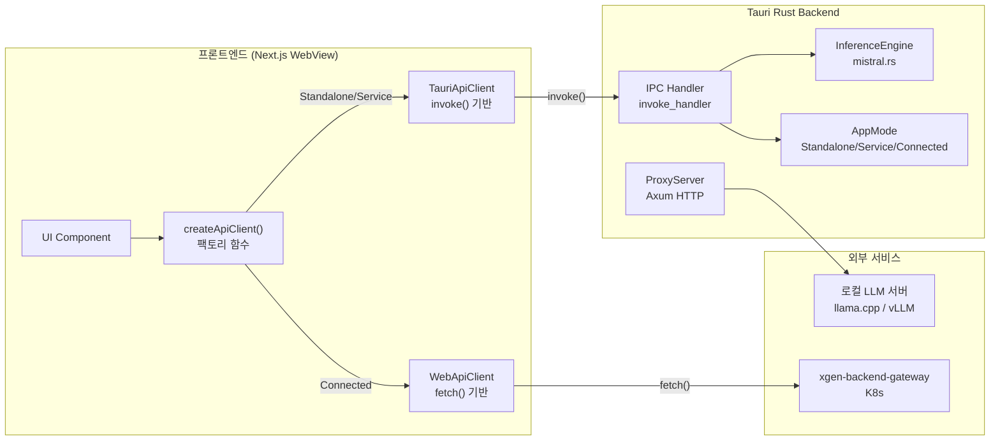

# API 추상화 레이어: 로컬 LLM과 원격 서비스 통합

## 하나의 앱, 세 가지 API 경로

XGEN 데스크톱 앱은 동일한 UI에서 세 가지 완전히 다른 API 경로를 사용한다.

| 모드 | LLM 추론 | API 통신 | 네트워크 |
|------|----------|----------|----------|
| Standalone | mistral.rs (로컬 GGUF) | Tauri IPC `invoke()` | 불필요 |
| Service | Python Sidecar | IPC -> localhost | 로컬만 |
| Connected | XGEN Gateway | HTTP `fetch()` | 필수 |

Standalone 모드에서 "모델에게 질문하기" 버튼을 누르면, Tauri의 `invoke("generate", { prompt })` IPC가 Rust 프로세스 안의 mistral.rs로 직접 간다. Connected 모드에서 같은 버튼을 누르면, `fetch("https://xgen.x2bee.com/api/v1/chat/completions")` HTTP 요청이 K8s 위의 Gateway로 날아간다. 프론트엔드 입장에서는 동일한 동작인데, 내부 구현이 완전히 다르다.

이 차이를 프론트엔드 코드 전체에 `if (mode === 'standalone') { invoke() } else { fetch() }` 같은 분기를 퍼뜨리면 유지보수가 불가능해진다. API 추상화 레이어가 필요했다.

```
# 커밋: Add API abstraction layer and integrate LLM inference engine
# 날짜: 2026-01-04 09:46
```

이 커밋은 +9,095줄 / -794줄로, xgen-app에서 가장 큰 단일 커밋이다. API 추상화 레이어 전체와 mistral.rs LLM 추론 엔진 통합이 한 번에 들어갔다.

---

## 전체 아키텍처



추상화는 두 레이어에 걸쳐 있다. 프론트엔드의 `createApiClient()` 팩토리가 모드에 따라 적절한 클라이언트를 생성하고, Rust 백엔드의 `AppMode` enum이 실제 서비스 라우팅을 결정한다.

---

## TypeScript 인터페이스 설계

### IApiClient 인터페이스

모든 API 클라이언트가 구현해야 하는 공통 인터페이스다.

```typescript
// patches/api/core/ApiClient.interface.ts

export interface IApiClient {
  // 모드 정보
  getMode(): Promise<AppModeInfo>;
  setMode(mode: string, serverUrl?: string): Promise<void>;

  // 헬스 체크
  checkConnection(): Promise<boolean>;

  // HTTP 요청 (Connected 모드에서 사용)
  get<T>(url: string, options?: RequestOptions): Promise<ApiResponse<T>>;
  post<T>(url: string, body?: any, options?: RequestOptions): Promise<ApiResponse<T>>;
  put<T>(url: string, body?: any, options?: RequestOptions): Promise<ApiResponse<T>>;
  delete<T>(url: string, options?: RequestOptions): Promise<ApiResponse<T>>;
}

export interface ILLMClient {
  // 모델 관리
  loadModel(options: LoadModelOptions): Promise<ModelStatus>;
  unloadModel(): Promise<void>;
  getModelStatus(): Promise<ModelStatus>;

  // 추론
  generate(prompt: string, options?: GenerateOptions): Promise<string>;
  generateStream(prompt: string, onToken: (token: string) => void): Promise<void>;

  // 임베딩
  embed(texts: string[]): Promise<number[][]>;
}
```

`IApiClient`는 일반 HTTP 요청을, `ILLMClient`는 LLM 특화 기능을 담당한다. 이 둘을 분리한 이유는, Connected 모드에서는 LLM 관련 기능이 Gateway의 REST API를 통해 처리되지만, Standalone 모드에서는 Tauri IPC를 통해 Rust 프로세스 안의 mistral.rs에 직접 접근하기 때문이다.

### 타입 정의

```typescript
// patches/api/core/types.ts

export interface ApiResponse<T> {
  data: T;
  status: number;
  headers?: Record<string, string>;
}

export interface AppModeInfo {
  mode: 'standalone' | 'service' | 'connected';
  serverUrl?: string;
  connected: boolean;
}

export interface LoadModelOptions {
  modelPath: string;
  modelId: string;
  tokenizerModelId?: string;
  contextLength?: number;
  pagedAttention?: boolean;
  chatTemplate?: string;
}

export interface ModelStatus {
  loaded: boolean;
  modelId?: string;
  modelPath?: string;
  device: string;
  memoryUsage?: number;
}

export interface GenerateOptions {
  systemPrompt?: string;
  maxTokens?: number;
  temperature?: number;
  topP?: number;
  stream?: boolean;
}
```

---

## 팩토리 패턴: 모드에 따른 클라이언트 생성

```typescript
// patches/api/core/createApiClient.ts

import { isTauri, isBrowser } from './platform';
import { TauriApiClient } from './TauriApiClient';
import { WebApiClient } from './WebApiClient';

export function createApiClient(): IApiClient & Partial<ILLMClient> {
  if (isTauri()) {
    return new TauriApiClient();
  }
  return new WebApiClient();
}
```

환경 감지는 `platform.ts`에서 처리한다.

```typescript
// patches/api/core/platform.ts

export function isTauri(): boolean {
  if (typeof window === 'undefined') return false;
  return '__TAURI__' in window || '__TAURI_INTERNALS__' in window;
}

export function isBrowser(): boolean {
  return typeof window !== 'undefined' && !isTauri();
}

export function isServer(): boolean {
  return typeof window === 'undefined';
}
```

`__TAURI__` 전역 변수는 Tauri가 WebView를 초기화할 때 자동으로 주입한다. 이 변수의 존재 여부만으로 현재 코드가 Tauri 앱 안에서 실행 중인지, 일반 브라우저에서 실행 중인지 구분할 수 있다.

---

## TauriApiClient: IPC 기반 구현

Standalone과 Service 모드에서 사용되는 클라이언트다. Tauri의 `invoke()` IPC로 Rust 백엔드를 직접 호출한다.

```typescript
// patches/api/core/TauriApiClient.ts (핵심 부분)

import { invoke } from '@tauri-apps/api/core';

export class TauriApiClient implements IApiClient, ILLMClient {

  async getMode(): Promise<AppModeInfo> {
    return await invoke('get_app_mode');
  }

  async setMode(mode: string, serverUrl?: string): Promise<void> {
    await invoke('set_app_mode', { mode, serverUrl });
  }

  async checkConnection(): Promise<boolean> {
    return await invoke('check_gateway_connection');
  }

  // LLM 기능 — Rust의 mistral.rs에 직접 접근
  async loadModel(options: LoadModelOptions): Promise<ModelStatus> {
    return await invoke('load_model', {
      modelPath: options.modelPath,
      modelId: options.modelId,
      tokenizerModelId: options.tokenizerModelId,
      contextLength: options.contextLength ?? 4096,
      pagedAttention: options.pagedAttention ?? false,
      chatTemplate: options.chatTemplate,
    });
  }

  async generate(prompt: string, options?: GenerateOptions): Promise<string> {
    const result = await invoke('generate_sync', {
      prompt,
      systemPrompt: options?.systemPrompt,
      maxTokens: options?.maxTokens ?? 512,
      temperature: options?.temperature ?? 0.7,
      topP: options?.topP ?? 0.9,
    });
    return result.text;
  }

  async generateStream(
    prompt: string,
    onToken: (token: string) => void,
    options?: GenerateOptions
  ): Promise<void> {
    // Tauri 이벤트 리스너로 스트리밍 토큰 수신
    const { listen } = await import('@tauri-apps/api/event');
    const unlisten = await listen('llm:token', (event) => {
      onToken(event.payload as string);
    });

    try {
      await invoke('generate', {
        prompt,
        systemPrompt: options?.systemPrompt,
        maxTokens: options?.maxTokens ?? 512,
        stream: true,
      });
    } finally {
      unlisten();
    }
  }
}
```

`generateStream`의 구현이 흥미로운 부분이다. Tauri IPC는 기본적으로 요청-응답 패턴이라 스트리밍을 직접 지원하지 않는다. 대신 Tauri의 이벤트 시스템을 활용한다. Rust 쪽에서 `app.emit("llm:token", &token)`으로 토큰을 보내고, TypeScript 쪽에서 `listen("llm:token")`으로 받는다.

---

## WebApiClient: HTTP fetch 기반 구현

Connected 모드에서 사용되는 클라이언트다. 표준 HTTP fetch로 원격 Gateway에 요청한다.

```typescript
// patches/api/core/WebApiClient.ts (핵심 부분)

export class WebApiClient implements IApiClient {
  private baseUrl: string;

  constructor() {
    this.baseUrl = process.env.NEXT_PUBLIC_BACKEND_HOST || '';
  }

  async get<T>(url: string, options?: RequestOptions): Promise<ApiResponse<T>> {
    const controller = new AbortController();
    const timeout = setTimeout(() => controller.abort(), options?.timeout ?? 30000);

    try {
      const response = await fetch(`${this.baseUrl}${url}`, {
        method: 'GET',
        headers: this.getHeaders(options),
        signal: controller.signal,
      });

      const data = await response.json();
      return { data, status: response.status };
    } finally {
      clearTimeout(timeout);
    }
  }

  async post<T>(url: string, body?: any, options?: RequestOptions): Promise<ApiResponse<T>> {
    const controller = new AbortController();
    const timeout = setTimeout(() => controller.abort(), options?.timeout ?? 30000);

    try {
      const response = await fetch(`${this.baseUrl}${url}`, {
        method: 'POST',
        headers: { 'Content-Type': 'application/json', ...this.getHeaders(options) },
        body: body ? JSON.stringify(body) : undefined,
        signal: controller.signal,
      });

      const data = await response.json();
      return { data, status: response.status };
    } finally {
      clearTimeout(timeout);
    }
  }
}
```

`AbortController`로 타임아웃을 구현한 점이 중요하다. Connected 모드에서는 네트워크 상태가 불안정할 수 있으므로, 기본 30초 타임아웃을 걸어 무한 대기를 방지한다.

---

## Rust 백엔드: AppState와 AppMode

프론트엔드 추상화의 뒤편에는 Rust 백엔드의 상태 관리가 있다.

### AppMode Enum

```rust
// src-tauri/src/state/app_state.rs

/// Application operation mode
#[derive(Debug, Clone, Default, serde::Serialize, serde::Deserialize)]
#[serde(tag = "type")]
pub enum AppMode {
    /// Fully offline mode with local LLM (mistral.rs)
    #[default]
    Standalone,

    /// Service mode using Python sidecar (xgen-workflow)
    Service {
        service_url: String,
    },

    /// Connected to external xgen-backend-gateway
    Connected {
        server_url: String,
    },
}
```

`#[serde(tag = "type")]`은 JSON 직렬화 시 `{ "type": "Standalone" }` 형태로 만든다. 프론트엔드에서 `mode.type`으로 현재 모드를 확인할 수 있다. `#[default]`로 Standalone이 기본값이다. 네트워크가 없어도 앱이 동작해야 하기 때문이다.

### AppState: 전역 상태 관리

```rust
// src-tauri/src/state/app_state.rs

pub struct AppState {
    pub system_info: Arc<RwLock<Option<SystemInfo>>>,
    pub model_manager: Arc<RwLock<ModelManager>>,
    pub inference_engine: Arc<RwLock<InferenceEngine>>,
    pub mcp_config: Arc<RwLock<McpConfigManager>>,
    pub sidecar_manager: Arc<RwLock<SidecarManager>>,
    pub app_mode: Arc<RwLock<AppMode>>,
    pub gateway_url: Arc<RwLock<Option<String>>>,
}
```

모든 필드가 `Arc<RwLock<T>>`로 감싸져 있다. Tauri의 IPC 커맨드는 여러 스레드에서 동시에 호출될 수 있으므로, 스레드 안전한 공유 상태가 필수다. `Arc`는 레퍼런스 카운팅, `RwLock`은 읽기는 동시에 여러 스레드에서, 쓰기는 하나의 스레드에서만 가능하도록 한다.

모드 확인 헬퍼 메서드도 제공한다.

```rust
impl AppState {
    pub async fn is_standalone(&self) -> bool {
        matches!(*self.app_mode.read().await, AppMode::Standalone)
    }

    pub async fn get_server_url(&self) -> Option<String> {
        match &*self.app_mode.read().await {
            AppMode::Connected { server_url } => Some(server_url.clone()),
            AppMode::Service { service_url } => Some(service_url.clone()),
            AppMode::Standalone => None,
        }
    }
}
```

---

## InferenceEngine: mistral.rs 통합

Standalone 모드의 핵심은 `InferenceEngine`이다. mistral.rs를 래핑하여 GGUF 모델 로딩과 텍스트 생성을 담당한다.

### 모델 로딩

```rust
// src-tauri/src/services/inference.rs

pub async fn load_model(&mut self, config: ModelConfig) -> Result<ModelStatus> {
    log::info!("Loading model: {} from {}", config.model_id, config.model_path);

    // 최적 디바이스 자동 감지 (CUDA > Metal > CPU)
    let device = best_device(false)
        .map_err(|e| AppError::Inference(e.to_string()))?;

    // GGUF 모델 빌더 구성
    let mut builder = GgufModelBuilder::new(
        &config.model_id,
        vec![filename.to_string()],
    ).with_logging();

    // 토크나이저 설정
    if let Some(ref tok_id) = config.tokenizer_id {
        builder = builder.with_tok_model_id(tok_id);
    }

    // Paged Attention 활성화 (긴 컨텍스트 처리)
    if config.paged_attention {
        builder = builder.with_paged_attn(|| {
            PagedAttentionMetaBuilder::default().build()
        }).map_err(|e| AppError::Model(e.to_string()))?;
    }

    let model = builder.build().await
        .map_err(|e| AppError::Model(format!("Failed to load model: {}", e)))?;

    self.model = Some(model);
    self.status = ModelStatus {
        loaded: true,
        model_id: Some(config.model_id),
        device: format!("{:?}", device),
        ..
    };

    Ok(self.status.clone())
}
```

`best_device(false)`가 핵심이다. mistral.rs가 CUDA(NVIDIA), Metal(Apple), CPU 중 현재 시스템에서 가장 빠른 디바이스를 자동으로 선택한다. `false` 인자는 디바이스 목록을 로그에 출력하지 않겠다는 뜻이다.

### 스트리밍 생성

```rust
pub async fn generate_stream_with_callback<F>(
    &self,
    request: GenerateRequest,
    mut callback: F,
) -> Result<GenerateResponse>
where
    F: FnMut(String) + Send,
{
    let model = self.model.as_ref()
        .ok_or_else(|| AppError::Inference("No model loaded".to_string()))?;

    let mut messages = TextMessages::new();
    if let Some(ref system) = request.system_prompt {
        messages = messages.add_message(TextMessageRole::System, system);
    }
    messages = messages.add_message(TextMessageRole::User, &request.prompt);

    let mut stream = model.stream_chat_request(messages).await
        .map_err(|e| AppError::Inference(format!("Stream failed: {}", e)))?;

    let mut full_text = String::new();
    while let Some(response) = stream.next().await {
        match response {
            Response::Chunk(chunk) => {
                if let Some(choice) = chunk.choices.first() {
                    if let Some(ref content) = choice.delta.content {
                        full_text.push_str(content);
                        callback(content.clone());
                    }
                }
            }
            Response::Done(done) => {
                // 토큰 사용량 기록
                break;
            }
            Response::InternalError(e) => return Err(AppError::Inference(e.to_string())),
            _ => {}
        }
    }

    Ok(GenerateResponse { text: full_text, .. })
}
```

콜백 패턴을 사용한 이유가 있다. mistral.rs의 `Stream`은 `futures::Stream` 트레이트를 구현하지 않고 자체 `next()` 메서드를 제공한다. 범용 Stream 어댑터를 만들기보다, 토큰이 생성될 때마다 콜백을 호출하는 방식이 더 실용적이었다. Tauri 커맨드 쪽에서 이 콜백으로 `app.emit("llm:token", &token)`을 호출하면 프론트엔드까지 실시간 전달된다.

### MCP 도구 통합

mistral.rs는 MCP(Model Context Protocol) 클라이언트를 네이티브로 지원한다. 모델 로딩 시 MCP 도구를 함께 등록하면, LLM이 tool calling을 할 수 있다.

```rust
pub async fn load_model_with_mcp(
    &mut self,
    config: ModelConfig,
    mcp_config: McpClientConfig,
) -> Result<ModelStatus> {
    // MCP 클라이언트 초기화
    let mut mcp_client = McpClient::new(mcp_config);
    mcp_client.initialize().await?;

    // 도구 콜백 추출
    let tool_callbacks = mcp_client.get_tool_callbacks_with_tools();
    log::info!("Registered {} MCP tools", tool_callbacks.len());

    // 모델 빌더에 MCP 도구 등록
    let mut builder = GgufModelBuilder::new(&config.model_id, vec![filename.to_string()])
        .with_logging();

    for (name, callback_with_tool) in tool_callbacks {
        builder = builder.with_tool_callback_and_tool(
            name.clone(),
            callback_with_tool.callback.clone(),
            callback_with_tool.tool.clone(),
        );
    }

    let model = builder.build().await?;
    self.mcp_client = Some(mcp_client);
    self.mcp_tool_count = tool_callbacks.len();
    // ...
}
```

이렇게 하면 Standalone 모드에서도 외부 도구를 호출할 수 있다. 예를 들어 `@playwright/mcp` 서버를 등록하면, 로컬 LLM이 브라우저 자동화 도구를 직접 호출한다. 서버 없이 완전히 로컬에서 AI Agent를 구동할 수 있는 것이다.

---

## 로컬 LLM 프록시 서버

Connected 모드에서도 로컬 LLM을 사용해야 하는 케이스가 있다. 사용자가 Gateway에 연결되어 있지만, LLM 엔드포인트는 자신의 로컬 머신에 있는 llama.cpp나 vLLM 서버를 쓰고 싶은 경우다.

이때 문제가 있다. Gateway에서 사용자의 `localhost:8080`에 접근할 수 없다. 이를 해결하기 위해 Axum 기반 프록시 서버를 앱 안에 내장했다.

```rust
// src-tauri/src/proxy_server.rs

pub struct ProxyServer {
    state: ProxyServerState,
    shutdown_tx: Option<tokio::sync::oneshot::Sender<()>>,
    port: Option<u16>,
}

impl ProxyServer {
    pub async fn start(&mut self, port: u16) -> Result<u16, String> {
        let cors = CorsLayer::new()
            .allow_origin(Any)
            .allow_methods([Method::GET, Method::POST, Method::PUT, Method::DELETE])
            .allow_headers(Any);

        let app = Router::new()
            .route("/health", get(health_check))
            .route("/v1/{*path}", any(proxy_handler))
            .route("/{*path}", any(proxy_handler))
            .layer(cors)
            .with_state(state);

        let listener = tokio::net::TcpListener::bind(addr).await?;
        // Graceful shutdown 지원
        tokio::spawn(async move {
            axum::serve(listener, app)
                .with_graceful_shutdown(async { shutdown_rx.await.ok(); })
                .await.ok();
        });

        Ok(actual_port)
    }
}
```

프록시 핸들러는 모든 요청을 로컬 LLM 엔드포인트로 전달한다. `/v1/chat/completions` 요청이 들어오면 `http://127.0.0.1:8080/v1/chat/completions`으로 포워딩하는 것이다.

보안 검증도 있다.

```rust
fn is_localhost_url(url: &str) -> bool {
    let url_lower = url.to_lowercase();
    url_lower.starts_with("http://localhost")
        || url_lower.starts_with("http://127.0.0.1")
        || url_lower.starts_with("http://0.0.0.0")
        || url_lower.starts_with("http://[::1]")
}
```

localhost URL만 프록시 대상으로 허용한다. 임의의 외부 URL을 프록시하면 SSRF(Server-Side Request Forgery) 취약점이 되기 때문이다.

이 프록시 서버에 Bore 터널을 붙이면, Gateway에서 사용자의 로컬 LLM에 접근할 수 있게 된다. Bore 터널 구현은 #108에서 다루었다.

---

## 앱 시작 시 자동 초기화

앱이 실행될 때 이전 세션의 모드를 자동으로 복원하는 로직이 있다.

```rust
// src-tauri/src/lib.rs

async fn auto_init_app_mode(app: &tauri::AppHandle) -> Result<(), String> {
    let config_dir = app.path().app_config_dir()?;
    let config_path = config_dir.join("settings.json");

    if !config_path.exists() {
        log::info!("No settings file found, using default Standalone mode");
        return Ok(());
    }

    let settings: serde_json::Value = serde_json::from_str(
        &fs::read_to_string(&config_path)?
    )?;

    let last_mode = settings.get("lastMode")
        .and_then(|m| m.as_str())
        .unwrap_or("standalone");

    if last_mode == "connected" {
        if let Some(url) = settings.get("serverUrl").and_then(|u| u.as_str()) {
            let state = app.state::<Arc<AppState>>();
            let mut mode = state.app_mode.write().await;
            *mode = AppMode::Connected { server_url: url.to_string() };

            let mut gateway = state.gateway_url.write().await;
            *gateway = Some(url.to_string());
        }
    }

    Ok(())
}
```

`settings.json`에 저장된 `lastMode`와 `serverUrl`을 읽어서 `AppMode`를 복원한다. 파일이 없거나 파싱에 실패하면 기본값인 Standalone으로 시작한다.

터널 자동 시작도 함께 이루어진다.

```rust
async fn auto_start_tunnel(app: &tauri::AppHandle) -> Result<(), String> {
    // settings.json에서 localLlm 설정 확인
    let local_llm = settings.get("localLlm");
    let endpoint = local_llm
        .and_then(|llm| llm.get("endpoint"))
        .and_then(|e| e.as_str())
        .filter(|e| !e.is_empty());

    let enabled = local_llm
        .and_then(|llm| llm.get("enabled"))
        .and_then(|e| e.as_bool())
        .unwrap_or(true);

    if let Some(endpoint) = endpoint {
        if enabled {
            let manager = app.state::<ProxyServerManager>();
            manager.auto_start_with_tunnel(endpoint.to_string(), 19820).await?;
        }
    }

    Ok(())
}
```

로컬 LLM이 설정되어 있으면, 프록시 서버(포트 19820)와 Bore 터널을 자동으로 시작한다. 사용자가 매번 수동으로 터널을 켤 필요가 없다.

---

## 설정 영속화

```rust
// src-tauri/src/commands/settings.rs

#[derive(serde::Serialize, serde::Deserialize, Default, Clone)]
#[serde(rename_all = "camelCase")]
pub struct AppSettings {
    pub server_url: Option<String>,
    pub last_mode: String,
    pub local_llm: Option<LocalLlmSettings>,
}

#[derive(serde::Serialize, serde::Deserialize, Default, Clone)]
#[serde(rename_all = "camelCase")]
pub struct LocalLlmSettings {
    pub enabled: bool,
    pub endpoint: String,
    pub model_name: Option<String>,
}
```

`#[serde(rename_all = "camelCase")]`로 Rust의 `snake_case` 필드명을 자동으로 `camelCase`로 변환한다. TypeScript 프론트엔드와 JSON을 주고받을 때 네이밍 컨벤션 불일치를 해결한다.

설정 파일은 Tauri의 `app_config_dir()`에 저장된다. 각 OS별 경로는 다음과 같다.

| OS | 경로 |
|----|------|
| Linux | `~/.config/com.plateer.plateerag/settings.json` |
| macOS | `~/Library/Application Support/com.plateer.plateerag/settings.json` |
| Windows | `%APPDATA%/com.plateer.plateerag/settings.json` |

---

## 시행착오: 모드 전환 중 겪은 문제들

```
# 커밋: Add logging to get_app_mode function for better debugging
# 날짜: 2026-01-04 20:15
```

```
# 커밋: Refactor get_app_mode function to simplify return logic
# 날짜: 2026-01-04 20:27
```

같은 날 오후에 두 번의 수정이 있었다. `get_app_mode`가 예상과 다른 값을 반환하는 문제였다. 원인은 `RwLock` read guard의 lifetime이었다. read guard를 들고 있는 상태에서 다른 비동기 작업을 하면 데드락이 발생할 수 있다. guard를 빠르게 해제하고 값만 클론하는 방식으로 수정했다.

```
# 커밋: feat: auto-init app mode, remove mode-select, fix Connected mode auth
# 날짜: 2026-02-07 01:47
```

한 달 뒤에 더 큰 리팩토링이 있었다. 처음에는 앱 시작 시 모드 선택 화면을 보여주었는데, 이것을 제거하고 자동 초기화로 바꾸었다. 매번 앱을 열 때마다 모드를 선택하는 것은 사용자 경험이 나빴다. 마지막으로 사용한 모드를 기억해서 자동으로 복원하는 것이 자연스럽다.

---

## 결과

API 추상화 레이어를 통해 달성한 것은 다음과 같다.

**프론트엔드 코드 단순화**: UI 컴포넌트는 `apiClient.generate(prompt)`만 호출하면 된다. 현재 모드가 Standalone인지 Connected인지는 추상화 레이어가 알아서 처리한다.

**모드 전환 무중단**: 사용자가 설정에서 모드를 바꾸면, `AppMode` enum만 갱신되고 다음 API 호출부터 새 모드로 동작한다. 앱 재시작 없이 Standalone에서 Connected로, 또는 그 반대로 전환된다.

**로컬 LLM + 원격 서비스 동시 사용**: Connected 모드에서도 로컬 LLM 프록시를 통해 자신의 GPU로 추론할 수 있다. Gateway의 모든 기능을 사용하면서도, LLM은 로컬에서 돌리는 하이브리드 구성이 가능하다.

**Cargo 기반 LLM 통합**: mistral.rs를 Cargo 의존성으로 직접 가져와서 앱 프로세스 안에서 LLM을 돌린다. 별도 프로세스를 띄우고 IPC로 통신하는 오버헤드가 없다. 이것이 Tauri를 Electron 대신 선택한 가장 큰 이유다.
