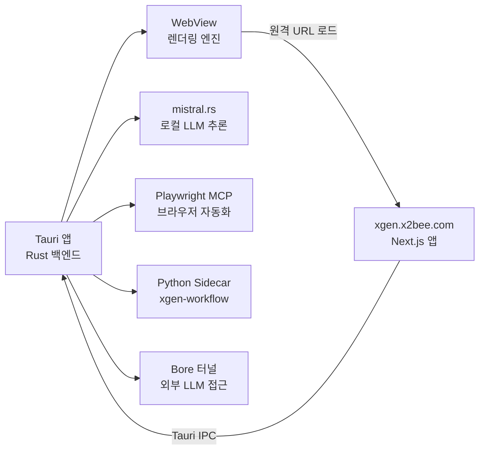

# Remote WebView 아키텍처: 로컬 앱과 원격 서버 연동

## 개요: 왜 Remote WebView인가

Tauri로 데스크톱 앱을 만들 때 일반적인 방식은 프론트엔드를 로컬에 번들링하는 것이다. `tauri.conf.json`의 `beforeBuildCommand`에 `npm run build`를 넣으면, Tauri가 빌드 시 프론트엔드 에셋(HTML, JS, CSS)을 바이너리 안에 포함시킨다. 앱을 실행하면 `tauri://localhost`라는 커스텀 프로토콜로 로컬 파일을 렌더링한다.

XGEN 데스크톱 앱은 다른 상황이었다. XGEN 프론트엔드(Next.js)는 이미 K8s 클러스터에 배포되어 `https://xgen.x2bee.com`으로 서비스되고 있었다. 이 프론트엔드를 데스크톱 앱에서도 그대로 사용하고 싶었다. 동일한 UI를 로컬에 복제해서 빌드하는 것은 여러 문제를 만든다.

- 프론트엔드 빌드 시간이 데스크톱 빌드에 추가된다 (Next.js 빌드만 수 분 소요)
- 프론트엔드 업데이트마다 데스크톱 앱도 다시 배포해야 한다
- 프론트엔드 소스를 데스크톱 레포에 동기화하는 별도 스크립트(`sync-frontend.sh`)가 필요한데, 패치 파일 관리가 점점 복잡해진다
- SSR 기능이나 서버 사이드 API Route가 정적 빌드에서 동작하지 않는다

Remote WebView 패턴은 이 문제를 근본적으로 해결한다. Tauri WebView가 로컬 파일 대신 원격 URL을 직접 로드하는 것이다. 브라우저에서 `https://xgen.x2bee.com`을 여는 것과 동일하지만, Tauri의 Rust 백엔드가 제공하는 로컬 LLM 추론, 파일 시스템 접근, Playwright MCP 브라우저 자동화 같은 네이티브 기능을 IPC로 함께 사용할 수 있다.

## 전체 아키텍처



핵심 구조를 정리하면 다음과 같다.

1. WebView는 `https://xgen.x2bee.com`을 로드한다. 이 URL의 Next.js 앱이 UI 전체를 담당한다.
2. 원격 웹앱에서 `window.__TAURI_INTERNALS__`를 통해 Tauri IPC를 호출할 수 있다.
3. Rust 백엔드는 로컬 LLM(mistral.rs), Playwright MCP, Python Sidecar, Bore 터널 등 네이티브 기능을 제공한다.
4. 프론트엔드 코드는 실행 환경(Tauri / 브라우저 / 서버)을 감지해서 적절한 API 클라이언트를 선택한다.

이 구조에서 데스크톱 앱의 빌드는 **Rust만 컴파일**하면 끝난다. 프론트엔드 빌드 과정이 완전히 사라지므로, 빌드 시간이 대폭 단축된다.

## tauri.conf.json: Remote WebView의 핵심 설정

Remote WebView의 모든 것은 `tauri.conf.json` 설정에서 시작된다.

```json
{
  "productName": "XGEN",
  "version": "0.1.0",
  "identifier": "com.plateer.plateerag",
  "build": {
    "frontendDist": "https://xgen.x2bee.com",
    "devUrl": "https://xgen.x2bee.com",
    "beforeDevCommand": "",
    "beforeBuildCommand": ""
  },
  "app": {
    "windows": [
      {
        "title": "XGEN",
        "width": 1280,
        "height": 800,
        "resizable": true,
        "fullscreen": false
      }
    ],
    "security": {
      "csp": null
    }
  }
}
```

일반적인 Tauri 앱과 비교하면 차이가 명확하다.

**`build.frontendDist`**: 보통 `"../dist"`처럼 로컬 빌드 결과물 경로를 넣는다. 여기서는 `"https://xgen.x2bee.com"`이라는 **원격 URL**을 지정했다. Tauri는 이 값이 `http://` 또는 `https://`로 시작하면 로컬 파일 번들링을 건너뛰고, WebView에서 해당 URL을 직접 로드한다.

**`build.devUrl`**: 개발 모드에서도 동일한 원격 URL을 사용한다. 로컬 개발 서버(`localhost:3000`)를 쓸 이유가 없기 때문이다.

**`build.beforeDevCommand`와 `build.beforeBuildCommand`**: 빈 문자열이다. 로컬 프론트엔드가 없으므로 빌드 전 실행할 명령도 없다. 일반 Tauri 앱에서는 여기에 `"npm run build"`나 `"npm run dev"` 같은 명령을 넣는다.

**`app.security.csp`**: `null`로 설정했다. Content Security Policy를 비활성화한 것이다. 원격 URL을 로드하면서 그 안의 리소스(API 요청, 외부 스크립트 등)를 제한 없이 사용해야 하기 때문이다. 보안 측면에서는 이상적이지 않지만, 내부 도구 목적으로 운영하는 앱이므로 허용했다.

## 보안 설정: dangerousRemoteDomainIpcAccess

Remote WebView에서 가장 중요한 보안 이슈는 **원격 URL에서 Tauri IPC에 접근할 수 있느냐**다. 기본적으로 Tauri는 원격 URL에서의 IPC 호출을 차단한다. 이를 허용하려면 `dangerousRemoteDomainIpcAccess`라는, 이름부터 경고성인 설정이 필요하다.

이 설정의 이름에 "dangerous"가 붙은 이유는 분명하다. 원격 웹사이트에서 Tauri의 IPC를 호출할 수 있다는 것은, 해당 사이트가 로컬 파일 시스템, 쉘 명령 실행, 프로세스 관리 등 데스크톱 앱의 모든 네이티브 기능에 접근할 수 있다는 의미다. XSS 공격이 발생하면 원격 코드 실행(RCE)으로 이어질 수 있다.

XGEN 앱에서는 `withGlobalTauri: true`를 설정하여 `window.__TAURI_INTERNALS__` 객체가 WebView에 주입되도록 했다. 이 객체가 있어야 원격 웹앱에서 `@tauri-apps/api`를 통해 IPC를 호출할 수 있다.

### capabilities/default.json

Tauri 2.0의 보안 모델은 capability 기반이다. 어떤 API를 허용할지, 어떤 URL에서 접근 가능한지를 선언적으로 정의한다.

```json
{
  "identifier": "default",
  "description": "XGEN Desktop App default capabilities",
  "windows": ["main"],
  "remote": {
    "urls": ["https://localhost", "http://localhost:*"]
  },
  "permissions": [
    "core:default",
    "core:event:default",
    "core:window:default",
    "shell:allow-open",
    "shell:allow-execute",
    "shell:allow-spawn",
    "shell:allow-kill",
    {
      "identifier": "shell:allow-execute",
      "allow": [
        {
          "name": "sh",
          "cmd": "sh",
          "args": true
        },
        {
          "name": "binaries/xgen-workflow",
          "sidecar": true,
          "args": true
        }
      ]
    },
    "fs:allow-read-text-file",
    "fs:allow-write-text-file",
    "fs:allow-exists",
    "fs:allow-mkdir",
    "fs:allow-remove",
    "fs:allow-rename",
    "fs:allow-copy-file",
    "dialog:allow-open",
    "dialog:allow-save",
    "dialog:allow-message",
    "dialog:allow-ask",
    "http:default",
    {
      "identifier": "http:allow-fetch",
      "allow": [
        { "url": "http://**" },
        { "url": "https://**" }
      ]
    }
  ]
}
```

이 설정에서 주목할 부분이 몇 가지 있다.

**`remote.urls`**: 원격 URL에서 이 capability를 사용할 수 있는 범위를 정의한다. `https://localhost`와 `http://localhost:*`로 설정되어 있다. 실제로 빌드 스크립트에서 환경변수로 치환하는 방식을 사용한다.

**`shell:allow-execute`**: 쉘 명령 실행을 허용한다. `sh` 명령과 xgen-workflow Sidecar 바이너리 실행이 허용 목록에 있다. 원격 URL에서 쉘 명령을 실행할 수 있다는 것은 강력하지만 위험한 기능이다.

**HTTP 권한**: `http:allow-fetch`에 `http://**`와 `https://**`를 모두 허용했다. 데스크톱 앱에서 임의의 URL로 HTTP 요청을 보낼 수 있어야 로컬 LLM 프록시, 외부 API 호출 등이 동작한다.

실제 프로덕션 환경에서는 `remote.urls`를 `https://xgen.x2bee.com`으로 한정하고, 쉘 명령 허용 범위도 최소화하는 것이 바람직하다. XGEN은 내부 개발 도구이므로 넓은 권한을 유지하고 있다.

## 환경 감지: platform.ts

Remote WebView에서 동일한 프론트엔드 코드가 세 가지 환경에서 실행된다.

1. **Tauri**: 데스크톱 앱의 WebView 안
2. **Browser**: 일반 웹 브라우저
3. **Server**: Next.js 서버 사이드 렌더링

환경을 구분하는 핵심 로직은 `window.__TAURI_INTERNALS__` 객체의 존재 여부다.

```typescript
// patches/api/core/platform.ts

export function isTauri(): boolean {
  if (typeof window === 'undefined') return false;
  return typeof (window as any).__TAURI_INTERNALS__ !== 'undefined';
}

export function isBrowser(): boolean {
  return typeof window !== 'undefined';
}

export function isServer(): boolean {
  return typeof window === 'undefined';
}
```

`isTauri()`는 두 가지를 순서대로 확인한다. 먼저 `window` 객체가 존재하는지(서버가 아닌지), 그다음 `__TAURI_INTERNALS__`가 주입되어 있는지. 이 객체는 `tauri.conf.json`에서 `withGlobalTauri: true`를 설정했을 때만 WebView에 주입된다.

Remote WebView에서는 한 가지 복잡한 상황이 추가된다. Tauri WebView 안에서 실행되는 코드이지만, URL은 `https://xgen.x2bee.com`이다. 즉 `isTauri()`는 `true`를 반환하면서 동시에 `window.location.protocol`은 `https:`다. 로컬 번들 모드에서는 `tauri://`를 반환한다. 이 차이를 이용한 Remote WebView 감지 로직이 별도로 필요했다.

```javascript
// patches/api/helper/apiClient.js

const isRemoteWebView = () => {
    if (typeof window === 'undefined') return false;
    const protocol = window.location.protocol;
    return protocol === 'http:' || protocol === 'https:';
};
```

`isRemoteWebView()`는 URL 프로토콜이 `http:` 또는 `https:`인지 확인한다. Tauri 로컬 번들 모드에서는 `tauri://` 프로토콜을 사용하므로, 이 함수가 `true`를 반환하면 Remote WebView 환경이라고 판단할 수 있다.

## API 추상화 레이어

환경 감지만으로는 충분하지 않다. 감지된 환경에 따라 실제로 다른 통신 방식을 선택해야 한다. XGEN은 이를 위해 3단계 API 추상화 레이어를 구축했다.

### 인터페이스 정의: ApiClient.interface.ts

모든 API 클라이언트가 구현해야 하는 공통 인터페이스다.

```typescript
// patches/api/core/ApiClient.interface.ts

export interface IApiClient {
  request<T>(endpoint: string, options?: RequestOptions): Promise<ApiResponse<T>>;
  get<T>(endpoint: string, options?: Omit<RequestOptions, 'method'>): Promise<ApiResponse<T>>;
  post<T>(endpoint: string, data?: any, options?: Omit<RequestOptions, 'method' | 'body'>): Promise<ApiResponse<T>>;
  put<T>(endpoint: string, data?: any, options?: Omit<RequestOptions, 'method' | 'body'>): Promise<ApiResponse<T>>;
  delete<T>(endpoint: string, options?: Omit<RequestOptions, 'method'>): Promise<ApiResponse<T>>;
  stream(endpoint: string, options?: StreamRequestOptions): Promise<ReadableStream>;
  upload<T>(endpoint: string, formData: FormData, options?: RequestOptions): Promise<ApiResponse<T>>;
}

export interface ILLMClient {
  loadModel(options: LoadModelOptions): Promise<ModelStatus>;
  unloadModel(): Promise<void>;
  generate(prompt: string, options?: GenerateOptions): Promise<string>;
  generateStream(prompt: string, options?: GenerateOptions): Promise<ReadableStream<string>>;
  getModelStatus(): Promise<ModelStatus>;
}
```

`IApiClient`는 일반적인 HTTP CRUD 연산과 스트리밍, 파일 업로드를 정의한다. `ILLMClient`는 Tauri Standalone 모드에서만 사용하는 로컬 LLM 인터페이스다. 이 둘을 분리한 이유는, 웹 브라우저에서는 LLM 클라이언트가 필요 없기 때문이다.

### 팩토리 함수: createApiClient.ts

환경에 따라 적절한 클라이언트 인스턴스를 생성하는 팩토리 함수다.

```typescript
// patches/api/core/createApiClient.ts

export async function createApiClient(): Promise<IApiClient> {
  if (apiClientInstance) {
    return apiClientInstance;
  }

  // 서버 환경: WebApiClient
  if (isServer()) {
    const { WebApiClient } = await import('./WebApiClient');
    apiClientInstance = new WebApiClient();
    return apiClientInstance;
  }

  // Tauri 환경 확인
  if (isTauri()) {
    try {
      const { invoke } = await import('@tauri-apps/api/core');
      const modeInfo = await invoke<{ mode: string }>('get_app_mode');

      if (modeInfo.mode === 'connected') {
        // Connected 모드: 웹과 동일하게 HTTP 통신
        const { WebApiClient } = await import('./WebApiClient');
        apiClientInstance = new WebApiClient();
        return apiClientInstance;
      }
    } catch {
      // get_app_mode 실패 시 TauriApiClient로 폴백
    }

    // Standalone 모드: Tauri IPC 통신
    const { TauriApiClient } = await import('./TauriApiClient');
    const client = new TauriApiClient();
    await client.initialize();
    apiClientInstance = client;
    return apiClientInstance;
  }

  // 웹 환경
  const { WebApiClient } = await import('./WebApiClient');
  apiClientInstance = new WebApiClient();
  return apiClientInstance;
}
```

싱글톤 패턴을 적용하여 한 번 생성된 클라이언트를 재사용한다. 결정 과정은 다음과 같다.

1. **서버 환경** (SSR): `WebApiClient` 사용
2. **Tauri + Connected 모드**: `WebApiClient` 사용 (Remote WebView가 여기에 해당)
3. **Tauri + Standalone 모드**: `TauriApiClient` 사용 (IPC 기반)
4. **웹 브라우저**: `WebApiClient` 사용

Remote WebView 모드에서는 이미 `xgen.x2bee.com`의 Next.js 서버가 백엔드로의 프록시 역할을 하므로, 별도의 Tauri IPC 없이 일반 HTTP 요청으로 동작한다.

### TauriApiClient: IPC 기반 통신

Standalone 모드에서 사용되는 `TauriApiClient`는 Tauri의 `invoke` API를 통해 Rust 백엔드와 직접 통신한다.

```typescript
// patches/api/core/TauriApiClient.ts

export class TauriApiClient implements IApiClient, ILLMClient {
  private mode: 'standalone' | 'connected' = 'standalone';
  private serverUrl: string | null = null;
  private initialized = false;

  async initialize(): Promise<void> {
    if (this.initialized) return;
    try {
      const { invoke } = await import('@tauri-apps/api/core');
      const modeInfo = await invoke<AppModeInfo>('get_app_mode');
      this.mode = modeInfo.mode;
      this.serverUrl = modeInfo.serverUrl;
      this.initialized = true;
    } catch (error) {
      this.mode = 'standalone';
      this.initialized = true;
    }
  }

  // Standalone 모드: 로컬 IPC
  private async handleStandaloneRequest<T>(
    endpoint: string,
    options?: RequestOptions
  ): Promise<ApiResponse<T>> {
    const localCommands: Record<string, string> = {
      '/api/llm/status': 'get_model_status',
      '/api/gpu/info': 'get_hardware_info',
      '/api/models/list': 'list_models',
      '/api/mcp/servers': 'list_mcp_servers',
    };

    const command = localCommands[endpoint];
    if (command) {
      const { invoke } = await import('@tauri-apps/api/core');
      const result = await invoke<T>(command, options?.body);
      return { success: true, data: result };
    }

    return {
      success: false,
      error: { code: 'NOT_AVAILABLE', message: `Endpoint ${endpoint} not available in standalone mode` },
    };
  }
}
```

`TauriApiClient`의 Standalone 모드는 API 엔드포인트를 Tauri 명령으로 매핑한다. `/api/llm/status`가 `get_model_status` invoke로 변환되는 식이다. 이 방식의 장점은 프론트엔드 코드가 환경을 의식하지 않아도 된다는 것이다. 동일한 `apiClient.get('/api/llm/status')`를 호출하면, Standalone에서는 IPC로, Connected(Remote WebView)에서는 HTTP로 자동 라우팅된다.

Connected 모드에서는 `handleConnectedRequest`가 일반 `fetch()` 호출로 처리한다. 인증 토큰을 자동으로 헤더에 추가하고, 개발 모드인지 프로덕션인지에 따라 URL 해석 방식이 달라진다.

```typescript
  private isDevMode(): boolean {
    if (typeof window === 'undefined') return false;
    return window.location.hostname === 'localhost' || window.location.hostname === '127.0.0.1';
  }

  private resolveConnectedUrl(endpoint: string): string {
    if (endpoint.startsWith('http')) return endpoint;
    if (this.isDevMode()) return endpoint; // Next.js 프록시 사용
    return `${this.serverUrl}${endpoint}`;
  }
```

개발 모드(`localhost`)에서는 상대 경로를 그대로 사용하여 Next.js의 프록시를 경유한다. 프로덕션에서는 `serverUrl`을 직접 붙여서 백엔드 게이트웨이에 요청한다.

### WebApiClient: HTTP 기반 통신

Remote WebView를 포함한 대부분의 환경에서 사용되는 `WebApiClient`는 순수 `fetch()` 기반이다.

```typescript
// patches/api/core/WebApiClient.ts

export class WebApiClient implements IApiClient {
  private baseUrl: string;

  constructor(baseUrl?: string) {
    this.baseUrl = baseUrl || '';
  }

  async request<T>(endpoint: string, options: RequestOptions = {}): Promise<ApiResponse<T>> {
    const { method = 'GET', headers = {}, body, timeout = 30000 } = options;

    const controller = new AbortController();
    const timeoutId = setTimeout(() => controller.abort(), timeout);

    const response = await fetch(`${this.baseUrl}${endpoint}`, {
      method,
      headers: { 'Content-Type': 'application/json', ...headers },
      body: body ? JSON.stringify(body) : undefined,
      signal: controller.signal,
    });

    clearTimeout(timeoutId);

    if (!response.ok) {
      return { success: false, error: { code: `HTTP_${response.status}`, message: await response.text() } };
    }

    return { success: true, data: await response.json() };
  }
}
```

`baseUrl`이 빈 문자열이면 상대 경로 요청이 된다. Remote WebView에서 `https://xgen.x2bee.com`을 로드한 상태이므로, `/api/chat` 같은 상대 경로는 자동으로 `https://xgen.x2bee.com/api/chat`으로 해석된다. Next.js의 API Route나 프록시가 이 요청을 백엔드로 전달한다.

### 레거시 호환: apiClient.js

XGEN 프론트엔드에는 `createApiClient()` 기반의 새 추상화 레이어와 함께, 기존의 `apiClient` 함수도 공존한다. 점진적 마이그레이션을 위해 레거시 함수에도 Remote WebView 감지 로직을 추가했다.

```javascript
// patches/api/helper/apiClient.js

export const apiClient = async (url, options = {}, skipAuth = false) => {
    if (isTauri()) {
        if (isRemoteWebView()) {
            // Remote WebView: 웹과 동일하게 fetch 사용
            // 아래 웹 경로로 진행
        } else {
            // 로컬 Tauri: Standalone/Connected 모드 확인
            const isConnected = await checkTauriConnectedMode();
            if (!isConnected) {
                return tauriApiClient(url, options, skipAuth);
            }
        }
    }

    // 웹 경로: fetch + 인증 토큰
    await validateTokenInternal();
    const token = getToken();
    // ... fetch 실행
};
```

`isTauri() && isRemoteWebView()` 조합이 Remote WebView 환경을 정확히 식별한다. 이 경우 Tauri IPC를 사용하지 않고, 일반 웹 경로(fetch + 인증 토큰)를 탄다.

## Rust 백엔드: 앱 모드 관리

Tauri의 Rust 백엔드에서는 앱 모드(Standalone / Connected / Service)를 관리한다.

```rust
// src-tauri/src/state/app_state.rs

#[derive(Debug, Clone, Default, serde::Serialize, serde::Deserialize)]
#[serde(tag = "type")]
pub enum AppMode {
    #[default]
    Standalone,

    Service {
        service_url: String,
    },

    Connected {
        server_url: String,
    },
}
```

`AppMode`는 세 가지 상태를 가진다.

- **Standalone**: 완전한 오프라인 모드. 로컬 LLM(mistral.rs)으로 추론하고, 모든 데이터가 로컬에 저장된다.
- **Service**: Python Sidecar(xgen-workflow)를 로컬에서 실행하여 AI 워크플로우를 처리한다.
- **Connected**: 외부 XGEN 백엔드 게이트웨이(`https://xgen-backend-gateway.x2bee.io`)에 연결하여 서버의 모든 기능을 사용한다.

Remote WebView 모드에서는 기본적으로 Connected 모드가 적합하다. 원격 프론트엔드가 이미 서버와 연결되어 있으므로, Rust 백엔드도 서버에 연결하는 것이 자연스럽다.

### 앱 모드 자동 초기화

앱 시작 시 `auto_init_app_mode` 함수가 환경변수와 저장된 설정 파일을 확인하여 앱 모드를 결정한다.

```rust
// src-tauri/src/lib.rs

async fn auto_init_app_mode(app: &tauri::AppHandle) -> Result<(), String> {
    // 1. 환경변수 우선 확인 (XGEN_APP_MODE, XGEN_SERVER_URL)
    let env_mode = env::var("XGEN_APP_MODE").ok();
    let env_server_url = env::var("XGEN_SERVER_URL").ok();

    let (final_mode, final_server_url) = if let Some(mode) = env_mode {
        let server_url = if mode == "connected" {
            Some(env_server_url.unwrap_or_else(|| DEFAULT_SERVER_URL.to_string()))
        } else {
            None
        };
        (mode, server_url)
    } else {
        // 2. 저장된 설정 파일 확인
        let config_path = config_dir.join("settings.json");
        if config_path.exists() {
            // settings.json에서 lastMode, serverUrl 읽기
            // ...
        } else {
            // 기본값: Connected 모드
            ("connected".to_string(), Some(DEFAULT_SERVER_URL.to_string()))
        }
    };

    // 모드 적용
    if final_mode == "connected" {
        let mut mode = state.app_mode.write().await;
        *mode = AppMode::Connected { server_url: url.clone() };
    }

    Ok(())
}
```

우선순위는 환경변수 > 저장된 설정 > 기본값이다. 설정 파일이 없는 초기 상태에서는 Connected 모드가 기본값이다. 이 결정까지 오는 데 시행착오가 있었다.

## 빌드 스크립트: 환경별 URL 주입

Remote WebView의 URL은 고정되어 있지 않다. 개발 환경에서는 `https://xgen.infoedu.co.kr`을, 스테이징에서는 별도 URL을, 프로덕션에서는 `https://xgen.x2bee.com`을 사용할 수 있다.

`scripts/build.sh`는 `TAURI_DEV_URL` 환경변수를 읽어서 빌드 시 URL을 치환한다.

```bash
#!/bin/bash
# xgen_app Tauri 데스크톱 앱 빌드 스크립트
# Remote WebView 모드 - https://xgen.x2bee.com 로드
# Frontend 빌드 불필요 (Rust만 빌드)

set -e

# .env 파일 로드
ENV_FILE="$PROJECT_ROOT/src-tauri/.env"
if [ -f "$ENV_FILE" ]; then
    set -a
    source "$ENV_FILE"
    set +a
fi

# 기본값 설정
TAURI_DEV_URL="${TAURI_DEV_URL:-https://xgen.x2bee.com}"

# 도메인 추출
TAURI_REMOTE_DOMAIN=$(echo "$TAURI_DEV_URL" | sed -E 's|^https?://([^:/]+).*|\1|')

# tauri.conf.json URL 치환 (기본값과 다른 경우에만)
DEFAULT_URL="https://xgen.x2bee.com"
if [ "$TAURI_DEV_URL" != "$DEFAULT_URL" ]; then
    cp "$TAURI_CONF" "$TAURI_CONF_BACKUP"
    sed -i.tmp "s|$DEFAULT_URL|$TAURI_DEV_URL|g" "$TAURI_CONF"
    TAURI_CONF_MODIFIED=true
fi

# 빌드 완료 후 원본 복원
restore_config() {
    if [ "$TAURI_CONF_MODIFIED" = true ] && [ -f "$TAURI_CONF_BACKUP" ]; then
        mv "$TAURI_CONF_BACKUP" "$TAURI_CONF"
    fi
}
trap restore_config EXIT

# Rust만 빌드
cargo tauri build
```

이 스크립트의 핵심은 세 가지다.

1. `TAURI_DEV_URL` 환경변수가 기본값(`https://xgen.x2bee.com`)과 다르면, `sed`로 `tauri.conf.json`의 URL을 치환한다.
2. 치환 후 빌드가 끝나면 `trap`으로 원본 설정 파일을 복원한다. Git에 커밋된 설정은 항상 기본값을 유지한다.
3. 프론트엔드 빌드 단계가 전혀 없다. `cargo tauri build`만 실행하면 끝이다.

빌드 스크립트는 빌드 결과물도 검증한다. macOS에서는 `.app` 번들 안의 리소스 파일 수를 확인하여, 프론트엔드 에셋이 포함되지 않았는지 검사한다. Remote WebView 모드에서는 리소스 파일이 2개 이하(`.env` 정도)여야 정상이다.

```bash
RESOURCE_COUNT=$(find "$APP_PATH/Contents/Resources" -type f 2>/dev/null | wc -l)
if [ "$RESOURCE_COUNT" -le 2 ]; then
    echo "[OK] Remote WebView 모드 - 프론트엔드 에셋 미포함 (정상)"
fi
```

## Rust 백엔드: 네이티브 기능

Remote WebView에서 Tauri IPC를 통해 접근하는 네이티브 기능 목록은 `lib.rs`의 `invoke_handler`에 등록되어 있다.

```rust
// src-tauri/src/lib.rs

.invoke_handler(tauri::generate_handler![
    // 하드웨어 정보
    commands::get_hardware_info,
    // 모델 관리
    commands::list_models,
    commands::download_model,
    commands::delete_model,
    // LLM 추론 (mistral.rs)
    commands::load_model,
    commands::generate,
    commands::generate_sync,
    commands::stop_generation,
    commands::embed_text,
    // MCP 설정
    commands::list_mcp_servers,
    commands::add_mcp_server,
    // Playwright MCP 브라우저
    commands::mcp_browser_start,
    commands::mcp_browser_call_tool,
    commands::mcp_browser_stop,
    // Sidecar 프로세스
    commands::start_sidecar,
    commands::stop_sidecar,
    // Bore 터널
    commands::start_tunnel,
    commands::stop_tunnel,
    commands::get_tunnel_status,
    // 프록시 서버
    commands::start_proxy_server,
    commands::stop_proxy_server,
    // ... 외 다수
])
```

50개 이상의 IPC 명령이 등록되어 있다. Remote WebView에서는 이 중 Connected 모드에 필요한 명령만 실제로 호출된다. Standalone 전용 명령(로컬 LLM 로드 등)은 Connected 모드에서는 사용하지 않는다.

Playwright MCP 브라우저 관련 명령은 특히 흥미롭다. 데스크톱 앱에서 로컬 Playwright 서버를 띄우고, 원격 웹앱에서 IPC를 통해 브라우저 자동화 명령을 보내는 구조다.

```rust
// src-tauri/src/commands/mcp_browser.rs

#[tauri::command]
pub async fn mcp_browser_start(
    state: State<'_, Arc<AppState>>,
    options: Option<McpBrowserStartOptions>,
) -> Result<McpBrowserStatus, String> {
    let mut manager = state.mcp_browser.write().await;
    manager.start(options).await
}

#[tauri::command]
pub async fn mcp_browser_call_tool(
    state: State<'_, Arc<AppState>>,
    tool_name: String,
    args: serde_json::Value,
) -> Result<serde_json::Value, String> {
    let mut manager = state.mcp_browser.write().await;
    manager.call_tool(&tool_name, args).await
}
```

## 시행착오 타임라인

2026년 2월 7일 하루 만에 Remote WebView 아키텍처를 전면 도입했다. 그 과정에서 3번의 방향 전환이 있었다.

### 21:52 - Remote WebView 전면 전환

```
# 커밋: feat: refactor to Remote WebView architecture
# 날짜: 2026-02-07 21:52
```

기존 로컬 빌드 방식에서 Remote WebView로 전면 전환했다. `tauri.conf.json`의 `frontendDist`와 `devUrl`을 모두 `https://xgen.x2bee.com`으로 변경하고, `beforeDevCommand`와 `beforeBuildCommand`를 빈 문자열로 만들었다. 동시에 MCP 브라우저 클라이언트 추상화(`TauriMCPClient`, `BrowserManager`)를 추가하여, Tauri IPC와 웹 API Route 두 경로로 Playwright MCP를 제어할 수 있게 했다.

### 22:44 - Connected 모드 기본값 설정

```
# 커밋: fix: Remote WebView 모드 기본값을 Connected로 변경
# 날짜: 2026-02-07 22:44
```

Remote WebView에서는 원격 프론트엔드가 이미 서버에 연결되어 있으니, Rust 백엔드도 Connected 모드가 맞다고 판단했다. 기본값을 Standalone에서 Connected로 바꿨다. `xgen.x2bee.com`을 직접 로드하므로 쿠키 기반 인증이 자연스럽게 동작한다고 생각했다.

### 23:05 - 다시 Standalone으로 복원

```
# 커밋: revert: 기본 모드를 Standalone으로 복원
# 날짜: 2026-02-07 23:05
```

20분 만에 되돌렸다. Connected 모드를 기본값으로 하면, 오프라인 환경에서 앱이 시작조차 되지 않는 문제가 있었다. 네트워크가 없으면 게이트웨이 연결에 실패하고, 초기화가 블로킹된다. Standalone을 기본값으로 유지하고, 사용자가 명시적으로 Connected로 전환하는 방식이 더 안전했다. 단, Remote WebView 자체는 `xgen.x2bee.com`의 Next.js가 프록시 역할을 하므로, Rust 백엔드의 모드와 무관하게 웹 UI는 정상 동작한다.

### 23:21 - 프로토콜 기반 자동 감지

```
# 커밋: feat: protocol-based Remote WebView detection in apiClient
# 날짜: 2026-02-07 23:21
```

모드 전환 대신, 프로토콜 기반으로 Remote WebView 여부를 자동 감지하는 방식으로 전환했다. `window.location.protocol`이 `http:` 또는 `https:`이면 Remote WebView, `tauri://`이면 로컬 번들로 판단한다. 이 방식이면 앱 모드(Standalone/Connected)와 무관하게 API 경로가 올바르게 결정된다.

### 23:25~23:27 - 빌드 스크립트 환경변수 지원

```
# 커밋: feat: use TAURI_DEV_URL env var for Remote WebView URL
# 날짜: 2026-02-07 23:25

# 커밋: fix: substitute TAURI_DEV_URL env var in build script
# 날짜: 2026-02-07 23:27
```

`TAURI_DEV_URL` 환경변수로 Remote WebView URL을 주입할 수 있게 했다. 첫 커밋에서 환경변수를 정의하고, 2분 후 빌드 스크립트의 `sed` 치환 로직을 수정했다.

### 2월 11일 - Capabilities 정비

```
# 커밋: feat: Update default capabilities for remote URLs and shell access
# 날짜: 2026-02-11 14:39
```

4일 후에 capabilities 설정을 정비했다. `remote.urls`에서 환경변수 플레이스홀더(`$TAURI_REMOTE_DOMAIN`)를 제거하고 `https://localhost`로 단순화했다. `shell:allow-execute`에 `sh` 명령을 추가하여 Agent 기능에서 쉘 스크립트 실행이 가능하도록 했다.

## 트러블슈팅

### Remote WebView에서 Tauri IPC가 동작하지 않는 문제

Remote WebView로 전환한 직후, 원격 웹앱에서 `invoke()` 호출이 전부 실패했다. 에러 메시지는 `window.__TAURI_INTERNALS__ is not defined`였다.

원인은 두 가지였다. 첫째, `withGlobalTauri: true` 설정이 누락되어 있었다. 이 옵션이 없으면 Tauri가 IPC 브릿지를 WebView에 주입하지 않는다. 로컬 번들 모드에서는 `@tauri-apps/api` 패키지가 빌드 타임에 바인딩되므로 이 설정이 없어도 동작하지만, Remote WebView에서는 런타임에 전역 객체를 통해 접근해야 한다.

둘째, `dangerousRemoteDomainIpcAccess` 설정이 필요했다. 원격 도메인에서의 IPC 접근은 기본적으로 차단되며, 명시적으로 허용해야 한다.

### Connected 모드에서 로컬 Sidecar 접근 문제

Connected 모드를 기본값으로 설정했을 때, 로컬에서 실행 중인 Python Sidecar(xgen-workflow)에 접근하지 못하는 문제가 발생했다. Connected 모드는 모든 요청을 원격 게이트웨이로 보내는데, Sidecar는 로컬(`127.0.0.1:8001`)에서 실행된다.

API 추상화 레이어가 이 문제를 해결했다. `TauriApiClient`의 `handleStandaloneRequest`에서 로컬 엔드포인트를 Tauri 명령으로 매핑하고, Connected 모드에서도 Sidecar 관련 명령은 로컬 IPC를 경유하도록 했다. 결국 모드와 무관하게 Sidecar는 항상 로컬에서 관리된다.

### 빌드 스크립트에서 cargo 감지 실패

WSL(Windows Subsystem for Linux) 환경에서 빌드할 때, `cargo` 명령을 찾지 못하는 경우가 있었다. WSL에서는 Windows에 설치된 `cargo.exe`를 사용해야 할 수 있다.

```bash
# 커밋: fix: Support cargo command detection in build script
# 날짜: 2026-02-12 11:43

if command -v cargo &>/dev/null; then
    CARGO_CMD="cargo"
elif command -v cargo.exe &>/dev/null; then
    CARGO_CMD="cargo.exe"
else
    print_error "cargo를 찾을 수 없습니다."
    exit 1
fi
```

`cargo`와 `cargo.exe`를 순서대로 탐색하여, WSL과 네이티브 Linux 모두에서 동작하도록 했다.

## 보안 고려사항 정리

Remote WebView 패턴은 편의성과 보안 사이의 트레이드오프가 명확하다. XGEN에서 취한 보안 결정과 그 이유를 정리한다.

**CSP를 null로 설정한 이유**: 원격 URL에서 로드한 Next.js 앱은 다양한 외부 리소스(API 서버, CDN, 웹소켓 등)에 접근한다. CSP를 설정하면 각 도메인을 개별적으로 화이트리스트해야 하는데, 서비스가 수시로 추가되는 개발 단계에서는 유지보수가 어렵다. 내부 도구이므로 CSP를 비활성화했다.

**shell:allow-execute의 위험성**: 원격 URL에서 쉘 명령을 실행할 수 있다. XSS가 발생하면 공격자가 임의 명령을 실행할 수 있다. XGEN은 접근 자체가 사내 네트워크로 제한되어 있고, 인증된 사용자만 접속할 수 있으므로 허용했다. 외부 공개 앱에서는 절대 이 설정을 사용해서는 안 된다.

**HTTP fetch 전면 허용**: `http://**`와 `https://**`를 모두 허용했다. 데스크톱 앱에서 로컬 LLM 서버(보통 `http://localhost:포트`)와 외부 API 모두에 접근해야 하기 때문이다.

프로덕션에서의 대응 방안은 다음과 같다.

1. `remote.urls`를 운영 도메인(`https://xgen.x2bee.com`)으로 한정한다
2. `shell:allow-execute`의 허용 명령을 Sidecar 바이너리로 제한한다
3. HTTP fetch 대상을 알려진 서버 목록으로 제한한다
4. CSP를 도메인 단위로 설정한다

## 결과

Remote WebView 아키텍처 전환으로 얻은 실질적인 효과는 다음과 같다.

**빌드 시간 단축**: 프론트엔드 빌드(`npm run build`)가 사라졌다. Next.js 빌드만 3~5분이 소요되었는데, 이제 Rust 컴파일만 하면 된다. 첫 빌드를 제외하면 증분 컴파일로 수십 초 안에 빌드가 끝난다.

**프론트엔드 동기화 불필요**: 기존에는 `sync-frontend.sh`로 xgen-frontend 소스를 xgen-app으로 복사하고, 패치 파일을 오버레이하는 과정이 필요했다. Remote WebView에서는 원격 서버의 프론트엔드를 그대로 로드하므로, 이 동기화가 불필요하다. 물론 패치 파일(`patches/` 디렉토리)은 여전히 유지한다. Tauri 환경 감지, API 추상화, MCP 클라이언트 같은 데스크톱 전용 코드는 xgen-frontend에 직접 반영되어야 하기 때문이다.

**즉각적 UI 업데이트**: 프론트엔드에 기능이 추가되거나 버그가 수정되면, 데스크톱 앱을 재배포하지 않아도 된다. 서버의 프론트엔드를 업데이트하면 데스크톱 앱에 즉시 반영된다.

**3가지 환경 통합**: 동일한 프론트엔드 코드가 웹 브라우저, Tauri 데스크톱, SSR 서버에서 실행되며, API 추상화 레이어가 환경별 차이를 흡수한다.

2월 7일 저녁 9시 52분에 시작하여 밤 11시 27분까지, 약 1시간 35분 동안 Remote WebView 전환부터 환경변수 지원까지 완성했다. 그 사이 Connected 기본값 설정, Standalone 복원, 프로토콜 기반 감지로 세 번의 방향 전환을 거쳤다. 단일 설정 변경처럼 보이지만, 프론트엔드의 환경 감지 로직, API 라우팅, Rust 백엔드의 모드 초기화, 빌드 스크립트까지 전반적인 수정이 필요한 아키텍처 전환이었다.
