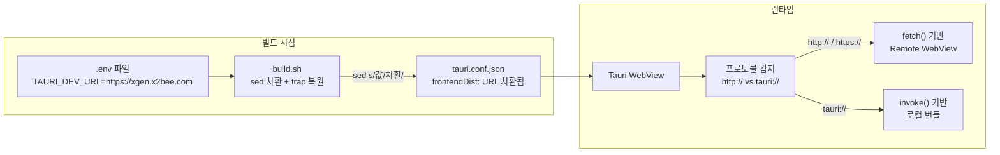
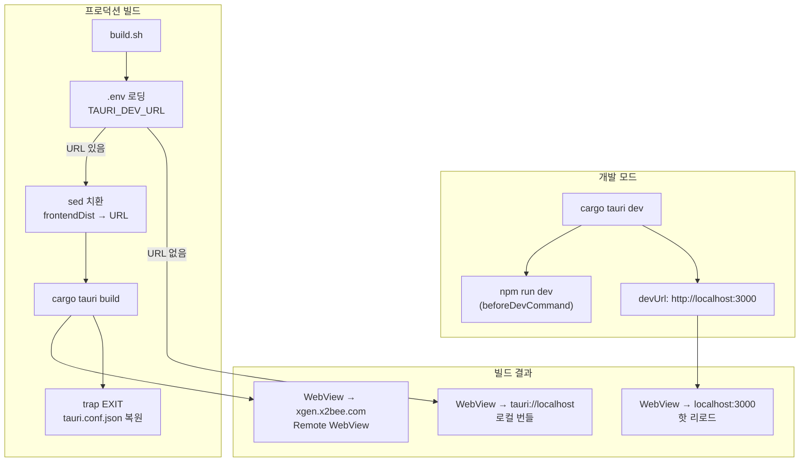

# TAURI_DEV_URL 환경변수로 개발/운영 환경 분리

## 세 가지 프론트엔드 로딩 방식

Tauri 앱의 WebView가 프론트엔드를 로드하는 방식은 세 가지다.

| 방식 | URL/경로 | 용도 |
|------|----------|------|
| 개발 서버 | `http://localhost:3000` | `cargo tauri dev` 시 핫 리로드 |
| Remote WebView | `https://xgen.x2bee.com` | 프론트엔드를 앱에 번들하지 않고 웹에서 로드 |
| 로컬 번들 | `tauri://localhost` (내부 프로토콜) | 프론트엔드를 앱 안에 포함 |

XGEN 데스크톱 앱은 처음에 세 번째 방식(로컬 번들)으로 시작했으나, Remote WebView 방식으로 전환했다. 프론트엔드를 앱에 번들하면, 프론트엔드 업데이트마다 데스크톱 앱 바이너리를 다시 빌드해서 배포해야 한다. xgen-frontend는 하루에도 여러 번 배포되는데, 그때마다 데스크톱 앱을 재배포하는 것은 비현실적이었다.

문제는 이 세 가지 방식을 `tauri.conf.json` 하나로 관리해야 한다는 것이었다.

```json
{
  "build": {
    "frontendDist": "../dist",
    "devUrl": "http://localhost:3000"
  }
}
```

`devUrl`은 `cargo tauri dev`에서, `frontendDist`는 `cargo tauri build`에서 사용된다. 개발 서버와 프로덕션 빌드가 각각 하나의 값만 가질 수 있다. 그런데 Remote WebView를 쓰려면 `frontendDist`에 URL을 넣어야 하고, 개발 중에는 `devUrl`을 `localhost:3000`으로 돌려야 한다. 설정 파일을 매번 수정하는 것은 커밋 충돌의 원인이 된다.

이 문제를 `TAURI_DEV_URL` 환경변수와 빌드 스크립트의 sed 치환으로 해결한 과정을 다룬다.

---

## 시행착오 타임라인

2026년 2월 7일 밤, 약 2시간 동안 연속된 커밋이 이 문제의 해결 과정을 보여준다.

```
# 커밋: feat: refactor to Remote WebView architecture
# 날짜: 2026-02-07 21:52
```

처음 시도는 단순했다. `tauri.conf.json`의 `frontendDist`를 `https://xgen.x2bee.com`으로 하드코딩했다. 프론트엔드를 번들하지 않고, 배포된 웹 프론트엔드를 WebView로 직접 로드하는 Remote WebView 방식이다.

이 커밋으로 프론트엔드 빌드 단계가 완전히 사라졌다. `cargo tauri build`만 하면 Rust 바이너리만 빌드되고, 프론트엔드는 런타임에 웹에서 로드된다.

```
# 커밋: fix: Remote WebView 모드 기본값을 Connected로 변경
# 날짜: 2026-02-07 22:44
```

첫 번째 문제가 발생했다. Remote WebView로 xgen.x2bee.com을 로드하니, API 호출이 401 인증 에러를 반환했다. 원인은 프론트엔드가 `Standalone` 모드에서 시작되어, Tauri IPC로 API를 호출하려 했기 때문이다. Remote WebView에서는 이미 웹 서버와 통신하므로 `Connected` 모드여야 한다. 기본 모드를 `Connected`로 바꿔봤다.

```
# 커밋: revert: 기본 모드를 Standalone으로 복원
# 날짜: 2026-02-07 23:05
```

잘못된 수정이었다. Connected 모드로 바꾸니, 앱에서 Gateway URL을 수동으로 입력해야 했다. 그런데 Remote WebView에서는 프론트엔드가 이미 xgen.x2bee.com에서 로드되므로, 별도의 Gateway URL이 필요 없다. 프론트엔드의 `NEXT_PUBLIC_BACKEND_HOST` 환경변수에 이미 올바른 Gateway 주소가 번들되어 있기 때문이다. Standalone으로 복원했다.

```
# 커밋: feat: protocol-based Remote WebView detection in apiClient
# 날짜: 2026-02-07 23:21
```

핵심 해결책이 나왔다. URL을 하드코딩하는 대신, 프로토콜로 현재 환경을 감지하는 것이다.

```javascript
// apiClient.js — Remote WebView 감지

function isRemoteWebView() {
  if (typeof window === 'undefined') return false;
  const protocol = window.location.protocol;
  // http:// 또는 https:// → 웹에서 로드 (Remote WebView 또는 브라우저)
  // tauri:// → 로컬 번들에서 로드
  return protocol === 'http:' || protocol === 'https:';
}
```

로컬에 번들된 프론트엔드는 `tauri://localhost`에서 실행된다. Remote WebView나 일반 브라우저에서는 `http://` 또는 `https://`에서 실행된다. 프로토콜 하나로 모든 분기가 해결된다.

이 감지를 기반으로 API 클라이언트가 자동으로 적절한 모드를 선택한다. Remote WebView에서 로드되면 표준 fetch로 API를 호출하고(이미 같은 도메인이므로 CORS 문제가 없다), `tauri://`에서 로드되면 Tauri IPC를 사용한다.

```
# 커밋: feat: use TAURI_DEV_URL env var for Remote WebView URL
# 날짜: 2026-02-07 23:25
```

이제 URL을 하드코딩에서 환경변수로 바꿨다. `tauri.conf.json`의 `devUrl`을 `$TAURI_DEV_URL`로 설정했다.

```
# 커밋: fix: substitute TAURI_DEV_URL env var in build script
# 날짜: 2026-02-07 23:27
```

그런데 Tauri는 JSON 설정 파일에서 `$VAR` 구문을 네이티브로 지원하지 않았다. `devUrl: "$TAURI_DEV_URL"`이라고 쓰면, 문자열 `$TAURI_DEV_URL`을 그대로 URL로 사용하려고 시도한다. 빌드 스크립트에서 `sed`로 치환하는 방식으로 우회했다.

---

## 최종 아키텍처



빌드 시점에 `.env` 파일에서 URL을 읽어 `tauri.conf.json`에 주입하고, 런타임에는 프로토콜 감지로 API 경로를 자동 결정한다.

---

## tauri.conf.json 설정

현재 설정은 다음과 같다.

```json
{
  "build": {
    "frontendDist": "../dist",
    "devUrl": "http://localhost:3000",
    "beforeDevCommand": { "script": "npm run dev", "cwd": "../frontend" },
    "beforeBuildCommand": { "script": "bash scripts/tauri-build.sh", "cwd": "../frontend" }
  }
}
```

`devUrl`은 기본값으로 `http://localhost:3000`이 들어가 있다. 개발 모드(`cargo tauri dev`)에서는 이 값이 그대로 사용되어 로컬 Next.js 개발 서버에 연결된다. `beforeDevCommand`가 자동으로 `npm run dev`를 실행해서 개발 서버를 띄운다.

`frontendDist`는 `../dist`로 설정되어 있다. 프로덕션 빌드에서는 빌드 스크립트(`tauri-build.sh`)가 이 값을 필요에 따라 Remote WebView URL로 치환한다.

---

## 빌드 스크립트: sed 치환과 trap 복원

핵심은 빌드 스크립트에서 `tauri.conf.json`을 임시로 수정하고, 빌드가 끝나면 원본을 복원하는 것이다.

```bash
#!/bin/bash
# scripts/build.sh (환경변수 치환 부분)

set -e

# .env 파일 로딩
if [ -f "src-tauri/.env" ]; then
    export $(grep -v '^#' src-tauri/.env | xargs)
fi

# 기본값 설정
TAURI_DEV_URL="${TAURI_DEV_URL:-https://xgen.x2bee.com}"

# tauri.conf.json 백업
cp src-tauri/tauri.conf.json src-tauri/tauri.conf.json.bak

# 빌드 완료 또는 실패 시 원본 복원
trap 'mv src-tauri/tauri.conf.json.bak src-tauri/tauri.conf.json' EXIT

# URL 치환 — frontendDist를 Remote WebView URL로 변경
sed -i "s|\"frontendDist\": \"../dist\"|\"frontendDist\": \"${TAURI_DEV_URL}\"|" \
    src-tauri/tauri.conf.json

# 빌드 설정 요약 출력
echo "=== Build Configuration ==="
echo "TAURI_DEV_URL: ${TAURI_DEV_URL}"
echo "frontendDist: ${TAURI_DEV_URL}"
echo "=========================="

# Tauri 빌드 실행
cd src-tauri
cargo tauri build
```

세 가지 핵심 메커니즘이 있다.

**trap EXIT**: 빌드가 성공하든 실패하든, 스크립트가 종료될 때 `tauri.conf.json`을 원본으로 복원한다. `Ctrl+C`로 중단해도 복원된다. 이 trap이 없으면 빌드 실패 시 수정된 JSON이 그대로 남아서 git diff에 잡힌다.

**sed 치환**: `frontendDist`의 값을 `../dist`에서 환경변수 값으로 교체한다. `|`를 delimiter로 쓴 이유는 URL에 `/`가 포함되기 때문이다. `sed -i "s/old/new/"` 대신 `sed -i "s|old|new|"`을 사용한다.

**기본값 폴백**: `TAURI_DEV_URL`이 설정되지 않으면 `https://xgen.x2bee.com`을 기본값으로 사용한다. CI/CD에서 빌드할 때 환경변수를 빼먹어도 정상 동작한다.

---

## .env 파일 관리

환경변수는 `src-tauri/.env` 파일로 관리한다.

```bash
# src-tauri/.env
TAURI_DEV_URL=https://xgen.x2bee.com
```

`.env` 파일은 `tauri.conf.json`의 `bundle.resources`에 포함되어 앱 바이너리에 번들된다.

```json
{
  "bundle": {
    "resources": [".env"]
  }
}
```

앱 실행 시 `.env`를 로드하는 순서가 있다.

```rust
// src-tauri/src/lib.rs (개념적 흐름)

// 1. 실행 파일 옆의 .env
// 2. Resources 디렉토리의 .env (번들된 파일)
// 3. CWD(현재 작업 디렉토리)의 .env
```

개발 중에는 프로젝트 루트의 `.env`가 로드되고, 프로덕션에서는 번들된 `.env`가 로드된다. 같은 파일 하나로 두 환경을 커버한다.

---

## Capabilities: Remote WebView 권한

Remote WebView에서 Tauri IPC를 호출하려면, `capabilities/default.json`에 적절한 권한이 있어야 한다.

```json
{
  "identifier": "default",
  "windows": ["main"],
  "permissions": [
    "core:default",
    "core:event:default",
    "core:window:default",
    "shell:allow-open",
    "shell:allow-execute",
    "shell:allow-spawn",
    "fs:allow-read-text-file",
    "fs:allow-write-text-file",
    "dialog:allow-open",
    "dialog:allow-save",
    "http:default",
    {
      "identifier": "http:allow-fetch",
      "allow": [
        { "url": "http://**" },
        { "url": "https://**" }
      ]
    },
    {
      "identifier": "http:allow-fetch-cancel",
      "allow": [
        { "url": "http://**" },
        { "url": "https://**" }
      ]
    },
    {
      "identifier": "http:allow-fetch-read-body",
      "allow": [
        { "url": "http://**" },
        { "url": "https://**" }
      ]
    },
    {
      "identifier": "http:allow-fetch-send",
      "allow": [
        { "url": "http://**" },
        { "url": "https://**" }
      ]
    }
  ]
}
```

`http:allow-fetch`에 `http://**`와 `https://**`를 모두 허용한 이유는, Remote WebView에서 로드된 프론트엔드가 Tauri HTTP 플러그인을 통해 외부 API를 호출할 수 있도록 하기 위해서다.

---

## 쿠키 vs localStorage: tauri:// 프로토콜의 함정

Remote WebView가 아닌 로컬 번들 모드에서 발견된 문제도 있었다. `tauri://localhost` 프로토콜에서는 `document.cookie`가 작동하지 않는다.

```
# 문제 상황
# Dev 모드: http://localhost:3000 → document.cookie 정상 작동
# Release 빌드: tauri://localhost → document.cookie 작동 안 함
```

웹 프론트엔드에서 인증 토큰을 쿠키에 저장하고 있었는데, Tauri Release 빌드에서 로그인이 안 되는 버그가 발생했다. `tauri://`는 HTTP가 아닌 커스텀 프로토콜이라 브라우저의 쿠키 메커니즘이 동작하지 않기 때문이다.

해결책은 Tauri 환경을 감지하여 `localStorage`를 대신 사용하는 것이다.

```javascript
// cookieUtils.js

const isTauriEnv = () => {
    if (typeof window === 'undefined') return false;
    return '__TAURI__' in window || '__TAURI_INTERNALS__' in window;
};

export const setCookieAuth = (key, value) => {
    if (isTauriEnv()) {
        localStorage.setItem(key, value);
        return;
    }
    setCookie(key, value, days, options);
};

export const getAuthCookie = (key) => {
    if (isTauriEnv()) {
        return localStorage.getItem(key);
    }
    return getCookie(key);
};
```

`__TAURI__`와 `__TAURI_INTERNALS__` 두 가지를 체크하는 이유는, Tauri 2.0에서 내부 변수명이 바뀌었기 때문이다. 하위 호환성을 위해 둘 다 확인한다.

Remote WebView 모드에서는 이 문제가 발생하지 않는다. `https://xgen.x2bee.com`에서 로드되므로 표준 HTTP 쿠키가 정상 작동한다. 이것도 Remote WebView 방식의 장점 중 하나다.

---

## HTTP 플러그인 버전 일치 문제

Tauri HTTP 플러그인은 프론트엔드(@tauri-apps/plugin-http)와 Rust(tauri-plugin-http)의 버전이 정확히 일치해야 한다.

```
# 에러 메시지
TypeError: invalid args `streamChannel` for command `fetch_read_body`
```

이 에러가 발생하면 버전 불일치가 원인이다.

```json
// frontend/package.json
"@tauri-apps/plugin-http": "^2.5.5"
```

```toml
# src-tauri/Cargo.toml
tauri-plugin-http = "2.5.5"
```

두 버전을 정확히 맞춰야 한다. `^` 시맨틱 버저닝 때문에 npm이 더 높은 패치 버전을 설치할 수 있으므로, `package-lock.json`의 실제 설치 버전을 확인해야 한다.

```bash
# 버전 확인
grep "plugin-http" frontend/package-lock.json | head -3
grep -A2 'name = "tauri-plugin-http"' src-tauri/Cargo.lock
```

---

## 빌드 타임 vs 런타임 환경변수

Next.js의 `NEXT_PUBLIC_*` 환경변수는 빌드 타임에 정적으로 번들된다는 점이 혼란의 원인이었다.

| 시점 | 환경변수 | 변경 가능 여부 |
|------|----------|--------------|
| Docker 빌드 | `ARG NEXT_PUBLIC_BACKEND_HOST` | 빌드마다 다르게 설정 가능 |
| Docker 런타임 | `ENV NEXT_PUBLIC_BACKEND_HOST` | 변경 불가 (이미 번들됨) |
| Tauri 개발 | `frontend/.env.local` | 개발 서버 재시작 시 반영 |
| Tauri 프로덕션 | 번들된 값 | 변경 불가 |
| Connected 모드 | `settings.json` > `serverUrl` | 런타임 오버라이드 |

프론트엔드의 `NEXT_PUBLIC_BACKEND_HOST`에 빌드 시점의 기본 Gateway URL이 들어가지만, Connected 모드에서는 사용자가 설정 화면에서 입력한 `serverUrl`이 이를 오버라이드한다. 이 이중 구조가 있어야 "기본값으로 동작하되, 사용자가 바꿀 수 있는" 유연성이 생긴다.

```
# 우선순위
1. settings.json의 serverUrl (사용자 설정)
2. NEXT_PUBLIC_BACKEND_HOST (빌드 타임 기본값)
3. 하드코딩 폴백 (없음 — Standalone으로 동작)
```

---

## Release 빌드 디버깅

환경 분리와 관련된 문제를 디버깅할 때, Release 빌드에서 DevTools를 열 수 있어야 한다.

```toml
# src-tauri/Cargo.toml — 디버깅 시에만 활성화
tauri = { version = "2.8.5", features = ["devtools"] }
```

```rust
// src-tauri/src/lib.rs (setup 훅)
if let Some(window) = app.get_webview_window("main") {
    window.open_devtools();
    log::info!("DevTools opened for debugging");
}
```

`devtools` feature를 활성화하면, Release 빌드에서도 WebView Inspector를 열 수 있다. Remote WebView에서 API 호출이 실패할 때, 네트워크 탭에서 요청/응답을 확인할 수 있다.

주요 디버깅 포인트는 다음과 같다.

```
[getTauriFetch] HTTP plugin imported successfully    ← 플러그인 로드 성공
[tauriApiClient] Token from cookie: "eyJ..."         ← 토큰 읽기 성공
[tauriApiClient] Response status: 200                ← API 호출 성공
```

토큰이 `null`이면 쿠키/localStorage 문제, `fetch_read_body` 에러면 플러그인 버전 문제, `not allowed by ACL` 에러면 capabilities 권한 문제다.

---

## 최종 빌드 플로우



개발 모드는 `cargo tauri dev` 한 줄이면 된다. `beforeDevCommand`가 `npm run dev`를 자동 실행하고, WebView는 `localhost:3000`에 연결된다.

프로덕션은 `build.sh`가 `.env`에서 `TAURI_DEV_URL`을 읽고, 값이 있으면 `tauri.conf.json`의 `frontendDist`를 Remote WebView URL로 치환한다. 값이 없으면 기본값(`../dist`)을 그대로 사용하여 로컬 번들로 빌드된다. 어느 쪽이든 `trap EXIT`이 원본 JSON을 복원한다.

---

## 결과

`TAURI_DEV_URL` 환경변수 도입으로 달성한 것은 세 가지다.

**설정 파일 충돌 방지**: `tauri.conf.json`에 환경별 URL을 하드코딩하지 않으므로, 개발자마다 다른 설정으로 인한 git 충돌이 사라졌다. URL은 `.env` 파일(gitignore 대상)에서 관리된다.

**빌드 유연성**: 같은 소스에서 Remote WebView 앱과 로컬 번들 앱을 모두 빌드할 수 있다. `TAURI_DEV_URL`을 설정하면 Remote WebView, 설정하지 않으면 로컬 번들이 된다. CI/CD에서 환경변수만 바꾸면 다른 배포 타깃이 나온다.

**프로토콜 기반 자동 감지**: 런타임에 `window.location.protocol`만 확인하면 현재 프론트엔드가 어디서 로드되었는지 알 수 있다. URL 목록을 하드코딩할 필요 없이, `http://`이면 웹 기반, `tauri://`이면 로컬 기반으로 자동 분기된다. 새로운 배포 URL이 추가되어도 코드 수정이 필요 없다.
