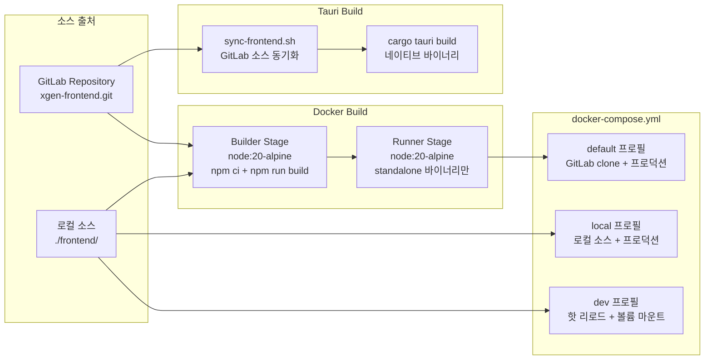

# Tauri + Docker: 데스크톱 앱의 컨테이너화 전략

## 왜 데스크톱 앱에 Docker가 필요한가

XGEN 데스크톱 앱(xgen-app)은 Tauri 2.0 기반 AI 워크스테이션이다. Rust 백엔드에서 mistral.rs로 로컬 LLM 추론을 돌리고, Next.js 프론트엔드를 WebView로 렌더링한다. 여기까지만 보면 Docker가 필요 없어 보인다. 데스크톱 앱이니까 `cargo tauri build`로 바이너리를 뽑으면 끝이다.

하지만 실제 운영 구조는 더 복잡했다. XGEN 플랫폼은 데스크톱 앱 단독이 아니라 K8s 위에 올라간 웹 서비스도 함께 운영한다. 같은 xgen-frontend 코드베이스를 데스크톱 WebView와 웹 서비스 양쪽에서 사용하는데, 웹 서비스 쪽은 Docker 컨테이너로 배포해야 했다.

문제는 세 가지였다.

첫째, 프론트엔드 소스의 출처가 두 가지다. GitLab에서 클론하거나, 로컬에 이미 있는 소스를 쓰거나. 개발자마다 다른 방식을 쓰기 때문에 둘 다 지원해야 했다.

둘째, 프로덕션과 개발 환경의 Docker 이미지가 완전히 달라야 했다. 프로덕션은 Next.js standalone 출력으로 최소 이미지를 만들고, 개발은 핫 리로드가 되어야 한다.

셋째, Tauri 빌드와 Docker 빌드의 관심사 분리가 필요했다. `.dockerignore`로 `src-tauri` 디렉토리를 제외하여, Docker 이미지에는 프론트엔드만 들어가도록 해야 했다.

```
# 커밋: Add Docker configuration and optimize build process
# 날짜: 2026-01-04 15:22
```

이 커밋 하나에 Dockerfile, Dockerfile.dev, docker-compose.yml, .dockerignore가 모두 들어갔다. 아키텍처를 설계하고 한 번에 넣은 것이다.

---

## 전체 아키텍처



핵심은 Tauri 빌드와 Docker 빌드가 완전히 분리된다는 점이다. Docker는 웹 서비스 배포용이고, Tauri는 데스크톱 앱 빌드용이다. 같은 프론트엔드 소스를 공유하지만, 빌드 파이프라인은 독립적으로 동작한다.

---

## 멀티 스테이지 Dockerfile

### Builder Stage

```dockerfile
# Stage 1: Dependencies & Build
FROM node:20-alpine AS builder

# 네이티브 모듈(sharp, canvas 등) 빌드에 필요한 의존성
RUN apk add --no-cache \
    git \
    libc6-compat \
    python3 \
    make \
    g++

WORKDIR /app

# 빌드 인자 — 소스 출처 선택
ARG FRONTEND_REPO=http://gitlab.x2bee.com/tech-team/ai-team/xgen/xgen-frontend.git
ARG FRONTEND_BRANCH=main
ARG USE_LOCAL_SOURCE=false

# Option 1: GitLab에서 클론
RUN if [ "$USE_LOCAL_SOURCE" = "false" ]; then \
    git clone --depth 1 --branch ${FRONTEND_BRANCH} ${FRONTEND_REPO} frontend; \
    fi

# Option 2: 로컬 소스 복사
COPY frontend/ /app/frontend-local/
RUN if [ "$USE_LOCAL_SOURCE" = "true" ]; then \
    mv /app/frontend-local /app/frontend; \
    else \
    rm -rf /app/frontend-local; \
    fi
```

`USE_LOCAL_SOURCE` 빌드 인자 하나로 소스 출처를 분기한다. `false`(기본값)이면 GitLab에서 `--depth 1`로 shallow clone하고, `true`이면 로컬 `frontend/` 폴더를 복사한다. 두 경로 모두 최종적으로 `/app/frontend`에 소스가 놓이므로, 이후 빌드 단계는 동일하다.

Next.js standalone 출력 설정을 자동 주입하는 부분도 있다.

```dockerfile
# standalone 출력 설정이 없으면 자동 추가
RUN if ! grep -q "output.*standalone" next.config.ts 2>/dev/null; then \
    sed -i "s/const nextConfig: NextConfig = {/const nextConfig: NextConfig = {\n    output: 'standalone',/" next.config.ts; \
    fi

# 의존성 설치 (캐시 최적화)
RUN npm ci --legacy-peer-deps --prefer-offline

# 빌드
ENV NODE_OPTIONS="--max-old-space-size=4096"
RUN npm run build
```

`next.config.ts`에 `output: 'standalone'`이 없으면 `sed`로 자동 삽입한다. 이렇게 한 이유는 xgen-frontend 소스가 원래 웹 배포용이라 standalone 설정이 없기 때문이다. Docker 빌드에서만 필요한 설정을 소스 변경 없이 주입하는 것이다.

### Runner Stage

```dockerfile
# Stage 2: Production Runtime
FROM node:20-alpine AS runner

WORKDIR /app

RUN apk add --no-cache libc6-compat wget \
    && rm -rf /var/cache/apk/*

ENV NODE_ENV=production
ENV NEXT_TELEMETRY_DISABLED=1

# 비root 유저 생성
RUN addgroup --system --gid 1001 nodejs \
    && adduser --system --uid 1001 nextjs

# 프로덕션 파일만 복사
COPY --from=builder /app/frontend/public ./public
COPY --from=builder --chown=nextjs:nodejs /app/frontend/.next/standalone ./
COPY --from=builder --chown=nextjs:nodejs /app/frontend/.next/static ./.next/static

# 빌드 메타데이터
ARG BUILD_DATE
ARG GIT_COMMIT
LABEL org.opencontainers.image.created="${BUILD_DATE}" \
      org.opencontainers.image.revision="${GIT_COMMIT}"

USER nextjs
EXPOSE 3000

HEALTHCHECK --interval=30s --timeout=10s --start-period=40s --retries=3 \
    CMD wget --no-verbose --tries=1 --spider http://localhost:3000/ || exit 1

CMD ["node", "server.js"]
```

Runner Stage의 설계 포인트는 네 가지다.

**최소 파일 복사**: Builder에서 `.next/standalone`과 `.next/static`만 가져온다. `node_modules`의 수천 개 파일 대신 Next.js가 필요한 의존성만 추출한 standalone 디렉토리를 사용하므로 이미지 크기가 대폭 줄어든다.

**비root 실행**: `nextjs:1001` 유저를 만들어 컨테이너가 root로 실행되지 않도록 했다. K8s SecurityContext와도 호환된다.

**OCI 라벨**: `BUILD_DATE`와 `GIT_COMMIT`을 라벨로 찍어서, 운영 중인 컨테이너가 어느 커밋에서 빌드되었는지 추적할 수 있다.

**헬스체크**: `wget`으로 30초마다 `/` 경로를 찌른다. K8s의 livenessProbe와 별개로, Docker 자체의 헬스 상태도 관리한다.

---

## 개발용 Dockerfile

```dockerfile
# Development Mode — Hot reload
FROM node:20-alpine

RUN apk add --no-cache git libc6-compat python3 make g++

WORKDIR /app/frontend

ENV NODE_ENV=development
ENV NEXT_TELEMETRY_DISABLED=1
ENV WATCHPACK_POLLING=true

EXPOSE 3000

CMD ["sh", "-c", "npm install --legacy-peer-deps && npm run dev"]
```

개발용 이미지는 단일 스테이지다. 핵심은 `WATCHPACK_POLLING=true`이다. Docker 컨테이너 안에서 파일 시스템 이벤트(inotify)가 호스트 볼륨 마운트에서 제대로 전달되지 않는 경우가 있다. polling 모드를 켜면 파일 변경을 주기적으로 감지하므로 핫 리로드가 안정적으로 동작한다.

`npm install`을 CMD에 넣은 이유는, 볼륨 마운트로 소스를 넣으면 `node_modules`가 호스트의 것으로 덮어씌워질 수 있기 때문이다. 컨테이너 시작 시점에 의존성을 설치해서 환경 불일치를 방지한다.

---

## Docker Compose: 3가지 프로필

```yaml
services:
  # 기본: GitLab 클론 + 프로덕션
  xgen-frontend:
    build:
      context: .
      dockerfile: Dockerfile
      args:
        FRONTEND_REPO: ${FRONTEND_REPO:-http://gitlab.x2bee.com/.../xgen-frontend.git}
        FRONTEND_BRANCH: ${FRONTEND_BRANCH:-main}
        USE_LOCAL_SOURCE: ${USE_LOCAL_SOURCE:-false}
    image: xgen-frontend:${IMAGE_TAG:-latest}
    ports:
      - "${HOST_PORT:-3000}:3000"
    environment:
      - NEXT_PUBLIC_BACKEND_HOST=${NEXT_PUBLIC_BACKEND_HOST:-http://localhost}
      - NEXT_PUBLIC_BACKEND_PORT=${NEXT_PUBLIC_BACKEND_PORT:-8000}
    deploy:
      resources:
        limits:
          memory: 512M
        reservations:
          memory: 256M
    logging:
      driver: "json-file"
      options:
        max-size: "10m"
        max-file: "3"
    networks:
      - xgen-network

  # local 프로필: 로컬 소스 + 프로덕션
  xgen-frontend-local:
    profiles:
      - local
    build:
      context: .
      dockerfile: Dockerfile
      args:
        USE_LOCAL_SOURCE: "true"
    image: xgen-frontend:local
    ports:
      - "${HOST_PORT:-3000}:3000"
    networks:
      - xgen-network

  # dev 프로필: 핫 리로드
  xgen-frontend-dev:
    profiles:
      - dev
    build:
      context: .
      dockerfile: Dockerfile.dev
    ports:
      - "${HOST_PORT:-3000}:3000"
    volumes:
      - ./frontend:/app/frontend:delegated
      - frontend_node_modules:/app/frontend/node_modules
    networks:
      - xgen-network

volumes:
  frontend_node_modules:

networks:
  xgen-network:
    driver: bridge
```

세 가지 프로필의 사용법은 다음과 같다.

```bash
# 기본 (GitLab 클론 → 프로덕션 이미지)
docker-compose up xgen-frontend

# 로컬 소스로 프로덕션 빌드
docker-compose --profile local up xgen-frontend-local

# 개발 모드 (핫 리로드)
docker-compose --profile dev up xgen-frontend-dev
```

**리소스 제한**: 기본 프로필에 `memory: 512M` 제한을 걸었다. Next.js standalone은 메모리 효율이 좋아서 512MB면 충분하다. `reservations: 256M`은 최소 보장 메모리다.

**로그 관리**: JSON 파일 드라이버로 로그를 10MB * 3파일로 제한했다. Docker 로그가 디스크를 채우는 사고를 방지한다.

**볼륨 분리**: dev 프로필에서 `frontend_node_modules`를 named volume으로 분리했다. 호스트의 `node_modules`가 컨테이너 안의 것을 덮어쓰는 문제를 방지하는 표준 패턴이다. `:delegated` 플래그는 macOS에서 볼륨 마운트 성능을 개선한다.

---

## .dockerignore: Tauri와 Docker의 관심사 분리

Docker 빌드에서 `src-tauri` 디렉토리를 제외하는 것이 중요했다. Tauri Rust 바이너리와 그 의존성은 웹 서비스에 필요 없고, Docker 빌드 컨텍스트만 불필요하게 커진다.

```
# .dockerignore
src-tauri/
*.md
.git/
node_modules/
.next/
```

`src-tauri/`를 제외함으로써 Docker는 순수하게 Next.js 프론트엔드만 빌드한다. 이것이 하나의 모노레포에서 데스크톱 앱과 웹 서비스를 동시에 관리하는 핵심이다. 같은 루트 디렉토리에 `Dockerfile`과 `src-tauri/`가 공존하지만, 각자의 빌드 파이프라인은 완전히 독립적으로 동작한다.

---

## Tauri 빌드 스크립트

Docker가 웹 서비스를 담당한다면, Tauri 빌드 스크립트는 데스크톱 앱을 담당한다.

```bash
#!/bin/bash
# scripts/build.sh — Tauri 데스크톱 앱 빌드

set -e

SCRIPT_DIR="$(cd "$(dirname "${BASH_SOURCE[0]}")" && pwd)"
PROJECT_ROOT="$(dirname "$SCRIPT_DIR")"

# 파라미터 파싱
SKIP_SYNC=false
DEV_MODE=false

while [[ $# -gt 0 ]]; do
    case $1 in
        --skip-sync) SKIP_SYNC=true; shift ;;
        --dev)       DEV_MODE=true; shift ;;
    esac
done

# Step 1: 프론트엔드 소스 동기화 (GitLab → ./frontend)
if [ "$SKIP_SYNC" = false ]; then
    bash "$SCRIPT_DIR/sync-frontend.sh"
fi

# Step 2: 의존성 설치
cd "$PROJECT_ROOT/frontend"
npm install

# Step 3: Tauri 빌드
cd "$PROJECT_ROOT/src-tauri"
if [ "$DEV_MODE" = true ]; then
    cargo tauri dev
else
    cargo tauri build
fi
```

이 스크립트는 3단계로 동작한다.

1. `sync-frontend.sh`로 GitLab에서 xgen-frontend 소스를 `./frontend`에 동기화한다. 이미 있으면 `git pull`만 한다. `--skip-sync` 옵션으로 건너뛸 수 있다.

2. `npm install`로 프론트엔드 의존성을 설치한다.

3. `cargo tauri build`로 Rust 바이너리를 빌드한다. `--dev` 옵션이면 `cargo tauri dev`로 개발 서버를 띄운다. 이때 `tauri.conf.json`의 `beforeDevCommand`가 자동으로 `npm run dev`를 실행하므로, 프론트엔드 개발 서버도 함께 뜬다.

---

## Tauri 빌드 설정

`tauri.conf.json`에서 빌드 관련 설정은 다음과 같다.

```json
{
  "build": {
    "frontendDist": "../dist",
    "devUrl": "http://localhost:3000",
    "beforeDevCommand": { "script": "npm run dev", "cwd": "../frontend" },
    "beforeBuildCommand": { "script": "bash scripts/tauri-build.sh", "cwd": "../frontend" }
  },
  "bundle": {
    "active": true,
    "targets": "all"
  }
}
```

`frontendDist`는 프로덕션 빌드에서 사용할 프론트엔드 번들 경로다. `devUrl`은 개발 모드에서 WebView가 로드할 URL이다.

`targets: "all"`은 현재 플랫폼에서 가능한 모든 패키지 형식을 빌드한다는 뜻이다. Linux에서는 `.deb`과 `.rpm`이, macOS에서는 `.dmg`과 `.app`이 생성된다.

```
# 커밋: Update tauri configuration to specify build targets for Linux packages (deb and rpm)
# 날짜: 2026-01-04 17:15
```

처음에는 `targets`를 명시하지 않아서 기본값으로 빌드되었는데, Linux에서 deb/rpm 패키지를 명시적으로 생성하도록 변경했다.

---

## 빌드 스크립트 개선: WSL과 macOS 호환

```
# 커밋: fix: Support cargo command detection in build script
# 날짜: 2026-02-12 11:43
```

나중에 Windows WSL 환경에서 빌드할 때 문제가 발생했다. `cargo` 명령어의 경로가 WSL과 네이티브 Linux에서 달랐다. 이를 해결하기 위해 빌드 스크립트에 cargo 경로 자동 감지 로직을 추가했다.

```
# 커밋: feat: Agent 데이터 자동화 + macOS 빌드 안정성 개선
# 날짜: 2026-02-11 08:30
```

macOS 빌드에서도 별도의 안정성 개선이 필요했다. macOS에서는 코드 서명과 노터라이제이션(notarization) 관련 설정이 Linux와 다르기 때문이다. 빌드 스크립트가 OS를 감지하여 적절한 번들 설정을 적용하도록 개선했다.

---

## 시행착오

### Next.js standalone과 환경 변수

가장 큰 함정은 Next.js의 `NEXT_PUBLIC_*` 환경 변수가 빌드 타임에 정적으로 번들된다는 점이었다. Docker 이미지를 빌드할 때 `NEXT_PUBLIC_BACKEND_HOST`를 설정하면, 런타임에 다른 값으로 바꿀 수 없다.

이 문제는 Connected 모드에서 `settings.json`의 `serverUrl`로 런타임 오버라이드하는 방식으로 우회했다. 빌드 타임에는 기본값을 넣고, 앱 실행 시 사용자가 설정한 URL을 우선 사용하는 것이다. 이 부분은 #112(API 추상화 레이어)에서 자세히 다룬다.

### 메모리 제한

Next.js 빌드 과정에서 `JavaScript heap out of memory` 에러가 발생했다. `NODE_OPTIONS="--max-old-space-size=4096"`으로 V8 힙 크기를 4GB로 올려서 해결했다. Builder Stage에서만 필요한 설정이다. Runner Stage에서는 standalone 서버가 256MB 이하로 동작한다.

### Volume 마운트와 node_modules

dev 프로필에서 호스트 소스를 볼륨 마운트하면, 호스트의 `node_modules`가 컨테이너 안의 것을 덮어쓰는 문제가 있었다. macOS에서 빌드한 네이티브 모듈은 Alpine Linux에서 동작하지 않기 때문이다.

해결책은 named volume(`frontend_node_modules`)으로 `node_modules`를 분리하는 것이다. 이렇게 하면 컨테이너가 시작될 때 `npm install`로 설치한 Alpine용 네이티브 모듈이 호스트 마운트에 의해 덮어씌워지지 않는다.

---

## 결과

Docker 컨테이너화를 통해 달성한 것은 세 가지다.

**빌드 파이프라인 분리**: 하나의 소스에서 데스크톱 앱(Tauri)과 웹 서비스(Docker) 두 가지 결과물이 나온다. `src-tauri`와 `Dockerfile`이 같은 디렉토리에 있지만, `.dockerignore`와 빌드 스크립트로 관심사가 완전히 분리된다.

**환경별 이미지**: 프로덕션(멀티 스테이지 최적화), 로컬 빌드(소스 직접 사용), 개발(핫 리로드) 세 가지 환경을 Compose 프로필로 전환한다. 같은 `docker-compose.yml` 하나로 관리된다.

**운영 안정성**: 리소스 제한(512MB), 로그 로테이션(10MB * 3), 헬스체크, 비root 실행 등 프로덕션 운영에 필요한 설정이 Dockerfile에 내장되어 있다. 별도의 K8s 매니페스트 없이도 `docker-compose up`만으로 안정적인 서비스가 뜬다.
