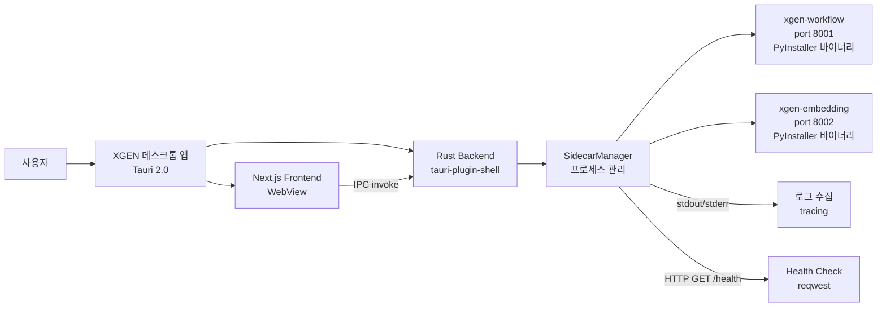
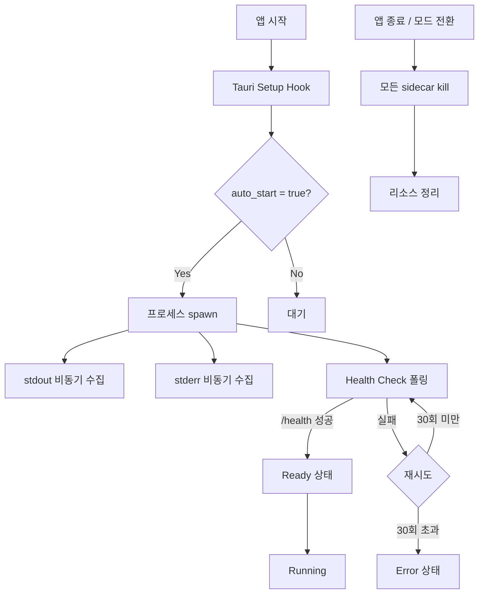

# Tauri Sidecar로 Python 워크플로우 엔진 자동 시작

## 세 가지 언어가 만나는 지점

XGEN 데스크톱 앱은 단일 언어로 만들어진 앱이 아니다. Rust(Tauri 백엔드), Next.js(프론트엔드), Python(AI 워크플로우) 세 가지 런타임이 하나의 앱 안에서 협력해야 한다. 쿠버네티스 환경에서는 각 서비스가 별도 Pod로 돌아가기 때문에 이 구조가 자연스럽다. `xgen-workflow`는 FastAPI 기반 워크플로우 실행 엔진으로 port 8001에서 동작하고, `xgen-embedding`은 임베딩 서버로 port 8002에서 동작한다. 각각 독립적인 컨테이너에서 시작되고, 헬스체크가 통과하면 서비스 디스커버리를 통해 연결된다.

그런데 데스크톱 앱에서는 상황이 완전히 다르다. 사용자의 로컬 머신에서 모든 서비스가 한 번에 실행되어야 한다. 사용자에게 "터미널을 열고 `python main.py`를 실행해주세요"라고 안내하는 건 데스크톱 앱이 아니라 개발 도구다. 앱을 더블클릭하면 Python 서비스가 자동으로 뜨고, 앱을 닫으면 함께 정리되어야 한다.

Tauri 2.0의 Sidecar 기능이 정확히 이 문제를 해결한다. 앱과 함께 외부 바이너리를 실행하고, 프로세스의 라이프사이클을 앱에 종속시키는 메커니즘이다. 이 글에서는 XGEN 데스크톱 앱에서 Python 기반 xgen-workflow와 xgen-embedding을 sidecar로 자동 관리하도록 구현한 전체 과정을 다룬다.

```
# 커밋: feat: Add sidecar auto-start for xgen-workflow and xgen-embedding
# 날짜: 2026-01-06 09:28
```

## 전체 아키텍처



핵심 구조는 단순하다. Tauri의 Rust 백엔드에 `SidecarManager`라는 서비스 계층을 두고, 이 매니저가 Python 바이너리의 시작, 종료, 상태 감시를 전담한다. 프론트엔드는 IPC를 통해 sidecar의 상태를 조회하거나 수동으로 시작/중지할 수 있다.

Python 서비스는 PyInstaller로 단일 바이너리로 패키징한 상태다. `src-tauri/binaries/` 디렉토리에 플랫폼별 바이너리(`xgen-workflow-x86_64-unknown-linux-gnu` 등)를 배치하면 Tauri가 빌드 시 자동으로 앱 번들에 포함시킨다.

## SidecarManager 설계

### 데이터 구조

`SidecarManager`는 두 개의 HashMap으로 구성된다. `configs`에 등록된 서비스 설정을, `processes`에 실행 중인 프로세스 핸들을 저장한다.

```rust
/// Sidecar service configuration
#[derive(Debug, Clone, Serialize, Deserialize)]
pub struct SidecarConfig {
    /// Service name (e.g., "xgen-workflow")
    pub name: String,
    /// Binary name in binaries/ directory
    pub binary_name: String,
    /// Port the service listens on
    pub port: u16,
    /// Environment variables
    pub env: HashMap<String, String>,
    /// Whether to auto-start on app launch
    pub auto_start: bool,
}

/// Status of a running sidecar
#[derive(Debug, Clone, Serialize, Deserialize)]
pub struct SidecarStatus {
    pub name: String,
    pub running: bool,
    pub port: u16,
    pub url: String,
    pub pid: Option<u32>,
    pub health_ok: bool,
}

/// Manages sidecar processes
pub struct SidecarManager {
    /// Running processes keyed by service name
    processes: HashMap<String, CommandChild>,
    /// Service configurations
    configs: HashMap<String, SidecarConfig>,
}
```

`SidecarConfig`에서 핵심적인 필드는 `auto_start`다. 이 값이 `true`인 서비스는 앱이 시작될 때 자동으로 프로세스를 spawn한다. `env` 필드는 Python 서비스에 전달할 환경변수인데, `APP_PORT`와 `APP_HOST`를 여기서 지정해 포트 충돌을 방지한다.

`SidecarStatus`는 프론트엔드에 노출되는 상태 정보다. `running`은 프로세스가 살아있는지, `health_ok`는 HTTP 헬스체크를 통과했는지를 별도로 추적한다. 프로세스가 떠 있어도 아직 서버가 리슨하지 않는 시점이 있기 때문에 이 구분이 중요하다.

### 기본 서비스 등록

`SidecarManager`가 생성될 때 xgen-workflow와 xgen-embedding 두 서비스를 기본으로 등록한다.

```rust
impl SidecarManager {
    pub fn new() -> Self {
        let mut manager = Self {
            processes: HashMap::new(),
            configs: HashMap::new(),
        };
        manager.register_default_configs();
        manager
    }

    fn register_default_configs(&mut self) {
        // xgen-workflow service
        let mut workflow_env = HashMap::new();
        workflow_env.insert("APP_PORT".to_string(), "8001".to_string());
        workflow_env.insert("APP_HOST".to_string(), "127.0.0.1".to_string());

        self.configs.insert(
            "xgen-workflow".to_string(),
            SidecarConfig {
                name: "xgen-workflow".to_string(),
                binary_name: "xgen-workflow".to_string(),
                port: 8001,
                env: workflow_env,
                auto_start: true,
            },
        );

        // xgen-embedding service
        let mut embedding_env = HashMap::new();
        embedding_env.insert("APP_PORT".to_string(), "8002".to_string());
        embedding_env.insert("APP_HOST".to_string(), "127.0.0.1".to_string());

        self.configs.insert(
            "xgen-embedding".to_string(),
            SidecarConfig {
                name: "xgen-embedding".to_string(),
                binary_name: "xgen-embedding".to_string(),
                port: 8002,
                env: embedding_env,
                auto_start: true,
            },
        );
    }
}
```

포트 번호를 설정 파일이 아니라 코드에 하드코딩한 것은 의도적이다. 데스크톱 앱에서는 K8s처럼 포트가 동적으로 할당되지 않고, 사용자가 포트를 바꿀 이유도 거의 없다. 8001, 8002라는 고정 포트를 사용하면 프론트엔드에서도 별도 설정 없이 서비스에 접근할 수 있다.

`APP_HOST`를 `127.0.0.1`로 고정한 것도 보안상 중요하다. `0.0.0.0`으로 바인딩하면 같은 네트워크의 다른 기기에서 워크플로우 엔진에 접근할 수 있게 되는데, 데스크톱 앱에서는 로컬 전용이 맞다.

## 프로세스 라이프사이클

### 시작부터 Ready까지의 흐름



프로세스의 상태는 크게 네 단계로 구분된다.

1. **Spawned**: 프로세스가 OS 레벨에서 생성됨. 아직 서버가 리슨하지 않는 상태
2. **Starting**: spawn 직후, health check를 시작하는 시점
3. **Ready**: /health 엔드포인트가 응답을 반환. 서비스 사용 가능
4. **Error**: health check가 30회(60초) 실패. 서비스 시작 실패로 판단

Python 서비스 특성상 모델 로딩이 포함되어 있어서 cold start가 수 초에서 수십 초까지 걸릴 수 있다. 임베딩 모델을 메모리에 올리는 `xgen-embedding`이 특히 느리다. 그래서 타임아웃을 60초로 넉넉하게 잡았다.

### 프로세스 시작 코드

`start_sidecar` 메서드가 전체 시작 로직을 담당한다. `tauri-plugin-shell`의 sidecar API를 사용해 프로세스를 spawn하고, 별도 tokio 태스크에서 stdout/stderr을 비동기로 수집한다.

```rust
pub async fn start_sidecar(
    &mut self,
    app_handle: &tauri::AppHandle,
    name: &str,
    extra_env: Option<HashMap<String, String>>,
) -> Result<SidecarStatus> {
    // 이미 실행 중인 sidecar 중복 시작 방지
    if self.processes.contains_key(name) {
        return Err(AppError::Workflow(format!(
            "Sidecar '{}' is already running", name
        )));
    }

    let config = self.configs.get(name)
        .ok_or_else(|| AppError::Workflow(format!("Unknown sidecar: {}", name)))?
        .clone();

    // 기본 환경변수 + 추가 환경변수 병합
    let mut env = config.env.clone();
    if let Some(extra) = extra_env {
        env.extend(extra);
    }

    // Tauri shell plugin으로 sidecar 실행
    let sidecar_name = format!("binaries/{}", config.binary_name);
    let shell = app_handle.shell();

    let mut command = shell.sidecar(&sidecar_name)
        .map_err(|e| AppError::Workflow(
            format!("Failed to create sidecar command: {}", e)
        ))?;

    // 환경변수 설정
    for (key, value) in &env {
        command = command.env(key, value);
    }

    // 프로세스 spawn
    let (mut rx, child) = command.spawn()
        .map_err(|e| AppError::Workflow(
            format!("Failed to spawn sidecar: {}", e)
        ))?;

    let pid = child.pid();
    self.processes.insert(name.to_string(), child);

    // stdout/stderr 비동기 수집 태스크
    let service_name = name.to_string();
    spawn(async move {
        use tauri_plugin_shell::process::CommandEvent;
        while let Some(event) = rx.recv().await {
            match event {
                CommandEvent::Stdout(data) => {
                    if let Ok(line) = String::from_utf8(data) {
                        tracing::info!("[{}] {}", service_name, line.trim());
                    }
                }
                CommandEvent::Stderr(data) => {
                    if let Ok(line) = String::from_utf8(data) {
                        tracing::warn!("[{}] {}", service_name, line.trim());
                    }
                }
                CommandEvent::Terminated(payload) => {
                    tracing::info!(
                        "[{}] Process terminated with code: {:?}",
                        service_name, payload.code
                    );
                    break;
                }
                _ => {}
            }
        }
    });

    // 서비스 시작 대기 후 health check
    tokio::time::sleep(tokio::time::Duration::from_millis(500)).await;

    let url = format!("http://127.0.0.1:{}", config.port);
    let health_ok = self.check_health(&url).await;

    Ok(SidecarStatus {
        name: name.to_string(),
        running: true,
        port: config.port,
        url,
        pid: Some(pid),
        health_ok,
    })
}
```

여기서 주목할 부분이 몇 가지 있다.

`extra_env` 파라미터를 받아서 기본 환경변수에 병합하는 구조다. 프론트엔드에서 Postgres 호스트나 Redis 호스트 같은 런타임 설정을 동적으로 주입할 수 있게 한 것이다. 기본값은 config에 정의되어 있지만, 사용자가 설정 화면에서 변경하면 `extra_env`로 덮어쓴다.

`shell.sidecar(&sidecar_name)` 호출이 핵심이다. Tauri의 sidecar API는 `binaries/` 접두사를 붙이면 `src-tauri/binaries/` 디렉토리에서 플랫폼에 맞는 바이너리를 자동으로 찾는다. Linux에서는 `xgen-workflow-x86_64-unknown-linux-gnu`, macOS에서는 `xgen-workflow-aarch64-apple-darwin` 같은 이름 규칙을 따른다.

stdout과 stderr는 별도 tokio 태스크에서 비동기로 수집한다. 이 태스크가 없으면 OS의 파이프 버퍼가 가득 차서 자식 프로세스가 블로킹될 수 있다. `tracing` 크레이트를 통해 앱의 통합 로깅 시스템으로 출력을 보내서, 개발자가 Tauri 로그에서 Python 서비스의 출력을 함께 볼 수 있게 했다.

## Health Check 메커니즘

Python 서비스가 spawn되었다고 바로 사용 가능한 것은 아니다. FastAPI 서버가 실제로 요청을 받을 수 있는 상태인지 확인하는 health check가 필요하다.

```rust
async fn check_health(&self, url: &str) -> bool {
    let client = reqwest::Client::builder()
        .timeout(std::time::Duration::from_secs(2))
        .build()
        .ok();

    if let Some(client) = client {
        // 여러 엔드포인트를 순서대로 시도
        for endpoint in &["/health", "/docs", "/"] {
            let full_url = format!("{}{}", url, endpoint);
            if let Ok(resp) = client.get(&full_url).send().await {
                if resp.status().is_success() || resp.status().as_u16() == 307 {
                    return true;
                }
            }
        }
    }
    false
}
```

health check는 세 개의 엔드포인트를 순서대로 시도한다.

1. `/health` -- 명시적 헬스체크 엔드포인트. xgen-workflow에는 구현되어 있지만, 모든 서비스에 있는 것은 아니다
2. `/docs` -- FastAPI의 Swagger UI 페이지. 서버가 떠 있으면 반드시 응답한다
3. `/` -- 루트 경로. 리다이렉트(307)도 성공으로 간주한다

이런 폴백 전략을 사용한 이유가 있다. xgen-workflow는 `/health` 엔드포인트가 있지만, xgen-embedding은 초기 버전에서는 없었다. 그래도 `/docs`는 FastAPI가 기본 제공하므로 서버가 살아있는지 판별하는 데 충분하다. 307 리다이렉트를 성공으로 취급한 것도 FastAPI가 루트 경로에서 `/docs`로 리다이렉트하는 패턴 때문이다.

타임아웃은 요청당 2초로 설정했다. Python 서비스가 시작 중일 때는 TCP 연결 자체가 거부되므로 즉시 실패한다. 2초는 서버가 떠 있지만 느리게 응답하는 상황을 커버하기 위한 값이다.

## 앱 초기화 시 자동 시작

### Setup Hook에서의 비동기 실행

Tauri의 `.setup()` 훅에서 sidecar 자동 시작을 트리거한다. 이 부분의 구현이 의외로 까다로웠다.

```rust
.setup(|app| {
    // ... 로깅 초기화, 트레이 아이콘 설정 ...

    log::info!("XGEN Desktop App starting...");
    log::info!("Architecture: mistral.rs centric (GPU auto-detection, MCP client)");

    // Auto-start sidecars in background
    let app_handle = app.handle().clone();
    let state = app.state::<Arc<AppState>>().inner().clone();

    tauri::async_runtime::spawn(async move {
        log::info!("Starting auto-start sidecars...");

        let mut manager = state.sidecar_manager.write().await;
        let results = manager.start_auto_start_sidecars(&app_handle).await;

        let success_count = results.iter().filter(|r| r.is_ok()).count();
        let total = results.len();

        log::info!(
            "Auto-start complete: {}/{} sidecars started successfully",
            success_count, total
        );
    });

    // 앱 모드 초기화는 블로킹으로 실행 (윈도우 열리기 전에 완료해야 함)
    let app_handle_mode = app.handle().clone();
    tauri::async_runtime::block_on(async move {
        if let Err(e) = auto_init_app_mode(&app_handle_mode).await {
            log::warn!("Failed to auto-init app mode: {}", e);
        }
    });

    Ok(())
})
```

sidecar 자동 시작과 앱 모드 초기화의 실행 방식이 다르다는 점에 주목해야 한다. sidecar 시작은 `tauri::async_runtime::spawn`으로 백그라운드에서 비동기 실행한다. Python 서비스가 뜨는 데 시간이 걸리므로 앱 윈도우가 먼저 나타나야 사용자 경험이 좋다. 반면 앱 모드 초기화는 `block_on`으로 동기 실행한다. 윈도우가 열리기 전에 Connected/Standalone/Service 모드가 결정되어야 프론트엔드가 올바른 화면을 보여줄 수 있기 때문이다.

### start_auto_start_sidecars 구현

`auto_start` 플래그가 true인 서비스만 필터링해서 순차적으로 시작한다.

```rust
pub async fn start_auto_start_sidecars(
    &mut self,
    app_handle: &tauri::AppHandle,
) -> Vec<Result<SidecarStatus>> {
    let auto_start_names: Vec<String> = self.configs.iter()
        .filter(|(_, config)| config.auto_start)
        .map(|(name, _)| name.clone())
        .collect();

    let mut results = Vec::new();
    for name in auto_start_names {
        tracing::info!("Auto-starting sidecar: {}", name);
        let result = self.start_sidecar(app_handle, &name, None).await;
        match &result {
            Ok(status) => {
                tracing::info!(
                    "Auto-started {} on port {} (health: {})",
                    name, status.port, status.health_ok
                );
            }
            Err(e) => {
                tracing::error!("Failed to auto-start {}: {}", name, e);
            }
        }
        results.push(result);
    }
    results
}
```

여기서 순차 실행(`for` 루프)을 선택한 이유가 있다. xgen-workflow와 xgen-embedding을 동시에 spawn하면 CPU와 디스크 I/O가 몰려서 둘 다 느려진다. 특히 PyInstaller로 패키징된 바이너리는 첫 실행 시 임시 디렉토리에 압축을 풀어야 하는데, 이 과정에서 디스크 I/O가 상당하다. 순차 실행이 전체 시간은 더 걸리지만, 첫 번째 서비스가 안정적으로 뜬 뒤에 두 번째를 시작하는 것이 안전하다.

## 앱 상태 관리

### AppState 구조

`SidecarManager`는 전역 `AppState`의 일부로 관리된다. `Arc<RwLock<>>`으로 감싸서 여러 Tauri 커맨드에서 동시 접근이 가능하다.

```rust
pub struct AppState {
    /// System hardware information
    pub system_info: Arc<RwLock<Option<SystemInfo>>>,
    /// Model manager for downloading and managing models
    pub model_manager: Arc<RwLock<ModelManager>>,
    /// LLM inference engine (mistral.rs)
    pub inference_engine: Arc<RwLock<InferenceEngine>>,
    /// MCP server configuration manager
    pub mcp_config: Arc<RwLock<McpConfigManager>>,
    /// Sidecar process manager (xgen-workflow, etc.)
    pub sidecar_manager: Arc<RwLock<SidecarManager>>,
    /// MCP browser manager (Playwright MCP subprocess)
    pub mcp_browser: Arc<RwLock<McpBrowserManager>>,
    /// Current application mode (Standalone or Service)
    pub app_mode: Arc<RwLock<AppMode>>,
    /// Gateway URL for Connected mode
    pub gateway_url: Arc<RwLock<Option<String>>>,
}
```

`AppState`를 보면 XGEN 데스크톱 앱이 얼마나 많은 것을 관리하는지 알 수 있다. 하드웨어 정보, 모델 관리, LLM 추론 엔진, MCP 서버 설정, sidecar 프로세스, 브라우저 자동화까지. 이 모든 것이 하나의 Tauri 앱 안에서 돌아간다. sidecar_manager는 이 중에서 외부 Python 프로세스를 담당하는 부분이다.

### AppMode와 Sidecar의 관계

앱 모드는 세 가지가 있다.

```rust
#[derive(Debug, Clone, Default, serde::Serialize, serde::Deserialize)]
#[serde(tag = "type")]
pub enum AppMode {
    /// 완전 오프라인 모드, 로컬 LLM (mistral.rs) 사용
    #[default]
    Standalone,
    /// Python sidecar (xgen-workflow) 사용
    Service {
        service_url: String,
    },
    /// 외부 xgen-backend-gateway에 연결
    Connected {
        server_url: String,
    },
}
```

Sidecar는 `Service` 모드와 직접 연결된다. `enable_service_mode`를 호출하면 sidecar를 시작하고 `AppMode::Service`로 전환한다. `enable_standalone_mode`를 호출하면 모든 sidecar를 종료하고 `AppMode::Standalone`으로 돌아간다. 이 전환 로직이 커맨드 계층에서 원자적으로 처리된다.

## IPC 커맨드 계층

### 기본 CRUD 커맨드

프론트엔드에서 sidecar를 제어하기 위한 Tauri 커맨드는 6개다.

```rust
#[tauri::command]
pub async fn start_sidecar(
    app_handle: AppHandle,
    state: State<'_, AppState>,
    name: String,
    env: Option<HashMap<String, String>>,
) -> Result<SidecarStatus> {
    tracing::info!("Starting sidecar: {}", name);
    let mut manager = state.sidecar_manager.write().await;
    let status = manager.start_sidecar(&app_handle, &name, env).await?;
    tracing::info!("Sidecar {} started on port {}", name, status.port);
    Ok(status)
}

#[tauri::command]
pub async fn stop_sidecar(
    state: State<'_, AppState>,
    name: String,
) -> Result<()> {
    tracing::info!("Stopping sidecar: {}", name);
    let mut manager = state.sidecar_manager.write().await;
    manager.stop_sidecar(&name).await?;

    // Service 모드에서 sidecar를 멈추면 Standalone으로 전환
    let mut mode = state.app_mode.write().await;
    if matches!(&*mode, AppMode::Service { .. }) {
        *mode = AppMode::Standalone;
        tracing::info!("Switched back to Standalone mode");
    }
    Ok(())
}

#[tauri::command]
pub async fn get_all_sidecar_status(
    state: State<'_, AppState>,
) -> Result<Vec<SidecarStatus>> {
    let manager = state.sidecar_manager.read().await;
    Ok(manager.get_all_status().await)
}
```

`stop_sidecar`에서 흥미로운 사이드 이펙트가 있다. sidecar를 멈추면 자동으로 앱 모드를 `Standalone`으로 전환한다. Service 모드에서 워크플로우 엔진이 죽으면 AI 기능을 쓸 수 없으므로, 로컬 LLM(mistral.rs)으로 폴백하는 것이 합리적이다.

### 모드 전환 커맨드

`enable_service_mode`는 sidecar 시작과 모드 전환을 하나의 트랜잭션으로 묶는다.

```rust
#[tauri::command]
pub async fn enable_service_mode(
    app_handle: AppHandle,
    state: State<'_, AppState>,
    service_name: String,
    env: Option<HashMap<String, String>>,
) -> Result<SidecarStatus> {
    tracing::info!("Enabling Service mode with: {}", service_name);

    // sidecar 시작
    let mut manager = state.sidecar_manager.write().await;
    let status = manager.start_sidecar(&app_handle, &service_name, env).await?;

    // health check 실패 시 추가 대기
    if !status.health_ok {
        tokio::time::sleep(tokio::time::Duration::from_secs(3)).await;
        let updated_status = manager.get_status(&service_name).await?;
        if !updated_status.health_ok {
            tracing::warn!("Service started but health check failed");
        }
    }

    // 앱 모드 전환
    let mut mode = state.app_mode.write().await;
    *mode = AppMode::Service {
        service_url: status.url.clone(),
    };

    tracing::info!("Service mode enabled: {}", status.url);
    Ok(status)
}

#[tauri::command]
pub async fn enable_standalone_mode(
    state: State<'_, AppState>,
) -> Result<()> {
    tracing::info!("Enabling Standalone mode");

    // 모든 sidecar 종료
    let mut manager = state.sidecar_manager.write().await;
    manager.stop_all().await?;

    // 모드 전환
    let mut mode = state.app_mode.write().await;
    *mode = AppMode::Standalone;

    tracing::info!("Standalone mode enabled");
    Ok(())
}
```

`enable_service_mode`에서 health check가 첫 시도에 실패하면 3초를 추가로 대기한다. Python 서비스 특성상 모델 로딩이 포함되어 있어 spawn 직후에는 아직 리슨 상태가 아닐 수 있다. 이 3초 추가 대기는 대부분의 경우를 커버한다.

`enable_standalone_mode`는 반대 동작이다. `stop_all()`로 모든 sidecar를 종료한 뒤 모드를 전환한다. 이때 `stop_all` 내부에서는 개별 종료 실패를 경고로 처리하고 계속 진행한다.

```rust
pub async fn stop_all(&mut self) -> Result<()> {
    let names: Vec<String> = self.processes.keys().cloned().collect();
    for name in names {
        if let Err(e) = self.stop_sidecar(&name).await {
            tracing::warn!("Failed to stop {}: {}", name, e);
        }
    }
    Ok(())
}
```

하나의 sidecar 종료가 실패해도 나머지는 계속 정리한다. 좀비 프로세스가 남을 수 있지만, 앱이 종료되면 OS가 자식 프로세스를 정리하므로 치명적이지는 않다.

### 전체 커맨드 등록

`lib.rs`의 `invoke_handler`에 sidecar 관련 커맨드 9개가 등록된다.

```rust
.invoke_handler(tauri::generate_handler![
    // ... 다른 커맨드들 ...

    // Sidecar Commands (xgen-workflow, etc.)
    commands::start_sidecar,
    commands::stop_sidecar,
    commands::stop_all_sidecars,
    commands::get_sidecar_status,
    commands::get_all_sidecar_status,
    commands::list_sidecars,
    commands::enable_service_mode,
    commands::enable_standalone_mode,
    commands::get_current_mode,

    // ... 다른 커맨드들 ...
])
```

## Tauri 권한 설정

### capabilities/default.json

Tauri 2.0은 권한 모델이 상당히 엄격하다. sidecar를 실행하려면 `shell` 플러그인의 권한을 명시적으로 열어줘야 한다.

```json
{
  "identifier": "default",
  "description": "XGEN Desktop App default capabilities",
  "windows": ["main"],
  "permissions": [
    "core:default",
    "shell:allow-open",
    "shell:allow-execute",
    "shell:allow-spawn",
    "shell:allow-kill",
    {
      "identifier": "shell:allow-execute",
      "allow": [
        {
          "name": "sh",
          "cmd": "sh",
          "args": true
        },
        {
          "name": "binaries/xgen-workflow",
          "sidecar": true,
          "args": true
        }
      ]
    }
  ]
}
```

`shell:allow-spawn`과 `shell:allow-kill`이 핵심이다. spawn은 프로세스를 생성하는 권한이고, kill은 종료하는 권한이다. 둘 다 없으면 sidecar를 제어할 수 없다.

`sidecar: true` 속성이 중요하다. 이 플래그를 설정하면 Tauri가 바이너리 경로를 플랫폼별로 자동 해석한다. `binaries/xgen-workflow`라고 지정하면 Linux에서는 `binaries/xgen-workflow-x86_64-unknown-linux-gnu`, macOS에서는 `binaries/xgen-workflow-aarch64-apple-darwin`으로 자동 변환한다. 크로스 플랫폼 배포에서 개발자가 직접 분기할 필요가 없다.

`args: true`는 모든 인자를 허용한다는 의미다. 프로덕션에서는 허용할 인자를 구체적으로 지정하는 것이 보안상 좋지만, 환경변수로 설정을 주입하는 방식이라 인자를 거의 쓰지 않아서 현재는 열어둔 상태다.

## 프론트엔드 연동

### TypeScript API 계층

프론트엔드에서 sidecar를 제어하기 위한 TypeScript API는 `src/lib/tauri/sidecar.ts`에 정의되어 있다.

```typescript
/** Sidecar service status */
export interface SidecarStatus {
  name: string;
  running: boolean;
  port: number;
  url: string;
  pid: number | null;
  healthOk: boolean;
}

/** Current app mode information */
export interface AppModeInfo {
  mode: 'standalone' | 'service' | 'connected';
  serviceUrl: string | null;
  serviceName: string | null;
}
```

Rust의 `SidecarStatus`가 프론트엔드에서는 camelCase로 변환된다. `health_ok`가 `healthOk`로, `service_url`이 `serviceUrl`로 바뀐다. 이건 Tauri의 기본 직렬화 설정이 아니라, 별도 커밋에서 `#[serde(rename_all = "camelCase")]`를 적용한 결과다.

```
# 커밋: Enhance app mode functionality with improved logging and camelCase serialization
# 날짜: 2026-01-09 01:13
```

### 기본 조작 함수

```typescript
export async function startSidecar(
  name: string,
  env?: SidecarEnv
): Promise<SidecarStatus> {
  return await invoke<SidecarStatus>('start_sidecar', { name, env });
}

export async function stopSidecar(name: string): Promise<void> {
  return await invoke('stop_sidecar', { name });
}

export async function getAllSidecarStatus(): Promise<SidecarStatus[]> {
  return await invoke<SidecarStatus[]>('get_all_sidecar_status');
}
```

`invoke`는 Tauri의 IPC 브릿지다. JavaScript에서 호출하면 Rust의 `#[tauri::command]` 함수가 실행되고, 반환값이 JSON으로 직렬화되어 다시 JavaScript로 돌아온다. 이 과정이 로컬 프로세스 간 통신이라 네트워크 오버헤드는 무시할 수 있다.

### 모드 전환 함수

```typescript
export async function enableServiceMode(
  serviceName: string = 'xgen-workflow',
  env?: SidecarEnv
): Promise<SidecarStatus> {
  return await invoke<SidecarStatus>('enable_service_mode', {
    serviceName,
    env,
  });
}

export async function enableStandaloneMode(): Promise<void> {
  return await invoke('enable_standalone_mode');
}

export async function getCurrentMode(): Promise<AppModeInfo> {
  return await invoke<AppModeInfo>('get_current_mode');
}
```

`enableServiceMode`의 기본값이 `'xgen-workflow'`인 점에 주목하자. 대부분의 경우 워크플로우 엔진을 시작하는 것이 Service 모드의 목적이므로, 프론트엔드에서 `enableServiceMode()`만 호출하면 된다.

### 편의 함수

자주 쓰는 패턴을 편의 함수로 제공한다.

```typescript
export async function isWorkflowServiceRunning(): Promise<boolean> {
  try {
    const status = await getSidecarStatus('xgen-workflow');
    return status.running && status.healthOk;
  } catch {
    return false;
  }
}

export async function getWorkflowServiceUrl(): Promise<string | null> {
  try {
    const status = await getSidecarStatus('xgen-workflow');
    return status.running ? status.url : null;
  } catch {
    return null;
  }
}

export async function startWorkflowService(options?: {
  postgresHost?: string;
  redisHost?: string;
  port?: number;
  promptsCsvPath?: string;
}): Promise<SidecarStatus> {
  const env: SidecarEnv = {};

  if (options?.postgresHost) {
    env['POSTGRES_HOST'] = options.postgresHost;
  }
  if (options?.redisHost) {
    env['REDIS_HOST'] = options.redisHost;
  }
  if (options?.port) {
    env['APP_PORT'] = String(options.port);
  }
  if (options?.promptsCsvPath) {
    env['PROMPTS_CSV_PATH'] = options.promptsCsvPath;
  }

  return await startSidecar('xgen-workflow', env);
}
```

`startWorkflowService`는 타입 안전한 옵션 객체를 받아서 환경변수 맵으로 변환한다. `postgresHost`, `redisHost` 같은 옵션을 문자열 키 대신 명시적인 필드로 노출하면, IDE 자동완성의 도움을 받을 수 있고 오타를 방지할 수 있다.

`isWorkflowServiceRunning`에서 `running && healthOk`를 모두 체크하는 것이 중요하다. 프로세스가 살아있어도(`running = true`) 아직 서버가 리슨하지 않으면(`healthOk = false`) 워크플로우를 실행할 수 없다. 프론트엔드에서 "서비스 시작 중..." 같은 로딩 상태를 보여주려면 이 두 값을 조합해야 한다.

## 앱 종료 시 정리

### 윈도우 닫기와 실제 종료의 분리

XGEN 앱은 윈도우를 닫아도 시스템 트레이에 남아있는 구조다. 이건 sidecar 관리에 중요한 영향을 미친다.

```rust
.run(|app, event| {
    if let tauri::RunEvent::WindowEvent {
        label,
        event: tauri::WindowEvent::CloseRequested { api, .. },
        ..
    } = &event
    {
        if label == "main" {
            api.prevent_close();
            if let Some(w) = app.get_webview_window("main") {
                let _ = w.hide();
            }
        }
    }
});
```

윈도우의 X 버튼을 누르면 `prevent_close()`로 실제 종료를 막고 `hide()`로 숨긴다. 이때 sidecar 프로세스는 계속 동작한다. 워크플로우가 실행 중일 수 있으므로 윈도우를 닫았다고 프로세스를 죽이면 안 된다.

실제 종료는 시스템 트레이의 "종료" 메뉴에서 이루어진다.

```rust
.on_menu_event(|app, event| match event.id().as_ref() {
    "quit" => {
        app.exit(0);
    }
    _ => {}
})
```

`app.exit(0)`이 호출되면 Tauri 런타임이 종료되면서 자식 프로세스도 함께 정리된다. Tauri의 sidecar 프로세스는 부모 프로세스에 종속되어 있어서, 부모가 종료되면 OS가 SIGTERM을 보내 자식도 종료시킨다.

## 트러블슈팅

### Python sidecar 바이너리 경로 문제

가장 먼저 부딪힌 문제는 바이너리 경로였다. Tauri는 `src-tauri/binaries/` 디렉토리에 특정 명명 규칙을 따르는 바이너리를 기대한다.

```
src-tauri/binaries/
  xgen-workflow-x86_64-unknown-linux-gnu
  xgen-workflow-aarch64-apple-darwin
  xgen-workflow-x86_64-pc-windows-msvc.exe
  xgen-embedding-x86_64-unknown-linux-gnu
  xgen-embedding-aarch64-apple-darwin
  xgen-embedding-x86_64-pc-windows-msvc.exe
```

`{binary_name}-{target_triple}` 형식이다. target triple은 `rustc -vV | grep host` 명령으로 확인할 수 있다. 처음에는 단순히 `xgen-workflow`라는 이름으로 넣었다가 Tauri가 바이너리를 찾지 못해서 한참 헤맸다.

PyInstaller로 빌드할 때도 주의가 필요하다. PyInstaller의 `--onefile` 옵션으로 단일 바이너리를 만들면 첫 실행 시 임시 디렉토리에 압축을 풀어야 하므로 시작이 느리다. `--onedir`를 사용하고 디렉토리 전체를 sidecar로 등록하는 것이 더 낫지만, Tauri의 sidecar는 단일 바이너리를 기대하므로 `--onefile`을 선택했다.

### Health check 타이밍

Python 서비스의 cold start 시간이 예상보다 길었다. 특히 xgen-embedding은 임베딩 모델을 로딩하는 데 10초 이상 걸리는 경우가 있었다. 초기에는 health check 타임아웃을 10초로 잡았다가 실패가 잦아서 60초(2초 간격 x 30회)로 늘렸다.

```rust
// check_health는 즉각적이지만, start_sidecar 후 500ms만 대기
tokio::time::sleep(tokio::time::Duration::from_millis(500)).await;
let health_ok = self.check_health(&url).await;
```

`start_sidecar`가 반환하는 `health_ok`가 `false`인 것은 정상이다. 500ms 대기 후 한 번 체크하는 것뿐이므로, Python 서비스가 아직 뜨지 않았을 가능성이 높다. 프론트엔드에서는 `health_ok`가 `false`이면 주기적으로 `get_sidecar_status`를 폴링해서 상태를 업데이트한다.

개선 방향으로는 SSE(Server-Sent Events)를 통해 health 상태 변경을 푸시하는 방식을 고려했지만, 현재 폴링 방식이 충분히 잘 동작해서 아직 구현하지 않았다.

### Python stdout 버퍼링 문제

Python의 `print()` 함수는 기본적으로 라인 버퍼링을 사용한다. 그런데 stdout이 터미널이 아니라 파이프로 리다이렉트되면 풀 버퍼링으로 전환된다. Tauri의 sidecar에서는 stdout이 파이프로 연결되므로, Python의 로그 출력이 버퍼에 쌓여 있다가 한참 후에 한꺼번에 나오는 현상이 발생했다.

해결책은 환경변수 `PYTHONUNBUFFERED=1`을 설정하는 것이다.

```rust
workflow_env.insert("APP_PORT".to_string(), "8001".to_string());
workflow_env.insert("APP_HOST".to_string(), "127.0.0.1".to_string());
// PYTHONUNBUFFERED=1로 버퍼링 방지
```

환경변수 맵에 추가하거나, PyInstaller 빌드 시 `PYTHONUNBUFFERED=1`을 기본값으로 설정할 수 있다. FastAPI는 `uvicorn`을 통해 로그를 출력하는데, uvicorn이 `sys.stderr`로 로그를 보내므로 stderr 쪽은 버퍼링 문제가 덜하다. 하지만 `print()` 디버그 출력이 stdout으로 가기 때문에 이 설정이 필요했다.

### 포트 충돌

사용자가 이미 8001 포트를 사용하는 다른 서비스를 돌리고 있을 수 있다. 현재는 고정 포트를 사용하므로, 이 경우 sidecar 시작이 실패한다. Python 서비스 내부에서 `Address already in use` 에러가 발생하고, health check가 계속 실패하면서 Error 상태로 빠진다.

이 문제는 두 가지 방향으로 대응할 수 있다.

1. 시작 전에 포트 사용 여부를 체크하고, 사용 중이면 다른 포트를 할당
2. 사용자에게 포트 설정 UI를 제공

현재는 2번 방향으로, `startWorkflowService`의 `port` 옵션을 통해 프론트엔드에서 포트를 지정할 수 있게 해두었다.

## 서비스 모듈 구조

최종적으로 sidecar 관련 코드는 Tauri 백엔드의 서비스/커맨드 모듈 구조에 깔끔하게 통합되었다.

```
src-tauri/src/
  lib.rs                    # setup hook에서 auto-start 트리거
  state/
    app_state.rs            # AppState, AppMode 정의
  services/
    mod.rs                  # SidecarManager, SidecarConfig, SidecarStatus re-export
    sidecar_manager.rs      # 핵심 로직 (start, stop, health check)
  commands/
    mod.rs                  # 모든 커맨드 re-export
    sidecar.rs              # IPC 커맨드 (start, stop, mode switch)
```

```
src/lib/tauri/
  index.ts                  # 전체 Tauri API 진입점
  sidecar.ts                # sidecar 전용 TypeScript API
```

`services/` 계층이 비즈니스 로직을 담당하고, `commands/` 계층이 IPC 인터페이스를 담당하는 구조다. 이 분리 덕분에 sidecar_manager의 로직을 단독으로 테스트할 수 있고, 커맨드 계층에서는 권한 체크나 모드 전환 같은 앱 레벨 로직만 처리한다.

## 결과와 회고

### 달성한 것

사용자가 XGEN 앱을 실행하면 Python 기반의 xgen-workflow(port 8001)와 xgen-embedding(port 8002)이 자동으로 시작된다. 프론트엔드에서 워크플로우를 실행하면 로컬에서 돌아가는 Python 서비스가 처리하고, 앱을 종료하면 프로세스가 함께 정리된다. K8s 클러스터에 접속할 수 없는 오프라인 환경에서도 AI 워크플로우를 사용할 수 있게 되었다.

### 설계 판단의 근거

sidecar 매니저를 직접 구현한 것은 Tauri의 기본 sidecar API가 너무 저수준이기 때문이다. `tauri-plugin-shell`은 프로세스를 spawn하고 stdout을 읽는 기능만 제공한다. health check, auto-start, 모드 전환, 상태 관리는 모두 애플리케이션 레벨에서 구현해야 했다.

`SidecarManager`를 `AppState`에 `Arc<RwLock<>>`으로 넣은 것은 여러 커맨드에서 동시 접근해야 하기 때문이다. `start_sidecar`와 `get_sidecar_status`가 동시에 호출될 수 있는데, `RwLock`이 읽기는 동시 허용하고 쓰기만 배타적으로 처리해준다. `Mutex`보다 상태 조회 성능이 좋다.

### 개선 방향

현재 구현에서 아쉬운 점이 몇 가지 있다. 첫째, health check가 pull 방식이다. Python 서비스가 준비되면 이벤트를 push하는 방식이 더 효율적이다. 둘째, sidecar 설정이 코드에 하드코딩되어 있다. 설정 파일로 분리하면 빌드 없이 서비스를 추가하거나 포트를 변경할 수 있다. 셋째, 프로세스 재시작 로직이 없다. sidecar가 비정상 종료되면 현재는 사용자가 수동으로 재시작해야 한다. watchdog 패턴을 적용하면 자동 복구가 가능하다.

그래도 "앱을 켜면 모든 것이 동작한다"는 목표는 달성했다. 데스크톱 앱이 세 가지 런타임(Rust, JavaScript, Python)을 하나의 사용자 경험으로 통합하는 것, 그 접점에서 sidecar 매니저가 핵심적인 역할을 한다.
