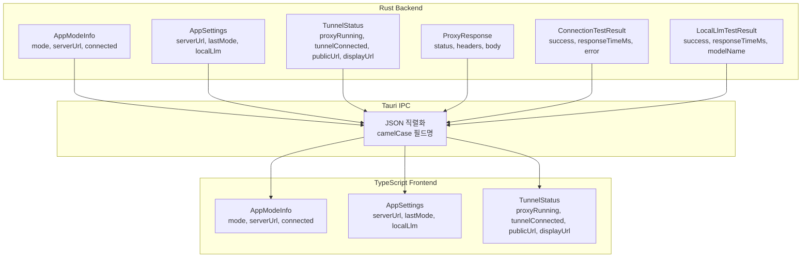
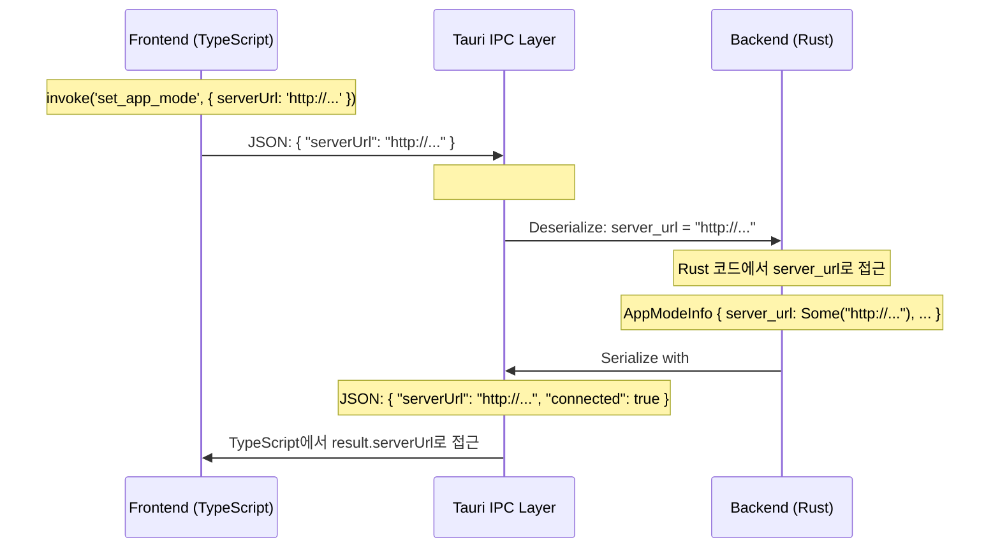

# camelCase 직렬화로 Rust와 Frontend 데이터 통신

## 문제: 두 세계의 네이밍 컨벤션 충돌

Rust는 `snake_case`를 쓴다. `app_mode`, `server_url`, `tunnel_connected`. TypeScript(JavaScript)는 `camelCase`를 쓴다. `appMode`, `serverUrl`, `tunnelConnected`. 두 언어의 관례는 각각의 생태계에서 확고하게 자리 잡고 있다.

XGEN 데스크톱 앱은 Tauri 2.0으로 만들었다. Rust 백엔드가 데이터를 직렬화(serialize)하면 Tauri IPC를 통해 React Frontend로 전달된다. 이 과정에서 필드명이 그대로 넘어간다. Rust에서 `server_url`로 보내면 Frontend에서도 `server_url`로 받는다.

```
# 커밋: Enhance app mode functionality with improved logging and camelCase serialization
# 날짜: 2026-01-09 01:13
```

초기에는 이게 문제가 안 되었다. 타입 정의가 몇 개 안 되었으니까. 하지만 XGEN 앱이 커지면서 Rust와 Frontend 사이를 오가는 구조체가 20개 이상으로 늘어났다. Frontend 코드에서 `status.server_url` 같은 snake_case 접근이 곳곳에 퍼졌고, ESLint의 camelCase 규칙과 충돌했다. TypeScript 자동완성도 `serverUrl`을 제안하는데 실제 키는 `server_url`이라 타입 불일치 에러가 발생했다.

## 해결: serde의 rename_all 컨테이너 속성

Rust의 serde 라이브러리는 `#[serde(rename_all = "camelCase")]` 속성을 제공한다. 구조체에 이 속성을 붙이면 직렬화 시 모든 필드명이 자동으로 `snake_case`에서 `camelCase`로 변환된다. 역직렬화 시에는 반대로 `camelCase`를 `snake_case`로 받는다.

```rust
// 적용 전: snake_case 그대로 직렬화
#[derive(serde::Serialize)]
pub struct AppModeInfo {
    pub mode: String,
    pub server_url: Option<String>,  // → JSON: "server_url"
    pub connected: bool,
}

// 적용 후: camelCase로 자동 변환
#[derive(serde::Serialize)]
#[serde(rename_all = "camelCase")]
pub struct AppModeInfo {
    pub mode: String,
    pub server_url: Option<String>,  // → JSON: "serverUrl"
    pub connected: bool,
}
```

Rust 코드에서는 여전히 `server_url`로 접근하고, 직렬화된 JSON에서는 `serverUrl`이 된다. 양쪽 모두 자기 언어의 컨벤션을 유지한다.

## XGEN 앱의 전체 구조체 적용 현황

XGEN 앱에서 `rename_all = "camelCase"`를 적용한 구조체들을 카테고리별로 정리했다. 실제 코드에서 이 패턴이 얼마나 광범위하게 사용되는지 보여주는 목록이다.



### 앱 모드 관련

```rust
// src-tauri/src/commands/mode.rs

#[derive(serde::Serialize)]
#[serde(rename_all = "camelCase")]
pub struct AppModeInfo {
    pub mode: String,           // → "mode" (단일 단어, 변환 없음)
    pub server_url: Option<String>,  // → "serverUrl"
    pub connected: bool,        // → "connected"
}
```

`mode`처럼 단일 단어 필드는 snake_case와 camelCase가 동일하다. `server_url` → `serverUrl`처럼 두 단어 이상인 필드에서만 변환이 발생한다.

### 설정 저장/로드

```rust
// src-tauri/src/commands/settings.rs

#[derive(serde::Serialize, serde::Deserialize, Default, Clone)]
#[serde(rename_all = "camelCase")]
pub struct AppSettings {
    pub server_url: Option<String>,      // → "serverUrl"
    pub last_mode: String,               // → "lastMode"
    pub local_llm: Option<LocalLlmSettings>,  // → "localLlm"
}

#[derive(serde::Serialize, serde::Deserialize, Default, Clone)]
#[serde(rename_all = "camelCase")]
pub struct LocalLlmSettings {
    pub enabled: bool,
    pub endpoint: String,
    pub model_name: Option<String>,      // → "modelName"
}
```

`AppSettings`는 `Serialize`와 `Deserialize` 양쪽 모두 구현한다. 설정을 JSON 파일로 저장(`save_app_settings`)할 때 camelCase로 직렬화하고, 읽을 때(`load_app_settings`) camelCase JSON을 다시 snake_case 필드로 역직렬화한다. 하나의 `rename_all` 속성으로 양방향 변환이 해결된다.

설정 파일 내용도 camelCase가 된다.

```json
{
  "serverUrl": "https://xgen-backend-gateway.x2bee.io",
  "lastMode": "connected",
  "localLlm": {
    "enabled": true,
    "endpoint": "http://localhost:8080",
    "modelName": "llama-3.1-8b"
  }
}
```

이렇게 하면 설정 파일을 직접 편집하는 사용자도 JavaScript/JSON의 관례에 맞는 camelCase 키를 볼 수 있다.

### 터널 상태

```rust
// src-tauri/src/commands/proxy.rs

#[derive(serde::Serialize, Debug)]
#[serde(rename_all = "camelCase")]
pub struct TunnelStatus {
    pub proxy_running: bool,         // → "proxyRunning"
    pub proxy_port: Option<u16>,     // → "proxyPort"
    pub tunnel_connected: bool,      // → "tunnelConnected"
    pub public_url: Option<String>,  // → "publicUrl"
    pub display_url: Option<String>, // → "displayUrl"
}
```

### 연결 테스트 결과

```rust
// src-tauri/src/commands/settings.rs

#[derive(serde::Serialize)]
#[serde(rename_all = "camelCase")]
pub struct ConnectionTestResult {
    pub success: bool,
    pub response_time_ms: Option<u64>,  // → "responseTimeMs"
    pub error: Option<String>,
}

#[derive(serde::Serialize)]
#[serde(rename_all = "camelCase")]
pub struct LocalLlmTestResult {
    pub success: bool,
    pub response_time_ms: Option<u64>,  // → "responseTimeMs"
    pub model_name: Option<String>,     // → "modelName"
    pub error: Option<String>,
}
```

## Tauri Command에서의 rename_all

구조체 필드뿐 아니라 Tauri 커맨드의 매개변수에도 camelCase 변환이 필요하다. Frontend에서 `invoke`로 커맨드를 호출할 때 매개변수를 JSON 객체로 전달하는데, 이 매개변수명도 Rust의 snake_case와 다를 수 있다.

```rust
// src-tauri/src/commands/mode.rs

#[tauri::command(rename_all = "camelCase")]
pub async fn set_app_mode(
    state: State<'_, Arc<AppState>>,
    mode: String,
    server_url: Option<String>,  // Frontend에서 "serverUrl"로 전달
) -> Result<()> {
    // ...
}
```

`#[tauri::command(rename_all = "camelCase")]`를 붙이면 Frontend에서 `invoke('set_app_mode', { serverUrl: 'http://...' })`로 호출할 수 있다. 이 속성이 없으면 `invoke('set_app_mode', { server_url: 'http://...' })`로 써야 한다.

스트리밍 프록시 커맨드에도 동일하게 적용한다.

```rust
// src-tauri/src/commands/proxy.rs

#[tauri::command(rename_all = "camelCase")]
pub async fn proxy_local_llm_stream(
    app: AppHandle,
    request_id: String,    // Frontend: "requestId"
    url: String,
    method: String,
    headers: HashMap<String, String>,
    body: Option<String>,
) -> Result<()> {
    // ...
}
```

## TypeScript 타입 정의와 매칭

Frontend에서는 Rust 구조체에 대응하는 TypeScript 인터페이스를 정의한다. `rename_all = "camelCase"`가 적용되어 있으므로 TypeScript 관례 그대로 정의하면 된다.

```typescript
// src/lib/tauri/types.ts

/** Application mode */
export type AppMode = 'standalone' | 'connected';

/** Application mode information */
export interface AppModeInfo {
  mode: AppMode;
  serverUrl: string | null;    // Rust: server_url
  connected: boolean;
}
```

Rust의 `Option<String>`은 TypeScript의 `string | null`로, `bool`은 `boolean`으로, `u16`은 `number`로 매핑된다. 필드명은 camelCase 기준이다.

IPC 래퍼 함수도 camelCase로 작성한다.

```typescript
// src/lib/tauri/mode.ts

import { invoke } from '@tauri-apps/api/core';
import type { AppMode, AppModeInfo } from './types';

export async function setAppMode(mode: AppMode, serverUrl?: string): Promise<void> {
  return invoke<void>('set_app_mode', { mode, serverUrl });
}

export async function getAppMode(): Promise<AppModeInfo> {
  return invoke<AppModeInfo>('get_app_mode');
}

export async function checkGatewayConnection(): Promise<boolean> {
  return invoke<boolean>('check_gateway_connection');
}
```

`invoke`의 두 번째 인자가 커맨드 매개변수다. `{ mode, serverUrl }`에서 `serverUrl`이 camelCase인데, Rust 커맨드에 `rename_all = "camelCase"`가 적용되어 있으므로 자동으로 `server_url` 매개변수에 매핑된다.

## Enum 직렬화 전략

구조체뿐 아니라 enum에도 직렬화 전략을 적용한다. XGEN 앱의 `AppMode` enum은 태그 기반 직렬화를 사용한다.

```rust
// src-tauri/src/state/app_state.rs

#[derive(Debug, Clone, Default, serde::Serialize, serde::Deserialize)]
#[serde(tag = "type")]
pub enum AppMode {
    #[default]
    Standalone,

    Service {
        service_url: String,
    },

    Connected {
        server_url: String,
    },
}
```

`#[serde(tag = "type")]`은 내부 태그(internally tagged) 방식이다. 직렬화 결과가 다음과 같다.

```json
// Standalone
{ "type": "Standalone" }

// Connected
{ "type": "Connected", "server_url": "https://..." }
```

여기서 `AppMode` enum 자체에는 `rename_all = "camelCase"`를 적용하지 않았다. 이유가 있다. `AppMode`는 앱 내부 상태 관리용이고, Frontend에 직접 노출되지 않는다. Frontend에는 `get_app_mode` 커맨드가 `AppModeInfo` 구조체로 변환해서 반환한다.

```rust
pub async fn get_app_mode(state: State<'_, Arc<AppState>>) -> Result<AppModeInfo> {
    let mode = state.app_mode.read().await;

    let info = match &*mode {
        AppMode::Standalone => AppModeInfo {
            mode: "standalone".to_string(),
            server_url: None,
            connected: false,
        },
        AppMode::Service { service_url } => AppModeInfo {
            mode: "service".to_string(),
            server_url: Some(service_url.clone()),
            connected: true,
        },
        AppMode::Connected { server_url } => AppModeInfo {
            mode: "connected".to_string(),
            server_url: Some(server_url.clone()),
            connected: true,
        },
    };

    Ok(info)
}
```

내부 enum은 Rust 컨벤션(PascalCase 변형, snake_case 필드)을 유지하고, 외부 노출 구조체(`AppModeInfo`)에만 camelCase 직렬화를 적용한다. 관심사 분리다.

## rename_all이 없는 구조체들

모든 구조체에 `rename_all`을 적용한 것은 아니다. 시스템 정보 구조체는 의도적으로 적용하지 않았다.

```rust
// src-tauri/src/gpu/detection.rs

#[derive(Debug, Clone, Serialize, Deserialize)]
pub struct SystemInfo {
    pub os_name: String,
    pub os_version: String,
    pub cpu_brand: String,
    pub cpu_cores: usize,
    pub total_memory: u64,
    pub available_memory: u64,
    pub platform: Platform,
}
```

이 구조체에는 `rename_all`이 없다. 하지만 Frontend의 `types.ts`에서는 camelCase 인터페이스를 정의하고 있다.

```typescript
export interface SystemInfo {
  osName: string;
  cpuBrand: string;
  cpuCores: number;
  totalMemory: number;
  availableMemory: number;
  platform: Platform;
}
```

이건 불일치다. Rust가 `os_name`을 보내는데 TypeScript는 `osName`을 기대한다. 실제로 이런 불일치가 버그의 원인이 될 수 있다. `SystemInfo`에도 `rename_all = "camelCase"`를 적용해야 하는데, 커밋 시점에서는 하드웨어 감지 기능이 아직 안정화되지 않아서 나중에 일괄 적용하는 것으로 미뤘다.

이런 불일치 관리가 rename_all 전략의 핵심 과제다. 새 구조체를 추가할 때 빠뜨리지 않도록 코드 리뷰에서 체크하거나, Clippy 커스텀 린트를 만들어 강제할 수 있다.

## Tauri IPC 직렬화 흐름

Tauri IPC에서 데이터가 어떻게 변환되는지 전체 흐름을 정리한다.



1. **Frontend → Rust (요청)**: TypeScript가 camelCase 매개변수를 JSON으로 보냄 → `#[tauri::command(rename_all = "camelCase")]`가 Rust의 snake_case 매개변수로 역직렬화
2. **Rust → Frontend (응답)**: Rust가 snake_case 필드의 구조체를 반환 → `#[serde(rename_all = "camelCase")]`가 camelCase JSON으로 직렬화 → TypeScript가 camelCase로 접근

양방향 변환이 선언적으로 처리된다. 수동으로 필드명을 변환하는 코드는 한 줄도 없다.

## serde rename_all의 다른 옵션들

`camelCase` 외에도 serde가 지원하는 네이밍 변환 목록이다.

| 옵션 | 변환 예시 | 용도 |
|------|-----------|------|
| `lowercase` | `ServerUrl` → `serverurl` | 드물게 사용 |
| `UPPERCASE` | `server_url` → `SERVER_URL` | 상수 스타일 |
| `camelCase` | `server_url` → `serverUrl` | JavaScript/TypeScript |
| `PascalCase` | `server_url` → `ServerUrl` | C#, Go 구조체 |
| `snake_case` | `ServerUrl` → `server_url` | Python, Rust (기본) |
| `SCREAMING_SNAKE_CASE` | `server_url` → `SERVER_URL` | 환경변수 |
| `kebab-case` | `server_url` → `server-url` | CSS, HTML 속성 |

Tauri 앱에서는 Frontend가 JavaScript/TypeScript이므로 `camelCase`가 유일한 선택이다. 만약 Go나 C#과 통신한다면 `PascalCase`를 쓸 것이다.

## 필드 단위 rename

구조체 전체가 아닌 특정 필드만 이름을 바꿔야 할 때는 `#[serde(rename = "...")]`을 쓴다. XGEN 앱에서는 아직 이 패턴이 필요하지 않았지만, 외부 API와 연동할 때 유용하다.

```rust
#[derive(serde::Serialize)]
#[serde(rename_all = "camelCase")]
pub struct ApiResponse {
    pub status_code: u16,           // → "statusCode"
    #[serde(rename = "msg")]
    pub message: String,            // → "msg" (rename이 rename_all보다 우선)
}
```

`rename`은 `rename_all`보다 우선순위가 높다. 구조체 수준에서 camelCase를 적용하되, 특정 필드만 외부 API 규격에 맞출 수 있다.

## 트러블슈팅

### set_app_mode 커맨드에서 serverUrl을 받지 못하는 문제

초기에 `set_app_mode` 커맨드에 `rename_all`을 적용하지 않았다. Frontend에서 `invoke('set_app_mode', { serverUrl: '...' })`로 호출했는데, Rust에서 `server_url` 매개변수가 `None`으로 들어왔다.

```rust
// 문제: rename_all 없음
#[tauri::command]
pub async fn set_app_mode(
    state: State<'_, Arc<AppState>>,
    mode: String,
    server_url: Option<String>,  // Frontend의 "serverUrl"을 인식 못함
) -> Result<()> {
```

Tauri IPC는 기본적으로 매개변수명을 그대로 매칭한다. Frontend가 `serverUrl`을 보내면 Rust는 `serverUrl`이라는 매개변수를 찾는데, 실제 매개변수명은 `server_url`이다. `Option<String>`이라 에러 대신 `None`이 들어갔고, Connected 모드에서 서버 URL이 설정되지 않는 버그로 나타났다.

```rust
// 해결: rename_all 추가
#[tauri::command(rename_all = "camelCase")]
pub async fn set_app_mode(
    state: State<'_, Arc<AppState>>,
    mode: String,
    server_url: Option<String>,  // Frontend의 "serverUrl" → server_url로 매핑
) -> Result<()> {
```

`Option` 타입이라 컴파일 에러도, 런타임 에러도 발생하지 않아서 디버깅이 어려웠다. 로그를 추가한 것도 이 문제를 추적하기 위해서였다.

```rust
log::info!("Setting app mode: {}, server_url: {:?}", mode, server_url);
```

### Service 모드 누락

`get_app_mode`에서 `AppMode::Service` 변형을 처리하지 않아서 매치 에러가 발생했다. AppMode에 `Service` 변형을 추가하면서 `get_app_mode`와 `check_gateway_connection` 모두 업데이트해야 했다.

```rust
// Service 모드 추가
AppMode::Service { service_url } => AppModeInfo {
    mode: "service".to_string(),
    server_url: Some(service_url.clone()),
    connected: true,
},
```

Rust의 exhaustive match가 이 문제를 컴파일 타임에 잡아줬다. enum에 새 변형을 추가하면 match가 완전하지 않다고 컴파일러가 경고한다. JavaScript라면 런타임에서야 발견될 버그다.

## 일관성 유지 전략

프로젝트가 커지면 `rename_all`을 빠뜨리는 실수가 발생한다. XGEN 앱에서 사용하는 체크리스트:

1. **새 구조체 작성 시**: Frontend에 노출되는 구조체에는 반드시 `#[serde(rename_all = "camelCase")]` 추가
2. **새 커맨드 작성 시**: 두 단어 이상의 매개변수가 있으면 `#[tauri::command(rename_all = "camelCase")]` 추가
3. **TypeScript 타입 동기화**: Rust 구조체 변경 시 `types.ts` 즉시 업데이트
4. **내부 전용 구조체**: Frontend에 노출되지 않는 내부 구조체(`ModelConfig`, `SidecarConfig` 등)는 적용 불필요

```
Frontend 노출 여부에 따른 판단:
├── Tauri Command 반환 타입 → rename_all 적용
├── Tauri Command 매개변수 (복합) → command rename_all 적용
├── 설정 파일 저장/로드 → rename_all 적용 (파일도 camelCase)
├── 내부 상태 관리 → 적용 불필요
└── 서비스 간 통신 → 상대방 언어 컨벤션에 맞춤
```

## 결과

`rename_all = "camelCase"` 적용으로 달라진 점:

| 항목 | 이전 | 이후 |
|------|------|------|
| Frontend 필드 접근 | `result.server_url` | `result.serverUrl` |
| ESLint camelCase 규칙 | 위반 | 통과 |
| TypeScript 자동완성 | 불일치 | 일치 |
| 커맨드 매개변수 | `{ server_url: '...' }` | `{ serverUrl: '...' }` |
| 설정 파일 키 | `"server_url"` | `"serverUrl"` |
| 변환 코드 | 수동 매핑 필요 | 선언적, 자동 |

작업량 자체는 적다. 각 구조체에 한 줄(`#[serde(rename_all = "camelCase")]`), 각 커맨드에 한 줄(`#[tauri::command(rename_all = "camelCase")]`) 추가하는 것이 전부다. 하지만 효과는 프로젝트 전체에 걸쳐 누적된다. Frontend 개발자는 JavaScript 컨벤션대로 코드를 작성하면 되고, Rust 개발자는 Rust 컨벤션대로 작성하면 된다. 중간의 변환은 serde와 Tauri가 처리한다.

Tauri뿐 아니라 Rust로 REST API를 만들 때(axum, actix-web)에도 동일한 패턴을 적용할 수 있다. JSON 응답의 필드명을 `camelCase`로 보내는 것은 프론트엔드 친화적 API 설계의 기본이다. serde의 `rename_all`은 이를 제로 코스트로 해결한다.
