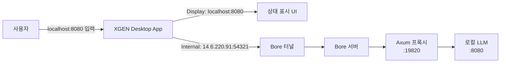
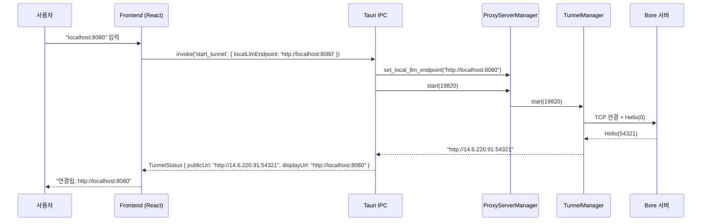

# 데스크톱 앱에서 터널 URL 표시 UX 개선

## 문제: 사용자가 이해할 수 없는 터널 URL

XGEN 데스크톱 앱에서 로컬 LLM을 외부에 노출하기 위해 Bore 터널을 구현했다. 사용자가 `http://localhost:8080`에서 실행 중인 llama.cpp 서버를 터널로 연결하면, Bore 서버가 임의 포트를 할당하고 `http://14.6.220.91:54321` 같은 공개 URL을 반환한다. 이 URL이 실제로 트래픽이 흐르는 주소다.

문제는 이 터널 URL을 사용자에게 그대로 보여줬다는 점이다. 사용자는 `http://localhost:8080`을 입력했는데, 상태 표시에는 `http://14.6.220.91:54321`이 나온다. "이게 뭐지?" 하는 혼란이 발생한다. IP 주소와 임의 포트 번호는 사용자에게 아무런 정보를 주지 않는다. 본인이 연결한 로컬 LLM 서버가 어떤 것인지도 알 수 없다.

```
# 커밋: feat: improve tunnel URL display - show user input instead of tunnel IP
# 날짜: 2026-01-10 20:44
```

## 해결 전략: Display URL과 Internal URL 분리

접근 방식은 단순하다. 사용자에게 보여주는 URL(Display URL)과 실제 통신에 사용하는 URL(Internal URL)을 분리한다.

- **Display URL**: 사용자가 입력한 원본 URL (`http://localhost:8080`)
- **Internal URL**: Bore 터널이 할당한 실제 공개 URL (`http://14.6.220.91:54321`)

사용자는 자신이 입력한 URL을 계속 보게 되고, 내부적으로는 터널 URL로 트래픽이 흐른다. 사용자 입장에서는 "내 로컬 llama.cpp가 연결되어 있구나"라고 바로 파악할 수 있다.



## 구현: TunnelStatus에 display_url 필드 추가

### Rust 백엔드 변경

핵심은 `TunnelStatus` 구조체에 `display_url` 필드를 추가하는 것이다. 기존에는 `public_url`(터널 URL)만 있었다.

```rust
// src-tauri/src/commands/proxy.rs

#[derive(serde::Serialize, Debug)]
#[serde(rename_all = "camelCase")]
pub struct TunnelStatus {
    pub proxy_running: bool,
    pub proxy_port: Option<u16>,
    pub tunnel_connected: bool,
    pub public_url: Option<String>,       // 실제 터널 URL (내부용)
    pub display_url: Option<String>,      // 사용자에게 표시할 URL (원본 로컬 URL)
}
```

`start_tunnel` 커맨드에서 사용자가 입력한 `local_llm_endpoint`를 `display_url`로 저장한다.

```rust
pub async fn start_tunnel(
    app: AppHandle,
    local_llm_endpoint: String,
    proxy_port: Option<u16>,
) -> Result<TunnelStatus> {
    let manager = app.state::<ProxyServerManager>();
    let proxy_port = proxy_port.unwrap_or(19820);

    {
        let mut server = manager.server.lock().await;
        // 엔드포인트 업데이트 (clone 필요 - display_url에도 사용)
        server.set_local_llm_endpoint(Some(local_llm_endpoint.clone())).await;

        if server.is_running() {
            // 이미 실행 중이면 터널만 재연결
        } else {
            server.start(proxy_port).await
                .map_err(|e| AppError::Unknown(e))?;
        }
    }

    // ... 터널 연결 로직 ...

    Ok(TunnelStatus {
        proxy_running: true,
        proxy_port: Some(proxy_port),
        tunnel_connected,
        public_url,
        display_url: Some(local_llm_endpoint),  // 사용자 입력 원본 URL
    })
}
```

`stop_tunnel`에서는 모든 URL을 `None`으로 초기화한다.

```rust
pub async fn stop_tunnel(app: AppHandle) -> Result<TunnelStatus> {
    // ... 터널 중지 로직 ...

    Ok(TunnelStatus {
        proxy_running: false,
        proxy_port: None,
        tunnel_connected: false,
        public_url: None,
        display_url: None,
    })
}
```

### ProxyServer에 엔드포인트 조회 메서드 추가

`get_tunnel_status` 커맨드에서 현재 상태를 조회할 때도 `display_url`을 반환해야 한다. 이를 위해 `ProxyServer`에 엔드포인트 조회 메서드를 추가했다.

```rust
// src-tauri/src/proxy_server.rs

impl ProxyServer {
    /// 현재 로컬 LLM 엔드포인트 반환
    pub async fn get_local_llm_endpoint(&self) -> Option<String> {
        self.state.local_llm_endpoint.read().await.clone()
    }
}
```

`ProxyServerState`의 `local_llm_endpoint`는 `Arc<RwLock<Option<String>>>`으로 관리되고 있어서, 비동기 읽기 잠금으로 안전하게 접근한다.

```rust
pub async fn get_tunnel_status(app: AppHandle) -> Result<TunnelStatus> {
    let manager = app.state::<ProxyServerManager>();

    let server = manager.server.lock().await;
    let tunnel_status = manager.tunnel().get_status().await;
    let display_url = server.get_local_llm_endpoint().await;

    Ok(TunnelStatus {
        proxy_running: server.is_running(),
        proxy_port: server.get_port(),
        tunnel_connected: tunnel_status.connected,
        public_url: tunnel_status.public_url,
        display_url,
    })
}
```

## 전체 데이터 흐름

터널 상태 정보가 Rust 백엔드에서 Frontend까지 전달되는 경로를 정리하면 다음과 같다.



Frontend에서는 `displayUrl`을 사용자에게 보여주고, `publicUrl`은 Gateway에 등록할 때 사용한다. 사용자가 상태를 확인할 때(`get_tunnel_status`)도 동일한 구조로 응답한다.

## Axum 프록시 서버 아키텍처

`display_url`이 단순 표시용이라면, 실제 트래픽은 어떻게 흐르는지 프록시 서버 구조를 짚어보겠다.

```rust
// src-tauri/src/proxy_server.rs

pub struct ProxyServerState {
    /// 로컬 LLM 엔드포인트 (예: http://127.0.0.1:8080)
    pub local_llm_endpoint: Arc<RwLock<Option<String>>>,
    /// 허용된 API 키 (선택적 인증)
    pub api_key: Arc<RwLock<Option<String>>>,
}
```

프록시 서버는 Axum 0.8 기반으로, `0.0.0.0:19820`에서 수신한 모든 요청을 `local_llm_endpoint`로 전달한다. 라우터 구조가 깔끔하다.

```rust
let app = Router::new()
    .route("/health", get(health_check))
    .route("/v1/{*path}", any(proxy_handler))
    .route("/{*path}", any(proxy_handler))
    .layer(cors)
    .with_state(state);
```

`/v1/{*path}`와 `/{*path}` 두 패턴으로 OpenAI 호환 API(`/v1/chat/completions`)와 일반 경로를 모두 처리한다. `proxy_handler`는 받은 요청의 메서드, 헤더, 바디를 그대로 로컬 LLM으로 전달하고, 응답도 스트리밍으로 되돌린다.

여기서 엔드포인트가 런타임에 변경 가능하다는 점이 중요하다. 사용자가 다른 로컬 LLM 서버로 전환해도 터널을 재연결할 필요 없이 `set_local_llm_endpoint`만 호출하면 된다. `RwLock`으로 보호되므로 동시 요청 중에도 안전하게 전환된다.

```rust
// 프록시 핸들러에서 매 요청마다 엔드포인트를 읽는다
async fn proxy_handler(
    State(state): State<ProxyServerState>,
    Path(path): Path<String>,
    req: Request<Body>,
) -> Response {
    let endpoint = {
        let guard = state.local_llm_endpoint.read().await;
        guard.clone()
    };

    let endpoint = match endpoint {
        Some(ep) => ep,
        None => {
            return (StatusCode::SERVICE_UNAVAILABLE, "Local LLM endpoint not configured")
                .into_response();
        }
    };

    let target_url = format!("{}/{}", endpoint.trim_end_matches('/'), path);
    // ... 요청 전달 ...
}
```

## Tauri IPC에서 rename_all = "camelCase" 적용

`TunnelStatus` 구조체에 `#[serde(rename_all = "camelCase")]`가 적용되어 있어서, Rust의 `display_url` 필드가 Frontend에서는 `displayUrl`로 변환된다.

```rust
#[derive(serde::Serialize, Debug)]
#[serde(rename_all = "camelCase")]  // snake_case → camelCase 자동 변환
pub struct TunnelStatus {
    pub proxy_running: bool,        // → proxyRunning
    pub proxy_port: Option<u16>,    // → proxyPort
    pub tunnel_connected: bool,     // → tunnelConnected
    pub public_url: Option<String>, // → publicUrl
    pub display_url: Option<String>,// → displayUrl
}
```

이 변환은 serde의 컨테이너 속성으로 처리되므로 필드를 추가할 때마다 수동으로 이름을 맞출 필요가 없다. 다음 글(#115)에서 이 직렬화 전략을 더 자세히 다룬다.

## 터널 자동 시작과 설정 저장

사용자가 매번 터널을 수동으로 시작하는 건 번거로운 일이다. XGEN 앱은 시작 시 저장된 설정을 읽어서 자동으로 터널을 연결한다.

```rust
// src-tauri/src/lib.rs

async fn auto_start_tunnel(app: &tauri::AppHandle) -> Result<(), String> {
    // 설정 파일에서 로컬 LLM 정보 읽기
    let settings: serde_json::Value = serde_json::from_str(&content)
        .map_err(|e| format!("Failed to parse settings: {}", e))?;

    let local_llm = settings.get("localLlm");
    let endpoint = local_llm
        .and_then(|llm| llm.get("endpoint"))
        .and_then(|e| e.as_str())
        .filter(|e| !e.is_empty());

    let enabled = local_llm
        .and_then(|llm| llm.get("enabled"))
        .and_then(|e| e.as_bool())
        .unwrap_or(true);  // endpoint가 있으면 기본 활성화

    if let Some(endpoint) = endpoint {
        if enabled {
            let manager = app.state::<ProxyServerManager>();
            match manager.auto_start_with_tunnel(endpoint.to_string(), 19820).await {
                Ok(public_url) => log::info!("Tunnel auto-started: {}", public_url),
                Err(e) => log::warn!("Failed to auto-start tunnel: {}", e),
            }
        }
    }
    Ok(())
}
```

설정 파일은 Tauri의 `app_config_dir`에 JSON으로 저장된다. `localLlm.endpoint`와 `localLlm.enabled` 두 필드로 터널 자동 시작 여부를 결정한다. 앱 시작 시 모드 초기화(`auto_init_app_mode`) 후 100ms 딜레이를 두고 터널을 시작하는데, 이는 모드 설정이 완료된 후에 터널을 시작해야 하기 때문이다.

```rust
// 앱 시작 시 순서
// 1. auto_init_app_mode (block_on - 동기 완료)
// 2. 100ms 대기
// 3. auto_start_tunnel (spawn - 비동기)
let app_handle_tunnel = app.handle().clone();
tauri::async_runtime::spawn(async move {
    tokio::time::sleep(std::time::Duration::from_millis(100)).await;
    if let Err(e) = auto_start_tunnel(&app_handle_tunnel).await {
        log::warn!("Failed to auto-start tunnel: {}", e);
    }
});
```

## localhost 검증과 보안

프록시 서버가 임의 URL로 요청을 전달하면 SSRF(Server-Side Request Forgery) 취약점이 된다. 이를 방지하기 위해 localhost URL만 허용하는 검증 로직이 있다.

```rust
fn is_localhost_url(url: &str) -> bool {
    let url_lower = url.to_lowercase();
    url_lower.starts_with("http://localhost")
        || url_lower.starts_with("https://localhost")
        || url_lower.starts_with("http://127.0.0.1")
        || url_lower.starts_with("https://127.0.0.1")
        || url_lower.starts_with("http://0.0.0.0")
        || url_lower.starts_with("https://0.0.0.0")
        || url_lower.starts_with("http://[::1]")
        || url_lower.starts_with("https://[::1]")
}
```

IPv4(`127.0.0.1`), IPv6(`[::1]`), 와일드카드(`0.0.0.0`), 호스트명(`localhost`) 네 가지 형태를 모두 검사한다. 프록시 서버의 직접 호출(`proxy_local_llm`)과 스트리밍 호출(`proxy_local_llm_stream`) 모두에서 이 검증을 수행한다.

추가로 선택적 API 키 인증도 지원한다.

```rust
// 프록시 핸들러 내부
if let Some(expected) = expected_key {
    let auth_header = req.headers()
        .get(header::AUTHORIZATION)
        .and_then(|v| v.to_str().ok())
        .unwrap_or("");

    let provided_key = auth_header
        .strip_prefix("Bearer ")
        .unwrap_or(auth_header);

    if provided_key != expected {
        return (StatusCode::UNAUTHORIZED, "Invalid API key").into_response();
    }
}
```

Bore 터널이 공개 포트를 할당하므로, 누구나 해당 포트로 접근할 수 있다. API 키를 설정하면 인증되지 않은 요청을 차단할 수 있다.

## SSE 스트리밍 프록시

LLM 추론은 대부분 스트리밍으로 동작한다. 프록시 서버가 스트리밍을 지원해야 사용자에게 토큰 단위로 응답을 보여줄 수 있다. Tauri의 이벤트 시스템을 활용한 SSE 프록시 구현이다.

```rust
pub async fn proxy_local_llm_stream(
    app: AppHandle,
    request_id: String,
    url: String,
    method: String,
    headers: HashMap<String, String>,
    body: Option<String>,
) -> Result<()> {
    // localhost 검증
    if !is_localhost_url(&url) {
        let _ = app.emit(&format!("proxy:error:{}", request_id), "...");
        return Err(AppError::Unknown("Only localhost URLs are allowed".to_string()));
    }

    let response = request_builder.send().await?;
    let status = response.status().as_u16();

    // 스트리밍 시작 이벤트
    let _ = app.emit(&format!("proxy:start:{}", request_id), json!({ "status": status }));

    // 청크 단위 스트리밍
    let mut stream = response.bytes_stream();
    while let Some(chunk_result) = stream.next().await {
        match chunk_result {
            Ok(chunk) => {
                let chunk_str = String::from_utf8_lossy(&chunk).to_string();
                app.emit(&format!("proxy:chunk:{}", request_id), &chunk_str)?;
            }
            Err(e) => {
                app.emit(&format!("proxy:error:{}", request_id), e.to_string())?;
                return Err(AppError::Network(e));
            }
        }
    }

    // 완료 이벤트
    let _ = app.emit(&format!("proxy:done:{}", request_id), json!({ "status": status }));
    Ok(())
}
```

`request_id`로 이벤트를 구분하여 여러 스트리밍 요청이 동시에 진행되어도 충돌하지 않는다. Frontend에서는 `proxy:chunk:{id}` 이벤트를 구독하여 실시간으로 토큰을 받는다.

## 트러블슈팅

### clone 누락으로 인한 borrow 에러

초기 구현에서 `local_llm_endpoint`를 `set_local_llm_endpoint`에 넘긴 후 `display_url`에도 사용하려 했는데, Rust의 소유권 규칙에 의해 이동된 값을 재사용할 수 없었다.

```rust
// 수정 전 - 컴파일 에러
server.set_local_llm_endpoint(Some(local_llm_endpoint)).await;
// ...
display_url: Some(local_llm_endpoint),  // 이미 이동됨!

// 수정 후 - clone으로 해결
server.set_local_llm_endpoint(Some(local_llm_endpoint.clone())).await;
// ...
display_url: Some(local_llm_endpoint),
```

`String`은 `Copy` 트레이트를 구현하지 않으므로 명시적 `clone()`이 필요하다. 작은 문자열이라 성능 영향은 없다.

### 미사용 변수 경고 제거

터널 릴레이 루프에서 `server_host` 변수를 두 번 선언하는 실수가 있었다. `format!`으로 `server_addr`를 만든 후 다시 `server_host.to_string()`으로 새 변수를 만들었는데, 이 두 번째 변수는 실제로 사용되지 않았다.

```rust
// 수정 전
let server_addr = format!("{}:{}", server_host, server_port);
let server_host = server_host.to_string();  // 미사용 변수

// 수정 후 - 불필요한 재선언 제거
let server_addr = format!("{}:{}", server_host, server_port);
```

## 결과

이 개선으로 달라진 UX를 정리하면:

| 항목 | 이전 | 이후 |
|------|------|------|
| 상태 표시 | `http://14.6.220.91:54321` | `http://localhost:8080` |
| 의미 전달 | 알 수 없는 IP:PORT | 내 로컬 LLM 주소 |
| 내부 통신 | 변경 없음 | 변경 없음 |
| 추가 필드 | - | `display_url` |

변경량 자체는 작다. `TunnelStatus`에 필드 하나 추가하고, `ProxyServer`에 getter 메서드 하나 추가한 것이 전부다. 하지만 사용자가 터널 상태를 확인할 때의 인지 부하가 확연히 줄었다. "이 터널이 내 localhost:8080을 연결한 것이구나"를 바로 파악할 수 있게 되었다.

이 패턴은 터널링뿐 아니라 프록시, 리다이렉트, 로드밸런싱 등 내부 주소와 외부 표시 주소가 다른 모든 시나리오에 적용할 수 있다. 핵심은 "사용자에게는 사용자의 언어로 보여주고, 시스템 내부는 시스템의 주소를 사용한다"는 원칙이다.
