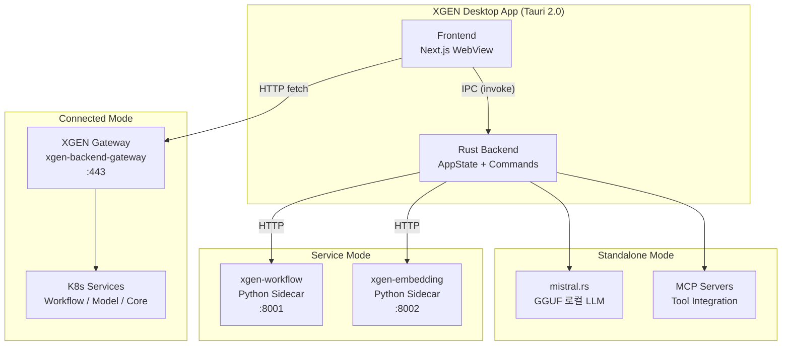

# 앱 모드 전환: Standalone vs Connected 아키텍처

## 왜 하나의 앱에 세 가지 모드가 필요한가

XGEN 데스크톱 앱(xgen-app)은 Tauri 2.0 기반으로 만든 AI 워크스테이션이다. 이 앱이 놓이는 환경은 크게 세 가지다.

첫째, 인터넷이 완전히 차단된 에어갭(air-gapped) 환경. 군사, 금융, 의료 분야에서는 외부 네트워크 접속 자체가 불가능하다. 이런 곳에서도 AI 기능을 쓰려면 로컬 LLM이 앱 안에 내장되어야 한다.

둘째, 개발자 로컬 환경. 회사 인프라에 연결할 필요 없이, Python으로 만든 워크플로우 엔진이나 임베딩 서버를 앱이 직접 자식 프로세스로 띄워서 사용하는 경우다. 인터넷은 되지만, 굳이 원격 서버를 경유할 이유가 없다.

셋째, 회사 K8s 클러스터에 배포된 XGEN 백엔드 게이트웨이에 연결하는 경우. 이때는 데스크톱 앱이 사실상 웹 클라이언트와 동일하게 HTTP 통신을 한다.

이 세 가지를 **Standalone**, **Service**, **Connected**라고 이름 붙였다. 핵심 차이는 API 호출 경로가 완전히 달라진다는 점이다.

| 모드 | LLM 추론 | API 경로 | 네트워크 |
|------|----------|----------|----------|
| Standalone | mistral.rs (로컬 GGUF) | Tauri IPC | 불필요 |
| Service | Python Sidecar | IPC -> localhost:8001 | 로컬만 |
| Connected | XGEN Gateway | HTTP fetch | 필수 |

이 글에서는 이 세 모드를 런타임에 전환하는 아키텍처, Rust 백엔드의 상태 관리, 프론트엔드 API 클라이언트 분기, 그리고 개발 중 겪은 시행착오를 다룬다.

---

## 전체 아키텍처



프론트엔드는 현재 모드에 따라 IPC와 HTTP 중 하나를 선택한다. Standalone에서는 Tauri의 `invoke()`로 Rust 백엔드를 직접 호출하고, Connected에서는 표준 `fetch()`로 원격 게이트웨이에 요청한다. Service 모드는 그 중간으로, Rust 백엔드가 로컬 Python 프로세스에 HTTP 요청을 보내는 구조다.

---

## AppMode Enum 설계

모드 전환의 핵심은 `AppMode` enum이다. `src-tauri/src/state/app_state.rs`에 정의되어 있다.

```rust
/// Application operation mode
#[derive(Debug, Clone, Default, serde::Serialize, serde::Deserialize)]
#[serde(tag = "type")]
pub enum AppMode {
    /// Fully offline mode with local LLM (mistral.rs)
    #[default]
    Standalone,

    /// Service mode using Python sidecar (xgen-workflow)
    Service {
        /// URL of the running service (e.g., http://127.0.0.1:8001)
        service_url: String,
    },

    /// Connected to external xgen-backend-gateway
    Connected {
        server_url: String,
    },
}
```

설계 결정 몇 가지를 짚겠다.

**`#[serde(tag = "type")]`**: JSON 직렬화 시 `{ "type": "Standalone" }` 또는 `{ "type": "Connected", "server_url": "..." }` 형태가 된다. 프론트엔드에서 `mode.type`으로 분기하기 편하다. 처음에는 externally tagged(`{ "Standalone": {} }`)를 썼는데, TypeScript 쪽에서 타입 가드가 복잡해져서 internally tagged로 변경했다.

**`#[default] Standalone`**: 기본값이 Standalone인 이유가 있다. 앱이 처음 설치되면 아무 설정도 없는 상태인데, 이때 Connected로 시작하면 게이트웨이 연결 실패 에러가 뜬다. 오프라인에서도 최소한의 기능은 동작하도록 Standalone이 안전한 기본값이다. 이 결정은 나중에 한번 뒤집었다가 21분 만에 되돌렸는데, 시행착오 섹션에서 자세히 다룬다.

**Service 모드의 `service_url`**: sidecar 프로세스가 실제로 바인딩한 포트를 저장한다. 기본값은 `http://127.0.0.1:8001`이지만, 포트 충돌 시 다른 포트로 올라갈 수 있으므로 하드코딩하지 않았다.

---

## AppState: 전역 상태 관리

`AppState`는 앱 전체에서 공유되는 상태 컨테이너다.

```rust
pub struct AppState {
    /// System hardware information
    pub system_info: Arc<RwLock<Option<SystemInfo>>>,
    /// Model manager for downloading and managing models
    pub model_manager: Arc<RwLock<ModelManager>>,
    /// LLM inference engine (mistral.rs)
    pub inference_engine: Arc<RwLock<InferenceEngine>>,
    /// MCP server configuration manager
    pub mcp_config: Arc<RwLock<McpConfigManager>>,
    /// Sidecar process manager (xgen-workflow, etc.)
    pub sidecar_manager: Arc<RwLock<SidecarManager>>,
    /// MCP browser manager (Playwright MCP subprocess)
    pub mcp_browser: Arc<RwLock<McpBrowserManager>>,
    /// Current application mode (Standalone or Service)
    pub app_mode: Arc<RwLock<AppMode>>,
    /// Gateway URL for Connected mode
    pub gateway_url: Arc<RwLock<Option<String>>>,
}
```

모든 필드가 `Arc<RwLock<T>>`로 감싸져 있다. Tauri의 커맨드 핸들러는 `async fn`이고, 여러 커맨드가 동시에 실행될 수 있으므로 동시성 안전이 필수다. `Mutex` 대신 `RwLock`을 쓴 이유는 `get_app_mode` 같은 읽기 전용 커맨드가 훨씬 많기 때문이다. 여러 읽기 요청이 동시에 처리되어야 UI가 버벅이지 않는다.

`Arc<AppState>`로 한 번 더 감싸서 Tauri의 `manage()`로 등록한다.

```rust
let app_state = Arc::new(AppState::new());

tauri::Builder::default()
    .manage(app_state)
    // ...
```

이후 모든 커맨드에서 `State<'_, Arc<AppState>>`로 접근한다.

`AppState`에는 모드별로 유용한 헬퍼 메서드도 있다.

```rust
impl AppState {
    pub async fn is_standalone(&self) -> bool {
        matches!(*self.app_mode.read().await, AppMode::Standalone)
    }

    pub async fn is_connected(&self) -> bool {
        matches!(*self.app_mode.read().await, AppMode::Connected { .. })
    }

    pub async fn get_server_url(&self) -> Option<String> {
        match &*self.app_mode.read().await {
            AppMode::Connected { server_url } => Some(server_url.clone()),
            AppMode::Service { service_url } => Some(service_url.clone()),
            AppMode::Standalone => None,
        }
    }
}
```

`get_server_url()`이 Connected와 Service 모두에서 URL을 반환하는 것에 주목하라. 상위 레이어에서는 "원격 서비스가 있는지"만 알면 되고, 그것이 로컬 sidecar인지 원격 게이트웨이인지는 중요하지 않은 경우가 많다.

---

## 모드 결정 우선순위: auto_init_app_mode

앱이 시작될 때 어떤 모드로 동작할지를 결정하는 로직이다. `src-tauri/src/lib.rs`의 `auto_init_app_mode` 함수가 담당한다.

```rust
async fn auto_init_app_mode(app: &tauri::AppHandle) -> Result<(), String> {
    use std::env;
    use std::fs;

    // 1순위: 환경변수
    let env_mode = env::var("XGEN_APP_MODE").ok();
    let env_server_url = env::var("XGEN_SERVER_URL").ok();

    let (final_mode, final_server_url): (String, Option<String>) = if let Some(mode) = env_mode {
        let server_url = if mode == "connected" {
            Some(env_server_url.unwrap_or_else(|| DEFAULT_SERVER_URL.to_string()))
        } else {
            None
        };
        (mode, server_url)
    } else {
        // 2순위: 저장된 설정 (settings.json)
        let config_dir = app.path().app_config_dir()
            .map_err(|e| format!("Failed to get config dir: {}", e))?;
        let config_path = config_dir.join("settings.json");

        if config_path.exists() {
            let content = fs::read_to_string(&config_path)
                .map_err(|e| format!("Failed to read settings: {}", e))?;
            let settings: serde_json::Value = serde_json::from_str(&content)
                .map_err(|e| format!("Failed to parse settings: {}", e))?;

            let last_mode = settings.get("lastMode")
                .and_then(|m| m.as_str())
                .unwrap_or("standalone")
                .to_string();
            let server_url = settings.get("serverUrl")
                .and_then(|u| u.as_str())
                .map(|s| s.to_string());

            (last_mode, server_url)
        } else {
            // 3순위: 기본값
            ("standalone".to_string(), None)
        }
    };

    // 모드 적용
    let state = app.state::<Arc<AppState>>();
    if final_mode == "connected" {
        let url = final_server_url.unwrap_or_else(|| DEFAULT_SERVER_URL.to_string());
        let mut mode = state.app_mode.write().await;
        *mode = AppMode::Connected { server_url: url.clone() };
        let mut gateway = state.gateway_url.write().await;
        *gateway = Some(url);
    } else {
        let mut mode = state.app_mode.write().await;
        *mode = AppMode::Standalone;
    }

    Ok(())
}
```

세 단계 우선순위가 핵심이다.

**1순위 - 환경변수 (`XGEN_APP_MODE`)**:  CI/CD나 Docker 환경에서 `.env` 파일로 모드를 강제 지정할 수 있다. 예를 들어 `XGEN_APP_MODE=connected XGEN_SERVER_URL=https://xgen-backend-gateway.x2bee.io`로 설정하면 설정 파일을 무시하고 Connected 모드로 시작한다.

**2순위 - 저장된 설정 (`settings.json`)**: 사용자가 마지막으로 선택한 모드를 기억한다. 앱을 재시작해도 이전 설정이 유지된다.

**3순위 - 기본값 (Standalone)**: 아무 설정도 없으면 가장 안전한 Standalone으로 시작한다.

이 함수는 Tauri의 `.setup()` 훅에서 `block_on`으로 동기 실행된다.

```rust
.setup(|app| {
    // ...
    let app_handle_mode = app.handle().clone();
    tauri::async_runtime::block_on(async move {
        if let Err(e) = auto_init_app_mode(&app_handle_mode).await {
            log::warn!("Failed to auto-init app mode: {}", e);
        }
    });
    Ok(())
})
```

`block_on`을 쓴 이유가 있다. WebView가 로드되기 전에 모드가 확정되어야 한다. 프론트엔드가 첫 렌더링 시 `get_app_mode`를 호출하는데, 이때 모드가 아직 결정되지 않았으면 Standalone으로 잘못 분기할 수 있다. 반면 sidecar 자동 시작은 `spawn`으로 비동기 실행한다. sidecar가 준비되는 데 수 초가 걸리므로 앱 시작을 블로킹하면 안 된다.

---

## 모드 전환 IPC 커맨드

프론트엔드에서 모드를 조회하고 변경하는 Tauri 커맨드들이다. `src-tauri/src/commands/mode.rs`에 있다.

### get_app_mode

```rust
#[tauri::command]
pub async fn get_app_mode(state: State<'_, Arc<AppState>>) -> Result<AppModeInfo> {
    let mode = state.app_mode.read().await;

    let info = match &*mode {
        AppMode::Standalone => AppModeInfo {
            mode: "standalone".to_string(),
            server_url: None,
            connected: false,
        },
        AppMode::Service { service_url } => AppModeInfo {
            mode: "service".to_string(),
            server_url: Some(service_url.clone()),
            connected: true,
        },
        AppMode::Connected { server_url } => AppModeInfo {
            mode: "connected".to_string(),
            server_url: Some(server_url.clone()),
            connected: true,
        },
    };

    Ok(info)
}
```

반환 타입인 `AppModeInfo`는 프론트엔드 소비용으로 설계했다.

```rust
#[derive(serde::Serialize)]
#[serde(rename_all = "camelCase")]
pub struct AppModeInfo {
    pub mode: String,
    pub server_url: Option<String>,
    pub connected: bool,
}
```

`connected` 필드는 네트워크 연결이 필요한 모드인지를 나타낸다. Service와 Connected 모두 `true`다. 프론트엔드에서 "오프라인 배너를 표시할지"를 이 필드로 판단한다.

### set_app_mode

```rust
#[tauri::command(rename_all = "camelCase")]
pub async fn set_app_mode(
    state: State<'_, Arc<AppState>>,
    mode: String,
    server_url: Option<String>,
) -> Result<()> {
    let effective_url = if mode == "connected" {
        Some(server_url
            .filter(|u| !u.is_empty())
            .unwrap_or_else(|| DEFAULT_SERVER_URL.to_string()))
    } else {
        None
    };

    // 중복 호출 방지
    {
        let current_mode = state.app_mode.read().await;
        let is_same = match (&*current_mode, mode.as_str(), &effective_url) {
            (AppMode::Standalone, "standalone", _) => true,
            (AppMode::Connected { server_url: current_url }, "connected", Some(new_url)) => {
                current_url == new_url
            }
            _ => false,
        };
        if is_same {
            return Ok(());
        }
    }

    let mut app_mode = state.app_mode.write().await;
    *app_mode = match mode.as_str() {
        "standalone" => AppMode::Standalone,
        "connected" => {
            let url = effective_url.unwrap_or_else(|| DEFAULT_SERVER_URL.to_string());
            let mut gateway = state.gateway_url.write().await;
            *gateway = Some(url.clone());
            AppMode::Connected { server_url: url }
        }
        _ => AppMode::Standalone,
    };

    Ok(())
}
```

중복 호출 방지 로직이 있다. 프론트엔드에서 React의 `useEffect`가 여러 번 트리거되면서 같은 모드로 중복 설정 요청이 오는 경우가 있었다. `RwLock`의 write 잠금을 불필요하게 잡는 것을 방지하기 위해 먼저 read 잠금으로 현재 모드를 확인한다.

`#[tauri::command(rename_all = "camelCase")]` 어트리뷰트 덕분에 프론트엔드에서 `serverUrl`로 전달하면 Rust에서는 `server_url`로 받는다. 이것 없으면 Tauri IPC에서 파라미터 이름 불일치로 에러가 난다.

---

## Service 모드: Sidecar 생명주기 관리

Service 모드의 핵심은 Python sidecar 프로세스 관리다. `enable_service_mode` 커맨드가 sidecar 시작과 모드 전환을 원자적으로 처리한다.

```rust
#[tauri::command]
pub async fn enable_service_mode(
    app_handle: AppHandle,
    state: State<'_, AppState>,
    service_name: String,
    env: Option<HashMap<String, String>>,
) -> Result<SidecarStatus> {
    // 1. Sidecar 시작
    let mut manager = state.sidecar_manager.write().await;
    let status = manager.start_sidecar(&app_handle, &service_name, env).await?;

    // 2. Health check 대기
    if !status.health_ok {
        tokio::time::sleep(tokio::time::Duration::from_secs(3)).await;
        let updated_status = manager.get_status(&service_name).await?;
        if !updated_status.health_ok {
            tracing::warn!("Service started but health check failed");
        }
    }

    // 3. 모드 전환
    let mut mode = state.app_mode.write().await;
    *mode = AppMode::Service {
        service_url: status.url.clone(),
    };

    Ok(status)
}
```

반대로 `enable_standalone_mode`는 모든 sidecar를 종료하고 Standalone으로 돌아간다.

```rust
#[tauri::command]
pub async fn enable_standalone_mode(state: State<'_, AppState>) -> Result<()> {
    let mut manager = state.sidecar_manager.write().await;
    manager.stop_all().await?;

    let mut mode = state.app_mode.write().await;
    *mode = AppMode::Standalone;

    Ok(())
}
```

### SidecarManager 내부

`SidecarManager`는 Tauri Shell 플러그인의 sidecar 기능을 래핑한다.

```rust
pub struct SidecarManager {
    processes: HashMap<String, CommandChild>,
    configs: HashMap<String, SidecarConfig>,
}
```

기본적으로 두 개의 sidecar가 등록되어 있다.

```rust
fn register_default_configs(&mut self) {
    // xgen-workflow: 워크플로우 엔진
    self.configs.insert("xgen-workflow".to_string(), SidecarConfig {
        name: "xgen-workflow".to_string(),
        binary_name: "xgen-workflow".to_string(),
        port: 8001,
        env: workflow_env,
        auto_start: true,
    });

    // xgen-embedding: 임베딩 서버
    self.configs.insert("xgen-embedding".to_string(), SidecarConfig {
        name: "xgen-embedding".to_string(),
        binary_name: "xgen-embedding".to_string(),
        port: 8002,
        env: embedding_env,
        auto_start: true,
    });
}
```

sidecar 시작 시 Tauri Shell 플러그인을 통해 프로세스를 spawn하고, stdout/stderr를 비동기로 수집한다.

```rust
let sidecar_name = format!("binaries/{}", config.binary_name);
let shell = app_handle.shell();
let mut command = shell.sidecar(&sidecar_name)
    .map_err(|e| AppError::Workflow(format!("Failed to create sidecar command: {}", e)))?;

for (key, value) in &env {
    command = command.env(key, value);
}

let (mut rx, child) = command.spawn()
    .map_err(|e| AppError::Workflow(format!("Failed to spawn sidecar: {}", e)))?;
```

spawn 후 500ms 대기한 뒤 health check를 수행한다. `/health`, `/docs`, `/` 세 엔드포인트를 순서대로 시도한다. FastAPI 기반의 Python 서비스는 `/docs`가 항상 있으므로, health 엔드포인트를 별도로 만들지 않아도 된다.

sidecar를 종료할 때는 `stop_sidecar`가 자동으로 앱 모드를 Standalone으로 되돌린다.

```rust
pub async fn stop_sidecar(state: State<'_, AppState>, name: String) -> Result<()> {
    let mut manager = state.sidecar_manager.write().await;
    manager.stop_sidecar(&name).await?;

    // Service 모드였으면 Standalone으로 복귀
    let mut mode = state.app_mode.write().await;
    if matches!(&*mode, AppMode::Service { .. }) {
        *mode = AppMode::Standalone;
    }
    Ok(())
}
```

---

## 프론트엔드 API 클라이언트 분기

모드에 따라 통신 방식이 달라지므로, 프론트엔드에는 두 가지 API 클라이언트가 있다.

- **TauriApiClient**: Tauri IPC(`invoke()`) 기반. Standalone 모드 전용.
- **WebApiClient**: HTTP `fetch()` 기반. Connected 모드와 웹 브라우저에서 사용.

`createApiClient.ts`가 팩토리 역할을 한다.

```typescript
export async function createApiClient(): Promise<IApiClient> {
  if (apiClientInstance) {
    return apiClientInstance;
  }

  // 서버 사이드 렌더링
  if (isServer()) {
    const { WebApiClient } = await import('./WebApiClient');
    apiClientInstance = new WebApiClient();
    return apiClientInstance;
  }

  // Tauri 환경
  if (isTauri()) {
    try {
      const { invoke } = await import('@tauri-apps/api/core');
      const modeInfo = await invoke<{ mode: string }>('get_app_mode');

      if (modeInfo.mode === 'connected') {
        // Connected 모드: WebApiClient 사용
        const { WebApiClient } = await import('./WebApiClient');
        apiClientInstance = new WebApiClient();
        return apiClientInstance;
      }
    } catch {
      // get_app_mode 실패 시 TauriApiClient로 폴백
    }

    // Standalone 모드: TauriApiClient (IPC 기반)
    const { TauriApiClient } = await import('./TauriApiClient');
    const client = new TauriApiClient();
    await client.initialize();
    apiClientInstance = client;
    return apiClientInstance;
  }

  // 웹 브라우저
  const { WebApiClient } = await import('./WebApiClient');
  apiClientInstance = new WebApiClient();
  return apiClientInstance;
}
```

핵심 분기 로직을 정리하면:

1. 서버 사이드(Next.js SSR) -> WebApiClient
2. Tauri + Connected -> WebApiClient (HTTP, 웹과 동일)
3. Tauri + Standalone -> TauriApiClient (IPC)
4. 웹 브라우저 -> WebApiClient

Tauri 환경인지는 `window.__TAURI_INTERNALS__`의 존재로 판단한다.

```typescript
export function isTauri(): boolean {
  if (typeof window === 'undefined') return false;
  return typeof (window as any).__TAURI_INTERNALS__ !== 'undefined';
}
```

싱글톤 패턴을 쓰는 이유는 앱 실행 중 모드가 바뀌지 않는 한 같은 클라이언트를 재사용하기 위해서다. 모드를 전환하면 `resetClients()`를 호출해 인스턴스를 초기화한다.

### TauriApiClient의 이중 모드

`TauriApiClient`는 사실 Connected 모드에서도 동작할 수 있도록 설계되어 있다. `createApiClient`에서 Connected면 `WebApiClient`를 쓰지만, 폴백으로 `TauriApiClient`가 Connected 요청을 처리하는 경로도 있다.

```typescript
export class TauriApiClient implements IApiClient, ILLMClient {
  private mode: 'standalone' | 'connected' = 'standalone';
  private serverUrl: string | null = null;

  async request<T>(endpoint: string, options?: RequestOptions): Promise<ApiResponse<T>> {
    await this.ensureInitialized();

    if (this.mode === 'connected' && this.serverUrl) {
      return this.handleConnectedRequest<T>(endpoint, options);
    }
    return this.handleStandaloneRequest<T>(endpoint, options);
  }
}
```

Connected 요청 처리 시 인증 헤더를 자동으로 추가한다.

```typescript
private buildAuthHeaders(): Record<string, string> {
    const headers: Record<string, string> = {};
    try {
      const token = getAuthCookie('access_token');
      if (token) {
        headers['Authorization'] = `Bearer ${token}`;
      }
    } catch (error) {
      devLog.warn('Failed to get auth token:', error);
    }
    return headers;
}
```

개발 모드에서는 Next.js 프록시를 경유하므로 CORS 문제가 없다. 프로덕션에서는 `serverUrl`에 직접 요청한다.

```typescript
private resolveConnectedUrl(endpoint: string): string {
    if (endpoint.startsWith('http')) return endpoint;
    if (this.isDevMode()) return endpoint; // Next.js 프록시
    return `${this.serverUrl}${endpoint}`;
}
```

Standalone 모드에서는 엔드포인트를 Tauri IPC 커맨드로 매핑한다.

```typescript
private async handleStandaloneRequest<T>(
    endpoint: string,
    options?: RequestOptions
): Promise<ApiResponse<T>> {
    const localCommands: Record<string, string> = {
      '/api/llm/status': 'get_model_status',
      '/api/gpu/info': 'get_hardware_info',
      '/api/models/list': 'list_models',
      '/api/mcp/servers': 'list_mcp_servers',
    };

    const command = localCommands[endpoint];
    if (command) {
      const { invoke } = await import('@tauri-apps/api/core');
      const result = await invoke<T>(command, options?.body);
      return { success: true, data: result };
    }

    return {
      success: false,
      error: { code: 'NOT_AVAILABLE', message: `Not available in standalone mode` },
    };
}
```

이 매핑 테이블 방식의 장점은 명시적이라는 것이다. Standalone에서 지원하지 않는 엔드포인트는 `NOT_AVAILABLE` 에러를 반환한다. 프론트엔드는 이 에러를 받으면 해당 기능의 UI를 비활성화한다.

---

## TypeScript 타입 정의

프론트엔드에서 모드 관련 타입은 `src/lib/tauri/types.ts`에 정의되어 있다.

```typescript
/** Application mode */
export type AppMode = 'standalone' | 'connected';

/** Application mode information */
export interface AppModeInfo {
  mode: AppMode;
  serverUrl: string | null;
  connected: boolean;
}
```

`src/lib/tauri/mode.ts`는 IPC 래퍼다.

```typescript
export async function setAppMode(mode: AppMode, serverUrl?: string): Promise<void> {
  return invoke<void>('set_app_mode', { mode, serverUrl });
}

export async function getAppMode(): Promise<AppModeInfo> {
  return invoke<AppModeInfo>('get_app_mode');
}

export async function checkGatewayConnection(): Promise<boolean> {
  return invoke<boolean>('check_gateway_connection');
}
```

`IApiClient` 인터페이스는 모드와 무관하게 동일한 API 시그니처를 제공한다.

```typescript
export interface IApiClient {
  request<T>(endpoint: string, options?: RequestOptions): Promise<ApiResponse<T>>;
  get<T>(endpoint: string, options?: Omit<RequestOptions, 'method'>): Promise<ApiResponse<T>>;
  post<T>(endpoint: string, data?: any, options?: ...): Promise<ApiResponse<T>>;
  stream(endpoint: string, options?: StreamRequestOptions): Promise<ReadableStream>;
  upload<T>(endpoint: string, formData: FormData, options?: ...): Promise<ApiResponse<T>>;
}
```

`TauriApiClient`는 `IApiClient`와 `ILLMClient`를 모두 구현한다. `WebApiClient`는 `IApiClient`만 구현한다. Standalone에서만 로컬 LLM 추론이 가능하므로, `ILLMClient`는 Tauri 전용이다.

---

## 설정 영구 저장

모드 설정은 앱을 종료해도 유지되어야 한다. `commands/settings.rs`가 이를 담당한다.

```rust
#[derive(serde::Serialize, serde::Deserialize, Default, Clone)]
#[serde(rename_all = "camelCase")]
pub struct AppSettings {
    pub server_url: Option<String>,
    pub last_mode: String,
    #[serde(default)]
    pub local_llm: Option<LocalLlmSettings>,
}

#[derive(serde::Serialize, serde::Deserialize, Default, Clone)]
#[serde(rename_all = "camelCase")]
pub struct LocalLlmSettings {
    pub enabled: bool,
    pub endpoint: String,
    pub model_name: Option<String>,
}
```

실제 저장되는 JSON 파일은 이런 형태다.

```json
{
  "serverUrl": "https://xgen-backend-gateway.x2bee.io",
  "lastMode": "connected",
  "localLlm": {
    "enabled": true,
    "endpoint": "http://localhost:8080",
    "modelName": "llama-3-8b"
  }
}
```

저장 경로는 Tauri의 `app_config_dir()` API를 사용한다. Linux에서는 `~/.config/com.xgen.app/settings.json`, macOS에서는 `~/Library/Application Support/com.xgen.app/settings.json`이 된다.

### Gateway 연결 테스트

모드를 Connected로 변경하기 전에 게이트웨이가 살아있는지 확인하는 기능도 있다.

```rust
#[tauri::command]
pub async fn test_gateway_connection(url: String) -> Result<ConnectionTestResult> {
    let client = reqwest::Client::builder()
        .timeout(std::time::Duration::from_secs(10))
        .build()
        .map_err(|e| AppError::Unknown(format!("Failed to create HTTP client: {}", e)))?;

    let health_url = format!("{}/health", url.trim_end_matches('/'));
    let start = std::time::Instant::now();

    match client.get(&health_url).send().await {
        Ok(resp) => {
            let elapsed = start.elapsed().as_millis() as u64;
            Ok(ConnectionTestResult {
                success: resp.status().is_success(),
                response_time_ms: Some(elapsed),
                error: if resp.status().is_success() { None }
                       else { Some(format!("HTTP {}", resp.status())) },
            })
        }
        Err(e) => Ok(ConnectionTestResult {
            success: false,
            response_time_ms: None,
            error: Some(e.to_string()),
        })
    }
}
```

응답 시간도 함께 반환하므로, UI에서 "게이트웨이 연결: 정상 (120ms)" 같은 표시를 할 수 있다. 타임아웃은 10초로 설정했다. 회사 VPN을 통한 접속 시 첫 연결이 느릴 수 있기 때문이다.

---

## 모드별 스트리밍 처리

스트리밍은 모드별로 완전히 다른 메커니즘을 사용한다.

### Standalone: Tauri Events

```typescript
private async handleStandaloneStream(
    endpoint: string,
    options: StreamRequestOptions
): Promise<StreamCleanup> {
    const { invoke } = await import('@tauri-apps/api/core');
    const { listen } = await import('@tauri-apps/api/event');

    const unlisteners: (() => void)[] = [];

    // Tauri 이벤트 리스너
    unlisteners.push(await listen<string>('llm:token', (event) => {
        options.callbacks.onToken?.(event.payload);
    }));

    unlisteners.push(await listen<GenerateStats>('llm:done', (event) => {
        options.callbacks.onDone?.(event.payload);
    }));

    // Rust invoke로 생성 시작
    await invoke('generate', options.body);

    // 정리 함수 반환
    return () => {
        unlisteners.forEach((unlisten) => unlisten());
        invoke('stop_generation').catch(() => {});
    };
}
```

Standalone에서는 Rust 백엔드가 mistral.rs로 토큰을 생성하고, 각 토큰을 `llm:token` 이벤트로 프론트엔드에 전달한다. IPC 기반이라 네트워크 오버헤드가 없다.

### Connected: SSE (Server-Sent Events)

```typescript
private async handleConnectedStream(
    endpoint: string,
    options: StreamRequestOptions
): Promise<StreamCleanup> {
    const url = this.resolveConnectedUrl(endpoint);
    const abortController = new AbortController();

    const response = await fetch(url, {
        method: options.method || 'POST',
        headers: {
            'Content-Type': 'application/json',
            ...this.buildAuthHeaders(),
        },
        body: options.body ? JSON.stringify(options.body) : undefined,
        signal: abortController.signal,
    });

    const reader = response.body?.getReader();
    this.processSSE(reader, options.callbacks);

    return () => {
        abortController.abort();
        reader.cancel().catch(() => {});
    };
}
```

Connected에서는 표준 SSE 프로토콜을 사용한다. `data:` 접두어로 시작하는 줄을 파싱해서 콜백으로 전달한다.

두 방식 모두 cleanup 함수를 반환하는 패턴을 사용한다. React 컴포넌트에서 `useEffect`의 cleanup에서 호출하면 리스너 해제와 생성 중단이 자동으로 처리된다.

---

## 시행착오 타임라인

모드 시스템의 진화 과정을 커밋 기록으로 추적할 수 있다.

```
# 커밋: Add logging to get_app_mode function for better debugging
# 날짜: 2026-01-04 20:15
```

최초 구현. `get_app_mode`에 로깅을 추가하면서 기본 구조를 잡았다. 이때는 단순히 현재 모드를 JSON으로 반환하는 것이 전부였다.

```
# 커밋: Refactor get_app_mode function to simplify return logic
# 날짜: 2026-01-04 20:27
```

12분 후 리팩토링. 반환 로직이 불필요하게 복잡했다. `match` 문으로 정리하고 `AppModeInfo` 구조체를 도입했다.

```
# 커밋: Enhance app mode functionality with improved logging and camelCase serialization
# 날짜: 2026-01-09 01:13
```

5일 후, 가장 골치 아팠던 문제를 해결했다. 프론트엔드에서 `modeInfo.serverUrl`이 계속 `undefined`였다. 원인은 Rust에서 `server_url`로 직렬화되고 있었기 때문이다. `#[serde(rename_all = "camelCase")]`를 `AppModeInfo` 구조체에 추가해서 해결했다. Rust는 snake_case, TypeScript는 camelCase라는 기본적인 차이인데, serde의 rename 기능을 놓치면 런타임에 조용히 실패한다. 컴파일 타임에 잡히지 않는 종류의 버그라서 디버깅이 어려웠다.

```
# 커밋: feat: auto-init app mode, remove mode-select, fix Connected mode auth
# 날짜: 2026-02-07 01:47
```

한 달 후 대규모 리팩토링. 원래는 앱 시작 시 "모드 선택" 화면이 있었다. 사용자가 Standalone/Connected를 고르는 UI였는데, 매번 앱을 열 때마다 선택하는 것이 불편했다. 이것을 `auto_init_app_mode`로 대체하고, 모드 선택 페이지를 삭제했다. 환경변수 -> 설정 -> 기본값 3단계 우선순위로 자동 결정하도록 변경했다. 같은 커밋에서 Connected 모드의 인증 문제도 수정했다. Tauri IPC에서는 쿠키가 자동으로 전달되지 않으므로, `Authorization: Bearer` 헤더를 명시적으로 추가해야 했다.

```
# 커밋: fix: Remote WebView 모드 기본값을 Connected로 변경
# 날짜: 2026-02-07 22:44
```

같은 날 밤, Remote WebView 아키텍처를 도입했다. 프론트엔드를 로컬 빌드하지 않고, `https://xgen.x2bee.com`을 WebView에 직접 로드하는 방식이다. 이 경우 백엔드가 원격에 있으므로 기본 모드를 Connected로 변경했다.

```
# 커밋: revert: 기본 모드를 Standalone으로 복원
# 날짜: 2026-02-07 23:05
```

21분 후 되돌렸다. Remote WebView에서 Connected가 기본이면 논리적으로 맞지만, 오프라인 환경에서 앱을 열면 게이트웨이 연결 실패 에러가 즉시 뜬다. "Remote WebView"와 "Connected 모드"를 혼동한 결과였다. Remote WebView는 프론트엔드 로딩 방식이고, Connected는 백엔드 API 경로다. 둘은 독립적인 개념이다. 결국 기본값은 Standalone으로 유지하되, Remote WebView 감지 시 자동으로 Connected로 전환하는 로직을 별도로 추가했다.

이 21분간의 실수에서 배운 교훈이 두 가지다. 첫째, 기본 모드 선택은 예상보다 중요한 아키텍처 결정이다. "가장 많이 쓰는 모드"가 아니라 "실패해도 안전한 모드"가 기본값이어야 한다. 둘째, 프론트엔드 로딩 방식(로컬 빌드 vs Remote WebView)과 백엔드 통신 모드(Standalone vs Connected)는 직교하는 관심사이므로 분리해야 한다.

---

## 트러블슈팅

### camelCase 직렬화 불일치

가장 빈번하게 발생한 문제다. Rust 구조체의 필드는 snake_case이고, TypeScript에서는 camelCase를 기대한다.

`AppMode` enum 자체에는 `#[serde(tag = "type")]`만 있고 `rename_all = "camelCase"`가 없다. variant 내부 필드(`server_url`, `service_url`)는 그대로 snake_case로 직렬화된다.

반면 `AppModeInfo`에는 `#[serde(rename_all = "camelCase")]`가 있어서 `serverUrl`로 변환된다.

이 불일치가 혼란을 줬다. `AppMode`를 직접 직렬화하면 `server_url`, `AppModeInfo`를 통하면 `serverUrl`이다. 프론트엔드에서 어떤 경로로 데이터를 받느냐에 따라 필드 이름이 달랐다. 최종적으로 프론트엔드에 노출되는 모든 구조체는 `camelCase` 직렬화를 적용하고, 내부용 구조체는 그대로 두는 것으로 규칙을 잡았다.

### Connected 모드 인증

Tauri WebView에서 HTTP 요청을 보내면 브라우저와 달리 쿠키가 자동으로 포함되지 않는다. XGEN Gateway는 JWT 토큰 기반 인증을 사용하는데, 웹에서는 쿠키에 저장된 `access_token`이 자동 전송된다. Tauri에서는 명시적으로 `Authorization` 헤더를 추가해야 했다.

```typescript
const token = getAuthCookie('access_token');
if (token) {
  headers['Authorization'] = `Bearer ${token}`;
}
```

개발 모드에서는 Next.js 프록시를 경유하므로 이 문제가 드러나지 않았다. 프로덕션 빌드에서만 인증 에러가 나서 찾는 데 시간이 걸렸다.

### 모드 전환 시 리소스 정리

Service 모드에서 Standalone으로 전환할 때, sidecar 프로세스를 확실히 종료해야 한다. 그렇지 않으면 포트를 점유한 좀비 프로세스가 남는다. `stop_sidecar`가 호출될 때 자동으로 모드를 Standalone으로 되돌리는 안전장치를 넣었다.

```rust
if matches!(&*mode, AppMode::Service { .. }) {
    *mode = AppMode::Standalone;
}
```

Connected에서 다른 모드로 전환할 때는 리소스 정리가 비교적 간단하다. HTTP 연결은 stateless이므로, 모드 값만 바꾸면 된다. 다만 프록시 서버나 bore 터널이 실행 중이면 함께 정리해야 한다.

### 앱 시작 시 타이밍 문제

`auto_init_app_mode`를 `block_on`으로 동기 실행하는 것이 처음에는 이상하게 느껴졌다. Tauri의 setup 훅에서 `async_runtime::spawn`으로 비동기 실행하면 될 것 같았지만, 그러면 WebView 로드와 모드 초기화가 경합한다. 프론트엔드가 `get_app_mode`를 호출하는 시점에 모드가 아직 기본값(Standalone)인 경우가 간헐적으로 발생했다. `block_on`으로 WebView 로드 전에 모드를 확정하니 이 문제가 사라졌다.

반면 sidecar 자동 시작은 `spawn`으로 비동기 실행한다. sidecar가 시작되는 데 수 초가 걸리는데, 이를 기다리면 앱 시작이 체감상 크게 느려진다.

```rust
// 모드 초기화: block_on (동기 - WebView 로드 전 완료 필수)
tauri::async_runtime::block_on(async move {
    auto_init_app_mode(&app_handle_mode).await
});

// Sidecar 자동 시작: spawn (비동기 - 백그라운드)
tauri::async_runtime::spawn(async move {
    manager.start_auto_start_sidecars(&app_handle).await;
});
```

---

## 결과

세 가지 모드 전환 아키텍처를 통해 달성한 것은 "하나의 바이너리로 세 가지 배포 시나리오를 커버한다"는 점이다.

에어갭 환경에서는 `XGEN_APP_MODE=standalone`으로 설정하면 외부 연결 없이 mistral.rs로 LLM 추론을 수행한다. 개발 환경에서는 Python sidecar가 자동 시작되면서 워크플로우 엔진과 임베딩 서비스를 로컬에서 사용한다. 회사 인프라와 연결하면 K8s에 배포된 전체 서비스를 활용한다.

프론트엔드 코드 입장에서는 `IApiClient` 인터페이스만 바라보면 된다. `createApiClient()`가 모드에 따라 적절한 구현체를 반환하므로, 비즈니스 로직에서 모드를 신경 쓸 필요가 없다.

기본값을 Standalone으로 유지한 결정이 옳았다. "가장 자주 사용하는 모드"가 아니라 "실패해도 가장 안전한 모드"가 기본값이어야 한다는 원칙은 데스크톱 앱 설계에서 범용적으로 적용할 수 있는 교훈이다.

환경변수 -> 설정 파일 -> 기본값의 3단계 우선순위는 12-factor app에서 가져온 패턴인데, 서버 앱뿐 아니라 데스크톱 앱에서도 유효하다. CI/CD에서 환경변수로 모드를 강제하고, 일반 사용자는 UI에서 한 번 선택하면 설정 파일에 저장되고, 아무것도 안 하면 안전한 기본값으로 동작한다. 이 세 레이어가 있으면 대부분의 배포 시나리오를 커버할 수 있다.
