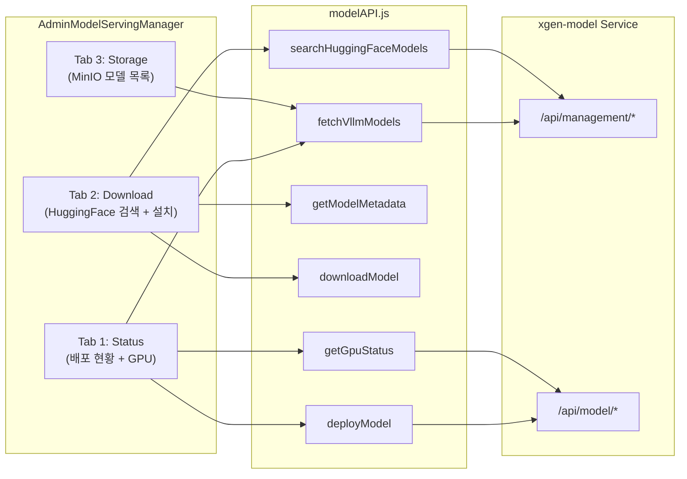

# Admin 모델 서빙 매니저: GPU 현황과 모델 배포 UI

## 개요

XGEN 2.0은 LLM과 임베딩 모델을 자체 서버에 배포해서 사용하는 플랫폼이다. 초기에는 모델 배포 기능이 `AdminLLMvLLMConfig`(LLM 설정)와 `AdminVectordbConfig`(벡터DB 설정)에 분산되어 있었다. 배포할 때마다 두 곳을 왔다 갔다 해야 했고, GPU 상태 확인은 터미널에서 직접 해야 했다.

이 문제를 해결하기 위해 `AdminModelServingManager`라는 전용 컴포넌트를 만들었다. 모델 설치, 배포, GPU 현황, 상태 모니터링을 하나의 화면에서 관리한다. 다중 백엔드(vLLM, llamacpp, sglang, CPU) 지원, GPU 벤더 자동 감지(NVIDIA/AMD/Intel), HuggingFace 모델 검색, safetensors 샤드 그룹화 등의 기능이 포함됐다.

## 아키텍처



### 파일 구조

```
src/app/
  _common/api/
    modelAPI.js                         -- 모델 관리 API 전체
  admin/components/config/
    AdminModelServing/
      AdminModelServingManager.tsx       -- 메인 컴포넌트 (~2900줄)
    AdminLLM/
      AdminLLMvLLMConfig.tsx            -- vLLM 설정 (리팩토링 후 간소화)
    AdminEmbed/
      AdminVectorDBConfig.tsx           -- 벡터DB 설정 (리팩토링 후 간소화)
    AdminVastModal/
      AdminGpuOfferSearchModal.tsx      -- Vast.ai GPU 임대 모달
      AdminInstanceManagementModal.tsx   -- 인스턴스 관리 모달
  admin/api/
    modelManagement.ts                  -- TypeScript 타입 정의
```

## 핵심 구현

### 3탭 구조

AdminModelServingManager는 세 개의 탭으로 구성된다:

1. **Status** — 현재 배포된 모델 현황, GPU 메모리 사용량, 모델 로드/언로드 제어
2. **Download** — HuggingFace 모델 검색, 메타데이터 조회, 다운로드 및 설치
3. **Storage** — MinIO 오브젝트 스토리지에 저장된 모델 목록, 삭제 관리

### 다중 백엔드 지원

XGEN 2.0은 모델 특성에 따라 최적의 서빙 백엔드를 선택한다:

```typescript
// 백엔드 옵션
const BACKEND_OPTIONS = [
    { value: 'vllm', label: 'vLLM (CUDA)', description: 'NVIDIA GPU 전용, 고성능' },
    { value: 'llamacpp', label: 'llama.cpp (Vulkan/CUDA)', description: 'AMD/Intel GPU + CPU 지원' },
    { value: 'sglang', label: 'SGLang', description: '실험적' },
    { value: 'cpu', label: 'CPU Only', description: 'GPU 없이 실행' },
];

// 디바이스 옵션
const DEVICE_OPTIONS = [
    { value: 'cuda', label: 'CUDA (NVIDIA)' },
    { value: 'vulkan', label: 'Vulkan (AMD/Intel)' },
    { value: 'rocm', label: 'ROCm (AMD)' },
    { value: 'cpu', label: 'CPU' },
];
```

모델 포맷에 따라 백엔드를 자동 추천한다:
- **GGUF** 파일 → llamacpp 추천 (Vulkan/CUDA 모두 가능)
- **safetensors** 파일 → vLLM 추천 (CUDA 필수)

```
# 커밋: Add backend and device selection for model deployment
# 날짜: 2025-12-01 01:28
```

### GPU 상태 모니터링

서버의 GPU 현황을 실시간으로 조회하는 기능이다. GPU 개수, 메모리 사용량, 현재 로드된 모델 등을 표시한다.

```javascript
// modelAPI.js
export const getGpuStatus = async () => {
    const response = await apiClient(`${API_BASE_URL}/api/model/gpu/status`);
    return await response.json();
};

export const testGpu = async (deviceId) => {
    const response = await apiClient(
        `${API_BASE_URL}/api/model/gpu/test`,
        { method: 'POST', body: JSON.stringify({ device_id: deviceId }) }
    );
    return await response.json();
};
```

```
# 커밋: GPU status/testing API 함수 추가
# 날짜: 2025-12-16
```

GPU 테스트 기능은 특정 디바이스에 작은 연산을 돌려서 실제로 사용 가능한 상태인지 확인한다. ROCm GPU에서 page fault가 발생하는 경우가 있어서, 배포 전에 미리 테스트하는 기능이 필요했다.

### HuggingFace 모델 검색

Download 탭에서 HuggingFace 모델을 직접 검색하고 설치할 수 있다. 디바운스(300ms)를 적용해서 타이핑할 때마다 API를 호출하지 않도록 했다.

```typescript
const handleSearchModels = async (query: string) => {
    setSearchQuery(query);
    if (searchDebounce) clearTimeout(searchDebounce);
    if (query.length < 2) {
        setSearchResults([]);
        return;
    }

    const timeout = setTimeout(async () => {
        setSearchLoading(true);
        try {
            const result = await searchHuggingFaceModels(query, 10);
            setSearchResults(result.models || []);
        } catch {
            setSearchResults([]);
        } finally {
            setSearchLoading(false);
        }
    }, 300);
    setSearchDebounce(timeout);
};
```

```
# 커밋: Add HuggingFace model search and metadata retrieval
# 날짜: 2025-12-01 01:57
```

모델을 선택하면 메타데이터를 자동으로 조회해서 배포 폼에 권장값을 채운다:

```typescript
const fetchModelMetadataAndApply = async (modelName: string) => {
    setMetadataLoading(true);
    try {
        const metadata = await getModelMetadata(modelName);
        setSelectedModelMetadata(metadata);
        setShowMetadataPanel(true);

        // 자동 추천값 적용
        const recommendedFormat = metadata.has_gguf ? 'gguf' : 'safetensors';
        setDownloadForm(prev => ({
            ...prev,
            model_type: metadata.model_type !== 'unknown'
                ? metadata.model_type : prev.model_type,
            quantization: metadata.recommended_quantization || prev.quantization,
            format: recommendedFormat,
        }));
    } catch (error) {
        // 메타데이터 조회 실패 시 패널을 표시하지 않음
    } finally {
        setMetadataLoading(false);
    }
};
```

### safetensors 샤드 그룹화

대형 모델(예: Qwen3-32B)은 safetensors 파일이 여러 개로 분할(샤딩)된다. MinIO에서 파일 목록을 가져오면 `model-00001-of-00008.safetensors`, `model-00002-of-00008.safetensors` 같은 파일이 8개 나온다. 이걸 하나의 모델로 그룹화해서 표시해야 한다.

```typescript
interface GroupedModel {
    directory: string;
    displayName: string;
    modelType: 'llm' | 'embedding';
    format: 'safetensors' | 'gguf' | 'unknown';
    files: MinioModel[];
    totalSizeMb: number;
    lastModified: string;
    fileCount: number;
    model_id?: string;
}

const groupMinioModels = (models: MinioModel[]): GroupedModel[] => {
    const groups: Record<string, GroupedModel> = {};

    models.forEach(model => {
        const isGGUF = model.backend === 'llamacpp'
            || model.key.endsWith('.gguf');

        if (isGGUF) {
            // GGUF: 단일 파일이 곧 하나의 모델
            groups[model.key] = {
                directory: model.key,
                displayName: model.model_name,
                format: 'gguf',
                files: [model],
                totalSizeMb: model.size_mb,
                // ...
            };
        } else {
            // safetensors: 디렉토리 기반 그룹화
            const pathParts = model.key.split('/');
            const directory = pathParts.slice(0, -1).join('/');

            if (!groups[directory]) {
                groups[directory] = {
                    directory,
                    displayName: pathParts[pathParts.length - 2] || directory,
                    format: 'safetensors',
                    files: [],
                    totalSizeMb: 0,
                    // ...
                };
            }
            groups[directory].files.push(model);
            groups[directory].totalSizeMb += model.size_mb;
            groups[directory].fileCount++;
        }
    });

    return Object.values(groups).sort((a, b) =>
        b.lastModified.localeCompare(a.lastModified)
    );
};
```

```
# 커밋: Implement model grouping and enhanced display in AdminModelServingManager
# 날짜: 2025-12-16 07:45
```

모델 카드에는 타입(LLM/Embedding), 포맷(Safetensors/GGUF), 파일 수를 태그로 표시한다.

### vLLM 고급 설정

vLLM 배포 시 RoPE scaling, 양자화, 추론 모드 등의 고급 설정을 제공한다:

```typescript
// 고급 설정 옵션
const ADVANCED_SETTINGS = {
    rope_scaling: ['none', 'linear', 'dynamic', 'yarn'],
    quantization: ['none', 'awq', 'gptq', 'squeezellm', 'fp8'],
    reasoning_mode: [true, false],
};

// Sampling 파라미터
const SAMPLING_PARAMS = {
    temperature: { min: 0, max: 2, default: 0.7, step: 0.1 },
    top_p: { min: 0, max: 1, default: 0.9, step: 0.05 },
    top_k: { min: -1, max: 100, default: -1, step: 1 },
    min_p: { min: 0, max: 1, default: 0, step: 0.01 },
};
```

```
# 커밋: feat: Enhance vLLM model configuration with advanced settings
# 날짜: 2025-12-18 05:51

# 커밋: feat: Add sampling parameters to vLLM model configuration
# 날짜: 2025-12-18 06:07
```

### generation_config.json 자동 로딩

HuggingFace 모델에는 `generation_config.json` 파일이 포함되어 있어서, 모델의 권장 sampling 파라미터를 알 수 있다. 배포 폼에서 이 값을 자동으로 가져와 적용한다.

```
# 커밋: feat: Add model generation configuration retrieval for vLLM models
# 날짜: 2025-12-20 15:19
```

사용자가 모델을 선택하면 generation_config.json의 temperature, top_p, top_k 등이 폼에 자동으로 채워지고, 사용자가 원하면 수정할 수 있다. "모델 제작자가 의도한 기본값"을 출발점으로 제공하는 셈이다.

## 리팩토링: 분산에서 통합으로

```
# 커밋: Refactor AdminVectordbConfig and AdminLLMvLLMConfig
# 날짜: 2025-12-01 02:27
```

이 커밋이 가장 중요한 구조적 변경이다. 기존에 `AdminLLMvLLMConfig`에 320줄 이상 있던 vLLM 배포 로직을 전부 제거하고, `AdminModelServingManager`로 통합했다.

리팩토링 전:
- `AdminLLMvLLMConfig`: LLM 모델 배포 + vLLM 설정 + GPU layers + 폴링
- `AdminVectordbConfig`: 임베딩 모델 배포 + Qdrant 설정
- 각 컴포넌트에서 개별적으로 `vllmAPI.js` 함수 호출

리팩토링 후:
- `AdminModelServingManager`: 모든 모델 배포/관리를 전담 (LLM + 임베딩)
- `AdminLLMvLLMConfig`: vLLM 런타임 설정만 (max_model_len, 양자화 등)
- `AdminVectordbConfig`: Qdrant 연결 설정만

## xgen-model 마이그레이션

```
# 커밋: vllmAPI.js -> modelAPI.js 리네이밍
# 날짜: 2026-01-25
```

2026년 1월에 백엔드 서비스가 `xgen-vllm`에서 `xgen-model`로 전면 교체됐다. API 경로가 `/api/vllm/*`에서 `/api/model/*`로 바뀌었고, 응답 구조도 변경됐다.

프론트엔드에서는 `vllmAPI.js`를 `modelAPI.js`로 리네이밍하고, API 함수를 새 구조에 맞게 재작성했다. 이때 기존 인터페이스를 유지하면서 내부 구현만 교체하는 **Adapter 패턴**을 적용했다:

```javascript
// modelAPI.js — 하위 호환성 유지
export const listMinioModels = async () => {
    devLog.warn('listMinioModels is deprecated, using fetchVllmModels instead');
    return fetchVllmModels();
};

export const checkMinioHealth = async () => {
    devLog.warn('checkMinioHealth is deprecated, using fetchVllmModelStatus instead');
    return fetchVllmModelStatus();
};
```

기존 `listMinioModels()`를 호출하는 코드가 여러 곳에 있어서, deprecation 경고를 남기면서 새 함수로 포워딩하는 방식으로 점진적으로 마이그레이션했다.

## 트러블슈팅

### GPU layers 검증 오류

초기 구현에서 GPU layers 입력 필드의 기본값 처리가 잘못돼서, NaN이 API에 전달되는 문제가 있었다. -1은 "모든 레이어를 GPU에 로드"를 의미하는 유효한 값인데, 검증 로직이 이를 음수로 취급해서 거부했다.

```
# 커밋: fix: Correct GPU layers validation
# 날짜: 2025-11-07 08:17
```

```typescript
// Before — -1을 거부
if (gpuLayers < 0) { showError('GPU layers must be 0 or greater'); return; }

// After — -1은 유효한 값
if (gpuLayers < -1) { showError('GPU layers must be -1 or greater'); return; }
```

### 폴링 상태 관리

모델 배포는 수십 초에서 수 분이 걸린다. 배포 상태를 폴링으로 확인하는데, 컴포넌트가 언마운트될 때 `setInterval`을 정리하지 않으면 메모리 릭이 발생한다.

```
# 커밋: Added polling functionality to check the deployment status
# 날짜: 2025-11-04 15:41
```

```typescript
useEffect(() => {
    let pollInterval: NodeJS.Timeout | null = null;

    if (isDeploying) {
        pollInterval = setInterval(async () => {
            const status = await fetchDeploymentStatus();
            if (status.state === 'running' || status.state === 'error') {
                setIsDeploying(false);
                if (pollInterval) clearInterval(pollInterval);
            }
        }, 5000);
    }

    return () => {
        if (pollInterval) clearInterval(pollInterval);
    };
}, [isDeploying]);
```

### 2900줄 컴포넌트

AdminModelServingManager.tsx가 2900줄에 달한다. 이상적으로는 더 작은 컴포넌트로 분리해야 하지만, 세 탭이 같은 상태(모델 목록, GPU 상태, 배포 폼)를 공유하기 때문에 상태 끌어올리기가 복잡해진다. 현재는 기능적으로 잘 동작하고 있어서 추가 분리는 보류 중이다.

## 결과 및 회고

4단계에 걸쳐 약 2개월간(11/4~1/25) 진행된 작업이다:

1. **Phase 1 (11/4~7)**: 초기 API 및 배포 로직 구축
2. **Phase 2 (11/30~12/1)**: AdminModelServingManager 통합 + HuggingFace 검색
3. **Phase 3 (12/16~20)**: GPU 테스트, 모델 그룹화, 고급 설정, generation_config
4. **Phase 4 (1/25)**: xgen-model 서비스 마이그레이션

가장 큰 성과는 **모델 관리의 단일 진입점**을 만든 것이다. 이전에는 LLM 배포는 여기, 임베딩 배포는 저기, GPU 확인은 터미널에서 했는데, 이제 하나의 페이지에서 모든 것을 처리할 수 있다. 모델 포맷에 따른 백엔드 자동 추천, generation_config 자동 적용 같은 편의 기능도 사용자 경험을 크게 개선했다.
