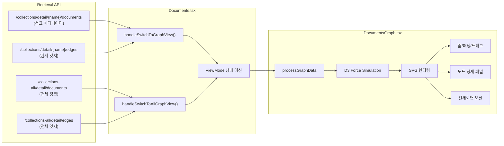

# DocumentsGraph: 문서 관계 시각화 컴포넌트

## 개요

XGEN 2.0의 RAG 시스템은 문서를 청크로 분할하고, 각 청크에서 개념(concept)을 추출해서 관계를 형성한다. 이 관계 데이터는 검색 품질 향상에 활용되지만, 사용자 입장에서는 "내 문서가 어떻게 분석되었는지"를 직관적으로 이해하기 어렵다.

DocumentsGraph 컴포넌트는 이 문제를 D3.js force-directed graph로 해결했다. 문서 청크 노드와 개념 노드를 시각화하고, 그 사이의 관계를 엣지로 표현한다. 컬렉션 단위로 볼 수도 있고, 전체 컬렉션을 통합해서 볼 수도 있다.

## 아키텍처



### 데이터 모델

그래프는 두 종류의 노드와 한 종류의 엣지로 구성된다:

- **Chunk 노드**: 문서의 분할된 조각. `chunk_id`, `file_name`, `chunk_index`, 키워드 등의 메타데이터를 가진다.
- **Concept 노드**: 청크에서 추출된 개념. 엣지의 target으로만 존재하며, 별도 API 없이 엣지 데이터에서 동적으로 생성된다.
- **엣지**: 청크 -> 개념 관계. `relation_type`(관계 유형)과 `edge_weight`(가중치)를 가진다.

```typescript
// types/index.ts
export interface Node {
    id: string;
    label: string;
    type: 'chunk' | 'concept';
    data?: any;
    x?: number;
    y?: number;
    fx?: number | null;  // D3 fixed position (드래그 시)
    fy?: number | null;
}

export interface Link {
    source: string | Node;
    target: string | Node;
    relation_type: string;
    edge_weight: number;
}

export interface GraphData {
    nodes: Node[];
    links: Link[];
}
```

## 핵심 구현

### 그래프 데이터 처리

백엔드에서 받은 raw 데이터를 D3가 소비할 수 있는 형태로 변환하는 `processGraphData()` 함수가 핵심이다.

```typescript
const processGraphData = (): GraphData => {
    const nodeMap = new Map<string, Node>();
    const nodes: Node[] = [];
    const links: Link[] = [];

    // 1. 청크 노드 생성 (메타데이터에서)
    documentDetailMeta.forEach((meta: any) => {
        const chunkNode: Node = {
            id: meta.chunk_id,
            label: `${meta.file_name} (청크 ${meta.chunk_index + 1})`,
            type: 'chunk',
            data: meta
        };
        if (!nodeMap.has(meta.chunk_id)) {
            nodeMap.set(meta.chunk_id, chunkNode);
            nodes.push(chunkNode);
        }
    });

    // 2. 엣지에서 개념 노드 + 링크 동적 생성
    documentDetailEdges.forEach((edge: any) => {
        // 타겟이 nodeMap에 없으면 개념 노드로 생성
        if (!nodeMap.has(edge.target)) {
            const conceptNode: Node = {
                id: edge.target,
                label: edge.target,
                type: 'concept'
            };
            nodeMap.set(edge.target, conceptNode);
            nodes.push(conceptNode);
        }

        links.push({
            source: edge.source,
            target: edge.target,
            relation_type: edge.relation_type,
            edge_weight: edge.edge_weight
        });
    });

    return { nodes, links };
};
```

개념 노드를 별도 API로 가져오지 않고 엣지의 target에서 동적으로 생성하는 것이 설계상 포인트다. 개념은 엣지를 통해서만 의미가 있으므로, 연결되지 않은 고립 개념 노드는 표시할 필요가 없다.

### D3 Force Simulation

```typescript
const simulation = d3.forceSimulation(graphData.nodes)
    .force("link",
        d3.forceLink(graphData.links)
            .id((d: any) => d.id)
            .distance(150)
            .strength(0.8)
    )
    .force("charge",
        d3.forceManyBody().strength(-300)
    )
    .force("center",
        d3.forceCenter(width / 2, height / 2)
    )
    .force("collision",
        d3.forceCollide().radius(40)
    );
```

4개의 힘(force)이 작용한다:

- **link**: 연결된 노드 간 거리를 150px로 유지. strength 0.8로 꽤 강하게 당긴다.
- **charge**: 모든 노드 간 반발력 -300. 노드가 겹치지 않도록 밀어낸다.
- **center**: 그래프를 SVG 중심으로 끌어당긴다.
- **collision**: 반경 40px 내 충돌 방지. charge만으로는 완벽하지 않아 추가했다.

이 값들은 수십~수백 노드 규모에서 적절한 밀도를 보이도록 실험적으로 조정한 것이다. 노드가 1000개 이상이면 force 파라미터를 동적으로 조정해야 하지만, 현재 규모에서는 고정값으로 충분했다.

### 해시 기반 노드 색상

같은 컬렉션의 청크는 같은 색상 계열로, 같은 파일의 청크는 같은 색상으로 표시한다. 이를 위해 컬렉션명과 파일명의 해시값으로 색상을 결정하는 방식을 사용했다.

```typescript
const getNodeColor = (node: Node): string => {
    if (node.type === 'concept') return "#8fffecff";

    // 15가지 색상 계열
    const colorSchemes = [
        ['#FF6B6B', '#FF8787', '#FFA3A3', '#FFBFBF', '#FFDBDB'],
        ['#4ECDC4', '#6BD5CE', '#88DDD8', '#A5E5E2', '#C2EDEC'],
        ['#45B7D1', '#62C3D9', '#7FCFE1', '#9CDBE9', '#B9E7F1'],
        // ... 총 15개 계열, 각 5가지 농도
    ];

    // 컬렉션명 해시 -> 계열 선택
    const collectionName = node.data?.collection_name || '';
    // UUID를 정규식으로 제거 (같은 컬렉션의 다른 버전이 같은 색상을 갖도록)
    const cleanName = collectionName.replace(
        /[0-9a-f]{8}-[0-9a-f]{4}-[0-9a-f]{4}-[0-9a-f]{4}-[0-9a-f]{12}/gi, ''
    );
    const hash = hashString(cleanName);
    const collectionColorScheme = colorSchemes[Math.abs(hash) % colorSchemes.length];

    // 파일명 해시 -> 계열 내 색상 선택
    const fileName = node.data?.file_name || '';
    const fileHash = hashString(fileName);
    return collectionColorScheme[Math.abs(fileHash) % collectionColorScheme.length];
};
```

UUID 제거 처리가 미묘한 포인트다. 컬렉션 이름에 UUID가 포함된 경우가 있는데(버전 관리 용도), 같은 논리적 컬렉션은 같은 색상 계열을 가져야 한다. UUID를 제거하고 나머지 문자열로 해시를 계산하면 이 문제가 해결된다.

### 줌/패닝 구현

D3의 zoom behavior를 SVG에 적용했다:

```typescript
const zoom = d3.zoom<SVGSVGElement, unknown>()
    .scaleExtent([0.1, 4])
    .on("zoom", (event) => {
        g.attr("transform", event.transform);
    });

svg.call(zoom);
```

줌 컨트롤 버튼(확대, 축소, 리셋, 최대화)을 우상단에 플로팅 배치했다:

```typescript
<div className={styles.zoomControls}>
    <button onClick={handleZoomIn} title="확대">+</button>
    <button onClick={handleZoomOut} title="축소">-</button>
    <button onClick={handleResetZoom} title="리셋">R</button>
    <button onClick={handleMaximize} title="최대화">M</button>
</div>
```

### 노드 클릭 상세 패널

노드를 클릭하면 우측에 상세 정보 패널이 나타난다. 청크 노드는 파일명, 청크 인덱스, 키워드, 개념 목록 등을 보여주고, 개념 노드는 연결된 청크 목록을 보여준다.

```typescript
const handleNodeClick = (node: Node) => {
    setSelectedNode(node);
    // 노드 정보 패널 표시
};

// JSX
{selectedNode && (
    <div className={styles.nodeInfoPanel}>
        <h3>{selectedNode.label}</h3>
        {selectedNode.type === 'chunk' && (
            <>
                <div>파일: {selectedNode.data?.file_name}</div>
                <div>청크: #{selectedNode.data?.chunk_index + 1}</div>
                <div className={styles.keywords}>
                    {selectedNode.data?.keywords?.map((kw: string) => (
                        <span key={kw} className={styles.keyword}>{kw}</span>
                    ))}
                </div>
            </>
        )}
    </div>
)}
```

### 전체화면 모달

복잡한 그래프는 60vh 높이의 기본 뷰로는 부족하다. 전체화면 모달을 `createPortal`로 구현했다.

```typescript
{isMaximized && createPortal(
    <div className={styles.modalOverlay}>
        <div className={styles.modalContainer}>
            <svg ref={modalSvgRef} width="100%" height="100%">
                {/* 모달 전용 D3 인스턴스 */}
            </svg>
            <button
                className={styles.closeButton}
                onClick={() => setIsMaximized(false)}
            >
                닫기
            </button>
        </div>
    </div>,
    document.body
)}
```

`createPortal`을 사용한 이유는 z-index 이슈 때문이다. 그래프 컴포넌트가 다른 패널 안에 중첩되어 있으면, CSS z-index만으로는 전체화면 오버레이를 정확히 구현하기 어렵다. `document.body`에 직접 렌더링하면 이 문제가 깔끔하게 해결된다.

일반 뷰(`svgRef`)와 모달 뷰(`modalSvgRef`)는 각각 별도의 D3 simulation 인스턴스를 가진다. 같은 데이터를 사용하지만 SVG 크기와 줌 상태가 다르므로 인스턴스를 공유할 수 없다.

### ViewMode 상태 머신

Documents.tsx는 5개의 뷰 모드를 관리한다:

```typescript
export type ViewMode =
    | 'collections'         // 컬렉션 목록
    | 'documents'           // 문서 목록 (디렉토리 트리 포함)
    | 'documents-graph'     // 특정 컬렉션의 문서 그래프
    | 'document-detail'     // 개별 문서 상세
    | 'all-documents-graph' // 전체 컬렉션 통합 그래프
    ;
```

그래프 뷰 전환 시 두 API를 병렬로 호출한다:

```typescript
const handleSwitchToGraphView = async () => {
    setViewMode('documents-graph');
    await Promise.all([
        handleGetDocumentDetailMeta(),
        handleGetDocumentDetailEdges()
    ]);
};

const handleSwitchToAllGraphView = async () => {
    setViewMode('all-documents-graph');
    await Promise.all([
        handleGetAllDocumentDetailMeta(),
        handleGetAllDocumentDetailEdges()
    ]);
};
```

뷰 모드 전환 시 `previousViewMode`를 저장해서 뒤로가기 복원을 지원한다.

## API 설계

그래프용 API는 4개의 엔드포인트로 구성된다:

```javascript
// retrievalAPI.js

// 특정 컬렉션의 청크 메타데이터
export const getDocumentDetailMeta = async (collectionName) => {
    const response = await apiClient(
        `${API_BASE_URL}/api/retrieval/collections/detail/${collectionName}/documents`
    );
    return await response.json();
};

// 특정 컬렉션의 엣지 (관계)
export const getDocumentDetailEdges = async (collectionName) => {
    const response = await apiClient(
        `${API_BASE_URL}/api/retrieval/collections/detail/${collectionName}/edges`
    );
    return await response.json();
};

// 전체 컬렉션의 청크 메타데이터
export const getAllDocumentDetailMeta = async () => {
    const response = await apiClient(
        `${API_BASE_URL}/api/retrieval/collections-all/detail/documents`
    );
    return await response.json();
};

// 전체 컬렉션의 엣지
export const getAllDocumentDetailEdges = async () => {
    const response = await apiClient(
        `${API_BASE_URL}/api/retrieval/collections-all/detail/edges`
    );
    return await response.json();
};
```

단일 컬렉션(`/collections/detail/{name}/...`)과 전체 컬렉션(`/collections-all/detail/...`)을 별도 엔드포인트로 분리한 이유는 전체 통합 그래프의 데이터 양이 상당히 많기 때문이다. 단일 컬렉션 조회는 빠르게 로딩되지만, 전체 컬렉션은 로딩 스피너가 필요할 수 있다.

## 스타일링

```scss
// DocumentsGraph.module.scss

.graphContainer {
    display: flex;
    height: 60vh;
    position: relative;
    border: 1px solid #e0e0e0;
    border-radius: 8px;
    overflow: hidden;
}

.zoomControls {
    position: absolute;
    top: 12px;
    right: 12px;
    display: flex;
    gap: 4px;
    z-index: 10;

    button {
        width: 32px;
        height: 32px;
        border-radius: 6px;
        background: white;
        border: 1px solid #ddd;
        cursor: pointer;

        &:hover {
            background: #f5f5f5;
        }
    }
}

.nodeInfoPanel {
    width: 350px;
    border-left: 1px solid #e0e0e0;
    padding: 16px;
    overflow-y: auto;
    background: #fafafa;
}

.keyword {
    display: inline-block;
    padding: 2px 8px;
    margin: 2px;
    background: #e3f2fd;
    color: #1565c0;
    border-radius: 12px;
    font-size: 12px;
}

.concept {
    display: inline-block;
    padding: 2px 8px;
    margin: 2px;
    background: #e8f5e9;
    color: #2e7d32;
    border-radius: 12px;
    font-size: 12px;
}

// 전체화면 모달
.modalOverlay {
    position: fixed;
    top: 0;
    left: 0;
    width: 100vw;
    height: 100vh;
    background: rgba(0, 0, 0, 0.7);
    z-index: 9999;
}

.modalContainer {
    width: 90vw;
    height: 90vh;
    margin: 5vh auto;
    background: white;
    border-radius: 12px;
    overflow: hidden;
    position: relative;
}
```

## 트러블슈팅

### 개발 타임라인

```
# 커밋: feat: integrate D3.js graph visualization for document relationships
# 날짜: 2025-08-16

# 커밋: feat: Add functions to fetch all document detail metadata and edges
# 날짜: 2025-08-17

# 커밋: feat: Enhance node color logic in DocumentsGraph
# 날짜: 2025-08-17
```

최초 구현은 2025-08-16에 이루어졌다. 403줄의 DocumentsGraph.tsx와 함께 `d3` 의존성(`v7.9.0`)과 `@types/d3`(`v7.4.3`)를 추가했다. 다음 날 전체 컬렉션 통합 그래프 API와 해시 기반 노드 색상 로직을 추가했다.

### 파일 분리 리팩토링

```
# 커밋: feat: Add CollectionEditModal, DocumentCollectionModal, and DocumentsGraph components
# 날짜: 2025-09-01

# 커밋: refactor: Update import paths to use absolute imports
# 날짜: 2025-09-01
```

처음에는 Documents.tsx 안에 그래프 코드가 인라인으로 들어 있었다. 500줄이 넘는 Documents.tsx가 1000줄에 가까워지면서 파일 분리가 필수적이었다. DocumentsGraph, DocumentCollectionModal, CollectionEditModal을 각각 별도 파일로 분리하고, import 경로를 절대 경로로 전환했다.

### 디렉토리 구조 리팩토링

```
# 커밋: feat: Add DocumentsGraph component for visualizing document relationships
# 날짜: 2025-09-18
```

9월 중순에 대규모 디렉토리 구조 리팩토링이 있었다. `src/app/main/` 아래를 기능별로 분리:

```
src/app/main/
  chatSection/       # 채팅 관련
  workflowSection/   # 워크플로우 + 문서 관리
    components/
      documents/
        DocumentsGraph.tsx
        DocumentsDirectoryTree.tsx
        Documents.tsx
    assets/
      DocumentsGraph.module.scss
    types/
      index.ts
  modelSection/      # 모델 관리
```

DocumentsGraph는 `workflowSection`으로 이동했다. 문서 관리가 워크플로우의 RAG 파이프라인과 밀접하게 연결되어 있기 때문이다.

### D3와 React의 충돌

D3와 React는 둘 다 DOM을 조작하려 하기 때문에 충돌이 생길 수 있다. 이 프로젝트에서는 React가 SVG 컨테이너까지만 관리하고, SVG 내부의 노드/엣지 렌더링은 D3에 완전히 맡겼다. `useEffect`에서 D3 코드를 실행하고, 컴포넌트 언마운트 시 simulation을 정지한다.

```typescript
useEffect(() => {
    if (!svgRef.current || !graphData.nodes.length) return;

    // D3가 SVG 내부를 완전히 제어
    const svg = d3.select(svgRef.current);
    svg.selectAll("*").remove();  // 이전 렌더링 정리

    // ... simulation 설정 및 렌더링

    return () => {
        simulation.stop();  // 언마운트 시 정지
    };
}, [graphData]);
```

이 패턴에서 주의할 점은 `svg.selectAll("*").remove()`다. React의 재렌더링과 D3의 DOM 조작이 충돌하지 않도록, D3가 렌더링하기 전에 SVG 내부를 완전히 비운다. React는 SVG 요소의 존재만 관리하고, 내용은 D3가 관리하는 명확한 경계를 설정한 것이다.

## 결과 및 회고

DocumentsGraph 컴포넌트는 9개 커밋에 걸쳐 약 한 달간(8/16~9/18) 개발됐다. D3.js + React 조합의 핵심은 "누가 DOM을 제어하는가"의 경계를 명확히 하는 것이다.

해시 기반 노드 색상 시스템은 단순하지만 효과적이었다. 15개 색상 계열 x 5가지 농도 = 75개 색상으로 대부분의 컬렉션/파일 조합을 시각적으로 구분할 수 있다. UUID 제거 처리 덕분에 같은 논리적 컬렉션이 항상 같은 색상 계열을 갖는 것도 사용성에 도움이 됐다.

이중 렌더링(일반 뷰 + 전체화면 모달)은 D3 인스턴스를 두 벌 관리해야 해서 코드가 복잡해졌지만, `createPortal` 기반의 전체화면 경험은 데이터 탐색에 필수적이었다. 복잡한 관계 그래프를 60vh 짜리 패널에서 보는 것과 90vh 모달에서 보는 것은 체감이 확연히 다르다.
