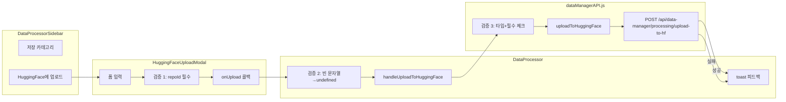

# HuggingFace 업로드 모달: 파라미터 검증과 에러 핸들링

## 개요

XGEN 2.0의 데이터 프로세서에서 전처리한 데이터셋을 HuggingFace Hub에 직접 업로드할 수 있다. 리포지토리 ID, 파일명, 공개/비공개 설정, HuggingFace 계정 정보를 입력하면 백엔드가 Hub API를 호출해서 업로드한다.

간단해 보이는 기능이지만, 필수/선택 파라미터 구분, 빈 문자열 vs undefined 처리, 백엔드 에러 메시지 추출, 사용자 피드백 토스트 등 검증과 에러 핸들링의 기본기가 집약되어 있다. 이 글에서는 HuggingFaceUploadModal의 3단계 검증 레이어와, 데이터 프로세서 전체의 관심사 분리 패턴을 다룬다.

## 아키텍처



3단계 검증 레이어:

1. **모달 UI**: `repoId` 비어있으면 버튼 disabled + alert
2. **부모 컴포넌트**: 빈 문자열을 `undefined`로 변환
3. **API 함수**: 필수 파라미터 타입 검증 + 선택적 파라미터 조건부 포함

## 핵심 구현

### HuggingFaceUploadModal 컴포넌트

5개 폼 필드를 가진 모달이다. `repoId`만 필수이고 나머지는 선택적이다.

```typescript
interface HuggingFaceUploadModalProps {
    isOpen: boolean;
    onClose: () => void;
    onUpload: (
        repoId: string,
        filename: string,
        isPrivate: boolean,
        hfUserId: string,
        hubToken: string
    ) => void;
}

export const HuggingFaceUploadModal: React.FC<HuggingFaceUploadModalProps> = ({
    isOpen, onClose, onUpload
}) => {
    const [repoId, setRepoId] = useState('');
    const [filename, setFilename] = useState('');
    const [isPrivate, setIsPrivate] = useState(false);
    const [hfUserId, setHfUserId] = useState('');
    const [hubToken, setHubToken] = useState('');

    if (!isOpen) return null;

    const handleSubmit = () => {
        // 검증 1: 필수 필드
        if (!repoId.trim()) {
            alert('리포지토리 ID를 입력해주세요.');
            return;
        }
        onUpload(repoId, filename, isPrivate, hfUserId, hubToken);
        // 폼 초기화
        setRepoId('');
        setFilename('');
        setIsPrivate(false);
        setHfUserId('');
        setHubToken('');
        onClose();
    };

    return createPortal(
        <div className={styles.dialogOverlay}>
            <div className={styles.uploadModal}>
                <div className={styles.modalHeader}>
                    <h3>HuggingFace Hub 업로드</h3>
                    <button onClick={onClose}><IoClose /></button>
                </div>

                <div className={styles.formGroup}>
                    <label>리포지토리 ID *</label>
                    <input
                        value={repoId}
                        onChange={(e) => setRepoId(e.target.value)}
                        placeholder="username/dataset-name"
                    />
                </div>

                <div className={styles.formGroup}>
                    <label>파일명 (선택)</label>
                    <input
                        value={filename}
                        onChange={(e) => setFilename(e.target.value)}
                        placeholder="data.parquet"
                    />
                </div>

                <div className={styles.formGroup}>
                    <label>HuggingFace 사용자 ID (선택)</label>
                    <input
                        value={hfUserId}
                        onChange={(e) => setHfUserId(e.target.value)}
                    />
                </div>

                <div className={styles.formGroup}>
                    <label>Hub Token (선택)</label>
                    <input
                        type="password"
                        value={hubToken}
                        onChange={(e) => setHubToken(e.target.value)}
                        placeholder="hf_..."
                    />
                </div>

                <div className={styles.checkboxGroup}>
                    <label>
                        <input
                            type="checkbox"
                            checked={isPrivate}
                            onChange={(e) => setIsPrivate(e.target.checked)}
                        />
                        비공개 리포지토리
                    </label>
                </div>

                <button
                    className={styles.confirmButton}
                    onClick={handleSubmit}
                    disabled={!repoId.trim()}
                >
                    업로드
                </button>
            </div>
        </div>,
        document.body
    );
};
```

`disabled={!repoId.trim()}`으로 필수 필드가 비어있으면 버튼 자체가 비활성화된다. `handleSubmit`에서의 추가 검증은 이중 안전장치다. Hub Token은 `type="password"`로 마스킹 처리한다.

### DataProcessor — 부모 컴포넌트의 역할

모달은 순수하게 UI와 폼 입력만 담당한다. 실제 API 호출과 에러 처리는 부모인 DataProcessor가 한다.

```typescript
const handleUploadToHuggingFace = async (
    repoId: string,
    filename: string,
    isPrivate: boolean,
    hfUserId: string,
    hubToken: string
) => {
    try {
        showSuccessToastKo('HuggingFace Hub에 데이터셋을 업로드하는 중...');
        const result = await uploadToHuggingFace(
            managerId,
            repoId,
            filename || undefined,   // 빈 문자열 → undefined
            isPrivate,
            hfUserId || undefined,   // 빈 문자열 → undefined
            hubToken || undefined    // 빈 문자열 → undefined
        );

        if (result.success) {
            showSuccessToastKo(
                `데이터셋이 HuggingFace Hub에 성공적으로 업로드되었습니다!\n`
                + `리포지토리: ${result.upload_info?.repo_id || repoId}`
            );
        } else {
            showErrorToastKo(
                result.message || 'HuggingFace 업로드에 실패했습니다.'
            );
        }
    } catch (error) {
        showErrorToastKo(
            `HuggingFace 업로드 실패: ${
                error instanceof Error ? error.message : '알 수 없는 오류'
            }`
        );
    }
};
```

핵심 포인트는 `filename || undefined`다. 모달에서 빈 문자열(`""`)이 넘어올 수 있는데, API 함수에 빈 문자열을 보내면 백엔드에서 빈 파일명을 사용하려 해서 에러가 난다. `||` 연산자로 falsy 값을 `undefined`로 변환하면 API 함수에서 해당 파라미터를 요청 본문에 포함하지 않는다.

### uploadToHuggingFace API 함수 — 3단계 검증의 마지막

```
# 커밋: feat: Enhance uploadToHuggingFace function with parameter validation
# 날짜: 2025-09-23 13:24
```

```javascript
export const uploadToHuggingFace = async (
    managerId, repoId, filename, isPrivate = false, hfUserId, hubToken
) => {
    try {
        // 검증 3: 필수 파라미터
        if (!managerId) {
            throw new Error('Manager ID는 필수입니다.');
        }
        if (!repoId || typeof repoId !== 'string' || repoId.trim() === '') {
            throw new Error('Repository ID는 필수입니다.');
        }

        // 요청 본문 구성 — 필수 필드만 먼저
        const requestBody = {
            manager_id: managerId,
            repo_id: repoId.trim(),
            private: isPrivate
        };

        // 선택적 파라미터: truthy + 타입 체크 + trim 후 추가
        if (filename && typeof filename === 'string' && filename.trim() !== '') {
            requestBody.filename = filename.trim();
        }
        if (hfUserId && typeof hfUserId === 'string' && hfUserId.trim() !== '') {
            requestBody.hf_user_id = hfUserId.trim();
        }
        if (hubToken && typeof hubToken === 'string' && hubToken.trim() !== '') {
            requestBody.hub_token = hubToken.trim();
        }

        const response = await apiClient(
            `${API_BASE_URL}/api/data-manager/processing/upload-to-hf`,
            {
                method: 'POST',
                headers: { 'Content-Type': 'application/json' },
                body: JSON.stringify(requestBody),
            }
        );

        // HTTP 에러 처리 — 에러 본문에서 detail 추출
        if (!response.ok) {
            const errorData = await response.json().catch(() => null);
            throw new Error(
                errorData?.detail
                || `HuggingFace 업로드 요청 실패: ${response.status} ${response.statusText}`
            );
        }

        const data = await response.json();
        devLog.info(
            `Dataset uploaded to HuggingFace: ${managerId} → ${repoId}:`,
            data
        );
        return data;
    } catch (error) {
        devLog.error(
            `Failed to upload to HuggingFace: ${managerId} → ${repoId}:`,
            error
        );
        throw error;  // 상위로 전파
    }
};
```

선택적 파라미터 처리 패턴이 핵심이다:

```javascript
if (filename && typeof filename === 'string' && filename.trim() !== '') {
    requestBody.filename = filename.trim();
}
```

세 가지를 동시에 검사한다:
1. **truthy**: `null`, `undefined`, `""` 모두 거름
2. **typeof string**: 잘못된 타입 방어
3. **trim 후 비어있지 않음**: 공백만 있는 문자열 거름

이렇게 검사를 통과한 값만 `requestBody`에 추가하므로, 백엔드에는 실제로 의미 있는 값만 전달된다.

HTTP 에러 응답에서 메시지를 추출하는 부분도 방어적이다:

```javascript
const errorData = await response.json().catch(() => null);
throw new Error(
    errorData?.detail
    || `HuggingFace 업로드 요청 실패: ${response.status} ${response.statusText}`
);
```

`response.json()`이 실패할 수 있다(응답이 JSON이 아닌 경우). `.catch(() => null)`로 안전하게 처리하고, `detail` 필드가 없으면 HTTP 상태 코드로 폴백한다.

## 사이드바 트리거

사이드바에서 업로드 기능을 선택하면 데이터 존재 여부를 먼저 확인한다:

```typescript
const handleUploadToHuggingFace = async () => {
    if (!dataTableInfo || !dataTableInfo.success
        || dataTableInfo.sample_count === 0) {
        showErrorToastKo('업로드할 데이터가 없습니다.');
        return;
    }
    if (onHuggingFaceUploadModal) {
        onHuggingFaceUploadModal();
    }
};
```

빈 데이터셋을 업로드하려는 시도를 사이드바 레벨에서 차단한다. 이것이 검증의 "0단계"라고 할 수 있다.

## 관심사 분리

이 기능의 설계에서 가장 중요한 패턴은 **관심사 분리**다. 세 계층이 각각 명확한 역할을 가진다:

| 계층 | 역할 | 검증 범위 |
|------|------|----------|
| HuggingFaceUploadModal | 폼 UI + 필수 필드 비어있는지 | repoId 비어있음 |
| DataProcessor | API 호출 + toast 피드백 | 빈 문자열→undefined 변환 |
| uploadToHuggingFace | HTTP 통신 + 타입 안전성 | 필수/선택 파라미터 검증, 에러 메시지 추출 |

```
# 커밋: feat: Enhance uploadToHuggingFace function with parameter validation
# 날짜: 2025-09-23 13:24
```

같은 커밋에서 사이드바의 불필요한 API 임포트도 정리했다:

```diff
- import { removeDataset, uploadLocalDataset, exportDatasetAsCSV,
-   exportDatasetAsParquet, getDatasetStatistics, dropDatasetColumns,
-   replaceColumnValues, applyColumnOperation, removeNullRows,
-   uploadToHuggingFace } from '@/app/_common/api/dataManagerAPI';
+ import { removeDataset, uploadLocalDataset, exportDatasetAsCSV,
+   exportDatasetAsParquet, getDatasetStatistics,
+   removeNullRows } from '@/app/_common/api/dataManagerAPI';
```

사이드바가 직접 API를 호출하지 않으므로, `dropDatasetColumns`, `replaceColumnValues`, `applyColumnOperation`, `uploadToHuggingFace` 임포트가 불필요했다. 사이드바는 콜백 함수를 통해 부모에게 "이 기능을 실행해달라"고 요청할 뿐이다.

## 스타일링

```scss
// HuggingFaceUploadModal.module.scss
.dialogOverlay {
    position: fixed;
    top: 0;
    left: 0;
    width: 100%;
    height: 100%;
    background: rgba(0, 0, 0, 0.5);
    z-index: 9999;
    display: flex;
    align-items: center;
    justify-content: center;
}

.uploadModal {
    background: white;
    border-radius: 12px;
    padding: 24px;
    max-width: 600px;
    width: 90%;
    max-height: 90vh;
    overflow-y: auto;
}

.formInput {
    width: 100%;
    padding: 8px 12px;
    border: 1px solid #d1d5db;
    border-radius: 6px;

    &:focus {
        border-color: #3b82f6;
        box-shadow: 0 0 0 3px rgba(59, 130, 246, 0.1);
        outline: none;
    }
}

.confirmButton {
    width: 100%;
    padding: 10px;
    background: #3b82f6;
    color: white;
    border: none;
    border-radius: 8px;
    font-weight: 600;
    cursor: pointer;

    &:disabled {
        background: #9ca3af;
        cursor: not-allowed;
    }
}
```

disabled 상태에서 배경색이 회색(`#9ca3af`)으로 바뀌어 시각적으로 비활성 상태임을 명확히 전달한다.

## 결과 및 회고

HuggingFace 업로드 모달은 코드 양이 많지 않지만(모달 ~100줄, API ~50줄, 핸들러 ~30줄), 프론트엔드의 기본적인 검증과 에러 핸들링 패턴이 잘 드러나는 사례다.

3단계 검증 레이어(UI → 부모 컴포넌트 → API 함수)는 "방어적 프로그래밍"의 전형이다. 각 레이어가 자기 수준에서 잡을 수 있는 문제를 잡는다. UI는 사용자 입력을 즉시 피드백하고, 부모 컴포넌트는 데이터 형변환을 담당하고, API 함수는 최종적으로 타입 안전성을 보장한다.

선택적 파라미터의 `truthy + typeof + trim` 삼중 검사는 과도하다고 느낄 수 있지만, JavaScript의 타입 유연성을 고려하면 합리적이다. 특히 여러 개발자가 다양한 위치에서 같은 API 함수를 호출하는 상황에서, 잘못된 타입이 들어오는 것을 함수 레벨에서 방어하는 것이 안전하다.
