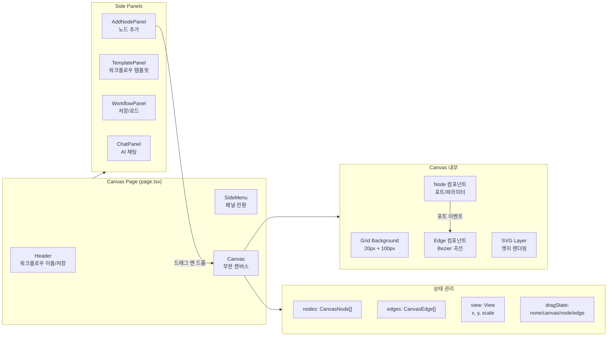

# Next.js 기반 AI 워크플로우 에디터 만들기 (from scratch)

## 개요

XGEN 2.0 프로젝트에서 AI 워크플로우를 시각적으로 설계할 수 있는 노드 기반 에디터가 필요했다. LangChain, 데이터 처리, 유틸리티 등 다양한 AI 함수를 노드로 표현하고, 이를 엣지로 연결해 파이프라인을 구성하는 도구다. React Flow나 xyflow 같은 기존 라이브러리를 쓸 수도 있었지만, XGEN 플랫폼의 특수한 요구사항(포트 타입 호환성, 파라미터 인라인 편집, 워크플로우 실행 통합 등)을 고려해 처음부터 직접 만들기로 했다.

기술 스택은 Next.js 15.3.2(Turbopack), React 19, TypeScript 5, Tailwind CSS 4 + SCSS Modules를 채택했다. 이 글에서는 무한 캔버스, 노드/엣지 렌더링, 상태 관리, 컴포넌트 아키텍처를 중심으로 약 7주간의 개발 과정을 다룬다.

## 전체 아키텍처



## 프로젝트 구조

```
src/app/canvas/
  page.tsx                    # 엔트리포인트
  types.ts                    # 전체 타입 정의 (~220줄)
  components/
    Canvas.tsx                # 무한 캔버스 (~820줄)
    Node.tsx                  # 노드 컴포넌트 (~300줄)
    Edge.tsx                  # 엣지 컴포넌트 (~40줄)
    Header.tsx                # 워크플로우 이름/저장
    SideMenu.tsx              # 사이드 네비게이션
    ExecutionPanel.tsx        # 실행 패널
    Helper/
      DraggableNodeItem.tsx   # 드래그 앤 드롭 아이템
      NodeList.tsx            # 노드 목록
    SideMenuPanel/
      AddNodePanel.tsx        # 노드 추가
      ChatPanel.tsx           # AI 채팅
      MiniCanvas.tsx          # 미니맵 프리뷰
      TemplatePanel.tsx       # 템플릿 목록
      TemplatePreview.tsx     # 템플릿 프리뷰
      WorkflowPanel.tsx       # 워크플로우 관리
  assets/
    Canvas.module.scss        # 캔버스 스타일
    Node.module.scss          # 노드 스타일
    Edge.module.scss          # 엣지 스타일
    ...
  constants/
    nodes.js                  # LangChain/Utilities 노드 정의
    workflow/
      Basic_Chatbot.json      # 기본 챗봇 템플릿
      Data_Processing.json    # 데이터 처리 템플릿
```

## 타입 시스템 설계

워크플로우 에디터의 모든 데이터 구조를 TypeScript로 엄격하게 정의했다. `types.ts` 파일 하나에 약 220줄의 타입이 들어있으며, 이것이 전체 컴포넌트 간 계약(contract) 역할을 한다.

```typescript
// 기본 좌표 타입
export interface Position {
    x: number;
    y: number;
}

export interface View {
    x: number;
    y: number;
    scale: number;
}

// 포트 타입 - 노드 간 연결 지점
export interface Port {
    id: string;
    name: string;
    type: string;        // 'STR' | 'INT' | 'FLOAT' | 'ANY'
    required?: boolean;
    multi?: boolean;     // 다중 연결 허용 여부
}

// 파라미터 - 노드 내부 설정값
export interface Parameter {
    id: string;
    name: string;
    value: string | number;
    type?: string;
    required?: boolean;
    optional?: boolean;
    options?: ParameterOption[];  // select 드롭다운
    step?: number;               // range input
    min?: number;
    max?: number;
}

// 노드 데이터
export interface NodeData {
    id: string;
    nodeName: string;
    functionId?: string;
    inputs?: Port[];
    outputs?: Port[];
    parameters?: Parameter[];
}

// Canvas에 배치된 노드 (위치 정보 포함)
export interface CanvasNode {
    id: string;
    data: NodeData;
    position: Position;
}

// 엣지 연결 정보
export interface EdgeConnection {
    nodeId: string;
    portId: string;
    portType: string;    // 'input' | 'output'
    type?: string;
}

export interface CanvasEdge {
    id: string;
    source: EdgeConnection;
    target: EdgeConnection;
}
```

### 핵심 설계 결정: DragState 타입 분리

캔버스에서 발생하는 드래그 이벤트를 네 가지 모드로 분리했다.

```typescript
export interface DragState {
    type: 'none' | 'canvas' | 'node' | 'edge';
    startX?: number;
    startY?: number;
    nodeId?: string;
    offsetX?: number;
    offsetY?: number;
}
```

`none`은 아무 드래그도 없는 상태, `canvas`는 배경을 잡고 패닝하는 상태, `node`는 노드를 이동하는 상태, `edge`는 포트에서 엣지를 끌어 연결하는 상태다. 이 구분 덕분에 `mouseMove` 이벤트 핸들러 하나로 세 가지 드래그를 깔끔하게 처리할 수 있었다.

## 무한 캔버스 구현

### Canvas.tsx의 핵심 구조

Canvas 컴포넌트는 전체 에디터의 심장이다. `forwardRef` + `useImperativeHandle` 패턴으로 외부에서 캔버스 상태를 제어할 수 있게 했다.

```typescript
export interface CanvasRef {
    getCanvasState: () => CanvasState;
    addNode: (nodeData: NodeData, clientX: number, clientY: number) => void;
    loadCanvasState: (state: Partial<CanvasState>) => void;
    loadWorkflowState: (state: Partial<CanvasState>) => void;
    getCenteredView: () => View;
    clearSelectedNode: () => void;
    validateAndPrepareExecution: () => ExecutionValidationResult;
}

const Canvas = forwardRef<CanvasRef, CanvasProps>((props, ref) => {
    const [view, setView] = useState<View>({ x: 0, y: 0, scale: 1 });
    const [nodes, setNodes] = useState<CanvasNode[]>([]);
    const [edges, setEdges] = useState<CanvasEdge[]>([]);
    const [dragState, setDragState] = useState<DragState>({ type: 'none' });
    const [edgePreview, setEdgePreview] = useState<EdgePreview | null>(null);

    useImperativeHandle(ref, () => ({
        getCanvasState: (): CanvasState => ({ view, nodes, edges }),
        addNode: (nodeData, clientX, clientY) => {
            // 클라이언트 좌표를 월드 좌표로 변환해서 노드 추가
            const worldPos = clientToWorld(clientX, clientY);
            const newNode: CanvasNode = {
                id: generateId(),
                data: { ...nodeData },
                position: worldPos
            };
            setNodes(prev => [...prev, newNode]);
        },
        loadCanvasState: (state) => {
            if (state.nodes) setNodes(state.nodes);
            if (state.edges) setEdges(state.edges);
            if (state.view) setView(state.view);
        },
        // ...
    }));
});
```

# 커밋: feat: initialize Next.js project with Tailwind CSS and global styles
# 날짜: 2025-06-11 01:05

### CSS transform 기반 패닝/줌

무한 캔버스의 핵심은 CSS `transform`이다. 별도의 Canvas 2D API나 SVG viewBox를 쓰지 않고, 순수 CSS transform으로 패닝과 줌을 구현했다.

```typescript
// 캔버스 렌더링 - CSS transform으로 뷰 변환
<div className={styles.canvas} ref={canvasRef}>
    <div
        className={styles.content}
        style={{
            transform: `translate(${view.x}px, ${view.y}px) scale(${view.scale})`,
            transformOrigin: '0 0'
        }}
    >
        {/* 그리드 배경 */}
        <div className={styles.grid} />

        {/* SVG 엣지 레이어 */}
        <svg className={styles.edgesSvg}>
            {edges.map(edge => (
                <Edge key={edge.id} {...edgeProps} />
            ))}
            {edgePreview && <Edge {...previewProps} />}
        </svg>

        {/* 노드 레이어 */}
        {nodes.map(node => (
            <Node key={node.id} {...nodeProps} />
        ))}
    </div>
</div>
```

`view` 상태 하나로 전체 캔버스의 위치(x, y)와 확대 비율(scale)을 관리한다. 마우스 휠로 줌, 배경 드래그로 패닝이 가능하다.

```typescript
const MIN_SCALE = 0.6;
const MAX_SCALE = 20;
const ZOOM_SENSITIVITY = 0.05;

const handleWheel = (e: WheelEvent) => {
    e.preventDefault();
    const rect = canvasRef.current.getBoundingClientRect();
    const mouseX = e.clientX - rect.left;
    const mouseY = e.clientY - rect.top;

    const delta = e.deltaY > 0 ? -ZOOM_SENSITIVITY : ZOOM_SENSITIVITY;
    const newScale = Math.max(MIN_SCALE, Math.min(MAX_SCALE, view.scale + delta));

    // 마우스 위치를 기준으로 줌 (마우스 포인트 고정)
    const scaleRatio = newScale / view.scale;
    setView({
        x: mouseX - (mouseX - view.x) * scaleRatio,
        y: mouseY - (mouseY - view.y) * scaleRatio,
        scale: newScale
    });
};
```

줌 범위는 0.6배에서 20배까지 허용했다. 줌 시 마우스 포인터 위치를 고정점으로 사용해서 자연스러운 줌 인/아웃이 된다. 이 수학 공식은 단순하지만 효과적이다: `새 offset = 마우스위치 - (마우스위치 - 현재offset) * 스케일비율`.

### 그리드 배경

CSS-only 그리드를 구현했다. 소그리드(20px)와 대그리드(100px)를 `background-image`의 `linear-gradient`로 그린다.

```scss
.grid {
    position: absolute;
    width: 20000px;
    height: 20000px;
    top: -10000px;
    left: -10000px;
    background-size: 20px 20px, 100px 100px;
    background-image:
        linear-gradient(to right, rgba(0,0,0,0.03) 1px, transparent 1px),
        linear-gradient(to bottom, rgba(0,0,0,0.03) 1px, transparent 1px),
        linear-gradient(to right, rgba(0,0,0,0.08) 1px, transparent 1px),
        linear-gradient(to bottom, rgba(0,0,0,0.08) 1px, transparent 1px);
    pointer-events: none;
}
```

20000x20000 크기의 거대한 그리드 div를 배치하고, `pointer-events: none`으로 마우스 이벤트를 통과시킨다. CSS transform의 scale이 적용되므로 줌 레벨에 따라 그리드 간격이 자연스럽게 변한다.

### 좌표 변환: 클라이언트 -> 월드

캔버스에서 가장 까다로운 부분 중 하나가 좌표 변환이다. 브라우저의 클라이언트 좌표를 캔버스의 월드 좌표로 바꿔야 노드 배치, 포트 위치 계산 등이 정확해진다.

```typescript
const clientToWorld = (clientX: number, clientY: number): Position => {
    const rect = canvasRef.current.getBoundingClientRect();
    return {
        x: (clientX - rect.left - view.x) / view.scale,
        y: (clientY - rect.top - view.y) / view.scale
    };
};
```

역변환도 필요하다. 노드의 월드 좌표를 화면에 렌더링할 때는 CSS transform이 자동으로 처리하지만, 포트 위치를 계산할 때는 DOM의 `getBoundingClientRect()`가 반환하는 클라이언트 좌표를 다시 월드 좌표로 변환해야 한다.

## 노드 드래그 구현

### 세 가지 드래그 모드

`mouseDown -> mouseMove -> mouseUp` 이벤트 체인에서 `DragState.type`에 따라 동작이 달라진다.

```typescript
const handleCanvasMouseDown = (e: React.MouseEvent) => {
    if (e.button !== 0) return;  // 좌클릭만
    // 배경 클릭 -> 캔버스 패닝 시작
    setDragState({
        type: 'canvas',
        startX: e.clientX - view.x,
        startY: e.clientY - view.y
    });
    setSelectedNodeId(null);
    setSelectedEdgeId(null);
};

const handleNodeMouseDown = useCallback((e: React.MouseEvent, nodeId: string) => {
    if (e.button !== 0) return;
    setSelectedNodeId(nodeId);
    const node = nodes.find(n => n.id === nodeId);
    if (!node) return;
    // 노드 클릭 -> 노드 드래그 시작 (offset 계산)
    const worldPos = clientToWorld(e.clientX, e.clientY);
    setDragState({
        type: 'node',
        nodeId,
        offsetX: worldPos.x - node.position.x,
        offsetY: worldPos.y - node.position.y
    });
}, [nodes, view]);

const handleMouseMove = (e: MouseEvent) => {
    if (dragState.type === 'canvas') {
        // 캔버스 패닝
        setView(prev => ({
            ...prev,
            x: e.clientX - dragState.startX!,
            y: e.clientY - dragState.startY!
        }));
    } else if (dragState.type === 'node') {
        // 노드 이동
        const worldPos = clientToWorld(e.clientX, e.clientY);
        setNodes(prev => prev.map(n =>
            n.id === dragState.nodeId
                ? { ...n, position: {
                    x: worldPos.x - dragState.offsetX!,
                    y: worldPos.y - dragState.offsetY!
                }}
                : n
        ));
    } else if (dragState.type === 'edge') {
        // 엣지 프리뷰 업데이트
        const worldPos = clientToWorld(e.clientX, e.clientY);
        setEdgePreview(prev => prev ? { ...prev, targetPos: worldPos } : null);
    }
};
```

# 커밋: feat: implement draggable nodes and enhance canvas functionality
# 날짜: 2025-06-11 07:16

노드 드래그에서 핵심은 `offsetX/offsetY`다. 노드를 클릭한 지점과 노드 원점의 차이를 저장해두어, 드래그 중에도 노드가 마우스 커서에 정확히 따라오도록 한다.

## 포트 위치 계산

### portRef 등록과 월드 좌표 변환

노드의 Input/Output 포트 위치는 동적으로 계산해야 한다. 노드 크기가 파라미터 수에 따라 달라지고, 포트도 여러 개일 수 있어서 하드코딩이 불가능하다. DOM 레퍼런스를 수집한 뒤 `useLayoutEffect`에서 월드 좌표로 변환하는 방식을 사용했다.

```typescript
const portRefs = useRef(new Map<string, HTMLElement>());
const [portPositions, setPortPositions] = useState<Record<string, Position>>({});

const registerPortRef = useCallback((
    nodeId: string, portId: string, portType: string, el: HTMLElement | null
) => {
    const key = `${nodeId}__PORTKEYDELIM__${portId}__PORTKEYDELIM__${portType}`;
    if (el) {
        portRefs.current.set(key, el);
    } else {
        portRefs.current.delete(key);
    }
}, []);

// 포트 DOM 위치 -> 월드 좌표 변환
useLayoutEffect(() => {
    const positions: Record<string, Position> = {};
    const canvasRect = canvasRef.current?.getBoundingClientRect();
    if (!canvasRect) return;

    portRefs.current.forEach((el, key) => {
        const rect = el.getBoundingClientRect();
        // 클라이언트 좌표를 월드 좌표로 변환
        positions[key] = {
            x: (rect.left + rect.width / 2 - canvasRect.left - view.x) / view.scale,
            y: (rect.top + rect.height / 2 - canvasRect.top - view.y) / view.scale
        };
    });
    setPortPositions(positions);
}, [nodes, view, edges]);
```

포트 키 구분자로 `__PORTKEYDELIM__`이라는 긴 문자열을 사용한 이유가 있다. 초기에는 하이픈(`-`)으로 구분했는데, 노드 ID나 포트 ID에도 하이픈이 포함되어 있어서 파싱이 꼬지는 문제가 발생했다. 이 버그를 해결하기 위해 충돌 가능성이 없는 커스텀 구분자를 도입한 것이다.

# 커밋: Implement robust edge snapping and connection logic
# 날짜: 2025-06-16 06:19

## Edge(엣지) 컴포넌트

### Bezier 곡선 렌더링

엣지는 SVG `<path>`로 렌더링하며, 3차 Bezier 곡선을 사용한다.

```typescript
const getBezierPath = (
    x1: number, y1: number, x2: number, y2: number
): string => {
    const controlPointX1 = x1 + Math.abs(x2 - x1) * 0.5;
    const controlPointX2 = x2 - Math.abs(x2 - x1) * 0.5;
    return `M ${x1},${y1} C ${controlPointX1},${y1} ${controlPointX2},${y2} ${x2},${y2}`;
};
```

컨트롤 포인트를 소스와 타깃 사이 거리의 50%만큼 수평으로 배치해서, 노드 간 거리에 비례하는 자연스러운 곡선이 그려진다. 수직 위치는 각각 소스와 타깃의 y좌표를 그대로 사용해서 수평 흐름 방향의 연결이 된다.

```typescript
const Edge: React.FC<EdgeProps> = ({
    id, sourcePos, targetPos, onEdgeClick, isSelected, isPreview
}) => {
    if (!sourcePos || !targetPos) return null;
    const d = getBezierPath(sourcePos.x, sourcePos.y, targetPos.x, targetPos.y);

    return (
        <g className={`${styles.edgeGroup} ${isSelected ? styles.selected : ''}`}
           onClick={handleEdgeClick}>
            <path className={styles.edgeHitbox} d={d} />
            <path className={styles.edgePath} d={d} />
        </g>
    );
};

export default memo(Edge);
```

# 커밋: feat(canvas): add Edge and Node components with Bezier path rendering and parameter handling
# 날짜: 2025-07-15 07:12

`edgeHitbox`는 투명하지만 두꺼운(10px) 패스로, 사용자가 얇은 엣지 선을 클릭하기 쉽게 하는 역할이다. 실제 보이는 `edgePath`는 2px 두께다.

## Node 컴포넌트 구조

노드 컴포넌트는 헤더(이름/함수ID), IO 포트(Input/Output), 파라미터 섹션의 세 영역으로 구성된다.

```typescript
const Node: React.FC<NodeProps> = ({
    id, data, position, isSelected, onNodeMouseDown,
    onPortMouseDown, onPortMouseUp, registerPortRef,
    snappedPortKey, onParameterChange, isSnapTargetInvalid,
    isPreview, onNodeNameChange
}) => {
    const { nodeName, functionId, inputs = [], outputs = [], parameters = [] } = data;

    // 기본 파라미터와 고급 파라미터 분리
    const basicParameters = parameters.filter(p => !p.optional);
    const advancedParameters = parameters.filter(p => p.optional);
    const hasAdvancedParams = advancedParameters.length > 0;
    const [showAdvanced, setShowAdvanced] = useState(false);

    // 더블클릭으로 노드 이름 편집
    const [isEditingName, setIsEditingName] = useState(false);
    const [editingName, setEditingName] = useState(nodeName);

    return (
        <div
            className={`${styles.node} ${isSelected ? styles.selected : ''}`}
            style={{ transform: `translate(${position.x}px, ${position.y}px)` }}
            onMouseDown={(e) => { e.stopPropagation(); onNodeMouseDown(e, id); }}
        >
            <div className={styles.header}>
                {isEditingName ? (
                    <input value={editingName} onChange={...} onKeyDown={...} onBlur={...} />
                ) : (
                    <span onDoubleClick={handleNameDoubleClick}>
                        {displayName}
                    </span>
                )}
                {functionId && <span className={styles.functionId}>({functionId})</span>}
            </div>
            <div className={styles.body}>
                {/* INPUT / OUTPUT 포트 */}
                <div className={styles.ioContainer}>
                    <div className={styles.column}>
                        <div className={styles.sectionHeader}>INPUT</div>
                        {inputs.map(portData => (
                            <div key={portData.id} className={styles.portRow}>
                                <div
                                    ref={(el) => registerPortRef(id, portData.id, 'input', el)}
                                    className={portClasses}
                                    onMouseDown={() => onPortMouseDown({...})}
                                    onMouseUp={() => onPortMouseUp({...})}
                                >
                                    {portData.type}
                                </div>
                                <span>{portData.name}</span>
                            </div>
                        ))}
                    </div>
                    {/* OUTPUT 포트 (동일 구조, 오른쪽 정렬) */}
                </div>

                {/* PARAMETER 섹션 */}
                <div className={styles.paramSection}>
                    {basicParameters.map(param => renderParameter(param))}
                    {hasAdvancedParams && (
                        <div className={styles.advancedParams}>
                            <div onClick={toggleAdvanced}>
                                Advanced {showAdvanced ? '▲' : '▼'}
                            </div>
                            {showAdvanced && advancedParameters.map(renderParameter)}
                        </div>
                    )}
                </div>
            </div>
        </div>
    );
};

export default memo(Node);
```

# 커밋: feat: refactor Node and Canvas components; enhance node structure and styling
# 날짜: 2025-06-11 07:44

노드 위치 지정에 `position: absolute` 대신 `transform: translate()`를 사용한 것은 의도적인 선택이다. transform은 GPU 가속이 적용되어 드래그 중 노드 이동이 훨씬 부드럽다.

### 파라미터 렌더링

파라미터 타입에 따라 다른 입력 컨트롤을 렌더링한다.

```typescript
const renderParameter = (param: Parameter) => (
    <div key={param.id} className={styles.paramRow}>
        <span className={`${styles.paramName} ${param.required ? styles.required : ''}`}>
            {param.name}
        </span>
        {param.options ? (
            // select 드롭다운 (예: GPT-4o, GPT-4, GPT-3.5 Turbo)
            <select
                value={param.value}
                onChange={(e) => handleParamValueChange(e, param.id)}
            >
                {param.options.map(opt => (
                    <option key={String(opt.value)} value={opt.value}>
                        {opt.label || opt.value}
                    </option>
                ))}
            </select>
        ) : (
            // text/number input (예: Temperature 0.7, Max Tokens 1000)
            <input
                type={typeof param.value === 'number' ? 'number' : 'text'}
                value={param.value}
                onChange={(e) => handleParamValueChange(e, param.id)}
                step={param.step}
                min={param.min}
                max={param.max}
            />
        )}
    </div>
);
```

# 커밋: feat: Add parameter selection field in Node component for optional parameters
# 날짜: 2025-07-08 06:22

## 노드 데이터 정의

LangChain과 Utilities 카테고리의 노드를 정적으로 정의했다. 각 노드에는 Input/Output 포트와 파라미터 스펙이 들어있다.

```javascript
export const NODE_DATA = [
    {
        categoryId: 'langchain',
        categoryName: 'LangChain',
        icon: 'LuBrainCircuit',
        functions: [{
            functionId: 'chat_models',
            functionName: 'Chat Models',
            nodes: [{
                id: 'chat-openai',
                nodeName: 'ChatOpenAI',
                inputs: [
                    { id: 'in-msg', name: 'Messages', multi: true, type: 'STR' },
                    { id: 'in-stop', name: 'Stop Sequence', multi: false, type: 'STR' }
                ],
                parameters: [
                    { id: 'p-model', name: 'Model', value: 'gpt-4o', optional: false,
                      options: [
                          { value: 'gpt-4o', label: 'GPT-4o' },
                          { value: 'gpt-4', label: 'GPT-4' },
                          { value: 'gpt-3.5-turbo', label: 'GPT-3.5 Turbo' }
                      ]},
                    { id: 'p-temp', name: 'Temperature', value: 0.7, step: 0.1, optional: false },
                    { id: 'p-max-tokens', name: 'Max Tokens', value: 1000, optional: true },
                    // ...
                ],
                outputs: [
                    { id: 'out-1', name: 'Output1', multi: false, type: 'STR' },
                    // ...
                ]
            }]
        }]
    },
    {
        categoryId: 'utilities',
        categoryName: 'Utilities',
        icon: 'LuWrench',
        functions: [{
            functionId: 'util_types',
            functionName: 'Type Generators',
            nodes: [{
                id: 'util-gen-str',
                nodeName: 'Generate String',
                parameters: [
                    { id: 'p-text', name: 'Text', value: 'Hello World', optional: false }
                ],
                outputs: [{ id: 'out-str', name: 'String', type: 'STR' }]
            }]
        }]
    }
];
```

카테고리 > 함수 > 노드의 3단 계층 구조로, AddNodePanel에서 트리 형태로 탐색할 수 있다.

## MiniCanvas: 워크플로우 프리뷰

TemplatePanel에서 워크플로우를 선택하면 미리보기 캔버스가 표시된다. 전체 캔버스와 동일한 Node/Edge 컴포넌트를 `isPreview={true}` 모드로 재사용했다.

```typescript
const MiniCanvas: React.FC<MiniCanvasProps> = ({ template }) => {
    const [scale, setScale] = useState<number>(0.6);
    const [offset, setOffset] = useState<Position>({ x: 0, y: 0 });

    const nodes: CanvasNode[] = template.data?.nodes || [];
    const edges: CanvasEdge[] = template.data?.edges || [];

    // 좌표 조정 (프리뷰용)
    const adjustedNodes = nodes.map(node => ({
        ...node,
        position: {
            x: (node.position.x - 8800) * 0.8,
            y: (node.position.y - 4300) * 0.8
        }
    }));

    // Dummy 핸들러 (프리뷰에서는 인터랙션 비활성화)
    const dummyHandlers: DummyHandlers = {
        onNodeMouseDown: () => {},
        onPortMouseDown: () => {},
        onPortMouseUp: () => {},
        registerPortRef: () => {},
        onParameterChange: () => {},
        onNodeNameChange: () => {},
        onClearSelection: () => {}
    };

    return (
        <div className={styles.miniCanvas} style={{ cursor: isDragging ? 'grabbing' : 'grab' }}>
            <div style={{
                transform: `translate(${offset.x}px, ${offset.y}px) scale(${scale})`,
                transformOrigin: '0 0'
            }}>
                <svg className={styles.edgesSvg}>
                    {edges.map(edge => <Edge key={edge.id} isPreview={true} {...} />)}
                </svg>
                {adjustedNodes.map(node => (
                    <Node key={node.id} isPreview={true} {...dummyHandlers} {...node} />
                ))}
            </div>
            <div className={styles.zoomControls}>
                <button onClick={handleZoomIn}>+</button>
                <span>{Math.round(scale * 100)}%</span>
                <button onClick={handleZoomOut}>-</button>
            </div>
        </div>
    );
};
```

# 커밋: feat: Implement template preview functionality with MiniCanvas
# 날짜: 2025-07-10 01:41

`isPreview` 플래그 하나로 동일한 컴포넌트를 완전한 에디터 모드와 읽기 전용 프리뷰 모드로 전환할 수 있다. 프리뷰 모드에서는 드래그, 포트 클릭, 파라미터 편집 등 모든 인터랙션이 비활성화된다.

## 키보드 단축키

기본적인 편집 단축키를 구현했다.

```typescript
const handleKeyDown = useCallback((e: KeyboardEvent) => {
    const isCtrlOrCmd = e.ctrlKey || e.metaKey;

    if (e.key === 'Delete' || e.key === 'Backspace') {
        e.preventDefault();
        if (selectedNodeId) deleteSelectedNode();
        else if (selectedEdgeId) deleteSelectedEdge();
    }
    if (isCtrlOrCmd && e.key === 'c') {
        e.preventDefault();
        copySelectedNode();
    }
    if (isCtrlOrCmd && e.key === 'v') {
        e.preventDefault();
        pasteNode();
    }
    if (isCtrlOrCmd && e.key === 'z') {
        e.preventDefault();
        undoLastDelete();
    }
}, [selectedNodeId, selectedEdgeId]);
```

# 커밋: feat: Add clear selection functionality and prevent backspace navigation
# 날짜: 2025-07-14 01:28

`Backspace` 키가 브라우저의 뒤로가기를 트리거하는 문제가 있어서 `preventDefault()`로 막았다. INPUT, SELECT, TEXTAREA 내부에서는 키보드 이벤트를 무시해서 일반적인 텍스트 편집에 영향을 주지 않도록 했다.

## 개발 타임라인

전체 개발은 약 7주간 5개 Phase로 진행되었다.

**Phase 1 (2025-06-11)**: 프로젝트 초기화부터 기본 에디터까지 하루에 집중 작업. Next.js 프로젝트 생성, Canvas/Node/Edge 컴포넌트 최초 구현, SideMenu/Header/AddNodePanel 분리. JSX로 빠르게 프로토타입을 만들었다.

**Phase 2 (2025-06-12~13)**: 엣지 연결 로직. 포트 클릭으로 엣지 생성, 줌 레벨을 고려한 포트 위치 계산, 엣지 클릭 선택, 파일 저장/로드 기능.

**Phase 3 (2025-06-16~18)**: 엣지 스냅핑과 타입 호환성. `SNAP_DISTANCE` 기반 자동 연결, `__PORTKEYDELIM__` 도입, multi-port 지원, 타입 호환성 체크.

**Phase 4 (2025-07-07~16)**: 기능 확장과 TypeScript 마이그레이션. AddNodePanel 검색, TemplatePanel, MiniCanvas 프리뷰, ExecutionPanel, 노드 이름 편집, 고급 파라미터 토글, LangChain 노드 정의 추가, `types.ts` 통합.

**Phase 5 (2025-07-16~31)**: 실전 통합. Chat Interface와 연동, 워크플로우 실행/배포 모달, URL 파라미터 기반 워크플로우 로드, API 연동.

## 트러블슈팅

### 포트 키 파싱 실패 문제

초기에 포트를 `nodeId-portId-portType` 형식으로 구분했는데, `chat-openai` 같은 노드 ID에 하이픈이 포함되어 있어서 split('-')할 때 파싱이 깨졌다. `findPortData`가 잘못된 nodeId를 받아 `undefined`를 반환하면서 엣지 연결이 안 되는 버그가 발생했다. 해결책으로 `__PORTKEYDELIM__`이라는 고유한 구분자를 도입했다.

### 줌 시 노드 드래그 좌표 어긋남

패닝만 고려하고 줌 레벨(scale)을 좌표 변환에 반영하지 않아서, 줌 상태에서 노드를 드래그하면 마우스와 노드 사이에 오차가 누적되는 문제가 있었다. `clientToWorld` 함수에서 `/ view.scale`을 추가해 해결했다.

### Edge SVG 클릭 영역 문제

2px 두께의 SVG 패스는 정확히 클릭하기 어렵다. 투명한 `edgeHitbox` 패스를 10px 두께로 겹쳐서 클릭 영역을 넓혔다. `stroke-width`만 다르고 같은 Bezier 경로를 공유하므로 추가 비용이 거의 없다.

## 결과 및 회고

약 7주 만에 React Flow 같은 외부 라이브러리 없이 무한 캔버스 기반 워크플로우 에디터를 처음부터 만들었다. Canvas.tsx 한 파일이 820줄로 커진 것은 아쉽지만, `forwardRef` + `useImperativeHandle` 패턴 덕분에 외부에서는 깔끔한 API로 사용할 수 있다.

직접 만들어서 좋았던 점은 포트 타입 호환성, 파라미터 인라인 편집, MiniCanvas 프리뷰 등 XGEN 플랫폼에 맞는 기능을 자유롭게 추가할 수 있었다는 것이다. 이후 이 에디터 위에 Undo/Redo 히스토리, 워크플로우 실행 통합, 배포 기능 등이 쌓여갔다.

개선이 필요한 부분은 Canvas.tsx의 거대한 단일 파일을 커스텀 훅으로 분리하는 작업인데, 이는 Phase 4 이후에 실제로 진행되었다 (useNodeManagement, useEdgeManagement, useDragState 등).
