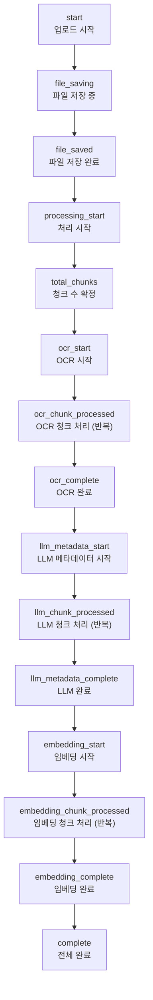

# SSE 기반 파일 업로드 진행률 표시 + 취소 기능

## 개요

XGEN 2.0의 문서 업로드는 단순한 파일 전송이 아니다. 파일을 서버에 올린 후 OCR 처리, LLM 메타데이터 생성, 임베딩 변환까지 여러 단계를 거쳐야 한다. 대용량 PDF 파일이면 수십 분이 걸릴 수 있는데, 이 과정에서 진행률을 전혀 보여주지 않으면 사용자는 업로드가 멈춘 건지 진행 중인 건지 알 수 없다.

기존에는 HTTP POST로 파일을 전송하고 응답을 기다리는 단순한 구조였다. 이를 SSE(Server-Sent Events)로 바꿔서 단계별 진행률을 실시간으로 표시하고, AbortSignal로 개별 파일 취소와 전체 취소를 구현했다. 약 한 달간(2025-12-03 ~ 12-30) 37개 커밋에 걸쳐 점진적으로 기능을 추가했다.

## 전체 아키텍처

```mermaid
flowchart LR
    subgraph Client["프론트엔드"]
        Modal["DocumentFileModalInstance<br/>업로드 UI"]
        SSEFunc["uploadDocumentSSE()<br/>SSE 클라이언트"]
        AbortCtrl["AbortController<br/>파일별 취소"]
        Context["DocumentFileModalContext<br/>SSE 연결 추적"]
    end

    subgraph Proxy["Next.js API Route"]
        Route["upload-sse/route.ts<br/>SSE 프록시"]
        Reconnect["reconnect/[sessionId]<br/>재연결 프록시"]
    end

    subgraph Backend["백엔드"]
        Upload["파일 저장"]
        OCR["OCR 처리"]
        LLM["LLM 메타데이터"]
        Embed["임베딩 변환"]
        Cancel["세션 취소 API"]
    end

    Modal -->|FormData| SSEFunc
    SSEFunc -->|fetch + ReadableStream| Route
    Route -->|SSE 스트림| Backend
    Backend -->|이벤트 스트림| Route
    Route -->|이벤트 전달| SSEFunc
    SSEFunc -->|onProgress 콜백| Modal
    AbortCtrl -->|abort()| SSEFunc
    SSEFunc -->|cancelSession()| Cancel
    Context -->|activeSSECount| Modal
```

## SSE 이벤트 흐름

업로드 과정에서 서버가 보내는 SSE 이벤트의 전체 흐름이다.



## uploadDocumentSSE: 핵심 SSE 클라이언트

```typescript
// retrievalAPI.js - SSE 업로드 함수

const SSE_RECONNECT_CONFIG = {
    MAX_RECONNECT_ATTEMPTS: 5,
    BASE_RECONNECT_DELAY: 3000,
    MAX_RECONNECT_DELAY: 60000,
    JITTER_FACTOR: 0.25,
};

// 지수 백오프 + 지터
const calculateReconnectDelay = (attempt) => {
    const baseDelay = SSE_RECONNECT_CONFIG.BASE_RECONNECT_DELAY;
    const maxDelay = SSE_RECONNECT_CONFIG.MAX_RECONNECT_DELAY;
    let delay = baseDelay * Math.pow(1.5, attempt);
    delay = Math.min(delay, maxDelay);
    const jitter = delay * SSE_RECONNECT_CONFIG.JITTER_FACTOR * (Math.random() * 2 - 1);
    return Math.floor(Math.max(delay + jitter, 1000));
};

export const uploadDocumentSSE = async (
    file, collectionName, chunkSize, chunkOverlap,
    metadata, processType, onProgress, session,
    additionalDirectoryInfo, collectionOwnerUserId,
    useOcr, useLlmMetadata,
    abortSignal = null,  // AbortSignal
    extractDefaultMetadata, forceChunking,
    chunkingStrategy, stride, parentChunkSize,
    childChunkSize, enableSparseVector, enableFullText
) => {
    return new Promise(async (resolve, reject) => {
        let isResolved = false;
        let isCancelled = false;
        let sessionId = null;

        // AbortSignal 처리
        if (abortSignal) {
            const handleAbort = async () => {
                if (isResolved || isCancelled) return;
                isCancelled = true;
                try {
                    await cancelSession(sessionId);
                } catch (e) { /* 무시 */ }
                if (!isResolved) {
                    isResolved = true;
                    reject(new Error('사용자에 의해 취소됨'));
                }
            };
            abortSignal.addEventListener('abort', handleAbort);
            if (abortSignal.aborted) { handleAbort(); return; }
        }

        // FormData 구성
        const formData = new FormData();
        formData.append('file', file);
        formData.append('collection_name', collectionName);
        formData.append('chunk_size', String(chunkSize));
        // ... 추가 파라미터

        // SSE 스트림 fetch
        const response = await fetch('/api/retrieval/documents/upload-sse', {
            method: 'POST',
            body: formData,
            signal: abortSignal
        });

        const reader = response.body.getReader();
        const decoder = new TextDecoder();
        let buffer = '';

        // SSE 이벤트 파싱 루프
        while (true) {
            if (isCancelled) break;
            const { done, value } = await reader.read();
            if (done) break;

            buffer += decoder.decode(value, { stream: true });
            const lines = buffer.split('\n');
            buffer = lines.pop() || '';

            for (const line of lines) {
                if (!line.startsWith('data: ')) continue;
                const eventData = JSON.parse(line.slice(6));

                // 세션 ID 추출
                if (eventData.session_id) {
                    sessionId = eventData.session_id;
                }

                // 진행률 콜백 호출
                onProgress?.(eventData);

                // 완료/에러/취소 처리
                if (eventData.event === 'complete') {
                    isResolved = true;
                    resolve(eventData);
                    return;
                }
                if (eventData.event === 'error') {
                    isResolved = true;
                    reject(new Error(eventData.message));
                    return;
                }
                if (eventData.event === 'cancelled') {
                    isCancelled = true;
                    isResolved = true;
                    reject(new Error('업로드가 취소되었습니다'));
                    reader.cancel();
                    return;
                }
            }
        }
    });
};
```

# 커밋: feat: enhance uploadDocumentSSE with detailed SSE event descriptions and update DocumentFileModalInstance for embedding progress tracking
# 날짜: 2025-12-03

## AbortSignal 기반 취소 시스템

### 파일별 AbortController 관리

여러 파일을 동시에 업로드할 때, 각 파일에 독립적인 AbortController를 할당한다.

```typescript
// DocumentFileModalInstance.tsx
const fileAbortControllersRef = useRef<Map<number, AbortController>>(new Map());

const handleStartUpload = async () => {
    const fileArray = Array.from(selectedFiles);

    // 파일 인덱스별 AbortController 생성
    fileAbortControllersRef.current.clear();
    for (let i = 0; i < fileArray.length; i++) {
        fileAbortControllersRef.current.set(i, new AbortController());
    }

    // 파일별 순차 업로드
    for (let index = 0; index < fileArray.length; index++) {
        const file = fileArray[index];
        const controller = fileAbortControllersRef.current.get(index);

        // 이미 취소된 파일이면 건너뛰기
        if (controller?.signal.aborted) continue;

        try {
            await uploadDocumentSSE(
                file, collectionName, chunkSize, overlapSize,
                metadata, processType, (event) => handleProgress(event, index),
                session, directoryInfo, ownerUserId,
                useOcr, useLlmMetadata,
                controller?.signal  // AbortSignal 전달
            );
        } catch (error) {
            if (error.message === '사용자에 의해 취소됨') {
                // 취소된 경우 -> 상태 업데이트만
                updateProgress(index, { status: 'error', error: '사용자에 의해 취소됨' });
            } else {
                // 실제 에러
                updateProgress(index, { status: 'error', error: error.message });
            }
        }
    }
};
```

# 커밋: feat: add AbortSignal support for upload cancellation in DocumentFileModalInstance and retrievalAPI
# 날짜: 2025-12-14

### 개별 파일 취소

```typescript
const handleCancelUpload = useCallback(async (uploadSessionId: string, index: number) => {
    try {
        // 1. AbortController로 fetch 요청 취소
        const controller = fileAbortControllersRef.current.get(index);
        if (controller) {
            controller.abort();
            fileAbortControllersRef.current.delete(index);
        }

        // 2. SSE ReadableStream 정리
        const sessionData = uploadSessions.get(uploadSessionId);
        if (sessionData) {
            sessionData.reader.cancel();
            sessionData.controller.abort();
        }

        // 3. 백엔드 세션 취소 + 삭제
        await cancelSession(uploadSessionId);
        await deleteSession(uploadSessionId);

        // 4. 추적에서 제거
        uploadSessionIdsRef.current.delete(uploadSessionId);

        // 5. UI 상태 업데이트
        setUploadProgress(prev => prev.map((item, idx) =>
            idx === index && item.session === uploadSessionId
                ? { ...item, status: 'error', error: '사용자에 의해 취소됨', currentStage: undefined }
                : item
        ));
    } catch (error) {
        console.error('취소 실패:', error);
    }
}, [uploadSessions]);
```

# 커밋: feat: add cancel upload functionality for individual items in document upload
# 날짜: 2025-12-05

### 전체 취소

```typescript
const handleCancelAllUploads = useCallback(async () => {
    // 1. 모든 AbortController 취소 (대기 중 파일 포함)
    fileAbortControllersRef.current.forEach(controller => controller.abort());
    fileAbortControllersRef.current.clear();

    // 2. 진행 중인 모든 SSE 세션 정리
    for (const [sessionId, sessionData] of uploadSessions.entries()) {
        sessionData.reader.cancel();
        sessionData.controller.abort();
        await cancelSession(sessionId);
        await deleteSession(sessionId);
    }

    // 3. 백엔드 추적 세션 모두 취소
    for (const backendSessionId of uploadSessionIdsRef.current) {
        await cancelSession(backendSessionId);
        await deleteSession(backendSessionId);
    }

    // 4. 폴링 중지
    clearInterval(pollingIntervalRef.current);

    // 5. uploading 상태를 모두 취소로 변경
    setUploadProgress(prev => prev.map(item =>
        item.status === 'uploading'
            ? { ...item, status: 'error', error: '전체 취소됨', currentStage: undefined }
            : item
    ));
}, [uploadSessions]);
```

# 커밋: 업로드 취소
# 날짜: 2025-12-14

## 진행률 UI

### UploadProgress 상태 구조

```typescript
interface UploadProgress {
    fileName: string;
    status: 'uploading' | 'success' | 'error';
    error?: string;
    session?: string;
    totalChunks?: number;
    processedChunks?: number;
    ocrProcessedChunks?: number;
    llmProcessedChunks?: number;
    embeddingProcessedChunks?: number;
    currentStage?: 'file_saving' | 'processing' | 'ocr_processing'
                  | 'llm_processing' | 'embedding' | 'complete'
                  | 'reconnecting' | 'polling';
    reconnectAttempt?: number;
    maxReconnectAttempts?: number;
}
```

# 커밋: feat: add type definitions for document upload progress and session status
# 날짜: 2025-12-05

### SSE 이벤트 -> 진행률 매핑

```typescript
const handleProgress = (eventData: any, index: number) => {
    setUploadProgress(prev => prev.map((item, idx) => {
        if (idx !== index) return item;

        switch (eventData.event) {
            case 'file_saving':
                return { ...item, currentStage: 'file_saving' };
            case 'total_chunks':
                return { ...item, totalChunks: eventData.total_chunks, currentStage: 'processing' };
            case 'ocr_start':
                return { ...item, ocrProcessedChunks: 0, currentStage: 'ocr_processing' };
            case 'ocr_chunk_processed':
                return { ...item, ocrProcessedChunks: (item.ocrProcessedChunks || 0) + 1 };
            case 'llm_metadata_start':
                return { ...item, llmProcessedChunks: 0, currentStage: 'llm_processing' };
            case 'llm_chunk_processed':
                return { ...item, llmProcessedChunks: (item.llmProcessedChunks || 0) + 1 };
            case 'embedding_start':
                return { ...item, embeddingProcessedChunks: 0, currentStage: 'embedding' };
            case 'embedding_chunk_processed':
                return { ...item, embeddingProcessedChunks: (item.embeddingProcessedChunks || 0) + 1 };
            case 'complete':
                return { ...item, status: 'success', currentStage: 'complete' };
            case 'error':
                return { ...item, status: 'error', error: eventData.message };
            case 'reconnecting':
                return { ...item, currentStage: 'reconnecting', reconnectAttempt: eventData.attempt };
            default:
                return item;
        }
    }));
};
```

### 단계별 진행률 렌더링

```tsx
{uploadProgress.map((item, index) => (
    <div key={index} className={styles.uploadItem}>
        <span className={styles.fileName}>{item.fileName}</span>

        {/* 단계별 메시지 */}
        {item.currentStage === 'file_saving' && <span>파일 저장 중...</span>}
        {item.currentStage === 'processing' && item.totalChunks &&
            <span>총 {item.totalChunks}개 청크 처리 중...</span>}
        {item.currentStage === 'ocr_processing' &&
            <span>OCR 처리 중 ({item.ocrProcessedChunks}/{item.totalChunks})</span>}
        {item.currentStage === 'llm_processing' &&
            <span>LLM 메타데이터 생성 중 ({item.llmProcessedChunks}/{item.totalChunks})</span>}
        {item.currentStage === 'embedding' &&
            <span>임베딩 처리 중 ({item.embeddingProcessedChunks}/{item.totalChunks})</span>}
        {item.currentStage === 'reconnecting' &&
            <span>재연결 시도 중 ({item.reconnectAttempt}/{SSE_RECONNECT_CONFIG.MAX_RECONNECT_ATTEMPTS})</span>}
        {item.status === 'success' && <span className={styles.success}>완료</span>}
        {item.status === 'error' && <span className={styles.error}>{item.error}</span>}

        {/* 진행률 바 */}
        {item.totalChunks && item.currentStage !== 'complete' && (
            <div className={styles.progressBar}>
                <div style={{ width: `${getProgressPercent(item)}%` }} />
            </div>
        )}

        {/* 개별 취소 버튼 */}
        {item.status === 'uploading' && item.session && (
            <button
                className={styles.cancelButton}
                onClick={() => handleCancelUpload(item.session!, index)}
            >
                취소
            </button>
        )}
    </div>
))}

{/* 전체 취소 버튼 */}
{uploadProgress.some(item => item.status === 'uploading') && (
    <button className={styles.cancelAllButton} onClick={handleCancelAllUploads}>
        전체 취소
    </button>
)}
```

# 커밋: feat: enhance upload progress tracking with OCR and LLM stages
# 날짜: 2025-12-05

## SSE 재연결 로직

네트워크 불안정이나 프록시 타임아웃으로 SSE 연결이 끊어질 수 있다. 지수 백오프와 지터를 적용한 자동 재연결 로직을 구현했다.

```typescript
// 재연결 엔드포인트
const connectToReconnectEndpoint = async () => {
    if (isCancelled || isResolved) {
        throw new Error('Session already cancelled or resolved');
    }

    const response = await fetch(
        `/api/retrieval/documents/upload-sse/reconnect/${sessionId}`,
        { signal: abortSignal }
    );

    // 놓친 이벤트 처리
    // ...
};

// 재연결 로직
const handleReconnect = async (attempt) => {
    if (attempt >= SSE_RECONNECT_CONFIG.MAX_RECONNECT_ATTEMPTS) {
        // 최대 시도 초과 -> 폴링으로 전환
        await pollBackendSessionUntilComplete(30, 2000);
        return;
    }

    const delay = calculateReconnectDelay(attempt);
    onProgress?.({ event: 'reconnecting', attempt, delay });

    await new Promise(r => setTimeout(r, delay));

    if (isCancelled) return;

    try {
        await connectToReconnectEndpoint();
        onProgress?.({ event: 'reconnected' });
    } catch (error) {
        await handleReconnect(attempt + 1);
    }
};
```

# 커밋: feat: implement SSE upload resilience with reconnect logic and UI updates for status indication
# 날짜: 2025-12-08

재연결에 실패하면 폴링(polling)으로 전환한다. 2초 간격으로 서버의 세션 상태를 확인해서 완료 여부를 판단한다. 이중 안전망 구조다.

## Next.js API Route SSE 프록시

Next.js의 `next.config.ts` rewrites는 SSE 스트림을 버퍼링하는 문제가 있어서, 전용 API Route를 만들었다.

```typescript
// app/api/retrieval/documents/upload-sse/route.ts
export const runtime = 'nodejs';
export const dynamic = 'force-dynamic';
export const maxDuration = 600;  // 10분

export async function POST(request: NextRequest) {
    const abortController = new AbortController();
    const targetUrl = `${BACKEND_URL}/api/retrieval/documents/upload-sse`;

    const response = await fetch(targetUrl, {
        method: 'POST',
        headers: { ...headers },
        body: request.body,
        // @ts-expect-error - duplex needed for streaming body
        duplex: 'half',
        signal: abortController.signal,
    });

    const stream = new ReadableStream({
        async start(controller) {
            const reader = response.body!.getReader();
            let isClosed = false;

            while (!isClosed) {
                const { done, value } = await reader.read();
                if (done) {
                    controller.close();
                    break;
                }
                controller.enqueue(value);
            }
        },
        cancel(reason) {
            reader.cancel(reason);
            abortController.abort();
        },
    });

    return new Response(stream, {
        headers: {
            'Content-Type': 'text/event-stream',
            'Cache-Control': 'no-cache, no-transform',
            'X-Accel-Buffering': 'no',  // nginx 버퍼링 비활성화
        },
    });
}
```

# 커밋: [FEATURE] Implement SSE streaming endpoints for workflow execution and document upload
# 날짜: 2025-12-30

`duplex: 'half'`는 Node.js의 fetch에서 요청 body를 스트리밍으로 전송할 때 필요하다. TypeScript가 이 타입을 인식하지 못해서 `@ts-expect-error`로 무시한다. `X-Accel-Buffering: no`는 nginx 리버스 프록시가 SSE 응답을 버퍼링하지 않도록 하는 헤더다.

## DocumentFileModalContext: SSE 연결 추적

모달이 최소화된 상태에서도 업로드 진행 상황을 추적해야 한다. Context로 SSE 연결 수와 완료된 파일 수를 전역적으로 관리한다.

```typescript
// DocumentFileModalContext.tsx
export interface ModalSession {
    activeSSECount?: number;
    totalFiles?: number;
    completedFiles?: number;
}

const updateUploadProgress = useCallback((
    sessionId: string,
    activeSSECount: number,
    completedFiles: number,
    totalFiles: number
) => {
    setSessions(prev => {
        const updated = new Map(prev);
        const session = updated.get(sessionId);
        if (session) {
            updated.set(sessionId, {
                ...session,
                activeSSECount,
                completedFiles,
                totalFiles
            });
        }
        return updated;
    });
}, []);
```

# 커밋: feat: add SSE connection tracking and upload progress updates in DocumentFileModalInstance and related components
# 날짜: 2025-12-15

## 개발 타임라인

| 날짜 | 핵심 작업 |
|------|----------|
| 12-03 | SSE 이벤트 상세화, 임베딩 진행률 추적 |
| 12-05 | UploadProgress 타입 정의, OCR/LLM 단계 추적, 개별 취소 버튼 |
| 12-08 | SSE 재연결 로직 (지수 백오프 + 지터), 취소 플래그(isCancelled) |
| 12-10 | SSE 세션 진행 상태 엔드포인트 통합 |
| 12-14 | AbortSignal 기반 취소 (파일별 AbortController), 전체 취소 |
| 12-15 | SSE 연결 추적 Context, 최소화 상태 진행률 |
| 12-24 | 워크플로우 테스터 취소 기능, SSEMessage 인터페이스 확장 |
| 12-30 | SSE 전용 Next.js API Route (버퍼링 문제 해결) |

## 트러블슈팅

### Next.js rewrites의 SSE 버퍼링

`next.config.ts`의 rewrites로 백엔드에 프록시하면, Next.js가 응답을 버퍼링해서 SSE 이벤트가 실시간으로 전달되지 않았다. 이벤트가 수십 개 모여서 한꺼번에 도착하는 현상이 발생했다. 전용 API Route에서 `ReadableStream`으로 즉시 전달하는 방식으로 해결했다.

### React 렌더링 사이클에서의 상태 업데이트

SSE onProgress 콜백 내에서 `setState`를 호출하면 React의 배칭으로 인해 이전 상태를 기반으로 업데이트가 중복될 수 있다. 함수형 업데이터(`setUploadProgress(prev => ...)`)를 사용해서 항상 최신 상태를 기반으로 업데이트하도록 했다.

### 대기 중 파일의 취소

5개 파일을 업로드할 때 3번째 파일이 처리 중이면, 4번째/5번째는 아직 시작도 안 한 상태다. `handleCancelAllUploads`에서 모든 AbortController를 abort하면, 아직 fetch가 시작되지 않은 파일도 for 루프에서 `signal.aborted` 체크로 건너뛸 수 있다.

## 결과 및 회고

한 달간의 점진적 개발로 완성도 높은 SSE 업로드 시스템을 만들었다. 핵심 학습은 세 가지다.

첫째, SSE는 단방향 스트리밍에 WebSocket보다 훨씬 적합하다. 서버 -> 클라이언트 방향의 진행률 이벤트만 필요한 이 케이스에서 WebSocket의 양방향 오버헤드는 불필요하다.

둘째, AbortController/AbortSignal은 fetch 취소의 표준 메커니즘이다. 파일별로 독립적인 AbortController를 할당하는 패턴은 여러 비동기 작업의 개별 취소에 재사용할 수 있다.

셋째, SSE 재연결은 필수다. 네트워크 불안정, 프록시 타임아웃, 서버 재시작 등 연결이 끊어지는 경우가 빈번하다. 지수 백오프 + 폴링 폴백의 이중 안전망이 실전에서 안정적이었다.
