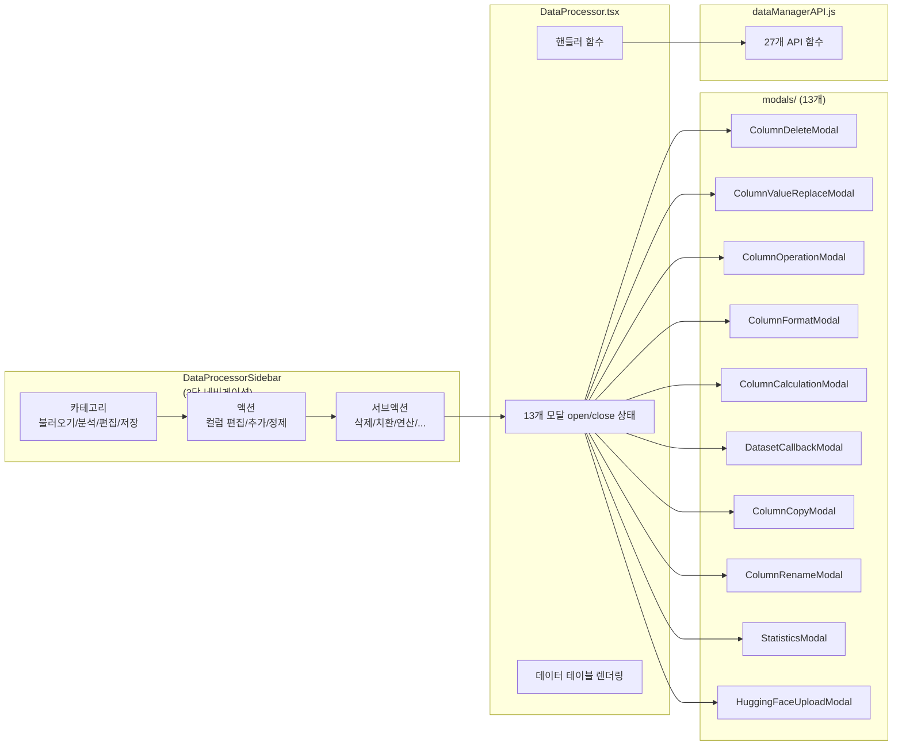

# 데이터셋 컬럼 관리: 삭제/치환/연산 모달 컴포넌트 설계

## 개요

XGEN 2.0의 데이터 프로세서는 RAG 파이프라인에 투입할 데이터셋을 전처리하는 도구다. CSV/Parquet 파일을 로드한 뒤, 컬럼 삭제, 값 치환, 수학 연산, 문자열 포맷팅, 컬럼 간 계산 등의 조작을 수행할 수 있다. 거기에 PyArrow 콜백으로 임의의 Python 코드도 실행할 수 있다.

이런 다양한 조작을 하나의 거대한 폼으로 만들면 복잡도가 감당이 안 된다. 각 조작별로 독립적인 모달 컴포넌트를 만들어서, 사이드바에서 원하는 기능을 선택하면 해당 모달이 열리는 구조로 설계했다. 최종적으로 13개의 모달 컴포넌트가 만들어졌다.

## 아키텍처



### 파일 구조

```
src/app/main/dataSection/
  components/
    DataProcessor.tsx              -- 컨테이너 (모달 상태 + 데이터 테이블)
    DataProcessorSidebar.tsx       -- 3단 네비게이션 사이드바
    modals/
      index.ts                     -- 배럴 export
      ColumnDeleteModal.tsx
      ColumnValueReplaceModal.tsx
      ColumnOperationModal.tsx
      ColumnFormatModal.tsx
      ColumnCalculationModal.tsx
      DatasetCallbackModal.tsx
      ColumnCopyModal.tsx
      ColumnRenameModal.tsx
      ColumnInfoModal.tsx
      StatisticsModal.tsx
      SpecificColumnNullRemoveModal.tsx
      HuggingFaceUploadModal.tsx
      DownloadDialog.tsx
      assets/
        ColumnDeleteModal.module.scss
        ColumnValueReplaceModal.module.scss
        ...                        -- 각 모달별 개별 SCSS
```

## 핵심 구현

### 모달 컴포넌트 패턴

모든 모달이 동일한 패턴을 따른다:

1. `isOpen`이 false면 null 반환
2. `createPortal`로 `document.body`에 렌더링
3. 폼 상태를 로컬 `useState`로 관리
4. 닫을 때 폼 상태 초기화
5. 콜백 함수로 결과를 부모에 전달

### ColumnDeleteModal — 다중 선택 삭제

체크박스로 여러 컬럼을 선택하고 한 번에 삭제한다.

```typescript
interface ColumnDeleteModalProps {
    isOpen: boolean;
    onClose: () => void;
    onDeleteMultipleColumns: (columnNames: string[]) => void;
    availableColumns: string[];
}

export const ColumnDeleteModal: React.FC<ColumnDeleteModalProps> = ({
    isOpen, onClose, onDeleteMultipleColumns, availableColumns
}) => {
    const [selectedColumns, setSelectedColumns] = useState<string[]>([]);

    if (!isOpen) return null;

    const handleToggleAll = () => {
        if (selectedColumns.length === availableColumns.length) {
            setSelectedColumns([]);
        } else {
            setSelectedColumns([...availableColumns]);
        }
    };

    const handleToggle = (col: string) => {
        setSelectedColumns(prev =>
            prev.includes(col)
                ? prev.filter(c => c !== col)
                : [...prev, col]
        );
    };

    const handleSubmit = () => {
        onDeleteMultipleColumns(selectedColumns);
        setSelectedColumns([]);
        onClose();
    };

    return createPortal(
        <div className={styles.overlay}>
            <div className={styles.modal}>
                <h3>컬럼 삭제</h3>
                <div className={styles.selectAll}>
                    <label>
                        <input
                            type="checkbox"
                            checked={selectedColumns.length === availableColumns.length}
                            onChange={handleToggleAll}
                        />
                        전체 선택/해제
                    </label>
                </div>
                <div className={styles.columnList}>
                    {availableColumns.map(col => (
                        <label key={col}>
                            <input
                                type="checkbox"
                                checked={selectedColumns.includes(col)}
                                onChange={() => handleToggle(col)}
                            />
                            {col}
                        </label>
                    ))}
                </div>
                <button
                    onClick={handleSubmit}
                    disabled={selectedColumns.length === 0}
                >
                    선택된 {selectedColumns.length}개 컬럼 삭제
                </button>
            </div>
        </div>,
        document.body
    );
};
```

삭제 버튼에 선택된 개수를 표시해서 실수로 전체를 삭제하는 것을 방지한다.

### ColumnValueReplaceModal — 문자열 치환

특정 컬럼에서 oldValue를 newValue로 치환한다.

```typescript
interface ColumnValueReplaceModalProps {
    isOpen: boolean;
    onClose: () => void;
    onReplaceValues: (columnName: string, oldValue: string, newValue: string) => void;
    availableColumns: string[];
}
```

컬럼 선택 드롭다운, 기존값/새값 입력 필드로 구성된다. 기존값이 비어있으면 실행할 수 없도록 disabled 처리한다.

### ColumnOperationModal — 단일 컬럼 수학 연산

숫자 컬럼에 수학 연산을 적용한다. `+5`, `*2.5`, `/3+1` 같은 연산식을 입력하면 컬럼의 모든 값에 적용된다.

```typescript
const handleSubmit = () => {
    // 연산식 검증: 숫자와 사칙연산자만 허용
    if (!/^[+\-*/\d.]+$/.test(operation)) {
        alert('유효한 연산식을 입력해주세요. (예: +5, *2.5, /3)');
        return;
    }
    onApplyOperation(selectedColumn, operation);
    setOperation('');
    onClose();
};
```

정규식 `/^[+\-*/\d.]+$/`로 안전하지 않은 입력을 차단한다. `eval()` 같은 위험한 코드를 실행하지 않고, 백엔드에서 안전하게 처리한다.

### ColumnFormatModal — 다중 컬럼 문자열 결합

여러 컬럼의 값을 템플릿으로 결합해서 새 컬럼을 생성한다. 예를 들어 `{이름}_님의_{직업}` 같은 템플릿으로 "홍길동_님의_개발자" 같은 값을 만들 수 있다.

```typescript
interface ColumnFormatModalProps {
    isOpen: boolean;
    onClose: () => void;
    onFormatColumns: (
        columnNames: string[],
        template: string,
        newColumnName: string
    ) => void;
    availableColumns: string[];
}
```

핵심 기능은 **동적 컬럼 슬롯**이다. "컬럼 추가" 버튼으로 슬롯을 늘리고, 각 슬롯에서 드롭다운으로 컬럼을 선택한다. 선택한 컬럼이 바뀔 때마다 템플릿 예시가 자동으로 업데이트된다.

```typescript
const [columnSlots, setColumnSlots] = useState<string[]>(['']);

const addColumnSlot = () => {
    setColumnSlots(prev => [...prev, '']);
};

const removeColumnSlot = (index: number) => {
    setColumnSlots(prev => prev.filter((_, i) => i !== index));
};

// 템플릿 예시 자동 생성
const generateTemplateExample = () => {
    const selectedCols = columnSlots.filter(c => c !== '');
    if (selectedCols.length === 0) return '';
    return selectedCols.map(col => `{${col}}`).join('_');
};
```

중복 컬럼명 검사도 포함되어 있다. 새 컬럼 이름이 기존 컬럼과 겹치면 경고를 표시한다.

### ColumnCalculationModal — 컬럼 간 사칙연산

두 컬럼의 값을 사칙연산해서 새 컬럼을 만든다. `가격 * 수량 = 총액` 같은 계산이 가능하다.

```typescript
interface ColumnCalculationModalProps {
    isOpen: boolean;
    onClose: () => void;
    onCalculateColumns: (
        column1: string,
        column2: string,
        operation: string,
        newColumnName: string
    ) => void;
    availableColumns: string[];
}
```

연산자는 버튼 UI로 선택한다: `+`, `-`, `x`, `÷`. 선택하면 연산 미리보기가 표시된다 — 예: "가격 x 수량 → 총액".

### DatasetCallbackModal — PyArrow 콜백 코드 에디터

가장 강력하면서 가장 복잡한 모달이다. 사용자가 PyArrow 코드를 직접 작성해서 데이터셋을 조작할 수 있다.

```typescript
interface DatasetCallbackModalProps {
    isOpen: boolean;
    onClose: () => void;
    onExecuteCallback: (callbackCode: string) => void;
    sampleData?: any[];
    columns?: string[];
}
```

핵심 기능:

1. **코드 에디터**: `<textarea>`에 줄번호 표시, Tab/Shift+Tab 들여쓰기 지원
2. **6개 예제 코드**: 컬럼 필터링, 행 필터링, 새 컬럼 추가, 문자열 조작, 정렬, 중복 제거
3. **샘플 데이터 미리보기**: 상위 3행을 테이블로 보여줘서 컬럼명과 값 형태를 확인할 수 있다
4. **도움말**: 사용 가능한 모듈(`pa`, `pc`, `pq`, `sys`)과 보안 경고 표시

```typescript
// Tab 들여쓰기 처리
const handleKeyDown = (e: React.KeyboardEvent<HTMLTextAreaElement>) => {
    if (e.key === 'Tab') {
        e.preventDefault();
        const textarea = e.currentTarget;
        const start = textarea.selectionStart;
        const end = textarea.selectionEnd;

        if (e.shiftKey) {
            // Shift+Tab: 들여쓰기 제거
            const beforeCursor = callbackCode.substring(0, start);
            const lastNewline = beforeCursor.lastIndexOf('\n');
            const lineStart = lastNewline + 1;
            const lineContent = callbackCode.substring(lineStart, start);
            if (lineContent.startsWith('    ')) {
                setCallbackCode(
                    callbackCode.substring(0, lineStart)
                    + lineContent.substring(4)
                    + callbackCode.substring(start)
                );
            }
        } else {
            // Tab: 4칸 들여쓰기
            setCallbackCode(
                callbackCode.substring(0, start)
                + '    '
                + callbackCode.substring(end)
            );
        }
    }
};
```

예제 코드 중 하나:

```python
# 컬럼 필터링 예시
import pyarrow as pa
import pyarrow.compute as pc

# 특정 컬럼만 선택
selected_columns = ['이름', '나이', '직업']
table = table.select(selected_columns)
```

보안 관련: 코드는 백엔드의 격리된 환경에서 실행되며 30초 타임아웃이 적용된다.

```
# 커밋: fix: Correct whitespace handling in DatasetCallbackModal
# 날짜: 2025-09-23 11:29
```

들여쓰기 제거 로직에서 whitespace 패턴 매칭이 잘못된 버그가 있었다. `/^    /`(탭 4개)를 `/^ {4}/`(공백 4개)로 수정했다.

## 사이드바: 3단 네비게이션

DataProcessorSidebar는 카테고리 → 액션 → 서브액션의 3단 구조로 기능을 분류한다.

```typescript
// 카테고리 정의
const CATEGORIES = [
    { id: 'load', title: '데이터셋 불러오기', icon: IoDownloadOutline },
    { id: 'analysis', title: '분석', icon: IoStatsChart },
    { id: 'edit', title: '편집', icon: IoPencil },
    { id: 'save', title: '저장', icon: IoSave },
];

// 편집 카테고리의 액션
case 'edit':
    return [
        { id: 'column-edit', title: '컬럼 편집', subActions: [...] },
        { id: 'column-add', title: '컬럼 추가', subActions: [...] },
        { id: 'data-clean', title: '데이터 정제', subActions: [...] },
    ];

// 컬럼 편집의 서브액션
subActions: [
    { id: 'column-delete', title: '열 삭제', modal: 'columnDeleteModal' },
    { id: 'column-replace', title: '열 데이터 변경', modal: 'columnValueReplaceModal' },
    { id: 'column-operation', title: '열 데이터 연산', modal: 'columnOperationModal' },
    { id: 'column-rename', title: '열 이름 변경', modal: 'columnRenameModal' },
    { id: 'dataset-callback', title: 'PyArrow 콜백 함수', modal: 'datasetCallbackModal' },
]
```

서브액션의 `modal` 프로퍼티가 DataProcessor의 상태 이름과 일치해서, 클릭하면 해당 모달이 열린다.

## DataProcessor: 모달 상태 관리

13개 모달의 open/close 상태를 모두 DataProcessor가 소유한다. 각 모달별 핸들러 함수도 동일한 패턴을 따른다.

```typescript
// 모달 상태 (13개)
const [columnDeleteModalOpen, setColumnDeleteModalOpen] = useState(false);
const [columnValueReplaceModalOpen, setColumnValueReplaceModalOpen] = useState(false);
const [columnOperationModalOpen, setColumnOperationModalOpen] = useState(false);
// ... 10개 더

// 핸들러 패턴 (모든 모달에 동일하게 적용)
const handleFormatColumns = async (
    columnNames: string[],
    template: string,
    newColumn: string
) => {
    showSuccessToastKo('처리중...');
    const result = await formatDatasetColumns(
        managerId, columnNames, template, newColumn
    );
    if (result.success) {
        showSuccessToastKo('포맷팅이 적용되었습니다.');
        loadDataTableInfo();  // 데이터 리로드
    } else {
        showErrorToastKo(result.message);
    }
};
```

삭제 작업은 `showDeleteConfirmToastKo`로 한 번 더 확인한다:

```typescript
const handleDeleteColumns = async (columnNames: string[]) => {
    showDeleteConfirmToastKo({
        title: '컬럼 삭제',
        message: `${columnNames.length}개 컬럼을 삭제하시겠습니까?`,
        onConfirm: async () => {
            const result = await dropDatasetColumns(managerId, columnNames);
            if (result.success) {
                showSuccessToastKo('컬럼이 삭제되었습니다.');
                loadDataTableInfo();
            }
        },
    });
};
```

## API 레이어

dataManagerAPI.js에 컬럼 관련 API 함수 10개가 정의되어 있다. 모든 함수가 동일한 패턴을 따른다:

```javascript
export const replaceColumnValues = async (
    managerId, columnName, oldValue, newValue
) => {
    if (!managerId) throw new Error('Manager ID는 필수입니다.');
    if (!columnName) throw new Error('컬럼명은 필수입니다.');

    const response = await apiClient(
        `${API_BASE_URL}/api/data-manager/processing/replace-values`,
        {
            method: 'POST',
            headers: { 'Content-Type': 'application/json' },
            body: JSON.stringify({
                manager_id: managerId,
                column_name: columnName,
                old_value: oldValue,
                new_value: newValue,
            }),
        }
    );

    const data = await response.json();
    devLog.info(`Column values replaced:`, data);
    return data;
};
```

공통 패턴:
- `manager_id` 필수 검증
- `apiClient` 래퍼로 인증 자동 처리
- `devLog`로 성공/실패 로깅
- REST POST, JSON body

## 트러블슈팅

### 단일 파일에서 13개 파일로 분리

```
# 커밋: feat(modals): add new modal components and styles
# 날짜: 2025-09-23 09:50
```

초기에는 `DataProcessorModal.tsx` 하나에 모든 모달이 들어있었다. 9월 22일의 커밋(`18650092`)에서 컬럼 삭제/치환/연산 3개 모달을 추가하면서 537줄의 diff가 발생했다. 파일이 너무 커지자 다음 날 바로 13개 개별 파일로 분리했다.

분리의 핵심은 `modals/index.ts` 배럴 export다:

```typescript
// modals/index.ts
export { ColumnDeleteModal } from './ColumnDeleteModal';
export { ColumnValueReplaceModal } from './ColumnValueReplaceModal';
export { ColumnOperationModal } from './ColumnOperationModal';
// ... 10개 더
```

DataProcessor에서는 한 줄로 모든 모달을 import한다:

```typescript
import {
    ColumnDeleteModal,
    ColumnValueReplaceModal,
    ColumnOperationModal,
    ColumnFormatModal,
    ColumnCalculationModal,
    DatasetCallbackModal,
    // ...
} from './modals';
```

### 사이드바 관심사 분리

```
# 커밋: feat: Enhance uploadToHuggingFace function with parameter validation
# 날짜: 2025-09-23 13:24
```

같은 커밋에서 사이드바의 불필요한 API 임포트를 정리했다. 사이드바가 직접 `dropDatasetColumns`, `replaceColumnValues` 등의 API를 import하고 있었는데, 실제 API 호출은 DataProcessor에서 하므로 사이드바에서는 불필요했다. 사이드바는 순수하게 네비게이션 역할만 담당하도록 리팩토링했다.

## 결과 및 회고

4일간(9/19~9/23) 7개 커밋에 걸쳐 데이터 프로세서의 모달 시스템을 구축했다. 단일 책임 원칙을 모달에 적용해서 각 모달이 하나의 조작에만 집중하도록 설계한 것이 핵심이다. 13개 모달이 많아 보이지만, 각각이 독립적이라 수정이 간단하다. ColumnDeleteModal을 고칠 때 ColumnFormatModal에 영향을 주지 않는다.

createPortal 패턴은 모든 모달에 일관되게 적용했다. z-index 문제를 원천적으로 해결하고, 부모 컴포넌트의 overflow 설정에 영향받지 않는다.

DatasetCallbackModal의 PyArrow 코드 에디터는 가장 도전적인 부분이었다. 전용 코드 에디터 라이브러리(Monaco, CodeMirror)를 도입할 수도 있었지만, 번들 크기 증가가 부담스러워서 `<textarea>` 기반으로 직접 구현했다. 줄번호와 Tab 들여쓰기 정도면 충분히 사용 가능하다.
