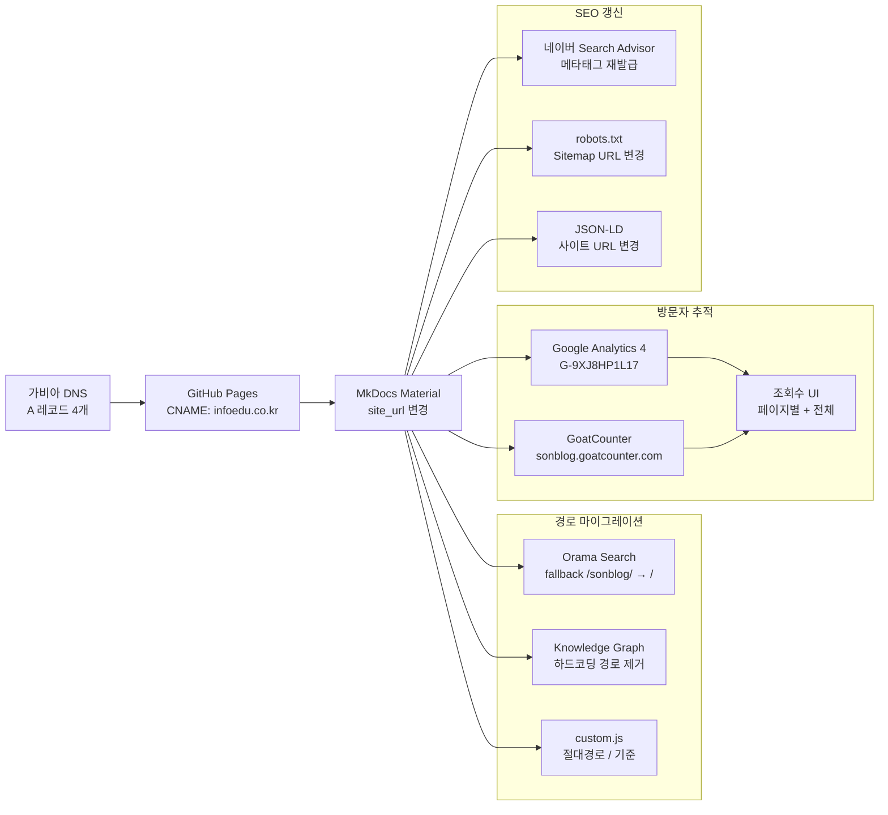

# GitHub Pages 커스텀 도메인 마이그레이션 + GoatCounter 조회수 연동

## 배경

MkDocs Material + GitHub Pages로 운영하던 기술 블로그의 URL이 `sonaiengine.github.io/sonblog/`였다. GitHub Pages 프로젝트 사이트 특성상 `/sonblog/` 하위 경로에 배포되는 구조인데, 이 경로가 코드 곳곳에 하드코딩되어 있었다.

여기에 두 가지 목표가 생겼다:

1. **커스텀 도메인 연결** -- 보유한 `infoedu.co.kr` 도메인을 블로그에 붙이기
2. **방문자 추적** -- Google Analytics 4와 GoatCounter로 조회수를 측정하고 UI에 표시하기

단순히 도메인만 바꾸면 될 줄 알았지만, `/sonblog/` 경로에 의존하는 코드가 여러 곳에 있어서 연쇄적으로 수정이 필요했다.

## 전체 구조



## 1단계: 커스텀 도메인 연결

### CNAME 파일과 DNS 설정

GitHub Pages에 커스텀 도메인을 연결하는 핵심은 두 가지다.

**1) `docs/CNAME` 파일 생성**

```
infoedu.co.kr
```

MkDocs 빌드 시 `docs/` 하위의 정적 파일은 사이트 루트에 복사된다. 이 파일이 `gh-pages` 브랜치 루트에 `CNAME`으로 배포되면, GitHub Pages가 해당 도메인으로 요청을 받을 준비를 한다.

**2) 가비아 DNS A 레코드 설정**

GitHub Pages의 공식 IP 4개를 A 레코드로 등록한다:

```
185.199.108.153
185.199.109.153
185.199.110.153
185.199.111.153
```

4개를 모두 등록하는 이유는 GitHub의 Anycast 네트워크를 활용해서 가장 가까운 서버로 라우팅하기 위함이다. 가비아 DNS 관리 콘솔에서 호스트 `@`에 4개 A 레코드를 추가하면 된다.

DNS 전파가 완료되면 GitHub Repository Settings > Pages에서 `infoedu.co.kr`을 입력하고 "Enforce HTTPS"를 활성화한다. GitHub이 Let's Encrypt 인증서를 자동으로 발급해준다.

### mkdocs.yml 수정

```yaml
# 커밋: feat: 커스텀 도메인 infoedu.co.kr 연결 (GitHub Pages)
# 날짜: 2026-02-18

site_url: https://infoedu.co.kr/   # 변경 전: https://sonaiengine.github.io/sonblog/
```

`site_url`은 MkDocs가 sitemap.xml, canonical URL, OG 메타태그 등을 생성할 때 기준이 되는 값이다. 이걸 바꾸지 않으면 검색엔진이 여전히 옛날 URL을 인덱싱한다.

### 연쇄 수정: URL 참조 파일들

`site_url` 외에도 사이트 URL을 직접 참조하는 파일이 여러 개 있었다:

```diff
# docs/robots.txt
-Sitemap: https://sonaiengine.github.io/sonblog/sitemap.xml
+Sitemap: https://infoedu.co.kr/sitemap.xml

# docs/llms.txt
-> 사이트: https://sonaiengine.github.io/sonblog/
+> 사이트: https://infoedu.co.kr/

# overrides/main.html (JSON-LD)
-"url": "https://sonaiengine.github.io/sonblog/",
+"url": "https://infoedu.co.kr/",
```

이 파일들은 MkDocs의 `site_url` 변수를 쓰지 않고 URL을 직접 적어둔 곳이라 수동으로 바꿔야 했다.

## 2단계: 경로 하드코딩 문제 해결

커스텀 도메인 연결 후 가장 큰 문제는 `/sonblog/` 하위 경로 의존이었다. GitHub Pages 프로젝트 사이트는 `username.github.io/repo-name/`으로 배포되기 때문에, 코드 여러 곳에서 `/sonblog/`를 기본 경로로 하드코딩하고 있었다. 커스텀 도메인에서는 사이트가 `/`에 직접 배포되므로, 이 경로들이 전부 깨졌다.

### Orama 검색 인덱스 로드 실패

이 블로그는 MkDocs Material의 기본 lunr.js 검색을 Orama BM25로 대체하는 커스텀 검색을 사용한다. 검색 인덱스(`search/search_index.json`)를 로드할 때 사이트 기본 경로가 필요한데, fallback 경로가 `/sonblog/`로 하드코딩되어 있었다.

```javascript
// 커밋: fix: orama-search fallback 경로 /sonblog/ → / 수정
// 날짜: 2026-02-18

// docs/assets/js/orama-search.js
function getSiteBase() {
  var meta = document.querySelector('meta[name="site-url"]');
  if (meta && meta.content) return meta.content.replace(/\/$/, "") + "/";
  return "/";  // 변경 전: return "/sonblog/";
}
```

`getSiteBase()` 함수는 먼저 `<meta name="site-url">` 태그에서 사이트 URL을 읽으려 시도하고, 없으면 fallback으로 하드코딩된 경로를 사용한다. 커스텀 도메인에서는 fallback이 `/`여야 한다.

### Knowledge Graph 렌더링 실패

Knowledge Graph는 블로그의 모든 포스트와 태그를 그래프로 시각화하는 기능이다. graph-viz.iife.js 번들 내부에서도 동일하게 `/sonblog/` 경로를 참조하고 있었다.

```javascript
// 커밋: fix: custom.js, graph-viz.iife.js에서 /sonblog/ 하드코딩 경로 제거
// 날짜: 2026-02-18

// docs/custom.js — Knowledge Graph 번들 로드 경로
s.src = "/assets/graph/graph-viz.iife.js";  // 변경 전: "/sonblog/assets/graph/..."
```

`custom.js`의 Knowledge Graph 초기화 코드에서 번들 스크립트 로드 경로와, graph-viz.iife.js 내부의 데이터 파일 fetch 경로 양쪽 모두에서 `/sonblog/` 접두사를 제거해야 했다. 번들 파일은 빌드된 IIFE라서 내부의 경로 참조도 전부 수정했다.

### 교훈: 경로는 변수로 관리해야 한다

이번 작업에서 배운 핵심은 **사이트 기본 경로를 코드에 직접 적으면 안 된다**는 것이다. MkDocs는 `site_url`에서 base path를 자동으로 계산해서 `<base>` 태그나 메타 태그로 제공하므로, JavaScript에서는 이 값을 참조하는 게 맞다. Orama 검색의 `getSiteBase()` 패턴이 올바른 접근이다 -- 메타 태그를 먼저 읽고, 없을 때만 fallback을 쓰되, fallback도 최대한 범용적인 값(`/`)으로.

## 3단계: 네이버 Search Advisor 소유확인 갱신

커스텀 도메인 전환 후 네이버 Search Advisor에서 새 도메인으로 사이트를 재등록해야 했다. 기존에는 `sonaiengine.github.io`로 등록했지만, 이제 `infoedu.co.kr`이 메인 도메인이다.

네이버 소유확인 방식은 HTML 메타태그를 사용했다. 새 도메인으로 등록하면 인증 코드가 달라지므로, `overrides/main.html`의 메타태그를 갱신했다:

```html
<!-- 커밋: fix: 네이버 Search Advisor 사이트 소유확인 메타태그 갱신 (infoedu.co.kr) -->
<!-- 날짜: 2026-02-18 -->

<!-- 변경 전 -->
<meta name="naver-site-verification" content="45be0273e8dda0061d72cf5dee673f848ee9ebeb">

<!-- 변경 후 -->
<meta name="naver-site-verification" content="528536846c48af3a337f2c4596e0d5ff6619e560">
```

기존 `sonaiengine.github.io` 레포의 루트 사이트를 만들어서 리다이렉트하던 우회 방법이 더 이상 필요 없어졌다. 커스텀 도메인은 그 자체가 호스트이므로 네이버에 직접 등록할 수 있다 -- 이전 SEO/GEO 글에서 언급했던 "GitHub Pages 프로젝트 사이트의 한계"가 도메인 연결로 해결된 것이다.

## 4단계: Google Analytics 4 연동

MkDocs Material은 GA4 연동을 네이티브로 지원한다. `mkdocs.yml`에 3줄만 추가하면 된다:

```yaml
# 커밋: feat: Google Analytics 4 연동 (G-9XJ8HP1L17)
# 날짜: 2026-02-18

extra:
  analytics:
    provider: google
    property: G-9XJ8HP1L17
```

MkDocs Material이 내부적으로 `gtag.js`를 자동 삽입하고, `navigation.instant` 기능과도 연동되어 SPA 방식 페이지 전환 시에도 페이지뷰가 정상적으로 카운트된다. 별도 커스텀 코드 없이 프레임워크가 처리해준다.

GA4는 트래픽 분석용으로 강력하지만, **실시간 페이지 조회수를 UI에 표시하는 기능은 없다**. GA4 Data API로 조회수를 가져올 수는 있지만, 인증이 필요하고 클라이언트사이드에서 직접 호출하기엔 보안 문제가 있다. 이 간극을 GoatCounter가 채운다.

## 5단계: GoatCounter 조회수 시스템

### GoatCounter를 선택한 이유

블로그에 "이 글은 몇 명이 봤는가"를 표시하고 싶었다. 선택지를 비교하면:

- **GA4 Data API** -- 서버사이드 인증 필요, 정적 사이트에서 직접 호출 불가
- **Plausible** -- 유료 SaaS, 셀프호스팅 시 Docker + PostgreSQL 필요
- **GoatCounter** -- 오픈소스, 무료 SaaS 제공, **공개 API로 인증 없이 카운터 조회 가능**

GoatCounter의 결정적 장점은 `/counter/{path}.json` API가 인증 없이 조회수를 반환한다는 점이다. 정적 사이트의 클라이언트사이드 JavaScript에서 바로 fetch할 수 있다.

### 스크립트 로드: no_onload 모드

MkDocs Material의 `navigation.instant` 기능은 페이지 전환 시 전체 페이지를 리로드하지 않고 XHR로 콘텐츠만 교체하는 SPA 방식이다. 일반적인 GoatCounter 스크립트는 `window.onload`에서 카운트를 보내므로, SPA에서는 첫 페이지만 카운트되고 이후 내비게이션은 무시된다.

해결: `no_onload` 모드로 스크립트를 로드하고, 페이지 전환마다 수동으로 카운트를 보낸다.

```html
<!-- overrides/main.html -->

  {{ super() }}
  <script data-goatcounter="https://sonblog.goatcounter.com/count"
          async src="//gc.zgo.at/count.js"
          data-goatcounter-settings='{"no_onload": true}'></script>

```

``를 사용한 이유: MkDocs Material의 base 템플릿에서 JS 로드를 담당하는 블록이다. `{{ super() }}`로 기존 스크립트(MkDocs Material 자체 JS)를 유지하면서 GoatCounter 스크립트를 추가한다. `extrahead` 블록에 넣어도 동작하지만, JS는 `scripts` 블록에 넣는 게 의미상 맞다.

### SPA 대응: document$ 구독

MkDocs Material은 RxJS 기반의 `document$` Observable을 전역으로 노출한다. instant navigation으로 페이지가 전환될 때마다 이 Observable이 emit한다. GoatCounter 카운트와 조회수 표시를 이 이벤트에 연결했다:

```javascript
// docs/custom.js

// 커밋: feat: GoatCounter 방문자 추적 연동 (SPA 대응 + 페이지별/전체 조회수 표시)
// 날짜: 2026-02-18

(function () {
  var GC_ENDPOINT = "https://sonblog.goatcounter.com";

  // SPA instant navigation 대응: 페이지 이동마다 수동 count
  function gcCount() {
    if (window.goatcounter && window.goatcounter.count) {
      window.goatcounter.count({ path: location.pathname });
    }
  }

  // 페이지별 조회수 표시 (글 상단 h1 아래, HOME 제외)
  function showPageViews() {
    if (location.pathname === "/") return;
    var h1 = document.querySelector(".md-content__inner h1");
    if (!h1) return;
    var existing = h1.parentElement.querySelector(".gc-page-views");
    if (existing) existing.remove();

    var p = location.pathname.replace(/\/$/, "") || "/";
    var apiPath = encodeURIComponent(p);
    var url = GC_ENDPOINT + "/counter/" + apiPath + ".json";

    fetch(url)
      .then(function (r) { return r.ok ? r.json() : null; })
      .then(function (data) {
        if (!data || !data.count) return;
        var div = document.createElement("div");
        div.className = "gc-page-views";
        div.textContent = data.count + " views";
        h1.insertAdjacentElement("afterend", div);
      })
      .catch(function () {});
  }

  // 전체 방문자 수 표시 (HOME hero + 푸터)
  function showTotalViews() {
    fetch(GC_ENDPOINT + "/counter/TOTAL.json")
      .then(function (r) { return r.ok ? r.json() : null; })
      .then(function (data) {
        if (!data || !data.count) return;

        // HOME hero 영역
        var heroTotal = document.querySelector(".gc-home-total");
        if (heroTotal) {
          heroTotal.textContent = " · " + data.count + " views";
        }

        // 푸터
        var footer = document.querySelector(".md-footer-meta__inner");
        if (footer) {
          var existing = footer.querySelector(".gc-total-counter");
          if (existing) existing.remove();
          var span = document.createElement("span");
          span.className = "gc-total-counter";
          span.textContent = "Total " + data.count + " views";
          footer.appendChild(span);
        }
      })
      .catch(function () {});
  }

  function onNavigate() {
    gcCount();
    showPageViews();
    showTotalViews();
  }

  // MkDocs Material document$ Observable 구독
  if (window.document$ && window.document$.subscribe) {
    window.document$.subscribe(onNavigate);
  } else {
    if (document.readyState === "loading") {
      document.addEventListener("DOMContentLoaded", onNavigate);
    } else {
      onNavigate();
    }
  }
})();
```

핵심 로직은 세 가지 함수로 구성된다:

**`gcCount()`** -- GoatCounter에 현재 경로의 페이지뷰를 전송한다. `no_onload` 모드이므로 `window.goatcounter.count()`를 직접 호출해야 한다.

**`showPageViews()`** -- 개별 글의 h1 제목 아래에 해당 페이지 조회수를 표시한다. GoatCounter의 `/counter/{path}.json` API를 호출해서 카운트를 가져온다. HOME 페이지(`/`)는 제외한다 -- HOME에는 전체 조회수만 표시하기 위함이다.

**`showTotalViews()`** -- GoatCounter의 `/counter/TOTAL.json`으로 사이트 전체 조회수를 가져와 HOME hero 영역과 푸터에 표시한다.

### DOM 삽입 위치의 진화

조회수 UI의 위치는 세 번 바뀌었다:

```
1차: 글 하단 .md-source-file (작성일/수정일 옆)
  → 문제: 글을 다 읽어야 조회수가 보임

2차: 글 상단 h1 바로 아래
  → 문제: HOME의 h1에도 views가 표시됨

3차: h1 아래 + HOME 제외 조건 추가
  → 최종: location.pathname === "/" 체크
```

```javascript
// 커밋: fix: HOME 페이지 h1 아래 불필요한 views 표시 제거
// 날짜: 2026-02-18

function showPageViews() {
  if (location.pathname === "/") return;  // 3차에서 추가된 조건
  // ...
}
```

HOME 페이지의 hero 영역에는 별도로 전체 조회수를 인라인으로 표시한다:

```html
<!-- overrides/home.html -->
<span class="hero-stats">
  {{ post_counts.total }} posts<span class="gc-home-total"></span>
</span>
```

`gc-home-total` span은 빈 상태로 렌더링되고, `showTotalViews()`가 GoatCounter API 응답을 받으면 ` · 42 views` 같은 텍스트를 채운다. posts 카운트와 views가 하나의 `hero-stats` span 안에서 중간점(·)으로 구분되는 형태다.

### CSS 스타일링

```css
/* 게시물 상단 조회수 */
.gc-page-views {
  font-size: 0.75rem;
  color: #888;
  margin-top: -0.3rem;
  margin-bottom: 1rem;
}

[data-md-color-scheme="slate"] .gc-page-views {
  color: #999;
}

/* HOME hero 전체 방문자수 */
.gc-home-total:empty {
  display: none;
}

/* 푸터 전체 방문자수 */
.gc-total-counter {
  display: block;
  text-align: center;
  font-size: 0.7rem;
  color: rgba(255, 255, 255, 0.55);
  margin-top: 0.5rem;
}
```

`.gc-home-total:empty`로 API 응답 전에는 빈 span을 숨긴다. GoatCounter API가 실패하거나 느릴 때 레이아웃이 깨지지 않도록 하는 방어 코드다.

다크모드 대응은 MkDocs Material의 `[data-md-color-scheme="slate"]` 셀렉터를 활용한다. Material 테마가 모드 전환 시 `<body>`에 이 attribute를 토글하므로, 별도 JS 없이 CSS만으로 대응된다.

## 6단계: HOME hero 레이아웃 충돌 수정

GoatCounter 전체 views를 HOME hero에 추가한 후, posts 카운트와 views가 겹치는 레이아웃 문제가 발생했다.

```
1차 시도: hero-stats를 2개의 별도 span으로 배치
  <span class="hero-stats">{{ post_counts.total }} posts</span>
  <span class="hero-stats gc-home-total"></span>
  → 문제: 두 span이 absolute 포지셔닝으로 같은 위치에 겹침

최종: 하나의 span 안에 인라인으로 합침
  <span class="hero-stats">
    {{ post_counts.total }} posts<span class="gc-home-total"></span>
  </span>
  → JS에서 " · 42 views"를 gc-home-total에 삽입
```

```javascript
// 커밋: fix: HOME hero 영역 posts/views 겹침 수정
// 날짜: 2026-02-18

heroTotal.textContent = " · " + data.count + " views";
```

`hero-stats`가 CSS로 `position: absolute`로 배치되어 있어서, 같은 클래스의 span 2개는 완전히 겹쳤다. 해결책은 단순했다 -- 하나의 span 안에 중첩 span으로 넣고, 텍스트를 `" · N views"` 형태로 이어 붙이면 된다.

## 트러블슈팅 타임라인

| 커밋 | 문제 | 해결 |
|------|------|------|
| `f239bd7` | 커스텀 도메인 연결 | CNAME + DNS A 레코드 + site_url 변경 + 참조 URL 일괄 수정 |
| `af476ee` | 네이버 소유확인 실패 | 새 도메인용 메타태그 코드 갱신 |
| `371723e` | Orama 검색 인덱스 로드 실패 | fallback 경로 `/sonblog/` → `/` |
| `27c6c33` | Knowledge Graph 렌더링 실패 | custom.js, graph-viz.iife.js에서 하드코딩 경로 제거 |
| `83f5570` | GA4 연동 | mkdocs.yml `extra.analytics` 3줄 추가 |
| `ca7df8c` | GoatCounter 연동 | no_onload + document$ SPA 대응 + 페이지별/전체 조회수 |
| `7e75aef` | 조회수 위치 변경 | 글 하단 → 글 상단 h1 아래 + HOME hero에 전체 views |
| `31fe784` | HOME posts/views 겹침 | hero-stats를 하나의 span으로 합침 |
| `306a2d0` | HOME h1에 불필요한 views | `location.pathname === "/"` 조건으로 HOME 제외 |

가장 시간을 많이 쓴 부분은 경로 하드코딩 문제였다. CNAME 하나 추가하면 끝날 줄 알았는데, Orama 검색과 Knowledge Graph까지 깨지면서 `/sonblog/`를 하드코딩한 모든 곳을 찾아 수정해야 했다.

## 최종 결과

### 변경된 파일

```
docs/CNAME                          # infoedu.co.kr 도메인 선언
docs/robots.txt                     # Sitemap URL 변경
docs/llms.txt                       # 사이트 URL 변경
docs/custom.js                      # GoatCounter 조회수 시스템 + 경로 수정
docs/assets/js/orama-search.js      # fallback 경로 /sonblog/ → /
docs/assets/graph/graph-viz.iife.js # 하드코딩 경로 제거
overrides/main.html                 # JSON-LD URL + 네이버 메타태그 + GoatCounter 스크립트
overrides/home.html                 # hero 영역 전체 조회수 표시
mkdocs.yml                          # site_url + GA4 설정
```

### 방문자 추적 이중 구성

| 도구 | 역할 | 데이터 |
|------|------|--------|
| Google Analytics 4 | 트래픽 분석 (소스, 유입 경로, 체류 시간) | GA 대시보드에서 확인 |
| GoatCounter | 실시간 조회수 UI 표시 | 페이지별 views + 전체 views |

GA4와 GoatCounter를 동시에 쓰는 이유: GA4는 분석 도구이고, GoatCounter는 표시 도구다. GA4 데이터를 클라이언트사이드에서 직접 조회하려면 서버가 필요하지만, GoatCounter는 공개 API 하나면 된다.

## 회고

### 커스텀 도메인은 GitHub Pages의 여러 문제를 한 번에 해결한다

프로젝트 사이트 `/repo-name/` 경로 문제, 네이버 호스트 단위 등록 문제, URL의 전문성 -- 모두 커스텀 도메인 하나로 해결된다. 도메인 비용(연 1~2만원)을 감안해도, 기술 블로그를 제대로 운영할 생각이면 커스텀 도메인은 필수다.

### SPA 정적 사이트에서 방문자 추적은 까다롭다

MkDocs Material의 instant navigation은 편리하지만, 서드파티 스크립트가 SPA를 인식하지 못하면 첫 페이지만 카운트된다. GoatCounter의 `no_onload` 모드 + MkDocs Material의 `document$` Observable 조합으로 해결했지만, 이런 통합 패턴은 공식 문서에 없어서 직접 구현해야 했다.

### 경로 하드코딩은 반드시 터진다

`/sonblog/` 경로를 JavaScript에 직접 적었을 때는 아무 문제가 없었다. 커스텀 도메인을 연결하는 순간 전부 깨졌다. 사이트 기본 경로는 항상 런타임에 결정하거나(`<meta>` 태그, `<base>` 태그), 빌드 시 변수로 주입해야 한다.
