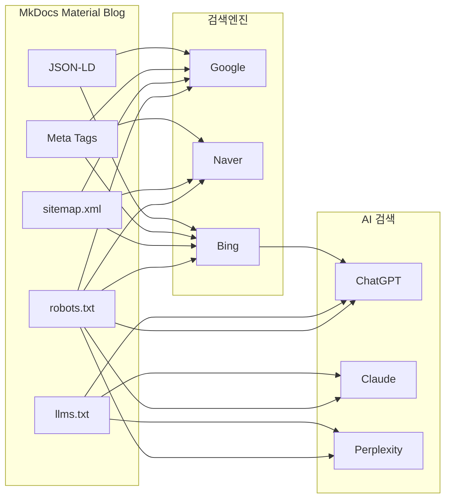

# GitHub Pages 블로그에 SEO + GEO 최적화 적용하기

## 배경

MkDocs Material + GitHub Pages로 기술 블로그를 운영하고 있었다. 글은 220개가 넘었지만, 구글이나 네이버에서 검색하면 내 블로그가 나오지 않았다. sitemap.xml은 자동 생성되고 있었지만, 검색엔진에 "이 사이트를 크롤링해달라"고 알린 적이 없었기 때문이다.

여기에 더해, ChatGPT나 Claude 같은 AI 검색 도구가 내 블로그를 인용할 수 있도록 GEO(Generative Engine Optimization)까지 적용하기로 했다.

이 글에서 다루는 내용:

- Google Search Console / Naver Search Advisor / Bing Webmaster Tools 등록
- robots.txt에 AI 크롤러 명시적 허용
- llms.txt 생성 (AI가 사이트를 이해하기 위한 새로운 표준)
- JSON-LD 구조화 데이터 추가
- MkDocs Material에서 메타태그가 반영되지 않는 문제 해결

## 전체 구조



핵심은 기존 SEO(검색엔진 등록)와 GEO(AI 검색 최적화)를 동시에 적용하는 것이다. 특히 ChatGPT Search는 Bing 검색 결과를 기반으로 인용하기 때문에, Bing 등록이 곧 ChatGPT 노출로 이어진다.

## 1단계: 기존 SEO 설정

### 현재 상태 파악

MkDocs Material은 기본적으로 여러 SEO 요소를 자동 생성한다:

- **sitemap.xml** -- 자동 생성 (이 블로그는 322개 URL 포함)
- **social cards** -- `social` 플러그인으로 OG 이미지 자동 생성
- **RSS 피드** -- `rss` 플러그인으로 feed_rss_created.xml 생성
- **site_url, site_description** -- mkdocs.yml에 설정됨

없었던 것:

- **robots.txt** -- 404 상태
- **검색엔진 등록** -- Google, Naver, Bing 모두 미등록
- **인증 메타태그** -- 소유권 확인용 태그 없음

### robots.txt 생성

`docs/robots.txt`를 만들면 MkDocs가 빌드 시 사이트 루트에 복사한다.

```
User-agent: *
Allow: /

Sitemap: https://sonaiengine.github.io/sonblog/sitemap.xml
```

이것만으로도 기본 SEO는 동작하지만, 나중에 AI 크롤러를 위해 확장한다.

### Google Search Console 등록

1. [Google Search Console](https://search.google.com/search-console)에서 URL 접두어 방식으로 속성 추가
2. 소유권 확인은 **HTML 태그** 방식 선택
3. `content` 값을 MkDocs 템플릿에 삽입
4. sitemap.xml 제출

### Naver Search Advisor 등록

네이버는 **호스트 단위**로만 사이트를 등록할 수 있다. `sonaiengine.github.io/sonblog/`처럼 하위 경로는 입력할 수 없어서, `sonaiengine.github.io`로 등록해야 한다.

문제는 이 블로그가 GitHub Pages의 **프로젝트 사이트**라서 `/sonblog/` 경로에 배포된다는 점이다. 루트 도메인(`sonaiengine.github.io`)에는 아무것도 없었다.

해결 방법: `SonAIengine.github.io` 레포를 새로 만들어서 루트 사이트를 구성했다.

```html
<!-- SonAIengine.github.io/index.html -->
<!DOCTYPE html>
<html lang="ko">
<head>
  <meta charset="utf-8">
  <title>SON BLOG</title>
  <meta name="naver-site-verification" content="45be0273e8dda...">
  <meta name="google-site-verification" content="uH7pN0ErLBG0N...">
  <meta http-equiv="refresh" content="0; url=https://sonaiengine.github.io/sonblog/">
</head>
<body>
  <p>Redirecting to <a href="https://sonaiengine.github.io/sonblog/">SON BLOG</a>...</p>
</body>
</html>
```

이렇게 하면:

- `sonaiengine.github.io` 접속 시 `/sonblog/`로 자동 리다이렉트
- 네이버 소유권 인증 메타태그를 루트에 배치 가능
- 나중에 커스텀 도메인 연결 시에도 활용 가능

네이버 소유확인은 **HTML 파일 업로드** 방식으로 진행했다. 인증 파일(`navere684fefb330f4f1ca448cb90ab243358.html`)을 루트 레포에 배치하고, 파일 내용은 네이버에서 다운로드한 원본 그대로 사용해야 한다.

### Bing Webmaster Tools 등록

Bing 등록이 중요한 이유: Princeton 연구에 따르면 **ChatGPT Search 인용의 87%가 Bing 검색 결과와 일치**한다. 즉 Bing에 인덱싱되면 ChatGPT가 블로그를 인용할 확률이 높아진다.

등록은 간단하다. Bing Webmaster Tools에서 **Google Search Console에서 가져오기**를 선택하면 인증과 sitemap이 자동으로 연동된다.

## 2단계: MkDocs Material 메타태그 삽입 삽질

### extrahead.html이 안 먹히는 문제

처음에는 MkDocs Material 문서를 보고 `overrides/partials/extrahead.html`에 메타태그를 넣었다. 커밋하고 배포했는데, 배포된 페이지에서 인증 메타태그가 없었다.

```bash
curl -s https://sonaiengine.github.io/sonblog/ | grep "verification"
# 출력 없음
```

원인: MkDocs Material 9.x에서 `partials/extrahead.html`은 **자동으로 include되지 않는다**. base 템플릿에 ``만 있고, 이 블록을 채우는 partial 파일을 자동으로 로드하지 않는다.

### 해결: overrides/main.html에 block extrahead 사용

```html
<!-- overrides/main.html -->



<meta name="keywords" content="AI Engineer, LLM Serving, RAG, ...">
<meta property="og:locale" content="ko_KR">
<meta property="og:site_name" content="SON BLOG">
<meta name="naver-site-verification" content="45be0273e8dda...">
<meta name="google-site-verification" content="uH7pN0ErLBG0N...">

```

`overrides/main.html`이 `base.html`을 extend하면서 `extrahead` 블록을 오버라이드하면, 모든 페이지의 `<head>`에 메타태그가 삽입된다. 기존 `home.html`은 `main.html`을 extend하고 있으므로 체인이 유지된다:

```
home.html → main.html → base.html
```

배포 후 확인:

```bash
curl -s https://sonaiengine.github.io/sonblog/ | grep "verification"
# <meta name="naver-site-verification" content="45be0273e8dda...">
# <meta name="google-site-verification" content="uH7pN0ErLBG0N...">
```

## 3단계: GEO (Generative Engine Optimization)

SEO가 "Google/Naver에서 검색되게 하기"라면, GEO는 "ChatGPT/Claude/Perplexity가 내 콘텐츠를 인용하게 하기"다.

### AI 크롤러 현황

2025년 기준 AI 크롤러 트래픽은 전년 대비 **300% 증가**했다 (Cloudflare 보고서). 주요 크롤러:

| 회사 | 학습용 크롤러 | 검색/인덱스용 | 사용자 요청용 |
|------|-------------|-------------|-------------|
| OpenAI | GPTBot | OAI-SearchBot | ChatGPT-User |
| Anthropic | ClaudeBot, anthropic-ai | Claude-SearchBot | claude-web |
| Perplexity | PerplexityBot | PerplexityBot | Perplexity-User |
| Google | Google-Extended | Googlebot | Googlebot |
| Microsoft | Bingbot | Bingbot | Bingbot |

### robots.txt 확장

기존 `User-agent: *`를 AI 크롤러별로 명시적으로 허용하도록 변경했다:

```
# OpenAI
User-agent: GPTBot
Allow: /

User-agent: OAI-SearchBot
Allow: /

User-agent: ChatGPT-User
Allow: /

# Anthropic (Claude)
User-agent: ClaudeBot
Allow: /

User-agent: Claude-SearchBot
Allow: /

User-agent: claude-web
Allow: /

# Perplexity
User-agent: PerplexityBot
Allow: /

# Google Gemini
User-agent: Google-Extended
Allow: /

# ... (Apple, Meta, Amazon 등 추가)
```

`User-agent: *`만으로도 허용되지만, 명시적으로 적어두면 의도가 분명해진다. 일부 AI 회사는 자사 크롤러가 명시적으로 허용/차단되었는지를 확인한다.

### llms.txt -- AI를 위한 사이트 설명서

`llms.txt`는 2024년 Answer.AI의 Jeremy Howard가 제안한 표준으로, LLM이 사이트 구조를 빠르게 파악할 수 있도록 마크다운 형식으로 사이트를 요약하는 파일이다. 84만+ 사이트가 도입했다.

공식 채택은 아니지만, 비용 대비 효과가 좋다. `docs/llms.txt`에 파일을 만들면 MkDocs가 사이트 루트에 복사한다.

```markdown
# SON BLOG

> AI Engineer 손성준의 기술 블로그. 221개 포스트.
> LLM Serving, RAG, Hybrid Search, Rust Search Engine, Kubernetes,
> Embedding Optimization 등 실전 AI 엔지니어링 경험을 커밋 기반으로 기록한다.

## AI / LLM (56 posts)

### AI Agent -- 브라우저 자동화
- [AI Agent 기반 브라우저 자동화 시스템 구축기](ai/agent/...): Tauri + Playwright MCP + LLM Agent

### XGEN 플랫폼 -- LLM/임베딩 모델 서빙
- [vLLM vs llama.cpp: 백엔드 스위칭 아키텍처](ai/XGEN/...): 런타임 백엔드 전환

## Search Engine (90 posts)
...
```

카테고리별로 주요 글의 제목, URL, 한 줄 설명을 정리한다. AI가 "이 사이트에서 LLM 서빙 관련 글을 찾아야 한다"고 판단할 때 llms.txt를 참고할 수 있다.

### JSON-LD 구조화 데이터

Google과 Microsoft가 2025년에 공식 확인한 내용: **AI 시스템이 JSON-LD 구조화 데이터를 활용해서 콘텐츠를 이해한다**. GPT-4의 정확도가 구조화 데이터 없이 16%에서, 있으면 54%로 올라갔다는 연구도 있다.

`overrides/main.html`의 `extrahead` 블록에 두 가지 스키마를 추가했다:

**WebSite 스키마** (사이트 전체):

```html
<script type="application/ld+json">
{
  "@context": "https://schema.org",
  "@type": "WebSite",
  "name": "SON BLOG",
  "url": "https://sonaiengine.github.io/sonblog/",
  "description": "AI Engineer 손성준 · LLM Serving, RAG, Rust, K8s",
  "inLanguage": "ko",
  "author": {
    "@type": "Person",
    "name": "손성준",
    "jobTitle": "AI Engineer",
    "url": "https://github.com/SonAIengine"
  }
}
</script>
```

**TechArticle 스키마** (개별 글):

MkDocs의 Jinja2 템플릿을 활용해서 각 페이지의 frontmatter 메타데이터를 동적으로 삽입한다:

```html

<script type="application/ld+json">
{
  "@context": "https://schema.org",
  "@type": "TechArticle",
  "headline": "{{ page.meta.title }}",
  "description": "{{ page.meta.description }}",
  "datePublished": "{{ page.meta.date }}",
  "url": "{{ page.canonical_url }}",
  "inLanguage": "ko",
  "author": { "@type": "Person", "name": "손성준" }
}
</script>

```

이렇게 하면 221개 글 각각에 자동으로 TechArticle 스키마가 생성된다. 조건문으로 Home 페이지는 제외했다.

## 트러블슈팅 타임라인

| 시점 | 문제 | 해결 |
|------|------|------|
| `8d05a60` | SEO 메타태그 배포 | `partials/extrahead.html`에 넣었으나 반영 안 됨 |
| `3c83935` | extrahead가 안 먹힘 | `overrides/main.html`의 ``로 변경 |
| `cd2fcd6` | 네이버 호스트 단위 등록 | `SonAIengine.github.io` 루트 레포 생성 + 리다이렉트 |
| `dbde359` | 네이버 인증 파일 내용 불일치 | 네이버에서 다운로드한 원본 파일 내용으로 교체 |
| Google 확인 | HTML 파일 방식으로 시도 → 실패 | HTML 태그 방식으로 전환 → 성공 |

가장 시간을 많이 쓴 부분은 MkDocs Material의 `extrahead.html` 오버라이드 방식이었다. 공식 문서만 보면 `overrides/partials/extrahead.html`을 만들면 될 것 같지만, 실제로는 `main.html`에서 ``를 직접 오버라이드해야 한다.

## 최종 결과

### 적용된 파일 목록

```
sonblog/
  docs/
    robots.txt              # AI 크롤러 15개+ 명시 허용 + sitemap 경로
    llms.txt                # 221개 포스트 카테고리별 구조화 요약
  overrides/
    main.html               # SEO 메타태그 + JSON-LD (WebSite + TechArticle)

SonAIengine.github.io/
  index.html                # 루트 → /sonblog/ 리다이렉트 + 인증 메타태그
  navere684...html           # 네이버 소유확인 HTML 파일
  404.html                  # 404 → /sonblog/ 리다이렉트
```

### 등록 현황

| 서비스 | 역할 | 상태 |
|--------|------|------|
| Google Search Console | 구글 검색 노출 | 소유권 확인 + sitemap 제출 완료 |
| Naver Search Advisor | 네이버 검색 노출 | 소유권 확인 + sitemap 제출 완료 |
| Bing Webmaster Tools | Bing 검색 + ChatGPT 인용 | Google에서 자동 가져오기 완료 |

### GEO 최적화 요소

| 요소 | 대상 | 설명 |
|------|------|------|
| robots.txt | 모든 크롤러 | GPTBot, ClaudeBot, PerplexityBot 등 15개+ 명시 허용 |
| llms.txt | LLM | 사이트 구조 마크다운 요약 (카테고리별 주요 글 링크) |
| JSON-LD | Google AI, Bing Copilot | WebSite + TechArticle 스키마 (221개 글 자동 생성) |
| sitemap.xml | 전체 | 322개 URL 자동 생성 (MkDocs 기본 기능) |
| RSS 피드 | 전체 | feed_rss_created.xml (MkDocs RSS 플러그인) |

## 회고

### MkDocs Material은 SEO 기반이 좋다

sitemap.xml, OG 이미지, canonical URL, RSS 피드가 플러그인만으로 자동 생성된다. 부족한 건 검색엔진 등록과 AI 크롤러 대응 정도였다.

### GEO는 아직 초기 단계

llms.txt는 84만 사이트가 도입했지만, OpenAI/Anthropic/Google 어디도 공식적으로 "llms.txt를 크롤링에 활용한다"고 확인하지 않았다. 하지만 구현 비용이 거의 없으므로 미래 대비 차원에서 넣어두는 게 합리적이다.

반면 JSON-LD는 Google과 Microsoft가 **공식 확인**한 것이므로, 구조화 데이터는 확실히 효과가 있다.

### GitHub Pages 프로젝트 사이트의 한계

`username.github.io/project/` 형태의 프로젝트 사이트는 호스트 단위 등록을 요구하는 네이버 같은 서비스에서 불편하다. 루트 레포(`username.github.io`)를 만들어서 리다이렉트하는 방식으로 해결했지만, 커스텀 도메인을 연결하면 이 문제가 근본적으로 해결된다.

### 검색 노출까지 예상 시간

- Google: 며칠 ~ 1주일
- Bing(+ ChatGPT): 최대 48시간
- Naver: 1 ~ 2주
