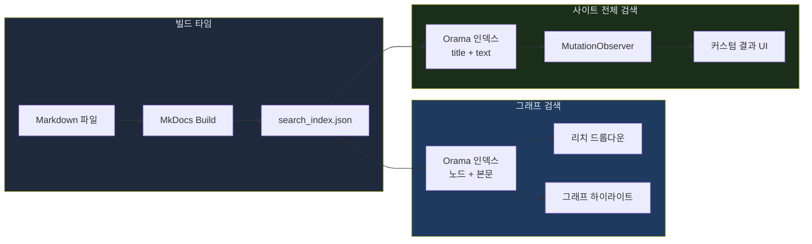

# Orama BM25로 MkDocs 블로그 검색을 완전히 교체한 과정

## 개요

MkDocs Material은 기본으로 lunr.js 기반 검색을 제공한다. 한국어 토크나이징이 부실하고, 결과 랭킹이 단순하며, 검색 결과 UI를 커스터마이징할 여지가 거의 없다. [Knowledge Graph](knowledge-graph.md)를 만들면서 그래프 노드 검색에 Orama BM25를 도입했는데, 성능과 유연성이 좋아서 사이트 전체 검색도 Orama로 교체하기로 했다.

이 글에서는 두 가지 검색 시스템을 다룬다:

1. **Knowledge Graph 노드 검색** — 그래프 시각화 페이지 내 노드 검색 + 하이라이트
2. **사이트 전체 검색** — Material for MkDocs의 lunr.js 결과를 Orama BM25로 완전 대체

두 시스템 모두 클라이언트 사이드에서 동작하며, MkDocs가 빌드 시 생성하는 `search_index.json`을 인덱스 소스로 공유한다.



## Knowledge Graph 노드 검색

### 인덱스 설계

Knowledge Graph에는 카테고리, 서브카테고리, 시리즈, 태그, 포스트 5가지 타입의 노드가 있다. 단순한 label 매칭으로는 "K8s 인프라 관련 글"을 찾을 수 없다. 검색 인덱스에 **노드 label뿐 아니라 실제 글 본문, 태그, 시리즈 정보**까지 포함시켰다.

```javascript
oramaDb = create({
  schema: {
    nodeId: "string",
    label:    "string",
    nodeType: "string",
    content:  "string",   // search_index.json의 본문 (최대 2,000자)
    tags:     "string",   // 연결된 태그 라벨
    series:   "string",
  },
});
```

본문 텍스트는 MkDocs의 `search_index.json`에서 가져온다. 이 파일은 빌드 시점에 모든 페이지의 제목/본문/위치를 포함한 JSON으로 생성된다. 그래프 초기화 시 `fetch`로 로드해서 URL을 키로 매핑한다.

```javascript
const resp = await fetch(siteBase + "search/search_index.json");
const searchData = await resp.json();

// URL → 본문 텍스트 매핑
const urlToText = {};
searchData.docs.forEach(d => {
  const loc = (d.location || "").split("#")[0];
  if (!loc) return;
  if (!urlToText[loc]) urlToText[loc] = "";
  urlToText[loc] += " " + stripHtml(d.text || "");
});
```

각 포스트 노드의 URL을 정규화해서 `urlToText`에서 본문을 찾고, 2,000자까지 잘라서 인덱싱한다. 태그 정보는 Graphology 그래프에서 이웃 노드를 조회해서 가져온다.

```javascript
// 노드 → 연결된 태그 라벨 매핑
const nodeTagLabels = {};
graph.nodes().forEach(n => {
  if (graph.getNodeAttribute(n, "nodeType") === "post") {
    const tags = graph.neighbors(n)
      .filter(nb => graph.getNodeAttribute(nb, "nodeType") === "tag")
      .map(nb => graph.getNodeAttribute(nb, "label"));
    nodeTagLabels[n] = tags.join(" ");
  }
});
```

### BM25 검색과 필드별 가중치

Orama의 `boost` 옵션으로 필드별 검색 가중치를 설정했다. label 매치에 3배, tags에 2배, series에 1.5배 가중치를 줘서 정확한 노드 이름 매치가 최상위에 오도록 했다.

```javascript
const results = oramaSearch(oramaDb, {
  term: q,
  limit: 20,
  boost: { label: 3, tags: 2, series: 1.5, content: 1 },
});
```

"RAG"를 검색하면 "RAG" 태그 노드가 1위, "Kotaemon RAG" 포스트가 2위, 본문에 RAG를 언급하는 다른 포스트들이 그 뒤를 잇는다.

### 검색 결과의 그래프 반영

검색 결과는 드롭다운 UI에 표시되는 것과 동시에 **그래프 시각화에도 반영**된다. Sigma.js의 `nodeReducer`와 `edgeReducer`를 활용해 검색 매치 노드만 강조하고 나머지를 희미하게 처리한다.

```javascript
// nodeReducer 내부
if (graphState.searchQuery && graphState.searchMatches.size > 0) {
  if (!graphState.searchMatches.has(node)) {
    res.color = dark ? "#1e293b" : "#cbd5e1";
    res.label = "";
    res.size  = data.size * 0.4;
    res.borderSize = 0;
    return res;
  }
  // 매치된 노드: 강조
  res.size = data.size * 1.3;
  res.borderColor = dark ? "#fbbf24" : "#d97706";
  res.borderSize  = 2.5;
}
```

`edgeReducer`에서도 동일한 패턴이다. 검색 매치 노드에 연결되지 않은 엣지는 색상을 희미하게 줄인다.

### 리치 검색 드롭다운

검색 결과 드롭다운은 단순 목록이 아니다. 노드 타입에 따라 표시 정보가 달라진다.

**포스트 노드**: 날짜, 시리즈, 본문 미리보기(80자), 태그 뱃지

```javascript
if (doc.nodeType === "post") {
  const parts = [];
  if (attrs.date) parts.push(attrs.date);
  if (attrs.series) parts.push(attrs.series);
  if (parts.length) metaHtml += `<span class="gsd-meta">${parts.join(" · ")}</span>`;
  if (doc.content) {
    const teaser = doc.content.slice(0, 80).replace(/\s+/g, " ").trim();
    metaHtml += `<span class="gsd-teaser">${teaser}...</span>`;
  }
  if (doc.tags) {
    const tagList = doc.tags.split(" ").filter(Boolean).slice(0, 5);
    metaHtml += tagList.map(t => `<span class="gsd-tag">${t}</span>`).join("");
  }
}
```

**비포스트 노드** (카테고리, 태그 등): 연결 수만 표시.

드롭다운에서 항목을 클릭하면 `zoomToNode()`으로 해당 노드 위치로 카메라가 이동하고, `openPanel()`로 사이드패널이 열린다.

### Orama 로딩 전 폴백

Orama 인덱스 구축은 비동기로 진행된다. `search_index.json` fetch가 끝나기 전에 사용자가 검색할 수 있으므로, 폴백으로 단순 `includes` 매칭을 제공한다.

```javascript
if (q && !oramaReady) {
  const ql = q.toLowerCase();
  graph.nodes().forEach(n => {
    if ((graph.getNodeAttribute(n, "label") || "").toLowerCase().includes(ql)) {
      graphState.searchMatches.add(n);
    }
  });
  renderSearchDropdown(null);  // 폴백 모드: 타입+라벨만 표시
}
```

폴백 모드에서는 노드 label만 매칭되고, teaser나 태그 같은 리치 정보 없이 기본 목록만 표시된다. Orama 준비가 완료되면 자동으로 BM25 검색으로 전환된다.

## 사이트 전체 검색: lunr.js 교체

### 문제 정의

Material for MkDocs의 기본 검색은 lunr.js 기반이다. 몇 가지 한계가 있었다:

- **결과 랭킹이 단순하다**: TF-IDF 기반으로 BM25 대비 정밀도가 떨어진다
- **한국어 토크나이징이 부실하다**: 형태소 분석 없이 공백 분리만 사용
- **결과 UI 커스터마이징이 어렵다**: Web Worker 내부에서 렌더링 데이터를 생성하므로 결과 포맷을 바꾸기 어렵다
- **검색 결과에 HTML 태그가 그대로 노출됐다**: `<code>`, `<pre>` 등이 결과 텍스트에 포함

### 전략: MutationObserver로 가로채기

Material for MkDocs의 검색 UI 자체는 잘 만들어져 있다. 검색 모달, 입력 필드, 결과 컨테이너의 레이아웃을 그대로 활용하되, **결과 내용만 Orama로 교체**하는 전략을 선택했다.

핵심은 `MutationObserver`다. lunr.js Worker가 검색 결과를 DOM에 반영할 때마다 Observer가 감지하고, Orama 결과로 덮어쓴다.

```javascript
resultObserver = new MutationObserver(function () {
  if (!lastQuery || !ready) return;
  // Orama가 방금 렌더링한 건 무시 (무한 루프 방지)
  if (resultList.getAttribute("data-orama") === "1") {
    resultList.removeAttribute("data-orama");
    return;
  }
  var results = performSearch(lastQuery);
  if (results) renderResults(results, resultList);
});
resultObserver.observe(resultList, { childList: true });
```

`data-orama` 속성이 핵심이다. Orama가 DOM을 변경할 때 이 속성을 설정하고, Observer는 이 속성이 있으면 자신의 변경을 무시한다. 이 속성이 없으면 lunr.js가 DOM을 변경한 것이므로 Orama 결과로 덮어쓴다. 이 한 줄의 플래그가 없으면 무한 루프에 빠진다.

### 초기 인덱스 구축

페이지 로드 즉시 Orama CDN과 `search_index.json`을 병렬로 로드한다.

```javascript
var [oramaModule, indexResp] = await Promise.all([
  import("https://cdn.jsdelivr.net/npm/@orama/orama@3/+esm"),
  fetch(SITE_BASE + "search/search_index.json"),
]);
```

인덱스 스키마는 `location`, `title`, `text` 세 필드다. title에 5배 가중치를 줘서 제목 매치가 본문 매치보다 훨씬 우선순위가 높도록 했다.

```javascript
db = orama.create({
  schema: {
    location: "string",
    title:    "string",
    text:     "string",
  },
});

// 검색 시 boost
var result = orama.search(db, {
  term: query,
  limit: 30,
  boost: { title: 5, text: 1 },
});
```

### 텍스트 정제

`search_index.json`의 텍스트에는 HTML 태그, 마크다운 기호, 코드 블록 잔여물이 섞여 있다. 인덱싱 전에 철저히 정제한다.

```javascript
function stripHtml(str) {
  if (!str) return "";
  return str
    .replace(/<pre[\s\S]*?<\/pre>/gi, " ")    // 코드 블록 전체 제거
    .replace(/<code[\s\S]*?<\/code>/gi, " ")   // 인라인 코드 제거
    .replace(/<[^>]*>/g, " ")                   // HTML 태그
    .replace(/```[\s\S]*?```/g, " ")            // 마크다운 코드 펜스
    .replace(/`[^`]+`/g, " ")                   // 인라인 코드
    .replace(/^#{1,6}\s+/gm, "")                // 헤더 기호
    .replace(/\*{1,2}([^*]+)\*{1,2}/g, "$1")   // bold/italic
    .replace(/\[([^\]]+)\]\([^)]+\)/g, "$1")   // 링크
    .replace(/[*_~|]/g, "")                     // 기타 마크다운 기호
    .replace(/\s+/g, " ")
    .trim();
}
```

처음에는 HTML 태그만 제거했는데, 검색 결과에 `` `python` ``, `###`, `[link](url)` 같은 마크다운 잔여물이 노출됐다. 커밋을 2번 거쳐 해결했다.

```
# 커밋: fix: 사이트 검색 결과에서 HTML 태그 노출 제거 (stripHtml 적용)
# 날짜: 2026-02-18 06:58
```

## 검색 결과 UI 개선

### 페이지별 그룹핑

MkDocs의 `search_index.json`은 하나의 페이지를 여러 문서(섹션)로 분할한다. "## 온톨로지 설계" 섹션이 별도의 `doc`으로 인덱싱되는 식이다. lunr.js는 이걸 플랫하게 나열하는데, Orama 결과에서는 **동일 페이지의 섹션을 그룹핑**했다.

```javascript
var grouped = new Map();
results.hits.forEach(function (hit) {
  var doc = hit.document;
  var baseLoc = (doc.location || "").split("#")[0];
  if (!grouped.has(baseLoc)) {
    grouped.set(baseLoc, {
      location: baseLoc, title: "", pageText: "",
      sections: [], topScore: hit.score,
      isIndex: isIndexPage(baseLoc),
    });
  }
  var entry = grouped.get(baseLoc);
  if (!doc.location.includes("#") && doc.title) {
    entry.title = doc.title;
    if (doc.text) entry.pageText = doc.text;
  }
  entry.sections.push({
    location: doc.location,
    title: doc.title,
    text: doc.text || "",
    score: hit.score,
  });
});
```

`baseLoc`(해시 제거)로 그룹핑하면 "knowledge-graph.md"의 여러 섹션이 하나의 결과 카드로 묶인다. 그룹 내 최고 점수(`topScore`)를 기준으로 정렬한다.

추가로 **태그 페이지, 블로그 인덱스 같은 집계 페이지는 후순위로** 밀었다. 이런 페이지는 거의 모든 검색어에 매치되지만 실제로 찾는 콘텐츠가 아닌 경우가 대부분이다.

```javascript
sorted.sort(function (a, b) {
  if (a.isIndex !== b.isIndex) return a.isIndex ? 1 : -1;
  return b.topScore - a.topScore;
});
```

### 빵크럼 경로

검색 결과에 URL 경로 기반의 빵크럼을 추가했다. `search-engine/rust-search/redis-caching.md`는 "Search Engine > rust-search"로 표시된다.

```javascript
var CATEGORY_NAMES = {
  "search-engine": "Search Engine",
  "ai": "AI/ML & LLM",
  "devops": "DevOps",
  "full-stack": "Full Stack",
  "blog": "Blog",
};

function getBreadcrumb(location) {
  var parts = location.split("#")[0].split("/").filter(Boolean);
  var top = CATEGORY_NAMES[parts[0]];
  if (!top) return "";
  if (parts.length <= 2) return top;
  return top + " \u203A " + decodeURIComponent(parts[1]);
}
```

빵크럼 옆에 섹션 매치 수 뱃지도 표시한다. "3개 섹션"처럼 해당 페이지에서 몇 개 섹션이 매치됐는지 한눈에 보인다.

### 컨텍스트 스니펫

기존 lunr.js는 텍스트의 앞부분 120자를 고정으로 잘라서 보여줬다. 검색어가 본문 중간에 있으면 스니펫에 아예 나타나지 않는 문제가 있었다.

**슬라이딩 윈도우 알고리즘**으로 검색어 매치 밀도가 가장 높은 구간을 찾아서 스니펫으로 추출한다.

```javascript
function contextSnippet(text, query, maxLen) {
  var lower = text.toLowerCase();
  var words = query.toLowerCase().split(/\s+/).filter(Boolean);

  // 모든 매치 위치 수집
  var positions = [];
  words.forEach(function (w) {
    var idx = 0;
    while (idx < lower.length) {
      var found = lower.indexOf(w, idx);
      if (found === -1) break;
      positions.push(found);
      idx = found + w.length;
    }
  });

  if (positions.length === 0) return text.slice(0, maxLen);
  positions.sort(function (a, b) { return a - b; });

  // 슬라이딩 윈도우: maxLen 구간에 매치가 가장 많은 시작점
  var bestStart = positions[0], bestCount = 0;
  for (var i = 0; i < positions.length; i++) {
    var count = 0;
    for (var j = i; j < positions.length && positions[j] < positions[i] + maxLen; j++) {
      count++;
    }
    if (count > bestCount) {
      bestCount = count;
      bestStart = positions[i];
    }
  }

  var start = Math.max(0, bestStart - 30);
  // 단어 경계에서 자르기 ...
}
```

160자 윈도우를 모든 매치 위치에 슬라이딩하면서 매치가 가장 많이 포함된 구간을 찾는다. 시작점에서 30자 앞으로 여유를 두어 문맥이 자연스럽게 보이도록 했다.

### 검색어 하이라이팅

스니펫과 제목에서 검색어를 `<mark>` 태그로 감싸서 시각적으로 강조한다.

```javascript
function highlight(text, query) {
  var escaped = esc(text);  // XSS 방지: HTML 이스케이프 먼저
  var words = query.split(/\s+/).filter(Boolean);
  words.forEach(function (w) {
    var re = new RegExp(
      "(" + w.replace(/[.*+?^${}()|[\]\\]/g, "\\$&") + ")", "gi"
    );
    escaped = escaped.replace(re, "<mark>$1</mark>");
  });
  return escaped;
}
```

XSS 방지를 위해 `esc()`로 HTML 이스케이프를 먼저 하고, 그 다음에 `<mark>` 태그를 삽입한다. 검색어의 정규표현식 특수문자도 이스케이프해서 `*`, `(` 같은 문자가 포함된 검색어에서도 오류가 발생하지 않도록 했다.

하이라이팅 CSS에서 Material for MkDocs의 기본 링크 색상이 `<mark>` 스타일을 덮어쓰는 문제가 있었다. `a mark` 셀렉터에 `!important`를 추가해서 해결했다.

```css
.md-search-result mark,
.md-search-result a mark {
  background: rgba(255, 235, 59, 0.5) !important;
  color: var(--md-default-fg-color) !important;
  text-decoration: none !important;
}
```

```
# 커밋: fix: 검색 하이라이팅이 링크 스타일에 덮어쓰이는 문제 수정 — !important + a mark 셀렉터
# 날짜: 2026-02-18 07:47
```

### 섹션 결과: 컴팩트 링크 리스트

섹션 매치 결과는 처음에 페이지 결과와 동일한 카드 형태로 표시했다. teaser까지 포함된 풀사이즈 카드가 반복되니 한 페이지에 6-7개의 섹션이 나열되면서 검색 결과가 지나치게 길어졌다.

컴팩트 링크 리스트로 변경했다. `#` 접두어와 `border-left` 비주얼 그루핑으로 섹션임을 명확히 하고, 최대 4개까지만 표시한다.

```javascript
if (filteredSections.length > 0) {
  var maxSec = Math.min(filteredSections.length, 4);
  html += '<div class="md-search-result__sections">';
  for (var si = 0; si < maxSec; si++) {
    var sec = filteredSections[si];
    if (!sec.title) continue;
    html += '<a href="' + esc(secUrl) + '" class="md-search-result__section-link">';
    html += '<span class="md-search-result__section-hash">#</span>';
    html += highlight(sec.title, query);
    html += '</a>';
  }
  if (filteredSections.length > maxSec) {
    html += '<span class="md-search-result__section-more">'
      + '+' + (filteredSections.length - maxSec) + '개 더</span>';
  }
  html += '</div>';
}
```

섹션 필터링에서 페이지 제목과 동일한 섹션은 제외한다. MkDocs는 `#` 없는 문서 자체와 `#heading` 섹션을 모두 인덱싱하는데, 페이지 제목 = 첫 번째 섹션 제목인 경우가 대부분이라 중복이 발생한다.

```javascript
var filteredSections = entry.sections
  .filter(function (sec) {
    if (sec.location === baseLoc && !sec.location.includes("#")) return false;
    if (sec.title && sec.title.toLowerCase() === pageTitleLower) return false;
    return true;
  })
  .sort(function (a, b) { return b.score - a.score; });
```

### 키보드 내비게이션

검색 입력 필드에서 화살표 위/아래로 결과를 탐색하고 Enter로 선택하는 기능을 추가했다. Material for MkDocs의 기본 키보드 내비게이션은 lunr.js 결과에 맞춰져 있어서 Orama 커스텀 결과에서는 동작하지 않았다.

```javascript
searchInput.addEventListener("keydown", function (e) {
  if (e.key !== "ArrowDown" && e.key !== "ArrowUp" && e.key !== "Enter") return;
  var links = resultList.querySelectorAll(
    ".md-search-result__link, .md-search-result__section-link"
  );
  if (links.length === 0) return;

  if (e.key === "Enter" && activeResultIdx >= 0) {
    e.preventDefault();
    e.stopPropagation();
    links[activeResultIdx].click();
    return;
  }

  if (e.key === "ArrowDown") {
    e.preventDefault();
    activeResultIdx = Math.min(activeResultIdx + 1, links.length - 1);
  } else if (e.key === "ArrowUp") {
    e.preventDefault();
    activeResultIdx = Math.max(activeResultIdx - 1, -1);
  }

  // 활성 항목에 타입별 CSS 클래스 적용
  links.forEach(function (l, i) {
    var cls = l.classList.contains("md-search-result__section-link")
      ? "md-search-result__section-link--active"
      : "md-search-result__link--active";
    l.classList.remove(
      "md-search-result__link--active",
      "md-search-result__section-link--active"
    );
    if (i === activeResultIdx) l.classList.add(cls);
  });

  if (activeResultIdx >= 0) {
    links[activeResultIdx].scrollIntoView({ block: "nearest" });
  }
});
```

페이지 결과 링크와 섹션 링크는 서로 다른 active 클래스를 사용한다. 섹션 링크는 더 미묘한 하이라이트로 시각적 구분을 유지한다.

## 트러블슈팅

### Worker 차단으로 Material 검색 UI가 사라짐

처음 구현에서 lunr.js의 Web Worker를 `importScripts`를 오버라이드해서 차단하려고 했다. Worker가 실행되지 않으면 Material 측에서 검색 UI 컨테이너 자체를 숨겨버리는 문제가 발생했다. Worker는 그대로 두고, DOM 결과만 덮어쓰는 방식으로 전환했다.

```
# 커밋: fix: Worker 차단 제거 — Material 검색 UI 사라짐 해결
# 날짜: 2026-02-18 06:56
```

### 그래프 검색 드롭다운 잘림

그래프 페이지의 검색 드롭다운이 컨테이너 밖으로 넘어가서 잘리는 문제가 있었다. `.graph-page`에 `overflow: hidden`이 설정되어 있었기 때문이다. `overflow: hidden` 제거와 드롭다운 위치를 `right` 정렬 + 가변 너비로 변경해서 해결했다.

```
# 커밋: fix: 그래프 검색 드롭다운 잘림 완전 해결 — .graph-page overflow:hidden 제거
# 날짜: 2026-02-18
```

### CSS 특이성 전쟁

Material for MkDocs의 CSS는 구체적인 셀렉터로 검색 결과 스타일을 정의한다. 커스텀 CSS에서 `display: flex`, `flex-direction: column` 같은 레이아웃 속성을 설정해도 Material CSS에 의해 덮어쓰여졌다.

두 가지로 해결했다:

1. 핵심 레이아웃 속성에 `!important` 추가
2. `extra.css`에 캐시 버스팅 쿼리 스트링 추가 (`extra.css?v=4`)

```css
.md-search-result__sections {
  display: flex !important;
  flex-direction: column !important;
  gap: 1px !important;
  padding: 0.2em 0.8em 0.5em 1.4em !important;
  margin: 0 0 0 1.6em !important;
  border-left: 2.5px solid rgba(63, 81, 181, 0.3) !important;
}
.md-search-result__section-link {
  display: block !important;
}
```

`!important`를 남용하는 것은 좋지 않지만, Material for MkDocs의 내부 CSS와 싸우는 상황에서는 불가피했다. 캐시 버스팅도 중요하다 — GitHub Pages CDN이 CSS를 강하게 캐시하기 때문에, 파일 내용이 바뀌어도 쿼리 스트링을 바꾸지 않으면 이전 버전이 계속 서빙된다.

```yaml
# mkdocs.yml
extra_css:
  - extra.css?v=4
```

### 검색 결과 문서 아이콘

Material for MkDocs는 검색 결과에 문서 아이콘(`md-search-result__icon`)을 표시한다. Orama 커스텀 결과에서는 빵크럼이 카테고리 역할을 대체하므로 아이콘이 불필요했고, 오히려 레이아웃을 방해했다. JS에서 아이콘 요소를 렌더링하지 않고, CSS에서도 `display: none !important`로 숨겼다.

```
# 커밋: fix: 검색 결과 문서 아이콘 제거 — 빵크럼이 카테고리 역할 대체
# 날짜: 2026-02-18 08:17
```

## 결과 및 회고

9개의 커밋을 거쳐 두 검색 시스템을 완성했다. Orama 최초 도입(`10000e4`)부터 마지막 아이콘 제거(`e104f2a`)까지 약 1시간 30분이 소요됐다.

**개선 효과**:

- **검색 정확도 향상**: BM25 스코어링 + 필드별 가중치로 lunr.js 대비 관련도 높은 결과가 상위에 위치
- **한국어 검색 개선**: Orama의 토크나이저가 한국어를 더 잘 처리
- **시각적 개선**: 빵크럼 경로, 컨텍스트 스니펫, 섹션 그룹핑, 검색어 하이라이팅
- **사용성 개선**: 키보드 내비게이션, 인덱스 페이지 후순위
- **그래프 연동**: 검색 결과가 그래프 시각화에 실시간 반영

**아쉬운 점**:

- **MutationObserver 방식의 한계**: lunr.js가 먼저 DOM을 변경하고 Orama가 덮어쓰므로, 검색 결과가 깜빡이는 순간이 있다. lunr.js Worker를 완전히 비활성화하는 것이 이상적이지만, Material UI가 Worker에 의존하는 부분이 있어서 불가능했다.
- **CSS `!important` 남용**: Material for MkDocs의 CSS와 공존하기 위해 `!important`를 많이 사용했다. `custom_dir` 오버라이드로 Material의 검색 결과 템플릿 자체를 교체하는 것이 더 깔끔한 접근이었을 수 있다.
- **테스트 부재**: `stripHtml()`, `contextSnippet()`, `getBreadcrumb()` 같은 유틸리티 함수에 단위 테스트가 없다.

다음 단계로는 Orama의 facet 검색 기능을 활용한 카테고리/태그 필터링, 최근 검색어 히스토리, 그리고 검색 분석(어떤 검색어가 결과 0건인지 추적)을 고려하고 있다.
