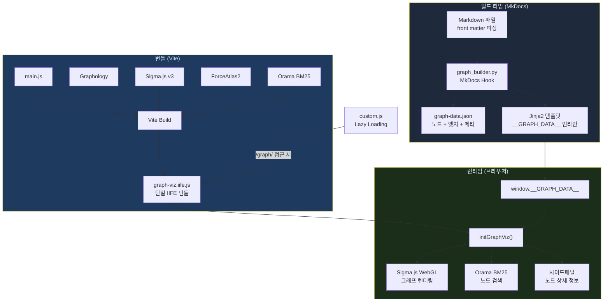
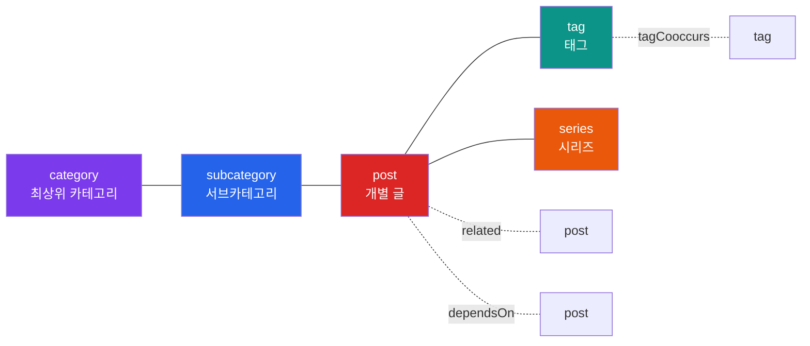

# MkDocs 블로그에 온톨로지 기반 Knowledge Graph 구현하기

## 개요

블로그 글이 20개를 넘어가면서 글 사이의 관계가 점점 보이지 않게 됐다. "검색 엔진 시리즈 9편과 RAG 청킹 글이 어떻게 연결되는가?"를 독자에게 전달할 방법이 필요했다. 태그 페이지나 카테고리 트리로는 한계가 있었다. 글 간 관계를 직관적으로 보여주는 **인터랙티브 지식 그래프**를 직접 만들기로 했다.

최종 결과물은 Sigma.js v3 WebGL 기반의 Knowledge Graph다. 노드를 클릭하면 연관 문서가 사이드패널에 표시되고, 타입별 필터링과 BM25 검색을 지원한다. MkDocs Material 위에 빌드 타임 Python 훅과 런타임 JavaScript 번들 두 레이어로 구현했다.

핵심 기술 스택:

- **그래프 라이브러리**: Graphology + Sigma.js v3 (WebGL 렌더링)
- **레이아웃 알고리즘**: ForceAtlas2 (Barnes-Hut 최적화)
- **검색 엔진**: Orama BM25 (클라이언트 사이드)
- **빌드 훅**: Python (MkDocs hook)
- **번들러**: Vite (IIFE 단일 파일)

## 아키텍처

전체 시스템은 **빌드 타임**과 **런타임** 두 단계로 나뉜다.



빌드 타임에 Python 훅이 모든 Markdown 파일의 front matter를 파싱하여 그래프 데이터(JSON)를 생성한다. 이 데이터는 Jinja2 템플릿을 통해 HTML에 인라인으로 삽입된다. 런타임에는 Vite로 번들링한 IIFE 파일이 Sigma.js WebGL 렌더러를 초기화한다.

## 온톨로지 설계

Knowledge Graph의 핵심은 온톨로지 — 즉 노드와 엣지의 타입 체계 — 설계다. 블로그 콘텐츠의 구조를 5가지 노드 타입과 7가지 엣지 타입으로 모델링했다.



**노드 타입**:

| 타입 | 설명 | 크기 계산 |
|------|------|-----------|
| `category` | AI/ML, Search Engine, DevOps, Full Stack | 고정 28 |
| `subcategory` | XGEN, Rust 검색 엔진, RAG 등 | 16 + degree * 0.3 |
| `series` | front matter `series` 필드로 묶은 글 그룹 | 10 + degree * 0.4 |
| `tag` | front matter `tags` 필드 | 6 + degree * 0.8 (최대 18) |
| `post` | 개별 블로그 글 | 5 + degree * 1.5 (최대 16) |

**엣지 타입**:

| 타입 | 관계 | 설명 |
|------|------|------|
| `inCategory` | post/subcat -> cat | 카테고리 소속 |
| `inSubcategory` | post -> subcat | 서브카테고리 소속 |
| `inSeries` | post -> series | 시리즈 소속 |
| `hasTag` | post -> tag | 태그 부착 |
| `related` | post <-> post | front matter `related` 필드 |
| `dependsOn` | post -> post | front matter `depends_on` 필드 |
| `tagCooccurs` | tag <-> tag | 2개 이상 글에서 태그 공동 출현 |

`tagCooccurs`는 별도 front matter 없이 자동 계산된다. 두 태그가 2개 이상의 글에서 함께 사용되면 엣지가 생성되고, weight는 공동 출현 횟수다.

## 백엔드: graph_builder.py

그래프 데이터 생성은 MkDocs의 hook 시스템을 활용했다. `on_env` 훅에서 `docs/` 디렉토리를 재귀 스캔하여 모든 Markdown 파일의 front matter를 파싱하고, 노드와 엣지를 구성한다.

### Front Matter 파싱

YAML 파서 의존성 없이 정규표현식으로 front matter를 직접 파싱했다. 블록 리스트와 인라인 리스트 모두 지원한다.

```python
def _yaml_list(fm: str, key: str) -> list[str]:
    """YAML front matter에서 리스트 필드를 파싱한다."""
    # 블록: key:\n  - item
    block = re.search(
        rf'^{key}:\s*\n((?:[ \t]+-[ \t]+.+\n?)+)', fm, re.MULTILINE
    )
    if block:
        return [v.strip() for v in re.findall(r'-\s+(.+)', block.group(1))]

    # 인라인: key: [a, b]
    inline = re.search(rf'^{key}:\s*\[(.+)\]', fm, re.MULTILINE)
    if inline:
        return [v.strip().strip('"\'') for v in inline.group(1).split(",")]
    return []
```

이 함수는 `tags`, `related`, `depends_on` 필드를 파싱하는 데 사용된다. PyYAML 의존성을 추가하지 않으려고 직접 구현했다.

### tagCooccurs 엣지 계산

태그 간 공동 출현을 분석하여 자동으로 엣지를 생성한다. 핵심 알고리즘은 간단하다.

```python
pair_count: dict[tuple, int] = defaultdict(int)
for _, tag_ids in post_tag_map.items():
    for i, t1 in enumerate(tag_ids):
        for t2 in tag_ids[i + 1:]:
            pair_count[tuple(sorted([t1, t2]))] += 1

for (t1, t2), cnt in pair_count.items():
    if cnt >= 2:  # 2회 이상 공동 출현만 엣지로
        edges.append(_edge(t1, t2, "tagCooccurs", cnt))
```

각 글에 붙은 태그들의 모든 쌍을 세고, 2회 이상 함께 출현한 쌍만 엣지로 추가한다. weight를 엣지에 저장해서 프론트엔드에서 선 두께에 반영한다.

### 2-Pass 빌드

`related`와 `depends_on` 필드는 다른 글의 파일 경로를 참조하기 때문에, 모든 글을 한 번 스캔한 후에야 역참조를 해결할 수 있다. 1차 패스에서 모든 노드를 등록하고 `rel_to_post_id` 매핑을 구축한 뒤, 2차 패스에서 경로를 post_id로 변환한다.

```python
# 1차 패스에서 구축한 매핑
rel_to_post_id: dict[str, str] = {}  # "ai/XGEN/some-post.md" → "post:ai-xgen-some-post"

# 2차 패스
def resolve(post_id, paths, etype):
    for path in paths:
        tgt_id = rel_to_post_id.get(path.strip())
        if tgt_id and tgt_id in nodes and tgt_id != post_id:
            edges.append(_edge(post_id, tgt_id, etype))
```

### 빌드 출력

`on_env` 훅에서 Jinja2 컨텍스트에 `graph_data`를 주입하고, `on_post_build` 훅에서 `graph-data.json`을 정적 파일로도 출력한다.

```
graph_builder: 127 nodes, 198 edges (series:8, tags:42, posts:24)
graph_builder: graph-data.json → site/assets/graph/graph-data.json
```

## 프론트엔드: Sigma.js + Graphology

프론트엔드는 Vite로 빌드한 단일 IIFE 번들이다. Graphology로 그래프 데이터 구조를 관리하고, Sigma.js v3의 WebGL 렌더러로 화면에 그린다.

### Vite IIFE 빌드

번들러 설정은 IIFE 포맷으로 단일 파일을 출력하도록 했다. MkDocs의 정적 파일로 포함시키기 위해 `outDir`을 `docs/assets/graph`로 지정했다.

```javascript
// vite.config.js
export default defineConfig({
  build: {
    lib: {
      entry: resolve(__dirname, "src/main.js"),
      name: "GraphViz",
      fileName: "graph-viz",
      formats: ["iife"],
    },
    outDir: "../docs/assets/graph",
    emptyOutDir: false,
  },
});
```

### ForceAtlas2 레이아웃

그래프 레이아웃의 핵심 문제는 **초기 배치**였다. 완전 랜덤 배치에서 ForceAtlas2를 돌리면 노드가 뭉치거나 예측 불가능한 형태가 된다. 이를 해결하기 위해 **타입별 섹터 초기 배치**를 도입했다.

```javascript
// 카테고리 노드를 원형으로 균등 배치
catNodes.forEach((n, i) => {
  const angle = (i / catNodes.length) * 2 * Math.PI;
  graph.setNodeAttribute(n, "x", 80 * Math.cos(angle));
  graph.setNodeAttribute(n, "y", 80 * Math.sin(angle));
});

// 서브카테고리는 부모 카테고리 각도 근처에 배치
// 태그/시리즈/포스트는 연결된 상위 노드의 각도 + 지터
```

카테고리를 원 중심에, 서브카테고리를 그 바깥 궤도에, 태그와 포스트를 외곽 궤도에 배치한 뒤 ForceAtlas2를 600 이터레이션 돌린다.

```javascript
forceAtlas2.assign(graph, {
  iterations: 600,
  settings: {
    gravity:           0.3,
    scalingRatio:      55,
    barnesHutOptimize: true,
    barnesHutTheta:    0.5,
    linLogMode:        true,
    adjustSizes:       true,
    slowDown:          8,
  },
});
```

`linLogMode: true`가 핵심이다. 이 옵션은 클러스터 간 분리를 강화해서 카테고리별로 뚜렷하게 군집이 형성된다. `barnesHutOptimize`는 노드 수가 많을 때 O(n log n) 근사로 성능을 보장한다.

### nodeReducer / edgeReducer

Sigma.js v3의 reducer 시스템은 노드/엣지의 렌더링 속성을 동적으로 변환한다. 호버, 선택, 검색 상태에 따라 크기, 색상, 투명도를 조절한다.

```javascript
nodeReducer: (node, data) => {
  const res = { ...data };
  const isSelected = graphState.selectedNode === node;
  const neighbors = graphState.selectedNode
    ? new Set(graph.neighbors(graphState.selectedNode))
    : null;

  // 검색 매치: 매치되지 않은 노드는 희미하게
  if (graphState.searchQuery && !graphState.searchMatches.has(node)) {
    res.color = dark ? "#1e293b" : "#cbd5e1";
    res.label = "";
    res.size  = data.size * 0.4;
    return res;
  }

  // 선택 상태: 이웃이 아닌 노드는 희미하게
  if (graphState.selectedNode && !isSelected && !neighbors?.has(node)) {
    res.color = dark ? "#374151" : "#b0bec5";
    res.label = "";
    res.size  = data.size * 0.7;
    return res;
  }

  // 선택된 노드: 강조
  if (isSelected) {
    res.size = data.size * 1.6;
    res.borderColor = dark ? "#fbbf24" : "#b45309";
    res.borderSize  = 3;
  }
  return res;
},
```

이 패턴으로 한 노드를 클릭하면 직접 연결된 이웃만 선명하게 남고 나머지는 희미해지는 **포커스 효과**를 구현했다.

### 다크/라이트 이중 팔레트

MkDocs Material의 테마 전환에 맞춰 두 벌의 색상 팔레트를 준비했다. 라이트 모드에서는 불투명한 진한 색상, 다크 모드에서는 투명도가 있는 밝은 색상을 사용한다.

```javascript
const NODE_COLORS = dark ? {
  category:    "#a78bfa",   // 라벤더
  subcategory: "#60a5fa",   // 아이스 블루
  tag:         "#34d399",   // 에메랄드
  post:        "#f472b6",   // 핑크
} : {
  category:    "#7C3AED",   // 보라
  subcategory: "#2563EB",   // 파랑
  tag:         "#0D9488",   // 청록
  post:        "#DC2626",   // 빨강
};
```

다크 모드에서는 별 파티클 배경 애니메이션도 추가했다. Canvas 2D API로 200개의 별이 깜빡이는 효과를 구현했다.

## 검색: Orama BM25

그래프에 노드가 100개를 넘으면 시각적 탐색만으로는 한계가 있다. Orama BM25 검색 엔진을 클라이언트 사이드에서 돌려 노드를 빠르게 찾을 수 있게 했다.

### 인덱스 구축

검색 인덱스는 MkDocs가 생성하는 `search_index.json`의 본문 텍스트를 활용한다. 그래프 노드의 label, nodeType에 더해 실제 글 본문을 최대 2,000자까지 인덱싱한다.

```javascript
oramaDb = create({
  schema: {
    nodeId: "string",
    label: "string",
    nodeType: "string",
    content: "string",   // search_index.json의 본문 텍스트
    tags: "string",
    series: "string",
  },
});
```

boost 설정으로 label 매치에 3배, tags에 2배 가중치를 두어 정확한 노드 이름 매치가 상위에 오도록 했다.

### 리치 검색 드롭다운

검색 결과는 단순 목록이 아니라 타입 뱃지, teaser, 날짜, 태그, 연결 수를 포함하는 리치 UI로 표시된다.

```javascript
// 포스트 노드: 날짜 + 시리즈 + 본문 미리보기 + 태그
let metaHtml = "";
if (attrs.date) parts.push(attrs.date);
if (doc.content) {
  const teaser = doc.content.slice(0, 80).trim();
  metaHtml += `<span class="gsd-teaser">${teaser}...</span>`;
}
if (doc.tags) {
  const tagList = doc.tags.split(" ").slice(0, 5);
  metaHtml += tagList.map(t => `<span class="gsd-tag">${t}</span>`).join("");
}
```

검색어를 입력하면 매치된 노드가 그래프에서 하이라이트되고, 비매치 노드는 희미해진다. 드롭다운에서 항목을 클릭하면 해당 노드로 카메라가 이동하고 사이드패널이 열린다.

## UI/UX: 사이드패널과 툴바

### 통합 툴바

화면 상단에 한 줄로 모든 컨트롤을 배치했다. 제목, 통계, 필터 체크박스, 검색, 초기화 버튼이 한 행에 들어간다. MkDocs Material의 `h1` 기본 스타일과 충돌하는 문제가 있어서 제목을 `<span>`으로 변경해야 했다.

```
# 커밋: fix: 툴바 타이틀 h1→span 변경 (MkDocs Material h1 기본 스타일 충돌 해결)
# 날짜: 2026-02-18 06:18
```

### 사이드패널

노드를 클릭하면 우측에 사이드패널이 슬라이드로 열린다. 패널에는 노드의 타입, 이름, 메타데이터와 함께 **연관 포스트 리스트**와 **연결 노드 그룹**이 표시된다.

패널은 오버레이 방식으로 구현했다. 처음에는 그래프 영역을 리사이즈하는 방식이었는데, 패널이 열릴 때마다 Sigma.js의 카메라가 재조정되어 사용자 경험이 나빴다.

```
# 커밋: fix: Knowledge Graph 사이드패널 오버레이 방식으로 변경 (카메라 이동 방지)
# 날짜: 2026-02-18
```

패널의 너비는 드래그로 조절 가능하다. `mousedown` → `mousemove` → `mouseup` 이벤트 체인으로 구현했고, 최소 260px, 최대 700px 범위로 제한했다.

### 타입별 필터

체크박스로 각 노드 타입의 표시/숨김을 제어한다. 핵심은 노드를 숨길 때 연결된 엣지도 함께 숨기는 것이다.

```javascript
function applyFilters() {
  graph.nodes().forEach(n => {
    graph.setNodeAttribute(n, "hidden",
      !activeFilters[graph.getNodeAttribute(n, "nodeType")]);
  });
  // 숨겨진 노드에 연결된 엣지도 숨김
  graph.edges().forEach(e => {
    const [src, tgt] = graph.extremities(e);
    const hidden = graph.getNodeAttribute(src, "hidden")
                || graph.getNodeAttribute(tgt, "hidden");
    graph.setEdgeAttribute(e, "hidden", hidden);
  });
  renderer.refresh();
}
```

기본값으로 post 노드는 숨겨져 있다. 글이 24개라 post를 모두 표시하면 그래프가 복잡해지기 때문이다. 사용자가 체크박스로 활성화하면 포스트 노드와 그 연결선이 나타난다.

## Lazy Loading과 Instant Navigation 대응

Knowledge Graph 번들은 약 300KB에 달한다. 모든 페이지에서 로드할 필요가 없으므로 `/graph/` 경로에 접근할 때만 동적으로 로드했다.

```javascript
// custom.js
var GRAPH_PATH = "/sonblog/graph/";
var bundleLoaded = false;

function maybeInitGraph() {
  if (window.location.pathname !== GRAPH_PATH) return;
  if (!document.getElementById("sigma-container")) return;

  if (window.initGraphViz) {
    window.initGraphViz();  // 이미 로드됨 → 재초기화
  } else if (!bundleLoaded) {
    bundleLoaded = true;
    var s = document.createElement("script");
    s.src = "/sonblog/assets/graph/graph-viz.iife.js";
    document.body.appendChild(s);
  }
}

// MkDocs Material instant navigation 대응
if (window.document$ && window.document$.subscribe) {
  window.document$.subscribe(maybeInitGraph);
}
```

MkDocs Material의 instant navigation은 페이지 전환 시 전체 리로드 없이 콘텐츠만 교체한다. `document$` observable을 구독하면 instant navigation으로 그래프 페이지에 진입할 때도 초기화가 실행된다. 이 문제는 첫 구현 직후 발견해서 바로 수정했다.

```
# 커밋: fix: knowledge graph instant navigation 대응 + node_modules gitignore 수정
# 날짜: 2026-02-17 18:46
```

## 트러블슈팅

### 엣지가 보이지 않는 문제 (6번의 fix 커밋)

가장 오래 걸린 버그는 **엣지(연결선)가 화면에 표시되지 않는 문제**였다. 2026-02-17부터 02-18까지 6번의 fix 커밋을 거쳐서야 해결됐다.

**1차 시도**: `minEdgeThickness` 설정이 없어서 얇은 엣지가 subpixel로 사라짐.

```
# 커밋: fix: Knowledge Graph 엣지 렌더링 근본 원인 해결 - minEdgeThickness + labelBackground 투명화
# 날짜: 2026-02-17
```

**2차 시도**: `labelBackgroundColor`가 불투명해서 엣지 위에 라벨 배경이 덮어씀. 라이트 모드에서는 흰색 배경이 흰색 엣지를 가렸다.

**3차 시도**: 라이트 모드에서 엣지 색상이 투명도를 포함하고 있어서 흰 배경에 거의 보이지 않음. 라이트 모드만 불투명 색상으로 분리했다.

```javascript
const EDGE_COLORS = dark ? {
  inCategory: "rgba(167,139,250,0.5)",  // 다크: 투명도
} : {
  inCategory: "#9333ea",                 // 라이트: 불투명
};
```

**4차 시도**: `nodeReducer`에서 필터링된 노드를 `hidden: true`로 설정하면 Sigma.js가 해당 노드에 연결된 엣지도 자동으로 숨김. `hidden` 대신 색상을 변경하는 방식으로 전환했다.

**5차 시도**: `edgeReducer`에서 `hidden: true`인 엣지를 처리할 때 흰색 유령선이 나타남. hidden 엣지는 reducer에서 조기 리턴하도록 수정했다.

```
# 커밋: fix: edgeReducer에서 hidden 엣지 무시 - 흰색 유령선 완전 제거
# 날짜: 2026-02-18 05:25
```

### 태그 노드 blob 현상

태그 노드가 하나의 거대한 덩어리로 뭉치는 문제가 있었다. 원인은 태그 노드의 크기 제한이 없어서 연결이 많은 태그가 과도하게 커지고, ForceAtlas2의 `adjustSizes` 옵션이 큰 노드를 밀어내면서 비정상적인 배치가 됐다.

해결: 태그 노드의 최대 크기를 18로 제한했다.

```javascript
case "tag": return Math.max(7, Math.min(18, 6 + deg * 0.8));
```

### MkDocs Material h1 스타일 충돌

툴바 제목을 `<h1>`으로 마크업했더니 MkDocs Material의 기본 `h1` 스타일(font-size, margin, padding)이 적용되어 툴바 레이아웃이 깨졌다. `<span>`으로 변경하고 커스텀 스타일을 적용했다.

```
# 커밋: fix: 툴바 타이틀 h1→span 변경 (MkDocs Material h1 기본 스타일 충돌 해결)
# 날짜: 2026-02-18 06:18
```

## 빌드 파이프라인

GitHub Actions CI/CD에서 graph-viz 번들 빌드를 MkDocs 빌드 전에 실행한다.

```yaml
# deploy-mkdocs.yml
- name: Build graph visualization
  run: cd graph-viz && npm ci && npm run build

# 이후 MkDocs 빌드에서 graph_builder.py 훅이 graph-data.json 생성
- name: Build MkDocs site
  run: mkdocs build
```

빌드 순서가 중요하다. Vite가 먼저 `graph-viz.iife.js`를 `docs/assets/graph/`에 출력하고, 그 다음 MkDocs가 `docs/`를 `site/`로 복사하면서 `graph_builder.py`가 `graph-data.json`을 추가 생성한다.

## 결과 및 회고

24시간 안에 0에서 완성까지 구현했다. 커밋 히스토리를 보면 2026-02-17 18:35 첫 커밋부터 02-18 07:22 마지막 수정까지 약 13시간이 소요됐다.

**잘한 점**:

- **온톨로지 설계를 먼저 했다**. 노드/엣지 타입 체계를 미리 정의하고 시작하니 front matter 표준화, 그래프 구축, 시각화가 일관성 있게 진행됐다.
- **빌드 타임과 런타임을 분리했다**. Python 훅이 빌드 시점에 정적 JSON을 생성하므로 런타임 비용이 없다.
- **Lazy loading으로 번들 크기 부담을 없앴다**. 300KB 번들이 그래프 페이지에서만 로드된다.

**아쉬운 점**:

- **엣지 렌더링 삽질에 시간을 많이 썼다**. Sigma.js v3의 hidden 노드/엣지 동작 방식을 문서로 먼저 파악했으면 6번의 fix를 줄일 수 있었다.
- **YAML 파서를 직접 구현한 것**. 간단한 front matter에는 충분하지만, 복잡한 YAML 구조가 들어오면 깨질 수 있다. PyYAML 의존성 추가를 재고해야 한다.
- **테스트 코드가 없다**. `graph_builder.py`의 파싱 로직과 엣지 생성 로직은 단위 테스트가 필요하다.

다음 단계로는 시간 축 슬라이더(글 작성일 기준 필터링), 클러스터 자동 감지, 그리고 Neo4j/RDF 트리플로의 마이그레이션을 고려하고 있다. 현재의 온톨로지 설계가 `series/related/dependsOn` 같은 의미적 관계를 포함하고 있어서 그래프 DB로의 전환이 자연스럽다.
