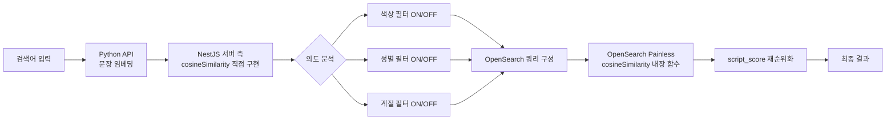

# Cosine Similarity 직접 구현으로 검색 재순위화

OpenSearch에는 Painless 스크립트에서 사용할 수 있는 내장 `cosineSimilarity()` 함수가 있다. 검색 쿼리의 `script_score`에서 문서 벡터와 쿼리 벡터 간 유사도를 계산하는 표준적인 방법이다. 그런데 왜 NestJS 서버 측에서 cosine similarity를 직접 구현해야 했을까?

이유는 간단하다. OpenSearch에 쿼리를 보내기 **전에** 검색어의 의도를 분석해야 했기 때문이다. "빨간 겨울 코트"라는 검색어가 들어오면, 이 검색어가 색상(빨간)과 계절(겨울)을 얼마나 강하게 의미하는지 판단하고, 그 결과에 따라 OpenSearch 쿼리의 필터와 boost를 동적으로 구성해야 한다. 이 판단 과정에서 검색어 벡터와 미리 정의된 속성 벡터(계절, 성별, 색상) 간 cosine similarity를 서버 측에서 직접 계산한다.

이 글에서는 TypeScript로 구현한 cosine similarity 함수, 이를 활용한 검색어 의도 분석 파이프라인, 토큰 수 기반 동적 임계값 전략, 그리고 OpenSearch Painless 스크립트와의 역할 분담까지 정리한다.

## 배경: 두 가지 cosine similarity가 필요한 이유

검색 파이프라인에서 cosine similarity는 두 가지 다른 시점에 사용된다.



**시점 1 (쿼리 전)**: NestJS 서버에서 검색어 벡터와 속성 벡터(계절/성별/색상)를 비교. "이 검색어가 어떤 속성을 의미하는가?" 판단. TypeScript 직접 구현.

**시점 2 (쿼리 중)**: OpenSearch 내부에서 쿼리 벡터와 각 문서의 벡터를 비교. "이 문서가 검색어와 얼마나 유사한가?" 점수 계산. Painless 내장 함수.

이 두 시점의 역할이 다르기 때문에, OpenSearch 내장 함수만으로는 부족했다.

## 핵심 구현: TypeScript cosine similarity

### 수학적 정의

cosine similarity는 두 벡터 간 각도의 코사인 값이다. 범위는 [-1, 1]이며, 1에 가까울수록 유사하다.

$$\text{cosine\_similarity}(A, B) = \frac{A \cdot B}{\|A\| \times \|B\|}$$

### TypeScript 구현

```typescript
// 커밋: refactor: enhance search utility functions
//        and add cosine similarity calculation
// 날짜: 2025-03-21

// qury.util.service.ts
public cosineSimilarity(vectorA: number[], vectorB: number[]): number {
  // 내적 (dot product)
  const dotProduct = vectorA.reduce(
    (sum, value, index) => sum + value * vectorB[index],
    0,
  );

  // 벡터 A의 크기 (magnitude)
  const magnitudeA = Math.sqrt(
    vectorA.reduce((sum, value) => sum + value * value, 0),
  );

  // 벡터 B의 크기 (magnitude)
  const magnitudeB = Math.sqrt(
    vectorB.reduce((sum, value) => sum + value * value, 0),
  );

  return dotProduct / (magnitudeA * magnitudeB);
}
```

768차원 벡터에 대해 이 함수의 실행 시간은 0.1ms 미만이다. `Array.reduce()`를 세 번 호출하므로 총 768 x 3 = 2,304번의 곱셈과 덧셈이 수행된다. 벡터 차원이 수천 이상이 아닌 이상 성능 이슈는 없다.

이 구현을 별도의 유틸리티 라이브러리를 쓰지 않고 직접 작성한 이유가 있다. numpy나 mathjs 같은 외부 라이브러리를 도입하면 NestJS의 빌드 사이즈와 cold start 시간이 증가한다. 768차원 벡터 2개의 유사도 계산은 순수 JavaScript로 충분하고, 의존성을 최소화하는 편이 낫다.

## 검색어 의도 분석 파이프라인

### 속성 벡터 사전 정의

검색어의 의도를 분석하려면 비교 대상이 필요하다. 계절, 성별, 색상 각각에 대해 사전 정의된 벡터를 `QueryUtilService`에서 관리한다.

```typescript
// qury.util.service.ts

// 계절 사전: 4개 항목
public season() {
  return {
    '봄': { color_vector: [...] },    // "봄" 텍스트의 768차원 임베딩
    '여름': { color_vector: [...] },
    '가을': { color_vector: [...] },
    '겨울': { color_vector: [...] },
  };
}

// 성별 사전: 3개 항목
public sex() {
  return {
    '여성': { sex_vector: [...] },
    '남성': { sex_vector: [...] },
    '공용': { sex_vector: [...] },
  };
}

// 색상 사전: N개 항목
public color() {
  return {
    '빨간색': { color_vector: [...] },
    '파란색': { color_vector: [...] },
    '검은색': { color_vector: [...] },
    // ... 커머스에서 사용하는 색상 목록
  };
}
```

이 벡터들은 KoSimCSE-roberta 모델로 미리 임베딩한 값이다. 서비스 시작 시 메모리에 로드되어, 매 검색 요청마다 재계산하지 않는다.

### findClosestMatch: 가장 유사한 속성 찾기

검색어 벡터와 각 속성 벡터를 비교하여 가장 유사한 항목을 찾는다.

```typescript
// search.util.service.ts
public findClosestMatch(
  data: Record<string, { [key: string]: number[] }>,
  vector: number[],
  vectorKey: string,
) {
  let closestMatch = '';
  let highestSimilarity = -1;

  for (const key in data) {
    if (data.hasOwnProperty(key)) {
      const similarity = this.queryUtilService.cosineSimilarity(
        vector,
        data[key][vectorKey],
      );
      if (similarity > highestSimilarity) {
        highestSimilarity = similarity;
        closestMatch = key;
      }
    }
  }

  return { closestMatch, highestSimilarity };
}
```

`findClosestMatchValue`는 동일한 로직이지만, 매칭된 항목의 이름 대신 **벡터 값 자체**를 반환한다. 색상의 경우 매칭된 색상명("빨간색")이 아니라 벡터 값이 필요한 경우가 있어 두 버전을 모두 구현했다.

### 검색 파이프라인에서의 활용

실제 검색 요청 처리 흐름에서 cosine similarity가 어떻게 사용되는지 보자.

```typescript
// search.util.service.ts — 검색 메인 로직
public async search(req, searchType, index) {
  // 1. 검색어 형태소 분석
  const result = await this.analyzeSearchWordHasVerb(search_word);
  const analyzeResult = result.analyzeResult;

  // 2. 검색어 벡터화 (Python API 호출)
  const seasonVector = search_word
    ? await this.searchWordVectorOnly(analyzeResult)
    : null;

  // 3. 서버 측 cosine similarity로 의도 분석
  if (seasonVector && search_word.length > 1) {
    const seasonMatch = this.findClosestMatch(
      this.queryUtilService.season(),
      seasonVector,
      'color_vector',
    );
    const sexMatch = this.findClosestMatch(
      this.queryUtilService.sex(),
      seasonVector,
      'sex_vector',
    );
    const colorMatch = this.findClosestMatchValue(
      this.queryUtilService.color(),
      seasonVector,
      'color_vector',
    );

    // 유사도 값과 매칭된 항목명 추출
    seasonKeyword = seasonMatch.closestMatch;      // "겨울"
    season_similarity = seasonMatch.highestSimilarity; // 0.72
    sexKeyword = sexMatch.closestMatch;             // "남성"
    sex_similarity = sexMatch.highestSimilarity;    // 0.45
    colorKeyword = colorMatch.closestMatch;         // "검은색"
    color_similarity = colorMatch.highestSimilarity; // 0.38
  }

  // 4. 임계값 기반 필터 결정
  const sex = sex_similarity > similaritySexThreshold
    ? sexKeyword : null;
  const season = season_similarity > 0.4
    ? seasonKeyword : null;
  const color = color_similarity > similarityThreshold
    ? colorKeyword : null;

  // 5. OpenSearch 쿼리 구성 (필터가 null이면 해당 조건 비활성화)
  const templateData = {
    sex,
    season,
    boost_sex: isVerb || !important_word ? 1000 : 3000,
    boost_season: isVerb || !important_word ? 1000 : 10000,
    boost_color: color_similarity > 0.5 ? 50000 : 1,
    color_script_score: {
      params: color_similarity > similarityThreshold
        ? colorMatch.closestVector : null,
    },
    // ...
  };
}
```

"남성 겨울 검정 코트"를 검색하면:
- `seasonVector` = "남성 겨울 검정 코트"의 768차원 임베딩
- 계절 매칭: "겨울"(유사도 0.72) > 임계값 0.4 -> 계절 필터 ON
- 성별 매칭: "남성"(유사도 0.65) > 임계값 0.35 -> 성별 필터 ON
- 색상 매칭: "검은색"(유사도 0.52) > 임계값 0.37 -> 색상 필터 ON

세 가지 필터가 모두 활성화되어 OpenSearch 쿼리에 계절/성별/색상 boost가 적용된다.

반면 "코트"만 검색하면:
- 계절 매칭: "겨울"(유사도 0.31) < 임계값 0.4 -> 계절 필터 OFF
- 성별 매칭: "공용"(유사도 0.28) < 임계값 0.4 -> 성별 필터 OFF
- 색상 매칭: (유사도 0.15) < 임계값 0.4 -> 색상 필터 OFF

속성 필터 없이 순수 키워드 + 벡터 검색만 수행된다.

## 토큰 수 기반 동적 임계값

### 왜 동적 임계값인가

고정 임계값(예: 0.4)을 사용하면 검색어 길이에 따라 결과가 불안정했다.

| 검색어 | 토큰 수 | "겨울" 유사도 | 고정 0.4 결과 |
|--------|---------|-------------|--------------|
| "겨울 코트" | 2 | 0.72 | 매칭 |
| "따뜻한 겨울 롱 코트" | 4 | 0.45 | 매칭 |
| "추운 날씨에 입기 좋은 코트" | 5 | 0.38 | **미매칭** |

세 번째 검색어는 분명히 겨울 코트를 의미하지만, 토큰이 많아지면서 벡터가 "겨울" 의미에서 분산되어 유사도가 0.38로 떨어졌다. 이런 검색어에 대해 계절 필터가 작동하지 않으면 사용자 경험이 나빠진다.

### 동적 임계값 테이블

```typescript
// 커밋: fix: 벡터 검색 token 개수에 따른 유사도 컷 설정
// 날짜: 2024-12-24

const thresholds = {
  1: { similarityThreshold: 0.4, similaritySexThreshold: 0.4 },
  2: { similarityThreshold: 0.37, similaritySexThreshold: 0.35 },
  3: { similarityThreshold: 0.35, similaritySexThreshold: 0.3 },
  4: { similarityThreshold: 0.33, similaritySexThreshold: 0.25 },
  default: { similarityThreshold: 0.3, similaritySexThreshold: 0.2 },
};

const wordCount = rawTokens
  .split(' ')
  .filter(word => word.trim() !== '').length;

const selectedThresholds = thresholds[wordCount] || thresholds.default;
```

토큰이 1개인 경우(예: "코트") 임계값 0.4로 엄격하게, 5개 이상인 경우(예: "추운 날씨에 입기 좋은 코트") 0.3으로 느슨하게 설정한다. `similaritySexThreshold`는 성별 전용 임계값으로, 성별 감지가 색상이나 계절보다 어렵기 때문에 전반적으로 더 낮은 값을 사용한다.

### 임계값 진화 과정

이 임계값은 여러 번 조정됐다.

```
# 커밋: fix: 벡터 검색 token 개수에 따른 유사도 컷 설정
# 날짜: 2024-12-24
# 내용: 최초 동적 임계값 도입 (1단어: 0.5, 5단어: 0.31)

# 커밋: fix: 성별 가중치
# 날짜: 2025-01-08
# 내용: 전체 임계값 상향 (성별 0.2 -> 0.3 등)

# 커밋: fix: reranker + redis (유사도 임계값 리팩토링)
# 날짜: 2025-01-24
# 내용: if-else를 thresholds 객체로 리팩토링, 전체 하향 조정

# 커밋: refactor: simplify sex similarity logic
# 날짜: 2025-04-29
# 내용: 성별 유사도에서 동사/핵심키워드 조건 제거, 순수 임계값만으로 판단
```

가장 마지막 리팩토링(2025-04-29)에서 성별 유사도 판단 로직을 대폭 간소화했다. 기존에는 `!(isVerb || !important_word)` 같은 복합 조건이 있었는데, 데이터 분석 결과 이 조건이 실제로 의미 있는 차이를 만들지 않는다는 것을 확인하고 제거했다. 단순히 `sex_similarity > similaritySexThreshold`만으로 충분했다.

## OpenSearch Painless 스크립트와의 역할 분담

서버 측 cosine similarity와 OpenSearch Painless 스크립트는 완전히 다른 역할을 수행한다.

### 서버 측 (검색 전): 의도 분석

```
검색어 "빨간 겨울 코트"
    ↓ Python API → seasonVector (768차원)
    ↓
cosineSimilarity(seasonVector, "겨울" 벡터) = 0.72  → 계절 필터 ON
cosineSimilarity(seasonVector, "빨간색" 벡터) = 0.58 → 색상 필터 ON
cosineSimilarity(seasonVector, "남성" 벡터) = 0.22  → 성별 필터 OFF
    ↓
OpenSearch 쿼리에 season="겨울", color=빨간색 벡터 포함
```

비교 횟수: 계절(4) + 성별(3) + 색상(N) = 약 10~30회. 768차원 벡터 간 비교이므로 전체 0.01ms 이내.

### OpenSearch 측 (검색 중): 문서별 재순위화

```
OpenSearch 인덱스의 모든 매칭 문서 (수천~수만 개)
    ↓
각 문서에 대해:
  cosineSimilarity(queryVector, doc['product_vector']) * 30.0
  + cosineSimilarity(queryVector, doc['main_feature_vector']) * 0.5
  + cosineSimilarity(queryVector, doc['cate_vector']) * 0.5
    ↓
가중 합산 점수로 정렬
```

비교 횟수: 매칭 문서 수 x 4개 벡터 = 수만~수십만 회. 이 규모의 벡터 연산은 OpenSearch의 최적화된 C++ 기반 엔진에서 수행하는 것이 합리적이다.

### 다양한 Painless 스크립트 패턴

OpenSearch에서 cosine similarity를 사용하는 패턴도 용도별로 여러 가지다.

**기본 script_score**: 4개 벡터 가중 합산

```painless
double productScore = cosineSimilarity(
  params.sentence_vector, doc['product_vector']
);
return (productScore + 1.0) * 30.0;
```

**nested 색상 배열 순회**: 상품의 여러 색상 중 최대 유사도 추출

```painless
double maxColorSimilarity = 0.0;
for (int i = 0; i < doc['colorText.color_vector'].length; i++) {
  double sim = cosineSimilarity(
    params.product_vector,
    doc['colorText.color_vector'][i]
  );
  if (sim > maxColorSimilarity) {
    maxColorSimilarity = sim;
  }
}
return (maxColorSimilarity * 20.0) + (productSimilarity * 5.0);
```

**임계값 기반 필터링**: 성별 매칭 0.8 이상만 점수 반영

```painless
double cosineSim = cosineSimilarity(
  params.sexVector, doc['sub_feature_vector']
);
if (cosineSim >= 0.8) {
  return (cosineSim + 1.0) / 2.0;
}
return 0;
```

**색상 KNN 임계값**: 유사도 1.6(정규화 후) 이상만 점수 반영

```painless
return (cosineSimilarity(
  params.product_vector, doc['colorText.color_vector']
) + 1.0) > 1.6
  ? (cosineSimilarity(...) + 1.0) * 60
  : 0;
```

각 패턴마다 임계값과 가중치가 다른 이유는, 벡터 필드마다 의미와 분포가 다르기 때문이다. `product_vector`는 상품 전체 특성을 담고 있어 유사도 분포가 넓은 반면, `sub_feature_vector`(성별)는 특정 속성만 담고 있어 매칭 시 유사도가 높게 나온다. 따라서 성별에는 0.8이라는 높은 임계값을, 색상에는 0.6(정규화 후 1.6)이라는 중간 임계값을 적용한다.

## 트러블슈팅

### 벡터 정규화 이슈

cosine similarity의 범위는 [-1, 1]이다. 하지만 OpenSearch의 `script_score`는 음수 점수를 허용하지 않는다(`min_score` 기본값 0). 따라서 Painless 스크립트에서는 항상 `+1.0`을 더해 [0, 2] 범위로 정규화한다.

```painless
return (productScore + 1.0) * 30.0;
// productScore = -1 → 0
// productScore = 0  → 30
// productScore = 1  → 60
```

서버 측 TypeScript 구현에서는 이 정규화가 필요 없다. 유사도 값 자체를 임계값과 비교하므로 [-1, 1] 범위 그대로 사용한다.

### 속성 벡터 품질

계절/성별/색상 벡터의 품질이 의도 분석 정확도를 결정한다. 초기에는 단순히 "봄", "여름" 같은 한 글자 단어로 벡터를 생성했는데, 임베딩 모델이 짧은 단어에 대해 불안정한 벡터를 만드는 경향이 있었다. "봄 시즌", "여름 계절" 같은 설명적 표현으로 변경하면 유사도 분포가 더 안정적이 될 수 있지만, 현재는 단일 단어로 충분한 성능을 보이고 있어 유지하고 있다.

### 리팩토링: 4000줄 단일 파일 분리

```
# 커밋: refactor: reorganize search utilities and update configurations
# 날짜: 2025-03-18
```

cosine similarity 구현을 포함한 유틸리티 함수들이 원래 `search.service.ts` 하나에 4000줄 이상 들어있었다. 2025년 3월 리팩토링에서 기능별로 분리했다.

| 파일 | 역할 |
|------|------|
| `SearchUtilService` | 검색 메인 로직, 파이프라인 조율 |
| `QueryUtilService` | 쿼리 빌드, cosineSimilarity, 속성 사전 |
| `ColorUtilService` | 색상 관련 로직 |
| `MecabUtilService` | Mecab 형태소 분석 |
| `TokenizerUtilService` | Nori 토크나이저, stoptags, 사용자 사전 |

`cosineSimilarity` 함수가 `QueryUtilService`에 배치된 것은, 이 함수가 쿼리 구성 단계에서 사용되기 때문이다. 검색 결과 후처리가 아니라 쿼리 생성 전 단계의 의도 분석에 쓰이므로 쿼리 유틸리티에 속한다.

## 비교 대상 벡터 정리

검색 파이프라인에서 cosine similarity로 비교하는 모든 벡터 필드를 정리한다.

| 벡터 필드 | 차원 | 저장 위치 | 비교 시점 | 용도 |
|-----------|------|----------|----------|------|
| `season().color_vector` | 768 | NestJS 메모리 | 쿼리 전 (서버 측) | 계절 의도 감지 |
| `sex().sex_vector` | 768 | NestJS 메모리 | 쿼리 전 (서버 측) | 성별 의도 감지 |
| `color().color_vector` | 768 | NestJS 메모리 | 쿼리 전 (서버 측) | 색상 의도 감지 |
| `product_vector` | 768 | OpenSearch 인덱스 | 쿼리 중 (Painless) | 상품 유사도 |
| `main_feature_vector` | 768 | OpenSearch 인덱스 | 쿼리 중 (Painless) | 대표 특징 유사도 |
| `cate_vector` | 768 | OpenSearch 인덱스 | 쿼리 중 (Painless) | 카테고리 유사도 |
| `sub_feature_vector` | 768 | OpenSearch 인덱스 | 쿼리 중 (Painless) | 성별 매칭 |
| `colorText.color_vector` | 768 | OpenSearch nested | 쿼리 중 (Painless) | 색상 KNN |
| `imgVec` | 768 | OpenSearch 인덱스 | 쿼리 중 (Painless) | 이미지 유사도 |

## 결과 및 회고

cosine similarity를 서버 측과 OpenSearch 측 양쪽에서 활용하는 아키텍처를 통해 배운 것들을 정리한다.

**역할 분리가 핵심이다**: 서버 측 cosine similarity는 "쿼리를 어떻게 구성할 것인가"를 결정하고, OpenSearch 측은 "문서를 어떤 순서로 보여줄 것인가"를 결정한다. 같은 수학적 연산이지만 용도가 완전히 다르다.

**직접 구현의 장점**: 768차원 벡터 2개의 cosine similarity 계산은 JavaScript로 0.1ms 미만이다. 외부 라이브러리 의존 없이 20줄 코드로 구현 가능하며, 빌드 사이즈나 cold start에 영향이 없다.

**동적 임계값은 필수다**: 검색어 길이에 따라 벡터 유사도 분포가 달라진다. 고정 임계값은 짧은 검색어에 너무 느슨하거나 긴 검색어에 너무 엄격하다. 토큰 수 기반 동적 임계값이 다양한 검색 패턴에 대해 안정적인 의도 분석을 가능하게 한다.

**Painless 스크립트의 다양한 패턴**: 단순 가중 합산, 배열 순회 최대값 추출, 임계값 기반 필터링 등 용도별로 다른 패턴이 필요하다. 벡터 필드마다 의미와 분포가 다르므로, 하나의 패턴으로 통일하는 것은 비효율적이다.

검색 엔진에서 cosine similarity는 단순한 수학 공식이 아니라, 검색어 의도 분석부터 문서 재순위화까지 검색 파이프라인 전반을 관통하는 핵심 도구다. 이 구현 경험은 이후 Rust 검색 엔진(search-rust)의 벡터 검색 설계에서도 직접적으로 활용됐다.
