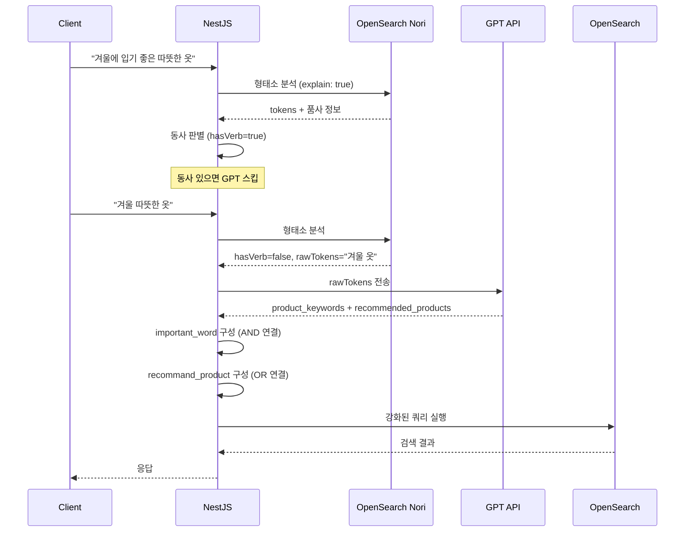

# GPT를 활용한 검색 쿼리 의도 분석 및 키워드 추출

"청소할때 쓰는 도구"를 검색창에 입력한 사용자가 원하는 건 뭘까? 아마도 빗자루, 청소기, 먼지털이 같은 상품들일 것이다. 하지만 기존 키워드 검색 엔진은 "청소할때 쓰는 도구"라는 문장에서 의미 있는 상품명을 뽑아내지 못한다.

2024년 11월, x2bee-nest-search에 GPT 기반 검색어 의도 분석 기능을 도입했다. 형태소 분석으로 동사/명사를 구분하고, GPT로 핵심 키워드와 추천 상품을 추출해 검색 쿼리를 강화하는 파이프라인이다. 이 구현의 배경과 시행착오를 정리한다.

## 문제 정의: 자연어 검색어의 처리

이커머스 검색에서 자연어 형태의 검색어가 생각보다 많이 들어온다.

- "겨울에 입기 좋은 따뜻한 옷"
- "남자친구 생일 선물로 줄 만한 것"
- "캠핑 갈때 필요한 장비"
- "청소할때 쓰는 도구"

이런 쿼리를 단순 키워드 매칭으로 처리하면 "겨울", "입", "좋", "따뜻", "옷"이 모두 별개 검색어가 되어버린다. 결과는 형편없다. 사용자가 원하는 "패딩", "코트", "니트" 같은 상품이 아니라 전혀 관련 없는 상품이 올라오거나 0개 결과가 나온다.

시맨틱 검색(kNN)으로 의미를 잡을 수 있지만, 상품 수십만 개의 벡터 중에서 정확한 카테고리를 찾으려면 임베딩 품질이 매우 높아야 한다. GPT는 이 갭을 채우는 역할을 했다.

## 아키텍처: 형태소 분석 → GPT → 검색 강화



핵심 분기 조건은 **동사 유무**다. "입기 좋은"처럼 동사가 포함된 자연어 문장에서는 GPT를 호출하지 않는다. "겨울 따뜻한 옷"처럼 명사 위주인 경우에만 GPT를 태운다.

## GPT 프롬프트 설계

별도 Python FastAPI 서비스(`search-python`)에서 GPT 호출을 담당한다. 엔드포인트는 `/api/ai/v1/product_summary`이고, 실제 GPT 프롬프트는 아래와 같다.

```python
PROMPT = """
다음 문장형 검색어에서 제품의 핵심 키워드를 추출하여 반환하세요.
불필요한 접미사나 수식어는 제거하고 핵심 의미만 남겨서 반환합니다.
계절성을 의미하는 형용사는 유지합니다. (추울때 더울때 따뜻할때 시원할때 등등)

**조건:**
1. "복", "용", "품" 등의 불필요한 접미사는 제거하여 핵심 의미만 반환합니다.
   예를 들어, "겨울복"은 "겨울", "등산복"은 "등산"으로 반환합니다.
2. 가장 중요 키워드를 'category_keyword'로 반환합니다.
3. 설명적인 문구는 포함하지 않습니다.
4. 연관된 추가 검색어를 'search_word'로 반환합니다.
5. 필요한 경우 색상과 제품명을 결합하여 반환합니다.
6. 통용되지 않는 표현은 통용되는 명사로 변경합니다.
7. 'category_keyword'는 하나의 핵심 단어로 제한하고,
   'search_word'는 최대 3개의 동의어 단어를 반환합니다.
8. 관련 추천 상품들을 'recommand_product'로 최소 5개를 추가하여 반환합니다.

[출력 예시]
청소할때 쓰는 도구 -> {
  "category_keyword": "청소",
  "search_word": ["빗자루", "먼지털이", "대걸레"],
  "recommand_product": ["청소기", "물걸레 청소기", "진공 청소기", "로봇 청소기", "먼지 제거 스프레이"]
}
겨울철 입는 산행복 -> {
  "category_keyword": "등산",
  "search_word": ["겨울", "의류", "아웃도어", "등산"],
  "recommand_product": ["등산 재킷", "산행 바지", "등산 모자", "등산 신발", "겨울 등산 장갑"]
}
"""
```

GPT에게 세 가지를 요구한다.

1. **category_keyword**: 가장 핵심 키워드 1개 ("청소할때 쓰는 도구" → "청소")
2. **search_word**: 관련 동의어 최대 3개 (빗자루, 먼지털이, 대걸레)
3. **recommand_product**: 추천 상품 최소 5개 (청소기, 물걸레 청소기 등)

이 세 가지를 OpenSearch 쿼리에서 서로 다른 역할로 사용한다.

## NestJS에서의 GPT 호출과 파싱

NestJS 쪽에서는 Python 서비스를 axios로 호출한다.

```typescript
type GptSearchResponse = {
  product_keywords: string[];
  recommended_products: string[];
};

public async gptSearchWord(searchWord: string): Promise<GptSearchResponse | null> {
  try {
    const response = await axios.post<GptSearchResponse>(
      'https://search-python.x2bee.com/api/ai/v1/product_summary',
      { text: searchWord },
      {
        headers: { 'Content-Type': 'application/json' },
        timeout: 10000, // 10초 타임아웃
      },
    );

    // GPT 응답의 recommended_products를 형태소 분석 버전으로 교체
    if (response.data?.recommended_products?.length) {
      for (const [index, product] of response.data.recommended_products.entries()) {
        const analyzedProduct = await this.analyzeSearch(product);
        response.data.recommended_products[index] = analyzedProduct.analyzeResult;
      }
    }

    return response.data;
  } catch (error) {
    console.error('API Error:', {
      status: error.response?.status || 'No status',
      message: error.message,
      searchWord,
    });
    return null;
  }
}
```

GPT 응답을 받은 뒤 `recommended_products` 각각을 다시 Nori로 형태소 분석한다. GPT가 "물걸레 청소기"를 반환하면 "물걸레 청소기" 그대로 쓰는 것보다 "물걸레"와 "청소기"로 분리한 버전이 OpenSearch 검색에서 더 잘 매칭되기 때문이다.

## GPT 결과를 쿼리로 변환

GPT 결과를 검색 쿼리에 두 가지 방식으로 녹인다.

### 1. important_word: AND 연결 핵심 키워드

```typescript
let product_keywords = gpt_search_word.product_keywords || null;

important_word =
  product_keywords && product_keywords.length > 0
    ? `(${product_keywords.filter(word => word).join(' AND ')})`
    : null;
```

"겨울 패딩"에서 GPT가 `["겨울", "패딩"]`을 반환하면 `important_word = "(겨울 AND 패딩)"`이 된다. 이것이 OpenSearch `query_string`의 부스트 8,000짜리 쿼리가 된다.

### 2. recommand_product: OR 연결 추천 상품

```typescript
recommand_product = gpt_search_word.recommended_products.map(
  item =>
    '((' +
    item
      .split(' ')
      .filter(word => word.trim())
      .join(' AND ') +
    '))',
);

recommand_product_text = recommand_product.join(' OR ');
```

"청소기", "물걸레 청소기", "진공 청소기"가 있으면:
- `((청소기))`
- `((물걸레 AND 청소기))`
- `((진공 AND 청소기))`

이것들을 OR로 연결: `((청소기)) OR ((물걸레 AND 청소기)) OR ((진공 AND 청소기))`

각 추천 상품은 공백으로 분리된 단어를 AND로 묶는다. "물걸레 청소기"는 "물걸레"와 "청소기"가 모두 포함된 상품을 찾는 것이다.

Handlebars 쿼리 템플릿에서:

```handlebars
{{#if important_keyword}}
{
  "query_string": {
    "query": "{{important_keyword}}",
    "fields": ["goodsNmAnaly", "goodsNm"],
    "boost": 8000
  }
}
{{/if}}
{{#if recommand_product}},{{/if}}
{{#if recommand_product}}
{
  "query_string": {
    "query": "{{recommand_product}}",
    "fields": ["goodsNmAnaly", "goodsNm"],
    "boost": 5000,
    "default_operator": "AND"
  }
}
{{/if}}
```

`important_keyword`는 부스트 8,000으로 가장 높다. "청소"라는 핵심 키워드가 포함된 상품은 거의 무조건 상위에 오게 된다. `recommand_product`는 5,000으로 그 다음 — "청소기", "물걸레 청소기" 같은 구체적 상품이 올라온다.

## 동사 판별이 GPT 호출의 게이트키퍼

GPT를 모든 검색어에 적용하면 응답 시간이 크게 늘어난다. "반팔 티셔츠"같은 명사형 검색어에도 GPT를 쓸 필요는 없다. 동사 판별이 이 문제를 해결한다.

```typescript
const result = await this.analyzeSearchWordHasVerb(search_word);
const isVerb = result.hasVerb;

// 동사가 있으면 GPT 스킵
if (search_word && !special) {
  try {
    gpt_search_word = await this.gptSearchWord(result.rawTokens);
    // rawTokens는 형태소 분리된 버전 ("겨울 따뜻 옷" 형태)
  } catch (error) {
    // GPT 실패해도 기본 검색 계속 진행
  }
}
```

실제로 `!special` 조건도 있다. 특수 목적 검색(카테고리 직접 지정 등)에서는 GPT를 비활성화한다.

동사 판별 로직은 Nori 분석기의 `explain: true` 모드에서 각 토큰의 품사 태그를 확인한다.

```typescript
const verbPOS = ['VV', 'VA', 'VX', 'VCN', 'VCP', 'XSV', 'XSA'];

const verbPositions = tokens.reduce((positions, token, index) => {
  if (verbPOS.some(pos =>
    token.leftPOS?.startsWith(pos) || token.rightPOS?.startsWith(pos)
  )) {
    positions.push(index);
  }
  return positions;
}, []);

const hasVerb = verbPositions.length > 0;
```

"예쁜 원피스 추천해줘"에서 Nori가 분석한 결과:
- 예쁘/VA (형용사)
- 원피스/NNG (일반명사)
- 추천/NNG (일반명사)
- 하/XSV (동사파생접미사)
- 아/EC

`VA`와 `XSV`가 감지되면 `hasVerb = true`, GPT 호출을 건너뛴다.

## 동사 판별 후 검색 전략 변화

동사 감지 여부에 따라 쿼리 구성 자체가 달라진다.

```typescript
// OR 쿼리 활성화: 자연어가 아니고 GPT 결과가 있을 때만
orQuery: isVerb || !important_word ? null : combineQuery?.orQuery,

// 성별/계절 부스트 강화: 동사 없고 GPT 있을 때
boost_sex: isVerb || !important_word ? 1000 : 3000,
boost_season: isVerb || !important_word ? 1000 : 10000,
```

자연어(동사 포함) 검색어는 GPT 없이 기본 AND/OR 키워드 검색으로 처리한다. 부스트도 낮게 유지해서 필터 효과를 줄인다.

반면 명사형 검색어 + GPT 결과가 있으면 OR 쿼리와 성별/계절 부스트를 최대로 활성화한다. "겨울 코트"에서 GPT가 ["겨울", "코트", "롱코트", "오버코트"]를 반환하면, 이 모든 단어를 OR로 묶어서 더 넓은 범위의 상품을 찾고 그 중에서 관련도 점수로 정렬한다.

## 시행착오

### GPT 응답 파싱 오류

초기에는 GPT 응답을 직접 JSON으로 파싱했는데, GPT가 JSON 형식을 항상 완벽하게 지키지 않았다. 마크다운 코드 블록 안에 JSON을 넣거나, 쉼표를 빠뜨리거나, 잘못된 따옴표를 쓰는 경우가 있었다.

```
# 커밋: fix: gpt response 변경
# 날짜: 2024-12-19 09:21
# 커밋: fix: gpt response 변경
# 날짜: 2024-12-19 08:43
```

정규식 기반 파싱으로 변경했다. JSON.parse 대신 패턴으로 각 필드를 개별 추출한다.

```python
category_keyword_match = re.search(
  r'"category_keyword":\s*"([^"]+)"', generated_text
)
search_word_match = re.search(
  r'"search_word":\s*\[([^\]]+)\]', generated_text
)
recommand_product_match = re.search(
  r'"recommand_product":\s*\[([^\]]+)\]', generated_text
)
```

GPT 응답 형식이 약간 달라도 원하는 값을 추출할 수 있게 됐다.

### GPT 실패 시 검색 중단 문제

GPT API 장애나 타임아웃이 발생했을 때 검색 전체가 에러를 반환하는 문제가 있었다.

```
# 커밋: fix: gpt 에러시 동작
# 날짜: 2024-12-12 09:07
# 커밋: fix: gpt 에러시 동작
# 날짜: 2024-12-12 10:11
```

try-catch로 GPT 호출을 감싸고, 실패 시 `null`을 반환하도록 했다.

```typescript
try {
  gpt_search_word = await this.gptSearchWord(result.rawTokens);
} catch (error) {
  console.error('GPT 처리 중 에러 발생:', error);
  // gpt_search_word = null 유지
}
```

쿼리 생성 시 `important_word`와 `recommand_product_text`가 null이면 해당 Handlebars 블록이 비활성화된다. GPT 없이 기본 키워드 검색만으로 동작하는 폴백이 자동으로 이뤄진다.

### 동사 판별 후 카테고리 분류 제거

GPT를 사용하는 경우(자연어 검색) 카테고리 모델도 함께 호출하는데, 실제로는 이 두 결과가 충돌하는 케이스가 있었다.

```typescript
// 동사 없을 때만 카테고리 모델 호출
if (!isVerb) {
  const categories = await this.fetchModelCategories(analyzeResult);
  smallCategories = categories.map(({ id, score }) => ({
    id,
    score: score * 10000,
  }));
}
```

"청소할때 쓰는 도구"에서 카테고리 모델이 "생활용품"을 예측해서 부스트를 주면, GPT가 "청소기"라는 키워드를 추출해도 카테고리 필터 때문에 검색 결과가 왜곡될 수 있다. 자연어 검색에서는 카테고리 모델을 비활성화했다.

### 단어별 공백 프롬프트 수정

```
# 커밋: fix: gpt 단어별로 띄워쓰기 prompt 수정
# 날짜: 2024-12-19 14:39
# 커밋: fix: gpt 단어별로 띄워쓰기 prompt 수정
# 날짜: 2024-12-20 14:25
```

GPT에 형태소 분리된 검색어(`rawTokens`)를 보낼 때, 원문 그대로 보내는 것보다 단어 단위로 분리된 버전을 보내는 게 더 일관된 응답을 만들었다. "겨울에입기좋은코트"(원문) 대신 "겨울 입기 좋 코트"(형태소 분리)를 보내면 GPT가 더 명확하게 의도를 파악한다.

## 비용과 성능 고려

GPT 호출은 비용이 발생한다. 모든 검색 요청에 GPT를 붙이면 트래픽이 많을 때 API 비용이 크게 늘어난다.

실제 운영에서 적용한 최적화:

**동사 판별 필터링**: 동사가 포함된 자연어 검색어는 GPT를 건너뛴다. 전체 검색 요청의 약 30~40%가 여기서 걸러진다.

**`special` 파라미터**: 특수 목적 검색에서 GPT를 아예 비활성화한다.

**10초 타임아웃**: GPT가 응답하지 않으면 10초 후 포기하고 기본 검색으로 폴백한다.

GPT 호출이 추가된 이후 복잡한 자연어 검색에서의 품질이 확연히 개선됐다. "남자친구 생일 선물"을 검색했을 때 GPT가 ["선물세트", "지갑", "벨트", "향수"]를 추천해 검색 결과에 관련 상품이 실제로 올라오는 것을 확인할 수 있었다.
