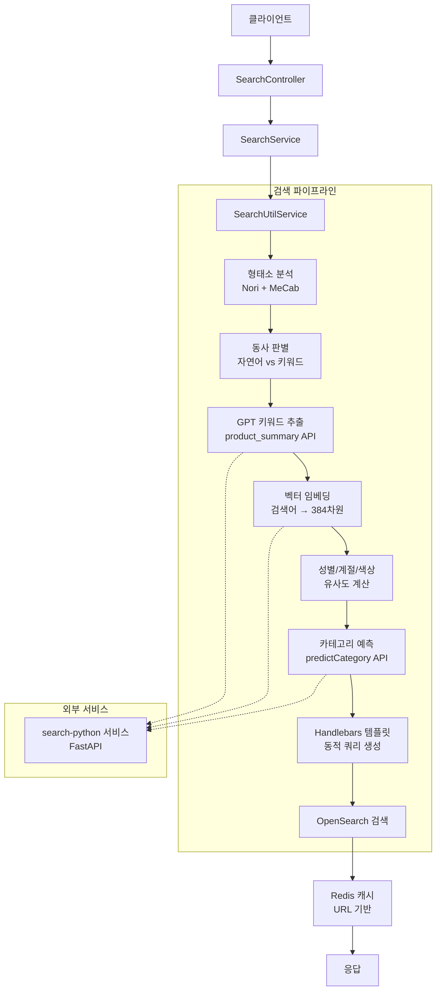

# NestJS 기반 이커머스 검색 엔진 개발기

2024년 7월, 기존 레거시 검색 시스템을 전면 교체하는 프로젝트가 시작됐다. 대상은 이커머스 플랫폼의 상품 검색 — 하루 수십만 건의 검색 요청을 처리하면서도 정확하고 빠른 결과를 돌려줘야 하는 시스템이다. 기술 스택으로 NestJS + OpenSearch를 선택했고, 형태소 분석부터 벡터 검색, 동의어 처리, Redis 캐싱까지 복합적인 기능을 단일 서비스로 구현했다.

프로젝트 이름은 `x2bee-nest-search`. 약 14개월에 걸쳐 318회의 커밋이 쌓인 이 서비스의 핵심 아키텍처와 구현 과정을 정리한다.

## 배경: 레거시 검색의 한계

기존 검색 시스템은 단순 키워드 매칭 기반이었다. "반팔 원피스"를 검색하면 "반팔"과 "원피스"가 동시에 포함된 상품만 올라오는 구조였다. 이 방식의 문제는 명확했다.

- "여름 원피스"처럼 계절어가 섞이면 관련 없는 상품이 상위에 오를 수 있다
- "예쁜 가방"처럼 자연어 형태의 검색어는 의미 있는 결과를 만들지 못한다
- 사용자의 성별이나 최근 검색 패턴이 결과에 반영되지 않는다

새 시스템에는 세 가지 핵심 목표를 설정했다. 첫째, 키워드 검색과 의미(시맨틱) 검색을 동시에 지원할 것. 둘째, 성별, 색상, 계절, 카테고리 같은 의미적 필터를 벡터 유사도 기반으로 자동 감지할 것. 셋째, GPT를 통해 복잡한 자연어 검색어를 구조화된 키워드로 변환할 것.

## 전체 아키텍처



검색 요청 하나가 들어오면 최소 5개의 처리 단계를 거친다. 각 단계가 직렬로 실행되기 때문에 성능이 문제가 될 수 있었고, 이 부분에서 꽤 많은 트러블슈팅이 있었다.

## 프로젝트 구조

```
src/
├── modules/
│   ├── search/          # 검색 메인 모듈
│   ├── indexing/        # 색인 모듈
│   └── mecab/           # 형태소 분석 모듈
├── utils/
│   └── search/
│       ├── search.util.service.ts     # 검색 실행 핵심 로직
│       ├── qury.util.service.ts       # Handlebars 쿼리 템플릿
│       ├── tokenizer.util.service.ts  # OpenSearch Nori 토크나이저
│       └── mecab.util.service.ts      # MeCab 형태소 분석기
├── dto/                 # 요청/응답 DTO
├── entity/              # TypeORM 엔티티
└── config/              # 설정, 미들웨어, AOP
```

핵심 의존성:

```json
{
  "@nestjs/common": "^10.4.3",
  "nestjs-opensearch": "^0.4.0",
  "@opensearch-project/opensearch": "^2.12.0",
  "handlebars": "^4.7.8",
  "mecab-ya": "^0.1.1",
  "ioredis": "^5.4.1",
  "mybatis-mapper": "^0.8.0"
}
```

NestJS 생태계에 OpenSearch 공식 클라이언트를 `nestjs-opensearch` 래퍼로 감쌌다. 쿼리는 Handlebars 템플릿으로 동적 생성하며, 형태소 분석은 OpenSearch Nori 분석기와 로컬 MeCab을 병행 사용한다.

## 검색 파이프라인 상세

### 1. 검색어 정제

```typescript
let search_word = decodeURIComponent(req.searchWord)
  .replace(/[!@#$%^&*(),.?":{}|<>[\]\\/~`'_+=-]/g, '')
  .trim();
```

특수문자를 제거하고 URL 디코딩을 수행한다. 이후 언어 코드(`langCd`)에 따라 검색 인덱스를 동적으로 선택한다.

```typescript
searchType =
  searchType == 'ai' || searchType == 'marketing' || searchType == 'semantic'
    ? `${searchType}-${req.langCd}`
    : searchType;
```

한국어(`ko`), 영어(`en`), 중국어(`cn`) 등 다국어 인덱스를 분리 운영한다.

### 2. 형태소 분석 + 동사 판별

검색어가 "자연어(동사 포함)"인지 "키워드(명사 위주)"인지에 따라 이후 처리 방식이 달라진다. OpenSearch Nori 분석기로 형태소를 분리한 뒤, 각 토큰의 품사를 확인한다.

```typescript
public async analyzeSearchWordHasVerb(
  searchWord: string,
): Promise<{ hasVerb: boolean; analyzeResult: string; rawTokens: string }> {
  const response = await this.opensearchClient.indices.analyze({
    body: {
      explain: true,
      tokenizer: {
        type: 'nori_tokenizer',
        decompound_mode: 'none',
        user_dictionary_rules: this.tokenizerUtilService.getUserDictionary(),
      },
      filter: [
        {
          type: 'nori_part_of_speech',
          stoptags: this.tokenizerUtilService.getStoptags(),
        },
      ],
      text: [searchWord],
    },
  });

  const tokens = response.body.detail.tokenizer.tokens;
  const verbPOS = ['VV', 'VA', 'VX', 'VCN', 'VCP', 'XSV', 'XSA'];
  const nounPOS = ['NNG', 'NNP', 'NNB', 'NNBC'];

  // 동사 관련 위치 탐지
  const verbPositions = tokens.reduce((positions, token, index) => {
    if (verbPOS.some(pos => token.leftPOS?.startsWith(pos) || token.rightPOS?.startsWith(pos))) {
      positions.push(index);
    }
    return positions;
  }, []);

  const hasVerb = verbPositions.length > 0;

  let analyzeResult;
  if (hasVerb) {
    // 동사 제거, 명사만 추출
    const nounTokens = tokens.filter((token, index) => {
      const isNoun = nounPOS.some(
        pos => token.leftPOS?.startsWith(pos) || token.rightPOS?.startsWith(pos),
      );
      return isNoun && !verbPositions.includes(index);
    });
    analyzeResult = nounTokens.map(token => token.token).join(' ');
  } else {
    analyzeResult = tokens.map(token => token.token).join(' ');
  }

  return { hasVerb, analyzeResult, rawTokens };
}
```

예를 들어 "예쁜 원피스 추천해줘"를 입력하면 Nori가 `예쁘/VA`, `원피스/NNG`, `추천/NNG`, `해주/VX`, `어/EC`로 분해한다. 동사(`VA`, `VX`)가 감지되면 `hasVerb = true`가 되고, 명사인 "원피스 추천"만 검색어로 사용한다.

`hasVerb`가 `true`이면 GPT 처리를 생략하고 단순 키워드 검색을 실행한다. 이는 성능 최적화를 위한 중요한 분기점이다.

### 3. Redis 캐싱 (URL 기반)

검색 API의 URL 전체를 캐시 키로 사용한다.

```typescript
const exists = await redisClient.exists('search:' + url);
if (exists) {
  const cachedData = await redisClient.get('search:' + url);
  const parsedData = JSON.parse(cachedData);
  return ResponseDto.builder()
    .message('success (from cache)')
    .payload({ searchDataList: parsedData })
    .build();
}
```

동일한 검색 요청이 반복될 때 OpenSearch와 Python 서비스 호출을 모두 스킵한다. 상품 목록 페이지에서 동일 검색어를 여러 사용자가 동시에 요청하는 상황에서 효과가 컸다.

### 4. 벡터 임베딩 및 의미 매칭

검색어를 벡터화한 뒤, 미리 준비된 성별/계절/색상 벡터 데이터와 코사인 유사도를 계산한다.

```typescript
const seasonVector = search_word
  ? await this.searchWordVectorOnly(analyzeResult)
  : null;

if (seasonVector && search_word.length > 1) {
  const seasonMatch = this.findClosestMatch(seasonData, seasonVector, 'color_vector');
  const sexMatch = this.findClosestMatch(sexData, seasonVector, 'sex_vector');
  const colorMatch = this.findClosestMatchValue(colorData, seasonVector, 'color_vector');

  ({ closestMatch: seasonKeyword, highestSimilarity: season_similarity } = seasonMatch);
  ({ closestMatch: sexKeyword, highestSimilarity: sex_similarity } = sexMatch);
  ({ closestMatch: colorKeyword, highestSimilarity: color_similarity } = colorMatch);
}
```

코사인 유사도는 TypeScript로 직접 구현했다.

```typescript
public cosineSimilarity(vectorA: number[], vectorB: number[]): number {
  const dotProduct = vectorA.reduce((sum, value, index) => sum + value * vectorB[index], 0);
  const magnitudeA = Math.sqrt(vectorA.reduce((sum, value) => sum + value * value, 0));
  const magnitudeB = Math.sqrt(vectorB.reduce((sum, value) => sum + value * value, 0));
  return dotProduct / (magnitudeA * magnitudeB);
}
```

"빨간 원피스"를 검색하면 색상 벡터("빨간/빨강/레드")와의 유사도가 높게 나온다. 이 값이 임계값을 넘으면 OpenSearch 쿼리에 색상 필터를 자동으로 추가한다.

### 5. Handlebars 템플릿으로 동적 쿼리 생성

검색 조건이 복잡해질수록 쿼리를 코드로 하드코딩하면 유지보수가 불가능해진다. 이 문제를 Handlebars 템플릿으로 해결했다.

```typescript
const templateData = {
  size,
  from,
  type: searchType,
  andQuery: combineQuery.andQuery,
  orQuery: isVerb || !important_word ? null : combineQuery?.orQuery,
  season: season_similarity > 0.4 ? seasonKeyword : null,
  sex: sex_similarity > similaritySexThreshold ? sexKeyword : null,
  color_script_score: {
    params: color_similarity > similarityThreshold ? colorKeyword : null,
  },
  important_keyword: important_word,
  boost_sex: isVerb || !important_word ? 1000 : 3000,
  boost_season: isVerb || !important_word ? 1000 : 10000,
  boost_color: color_similarity > 0.5 ? 50000 : 1,
};

const renderedTemplate = this.queryUtilService.opensearch_searchQueryTemplate(templateData);
const searchParams = JSON.parse(renderedTemplate);
this.data = await this.opensearchClient.search(searchParams);
```

성별이 감지된 경우, 템플릿은 성별 관련 쿼리 블록을 활성화하고 부스트 점수를 3,000으로 설정한다. 감지되지 않으면 해당 블록은 아예 쿼리에 포함되지 않는다. 조건별로 if/else를 수십 개 작성하는 것보다 훨씬 깔끔하고 테스트하기도 쉽다.

## 검색 인덱스 설계

상품 인덱스에는 텍스트 필드와 벡터 필드가 함께 존재한다.

```typescript
public opensearchGoodsFieldInfo = [
  { field: 'goodsNm', isNested: false },        // 상품명 (키워드 검색)
  { field: 'goodsNmAnaly', isNested: false },   // 상품명 형태소 분석 버전
  { field: 'schKwdNm', isNested: false },       // 검색 키워드
  { field: 'brandNm', isNested: false },        // 브랜드명
  { field: 'goodsDtlDesc', isNested: false },   // 상품 상세설명
  { field: 'dispCtgNo.ctgFullPathNm', isNested: true }, // 카테고리 경로
];
```

같은 텍스트를 두 가지 형태로 저장한다. `goodsNm`은 원문 그대로, `goodsNmAnaly`는 Nori 분석기로 형태소 분리된 버전이다. 검색 시 두 필드를 동시에 조회해 정확도를 높인다.

벡터 필드는 별도 Nested 구조로 관리한다.

```
product_vector      # 상품명 + 설명 임베딩 (384차원)
color_vector        # 색상 임베딩
main_feature_vector # 주요 특성 임베딩
cate_vector         # 카테고리 임베딩
colorText (Nested)  # 색상별 이미지 URL + 색상 벡터
```

## 신조어 사용자 사전 동적 로딩

Nori 분석기의 고질적인 문제는 신조어 처리다. "아이패드 케이스"가 "아이패드" + "케이스"로 분리되지 않고 의도치 않게 분해되는 경우가 발생한다. 사용자 사전을 미리 등록해두면 해결되는데, 문제는 신조어가 계속 추가된다는 점이다.

```typescript
@Injectable()
export class TokenizerUtilService {
  private userDictionary: string[] = [];

  constructor(private readonly opensearchClient: OpensearchClient) {
    this.loadUserDictionaryFromIndex().then();
  }

  async loadUserDictionaryFromIndex() {
    // OpenSearch new-word 인덱스에서 신조어 목록 로딩
    while (true) {
      const result = await this.opensearchClient.search({
        index: 'new-word',
        body: { query: { bool: { must_not: [{ match: { sendGb: 'D' } }] } } },
      });

      for (const hit of result.body.hits.hits) {
        this.userDictionary.push(hit._source.nogmNm);
      }

      if (result.body.hits.hits.length < 100) break;
    }
  }
}
```

서비스 시작 시점에 OpenSearch의 `new-word` 인덱스에서 사용자 사전을 메모리로 로딩한다. 신조어를 추가하면 서비스 재시작 없이(정확히는 다음 재시작 시) 반영된다. 아쉽게도 런타임 실시간 반영은 구현하지 못했다.

## 성능 측정 포인트

코드 곳곳에 `console.time` / `console.timeEnd`를 삽입했다.

```typescript
console.time('Analyzing Search Word');
const result = await this.analyzeSearchWordHasVerb(search_word);
console.timeEnd('Analyzing Search Word');

console.time('Fetching GPT Search Word');
gpt_search_word = await this.gptSearchWord(result.rawTokens);
console.timeEnd('Fetching GPT Search Word');

console.time('Fetching Season and Sex Data');
// ... 성별/계절/색상 처리
console.timeEnd('Fetching Season and Sex Data');

console.time('query opensearch');
this.data = await this.opensearchClient.search(searchParams);
console.timeEnd('query opensearch');
```

초기에는 GPT 처리가 평균 2~3초 걸렸다. 동사 판별로 자연어가 아닌 키워드 검색에서는 GPT를 스킵하게 만들었더니 해당 케이스의 응답 시간이 300ms 이하로 떨어졌다.

## 트러블슈팅

### 다중 필터 처리 오류

초기 버전에서 `필터A:값1,필터A:값2` 같은 동일 필터의 다중 값 처리에 버그가 있었다.

```
# 커밋: fix: 다중 필터 안되는 현상 개선
# 날짜: 2024-09-03 17:30
```

필터 파싱 로직을 Map 기반으로 재설계해 동일 키의 값을 배열로 누적하도록 수정했다.

```typescript
public buildFilters(filterString) {
  const keyCountMap = filterString
    .split(',')
    .reduce((map, filter) => {
      const [key, value] = filter.split(':');
      const values = map.get(key) || [];
      values.push(value);
      map.set(key, values);
      return map;
    }, new Map());

  return Array.from(keyCountMap.entries()).map(([key, values]) => ({
    key,
    values: values.length > 0 ? values : null,
  }));
}
```

### Nori 형태소 분리 적용 불안정

형태소 분리를 적용했다 제거했다를 반복했다.

```
# 커밋: fix: 형태소 분리 적용 - set 적용
# 날짜: 2024-10-11 07:50
# 커밋: fix: 형태소 분리 제거
# 날짜: 2024-10-24 16:33
# 커밋: fix: 일단 다시 형태소 분리하는 거 넣어둠
# 날짜: 2024-10-24 16:37
```

문제는 형태소 분리가 특정 검색어에서는 품질을 올렸지만 다른 경우에서는 오히려 잘못된 결과를 만들었다는 점이다. 결국 형태소 분리 결과와 원문을 병행 검색하는 방식으로 타협했다.

### GPT 에러 처리

GPT API가 응답하지 않을 때 검색 전체가 실패하는 문제가 발생했다.

```typescript
try {
  gpt_search_word = await this.gptSearchWord(result.rawTokens);
} catch (error) {
  console.error('GPT 처리 중 에러 발생:', error);
  // gpt_search_word는 null로 유지 → GPT 없이 기본 검색 수행
}
```

GPT 호출 실패 시 `null`을 반환하도록 하고, null 상태에서는 GPT 결과를 사용하는 모든 쿼리 조건을 비활성화하는 방어 로직을 추가했다.

## 아키텍처 회고

14개월간 이 시스템을 운영하면서 가장 크게 느낀 것은 **검색 품질은 점진적으로 개선된다**는 사실이다. 처음에는 단순 키워드 매칭으로 시작해, 형태소 분석을 추가하고, 시맨틱 검색을 도입하고, GPT를 연결했다. 각 단계마다 실제 검색 로그를 분석해서 어디가 부족한지 파악했다.

NestJS를 선택한 것은 적절한 결정이었다. 의존성 주입과 모듈 시스템 덕분에 서비스 간 의존관계를 명확하게 관리할 수 있었다. AOP를 활용한 캐시 처리, 타임아웃 인터셉터도 중복 코드 없이 횡단 관심사를 처리하는 데 도움이 됐다.

아쉬운 부분은 성능이다. 검색어 하나에 형태소 분석 → GPT → 임베딩 → OpenSearch 쿼리가 순차 실행되는 구조라 응답 시간이 1~2초에 달하는 케이스가 있었다. 병렬 처리 가능한 부분을 `Promise.all`로 묶거나, 임베딩 결과를 캐시하는 방식으로 개선 여지가 남아있다.
