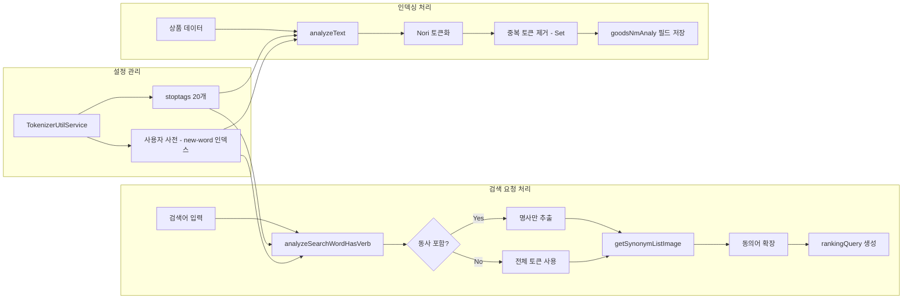

# OpenSearch Nori 분석기 커스터마이징 및 형태소 분석

이커머스 검색에서 한국어 형태소 분석은 검색 품질을 결정하는 가장 기초적인 레이어다. "반팔 티셔츠"를 검색했을 때 "반팔"과 "티셔츠"를 분리하고, "예쁜 원피스"에서 동사 파생 접미사를 제거해 "원피스"만 남기는 과정 — 이 처리가 정확하지 않으면 아무리 좋은 벡터 검색이나 랭킹 모델도 의미가 없다.

x2bee-nest-search 프로젝트에서는 OpenSearch의 Nori 분석기를 사용했다. 하지만 기본 설정 그대로는 커머스 도메인에 맞지 않았다. 약 2개월간(2024년 8월~10월) 20회 이상의 커밋을 거치며 Nori 설정을 커스터마이징했고, 최종적으로는 인덱스 매핑의 `analyzer` 의존을 완전히 탈피하여 런타임에 Analyze API를 직접 호출하는 아키텍처로 전환했다. 그 과정을 정리한다.

## 배경: 왜 기본 Nori가 부족한가

OpenSearch에 내장된 `nori_analyzer`는 한국어 형태소 분석의 기본을 잘 처리한다. 하지만 커머스 검색에서 바로 쓰기에는 몇 가지 한계가 있었다.

첫째, **복합어 처리(decompound_mode)** 문제다. "삼성전자"를 검색하면 "삼성"과 "전자"로 분리해야 할까, 그대로 두어야 할까? 기본 모드(`discard`)에서는 "삼성전자"가 "삼성" + "전자"로 분리되면서 "삼성화재"나 "LG전자"도 매칭되는 노이즈가 발생했다.

둘째, **품사 필터링(stoptags)** 범위다. "예쁜 빨간 겨울 코트 추천해주세요"라는 검색어에서 "예쁜", "추천해주세요" 같은 동사/형용사는 검색에 노이즈를 만든다. 기본 stoptags 설정으로는 이런 품사가 충분히 걸러지지 않았다.

셋째, **사용자 사전 관리**다. 커머스에는 "오버핏", "크롭탑", "Y2K" 같은 신조어가 지속적으로 등장한다. 서버를 재시작하지 않고도 사전을 업데이트할 수 있는 방법이 필요했다.

## 전체 아키텍처

최종적으로 구축한 Nori 분석 아키텍처는 다음과 같다.



핵심 설계 원칙은 **인덱스 설정(settings/mappings)에서 Nori 분석기를 제거하고, 코드 레벨에서 Analyze API를 직접 호출**하는 것이다. 이렇게 하면 stoptags 변경이나 사용자 사전 추가 시 인덱스를 재생성하지 않아도 된다.

## 시행착오 타임라인

### Phase 1: nori_analyzer 최초 적용 (2024-08-28)

첫 번째 커밋에서는 단순하게 접근했다. 검색어를 OpenSearch의 `nori_analyzer`로 분석하고, 그 결과를 검색 쿼리에 사용하는 방식이다.

```typescript
// 커밋: fix: 형태소 분석기 업데이트
// 날짜: 2024-08-28

const analyzeResult = await this.opensearchClient.indices.analyze({
  index: 'ai-goods-ko',
  body: {
    analyzer: 'nori_analyzer',
    text: [decodedStr],
  },
});
const analyzedWords = analyzeResult.body.tokens
  .map(token => token.token);
req.searchWord = analyzedWords.join(' ');
```

이 시점에서 `decompound_mode`를 `none`에서 `mixed`로 변경했다. `mixed` 모드는 원본 복합어와 분리된 토큰을 모두 인덱싱하는 방식으로, "삼성전자"로 검색하면 "삼성전자"(원본)와 "삼성"+"전자"(분리) 모두 매칭된다.

```typescript
body: {
  tokenizer: {
    type: 'nori_tokenizer',
    decompound_mode: 'mixed',
  },
  text: decodeURIComponent(searchWord),
}
```

하지만 `mixed` 모드는 토큰 수가 늘어나면서 recall은 좋아졌지만 precision이 떨어지는 부작용이 있었다. "삼성전자 TV"를 검색하면 "전자레인지"까지 올라오는 식이다.

### Phase 2: 직접 토크나이저 + stoptags 상세 설정 (2024-09-11)

`nori_analyzer` 의존에서 벗어나 토크나이저와 필터를 직접 조합하는 방식으로 전환했다. 핵심은 `nori_part_of_speech` 필터에 stoptags를 상세하게 지정하는 것이다.

```typescript
// 커밋: fix: tokenizer 변경 (mixed)
// 날짜: 2024-09-11

const searchWordTokens = await this.opensearchClient.indices.analyze({
  body: {
    tokenizer: {
      type: 'nori_tokenizer',
      decompound_mode: 'mixed',
    },
    filter: [
      {
        type: 'nori_part_of_speech',
        stoptags: [
          'E', 'IC', 'J', 'MM', 'NA', 'NR', 'SC', 'SE', 'SF',
          'SH', 'SL', 'SN', 'SP', 'SSC', 'SSO', 'SY',
          'VCN', 'VCP', 'VSV', 'VV', 'VX',
          'XPN', 'XR', 'XSA', 'XSN', 'XSV',
        ],
      },
      'lowercase',
    ],
    text: decodeURIComponent(searchWord),
  },
});
```

이 시점에서 stoptags는 25개까지 확장됐다. `MM`(관형사), `NA`(알 수 없는 형태소), `NR`(수사), `SN`(숫자), `XR`(어근) 등 커머스 검색에서 노이즈를 만드는 품사를 최대한 걸러냈다.

### Phase 3: 인덱싱에 직접 토큰화 적용 (2024-10-10)

검색뿐 아니라 인덱싱 시점에도 Nori를 직접 호출하는 방식으로 전환했다. 기존에는 인덱스 매핑에 `analyzer: 'nori_analyzer'`를 지정해서 OpenSearch가 인덱싱 시 자동으로 분석하도록 했는데, 이 방식의 한계를 깨달았다.

```typescript
// 커밋: fix: analy 형태소 색인 추가
// 날짜: 2024-10-10

// 기존: 매핑에 analyzer 지정 (제거됨)
goodsNmAnaly: {
  type: 'text',
  analyzer: 'nori_analyzer',  // 삭제
},

// 변경: 인덱싱 시점에 직접 토큰화
const tokenizedData = await this.opensearchClient.indices.analyze({
  body: {
    tokenizer: 'nori_tokenizer',
    text: data,
  },
});

const analyzedText = Array.from(
  new Set(tokenizedData.body.tokens.map(token => token.token)),
).join(' ');

req.data[dataIndex][fieldKey + 'Analy'] = analyzedText;
```

핵심 변경은 `Set`을 사용한 **중복 토큰 제거**다. "빨간색 빨간 코트"가 인덱싱되면 "빨간"이 중복되는데, Set으로 중복을 제거하면 TF(Term Frequency) 기반 스코어링에서 더 정확한 결과를 만든다.

인덱스 매핑에서 `analyzer`를 제거함으로써 얻은 이점은 명확했다. stoptags나 사용자 사전을 변경해도 인덱스를 재생성할 필요가 없어졌다. 인덱싱 코드를 수정하고 재인덱싱만 하면 된다.

### Phase 4: stoptags 최종 확정 + IDF 제거 (2024-10-16)

대규모 설정 변경이 이루어진 날이다. stoptags를 최종 버전으로 확정하고, 커스텀 similarity 스크립트를 추가했다.

```typescript
// 커밋: fix: 색인 로직 수정(setting, analyzer)
// 날짜: 2024-10-16

// 인덱스 settings에 커스텀 similarity 추가
settings = {
  similarity: {
    scripted_no_idf: {
      type: 'scripted',
      script: {
        source:
          'double tf = Math.sqrt(doc.freq); ' +
          'double norm = 1/Math.sqrt(doc.length); ' +
          'return query.boost * tf * norm;',
      },
    },
  },
  knn: true,
};
```

`scripted_no_idf` — IDF(역문서빈도)를 제거한 커스텀 유사도 함수다. 일반적인 텍스트 검색에서는 IDF가 중요하지만, 커머스 상품 검색에서는 사정이 다르다. "티셔츠"는 매우 흔한 단어이므로 IDF가 낮지만, 사용자가 "티셔츠"를 검색하면 티셔츠를 보여줘야 한다. IDF를 제거하고 TF(단어빈도)와 문서 길이 정규화만 남기면 상품명에 해당 단어가 얼마나 잘 매칭되는지만 평가하게 된다.

같은 커밋에서 동의어 인덱스 조회 후 중복 제거 로직도 추가됐다.

### Phase 5: 시행착오와 안정화 (2024-10-24)

흥미로운 시행착오가 있었다. 10월 24일에 "형태소 분리 제거" 커밋이 올라갔다가, 직후에 "일단 다시 형태소 분리하는 거 넣어둠" 커밋이 바로 이어졌다.

```
# 커밋: fix: 형태소 분리 제거
# 날짜: 2024-10-24

# 커밋: fix: 일단 다시 형태소 분리하는 거 넣어둠
# 날짜: 2024-10-24
```

인덱싱 시 형태소 분리 없이 원본 텍스트를 그대로 저장하면 어떻게 될까 실험한 것이다. 결과는 검색 품질 저하 — 다시 형태소 분리를 복원했다. 이 시행착오를 통해 인덱싱 시점의 형태소 분석이 검색 품질에 얼마나 중요한지 다시 한번 확인했다.

## 핵심 구현

### decompound_mode 선택: none vs mixed vs discard

Nori 토크나이저의 `decompound_mode`는 복합어를 어떻게 처리할지 결정하는 옵션이다. 세 가지 모드를 모두 테스트했다.

| 모드 | "삼성전자" 토큰화 결과 | 장점 | 단점 |
|------|---------------------|------|------|
| `none` | ["삼성전자"] | 정확한 매칭 | recall 낮음 |
| `mixed` | ["삼성전자", "삼성", "전자"] | recall + precision 균형 | 토큰 수 증가 |
| `discard` | ["삼성", "전자"] | recall 높음 | 노이즈 증가 |

최초에는 `none` -> `mixed`로 변경했다가, 최종적으로는 다시 `none`으로 돌아왔다. 이유는 검색 쿼리 빌더에서 동의어 확장과 Handlebars 템플릿을 통해 충분한 recall을 확보할 수 있게 됐기 때문이다. `none` 모드의 정확한 매칭 + 동의어 확장이 `mixed` 모드보다 나은 결과를 만들었다.

### stoptags 설계: 20개 품사 태그

최종 확정된 stoptags 목록은 20개다. 한국어 품사 체계를 기반으로, 커머스 검색에서 의미를 가지지 않는 품사를 선별했다.

```typescript
private stoptags: string[] = [
  'E',    // 어미 — "예쁜"의 "-ㄴ", "추천해주세요"의 "-세요"
  'IC',   // 감탄사 — "와", "아"
  'J',    // 조사 — "을", "를", "에서"
  'SC',   // 구분자 — 콤마, 세미콜론
  'SE',   // 줄임표 — "..."
  'SF',   // 마침표/물음표/느낌표
  'SH',   // 한자
  'SL',   // 외국어 (영문은 별도 처리)
  'SP',   // 공백
  'SSC',  // 닫는 괄호
  'SSO',  // 여는 괄호
  'SY',   // 기타 기호
  'VCN',  // 부정 지정사 — "아니다"
  'VCP',  // 긍정 지정사 — "이다"
  'VX',   // 보조 용언 — "있다", "하다"
  'VV',   // 동사 — "입다", "신다", "추천하다"
  'XPN',  // 체언 접두사
  'XSA',  // 형용사 파생 접미사 — "-스럽다"
  'XSN',  // 명사 파생 접미사 — "-질", "-짓"
  'XSV',  // 동사 파생 접미사 — "-하다", "-시키다"
];
```

주목할 점은 `VV`(동사)를 포함시킨 것이다. 일반 텍스트 분석에서는 동사가 중요한 의미를 가지지만, 커머스 검색에서 "추천해주세요", "찾고있어요" 같은 동사는 노이즈다. 사용자가 원하는 건 상품명에 매칭되는 **명사**다.

다만 stoptags로 동사를 일률적으로 제거하면 "조깅화"의 "조깅"이 걸릴 수 있는 문제가 있어, 별도의 동사 판별 로직을 구현했다(후술).

### 동사 판별과 명사 추출: analyzeSearchWordHasVerb

검색어에 동사가 포함되어 있는지 판별하고, 동사가 있으면 명사만 추출하는 핵심 함수다. `explain: true` 옵션으로 각 토큰의 품사 태그를 받아 처리한다.

```typescript
public async analyzeSearchWordHasVerb(
  searchWord: string,
): Promise<{ hasVerb: boolean; analyzeResult: string; rawTokens: string }> {
  const response = await this.opensearchClient.indices.analyze({
    body: {
      explain: true,  // 품사 태그 포함
      tokenizer: {
        type: 'nori_tokenizer',
        decompound_mode: 'none',
        user_dictionary_rules:
          this.tokenizerUtilService.getUserDictionary(),
      },
      filter: [{
        type: 'nori_part_of_speech',
        stoptags: this.tokenizerUtilService.getStoptags(),
      }],
      text: [searchWord],
    },
  });

  const tokens = response.body.detail.tokenizer.tokens;

  // 동사/접미사 관련 품사 태그
  const verbPOS = ['VV', 'VA', 'VX', 'VCN', 'VCP', 'XSV', 'XSA'];
  const nounPOS = ['NNG', 'NNP', 'NNB', 'NNBC'];

  // XSV(동사 파생 접미사)와 결합된 명사 위치 찾기
  const verbDerivativePositions = tokens.reduce(
    (positions, token, index) => {
      if (
        token.leftPOS?.includes('XSV', 'XSA') ||
        token.rightPOS?.includes('XSV')
      ) {
        positions.push(index - 1, index);
      }
      return positions;
    },
    [],
  );

  // 동사가 있으면 명사만 추출
  if (hasVerb) {
    const nounTokens = tokens.filter((token, index) => {
      const isNoun = nounPOS.some(
        pos => token.leftPOS?.startsWith(pos) ||
               token.rightPOS?.startsWith(pos),
      );
      return isNoun && !allVerbPositions.includes(index);
    });
    analyzeResult = nounTokens.map(token => token.token).join(' ');
  } else {
    analyzeResult = tokens.map(token => token.token).join(' ');
  }

  return { hasVerb, analyzeResult, rawTokens };
}
```

이 함수가 필요한 이유는 구체적이다. "따뜻한 겨울 코트 추천해주세요"라는 검색어를 처리하면:

1. Nori 토큰화: ["따뜻", "하", "ㄴ", "겨울", "코트", "추천", "하", "어", "주", "세요"]
2. stoptags 필터링: 어미(E), 보조용언(VX) 제거
3. 동사 판별: "추천하다"(XSV 포함) -> 동사 있음
4. 명사만 추출: "겨울 코트"

"추천"이라는 단어가 상품명에 포함된 경우("추천상품" 등)에 매칭되는 것을 방지한다.

### 동의어 확장: getSynonymListImage

형태소 분석 결과를 동의어로 확장하는 함수다. OpenSearch의 `synonym` 인덱스에서 동의어를 조회하고, 토큰별로 모든 동의어 조합을 생성한다.

```typescript
public async getSynonymListImage(index: string, searchWord: string) {
  // 1. 검색어 토큰화
  const analyzeResponse = await this.analyzeSearchWord(searchWord);
  const searchWordObjects = [];
  let previousEndOffset = -1;

  // 2. 토큰별 메타정보 생성
  const tokens = analyzeResponse.body.tokens.map((token) => ({
    token: token.token,
    synonyms: [],
    original: token.start_offset === previousEndOffset + 1
              || previousEndOffset === -1,
    hasCompoundForm: token.positionLength > 1,
  }));

  // 3. 배치 처리: 모든 동의어 검색 병렬 처리
  const synonymsMap = await this.searchSynonymsBatch(
    tokens.map(t => t.token),
  );

  // 4. 결과 조합 (중복 제거)
  tokens.forEach(tokenObj => {
    tokenObj.synonyms = synonymsMap[tokenObj.token] || [];
    if (!searchWordObjects.some(obj => obj.token === tokenObj.token)) {
      searchWordObjects.push(tokenObj);
    }
  });

  return searchWordObjects;
}
```

`searchSynonymsBatch`는 개별 동의어 검색을 배치로 묶어 한 번에 처리한다. 토큰이 5개이면 5번 개별 검색하는 대신 1번의 `match` 쿼리로 모든 동의어를 가져온다. 검색 지연시간을 크게 줄이는 최적화다.

### 사용자 사전 동적 로딩: TokenizerUtilService

stoptags와 사용자 사전을 중앙에서 관리하는 서비스다. 서비스 시작 시 OpenSearch의 `new-word` 인덱스에서 사용자 사전을 로딩한다.

```typescript
@Injectable()
export class TokenizerUtilService {
  private userDictionary: string[] = [];
  private stoptags: string[] = [/* 20개 품사 태그 */];

  constructor(private readonly opensearchClient: OpensearchClient) {
    this.loadUserDictionaryFromIndex().then();
  }

  async loadUserDictionaryFromIndex() {
    // new-word 인덱스에서 search_after 기반 페이지네이션으로 로드
    // sendGb='D' 또는 useYn='N'인 것 제외
    // 100개씩 로드하여 userDictionary에 저장
    const indexExists = await this.opensearchClient.indices.exists({
      index: 'new-word',
    });
    if (!indexExists.body) return;

    let searchAfter = undefined;
    while (true) {
      const response = await this.opensearchClient.search({
        index: 'new-word',
        body: {
          size: 100,
          query: {
            bool: {
              must_not: [
                { term: { sendGb: 'D' } },
                { term: { useYn: 'N' } },
              ],
            },
          },
          sort: [{ _id: 'asc' }],
          ...(searchAfter && { search_after: searchAfter }),
        },
      });

      const hits = response.body.hits.hits;
      if (hits.length === 0) break;

      hits.forEach(hit => {
        this.userDictionary.push(hit._source.nogmNm);
      });
      searchAfter = hits[hits.length - 1].sort;
    }
  }

  getUserDictionary(): string[] { return this.userDictionary; }
  getStoptags(): string[] { return this.stoptags; }
}
```

사용자 사전은 `nori_tokenizer`의 `user_dictionary_rules` 파라미터로 전달된다. "크롭탑", "오버핏" 같은 커머스 신조어를 등록하면 Nori가 이 단어들을 하나의 토큰으로 인식한다. `new-word` 인덱스는 관리자 UI에서 실시간으로 추가/삭제가 가능하고, 서비스 재시작 시 자동으로 반영된다.

### 인덱싱 시점의 형태소 분석

검색 시점뿐 아니라 인덱싱 시점에도 동일한 Nori 설정으로 텍스트를 분석하여 `goodsNmAnaly` 필드에 저장한다.

```typescript
// indexing.service.ts
private async analyzeAndStoreField(
  data: any, fieldKey: string
) {
  const tokenizedData = await this.opensearchClient.indices.analyze({
    body: {
      tokenizer: {
        type: 'nori_tokenizer',
        decompound_mode: 'none',
        user_dictionary_rules:
          this.tokenizerUtilService.getUserDictionary(),
      },
      filter: [{
        type: 'nori_part_of_speech',
        stoptags: this.tokenizerUtilService.getStoptags(),
      }],
      text: [data],
    },
  });

  // Set으로 중복 토큰 제거
  const uniqueTokens = new Set(
    tokenizedData.body.tokens.map(token => token.token),
  );
  const analyzedText = Array.from(uniqueTokens).join(' ');
  data[fieldKey + 'Analy'] = analyzedText
    .replace(this.specialCharRegex, ' ');
}
```

"반팔 니트 반팔티셔츠"가 인덱싱되면 "반팔 니트 티셔츠"로 저장된다. 중복된 "반팔"이 제거되면서 TF 스코어링이 더 정확해진다.

## 트러블슈팅

### nori_analyzer vs 직접 토크나이저 호출

초기에는 인덱스 매핑에 `analyzer: 'nori_analyzer'`를 지정하는 표준 방식을 사용했다. 하지만 이 방식에서는 stoptags를 변경하려면 인덱스를 닫고(close) -> 설정 변경 -> 다시 열어야(open) 했다. 운영 환경에서 인덱스를 닫으면 검색이 중단되므로, 사실상 인덱스 재생성이 필요했다.

Analyze API를 직접 호출하는 방식으로 전환하면서 이 문제가 해결됐다. 코드에서 stoptags 배열을 변경하고 배포하면 즉시 반영된다. 인덱스 재생성 없이.

단점도 있다. 매 검색 요청마다 Analyze API를 호출하므로 약간의 오버헤드가 추가된다. 하지만 측정 결과 단일 Analyze API 호출은 1~3ms 수준이었고, 전체 검색 파이프라인(50~200ms)에서 무시할 수 있는 수준이었다.

### decompound_mode 롤백

`mixed` -> `none`으로 롤백한 과정은 데이터를 통해 결정했다. "원피스"를 검색했을 때 `mixed` 모드에서는 "원"과 "피스"로도 분리되어 "원가", "피스타치오" 같은 관련 없는 상품이 매칭됐다. `none` 모드로 돌아가면서 이런 노이즈가 사라졌고, 부족한 recall은 동의어 확장으로 보완했다.

### 형태소 분리 제거 실험

2024년 10월 24일의 "형태소 분리 제거 -> 다시 복원" 에피소드는 중요한 교훈을 남겼다. 인덱싱 시 형태소 분석을 제거하면 원본 텍스트가 그대로 저장되므로, 검색 시 Nori로 분석된 토큰과 매칭이 안 되는 케이스가 발생했다.

예를 들어 "남성용반팔티셔츠"라는 상품명이 형태소 분석 없이 저장되면, "반팔 티셔츠"로 검색해도 매칭이 안 된다. Nori가 검색어를 "반팔" + "티셔츠"로 분리하지만, 인덱스에는 "남성용반팔티셔츠"라는 문자열이 그대로 있기 때문이다.

인덱싱과 검색 양쪽에서 동일한 분석기를 사용해야 한다는 원칙을 다시 확인한 사건이었다.

## 결과 및 회고

약 2개월간의 Nori 커스터마이징을 통해 달성한 것들을 정리한다.

**설정 관리 아키텍처**: 인덱스 매핑 의존에서 벗어나 코드 레벨 Analyze API 직접 호출로 전환했다. stoptags, 사용자 사전, decompound_mode 변경이 인덱스 재생성 없이 가능해졌다.

**품사 필터링**: 20개 stoptags로 커머스 도메인에 최적화된 품사 필터링을 구축했다. 동사/형용사를 제거하면서도 동사 판별 로직으로 예외 케이스를 처리한다.

**사용자 사전 동적 관리**: OpenSearch의 `new-word` 인덱스에서 사용자 사전을 동적으로 로딩한다. 관리자가 신조어를 등록하면 서비스 재시작 시 자동 반영된다.

**IDF 제거**: 커스텀 similarity 스크립트로 IDF를 제거하고 TF + 문서 길이 정규화만 남겼다. 커머스 검색의 특성에 맞는 스코어링이다.

돌이켜보면 가장 큰 깨달음은 "표준 분석기를 그대로 쓰지 않는다"는 결정이었다. Nori의 기본 설정은 범용적이지만, 커머스라는 특정 도메인에서는 세밀한 커스터마이징이 필수였다. 특히 decompound_mode와 stoptags의 조합은 도메인별로 완전히 다른 최적값을 가진다. 이 프로젝트에서 얻은 설정값들은 이후 다른 커머스 검색 프로젝트에서도 재사용할 수 있는 기반이 됐다.
