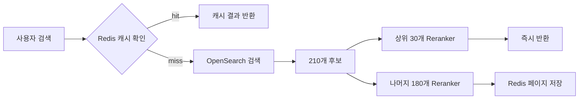

# Reranker 모델 도입으로 검색 정확도 향상하기

이커머스 검색에서 OpenSearch의 BM25 + 벡터 검색만으로는 사용자 의도에 정확히 맞는 순서를 보장하기 어렵다. "따뜻한 겨울 롱 코트"를 검색했을 때 키워드 매칭 점수가 높은 상품이 올라오지만, 실제로 사용자가 원하는 상품은 그 아래에 묻혀 있는 경우가 빈번했다. 이 문제를 해결하기 위해 2025년 1월, x2bee-nest-search에 Cross-Encoder 기반 Reranker를 도입했다.

## 배경: 왜 Reranker가 필요했나

기존 검색 파이프라인은 OpenSearch에서 키워드 검색과 벡터 검색을 조합하여 최대 210개의 후보 상품을 가져온 뒤, BM25 스코어와 코사인 유사도를 기준으로 정렬하는 방식이었다. 이 방식의 근본적인 한계는 **Bi-Encoder**의 특성에 있다.

Bi-Encoder(임베딩 모델)는 검색어와 문서를 각각 독립적으로 벡터로 변환한 뒤 코사인 유사도를 계산한다. 빠르지만 검색어와 문서 사이의 미묘한 의미 관계를 포착하지 못한다. 예를 들어 "가벼운 여름 자켓"이라는 검색어에 대해 "경량 썸머 아우터"는 의미적으로 거의 동일하지만, Bi-Encoder 기반 유사도는 생각보다 낮게 나올 수 있다.

**Cross-Encoder**는 검색어와 문서를 하나의 입력으로 결합해서 관련성 점수를 직접 계산한다. 정확도는 높지만 모든 후보 문서에 대해 추론해야 하므로 느리다. 그래서 실무에서는 1차 검색(Bi-Encoder) + 2차 재순위화(Cross-Encoder)를 조합하는 전략을 쓴다.

```
검색어: "따뜻한 겨울 롱 코트"

[1차 검색: OpenSearch BM25 + 벡터]
→ 210개 후보 반환 (키워드 매칭 + 코사인 유사도 기준)

[2차 재순위화: Cross-Encoder Reranker]
→ 검색어와 각 상품명을 쌍으로 묶어 관련성 점수 계산
→ 점수 기준 내림차순 정렬
```

## 아키텍처 설계

전체 시스템은 NestJS 검색 서비스와 Python Reranker 서비스, 그리고 Redis 캐시로 구성된다.



핵심 설계 결정은 세 가지였다.

**1) 분할 Reranking**: 210개를 한 번에 Reranker에 넘기면 응답 시간이 길어진다. 상위 30개만 먼저 재순위화해서 즉시 반환하고, 나머지 180개는 백그라운드에서 비동기 처리한다.

**2) Redis 캐시**: 동일 검색어의 2페이지 이후 요청은 Redis에서 꺼내온다. URL 기반 캐시 키를 사용하며 TTL은 300초(5분)다.

**3) 상품명 전처리**: Reranker 입력 전에 상품명의 중복 단어를 제거한다. 이커머스 상품명은 "여성 여성용 겨울 코트 여성 롱코트"처럼 같은 단어가 반복되는 경우가 많아서, 이를 정리해야 Reranker 정확도가 올라간다.

## 핵심 구현

### Python Reranker 서비스

Reranker 모델은 `Dongjin-kr/ko-reranker`를 사용했다. 한국어 Cross-Encoder 모델로, 검색어-문서 쌍의 관련성 점수를 직접 계산한다.

```
# 커밋: fix: reranker 추가
# 날짜: 2025-01-12 20:44
```

```python
# services/rerank_service.py
def exp_normalize(x):
    b = x.max()
    y = np.exp(x - b)
    return y / y.sum()

def rerank_goods(search_sentence: str, product_list: List[Dict[str, str]]) -> List[str]:
    if not product_list:
        raise ValueError("상품 리스트가 비어 있습니다.")

    # 검색 문장과 상품명의 쌍 생성
    sentence_pairs = [[search_sentence, item["goodsNm"]] for item in product_list]

    # Cross-Encoder 점수 계산
    with torch.no_grad():
        inputs = model_service.reranker_tokenizer(
            sentence_pairs,
            padding=True,
            truncation=True,
            return_tensors="pt",
            max_length=512,
        ).to(model_service.device)
        scores = (
            model_service.reranker_model(**inputs, return_dict=True)
            .logits.view(-1)
            .float()
        )
        scores = exp_normalize(scores.cpu().numpy())

    # 점수 기준 내림차순 정렬
    ranked_goods = sorted(
        zip(product_list, scores),
        key=lambda x: x[1],
        reverse=True,
    )
    return [item[0]["goodsNo"] for item in ranked_goods]
```

`exp_normalize`는 softmax의 수치 안정성 버전이다. 로짓 값의 최댓값을 빼서 오버플로를 방지한 뒤 지수 함수를 적용한다. 일반적인 softmax와 결과는 동일하지만, 매우 큰 로짓 값이 나올 때 `NaN`을 방지한다.

### 모델 초기화

```python
# services/model_service.py
reranker_model_path = "Dongjin-kr/ko-reranker"
reranker_tokenizer = AutoTokenizer.from_pretrained(reranker_model_path)
reranker_model = AutoModelForSequenceClassification.from_pretrained(
    reranker_model_path
)
reranker_model.to(device)  # GPU
reranker_model.eval()
```

Reranker 모델은 서버 시작 시 GPU에 로드된다. `eval()` 모드로 설정하여 드롭아웃 등 학습용 레이어를 비활성화한다. 이 모델은 다른 모델들(Object Detection, Vision Transformer)과 함께 GPU 메모리를 공유하기 때문에, 텍스트 유사도 모델(KoSimCSE-roberta)은 CPU로 분리하여 Lazy Loading하는 방식을 택했다.

### NestJS 측 Reranker 호출

NestJS 검색 서비스에서 Python Reranker API를 호출하는 부분이다.

```typescript
// src/utils/search/search.util.service.ts
public async fetchReranker(decodedStr, products) {
    const requestBody = {
      search_sentence: decodedStr,
      product_list: products,
    };
    const response = await axios.post(
      'https://search-python.x2bee.com/api/ai/v1/productReranker',
      requestBody,
      {
        headers: { 'Content-Type': 'application/json' },
      },
    );
    return response.data.ranked_goods;
}
```

### 분할 Reranking + Redis 캐시

검색 실행 함수 내부의 핵심 로직이다. 상위 30개를 먼저 처리하고, 나머지는 비동기로 처리한다.

```
# 커밋: fix: reranker + redis
# 날짜: 2025-01-24 09:40
```

```typescript
if (use_agg !== 'Y') {
  const first30Data = this.resultObject?.searchDataList;

  // 상품명 전처리: 중복 단어 제거
  const preprocessGoodsNm = (goodsNm: string): string => {
    const words = goodsNm.split(' ');
    const uniqueWords = Array.from(new Set(words));
    return uniqueWords.join(' ');
  };

  const extractedData = first30Data.map(({ goodsNo, goodsNm }) => ({
    goodsNo,
    goodsNm: preprocessGoodsNm(goodsNm),
  }));

  // 1차: 상위 30개 reranking
  const rankedGoodsNo = await this.fetchReranker(search_word, extractedData);
  const top30RankedGoodsNo = rankedGoodsNo.slice(0, 30);

  const sortedFirst30Data = first30Data
    .filter(item => top30RankedGoodsNo.includes(item.goodsNo))
    .sort((a, b) => {
      return top30RankedGoodsNo.indexOf(a.goodsNo)
           - top30RankedGoodsNo.indexOf(b.goodsNo);
    });

  // 2차: 나머지 비동기 reranking + Redis 저장
  (async () => {
    try {
      const remainingData = this.resultObject.searchDataList.slice(30);
      const remainingExtractedData = remainingData.map(({ goodsNo, goodsNm }) => ({
        goodsNo,
        goodsNm: preprocessGoodsNm(goodsNm),
      }));
      const rankedGoodsNoRemaining = await this.fetchReranker(
        search_word, remainingExtractedData
      );
      const sortedRemainingData = remainingData.sort((a, b) =>
        rankedGoodsNoRemaining.indexOf(a.goodsNo)
        - rankedGoodsNoRemaining.indexOf(b.goodsNo)
      );
      const finalSortedData = [...sortedFirst30Data, ...sortedRemainingData];
      await this.savePaginatedDataToRedis(url, finalSortedData, 30);
    } catch (asyncError) {
      console.error('Error during async processing:', asyncError);
    }
  })();

  // 첫 30개만 즉시 반환
  return ResponseDto.builder()
    .message('success')
    .payload({ ...this.resultObject, searchDataList: sortedFirst30Data })
    .build();
}
```

IIFE(즉시 실행 함수)로 비동기 블록을 감싸서 `await` 없이 실행한다. 사용자에게는 상위 30개를 즉시 반환하고, 나머지 180개의 reranking과 Redis 저장은 백그라운드에서 처리된다.

### Redis 페이지네이션 캐시

```
# 커밋: fix: reranker + redis
# 날짜: 2025-01-24 14:10
```

```typescript
public async savePaginatedDataToRedis(
  url: string,
  searchDataList: any[],
  pageSize: number, // 30
): Promise<void> {
  const totalItems = searchDataList.length;
  const totalPages = Math.ceil(totalItems / pageSize);

  for (let page = 0; page < totalPages; page++) {
    const startIndex = page * pageSize;
    const endIndex = Math.min(startIndex + pageSize, totalItems);
    const paginatedData = searchDataList.slice(startIndex, endIndex);
    const fromValue = startIndex;
    const modifiedUrl = this.updateQueryParam(url, 'from', fromValue);
    const redisKey = `search:${modifiedUrl}`;
    await redisClient.set(
      redisKey, JSON.stringify(paginatedData), 'EX', 300
    );
  }
}
```

URL의 `from` 파라미터를 페이지별로 변경하여 Redis 키를 생성한다. 예를 들어 `search:/api/search?searchWord=코트&from=0`, `search:/api/search?searchWord=코트&from=30` 식으로 페이지별 키가 만들어진다. TTL 300초로 5분 후 자동 만료된다.

검색 함수 시작 시 Redis 캐시를 먼저 확인한다.

```typescript
if (url !== null) {
  const exists = await redisClient.exists('search:' + url);
  if (exists) {
    const cachedData = await redisClient.get('search:' + url);
    const parsedData = JSON.parse(cachedData);
    this.resultObject.searchDataList = parsedData;
    return ResponseDto.builder()
      .message('success (from cache)')
      .payload(this.resultObject)
      .build();
  }
}
```

## 트러블슈팅

### 1. Aggregation 검색에서 Reranker 오류

```
# 커밋: fix: aggregation 검색 시 reRanker 오류 수정
# 날짜: 2025-01-16 18:08
```

Reranker를 도입한 직후, 집계(aggregation) 검색에서 오류가 발생했다. 집계 검색은 카테고리별 상품 수를 세는 용도로, 검색 결과 데이터 구조가 일반 검색과 다르다. `goodsNm` 필드가 없는 데이터를 Reranker에 넘기면서 에러가 났다.

해결은 간단했다. `use_agg !== 'Y'` 조건으로 집계 검색에서는 Reranker를 건너뛰도록 분기했다.

### 2. 상품명 중복 단어 문제

```
# 커밋: fix: reranker + redis
# 날짜: 2025-01-24 14:10
```

이커머스 상품명은 SEO를 위해 같은 키워드를 반복하는 경우가 많다.

```
원본: "여성 여성용 겨울 코트 여성 롱코트 겨울코트"
전처리 후: "여성 여성용 겨울 코트 롱코트 겨울코트"
```

`Set`으로 중복을 제거하되 순서는 유지하는 방식이다. 이 전처리를 적용하자 Reranker가 상품명의 실질적인 의미에 더 집중할 수 있게 되었다. 특히 Cross-Encoder는 토큰 수 제한(max_length=512)이 있기 때문에, 중복 단어를 제거하면 더 많은 의미 있는 토큰이 모델에 입력된다.

### 3. Reranker 도입 전후 디버깅

```
# 커밋: fix: 점수 제거
# 날짜: 2025-01-14 15:58
```

초기 디버깅 단계에서는 상품명 뒤에 Reranker 점수를 붙여서 반환했다. `"겨울 코트 (0.847)"` 형태로 실제 검색 결과에 점수가 노출되도록 해서 Reranker가 제대로 작동하는지 확인했다. 확인이 끝난 뒤 점수 표시 코드를 제거했다.

## 시행착오 타임라인

| 날짜 | 커밋 | 내용 |
|------|------|------|
| 01-12 20:44 | fix: reranker 추가 | Reranker 최초 도입. 전체 결과를 한 번에 재순위화 |
| 01-12 21:14 | fix: reranker 추가 | `all_keyword` Handlebars 변수 추가, 불필요 카테고리 쿼리 제거 |
| 01-14 15:58 | fix: 점수 제거 | 디버깅용 점수 표시 코드 제거 |
| 01-16 18:08 | fix: aggregation reRanker 오류 수정 | `use_agg !== 'Y'` 조건 분기로 집계 검색 보호 |
| 01-24 09:40 | fix: reranker + redis | Redis 캐시 도입, URL 기반 캐시 키, 페이지네이션 저장 |
| 01-24 14:10 | fix: reranker + redis | 상품명 전처리, 분할 reranking(top30 + 나머지) |

## 결과 및 회고

Reranker 도입 후 검색 품질이 체감할 수 있을 정도로 개선되었다. 특히 "따뜻한 겨울 여성 롱 코트" 같은 문장형 검색어에서 효과가 컸다. 키워드 매칭만으로는 "따뜻한"이라는 형용사의 의미를 반영하기 어렵지만, Cross-Encoder는 검색어와 상품명을 함께 보기 때문에 "보온성 좋은 다운 코트"를 더 높게 평가할 수 있다.

응답 시간 측면에서는 분할 전략이 효과적이었다. 상위 30개만 Reranker를 거치면 추가 지연은 수백 밀리초 수준이고, 사용자가 2페이지로 넘어갈 때는 이미 Redis에 캐시되어 있어 추가 지연이 없다.

아쉬운 점은 온/오프 제어가 코드 레벨이라는 것이다. `use_agg !== 'Y'` 같은 하드코딩 조건 대신, 설정 파일이나 환경변수로 Reranker 활성화 여부를 제어할 수 있으면 운영 유연성이 높아졌을 것이다. 또한 Reranker 모델의 추론 속도를 높이기 위해 ONNX Runtime이나 TensorRT 변환을 검토할 만하다.
