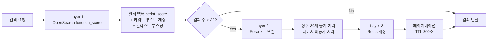

# 검색 결과 랭킹 스코어링 시스템 설계

검색 엔진의 핵심은 "어떤 결과를 보여줄 것인가"가 아니라 "어떤 순서로 보여줄 것인가"다. 같은 검색어에 같은 상품 목록이 나와도, 첫 페이지에 무엇이 올라오느냐에 따라 사용자 경험은 완전히 달라진다. 이 글에서는 x2bee-nest-search(NestJS)와 search-rust(Rust/Axum)에서 구축한 랭킹 스코어링 시스템의 설계와 진화 과정을 정리한다.

최종 아키텍처는 3계층으로 구성된다. OpenSearch의 `function_score`로 1차 랭킹, Cross-Encoder Reranker 모델로 2차 재순위화, Redis에 캐싱하여 페이지네이션 제공. 이 시스템은 2024년 8월부터 2025년 4월까지 약 8개월에 걸쳐 진화했다.

## 배경: 단순 relevance score의 한계

OpenSearch의 기본 relevance score는 BM25 기반이다. TF-IDF의 변형인 BM25는 텍스트 매칭에서 합리적인 점수를 만들지만, 커머스 검색에서는 몇 가지 한계가 있었다.

첫째, 벡터 유사도와 키워드 매칭의 결합이 어렵다. "예쁜 봄 원피스"를 검색하면 "원피스"라는 키워드 매칭 점수와, 문장 임베딩의 코사인 유사도를 어떤 비율로 합산해야 하는가? BM25만으로는 이 질문에 답할 수 없다.

둘째, 컨텍스트 정보(성별, 계절, 색상)를 점수에 반영하기 어렵다. "남성 겨울 코트"를 검색하면 남성용 상품에 가중치를 주고, 겨울 상품에 가중치를 주어야 한다. 이건 단순 키워드 매칭이 아니라 의미적 유사도 기반의 부스팅이다.

셋째, 점수 분포의 제어가 불가능하다. BM25의 점수 범위는 쿼리마다 달라서, 한 쿼리에서 10점이 최고인데 다른 쿼리에서는 100점이 최고인 상황이 발생한다. 일관된 사용자 경험을 위해 점수 범위를 정규화하는 방법이 필요했다.

## 전체 아키텍처



### Layer 1: OpenSearch function_score

검색 요청이 들어오면 먼저 Handlebars 템플릿으로 동적 쿼리를 생성한다. `function_score`는 OpenSearch에서 BM25 점수에 커스텀 함수를 결합하는 메커니즘이다.

### Layer 2: Reranker 모델

1차 결과에서 상위 결과를 Cross-Encoder Reranker 모델로 재순위화한다. Reranker는 (query, document) 쌍을 직접 비교하므로 Bi-Encoder(벡터 검색)보다 정확하지만 느리다.

### Layer 3: Redis 캐싱

재순위화된 전체 결과를 Redis에 페이지 단위로 저장한다. 같은 검색어의 2페이지, 3페이지 요청 시 Reranker를 다시 호출하지 않아도 된다.

## Layer 1: function_score 상세

### 멀티 벡터 script_score

4개 벡터 필드에 대해 각각 cosine similarity를 계산하고, 가중치를 달리하여 합산한다.

```typescript
// search.util.service.ts
script_score: {
  source:
    "double productScore = " +
    "doc.containsKey('product_vector') && " +
    "doc['product_vector'].size() != 0 " +
    "? cosineSimilarity(params.sentence_vector, " +
    "doc['product_vector']) : 0; " +

    "double colorScore = " +
    "doc.containsKey('color_vector') && " +
    "doc['color_vector'].size() != 0 " +
    "? cosineSimilarity(params.sentence_vector, " +
    "doc['color_vector']) : 0; " +

    "double mainFeatureScore = " +
    "doc.containsKey('main_feature_vector') && " +
    "doc['main_feature_vector'].size() != 0 " +
    "? cosineSimilarity(params.sentence_vector, " +
    "doc['main_feature_vector']) : 0; " +

    "double categoryScore = " +
    "doc.containsKey('cate_vector') && " +
    "doc['cate_vector'].size() != 0 " +
    "? cosineSimilarity(params.sentence_vector, " +
    "doc['cate_vector']) : 0; " +

    "return (productScore+1.0) * 30.0 + " +
    "(colorScore+1.0) * 0.0 + " +
    "(mainFeatureScore+1.0) * 0.5 + " +
    "(categoryScore+1) * 0.5;",
},
```

가중치 배분은 수차례 실험을 거쳐 결정됐다.

| 벡터 | 가중치 | 역할 |
|------|--------|------|
| `product_vector` | x30.0 | 상품 벡터 — 검색 정확도의 핵심 |
| `color_vector` | x0.0 | 색상 벡터 — 비활성화 (별도 KNN으로 처리) |
| `main_feature_vector` | x0.5 | 주요 특징 벡터 — 보조 |
| `cate_vector` | x0.5 | 카테고리 벡터 — 보조 |

`color_vector`의 가중치가 0인 이유는, 색상 매칭을 script_score가 아니라 별도의 nested KNN 쿼리(boost=20000)로 처리하기로 했기 때문이다. nested 구조의 `colorText.color_vector`는 내부 hits로 색상명과 서브 이미지 URL까지 가져올 수 있어 script_score보다 유용했다.

### 키워드 부스트 계층

Handlebars 템플릿에서 키워드 매칭 쿼리를 계층적으로 구성한다. 각 계층은 다른 boost 값을 가져 정확도에 따른 우선순위를 만든다.

```handlebars
"should": [
  {{#if all_keyword}}
  {
    "query_string": {
      "query": {{{all_keyword}}},
      "fields": ["goodsNm"],
      "boost": 2000
    }
  },
  {{/if}}
  {{#if matchPhase}}
  {
    "query_string": {
      "query": {{{matchPhase}}},
      "fields": {{json attNm}},
      "boost": 2000
    }
  },
  {{/if}}
  {{#if andQuery}}
  {
    "query_string": {
      "query": "{{{andQuery}}}",
      "fields": {{json attNm}},
      "boost": 1000
    }
  },
  {{/if}}
  {{#if orQuery}}
  {
    "query_string": {
      "query": "{{{orQuery}}}",
      "fields": {{json attNm}},
      "boost": 500
    }
  }
  {{/if}}
]
```

전체 부스트 계층 구조는 다음과 같다.

| 우선순위 | 쿼리 타입 | boost | 조건 |
|---------|-----------|-------|------|
| 1 | `important_keyword` | 8,000 | GPT가 추출한 핵심 키워드 |
| 2 | `recommand_product` | 5,000 | GPT 추천 상품명 (AND 연산) |
| 3 | `all_keyword` | 2,000 | 원본 검색어 전체 (goodsNm) |
| 4 | `matchPhase` | 2,000 | 구문 일치 (순서 유지) |
| 5 | `andQuery` | 1,000 | 모든 토큰 AND 매칭 |
| 6 | `FieldsQuery` | 1,000 | brandNm, goodsNo 등 직접 필드 |
| 7 | `orQuery` | 500 | 부분 매칭 (OR 조건) |

GPT가 추출한 키워드(`important_keyword`, `recommand_product`)에 가장 높은 boost를 준 이유가 있다. 사용자가 "비 올 때 입기 좋은 방수 재킷"이라고 검색하면, GPT가 "방수 재킷"을 핵심 키워드로, "레인코트", "방수 자켓", "고어텍스 재킷"을 추천 상품으로 추출한다. 이 키워드들이 정확히 상품명에 매칭되면 사용자 의도에 가장 부합하는 결과가 상위에 올라온다.

### 컨텍스트 부스팅: 성별, 계절, 색상

벡터 유사도를 기반으로 검색어의 성별, 계절, 색상 정보를 감지하고 부스트에 반영한다.

```typescript
// 동적 부스트 결정 로직
const templateData = {
  boost_sex: isVerb || !important_word
    ? 1000   // 동사 있거나 핵심 키워드 없으면 기본 부스트
    : 3000,  // 명사 중심 검색어면 성별 부스트 강화

  boost_season: isVerb || !important_word
    ? 1000
    : 10000, // 명사 중심이면 계절 부스트 크게

  boost_color: color_similarity > 0.5
    ? 50000  // 색상 유사도 0.5 초과 시 매우 강한 부스트
    : 1,     // 미만이면 사실상 비활성화
};
```

동사 포함 여부에 따라 부스트 강도가 달라지는 설계가 핵심이다. "추천해주세요"처럼 동사가 포함된 검색어는 의미적 필터링 신뢰도가 낮으므로 낮은 부스트를 적용하고, "빨간 겨울 코트"처럼 명사 중심 검색어는 의미적 필터링 신뢰도가 높으므로 강한 부스트를 적용한다.

### 토큰 수 기반 유사도 임계값

검색어의 토큰 수에 따라 벡터 유사도 임계값을 동적으로 조정한다.

```typescript
// 커밋: fix: reranker + redis (유사도 임계값 리팩토링)
// 날짜: 2025-01-24

const thresholds = {
  1: { similarityThreshold: 0.4, similaritySexThreshold: 0.4 },
  2: { similarityThreshold: 0.37, similaritySexThreshold: 0.35 },
  3: { similarityThreshold: 0.35, similaritySexThreshold: 0.3 },
  4: { similarityThreshold: 0.33, similaritySexThreshold: 0.25 },
  default: { similarityThreshold: 0.3, similaritySexThreshold: 0.2 },
};

const selectedThresholds = thresholds[wordCount] || thresholds.default;
```

토큰이 1개인 "코트"는 임계값 0.4로 엄격하게, 5개 이상인 "따뜻한 겨울 롱 코트 추천"은 0.3으로 느슨하게 설정한다. 토큰이 많을수록 벡터 유사도가 분산되어 낮아지는 경향이 있기 때문이다.

이 임계값은 여러 차례 조정됐다.

```
# 커밋: fix: 성별 가중치 (토큰 수 기반 유사도 임계값 상향)
# 날짜: 2025-01-08

# 커밋: fix: reranker + redis (유사도 임계값 리팩토링)
# 날짜: 2025-01-24
```

1월 8일에 임계값을 올렸다가, 1월 24일에 다시 전체적으로 하향 조정하면서 if-else 구문을 thresholds 객체로 리팩토링했다. 임계값을 너무 올리면 결과 수가 줄어 사용자 경험이 나빠지고, 너무 내리면 노이즈가 증가한다. 최종값은 실제 검색 로그 분석을 통해 결정됐다.

## Layer 2: Reranker 재순위화

### 2단계 파이프라인

OpenSearch의 function_score로 1차 랭킹된 결과를 Cross-Encoder Reranker 모델로 재순위화한다. 핵심은 **상위 30개는 동기 처리하고, 나머지는 비동기 처리**하는 2단계 전략이다.

```typescript
// 커밋: fix: reranker 추가
// 날짜: 2025-01-12

// 1단계: 상위 30개 동기 처리
const first30Data = searchData.slice(0, 30);
const extractedData = first30Data.map(item => ({
  goodsNo: item.goodsNo,
  goodsNm: item.goodsNm
    .replace(/[\[\(].+?[\]\)]/g, '')  // 괄호 내용 제거
    .replace(/&/g, '')
    .trim(),
}));

const rankedGoodsNo = await this.fetchReranker(
  search_word, extractedData
);
const top30RankedGoodsNo = rankedGoodsNo.slice(0, 30);

// 2단계: 나머지 비동기 처리 (Redis에 저장)
const remainingData = searchData.slice(30);
const remainingExtractedData = remainingData.map(item => ({
  goodsNo: item.goodsNo,
  goodsNm: item.goodsNm
    .replace(/[\[\(].+?[\]\)]/g, '')
    .replace(/&/g, '')
    .trim(),
}));

// 비동기로 Reranker 호출 후 Redis에 저장
this.fetchReranker(search_word, remainingExtractedData)
  .then(rankedRemaining => {
    const finalSortedData = [
      ...sortedFirst30Data,
      ...this.sortByRanking(remainingData, rankedRemaining),
    ];
    this.savePaginatedDataToRedis(url, finalSortedData, 30);
  });

// 사용자에게는 1단계 결과 즉시 반환
return top30RankedGoodsNo;
```

이 설계의 핵심은 **응답 지연시간과 정확도의 타협**이다. Reranker는 정확하지만 느리다(수백 개 상품 처리 시 수 초). 사용자가 첫 페이지를 보는 동안 나머지 결과를 백그라운드에서 재순위화하여 Redis에 저장한다. 2페이지 이후 요청 시 Redis에서 즉시 반환한다.

### goodsNm 전처리

Reranker에 상품명을 전달하기 전에 전처리를 수행한다.

```typescript
goodsNm: item.goodsNm
  .replace(/[\[\(].+?[\]\)]/g, '')  // [무료배송], (당일발송) 등 제거
  .replace(/&/g, '')                // HTML 엔티티 제거
  .trim(),
```

"[무료배송] 남성 슬림핏 코트 (겨울용) &amp; 베스트" 같은 상품명에서 프로모션 태그와 HTML 엔티티를 제거한다. Reranker는 (검색어, 상품명) 쌍의 의미적 관련성을 평가하므로, 노이즈를 제거해야 정확한 점수가 나온다.

### Reranker API

```typescript
private async fetchReranker(
  searchWord: string,
  products: Array<{ goodsNo: string; goodsNm: string }>
) {
  const response = await axios.post(
    'https://search-python.x2bee.com/api/ai/v1/productReranker',
    {
      search_word: searchWord,
      products: products,
    },
  );
  return response.data;
}
```

Reranker API는 search-semantic-api에서 `ko-reranker` 모델로 구현되어 있다. 검색어와 각 상품명 쌍에 대해 Cross-Encoder 점수를 계산하고, 점수 순으로 정렬된 goodsNo 목록을 반환한다.

## Layer 3: Redis 페이지네이션 캐싱

```typescript
// 커밋: fix: reranker + redis
// 날짜: 2025-01-24

private async savePaginatedDataToRedis(
  url: string,
  sortedData: any[],
  pageSize: number,
) {
  const totalPages = Math.ceil(sortedData.length / pageSize);

  for (let page = 0; page < totalPages; page++) {
    const start = page * pageSize;
    const end = start + pageSize;
    const pageData = sortedData.slice(start, end);

    const redisKey = `${url}:page:${page + 1}`;
    await this.redisClient.setex(
      redisKey,
      300,  // TTL 5분
      JSON.stringify(pageData),
    );
  }
}
```

TTL을 300초(5분)로 설정한 이유는, 이커머스 검색에서 동일 검색어의 반복 조회가 대부분 5분 이내에 이루어지기 때문이다. 사용자가 검색 후 상품을 살펴보다가 다시 검색 결과로 돌아오는 시간이 보통 1~3분이다.

## search-rust: DB 기반 동적 필드 랭킹

NestJS 검색 엔진의 랭킹이 코드에 하드코딩된 것과 달리, Rust 검색 엔진(search-rust)에서는 DB에서 필드별 boost 설정을 동적으로 조회하는 방식을 구현했다.

### 랭킹 필드 설정 모델

```rust
// 커밋: ranking repository/service 구현
// 날짜: 2025-04-14

pub struct RankingFieldConfig {
    pub id: String,
    pub index_name: String,
    pub field_name: String,
    pub site_no: String,
    pub field_type: String,
    pub main_condition: String,    // EXACT, PHRASE, PRIMARY, SECONDARY
    pub additional_condition: Option<String>,
    pub boost_value: String,
    pub send_gb: String,
}
```

DB(PostgreSQL)에 인덱스별, 사이트별 필드 설정이 저장되어 있다. `main_condition`은 해당 필드의 매칭 방식을 정의한다.

### 동적 쿼리 빌더

```rust
// query_builder.rs
match main_condition {
    "EXACT" => fields.exact_fields.push(
        format!("{}.exact^{}", field_name, boost_value)
    ),
    "PHRASE" => fields.phrase_fields.push(
        format!("{}.phrase^{}", field_name, boost_value)
    ),
    "PRIMARY" => fields.primary_fields.push(
        boosted_field.clone()
    ),
    "SECONDARY" => fields.secondary_fields.push(
        boosted_field.clone()
    ),
    "EQUAL" => {
        fields.exact_fields.push(/* ... */);
        fields.phrase_fields.push(/* ... */);
    },
    _ => fields.secondary_fields.push(
        boosted_field.clone()
    ),
}
```

DB에서 조회한 필드 설정을 4단계 매칭 구조로 변환한다.

### 4단계 multi_match 구조

```handlebars
"should": [
  {
    "multi_match": {
      "fields": {{json exactFields}},
      "type": "phrase",
      "boost": 4.0
    }
  },
  {
    "multi_match": {
      "fields": {{json phraseFields}},
      "type": "phrase",
      "boost": 3.0
    }
  },
  {
    "multi_match": {
      "fields": {{json primaryFields}},
      "type": "most_fields",
      "boost": 2.0,
      "operator": "and"
    }
  },
  {
    "multi_match": {
      "fields": {{json secondaryFields}},
      "type": "most_fields",
      "boost": 1.0,
      "minimum_should_match": "75%"
    }
  }
]
```

| 단계 | 타입 | boost | 설명 |
|------|------|-------|------|
| EXACT | phrase | 4.0 | 정확한 구문 일치 (exact 분석기) |
| PHRASE | phrase | 3.0 | 구문 일치 (phrase 분석기) |
| PRIMARY | most_fields, AND | 2.0 | 모든 토큰 포함 |
| SECONDARY | most_fields, 75% | 1.0 | 부분 매칭 (75% 이상) |

NestJS에서는 코드에 boost 값이 하드코딩되어 있어 변경 시 배포가 필요했지만, Rust에서는 DB 값을 수정하고 캐시(Redis TTL 5분)가 만료되면 자동으로 반영된다. 운영 중 실시간 boost 튜닝이 가능한 구조다.

## 시행착오

### boost 값 전쟁

boost 값을 결정하는 과정은 문자 그대로 시행착오의 연속이었다.

```
# 커밋: fix: match 점수 (matchPhase boost 20 -> 20000)
# 날짜: 2024-12-10

# 커밋: fix: 성별 점수 강화 (recommand_product boost 500 -> 1000)
# 날짜: 2024-11-25

# 커밋: fix: 카테고리 점수 UP (성별 유사도 임계값 0.2 -> 0.5)
# 날짜: 2024-11-21
```

matchPhase의 boost가 20에서 20000으로 1000배 증가한 것은, 벡터 스코어의 scale이 1~60 범위인데 키워드 매칭 boost가 20이면 벡터 스코어에 묻혀버리기 때문이었다. boost 값은 절대값이 아니라 다른 스코어 요소 대비 상대적 비율이 중요하다.

성별 유사도 임계값도 0.2에서 0.5로, 다시 최종적으로 토큰 수 기반 동적 조정으로 변화했다. 고정 임계값은 검색어 특성에 따라 너무 엄격하거나 너무 느슨한 결과를 만들었다.

### Reranker 도입 시 score 표시 제거

```
# 커밋: fix: 점수 제거 (goodsNm에서 score 표시 제거)
# 날짜: 2025-01-14
```

Reranker 도입 전에는 디버깅 목적으로 상품명에 OpenSearch score를 표시하고 있었다("코트 [12.3점]" 형태). Reranker가 이 score 텍스트를 상품명의 일부로 인식하여 랭킹 정확도에 영향을 주는 문제가 발생했다. Reranker 도입과 함께 score 표시를 제거했다.

### sysModDtm 복합 정렬

```typescript
// 커밋: feat: add sorting by sysModDtm in search template
// 날짜: 2025-04-07

template.body.sort = [
  { 'sysModDtm.keyword': { order: 'desc' } },
  '_score',
];
```

최신 수정일 + relevance score의 복합 정렬을 추가한 것은, 신상품이나 최근 업데이트된 상품을 우선 노출하기 위한 운영 요구사항이었다. 다만 이 정렬은 선택적이며, 기본값은 여전히 순수 relevance score 정렬이다.

### cosine similarity 직접 구현

```
# 커밋: refactor: enhance search utility functions
#        and add cosine similarity calculation
# 날짜: 2025-03-21
```

NestJS 검색 엔진에 cosine similarity를 직접 구현한 것은, OpenSearch의 script_score 외에 서버 사이드에서도 벡터 유사도를 계산할 필요가 있었기 때문이다. 검색 결과의 사후 필터링이나 디버깅에서 유용하게 사용됐다. 이 구현은 #25 글에서 자세히 다룬다.

## NestJS vs Rust 랭킹 비교

두 검색 엔진의 랭킹 시스템을 비교하면 다음과 같다.

| 항목 | NestJS (x2bee-nest-search) | Rust (search-rust) |
|------|---------------------------|-------------------|
| 부스트 관리 | 코드 하드코딩 | DB 동적 조회 |
| 랭킹 계층 | 7단계 should 쿼리 | 4단계 multi_match |
| 벡터 스코어 | 4개 벡터 script_score | product_vector KNN |
| 컨텍스트 | 성별/계절/색상 벡터 부스트 | 필드 설정으로 간접 반영 |
| Reranker | 2단계 비동기 파이프라인 | 미사용 |
| 캐싱 | Redis 페이지네이션 (TTL 300초) | Redis 필드 설정 (TTL 300초) |

NestJS 버전이 더 복잡한 이유는 운영 기간이 길어 다양한 요구사항이 축적됐기 때문이다. Rust 버전은 NestJS의 교훈을 바탕으로 설계했기 때문에 더 깔끔한 구조를 가진다.

## 결과 및 회고

8개월간 랭킹 시스템을 진화시키며 배운 핵심 교훈들이다.

**boost 값은 상대적이다**: 각 스코어 요소의 절대값보다 요소 간 상대적 비율이 중요하다. matchPhase boost를 20에서 20000으로 올린 것처럼, 다른 요소의 scale에 맞춰야 의미가 있다. 새로운 스코어 요소를 추가할 때마다 기존 boost 값을 재검토해야 한다.

**동적 설정이 정적 코드를 이긴다**: NestJS에서 하드코딩된 boost 값을 변경하려면 배포가 필요했지만, Rust에서 DB 기반으로 전환하니 운영 중 실시간 튜닝이 가능해졌다. 랭킹은 끊임없이 조정해야 하는 영역이므로, 배포 없이 변경 가능한 구조가 운영 효율을 크게 높인다.

**Reranker는 첫 페이지만**: Cross-Encoder Reranker의 정확도는 벡터 검색보다 높지만 비용이 크다. 사용자의 95% 이상이 첫 페이지만 본다는 데이터를 기반으로, 상위 30개만 동기 처리하고 나머지는 비동기로 처리하는 전략이 최적이었다.

**토큰 수 기반 임계값**: 검색어 길이에 따라 벡터 유사도의 분포가 달라진다. 고정 임계값 대신 토큰 수 기반 동적 임계값이 다양한 검색어에 대해 안정적인 결과를 만든다. 이 패턴은 유사도 기반 필터링이 필요한 다른 시스템에서도 재사용할 수 있다.
