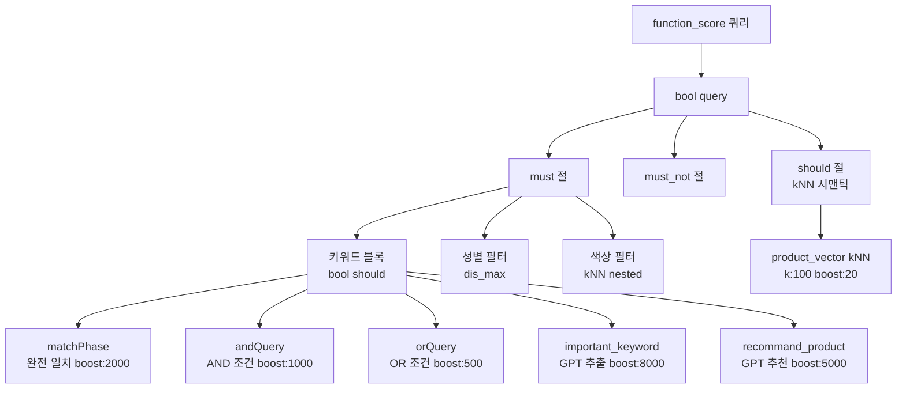

# 시맨틱 검색과 키워드 검색의 하이브리드 전략

"반팔 티셔츠"를 검색했을 때 어떤 기준으로 상품을 정렬해야 할까? 단순히 "반팔"과 "티셔츠"가 상품명에 포함된 순서대로 올리면 될까? 실제로는 그렇게 단순하지 않다. 브랜드 인지도가 높은 상품, 구매 전환율이 좋은 상품, 현재 계절에 맞는 상품, 그리고 검색어의 의미와 가장 가까운 상품이 상위에 와야 한다.

`x2bee-nest-search`는 이 문제를 키워드 검색과 시맨틱(벡터) 검색을 결합하는 방식으로 접근했다. 두 방식 각각의 한계를 보완하면서 OpenSearch의 `function_score`와 `knn` 쿼리를 조합한 하이브리드 구조가 어떻게 설계됐는지 정리한다.

## 두 방식의 특성과 한계

키워드 검색은 빠르고 예측 가능하다. "반팔 티셔츠"를 검색하면 해당 단어가 포함된 상품이 올라온다. 하지만 "여름에 입기 좋은 가벼운 옷"처럼 자연어로 검색하면 의미 있는 결과를 만들기 어렵다.

시맨틱 검색은 의미 기반이다. 검색어를 벡터로 변환하고, 벡터 공간에서 가까운 상품을 찾는다. "여름에 입기 좋은 가벼운 옷"이 "린넨 반팔 셔츠"나 "시원한 쉬폰 원피스"와 높은 유사도를 가질 수 있다. 하지만 정확한 단어 매칭이 필요한 경우 — 특정 브랜드명, 상품번호, 정확한 모델명 검색 — 에서는 키워드 검색보다 성능이 떨어진다.

둘 중 하나만 쓸 수 없다. 이커머스 검색은 두 방식이 모두 필요하다.

## 하이브리드 쿼리 구조

검색 쿼리의 최상위 구조는 OpenSearch의 `function_score`를 사용한다.



`must` 절에는 키워드 검색이, `should` 절에는 벡터 검색이 들어간다. `must`는 반드시 만족해야 하는 조건이지만, 여기서는 scoring 목적으로 사용했다. `must` 내의 `bool.should`는 OR 조건이므로 어느 하나라도 매칭되면 통과한다.

결과 점수는 키워드 매칭 점수 + kNN 유사도 점수의 합산이 된다. 어떤 상품이 키워드는 정확히 포함하지만 벡터 의미가 멀다면 키워드 점수만, 키워드는 부분적으로만 포함하지만 의미가 가깝다면 kNN 점수가 보완한다.

## Handlebars 템플릿으로 조건부 쿼리 생성

검색 조건에 따라 쿼리 구조가 바뀐다. 예를 들어 색상이 감지된 경우만 색상 kNN 블록이 들어가고, GPT 결과가 있는 경우만 `important_keyword` 블록이 활성화된다. 이것을 코드로 표현하면 조건문이 수십 줄이 된다.

Handlebars 템플릿으로 이 문제를 해결했다.

```handlebars
{{#if important_keyword}}
{
  "query_string": {
    "query": "{{important_keyword}}",
    "fields": ["goodsNmAnaly", "goodsNm"],
    "boost": 8000
  }
}
{{/if}}
{{#if recommand_product}},{{/if}}
{{#if recommand_product}}
  {
    "query_string": {
      "query": "{{recommand_product}}",
      "fields": ["goodsNmAnaly", "goodsNm"],
      "boost": 5000,
      "default_operator": "AND"
    }
  }
{{/if}}
```

`important_keyword`가 null이면 해당 블록 자체가 쿼리에 포함되지 않는다. 쉼표 처리도 `{{#if recommand_product}},{{/if}}`로 조건부로 붙인다. JSON 문법상 마지막 항목에 쉼표가 붙으면 오류가 나는데, 이를 Handlebars 헬퍼로 처리했다.

시맨틱 벡터 블록도 마찬가지다.

```handlebars
{{#if script_score.params}}
"should" : {
  "knn" : {
    "product_vector": {
      "vector": {{{json script_score.params}}},
      "k": 100,
      "boost" : 20
    }
  }
}
{{/if}}
```

`script_score.params`가 null이면(= 벡터 임베딩이 없거나 실패한 경우) `should` 절 자체가 빠진다. 벡터 서비스 장애 시 키워드 검색만으로 동작하는 자동 폴백이 구현된 셈이다.

## 부스트 점수 설계

하이브리드 검색에서 가장 중요한 튜닝 포인트는 부스트 점수 배분이다. 각 검색 유형에 얼마나 비중을 줄지를 결정한다.

```typescript
const templateData = {
  // 키워드 검색 부분
  matchPhase: combineQuery.matchPhaseQuery ? `"${combineQuery.matchPhaseQuery}"` : null,
  andQuery: combineQuery.andQuery,         // AND 조건: boost 1000
  orQuery: combineQuery.orQuery,           // OR 조건: boost 500
  FieldsQuery: combineQuery.FieldsQuery,   // 특수 필드: boost 1000

  // GPT 강화 검색 (키워드 검색이지만 가중치 최고)
  important_keyword: important_word,       // GPT 핵심 단어: boost 8000
  recommand_product: recommand_product_text, // GPT 추천 상품: boost 5000

  // 의미적 필터 (부스트 값이 조건에 따라 달라짐)
  boost_sex: isVerb || !important_word ? 1000 : 3000,
  boost_season: isVerb || !important_word ? 1000 : 10000,
  boost_color: color_similarity > 0.5 ? 50000 : 1,

  // 벡터 시맨틱 검색 (boost는 상대적으로 낮음)
  script_score: {
    params: null, // 실제로는 product_vector 값
  },
};
```

부스트 값 설계 의도:

| 검색 유형 | 부스트 | 의도 |
|-----------|--------|------|
| GPT 핵심 단어 | 8,000 | 가장 중요한 상품 키워드는 최우선 |
| GPT 추천 상품 | 5,000 | GPT가 제안한 관련 상품 |
| 원문 완전 일치 | 2,000 | 정확한 검색어 포함 |
| AND 쿼리 | 1,000 | 모든 단어 포함 |
| OR 쿼리 | 500 | 일부 단어 포함 |
| 색상 kNN | 20,000~50,000 | 색상이 명확한 경우 강하게 반영 |
| kNN 시맨틱 | 20 | 의미 보완 목적 |

kNN 시맨틱의 부스트가 20으로 낮은 이유는, kNN 점수 자체가 0~2 범위의 코사인 유사도 기반이라서 실제로는 0~40 정도의 contribution이 되기 때문이다. 반면 `query_string`의 점수는 TF-IDF 기반으로 수백~수천이 나올 수 있어 상대적으로 낮은 부스트를 줘도 균형이 맞는다.

## 검색어 유형별 처리 분기

"반팔 티셔츠"(키워드)와 "예쁜 반팔 원피스 추천해줘"(자연어)는 처리 방식이 달라야 한다.

```typescript
// 동사 판별로 자연어 여부 결정
const result = await this.analyzeSearchWordHasVerb(search_word);
const isVerb = result.hasVerb; // "추천해줘" → true

// 자연어(동사 포함)이면 GPT 건너뜀
if (!special) {
  gpt_search_word = await this.gptSearchWord(result.rawTokens);
}

// OR 쿼리 활성화 조건: 자연어가 아니고, GPT 결과가 있을 때
orQuery: isVerb || !important_word ? null : combineQuery?.orQuery,

// 부스트 강화: 자연어가 아니고 GPT 결과가 있을 때
boost_sex: isVerb || !important_word ? 1000 : 3000,
boost_season: isVerb || !important_word ? 1000 : 10000,
```

자연어 검색어에는 GPT와 OR 쿼리를 적용하지 않는다. "추천해줘"처럼 의미 없는 동사가 포함된 검색어에 GPT를 태우면 오히려 이상한 키워드가 추출되기 때문이다. 반면 "반팔 티셔츠"는 명사 위주라 GPT가 "반팔", "티셔츠", "반소매"처럼 유의어를 잘 추출해준다.

## 색상 kNN: Nested 구조의 도전

색상은 상품 자체에 붙은 속성이 아니라 색상 옵션별로 나뉜다. 빨간 재킷과 파란 재킷은 같은 상품번호지만 다른 색상이다. 이 구조를 OpenSearch Nested 타입으로 표현했다.

```json
{
  "colorText": [
    {
      "color_name": "RED",
      "sub_image_url": "/images/jacket_red.jpg",
      "color_vector": [0.12, -0.34, ...]
    },
    {
      "color_name": "BLUE",
      "sub_image_url": "/images/jacket_blue.jpg",
      "color_vector": [-0.05, 0.67, ...]
    }
  ]
}
```

검색 쿼리에서는 Nested kNN으로 색상 벡터를 검색하고, 매칭된 색상 옵션의 이미지를 `inner_hits`로 가져온다.

```handlebars
{{#if color_script_score.params}}
{
  "bool": {
    "should": [
      {
        "nested": {
          "path": "colorText",
          "query": {
            "knn": {
              "colorText.color_vector": {
                "vector": {{{json color_script_score.params}}},
                "k": 1000,
                "boost": 20000
              }
            }
          },
          "inner_hits": {
            "size": 1,
            "sort": [{"_score": {"order": "desc"}}],
            "_source": {
              "includes": ["colorText.color_name", "colorText.sub_image_url"]
            }
          }
        }
      },
      {
        "bool": {
          "must_not": {
            "exists": {
              "field": "colorText"
            }
          }
        }
      }
    ]
  }
}
{{/if}}
```

색상 데이터가 없는 상품도 제외되지 않도록 `must_not exists` 블록을 함께 넣었다. "빨간 티셔츠"로 검색할 때 색상 정보가 없는 티셔츠도 결과에 포함되어야 하기 때문이다.

응답에서 색상 데이터를 추출하는 코드:

```typescript
const searchData = this.data?.body?.hits?.hits?.map((hit, index) => {
  let d = hit._source;
  let c: any = {};
  if (hit?.inner_hits?.colorText?.hits?.hits.length > 0) {
    c.score = hit.inner_hits.colorText.hits.hits[0]._score;
    c.colorName = hit.inner_hits.colorText.hits.hits[0]._source.color_name;
    c.subImageUrl = hit.inner_hits.colorText.hits.hits[0]._source.sub_image_url;
  }
  d.colorDataList = c;
  return d;
});
```

가장 유사한 색상 옵션의 이미지 URL과 색상명을 `colorDataList`에 담아 프론트로 전달한다. "빨간 재킷"을 검색하면 검색 결과에 빨간 색상의 이미지가 우선 노출된다.

## 시행착오: 점수 균형 찾기

하이브리드 검색에서 가장 많은 시간을 쏟은 부분은 점수 균형이었다.

```
# 커밋: fix: softmax 점수 간격 벌리기
# 날짜: 2024-10-22 08:21
# 커밋: fix: 카테고리 점수 낮추기
# 날짜: 2024-10-21 19:09
# 커밋: fix: 성별 가중치 + 카테고리 가중치 조정
# 날짜: 2024-10-02 09:06
```

초기에는 카테고리 점수를 너무 높게 설정해서 "카테고리 정확도"는 높지만 "검색어 관련도"가 낮은 상품이 상위에 오는 문제가 생겼다. "티셔츠" 카테고리에 정확히 속하지만 "반팔"이 전혀 언급되지 않은 상품이 "반팔 원피스"보다 높은 점수를 받는 상황이었다.

반대로 kNN 시맨틱 점수를 너무 높이면 키워드 정확도가 떨어진다. "나이키 반팔"을 검색했을 때 "나이키"가 포함된 상품이 아니라 단순히 반팔 느낌의 상품이 올라오는 경우가 생겼다.

결론적으로 찾은 균형점은 **키워드 검색이 주, 시맨틱이 보완**이다. kNN의 부스트를 상대적으로 낮게 유지하고, 키워드 검색에서 의미를 강화하는 방향(GPT 키워드 추출, 동의어 처리)으로 품질을 높였다.

## 인덱스 필드 설계: 분석 버전 병행 저장

같은 텍스트를 원문과 형태소 분석 버전 두 가지로 저장하는 방식도 하이브리드 전략의 일부다.

```typescript
public opensearchGoodsFieldInfo = [
  { field: 'goodsNm', isNested: false },        // 원문
  { field: 'goodsNmAnaly', isNested: false },   // 형태소 분리 버전
  { field: 'schKwdNm', isNested: false },
  { field: 'schKwdNmAnaly', isNested: false },  // 형태소 분리 버전
  { field: 'brandNm', isNested: false },
  { field: 'brandNmAnaly', isNested: false },   // 형태소 분리 버전
];
```

"반팔티"를 검색할 때 원문 필드에서는 "반팔티"와 완전 일치하는 상품이 우선 매칭되고, 형태소 분석 필드에서는 "반팔 + 티"로 분리되어 "반팔 티셔츠"나 "반팔 원피스"도 매칭된다.

쿼리에서는 두 필드를 동시에 검색한다.

```typescript
// rankingQuery 함수에서 attNm 배열 구성
const attNm = ['goodsNm', 'goodsNmAnaly', 'schKwdNm', 'schKwdNmAnaly', 'brandNm'];
```

`query_string`의 `fields` 배열에 두 필드를 모두 넣어 어느 쪽에서든 매칭되면 결과에 포함시킨다.

## 결과: 하이브리드의 효과

단순 키워드 검색에서 하이브리드로 전환한 결과는 검색 로그에서 확인할 수 있었다. 기존에 검색 결과가 0개이거나 1~2개 수준이었던 쿼리들 — "여름 파티 드레스", "출근 가방 추천", "남자친구 선물" — 에서 관련 상품이 올라오기 시작했다.

특히 색상 kNN이 적용된 이후 "빨간 아이템"이나 "네이비 코트" 같은 색상+카테고리 조합 검색에서 눈에 띄는 개선이 있었다. 색상 인식 없이는 "빨간"이라는 키워드가 상품명에 없으면 결과가 0개였는데, 색상 벡터 검색으로 실제 빨간색 상품들이 올라오게 됐다.

아쉬운 점은 kNN 검색이 인덱스 크기가 커질수록 응답 시간에 영향을 준다는 것이다. 수백만 개 상품에 벡터 인덱스가 붙으면 kNN 쿼리가 수백 밀리초를 차지할 수 있다. 이를 위해 `k` 값을 100으로 제한하고 `should` 절에 넣어 필수 조건이 아닌 보완 조건으로만 동작하게 했다.
