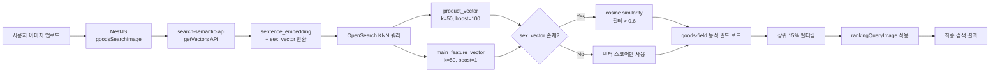

# 이미지 기반 상품 검색: NestJS 통합 구현기

이미지로 상품을 검색하는 기능은 이커머스에서 강력한 사용자 경험을 만든다. 사용자가 마음에 드는 옷 사진을 올리면 비슷한 상품을 찾아주는 것 — 이 기능의 AI 백엔드(OWL-ViT 객체 탐지, ViT 벡터화, 배경 제거)는 이미 Python FastAPI 서비스(search-semantic-api)로 구현된 상태였다. 남은 과제는 이 AI 파이프라인을 NestJS 검색 엔진(x2bee-nest-search)에 통합하여, 텍스트 검색과 동일한 품질의 검색 경험을 제공하는 것이었다.

2024년 7월 최초 구현부터 9월 전용 랭킹 분리까지, 약 2개월간 8번의 커밋을 거치며 이미지 검색 API를 구축한 과정을 정리한다.

## 배경: AI 파이프라인과 검색 엔진의 간극

search-semantic-api에서 제공하는 이미지 관련 API는 4개였다.

| API 엔드포인트 | 기능 | 모델 |
|--------------|------|------|
| `/api/ai/v1/imageDetection` | 이미지 내 의류 객체 탐지 + 벡터화 | OWL-ViT + ViT |
| `/api/ai/v1/vectorizeImage` | 단일 이미지 -> 벡터 | ViT (vit-base-patch16-224-in21k) |
| `/api/ai/v1/getVectors` | 텍스트 -> 문장 임베딩 + 성별 벡터 | KoSimCSE-roberta |
| `/api/ai/v1/vectorizeKeyword` | 키워드 -> 벡터 | KoSimCSE-roberta |

문제는 이 API들이 벡터를 반환할 뿐, 검색 자체는 수행하지 않는다는 점이었다. 벡터를 받아서 OpenSearch에 KNN 쿼리를 날리고, 결과를 필터링하고, 랭킹하고, 페이지네이션하는 건 NestJS 검색 엔진의 몫이었다.

## 전체 아키텍처



핵심 설계 포인트는 세 가지다.

1. **이중 벡터 검색**: `product_vector`(상품 이미지 벡터)와 `main_feature_vector`(대표 이미지 벡터)를 must/should로 결합
2. **성별 벡터 필터링**: 텍스트에서 추출한 성별 정보를 cosine similarity로 점수에 반영
3. **상위 15% 전략**: KNN 전체 결과에서 유사도 상위 15%만 반환하여 노이즈 제거

## 시행착오 타임라인

### Phase 1: 단순 프록시 방식 (2024-07-23)

최초 구현은 극도로 단순했다. NestJS에서 Python API를 호출하고 결과를 그대로 반환하는 프록시 방식이었다.

```typescript
// 커밋: feat: image 검색 추가
// 날짜: 2024-07-23 17:33

// search-semantic-api의 searchKeywords 엔드포인트 직접 호출
const response = await axios.post(
  'http://localhost:5001/api/ai/v1/searchKeywords',
  { keyword: searchWord },
);
return response.data;
```

이 방식의 문제는 명확했다. Python 서비스에서 OpenSearch 검색까지 수행하다 보니, NestJS 검색 엔진의 정교한 필터링(사이트별, 입점사별, 카테고리별)이 적용되지 않았다. 이미지 검색 결과가 텍스트 검색 결과와 완전히 다른 형태로 나오는 불일치 문제도 있었다.

### Phase 2: KNN 직접 쿼리 전환 (2024-07-29)

프록시 방식을 폐기하고, Python API에서는 벡터만 받아오고 OpenSearch 검색은 NestJS에서 직접 수행하는 방식으로 전환했다.

```typescript
// 커밋: fix: search image field vector 검색 하드코딩 추가
// 날짜: 2024-07-29 18:23

// 1. Python API에서 벡터 추출
const vectorResponse = await axios.post(
  'https://search-python.x2bee.com/api/ai/v1/getVectors',
  { keyword: searchWord },
);
const sentenceEmbedding = vectorResponse.data.sentence_embedding;
const sexVector = vectorResponse.data.sex_vector;

// 2. OpenSearch KNN 쿼리 직접 구성
const knnQuery = {
  knn: {
    product_vector: {
      vector: sentenceEmbedding,
      k: 50,
    },
  },
};

// 3. 성별 벡터 script_score 추가
const scriptScore = {
  script_score: {
    query: { match_all: {} },
    script: {
      source: `
        double cosineSim = cosineSimilarity(
          params.sexVector, doc['sub_feature_vector']
        );
        return cosineSim > 0.6 ? (cosineSim + 1.0) / 2.0 : 0;
      `,
      params: { sexVector },
    },
  },
};
```

이 커밋에서 `goods-field` 인덱스에서 필드 정보를 동적으로 로드하는 방식도 도입됐다. 하드코딩된 필드명 대신, 인덱스 메타데이터에서 검색 가능한 필드 목록을 가져와 쿼리를 구성한다.

### Phase 3: 상위 15% 필터링 (2024-07-30)

KNN 검색 결과 전체를 반환하니 하위 결과에 노이즈가 심했다. 벡터 유사도가 낮은 상품들이 결과에 포함되면서 검색 품질이 떨어졌다.

```typescript
// 커밋: fix: 이미지 검색시 15% 출력으로 수정
// 날짜: 2024-07-30 17:03

const totalCount = data?.body?.hits?.total?.value ?? 0;
const topPercentage = 0.15;
const topCount = Math.ceil(totalCount * topPercentage);
const topSearchData = searchData.slice(0, topCount);
```

왜 하드 임계값(예: cosine similarity > 0.7)이 아니라 비율 기반 필터링을 선택했을까? KNN 검색 결과의 score 분포는 쿼리마다 크게 달라진다. 흰색 티셔츠를 검색하면 유사한 상품이 많아 상위 score가 높지만, 독특한 패턴의 원피스를 검색하면 전체적으로 score가 낮다. 고정 임계값을 사용하면 후자의 경우 결과가 0개가 될 수 있다. 비율 기반이면 항상 의미 있는 양의 결과를 보장한다.

### Phase 4: 대규모 리팩토링 (2024-08-12)

이미지 검색 로직이 복잡해지면서 단일 메서드에 모든 로직이 들어있는 상태가 됐다. 코드를 기능 단위로 분리하는 리팩토링을 수행했다.

```typescript
// 커밋: fix: search-image 리팩토링
// 날짜: 2024-08-12 13:23

// 분리된 함수들:
// 1. createQueryObject_image() - 이미지 검색 전용 쿼리 오브젝트
// 2. opensearch_default_obj_image() - 이미지 검색 전용 기본 템플릿
// 3. getQuery2_image() - KNN 이중 벡터 검색 쿼리 빌더
// 4. handleTextField() - 필드 타입별 쿼리 생성
// 5. addSexVectorScript() - 성별 벡터 스크립트 함수
// 6. processFieldData() - Promise.all 병렬 처리
```

가장 중요한 변경은 **이중 벡터 검색**의 도입이다.

```typescript
// getQuery2_image의 knn 케이스
case 'knn':
  query = {
    bool: {
      must: [{
        knn: {
          product_vector: {
            vector: searchData,
            k: 50,
            boost: 100,     // 상품별 이미지 벡터 (주 검색)
          },
        },
      }],
      should: [{
        knn: {
          main_feature_vector: {
            vector: searchData,
            k: 50,
            boost: 1,       // 대표 이미지 벡터 (보조)
          },
        },
      }],
    },
  };
  break;
```

`product_vector`는 개별 상품 이미지에서 추출한 벡터이고, `main_feature_vector`는 상품 카테고리의 대표 이미지 벡터다. `product_vector`에 100배 높은 boost를 주어 개별 상품 유사도를 최우선으로 하되, `main_feature_vector`를 should 절에 넣어 카테고리 수준의 유사성도 약간 반영하는 구조다.

### Phase 5: 필터링 개선 (2024-08-27)

이미지 검색에도 텍스트 기반 필터(카테고리, 브랜드, 가격대)를 적용할 수 있도록 개선했다.

```typescript
// 커밋: feat: filter 안되는 현상 개선 및 이미지 검색 시 디폴트 like 검색 추가
// 날짜: 2024-08-27 14:58

// mustFilterQuery 분리 + dis_max 쿼리 적용
const mustFilterQuery = [];
if (filters && filters.length > 0) {
  filters.forEach(filter => {
    mustFilterQuery.push({
      match_phrase: {
        [filter.key]: filter.value,
      },
    });
  });
}

// 이미지 + 텍스트 하이브리드: dis_max로 결합
const disMaxQuery = {
  dis_max: {
    queries: [
      knnQuery,          // 이미지 벡터 유사도
      ...mustFilterQuery, // 텍스트 필터 조건
    ],
  },
};
```

이미지만으로 검색하는 경우와, 이미지 + 키워드를 함께 사용하는 경우를 `dis_max`로 결합했다. 사용자가 이미지와 함께 "빨간색"이라는 키워드를 입력하면, 이미지 유사도와 키워드 매칭 중 높은 점수를 취하는 방식이다.

### Phase 6: 전용 랭킹 분리 (2024-09-12, 09-24)

이미지 검색과 텍스트 검색은 랭킹 전략이 달라야 한다는 결론에 도달했다. 텍스트 검색에서는 `goodsNm`(상품명) 매칭이 핵심이지만, 이미지 검색에서는 상품명이 사실상 무의미하다. 이미지로 검색하는 사용자는 "이것과 비슷한 걸 찾아줘"이지, "이 이름의 상품을 찾아줘"가 아니기 때문이다.

```typescript
// 커밋: fix: 랭킹모델 이미지 분리(goodsNm)
// 날짜: 2024-09-12 07:47

public async rankingQueryImage(allSearchWords) {
  // goodsNm 필드를 제외한 랭킹 쿼리 생성
  const fields = allSearchWords.map(word => {
    return {
      originMatchPhaseQuery: `\"${word.token}\"`,
      andQuery: word.token,
      orQuery: word.synonyms.length > 0
        ? word.synonyms.join(' OR ')
        : word.token,
      likeQuery: `*${word.token}*`,
    };
  });

  // attNm 필드에서 goodsNm 제외
  const attNm = this.fieldData
    .filter(f => f.fieldName !== 'goodsNm')
    .map(f => f.fieldName);

  return { fields, attNm };
}
```

```typescript
// 커밋: fix: image 메서드를 이미지 검색용 메서드로 변경
// 날짜: 2024-09-24 20:31

// 기존 rankingQuery() 호출을 rankingQueryImage()로 교체
const combineQuery = await this.rankingQueryImage(this.allSearchWords);
```

이 분리로 이미지 검색의 정확도가 크게 향상됐다. 이전에는 상품명에 포함된 키워드 때문에 이미지와 전혀 무관한 상품이 상위에 올라오는 경우가 있었는데, goodsNm을 랭킹에서 제외하니 순수하게 이미지 유사도 기반으로 결과가 정렬됐다.

## 핵심 구현 상세

### 성별 벡터 cosine similarity 스크립트

이미지 검색에서도 성별 필터링이 중요하다. "남성 자켓"을 검색하면 남성용 자켓이 우선되어야 한다. search-semantic-api의 `getVectors` API는 검색어에서 성별 정보를 감지하여 별도의 `sex_vector`를 반환한다.

```python
# search-semantic-api의 text_service.py
gender_pattern = re.compile(
  r"\b남성|\b여성|\b남자|\b여자|\b남|\b여\b", re.IGNORECASE
)

def get_weighted_sentence_embedding(sentence):
    gender_match = gender_pattern.search(sentence)
    if gender_match:
        if "남" in gender_match.group():
            sex_vector_text = "남성"
        elif "여" in gender_match.group():
            sex_vector_text = "여성"

    # 성별 벡터 생성 (KoSimCSE-roberta)
    sex_inputs = model_service.tokenizer(sex_vector_text, return_tensors="pt")
    with torch.no_grad():
        sex_outputs = model_service.labse_model(**sex_inputs)
    sex_vector = sex_outputs.last_hidden_state.mean(dim=1).squeeze().numpy()

    return sentence_embedding, sex_vector
```

NestJS에서는 이 sex_vector를 OpenSearch의 Painless 스크립트로 매칭한다.

```typescript
private addSexVectorScript(template: any, sexVector: number[]) {
  if (!sexVector || sexVector.length === 0) return;

  template.body.query = {
    function_score: {
      query: template.body.query,
      functions: [{
        script_score: {
          script: {
            source: `
              double cosineSim = cosineSimilarity(
                params.sexVector,
                doc['sub_feature_vector']
              );
              return cosineSim > 0.6
                ? (cosineSim + 1.0) / 2.0
                : 0;
            `,
            params: { sexVector },
          },
        },
      }],
      score_mode: 'multiply',
      boost_mode: 'multiply',
      min_score: 0.001,
    },
  };
}
```

임계값 0.6의 의미 — cosine similarity가 0.6 미만이면 성별 매칭이 불확실하므로 0점을 반환한다. 0.6 이상이면 `(similarity + 1.0) / 2.0`으로 0.8~1.0 범위의 점수를 만들어 원래 검색 점수에 곱한다. `score_mode: 'multiply'`이므로 성별이 매칭되지 않는 상품은 점수가 0으로 수렴한다.

### goods-field 동적 필드 로딩

이미지 검색 쿼리를 구성할 때, 어떤 필드를 검색 대상에 포함할지를 하드코딩하지 않고 `goods-field` 인덱스에서 동적으로 로드한다.

```typescript
public async loadQueryFieldsAndCheckDataExistence(
  fieldIndexName: string,
  searchType: string,
) {
  let fieldTemplate =
    this.queryUtilService.createQueryObject_image(fieldIndexName);

  const fieldExists = await this.opensearchClient.indices.exists({
    index: fieldIndexName,
  });

  const fieldData = fieldExists.body
    ? await this.opensearchClient.search(fieldTemplate)
    : null;

  const isSearchDataExists = fieldExists.body &&
    fieldData?.body?.hits?.total?.value > 0;

  return { fieldData, isSearchDataExists };
}
```

`goods-field` 인덱스에는 검색 가능한 필드 목록, 각 필드의 타입(text, keyword, knn 등), boost 값 등이 저장되어 있다. 관리자가 이 인덱스를 업데이트하면 검색 쿼리에 자동으로 반영된다. 새로운 필드를 검색 대상에 추가하거나 boost를 조정할 때 코드 변경 없이 처리할 수 있는 구조다.

### processFieldData: 비동기 병렬 처리

동적으로 로드한 필드 데이터를 기반으로 OpenSearch 쿼리를 구성하는 과정을 `Promise.all`로 병렬화했다.

```typescript
private async processFieldData(
  fieldData: any[],
  searchData: number[],
  sexVector: number[],
) {
  const queryParts = await Promise.all(
    fieldData.map(async (field) => {
      switch (field.fieldType) {
        case 'knn':
          return this.getQuery2_image(
            'knn', field.fieldName, searchData
          );
        case 'text':
          return this.handleTextField(field);
        case 'script_score':
          return this.addSexVectorScript(field, sexVector);
        default:
          return null;
      }
    })
  );

  return queryParts.filter(Boolean);
}
```

필드가 10개이면 10개의 쿼리 파트를 동시에 구성한다. 각 파트는 독립적이므로 순차 처리할 이유가 없다.

### 카테고리 스코어 임계값 조정

이미지 검색에서 카테고리 매칭 임계값도 튜닝 대상이었다.

```typescript
// 커밋: fix: image 메서드를 이미지 검색용 메서드로 변경
// 날짜: 2024-09-24 20:31

// 카테고리 스코어 임계값: 0.003 -> 0.005
const categoryThreshold = 0.005;
smallCategories = categories
  .filter(({ score }) => score > categoryThreshold)
  .map(({ id, score }) => ({
    id,
    score: score * 10000,
  }));
```

임계값을 0.003에서 0.005로 올린 이유는, 낮은 임계값에서는 관련 없는 카테고리가 포함되어 검색 결과에 노이즈를 만들었기 때문이다. 이미지 검색은 텍스트 검색보다 카테고리 정확도가 낮은 경향이 있어(이미지에서 카테고리를 추론하므로) 더 엄격한 임계값이 필요했다.

## 트러블슈팅

### 인덱스명 혼란

개발 과정에서 인덱스명이 여러 번 변경됐다.

```
# 커밋: fix: semantic-goods-ko로 인덱스변경
# 날짜: 2024-09-12

# 커밋: fix: 인덱스명 coup-son-ko로 변경
# 날짜: 2024-09-26
```

`ailabs-goods` -> `ailabs-goods-ko` -> `semantic-goods-ko` -> `coup-son-ko` — 약 2개월간 4번의 인덱스명 변경이 있었다. 원인은 인덱스 설계가 진화하면서 매핑이 호환되지 않아 새 인덱스를 만들어야 했기 때문이다. OpenSearch에서는 기존 인덱스의 매핑을 변경할 수 없으므로(필드 추가는 가능하지만 타입 변경은 불가), 벡터 차원이나 필드 구조가 바뀔 때마다 새 인덱스가 필요했다.

이 경험을 통해 인덱스명에 버전을 포함하는 규칙(`{project}-{env}-{index}-v2` 형태)과, 인덱스 별칭(alias)을 사용하는 패턴을 도입하게 됐다.

### 벡터 차원 불일치

이미지 벡터(ViT: 768차원)와 텍스트 벡터(KoSimCSE: 768차원)의 차원이 같아서 같은 필드에 저장할 수 있었지만, `sex_vector`는 별도의 `sub_feature_vector` 필드가 필요했다. 초기에 모든 벡터를 하나의 필드에 넣으려다 차원 불일치 에러가 발생했고, 용도별로 필드를 분리하는 방향으로 해결했다.

| 벡터 필드 | 차원 | 용도 | 소스 모델 |
|-----------|------|------|----------|
| `product_vector` | 768 | 상품 이미지/텍스트 유사도 | ViT / KoSimCSE |
| `main_feature_vector` | 768 | 대표 이미지 유사도 | ViT |
| `sub_feature_vector` | 768 | 성별 특성 매칭 | KoSimCSE |

### goodsNm 랭킹 간섭

이미지 검색의 정확도를 떨어뜨린 가장 큰 원인은 텍스트 랭킹의 간섭이었다. 이미지로 "검은 자켓"을 검색하면 벡터 유사도는 높은데, goodsNm에 "자켓"이 포함된 전혀 다른 스타일의 상품이 텍스트 랭킹 boost 때문에 상위에 올라오는 현상이었다.

`rankingQueryImage`에서 goodsNm을 제외함으로써 해결했지만, 이 문제를 인지하기까지 약 6주(7/29 ~ 9/12)가 걸렸다. 처음에는 벡터 품질 문제로 생각했으나, 로그를 분석하니 OpenSearch의 `_explain` API에서 goodsNm 매칭의 boost가 벡터 스코어를 압도하는 것을 확인할 수 있었다.

## 사용 모델 정리

이미지 검색 파이프라인에서 사용하는 모델은 총 4개다.

| 모델 | 역할 | 서비스 |
|------|------|--------|
| `google/owlvit-base-patch32` | Open-Vocabulary Detection: 이미지 내 의류 12개 카테고리 탐지 | search-semantic-api |
| `google/vit-base-patch16-224-in21k` | Vision Transformer: 이미지 -> 768차원 벡터 | search-semantic-api |
| `BM-K/KoSimCSE-roberta-multitask` | 한국어 문장 임베딩 + 성별 벡터 | search-semantic-api |
| `ResNet50 (IMAGENET1K_V2)` | 이미지 분류 (카테고리 예측) | search-semantic-api |

NestJS 검색 엔진은 이 모델들을 직접 실행하지 않는다. Python API를 통해 벡터를 받아오고, OpenSearch에 대한 검색 쿼리 구성과 결과 후처리만 담당한다. 이 역할 분리가 각 서비스의 책임을 명확히 하고, 독립적인 스케일링을 가능하게 한다.

## 결과 및 회고

약 2개월간의 이미지 검색 통합을 통해 배운 교훈들을 정리한다.

**프록시에서 직접 쿼리로**: 초기 프록시 방식은 빠르게 프로토타입을 만들기에 좋았지만, 운영 수준의 필터링과 랭킹을 적용하려면 검색 엔진에서 직접 쿼리를 제어해야 했다. AI 서비스에서는 벡터만 받아오고, 검색 로직은 검색 엔진이 소유하는 아키텍처가 올바른 방향이었다.

**이중 벡터 검색**: product_vector(boost=100)와 main_feature_vector(boost=1)의 must/should 조합은 단일 벡터 검색보다 더 나은 결과를 만들었다. 개별 상품의 정확한 매칭을 최우선으로 하면서도 카테고리 수준의 연관성을 보조적으로 반영하는 전략이다.

**상위 15% 전략**: 고정 임계값 대신 비율 기반 필터링이 다양한 쿼리에 대해 안정적인 결과를 보장한다. 벡터 검색의 score 분포는 쿼리마다 크게 다르므로, 절대값 기반 필터링은 위험하다.

**랭킹 분리**: 이미지 검색과 텍스트 검색은 다른 랭킹 전략이 필요하다. goodsNm 하나를 랭킹에서 제외한 것만으로도 이미지 검색 정확도가 크게 향상됐다. 검색 모달리티(텍스트, 이미지, 하이브리드)별로 랭킹 전략을 분리하는 것이 정답이었다.
