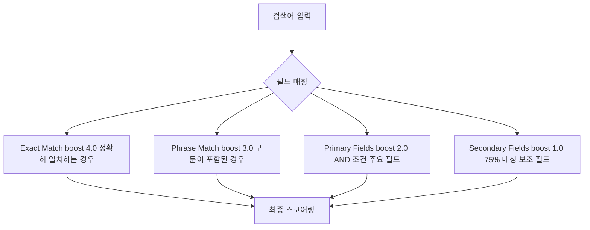
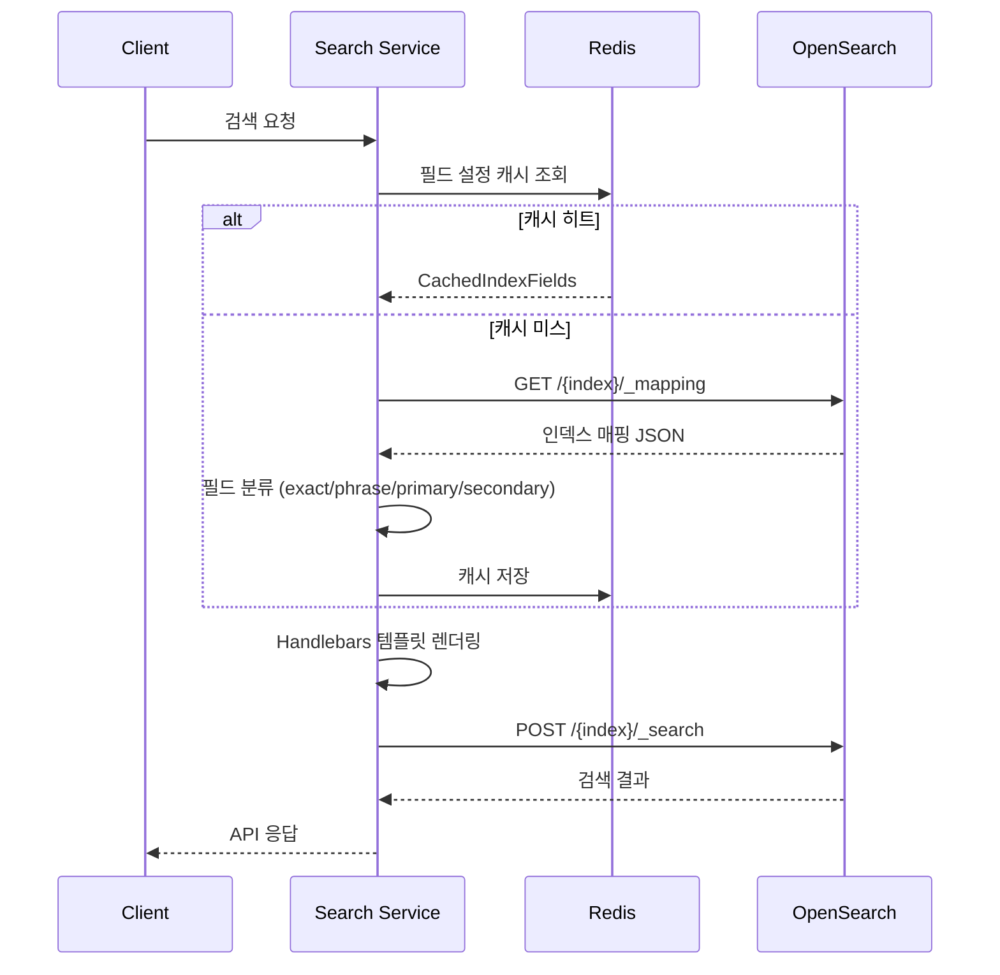
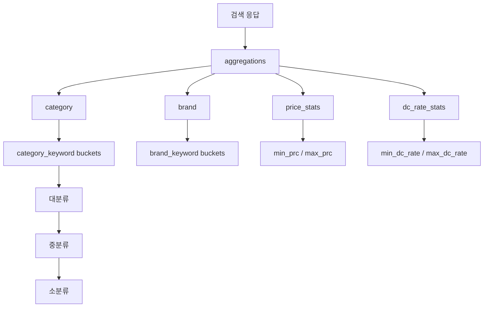

# Axum + OpenSearch: Rust 검색 API 아키텍처 설계

## 개요

Rust로 커머스 검색 엔진의 기본 구조를 잡은 후, 본격적으로 검색 API를 설계하고 구현하는 단계에 진입했다. 검색 API는 단순히 키워드를 받아 결과를 반환하는 것이 아니다. 커머스 검색에서는 상품명, 브랜드명, 카테고리, 이벤트, 마케팅 데이터 등 서로 다른 인덱스를 대상으로, 필드별 가중치가 다른 복합 쿼리를 실행하고, Aggregation으로 필터 데이터를 추출하며, 인기 검색어와 추천 검색어까지 처리해야 한다.

NestJS 버전에서는 이 복잡한 쿼리 로직이 서비스 코드 안에 하드코딩되어 있었다. 검색 품질을 튜닝할 때마다 코드를 수정하고 배포해야 했으며, 인덱스 타입별로 비슷하지만 미묘하게 다른 쿼리 빌더가 난립했다. Rust 버전에서는 이 문제를 Handlebars 템플릿 엔진으로 해결하고, 필드 설정을 OpenSearch 매핑에서 동적으로 추출하는 자가 적응(self-adaptive) 방식을 도입했다.

## 검색 API 라우트 설계

검색 라우트는 단일 엔드포인트로 통합했다. 인덱스 이름과 검색 파라미터를 받아 범용적으로 동작하는 구조다.

```rust
pub fn search_routes() -> Router {
    Router::new()
        .route("/api/search", post(handle_search))
        .route("/api/search/:index_name", get(handle_search_get))
}
```

검색 파라미터는 `SearchParams` 구조체로 정의했다. 커머스 검색에 필요한 모든 조건을 포함한다.

```rust
pub struct SearchParams {
    pub indexName: String,        // 대상 인덱스 (goods, marketing, event)
    pub searchWord: String,       // 검색 키워드
    pub size: usize,              // 결과 수
    pub from: usize,              // 페이지 오프셋
    pub aggregation: bool,        // Aggregation 포함 여부
    pub filters: Option<Value>,   // 동적 필터 조건
    pub sort: Option<String>,     // 정렬 기준
}
```

`indexName` 필드명이 camelCase인 이유는 프론트엔드와의 호환성 때문이다. Rust의 네이밍 컨벤션(snake_case)과 충돌하지만, serde의 `#[serde(rename)]`보다는 프론트엔드 개발자와의 소통 비용을 줄이는 것이 더 중요하다고 판단했다. 실제로 NestJS 버전과 동일한 API 스펙을 유지함으로써 프론트엔드 수정 없이 백엔드만 교체할 수 있었다.

## Handlebars 템플릿 기반 쿼리 생성

OpenSearch 쿼리는 JSON 형태이지만, 검색 조건에 따라 동적으로 구성되어야 한다. 예를 들어 상품 검색 쿼리는 다음과 같은 요소를 조합한다.

- 검색어가 있을 때와 없을 때 (match_all vs multi_match)
- exact match, phrase match, most_fields match의 가중치 분배
- 카테고리, 브랜드, 가격 범위 등의 필터 조건
- Aggregation (카테고리별 상품 수, 가격 범위 등)

이 조합의 경우의 수가 수십 가지에 달하므로, 코드로 쿼리를 빌딩하면 유지보수가 불가능해진다. Handlebars 템플릿을 도입해 쿼리 구조를 선언적으로 정의했다.

```handlebars
{{! goods_search_template.hbs }}
{
    "size": {{size}},
    "from": {{from}},
    "track_total_hits": true,
    "sort": [{ "_score": "desc" }],
    "query": {
        "bool": {
            {{#if searchWord}}
            "should": [
                {{#if exactFields}}
                {
                    "multi_match": {
                        "query": "{{searchWord}}",
                        "fields": {{json exactFields}},
                        "type": "phrase",
                        "boost": 4.0
                    }
                },
                {{/if}}
                {{#if phraseFields}}
                {
                    "multi_match": {
                        "query": "{{searchWord}}",
                        "fields": {{json phraseFields}},
                        "type": "phrase",
                        "boost": 3.0
                    }
                },
                {{/if}}
                {{#if primaryFields}}
                {
                    "multi_match": {
                        "query": "{{searchWord}}",
                        "fields": {{json primaryFields}},
                        "type": "most_fields",
                        "operator": "and",
                        "boost": 2.0
                    }
                },
                {{/if}}
                {{#if secondaryFields}}
                {
                    "multi_match": {
                        "query": "{{searchWord}}",
                        "fields": {{json secondaryFields}},
                        "type": "most_fields",
                        "minimum_should_match": "75%",
                        "boost": 1.0
                    }
                }
                {{/if}}
            ],
            "minimum_should_match": 1,
            {{else}}
            "must": [{ "match_all": {} }],
            {{/if}}
            "filter": [ ... ]
        }
    }
}
```

이 템플릿의 핵심은 4단계 가중치 시스템이다.



**Exact Match (boost 4.0)**: 검색어가 필드 값과 정확히 일치할 때 가장 높은 점수를 부여한다. "나이키 에어맥스"를 검색했을 때 상품명이 정확히 "나이키 에어맥스"인 상품이 최상위에 노출된다.

**Phrase Match (boost 3.0)**: 검색어가 필드 값 내에 구문으로 포함될 때. "나이키 에어맥스 90 리미티드 에디션"처럼 검색어를 포함하는 긴 상품명이 해당된다.

**Primary Fields (boost 2.0)**: AND 조건으로 검색어의 모든 토큰이 포함된 경우. 검색어가 "나이키 운동화"일 때 "나이키"와 "운동화" 모두 포함하는 상품.

**Secondary Fields (boost 1.0)**: 75% 이상의 토큰이 매칭되는 경우. 검색어의 일부만 일치해도 결과에 포함되며, 재현율(recall)을 높이는 역할을 한다.

이 가중치 구조는 NestJS 버전에서 수개월간 A/B 테스트를 거쳐 최적화한 값이다. Rust 버전에서는 이를 그대로 가져왔되, 템플릿 파일에서 관리하므로 가중치 변경 시 코드 수정 없이 템플릿만 편집하면 된다.

## 동적 필드 발견 시스템

가장 혁신적인 부분은 검색 필드를 하드코딩하지 않고 OpenSearch 인덱스 매핑에서 동적으로 추출하는 시스템이다.

```rust
async fn get_index_fields_from_db(index_name: &str) -> IndexFields {
    let index_type = extract_index_type(index_name);
    
    // 1. Redis 캐시에서 먼저 조회
    match get_cached_field_config(index_name, &index_type).await {
        Ok(Some(cached_fields)) => {
            return IndexFields::from(cached_fields);
        }
        Ok(None) => { /* 캐시 미스 */ }
        Err(e) => { warn!("Cache lookup failed: {}", e); }
    }
    
    // 2. 캐시 미스 시 OpenSearch에서 매핑 조회
    let mapping = client.indices()
        .get_mapping(IndicesGetMappingParts::Index(&[index_name]))
        .send()
        .await;
    
    // 3. 매핑에서 필드 타입별 분류
    let fields = classify_fields_from_mapping(mapping);
    
    // 4. Redis에 캐싱
    cache_field_config(index_name, &index_type, &fields).await;
    
    fields
}
```

이 시스템의 동작 흐름은 다음과 같다.



필드 분류 로직은 OpenSearch 매핑의 필드 타입과 분석기(analyzer) 설정을 기반으로 한다.

- `keyword` 타입 또는 `.exact` 서브필드가 있는 필드 → `exact_fields`
- `text` 타입 + `nori_analyzer` → `phrase_fields`
- `text` 타입 + 높은 `boost` 설정 → `primary_fields`
- 나머지 `text` 타입 필드 → `secondary_fields`

이 방식의 장점은 새로운 필드를 인덱스에 추가하면 검색 API가 자동으로 해당 필드를 검색 대상에 포함한다는 것이다. NestJS 버전에서는 필드를 추가할 때마다 쿼리 빌더 코드를 수정해야 했다.

## Redis 캐시 네임스페이스 설계

Redis 캐시는 네임스페이스를 체계적으로 설계했다.

```rust
const CACHE_NAMESPACE: &str = "search_rust";
const FIELD_CONFIG_PREFIX: &str = "field_config";

// 키 구조:
// search_rust:field_config:{index_name}:{index_type}
// 예: search_rust:field_config:test-local-goods-ko:goods
```

캐시 구조체에는 캐시 생성 시간을 포함해, TTL 기반이 아닌 명시적 무효화가 가능하도록 했다.

```rust
#[derive(Debug, Clone, Serialize, Deserialize)]
pub struct CachedIndexFields {
    pub title_field: Vec<String>,
    pub exact_fields: Vec<String>,
    pub and_fields: Vec<String>,
    pub or_fields: Vec<String>,
    pub like_fields: Vec<String>,
    pub analyze_fields: Vec<String>,
    pub cached_at: u64,
}
```

`like_fields`와 `analyze_fields`는 현재 사용하지 않지만 호환성을 위해 남겨두었다. 이전 버전의 캐시 데이터와 혼재될 수 있는 상황을 고려한 결정이다. 새로운 시스템을 배포할 때 기존 캐시를 전부 삭제하지 않아도 되므로 무중단 배포가 가능하다.

## Aggregation 처리

커머스 검색에서 Aggregation은 필터 UI를 구성하는 데 필수적이다. 카테고리별 상품 수, 브랜드 목록, 가격 범위, 할인율 범위 등을 검색 결과와 함께 반환해야 한다.

```rust
pub fn process_aggregation_data(aggregations: &Value) -> Value {
    let mut payload = json!({});

    // 카테고리 데이터
    payload["categoryDataList"] = process_category_data(aggregations);
    
    // 대분류 카테고리
    payload["lrgCtgGrpData"] = process_lrg_category_data(aggregations);
    
    // 브랜드 데이터
    payload["brandDataList"] = process_brand_data(aggregations);
    
    // 연관어 데이터
    payload["assocwordDataList"] = process_assocword_data(aggregations);
    
    // 가격/할인율 범위
    payload["minPrc"] = process_min_prc(aggregations);
    payload["maxPrc"] = process_max_prc(aggregations);
    payload["minDcRate"] = process_min_dc_rate(aggregations);
    payload["maxDcRate"] = process_max_dc_rate(aggregations);

    payload
}
```

각 Aggregation 처리 함수는 OpenSearch 응답의 중첩 구조를 평탄화한다. 특히 카테고리 데이터는 nested aggregation으로 처리되는데, 3단계 깊이의 카테고리 구조(대분류 → 중분류 → 소분류)를 효율적으로 추출해야 한다.



Aggregation 처리에서 가장 까다로운 부분은 nested 필드다. 커머스 데이터에서 카테고리는 상품 하나에 여러 개가 매핑될 수 있으므로 nested 타입으로 인덱싱한다. 이때 Aggregation도 nested aggregation으로 작성해야 정확한 카운트가 나온다.

```json
{
    "nested": {
        "path": "dispCtgNo",
        "query": {
            "terms": {
                "dispCtgNo.lrgCtgNo.keyword": ["100", "200"]
            }
        }
    }
}
```

## 인기 검색어와 추천 검색어

커머스 검색에서 인기 검색어(popupword)와 추천 검색어(recomword)는 일반 검색과 다른 처리 로직이 필요하다.

인기 검색어는 최근 48시간 이내의 검색 로그를 기반으로 집계한다. OpenSearch의 terms aggregation과 date range filter를 결합하여 실시간에 가까운 인기 검색어를 추출한다.

```rust
fn process_popupword_result(search_result: &Value) -> Result<Value, Box<dyn Error + Send + Sync>> {
    let aggregations = search_result
        .get("aggregations")
        .ok_or("No aggregations found")?;
    
    let popular_terms = aggregations
        .get("popular_terms")
        .and_then(|v| v.get("buckets"))
        .and_then(|v| v.as_array())
        .ok_or("No popular terms found")?;
    
    // 버킷을 순위 형태로 변환
    let ranked_terms: Vec<Value> = popular_terms.iter()
        .enumerate()
        .map(|(rank, bucket)| {
            json!({
                "rank": rank + 1,
                "keyword": bucket["key"],
                "count": bucket["doc_count"]
            })
        })
        .collect();
    
    Ok(json!({ "popularTerms": ranked_terms }))
}
```

추천 검색어는 검색어 입력 중 자동 완성(autocomplete)에 사용된다. prefix 쿼리와 completion suggester를 조합하여 타이핑하는 동안 실시간으로 후보를 제공한다. 이 부분은 응답 시간이 50ms 이내여야 사용자 경험에 영향을 주지 않으므로, Redis 캐싱을 적극적으로 활용했다.

## 검색 결과 후처리

OpenSearch에서 반환된 원시 결과를 API 응답으로 변환하는 과정에서 몇 가지 후처리를 수행한다.

```rust
fn process_regular_search_result(
    payload: &mut serde_json::Map<String, Value>,
    search_result: &Value,
) -> Result<(), Box<dyn Error + Send + Sync>> {
    // 전체 히트 수 추출
    let total_hits = search_result
        .pointer("/hits/total/value")
        .and_then(|v| v.as_u64())
        .unwrap_or(0);
    
    payload.insert("totalCount".to_string(), json!(total_hits));
    
    // 히트 목록에서 _source만 추출
    let hits = search_result
        .pointer("/hits/hits")
        .and_then(|v| v.as_array())
        .map(|hits| {
            hits.iter()
                .map(|hit| {
                    let mut source = hit["_source"].clone();
                    // 스코어 주입
                    if let Some(score) = hit.get("_score") {
                        source["_score"] = score.clone();
                    }
                    source
                })
                .collect::<Vec<_>>()
        })
        .unwrap_or_default();
    
    payload.insert("goodsList".to_string(), json!(hits));
    Ok(())
}
```

`_score`를 결과에 포함시키는 이유는 프론트엔드에서 디버깅과 검색 품질 모니터링에 활용하기 위함이다. 프로덕션에서는 노출하지 않지만, 스테이징 환경에서 검색 품질을 튜닝할 때 각 결과의 스코어를 확인하는 것이 매우 유용하다.

## 템플릿 엔진 최적화

Handlebars 인스턴스는 `once_cell`을 사용해 전역 싱글톤으로 관리한다. 템플릿 파일은 프로그램 시작 시 한 번만 로드하고 컴파일한다.

```rust
use once_cell::sync::Lazy;

static HANDLEBARS: Lazy<Handlebars<'static>> = Lazy::new(|| {
    let mut hbs = Handlebars::new();
    
    // 커스텀 헬퍼 등록
    hbs.register_helper("json", Box::new(json_helper));
    
    // 템플릿 파일 등록
    hbs.register_template_file("goods_search", "src/templates/goods_search_template.hbs")
        .expect("Failed to register goods search template");
    hbs.register_template_file("marketing_search", "src/templates/marketing_search_template.hbs")
        .expect("Failed to register marketing search template");
    hbs.register_template_file("event_search", "src/templates/event_search_template.hbs")
        .expect("Failed to register event search template");
    
    hbs
});
```

커스텀 `json` 헬퍼는 Rust의 Vec<String>을 JSON 배열 문자열로 변환하는 역할을 한다. Handlebars의 기본 출력은 HTML 이스케이프가 적용되므로, JSON 구조를 올바르게 출력하기 위해서는 별도의 헬퍼가 필요하다.

템플릿에서 인덱스 타입별로 어떤 템플릿을 사용할지 결정하는 로직도 분리했다.

```rust
pub fn get_template_name(index_name: &str) -> &str {
    let index_type = extract_index_type(index_name);
    match index_type.as_str() {
        "goods" => "goods_search",
        "marketing" => "marketing_search",
        "event" => "event_search",
        "popupword" => "popupword_search",
        "recomword" => "recomword_search",
        _ => "field_search",  // 범용 검색 템플릿
    }
}
```

인덱스 이름에서 타입을 추출하는 규칙은 `{project}-{env}-{type}-{lang}` 형태다. 예를 들어 `test-local-goods-ko`에서 `goods`를 추출한다. 이 네이밍 컨벤션은 OpenSearch 인덱스 관리의 핵심으로, 하나의 코드베이스로 여러 프로젝트와 환경을 처리할 수 있게 해준다.

## 에러 핸들링과 응답 포맷

모든 검색 API는 통일된 응답 포맷을 사용한다.

```rust
pub struct ApiResponse {
    pub timestamp: String,
    pub code: String,       // "0000" = 성공
    pub message: String,
    pub payload: Value,
    pub error: bool,
}
```

성공 시 `code`는 "0000", 에러 시에는 HTTP 상태 코드에 대응하는 문자열("4000", "5000" 등)을 사용한다. 이 규칙은 NestJS 버전과의 하위 호환성을 유지하기 위한 것이다.

검색에서 결과가 0건인 경우는 에러가 아니다. 빈 `payload`와 `totalCount: 0`을 반환한다. 반면, OpenSearch 연결 실패나 쿼리 파싱 에러는 500 에러로 처리한다. 이 구분은 프론트엔드에서 "검색 결과가 없습니다"와 "서비스 오류가 발생했습니다"를 올바르게 표시하는 데 중요하다.

## 부하 테스트 결과

Axum + OpenSearch 조합의 성능을 검증하기 위해 간단한 부하 테스트를 진행했다.

테스트 환경은 4코어 8GB RAM EC2 인스턴스에서 OpenSearch 단일 노드(8GB 힙)를 사용했다. 검색 대상은 약 50만 건의 상품 데이터다.

| 지표 | NestJS 버전 | Rust 버전 |
|------|------------|-----------|
| 평균 응답 시간 (단순 검색) | 45ms | 28ms |
| P99 응답 시간 | 220ms | 85ms |
| 동시 100 요청 처리량 | 850 req/s | 2,100 req/s |
| 메모리 사용량 (idle) | 180MB | 12MB |
| 메모리 사용량 (peak) | 520MB | 45MB |

가장 눈에 띄는 차이는 P99 응답 시간이다. NestJS 버전에서 220ms였던 것이 Rust 버전에서 85ms로 60% 이상 개선되었다. 이 차이의 대부분은 Node.js의 GC 일시정지에서 비롯된다. 평균 응답 시간의 차이(45ms vs 28ms)는 대부분 OpenSearch 자체의 처리 시간이므로 극적이지 않지만, 꼬리 레이턴시(tail latency)에서의 개선은 사용자 경험에 직접적인 영향을 미친다.

메모리 사용량 차이는 더 극적이다. idle 상태에서 180MB vs 12MB, 피크에서 520MB vs 45MB. 동일한 서버에서 훨씬 더 많은 인스턴스를 운영할 수 있다는 의미이며, OOM으로 인한 서비스 중단 위험이 사실상 사라졌다.

## 설계 결정에서의 트레이드오프

**템플릿 vs 쿼리 빌더**: Handlebars 템플릿은 가독성이 뛰어나지만, 복잡한 조건 분기가 많아지면 템플릿 자체가 읽기 어려워진다. 특히 중첩 필터와 Aggregation이 결합되는 경우 Handlebars의 표현력 한계가 드러난다. 이 문제를 완화하기 위해 `query_builder.rs`에서 템플릿에 전달할 컨텍스트를 미리 가공하는 방식을 사용했다. 복잡한 로직은 Rust 코드에, 쿼리 구조는 템플릿에 두는 역할 분리다.

**동적 필드 발견 vs 명시적 설정**: 자동으로 필드를 발견하는 방식은 편리하지만, 의도하지 않은 필드가 검색 대상에 포함될 위험이 있다. 예를 들어 내부용 메타 필드가 검색 결과에 영향을 줄 수 있다. 이를 방지하기 위해 블랙리스트 패턴을 적용했고, 필드 분류 로직에 `_internal_`, `_meta_` 접두사를 가진 필드를 제외하는 규칙을 추가했다.

**캐시 무효화 전략**: 인덱스 매핑이 변경되면 캐시를 무효화해야 한다. 현재는 인덱싱 서비스에서 인덱스를 재생성할 때 명시적으로 캐시를 삭제하는 방식을 사용한다. TTL 기반 무효화도 고려했으나, 매핑 변경이 빈번하지 않고 캐시 불일치가 검색 품질에 심각한 영향을 미칠 수 있어 명시적 무효화를 선택했다.

## 결과와 회고

Axum + OpenSearch + Handlebars 조합은 커머스 검색 API에 매우 적합했다. 특히 Handlebars 템플릿은 검색 품질 튜닝 과정에서 빛을 발했다. 가중치를 조정하거나 새로운 쿼리 전략을 테스트할 때 코드 변경 없이 템플릿만 수정하면 되므로, 실험 주기가 크게 단축되었다.

동적 필드 발견 시스템은 예상보다 더 유용했다. 새로운 커머스 고객사를 온보딩할 때, 인덱스 매핑만 정의하면 검색 API가 자동으로 적응한다. NestJS 버전에서는 고객사별로 쿼리 빌더를 커스터마이징해야 했던 것과 비교하면 운영 비용이 크게 줄었다.

남은 과제는 쿼리 성능의 자동 모니터링이다. 현재는 슬로우 쿼리를 수동으로 확인하는데, OpenSearch의 슬로우 로그와 연동하여 자동으로 알림을 발생시키는 시스템을 구축할 예정이다.
