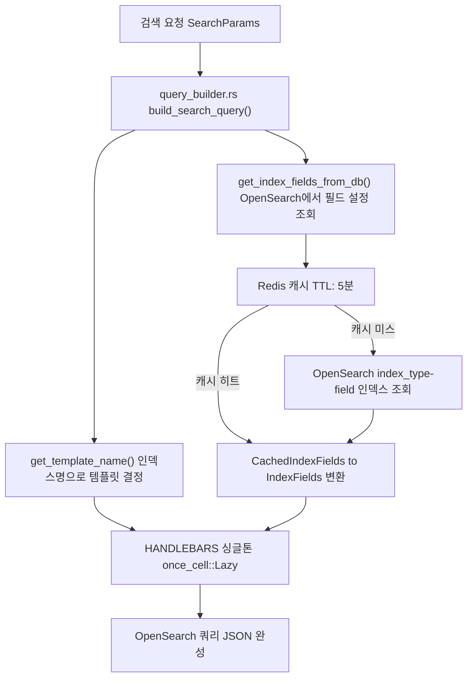

# Handlebars 템플릿으로 동적 검색 쿼리 생성하기

## 개요

OpenSearch 쿼리는 JSON이다. 그리고 검색 요청마다 쿼리가 달라진다. 검색어가 있을 때와 없을 때가 다르고, 상품 검색과 이벤트 검색의 구조가 다르고, 필터 조건이 붙으면 또 달라진다. 이 모든 경우를 Rust 코드에서 `json!()` 매크로나 문자열 포맷으로 처리하면 코드가 금방 복잡해진다.

이 프로젝트에서는 Handlebars 템플릿 엔진을 선택했다. 검색 유형별로 `.hbs` 파일을 별도로 관리하고, Rust에서는 파라미터만 넣어주면 완성된 JSON 쿼리가 나오는 구조다. `once_cell::Lazy`로 초기화하는 싱글톤 레지스트리 패턴과, OpenSearch에서 동적으로 필드 설정을 가져오는 메커니즘까지 합치면, 코드 수정 없이 검색 동작을 바꿀 수 있는 시스템이 완성된다.

## 아키텍처 설계

### 전체 쿼리 생성 흐름



템플릿 엔진과 필드 설정이 분리된 것이 핵심이다. 검색 쿼리의 구조(틀)는 `.hbs` 파일이 담당하고, 어떤 필드를 검색할지는 OpenSearch의 별도 인덱스에서 가져온다. 양쪽 모두 코드 배포 없이 변경할 수 있다.

## 핵심 구현

### Handlebars 싱글톤 레지스트리

`once_cell::Lazy`를 사용해서 앱 전체에서 단 하나의 Handlebars 레지스트리를 공유한다. 처음 접근 시 초기화되고, 이후에는 같은 인스턴스를 재사용한다.

```rust
use handlebars::{Context, Handlebars, Helper, HelperResult, Output, RenderContext};
use once_cell::sync::Lazy;

pub static HANDLEBARS: Lazy<Handlebars<'static>> = Lazy::new(|| {
    let mut hbs = Handlebars::new();

    // 커스텀 헬퍼 등록
    hbs.register_helper("eq", Box::new(eq_helper));
    hbs.register_helper("json", Box::new(json_helper));

    // 템플릿 정의: (기본 이름, 파일 이름, 별칭 목록)
    let template_definitions = [
        (
            "goods_search",
            "goods_search_template.hbs",
            &["goods-ko", "goods-en"] as &[&str],
        ),
        ("event_search", "event_search_template.hbs", &["event", "event-ko"]),
        ("field_search", "field_search_template.hbs", &["event-field-ko", "marketing-field-ko"]),
        ("marketing_search", "marketing_search_template.hbs", &["marketing", "marketing-ko"]),
        ("recomword_search", "recomword_search_template.hbs", &["goods-recomword"]),
        ("popupword_search", "popupword_search_template.hbs", &["popupword", "popupword-ko"]),
    ];

    // 모든 템플릿 로드 및 등록
    for (base_name, file_name, aliases) in template_definitions.iter() {
        load_and_register_template(&mut hbs, base_name, file_name, aliases);
    }

    // 커스텀 템플릿 디렉토리 자동 로드
    if let Ok(entries) = std::fs::read_dir("src/templates/custom") {
        for entry in entries.filter_map(Result::ok) {
            let path = entry.path();
            if path.is_file() && path.extension().map_or(false, |ext| ext == "hbs") {
                // 파일명에서 자동으로 별칭 결정
                // 예: product_search.hbs -> product_search, product-ko
                // ...
            }
        }
    }

    hbs
});
```

`Lazy`는 스레드 안전하게 초기화를 보장한다. Axum의 비동기 환경에서 여러 요청이 동시에 들어와도 레지스트리 초기화는 딱 한 번만 실행된다.

#### 템플릿 로드 실패 시 폴백

파일이 없거나 문법 오류가 있을 때를 대비해 기본 템플릿을 폴백으로 정의했다.

```rust
pub const DEFAULT_TEMPLATE: &str = r#"
{
    "query": { "match_all": {} },
    "from": {{from}},
    "size": {{size}},
    "sort": [{"_score": "desc"}]
    {{#if aggregation}}
    ,
    "aggs": {
        "minPrc": {"min": {"field": "aplyPrc"}},
        "maxPrc": {"max": {"field": "aplyPrc"}}
    }
    {{/if}}
}
"#;

fn load_and_register_template(
    hbs: &mut Handlebars<'static>,
    base_name: &str,
    file_name: &str,
    aliases: &[&str],
) {
    let template_path = format!("src/templates/{}", file_name);
    let template_content = match std::fs::read_to_string(&template_path) {
        Ok(content) => content,
        Err(e) => {
            log::warn!(
                "Failed to read template file {}: {}. Using default template.",
                file_name, e
            );
            DEFAULT_TEMPLATE.to_string()
        }
    };

    // 기본 이름으로 등록
    hbs.register_template_string(base_name, &template_content).ok();

    // 별칭으로도 동일한 템플릿 등록
    for alias in aliases {
        hbs.register_template_string(alias, &template_content).ok();
    }
}
```

운영 환경에서 파일 시스템 문제가 생겨도 검색이 완전히 멈추지 않도록 `match_all` 기반 기본 쿼리로 대응한다.

### 커스텀 헬퍼: eq와 json

Handlebars에는 기본 헬퍼가 내장되어 있지만, 검색 쿼리를 생성하는 데 두 가지가 추가로 필요했다.

**`eq` 헬퍼**: 두 값의 동등 여부를 비교한다. 언어 코드나 집계 타입에 따라 분기할 때 사용한다.

```rust
hbs.register_helper(
    "eq",
    Box::new(
        |h: &Helper,
         _: &Handlebars,
         _: &Context,
         _: &mut RenderContext,
         out: &mut dyn Output|
         -> HelperResult {
            let param = h.param(0).and_then(|v| v.value().as_str()).unwrap_or("");
            let value = h.param(1).and_then(|v| v.value().as_str()).unwrap_or("");
            if param == value {
                out.write("true")?;
            }
            Ok(())
        },
    ),
);
```

**`json` 헬퍼**: Rust 벡터나 맵을 JSON 배열/객체로 직렬화한다. 필드 목록을 템플릿에 넘길 때 필수다.

```rust
hbs.register_helper(
    "json",
    Box::new(
        |h: &Helper,
         _: &Handlebars,
         _: &Context,
         _: &mut RenderContext,
         out: &mut dyn Output|
         -> HelperResult {
            if let Some(param) = h.param(0) {
                let json_str = serde_json::to_string(param.value())
                    .unwrap_or_else(|_| "null".to_string());
                out.write(&json_str)?;
            }
            Ok(())
        },
    ),
);
```

템플릿에서 `{{json mainFields}}`를 쓰면 `["goodsNm^10", "brandNm^5"]` 같은 JSON 배열이 삽입된다.

### 인덱스명으로 템플릿 결정

검색 요청이 들어오면 인덱스 이름을 보고 어떤 템플릿을 쓸지 결정한다. 인덱스 명명 규칙이 바뀌면서 두 가지 형식을 모두 지원해야 했다.

```rust
pub fn get_template_name(index_name: &str) -> &str {
    let template_name =
        // 새로운 형식: {project_name}-{environment}-{index_type}-{lang_suffix}
        if index_name.contains("-goods-") && !index_name.contains("recomword") {
            "goods_search"
        } else if index_name.contains("-event-") && !index_name.contains("recomword") {
            "event_search"
        } else if index_name.contains("-marketing-") && !index_name.contains("recomword") {
            "marketing_search"
        } else if index_name.contains("-popupword-") {
            "popupword_search"
        } else if index_name.contains("recomword") {
            "recomword_search"
        } else if index_name.contains("field") {
            "field_search"
        }
        // 기존 형식과의 호환성 유지
        else {
            match index_name {
                "event" | "event-ko" => "event_search",
                "marketing" | "marketing-ko" => "marketing_search",
                s if s.contains("popupword") => "popupword_search",
                s if s.contains("recomword") => "recomword_search",
                s if s.ends_with("-field-ko") => "field_search",
                _ => "goods_search",
            }
        };

    template_name
}
```

`osstem-dev-goods-ko`라는 인덱스명이 오면 `-goods-`가 포함되어 있으니 `goods_search` 템플릿을 선택한다. `goods-ko`라는 구형 형식도 마지막 `match` 블록에서 잡힌다.

### 검색 필드의 동적 조회

어떤 필드를 어떤 가중치로 검색할지는 코드에 하드코딩하지 않는다. OpenSearch의 `{project}-{env}-{index_type}-field` 인덱스에서 실시간으로 읽어온다.

```rust
/// OpenSearch에서 직접 필드 설정 조회
async fn fetch_fields_from_opensearch(_index_name: &str, index_type: &str) -> IndexFields {
    let field_index_name = generate_field_index_name(index_type);
    let client = client::get_client().await;

    let query = json!({
        "query": {
            "bool": {
                "must": [
                    { "term": { "indexName.keyword": index_type } },
                    { "term": { "sendGb.keyword": "A" } }
                ]
            }
        },
        "size": 1000,
        "_source": ["fieldName", "mainCondition", "fieldType", "boostValue"]
    });

    // 조회 결과를 mainCondition 기준으로 분류
    match main_condition {
        "EXACT" => fields.exact_fields.push(format!("{}.exact^{}", field_name, boost_value)),
        "PHRASE" => fields.phrase_fields.push(format!("{}.phrase^{}", field_name, boost_value)),
        "PRIMARY" => fields.primary_fields.push(boosted_field),
        "SECONDARY" => fields.secondary_fields.push(boosted_field),
        // 기존 조건 호환
        "EQUAL" => {
            fields.exact_fields.push(format!("{}.exact^{}", field_name, boost_value));
            fields.phrase_fields.push(format!("{}.phrase^{}", field_name, boost_value));
        }
        "AND" => fields.primary_fields.push(boosted_field),
        "OR" | "LIKE" => fields.secondary_fields.push(boosted_field),
        _ => fields.secondary_fields.push(boosted_field),
    }
}
```

필드 설정은 Redis에 5분간 캐시한다. 매 검색마다 OpenSearch에 필드 설정을 질의하면 부하가 생기기 때문이다.

```rust
async fn get_index_fields_from_db(index_name: &str) -> IndexFields {
    let index_type = extract_index_type(index_name);

    // 1. Redis 캐시에서 조회
    if let Ok(Some(cached)) = get_cached_field_config(index_name, &index_type).await {
        return IndexFields::from(cached);
    }

    // 2. 캐시 미스 시 OpenSearch에서 조회
    let fields = fetch_fields_from_opensearch(index_name, &index_type).await;

    // 3. Redis에 캐시 (TTL: 300초)
    let cached = CachedIndexFields::from(&fields);
    cache_field_config(index_name, &index_type, &cached, 300).await.ok();

    fields
}
```

필드 설정을 변경하면 최대 5분 후 자동으로 반영된다. 즉시 반영이 필요하면 캐시 무효화 API를 호출한다.

## 템플릿 파일 구조

### 상품 검색 템플릿 (goods_search_template.hbs)

가장 복잡한 템플릿이다. 검색어 유무, 필터 조건(nested/regular), 집계(aggregation) 여부에 따라 쿼리 구조가 달라진다.

```handlebars
{{! Goods 검색 전용 템플릿 }}
{
    "size": {{size}},
    "from": {{from}},
    "track_total_hits": true,
    "sort": [{ "_score": "desc" }],
    "query": {
        "bool": {
            {{#if searchWord}}
            "should": [
                {{#if exactFields}}
                {
                    "multi_match": {
                        "query": "{{searchWord}}",
                        "fields": {{json exactFields}},
                        "type": "phrase",
                        "boost": 4.0
                    }
                },
                {{/if}}
                {{#if phraseFields}}
                {
                    "multi_match": {
                        "query": "{{searchWord}}",
                        "fields": {{json phraseFields}},
                        "type": "phrase",
                        "boost": 3.0
                    }
                },
                {{/if}}
                {{#if primaryFields}}
                {
                    "multi_match": {
                        "query": "{{searchWord}}",
                        "fields": {{json primaryFields}},
                        "type": "most_fields",
                        "operator": "and",
                        "boost": 2.0
                    }
                },
                {{/if}}
                {{#if secondaryFields}}
                {
                    "multi_match": {
                        "query": "{{searchWord}}",
                        "fields": {{json secondaryFields}},
                        "type": "most_fields",
                        "minimum_should_match": "75%",
                        "boost": 1.0
                    }
                }
                {{/if}}
            ],
            "minimum_should_match": 1,
            {{else}}
            "must": [{ "match_all": {} }],
            {{/if}}
            "filter": [
                {{#if nestedFilters}}
                {{#each nestedFilters}}
                {
                    "nested": {
                        "path": "dispCtgNo",
                        "query": {
                            "terms": {
                                "dispCtgNo.{{@key}}.keyword": {{json this}}
                            }
                        }
                    }
                }{{#unless @last}},{{/unless}}
                {{/each}}
                {{#if regularFilters}},{{/if}}
                {{/if}}
                {{#if regularFilters}}
                {{#each regularFilters}}
                {
                    "terms": { "{{@key}}.keyword": {{json this}} }
                }{{#unless @last}},{{/unless}}
                {{/each}}
                {{/if}}
            ]
        }
    }
    {{#if aggregation}},
    "aggs": {
        "lrgCategory": {
            "nested": { "path": "dispCtgNo" },
            "aggs": {
                "category_keyword": {
                    "multi_terms": {
                        "terms": [
                            { "field": "dispCtgNo.lrgCtgNm.keyword" },
                            { "field": "dispCtgNo.lrgCtgNo.keyword" }
                        ]
                    }
                }
            }
        },
        "brand": {
            "multi_terms": {
                "terms": [
                    { "field": "brandNo.keyword" },
                    { "field": "brandNm.keyword" }
                ]
            }
        },
        "minPrc": { "min": { "field": "aplyPrc" } },
        "maxPrc": { "max": { "field": "aplyPrc" } }
    }
    {{/if}}
}
```

`{{#if searchWord}}...{{else}}...{{/if}}`로 검색어 유무를 분기한다. `{{json exactFields}}`는 커스텀 헬퍼로 배열을 JSON으로 직렬화한다. `{{#each nestedFilters}}`로 카테고리 필터를 순회하면서 중첩 쿼리를 생성한다. `{{#unless @last}},{{/unless}}`는 마지막 요소 뒤에 쉼표를 붙이지 않기 위한 처리다. JSON 배열에서 trailing comma가 있으면 파싱 오류가 난다.

### 추천 검색어 템플릿 (recomword_search_template.hbs)

구조가 완전히 다른 집계 전용 쿼리다. 검색어가 있으면 `prefix`와 `wildcard`로 자동완성 방식의 검색을 한다.

```handlebars
{{! 추천 검색어 전용 템플릿 }}
{
    "size": 0,
    "aggs": {
        "terms_agg": {
            "terms": {
                "field": "keyword.completion",
                "size": {{size}},
                "order": { "_count": "desc" }
            }
        }
    },
    "query": {
        "bool": {
            {{#if searchWord}}
            "should": [
                {
                    "prefix": {
                        "keyword.completion": {
                            "value": "{{searchWord}}",
                            "boost": 3.0
                        }
                    }
                },
                {
                    "wildcard": {
                        "keyword.completion": {
                            "value": "*{{searchWord}}*",
                            "boost": 1.0
                        }
                    }
                }
            ],
            "minimum_should_match": 1
            {{else}}
            "must": [{ "match_all": {} }]
            {{/if}}
        }
    }
}
```

`"size": 0`으로 문서는 가져오지 않고 집계 결과만 반환한다. 상품 검색 템플릿과 완전히 다른 구조지만, 호출 측 코드는 동일하다. 템플릿 이름만 다를 뿐이다.

### build_search_query 함수

템플릿 렌더링의 진입점이다.

```rust
pub async fn build_search_query(params: &SearchParams) -> String {
    let index_name = &params.indexName;
    let template_name = get_template_name(index_name);

    // OpenSearch에서 필드 설정 조회 (Redis 캐싱)
    let fields = get_index_fields_from_db(index_name).await;

    // 템플릿에 전달할 데이터 구성
    let mut data = json!({
        "searchWord": params.searchWord,
        "from": params.from,
        "size": params.size,
        "aggregation": params.aggregation,
        "exactFields": fields.exact_fields,
        "phraseFields": fields.phrase_fields,
        "primaryFields": fields.primary_fields,
        "secondaryFields": fields.secondary_fields,
    });

    // 필터 파라미터 파싱
    if let Some(nested_json) = params.additionalParams.get("nestedFilters") {
        if let Ok(nested_filters) = serde_json::from_str::<serde_json::Value>(
            nested_json.as_str().unwrap_or("")
        ) {
            data["nestedFilters"] = nested_filters;
        }
    }

    if let Some(regular_json) = params.additionalParams.get("regularFilters") {
        if let Ok(regular_filters) = serde_json::from_str::<serde_json::Value>(
            regular_json.as_str().unwrap_or("")
        ) {
            data["regularFilters"] = regular_filters;
        }
    }

    // Handlebars 렌더링
    match HANDLEBARS.render(template_name, &data) {
        Ok(query) => query,
        Err(e) => {
            log::error!("Failed to render template '{}': {}", template_name, e);
            // 폴백: match_all 쿼리
            format!(r#"{{"from":{},"size":{},"query":{{"match_all":{{}}}}}}"#,
                params.from, params.size)
        }
    }
}
```

파라미터 조립, 필터 파싱, 렌더링, 폴백까지 하나의 함수가 담당한다. 호출 측에서는 `SearchParams`만 넘기면 완성된 JSON 문자열을 받는다.

## 필터 파싱: nested와 regular 분리

상품 카테고리 필터는 OpenSearch의 `nested` 필드 구조로 저장된다. API 요청에서는 단순한 문자열로 넘어온다.

```
GET /search?filters=lrgCtgNo:4,lrgCtgNo:5,brandNo:2050
```

이 문자열을 파싱해서 nested 필드와 일반 필드로 분리한다.

```rust
impl SearchRequest {
    pub fn parse_filters(
        &self,
    ) -> (HashMap<String, Vec<String>>, HashMap<String, Vec<String>>) {
        let mut nested_filters = HashMap::new();
        let mut regular_filters = HashMap::new();

        // nested 필드 목록: dispCtgNo 하위 필드들
        let nested_fields = vec![
            "lrgCtgNo", "lrgCtgNm", "midCtgNo", "midCtgNm",
            "subCtgNo", "subCtgNm", "dispCtgNo",
        ];

        if let Some(filters_str) = &self.filters {
            for filter_pair in filters_str.split(',') {
                let parts: Vec<&str> = filter_pair.split(':').collect();
                if parts.len() == 2 {
                    let field = parts[0].trim().to_string();
                    let value = parts[1].trim().to_string();

                    if !value.is_empty() {
                        if nested_fields.contains(&field.as_str()) {
                            nested_filters.entry(field).or_default().push(value);
                        } else {
                            regular_filters.entry(field).or_default().push(value);
                        }
                    }
                }
            }
        }

        (nested_filters, regular_filters)
    }
}
```

`lrgCtgNo:4,lrgCtgNo:5`는 같은 필드의 OR 조건이 된다. 파싱 결과는 `{"lrgCtgNo": ["4", "5"]}`가 되고, 템플릿의 `{{#each nestedFilters}}`에서 `terms` 쿼리로 변환된다.

## 커스텀 템플릿 자동 로드

`src/templates/custom/` 디렉토리에 `.hbs` 파일을 넣으면 서버 시작 시 자동으로 등록된다.

```rust
if let Ok(entries) = std::fs::read_dir("src/templates/custom") {
    for entry in entries.filter_map(Result::ok) {
        let path = entry.path();
        if path.is_file() && path.extension().map_or(false, |ext| ext == "hbs") {
            if let Some(file_stem) = path.file_stem().and_then(|s| s.to_str()) {
                if let Ok(content) = std::fs::read_to_string(&path) {
                    // 파일명에서 별칭 자동 결정
                    // product_search.hbs -> "product_search", "product-ko"
                    let base_name = file_stem;
                    let aliases = match file_stem.split_once("_") {
                        Some((prefix, _)) => vec![format!("{}-ko", prefix)],
                        None => vec![],
                    };

                    hbs.register_template_string(base_name, &content).ok();
                    for alias in aliases {
                        hbs.register_template_string(&alias, &content).ok();
                    }
                }
            }
        }
    }
}
```

고객사마다 다른 검색 쿼리 구조가 필요할 때, 코드를 수정하지 않고 템플릿 파일만 추가하면 된다. `get_template_name()`의 마지막 `match` 블록에서 새 인덱스 유형을 추가하면 연결된다.

## 트러블슈팅

### 1. JSON trailing comma 문제

Handlebars의 `{{#each}}`는 배열을 순회하지만, 마지막 요소 뒤에 쉼표를 자동으로 제거해주지 않는다. OpenSearch는 JSON을 엄격하게 파싱하므로 trailing comma가 있으면 오류가 난다.

```handlebars
{{! 잘못된 방식: 마지막 요소 뒤에 쉼표가 붙음 }}
{{#each items}}
{ "field": "{{this}}" },
{{/each}}

{{! 올바른 방식: @last 헬퍼로 마지막 구분 }}
{{#each items}}
{ "field": "{{this}}" }{{#unless @last}},{{/unless}}
{{/each}}
```

`{{#unless @last}},{{/unless}}`는 Handlebars의 내장 `@last` 변수와 `unless` 블록을 조합해서 마지막 요소일 때만 쉼표를 생략한다. 복잡한 중첩 배열에서 이 패턴이 많이 반복되는데, 실수로 빠뜨리면 런타임에야 오류가 드러난다.

### 2. 인덱스 명명 규칙 변경 대응

운영 초기에는 인덱스 이름이 단순했다. `goods-ko`, `event-ko`. 멀티 프로젝트, 멀티 환경을 지원하면서 `osstem-dev-goods-ko` 형식으로 바뀌었다.

`get_template_name()` 함수가 두 가지를 모두 처리해야 했다. 처음에는 `starts_with()`, `ends_with()` 같은 검사로 구분했는데, 새 형식에서 `starts_with("goods")`가 맞지 않아서 기존 코드가 오동작했다.

결국 `contains("-goods-")`처럼 세그먼트 단위로 검사하는 방식으로 전환했다. 새 형식은 앞에 프로젝트명과 환경이 붙기 때문에 `-goods-` 같은 구분자 포함 패턴이 더 정확하다. 하위 호환을 위해 구형 형식 처리도 `else` 블록으로 유지했다.

### 3. once_cell::Lazy의 async 함수 호출 제한

`Lazy::new()`에서 비동기 함수를 쓸 수 없다. 처음에 `build_search_query()`가 동기 함수였다가, 필드 설정을 OpenSearch에서 가져오도록 바꾸면서 async가 필요해졌다.

해결 방법은 역할 분리다. `HANDLEBARS` 싱글톤은 파일 로드만 담당하므로 동기로 충분하다. 필드 설정 조회는 `build_search_query()` 내부에서 `async`로 처리한다. 레지스트리는 순수하게 "어떤 구조로 쿼리를 만들지"만 담당하고, "어떤 필드를 쓸지"는 런타임에 결정한다.

## 결과 및 회고

### 성과

검색 쿼리 변경이 코드 배포 없이 가능해졌다. 필드 가중치를 조정하려면 OpenSearch의 field 인덱스 데이터만 수정하면 된다. 쿼리 구조 자체를 바꾸려면 `.hbs` 파일만 수정하고 서버를 재시작하면 된다. 이전에는 쿼리 한 줄 바꾸는 데 코드 수정, 빌드, 배포까지 필요했다.

검색 유형별 쿼리 로직이 명확하게 분리됐다. 상품 검색, 이벤트 검색, 추천 검색어가 각자의 `.hbs` 파일을 갖는다. 한 유형의 쿼리를 수정해도 다른 유형에 영향이 없다.

### 배운 점

**Handlebars의 한계도 있다.** JSON 생성용으로 쓰면 trailing comma 같은 문제가 자주 발생한다. 원래 HTML 생성용으로 설계된 엔진이기 때문이다. 프로젝트 규모가 커지면 전용 쿼리 빌더 라이브러리를 고려하는 것이 나을 수 있다.

**템플릿 디버깅이 어렵다.** Handlebars 렌더링 오류는 런타임에야 나타나고, 오류 메시지가 "line X, col Y"로만 표시되어 어떤 데이터 문제인지 파악하기 어렵다. 렌더링 실패 시 입력 데이터를 같이 로깅하는 것이 도움이 됐다.

**once_cell::Lazy는 Rust의 싱글톤 패턴에서 가장 깔끔한 선택이다.** 이전에 `lazy_static!` 매크로를 쓰다가 전환했는데, 타입 추론이 더 자연스럽고 스레드 안전성이 명시적이다. 비동기 컨텍스트에서는 `tokio::sync::OnceCell`을 써야 하는 경우도 있지만, 파일 로드처럼 순수 동기 초기화에는 `once_cell::sync::Lazy`로 충분하다.
