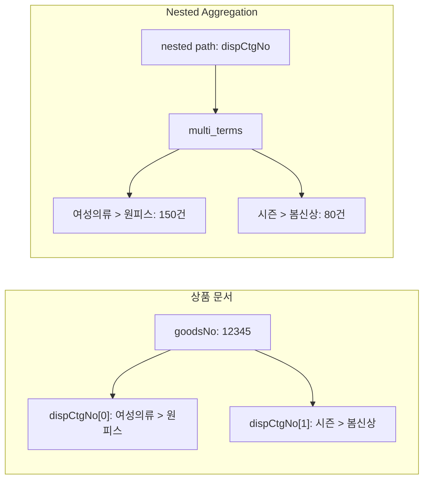
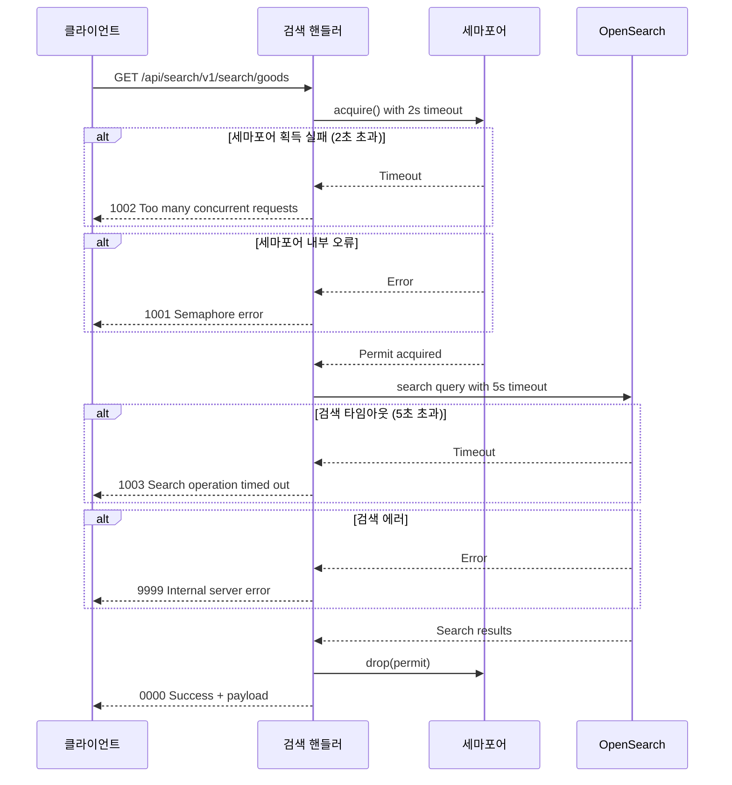
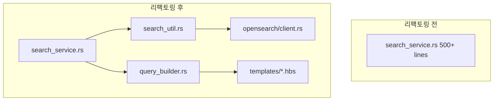

# OpenSearch Aggregation 검색 구현 및 에러 핸들링 전략

## 개요

커머스 검색 엔진을 운영하다 보면 단순한 키워드 검색만으로는 부족한 순간이 온다. 사용자가 "원피스"를 검색했을 때, 검색 결과와 함께 "여성의류 > 원피스/미니" 같은 카테고리 필터, "S/M/L" 같은 사이즈 필터, 가격대별 분포를 함께 제공해야 한다. 이것이 바로 Aggregation(집계) 검색이다.

이 글에서는 Rust로 만든 검색 엔진에 OpenSearch Aggregation을 도입한 과정과, 그 과정에서 설계한 에러 핸들링 전략을 상세히 다룬다. 특히 동시성 제한을 위한 세마포어 패턴, 타임아웃 계층화, 에러 코드 체계까지 실전에서 겪은 문제와 해결 과정을 담았다.

## 아키텍처 설계

### 전체 검색 파이프라인

기존 검색 파이프라인에 Aggregation 레이어를 추가하면서, 검색과 집계를 하나의 요청으로 처리할지, 별도 엔드포인트로 분리할지 결정해야 했다. 결론부터 말하면, 별도 엔드포인트로 분리했다.

```mermaid
graph TD
    Client[클라이언트] --> GoodsSearch[/api/search/v1/search/goods]
    Client --> GoodsAgg[/api/search/v1/search/goods-aggregation]
    Client --> MarketingSearch[/api/search/v1/search/marketing-search]
    
    GoodsSearch --> Semaphore[세마포어 동시성 제한]
    GoodsAgg --> Semaphore
    MarketingSearch --> Semaphore
    
    Semaphore --> QueryBuilder[Handlebars 쿼리 빌더]
    QueryBuilder --> OpenSearch[(OpenSearch)]
    
    OpenSearch --> ResponseParser[응답 파서]
    ResponseParser --> AggProcessor{Aggregation 포함?}
    AggProcessor -->|Yes| AggDataProcessor[집계 데이터 가공]
    AggProcessor -->|No| HitsProcessor[히트 데이터 가공]
    
    AggDataProcessor --> ApiResponse[API 응답]
    HitsProcessor --> ApiResponse
```

분리한 이유는 명확하다. 집계 검색은 일반 검색보다 OpenSearch 클러스터에 훨씬 큰 부하를 준다. Nested Aggregation이 들어가면 메모리 사용량이 급격히 증가하고, 응답 시간도 길어진다. 같은 세마포어 풀을 공유하되, 엔드포인트를 분리해서 클라이언트가 필요한 것만 호출하도록 했다.

### 검색 파라미터 통합 설계

모든 검색 엔드포인트가 공통 파라미터 구조를 사용하도록 `SearchParams` 구조체를 설계했다.

```rust
#[derive(Debug, Clone, Serialize, Deserialize)]
pub struct SearchParams {
    pub search_word: Option<String>,
    pub from: u32,
    pub size: u32,
    pub aggregation: bool,
    pub index_name: String,
}
```

`aggregation` 플래그 하나로 일반 검색과 집계 검색을 구분한다. 쿼리 템플릿에서 이 플래그를 참조해 Aggregation 블록을 동적으로 포함하거나 제외한다.

## Aggregation 쿼리 구현

### Handlebars 템플릿 기반 동적 쿼리

OpenSearch 쿼리를 Rust 코드에 하드코딩하면 유지보수가 어려워진다. Handlebars 템플릿 엔진을 사용해 쿼리를 외부 파일로 분리했다.

```json
{
    "query": {
        "bool": {
            "must": [
                {{#if search_word}}
                {
                    "match": {
                        "goodsNm": "{{search_word}}"
                    }
                }
                {{else}}
                {
                    "match_all": {}
                }
                {{/if}}
            ]
        }
    },
    "from": {{from}},
    "size": {{size}},
    "sort": [
        {
            "_score": "desc"
        }
    ]
    {{#if aggregation}}
    ,
    "aggs": {
        "category": {
            "nested": {
                "path": "dispCtgNo"
            },
            "aggs": {
                "category_keyword": {
                    "multi_terms": {
                        "size": 100,
                        "terms": [
                            { "field": "dispCtgNo.dispCtgNo.keyword" },
                            { "field": "dispCtgNo.ctgFullPath.keyword" },
                            { "field": "dispCtgNo.ctgFullPathNm.keyword" }
                        ]
                    }
                }
            }
        },
        "brand": {
            "terms": {
                "field": "brandNm.keyword",
                "size": 50
            }
        },
        "price_ranges": {
            "range": {
                "field": "salePrc",
                "ranges": [
                    { "to": 10000 },
                    { "from": 10000, "to": 30000 },
                    { "from": 30000, "to": 50000 },
                    { "from": 50000, "to": 100000 },
                    { "from": 100000 }
                ]
            }
        }
    }
    {{/if}}
}
```

핵심은 `{{#if aggregation}}` 블록이다. `aggregation` 플래그가 `false`이면 이 블록 전체가 렌더링되지 않으므로, 일반 검색에서는 불필요한 집계 오버헤드가 발생하지 않는다.

### Nested Aggregation의 함정

커머스 데이터에서 카테고리 정보는 보통 Nested 타입으로 저장된다. 상품 하나에 여러 카테고리가 매핑될 수 있기 때문이다. Nested Aggregation을 사용하면 각 Nested 문서를 별도로 집계할 수 있지만, 주의할 점이 있다.



`multi_terms` Aggregation을 사용한 이유는 카테고리 번호(`dispCtgNo`), 전체 경로(`ctgFullPath`), 경로명(`ctgFullPathNm`)을 한 번의 집계로 묶어서 가져오기 위해서다. 별도의 `terms` Aggregation 3개를 사용하면 결과를 클라이언트에서 다시 매핑해야 하는데, `multi_terms`를 쓰면 이미 묶인 상태로 받을 수 있다.

단, `multi_terms`는 OpenSearch 2.x 이상에서만 지원된다. 이전 버전을 사용하고 있다면 `composite` Aggregation으로 대체해야 한다.

### 대분류/중분류/소분류 계층 집계

카테고리를 대분류, 중분류, 소분류로 계층화해서 집계하는 것도 구현했다. 프론트엔드에서 카테고리 드릴다운 UI를 제공하려면 각 레벨별 집계가 필요하다.

```json
"lrgCategory": {
    "nested": {
        "path": "dispCtgNo"
    },
    "aggs": {
        "lrg_terms": {
            "multi_terms": {
                "size": 50,
                "terms": [
                    { "field": "dispCtgNo.lrgCtgNo.keyword" },
                    { "field": "dispCtgNo.lrgCtgNm.keyword" }
                ]
            }
        }
    }
},
"midCategory": {
    "nested": {
        "path": "dispCtgNo"
    },
    "aggs": {
        "mid_terms": {
            "multi_terms": {
                "size": 100,
                "terms": [
                    { "field": "dispCtgNo.lrgCtgNo.keyword" },
                    { "field": "dispCtgNo.midCtgNo.keyword" },
                    { "field": "dispCtgNo.midCtgNm.keyword" }
                ]
            }
        }
    }
}
```

대분류에 `lrgCtgNo`와 `lrgCtgNm`을 묶고, 중분류에는 `lrgCtgNo`를 함께 포함시켜 상위 카테고리와의 관계를 유지한다. 프론트엔드에서 "여성의류" 대분류를 클릭하면, 중분류 결과에서 `lrgCtgNo`가 같은 항목만 필터링하면 된다.

## 에러 핸들링 전략

### 에러 코드 체계

기존 검색 API는 에러 처리가 단순했다. 실패하면 빈 배열을 반환하는 수준이었다. 이걸 체계적인 에러 코드 시스템으로 개선했다.

```rust
/// API 응답 구조체
#[derive(Debug, Serialize, Deserialize)]
pub struct ApiResponse {
    pub timestamp: String,
    pub code: String,
    pub message: String,
    pub payload: Value,
    pub error: bool,
}
```

이전에는 `SearchResponse`라는 이름으로 검색 결과만 담았다. `ProductItem` 배열, `total`, `from`, `size`, `aggregations`를 직접 필드로 가지고 있었다. 문제는 에러가 발생했을 때 이 구조로는 에러 정보를 전달할 방법이 없다는 것이었다.

`ApiResponse`로 전환하면서 `code`, `message`, `error` 필드를 추가했다. `payload`는 `serde_json::Value` 타입으로, 성공 시 검색 결과를, 실패 시 빈 `{"hits": []}` 를 담는다.

에러 코드 상수를 정의해서 일관성을 유지했다.

```rust
const ERR_SEMAPHORE_FAILED: &str = "1001";
const ERR_TOO_MANY_REQUESTS: &str = "1002";
const ERR_SEARCH_TIMEOUT: &str = "1003";
const ERR_INTERNAL: &str = "9999";
```

각 에러 코드의 의미는 다음과 같다.

- **1001**: 세마포어 내부 오류. 세마포어가 닫혔거나 시스템 리소스 문제
- **1002**: 동시 요청 과다. 세마포어 획득 대기 시간 초과 (2초)
- **1003**: 검색 타임아웃. OpenSearch 쿼리 실행 시간 초과 (5초)
- **9999**: 내부 서버 오류. 분류되지 않은 에러

공통 에러 응답 생성 함수도 만들었다.

```rust
fn create_error_response(code: &str, message: &str) -> Json<ApiResponse> {
    Json(ApiResponse {
        timestamp: chrono::Utc::now().format("%Y-%m-%dT%H:%M:%S").to_string(),
        code: code.to_string(),
        message: message.to_string(),
        payload: serde_json::json!({ "hits": [] }),
        error: true,
    })
}
```

### 세마포어 기반 동시성 제한

검색 엔진에서 가장 위험한 상황은 OpenSearch 클러스터가 과부하로 다운되는 것이다. 특히 Aggregation 쿼리는 리소스를 많이 사용하므로, 동시 요청 수를 제한해야 한다.

```rust
struct SearchLimiter {
    semaphore: Arc<Semaphore>,
}

static SEARCH_LIMITER: OnceCell<SearchLimiter> = OnceCell::const_new();

async fn get_search_limiter() -> &'static SearchLimiter {
    SEARCH_LIMITER
        .get_or_init(|| async {
            SearchLimiter {
                semaphore: Arc::new(Semaphore::new(10)),
            }
        })
        .await
}
```

`OnceCell`로 싱글턴 패턴을 구현했다. 세마포어 크기를 10으로 설정해서 동시에 최대 10개의 검색 요청만 OpenSearch로 전달된다. 이 숫자는 OpenSearch 클러스터의 노드 수, CPU 코어, 힙 메모리를 고려해서 결정했다.

### 타임아웃 계층화

타임아웃을 한 군데만 걸면 어디서 문제가 발생했는지 파악하기 어렵다. 세 단계로 계층화했다.



실제 구현 코드는 다음과 같다.

```rust
async fn goods_search(params: Query<SearchRequest>) -> Json<ApiResponse> {
    let search_params = params.0.to_search_params(false, "goods".to_string());

    let limiter = get_search_limiter().await;

    // 1단계: 세마포어 획득 타임아웃 (2초)
    let permit_result = timeout(
        Duration::from_secs(2), 
        limiter.semaphore.acquire()
    ).await;

    let permit = match permit_result {
        Ok(Ok(permit)) => permit,
        Ok(Err(_)) => {
            return create_error_response(
                ERR_SEMAPHORE_FAILED, 
                "Search limiter error"
            );
        }
        Err(_) => {
            return create_error_response(
                ERR_TOO_MANY_REQUESTS, 
                "Too many concurrent requests"
            );
        }
    };

    // 2단계: 검색 실행 타임아웃 (5초)
    let search_result = timeout(
        Duration::from_secs(5),
        search_service::search(&search_params),
    ).await;

    // 세마포어 즉시 해제
    drop(permit);

    // 3단계: 결과 처리
    match search_result {
        Ok(Ok(api_response)) => Json(api_response),
        Ok(Err(_)) => create_error_response(
            ERR_INTERNAL, 
            "Internal server error"
        ),
        Err(_) => create_error_response(
            ERR_SEARCH_TIMEOUT, 
            "Search operation timed out"
        ),
    }
}
```

`drop(permit)`을 검색 결과 처리 전에 호출하는 것이 중요하다. 응답 직렬화나 후처리 시간까지 세마포어를 점유하면 불필요하게 다른 요청을 블로킹하게 된다.

### OpenSearch 클라이언트 커넥션 풀 최적화

에러 핸들링과 함께 OpenSearch 클라이언트의 커넥션 풀도 최적화했다. CPU 코어 수에 따라 동적으로 풀 크기를 결정한다.

```rust
let available_cpus = num_cpus::get();

let default_pool_size = if available_cpus <= 4 {
    available_cpus * 2      // 소규모: 코어 x 2
} else if available_cpus <= 8 {
    available_cpus * 3      // 중규모: 코어 x 3
} else {
    std::cmp::min(available_cpus * 4, 32)  // 대규모: 코어 x 4 (최대 32)
};

let pool_size = config.opensearch_pool_size
    .unwrap_or(default_pool_size);
```

설정 파일에 명시적으로 지정하면 그 값을 사용하고, 없으면 시스템 리소스에 맞게 자동 계산한다. 대규모 시스템에서 무한정 늘리면 OS의 파일 디스크립터 제한에 걸릴 수 있어 최대 32로 제한했다.

로깅도 `println!`에서 `log` 크레이트로 전환했다.

```rust
let response = client
    .search(SearchParts::Index(&[&index]))
    .body(query_json)
    .send()
    .await?;

let status = response.status_code();
log::debug!("OpenSearch response status: {}", status);

if !status.is_success() {
    let error_text = response.text().await?;
    log::error!("OpenSearch error: {} - {}", status, error_text);
    return Err(format!("OpenSearch error: {} - {}", status, error_text).into());
}

let response_body = response.json::<Value>().await?;

if let Some(total) = response_body["hits"]["total"]["value"].as_u64() {
    log::debug!("OpenSearch query returned {} hits", total);
}
```

운영 환경에서는 `debug` 레벨 로그를 끄고, 에러만 출력하도록 설정한다. 장애 상황에서는 `debug` 레벨을 켜서 쿼리 내용과 응답 상태까지 추적할 수 있다.

## 검색 서비스 리팩토링

### 모듈 분리

초기에는 `search_service.rs` 하나에 모든 로직이 들어 있었다. Handlebars 초기화, 쿼리 빌드, OpenSearch 실행, 결과 파싱까지 한 파일에 500줄 이상이었다. 이걸 역할별로 분리했다.



```rust
// search_service.rs - 진입점만 담당
pub use crate::util::search::search_util::{ApiResponse, SearchParams};

pub async fn search(
    params: &SearchParams,
) -> Result<ApiResponse, Box<dyn Error + Send + Sync>> {
    let query = build_search_query(params);
    log::debug!("Generated query: {}", query);

    let search_result = execute_opensearch_query(query, &params.index_name).await?;
    let timestamp = Utc::now().format("%Y-%m-%dT%H:%M:%S").to_string();

    let payload = process_search_result(params, &search_result)?;

    Ok(ApiResponse {
        timestamp,
        code: "0000".to_string(),
        message: "success".to_string(),
        payload,
        error: false,
    })
}
```

`search_service.rs`는 흐름만 정의하고, 실제 구현은 `search_util.rs`와 `query_builder.rs`에 위임한다. 타입 재사용을 위해 `pub use`로 re-export하는 패턴을 사용했다.

### Aggregation 결과 후처리

Aggregation 응답은 검색 히트와 다른 구조를 가진다. 응답 타입에 따라 분기 처리가 필요하다.

```rust
fn process_search_result(
    params: &SearchParams,
    search_result: &Value,
) -> Result<Value, Box<dyn Error + Send + Sync>> {
    if params.index_name.contains("recomword") {
        // 추천 검색어: terms aggregation 결과 추출
        process_recomword_result(search_result)
    } else if params.aggregation {
        // 집계 검색: aggregation 데이터 가공
        process_aggregation_data(search_result)
    } else {
        // 일반 검색: hits 추출
        process_hits_result(search_result)
    }
}
```

`process_aggregation_data` 함수에서는 OpenSearch가 반환한 원시 Aggregation 데이터를 프론트엔드가 바로 사용할 수 있는 형태로 가공한다. Nested Aggregation의 `buckets`를 순회하면서 카테고리 트리, 브랜드 목록, 가격대 분포 등으로 정리한다.

## 공통 검색 실행 함수 통합

엔드포인트가 늘어나면서 각 핸들러에 세마포어 획득-검색-해제 코드가 중복되었다. `execute_search` 함수로 통합했다.

```rust
async fn execute_search(search_params: SearchParams) -> Json<ApiResponse> {
    let limiter = get_search_limiter().await;

    let permit_result = timeout(
        Duration::from_secs(2),
        limiter.semaphore.acquire(),
    ).await;

    let permit = match permit_result {
        Ok(Ok(permit)) => permit,
        Ok(Err(_)) => return create_error_response(ERR_SEMAPHORE_FAILED, "Search limiter error"),
        Err(_) => return create_error_response(ERR_TOO_MANY_REQUESTS, "Too many concurrent requests"),
    };

    let search_result = timeout(
        Duration::from_secs(5),
        search_service::search(&search_params),
    ).await;

    drop(permit);

    match search_result {
        Ok(Ok(api_response)) => Json(api_response),
        Ok(Err(_)) => create_error_response(ERR_INTERNAL, "Internal server error"),
        Err(_) => create_error_response(ERR_SEARCH_TIMEOUT, "Search operation timed out"),
    }
}
```

이제 각 엔드포인트 핸들러는 파라미터 변환만 담당한다.

```rust
async fn goods_search(params: Query<SearchRequest>) -> Json<ApiResponse> {
    let lang_cd = params.0.get_lang_cd();
    let search_params = params.0.to_search_params(false, format!("goods-{}", lang_cd));
    execute_search(search_params).await
}

async fn goods_aggregation(params: Query<SearchRequest>) -> Json<ApiResponse> {
    let lang_cd = params.0.get_lang_cd();
    let search_params = params.0.to_search_params(true, format!("goods-{}", lang_cd));
    execute_search(search_params).await
}

async fn marketing_search(params: Query<SearchRequest>) -> Json<ApiResponse> {
    let lang_cd = params.0.get_lang_cd();
    let search_params = params.0.to_search_params(false, format!("marketing-{}", lang_cd));
    execute_search(search_params).await
}
```

`to_search_params`의 첫 번째 인자가 `aggregation` 플래그다. `goods_aggregation`만 `true`를 전달한다.

## 트러블슈팅

### Nested Aggregation에서 doc_count가 예상과 다른 문제

Nested Aggregation의 `doc_count`는 상위 문서(상품) 수가 아니라 Nested 문서(카테고리 매핑) 수를 반환한다. 상품 하나에 카테고리가 3개 매핑되어 있으면, 해당 상품은 doc_count에 3으로 카운트된다.

이 문제는 `reverse_nested` Aggregation을 추가해서 해결할 수 있다. 하지만 프론트엔드에서 "이 카테고리에 몇 개의 상품이 있는지" 정확한 수를 보여줄 필요가 없었기 때문에, 카테고리 목록만 추출하는 방식으로 타협했다.

### 세마포어 크기와 OOM의 관계

초기에 세마포어 크기를 20으로 설정했더니, Aggregation 요청이 몰릴 때 OpenSearch 노드의 힙 메모리가 90%를 넘어갔다. 특히 `multi_terms` Aggregation은 terms 수가 많을수록 메모리를 많이 사용한다.

세마포어를 10으로 줄이고, Aggregation의 `size`를 100에서 50으로 조정해서 해결했다. 카테고리가 100개 이상 나오는 경우는 드물고, 프론트엔드에서도 상위 50개만 보여주면 충분했다.

### 타임아웃 값 튜닝

세마포어 획득 타임아웃 2초, 검색 실행 타임아웃 5초는 여러 번의 부하 테스트를 거쳐 결정한 값이다. 정상 상태에서 검색은 100ms 이내, Aggregation은 300ms 이내에 완료된다. 5초가 걸린다는 것은 OpenSearch 클러스터에 심각한 문제가 있다는 신호이므로, 빠르게 실패시키고 클러스터가 복구될 시간을 주는 것이 낫다.

## 결과 및 회고

### 성과

Aggregation 검색 도입 후 프론트엔드에서 카테고리 드릴다운, 브랜드 필터, 가격대 필터를 제공할 수 있게 되었다. 에러 핸들링 개선으로 장애 상황에서도 클라이언트에 의미 있는 에러 정보를 전달할 수 있게 되었고, 세마포어 기반 동시성 제한으로 OpenSearch 클러스터의 안정성이 크게 향상되었다.

정량적으로 보면, 에러 핸들링 도입 전에는 OpenSearch 과부하 시 검색 API가 30초 이상 응답을 기다리다 커넥션 타임아웃이 발생했다. 도입 후에는 최악의 경우에도 7초(세마포어 2초 + 검색 5초) 이내에 에러 응답을 반환한다. 사용자 경험 측면에서 큰 차이다.

### 배운 점

에러 핸들링은 처음부터 설계해야 한다. 나중에 추가하면 응답 구조체를 통째로 바꿔야 하고, 모든 클라이언트 코드도 함께 수정해야 한다. `SearchResponse`에서 `ApiResponse`로 전환하면서 프론트엔드 코드도 전부 수정해야 했다.

타임아웃은 계층화해야 한다. 하나의 타임아웃만 있으면 "어디서 느려진 건지" 파악할 수 없다. 세마포어 획득, 검색 실행, 전체 요청 각 단계에 타임아웃을 걸면 에러 코드만으로 병목 지점을 특정할 수 있다.

Aggregation 쿼리는 반드시 별도로 모니터링해야 한다. 일반 검색과 같은 메트릭으로 보면 평균 응답 시간이 올라간 것처럼 보여서, 실제로 어떤 유형의 쿼리가 문제인지 파악하기 어렵다. 엔드포인트를 분리한 것이 모니터링 측면에서도 도움이 되었다.
