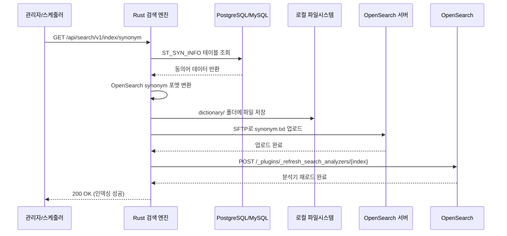

# OpenSearch 동의어(Synonym) 사전 관리 자동화

## 개요

이커머스 검색에서 동의어 관리는 검색 품질을 좌우하는 핵심 요소다. "맨투맨"을 검색했는데 "스웨트셔츠"가 나오지 않으면, "청바지"를 검색했는데 "데님팬츠"가 빠지면 사용자 경험이 떨어진다. OpenSearch는 synonym 필터를 통해 동의어를 지원하지만, 사전 파일을 직접 관리하고 반영하는 과정이 번거롭다.

이 프로젝트에서는 RDB에 저장된 동의어 데이터를 OpenSearch가 읽을 수 있는 텍스트 파일로 변환하고, SSH로 원격 서버에 업로드한 뒤, 분석기를 재로드하는 전 과정을 Rust 검색 엔진 내부에서 API 하나로 처리하도록 자동화했다. 사용자 사전(User Dictionary)도 동일한 구조로 관리하며, 사이트별 분리 저장까지 지원한다.

## 아키텍처 설계

### 동의어 반영 전체 플로우



### 왜 파일 기반인가

OpenSearch의 동의어 필터는 두 가지 방식으로 동의어를 로드할 수 있다.

1. **인라인 방식**: 인덱스 매핑에 직접 동의어 목록을 넣는다. 인덱스를 다시 만들어야 변경이 반영된다.
2. **파일 방식**: `synonyms_path`로 텍스트 파일을 지정한다. `_refresh_search_analyzers` API로 런타임에 재로드할 수 있다.

운영 환경에서는 당연히 파일 방식을 선택했다. 인덱스를 닫고 열 필요 없이 분석기만 재로드하면 되기 때문이다. 다만 파일을 OpenSearch 노드에 직접 배포해야 하는 부담이 생긴다. 이 부담을 자동화로 해결했다.

## 핵심 구현

### DB 스키마와 SQL 쿼리

동의어 데이터는 `ST_SYN_INFO` 테이블에 저장된다. 표준어(STD_WRD)와 동의어(SYN_NM) 쌍으로 관리되며, USE_YN 플래그로 활성/비활성을 제어한다.

```sql
SELECT
    SSI.SYN_SEQ AS "id",
    SSI.STD_WRD AS "standardWord",
    SSI.SYN_NM AS "synonym",
    SSI.USE_YN AS "useYn",
    CASE WHEN SSI.USE_YN = 'N' THEN 'D' ELSE 'A' END AS "sendGb"
FROM ST_SYN_INFO SSI
WHERE SSI.USE_YN = 'Y'
ORDER BY SSI.SYN_SEQ
```

PostgreSQL과 MySQL을 동시에 지원해야 했기 때문에, `SqlBuilder`라는 추상화 계층을 통해 DB 타입별로 쿼리를 분기한다. 증분 색인 시에는 `SYS_MOD_DTM` 기준으로 최근 변경분만 가져온다.

```rust
pub fn build_synonym_query_with_interval(&self, interval: &str) -> String {
    let base_query = self.build_synonym_query();
    if interval == "1" {
        // 풀 색인: 전체 데이터
        base_query
    } else {
        // 증분 색인: interval 분 이내 변경된 데이터만
        format!(
            "{} AND SSI.SYS_MOD_DTM BETWEEN NOW() - INTERVAL '{} MINUTES' AND NOW()",
            base_query, interval
        )
    }
}
```

### SynonymService 구조

동의어 관리의 핵심 서비스다. OpenSearch 클라이언트, DB 페치 서비스, 앱 설정을 의존성으로 주입받는다.

```rust
pub struct SynonymService {
    client: Arc<OpenSearch>,
    db_fetch_service: Arc<DbFetchService>,
    config: Arc<AppConfig>,
}

impl SynonymService {
    pub async fn new(
        client: Arc<OpenSearch>,
        db_fetch_service: Arc<DbFetchService>,
        config: Arc<AppConfig>,
    ) -> Self {
        Self { client, db_fetch_service, config }
    }
}
```

서비스 인스턴스는 `OnceCell`을 사용한 싱글톤으로 관리한다. 검색 엔진 전체에서 단 하나의 인스턴스만 존재하며, 처음 호출 시 초기화된다.

```rust
static SYNONYM_SERVICE: OnceCell<SynonymService> = OnceCell::const_new();

pub async fn get_synonym_service() -> &'static SynonymService {
    SYNONYM_SERVICE.get_or_init(|| async {
        let client = get_client().await;
        let config = load_config();
        let pg_client = PostgresClient::with_config(&config.postgres);
        let db_fetch_service = Arc::new(DbFetchService::new(pg_client));
        SynonymService::new(client, db_fetch_service, Arc::new(config)).await
    }).await
}
```

### 동의어 포맷 변환

DB에서 가져온 데이터를 OpenSearch가 읽을 수 있는 텍스트 포맷으로 변환한다. OpenSearch의 synonym 필터는 `표준어,동의어` 형식의 텍스트 파일을 읽는다.

```rust
fn convert_to_synonym_format(
    &self,
    synonym_data: &[IndexingData],
) -> Result<String, AppError> {
    let mut synonym_lines = Vec::new();

    for item in synonym_data {
        // useYn 필드 확인 (대소문자 호환)
        if let Some(use_yn) = item.extra_fields
            .get("useYn")
            .or_else(|| item.extra_fields.get("useyn"))
            .and_then(|v| v.as_str())
        {
            if use_yn != "Y" { continue; }
        }

        // 표준어와 동의어 추출
        if let (Some(std_word), Some(synonym)) = (
            item.extra_fields.get("standardWord")
                .or_else(|| item.extra_fields.get("standardword"))
                .and_then(|v| v.as_str()),
            item.extra_fields.get("synonym")
                .and_then(|v| v.as_str()),
        ) {
            let std_word_clean = std_word.trim();
            let synonym_clean = synonym.trim();
            if !std_word_clean.is_empty() && !synonym_clean.is_empty() {
                synonym_lines.push(format!("{},{}", std_word_clean, synonym_clean));
            }
        }
    }

    Ok(synonym_lines.join("\n"))
}
```

실제 생성되는 파일 내용은 다음과 같다.

```text
스웨트셔츠,맨투맨
맨투맨,스웨트셔츠
데님팬츠,청바지
청바지,데님팬츠
집업,후드집업,짚업
후리스,플리스
블랙,검정,검은
화이트,하얀,흰,백
```

하나 주목할 점은 대소문자 호환 처리다. PostgreSQL은 `"useYn"` 형태로 반환하지만 MySQL은 `"useyn"`으로 반환하는 경우가 있었다. `or_else()`로 양쪽 케이스를 모두 처리하도록 했다. 이건 PostgreSQL/MySQL 동시 지원 과정에서 발견한 문제로, 실제 운영 중에 데이터가 누락되는 버그로 이어졌다.

### 파일 저장 전략: 이중 저장

동의어 파일은 두 곳에 저장한다.

```rust
fn write_to_file(&self, synonym_content: &str) -> Result<String, AppError> {
    let project_name = &self.config.project_name;
    let default_path = format!("./dictionary/{}_synonym.txt", project_name);

    let output_path = self.config.synonym_output_path
        .clone()
        .unwrap_or(default_path);

    // 디렉토리가 없으면 생성
    if let Some(parent) = Path::new(&output_path).parent() {
        if !parent.exists() {
            std::fs::create_dir_all(parent)?;
        }
    }

    let mut file = File::create(&output_path)?;
    file.write_all(synonym_content.as_bytes())?;

    Ok(output_path)
}
```

첫 번째는 `write_to_file()`로 설정에 지정된 경로에 저장한다. 두 번째는 `save_to_dictionary()`로 `./dictionary/` 폴더에 프로젝트명과 환경을 포함한 파일명으로 저장한다.

```
./dictionary/osstem_dev_synonym.txt
./dictionary/osstem_stg_synonym.txt
./dictionary/osstem_prd_synonym.txt
```

이중 저장의 이유는 명확하다. dictionary 폴더는 Git으로 관리되어 변경 이력을 추적할 수 있고, 다른 하나는 SSH 업로드용 소스 파일이다.

### SSH/SFTP 기반 원격 업로드

OpenSearch 서버에 동의어 파일을 배포하는 핵심 로직이다. Rust의 `ssh2` 크레이트를 사용했다.

```rust
fn upload_via_ssh(&self, local_path: &str, remote_path: &str) -> Result<(), AppError> {
    let ssh_host = &self.config.ssh_host;
    let ssh_port = self.config.ssh_port;
    let ssh_user = &self.config.ssh_user;
    let ssh_password = &self.config.ssh_password;

    // 1. SSH 연결 수립
    let tcp = TcpStream::connect(format!("{}:{}", ssh_host, ssh_port))?;
    let mut sess = Session::new()?;
    sess.set_tcp_stream(tcp);
    sess.handshake()?;
    sess.userauth_password(ssh_user, ssh_password)?;

    // 2. 로컬 파일 읽기
    let mut local_file = File::open(local_path)?;
    let mut file_contents = Vec::new();
    local_file.read_to_end(&mut file_contents)?;

    // 3. SFTP로 /tmp에 임시 업로드 (권한 문제 우회)
    let sftp = sess.sftp()?;
    let temp_remote_path = format!("/tmp/synonym_{}.txt", uuid::Uuid::new_v4());
    let mut remote_file = sftp.create(&Path::new(&temp_remote_path))?;
    remote_file.write_all(&file_contents)?;
    drop(remote_file);

    // 4. sudo mv로 최종 경로에 이동
    let mv_command = format!(
        "echo '{}' | sudo -S mv {} {}",
        ssh_password, temp_remote_path, remote_path
    );
    self.execute_ssh_command(&sess, &mv_command)?;

    // 5. 파일 권한 설정
    let chmod_cmd = format!(
        "echo '{}' | sudo -S chmod 644 {}",
        ssh_password, remote_path
    );
    self.execute_ssh_command(&sess, &chmod_cmd)?;

    Ok(())
}
```

직접 최종 경로에 쓰지 않고 `/tmp`를 경유하는 이유가 있다. OpenSearch의 설정 디렉토리(`/data/opensearch-dir/docker-file/conf/`)는 root 권한이 필요하다. SFTP는 일반 사용자 권한으로 동작하기 때문에, 먼저 `/tmp`에 업로드하고 `sudo mv`로 이동시키는 2단계 전략을 취했다.

원격 파일 경로에는 프로젝트명과 환경이 포함된다.

```
/data/opensearch-dir/docker-file/conf/osstem_dev_synonym.txt
/data/opensearch-dir/docker-file/conf/osstem_stg_synonym.txt
```

### 분석기 재로드: 멀티 인덱스 지원

파일을 업로드한 것만으로는 반영되지 않는다. OpenSearch에 분석기를 재로드하라고 알려줘야 한다.

```rust
async fn reload_search_analyzers(&self) -> Result<(), AppError> {
    let index_names = self.config.opensearch_synonym_index
        .clone()
        .unwrap_or_else(|| vec!["test-ab".to_string()]);

    log::info!("Reloading search analyzers for indices: {:?}", index_names);

    let mut success_count = 0;
    let mut fail_count = 0;

    for index_name in &index_names {
        match self.refresh_single_index(index_name).await {
            Ok(_) => {
                log::info!("Successfully refreshed index: {}", index_name);
                success_count += 1;
            }
            Err(e) => {
                log::error!("Failed to refresh index {}: {}", index_name, e);
                fail_count += 1;
            }
        }
    }

    if success_count == 0 && fail_count > 0 {
        return Err(AppError::new("500", "All index refreshes failed"));
    }

    Ok(())
}
```

설정에서 동의어를 적용할 인덱스를 콤마로 구분해서 지정할 수 있다.

```toml
opensearch_synonym_index = "goods-ko,marketing-ko,event-ko"
```

하나의 동의어 사전이 여러 인덱스에 적용되는 구조다. 상품, 마케팅, 이벤트 인덱스가 모두 같은 동의어를 공유한다. 재로드 시 하나가 실패해도 나머지는 계속 처리하고, 전부 실패한 경우에만 에러를 반환한다.

`refresh_single_index()`의 실제 구현은 OpenSearch의 `_plugins/_refresh_search_analyzers` API를 호출한다.

```rust
async fn refresh_single_index(&self, index_name: &str) -> Result<(), AppError> {
    let transport = self.client.transport();
    let refresh_url = format!("/_plugins/_refresh_search_analyzers/{}", index_name);

    let response = transport
        .send(
            Method::Post,
            &refresh_url,
            HeaderMap::new(),
            None::<&()>,
            None::<&[u8]>,
            None,
        )
        .await?;

    let status = response.status_code();
    if !status.is_success() {
        let body = response.text().await.unwrap_or_default();
        return Err(AppError::new(
            &status.as_u16().to_string(),
            &format!("Failed to refresh analyzers for {}: {}", index_name, body),
        ));
    }

    Ok(())
}
```

### 전체 인덱싱 플로우

위의 모든 단계를 하나로 묶는 `index_synonym_data()` 메서드다.

```rust
pub async fn index_synonym_data(&self) -> Result<(), AppError> {
    // 1. DB에서 동의어 데이터 페치
    let synonym_data = self.db_fetch_service
        .fetch_data_for_indexing("synonym", "1")
        .await?;

    log::info!("Fetched {} synonym entries", synonym_data.len());

    // 2. OpenSearch synonym 포맷으로 변환
    let synonym_txt = self.convert_to_synonym_format(&synonym_data)?;

    log::info!(
        "Converted to {} synonym lines",
        synonym_txt.lines().count()
    );

    // 3. 로컬 파일 저장
    let local_path = self.write_to_file(&synonym_txt)?;

    // 4. dictionary 폴더에도 백업 저장
    let project_name = &self.config.project_name;
    let environment = &self.config.env;
    let dictionary_filename = format!("{}_{}_synonym.txt", project_name, environment);
    if let Err(e) = self.save_to_dictionary(&synonym_txt, &dictionary_filename) {
        log::error!("Failed to save to dictionary folder: {}", e);
    }

    // 5. SSH로 원격 서버에 업로드
    let remote_path = format!(
        "/data/opensearch-dir/docker-file/conf/{}_{}_synonym.txt",
        project_name, environment
    );
    match self.upload_via_ssh(&local_path, &remote_path) {
        Ok(_) => log::info!("Successfully uploaded synonym"),
        Err(e) => log::error!("Failed to upload synonym: {}", e),
    }

    // 6. OpenSearch 분석기 재로드
    self.reload_search_analyzers().await?;

    Ok(())
}
```

API 엔드포인트는 Axum 라우터에 등록된다.

```rust
// Special indexing routes
router = add_routes(
    router,
    &path_prefix,
    vec![
        ("/synonym", get(synonym_index_document)),
        ("/ranking", get(ranking_index_document)),
        ("/userDictionary", get(user_dictionary_index_document)),
    ],
);
```

`GET /api/search/v1/index/synonym` 하나로 DB 조회부터 분석기 재로드까지 전 과정이 실행된다.

## 사용자 사전(User Dictionary) 관리

동의어와 함께 사용자 사전도 같은 구조로 관리한다. 사용자 사전은 Nori 분석기(한국어 형태소 분석기)가 사용하는 커스텀 단어 목록이다.

### 동의어와의 차이점

| 구분 | 동의어(Synonym) | 사용자 사전(User Dictionary) |
|------|-----------------|--------------------------|
| DB 테이블 | `ST_SYN_INFO` | `ST_NOGM_INFO` |
| 파일 포맷 | `표준어,동의어` (한 줄) | 단어 하나 (한 줄) |
| 사이트별 분리 | 없음 (전체 공용) | 사이트 번호별 별도 파일 |
| 파일명 | `{project}_{env}_synonym.txt` | `{project}_{env}_user_dictionary_{siteNo}.txt` |
| 분석기 reload | 자동 수행 | 별도 처리 |

### 사이트별 파일 분리

사용자 사전은 사이트(쇼핑몰)별로 다른 단어를 등록할 수 있다. A 쇼핑몰에서는 "나이키에어맥스"를 하나의 단어로 인식시키고, B 쇼핑몰에서는 필요 없는 경우가 있다.

```rust
fn group_by_site_no(
    &self,
    data: &[IndexingData],
) -> HashMap<String, Vec<IndexingData>> {
    let mut result: HashMap<String, Vec<IndexingData>> = HashMap::new();

    for item in data {
        let site_no = item.extra_fields
            .get("siteNo")
            .or_else(|| item.extra_fields.get("siteno"))
            .and_then(|v| match v {
                serde_json::Value::String(s) => Some(s.clone()),
                serde_json::Value::Number(n) => Some(n.to_string()),
                _ => None,
            });

        if let Some(site_no) = site_no {
            result.entry(site_no).or_default().push(item.clone());
        }
    }

    result
}
```

그룹화된 데이터는 사이트별로 별도 파일을 생성하고, 각각 SSH로 업로드한다.

```
./dictionary/osstem_dev_user_dictionary_100.txt
./dictionary/osstem_dev_user_dictionary_200.txt
./dictionary/osstem_dev_user_dictionary_300.txt
```

### Nori 토크나이저 연동

`TokenizerService`는 OpenSearch의 `new-word` 인덱스에서 사용자 사전을 로드하여 Nori 토크나이저에 적용한다. 검색 시점에 사용자 사전이 반영된 형태소 분석을 수행할 수 있다.

```rust
pub async fn tokenize_text(&self, text: &str) -> Result<Value, AppError> {
    let user_dict = self.get_user_dictionary().await;
    let stoptags = self.get_stoptags().await;

    let response = self.client.indices()
        .analyze(AnalyzeParts::None)
        .body(json!({
            "tokenizer": {
                "type": "nori_tokenizer",
                "decompound_mode": "none",
                "user_dictionary_rules": user_dict
            },
            "filter": [{
                "type": "nori_part_of_speech",
                "stoptags": stoptags
            }],
            "text": [text]
        }))
        .send()
        .await?;

    // ...
}
```

사용자 사전은 `RwLock`으로 보호된다. 사전 업데이트 시에만 쓰기 락을 잡고, 검색(토크나이징) 시에는 읽기 락만 사용해서 동시 요청을 처리한다. 초기에는 `Mutex`를 사용했으나, 읽기가 압도적으로 많은 특성상 `RwLock`으로 전환하여 성능을 개선했다.

```rust
pub struct TokenizerService {
    client: Arc<OpenSearch>,
    user_dictionary: Arc<RwLock<Vec<String>>>,
    stoptags: Arc<RwLock<Vec<String>>>,
}
```

## 트러블슈팅

### 1. MySQL과 PostgreSQL의 컬럼명 케이스 차이

PostgreSQL은 `"useYn"` 형태의 쿼리 결과를 camelCase로 반환하지만, MySQL은 모두 소문자로 반환하는 경향이 있었다. 동의어 데이터가 특정 환경에서만 빈 파일로 생성되는 버그가 발생했다.

```rust
// 수정 전: PostgreSQL에서만 동작
item.extra_fields.get("useYn")

// 수정 후: 양쪽 DB 모두 호환
item.extra_fields.get("useYn")
    .or_else(|| item.extra_fields.get("useyn"))
```

`standardWord`, `siteNo` 등 모든 필드에 동일한 패턴을 적용했다. 근본적인 해결은 DB 레이어에서 컬럼 alias를 통일하는 것이지만, 기존 코드와의 호환성을 위해 서비스 레이어에서 양쪽을 모두 처리하는 방식을 선택했다.

### 2. SFTP 권한 문제

OpenSearch 설정 디렉토리에 직접 파일을 쓸 수 없었다. SFTP 세션은 일반 사용자 권한으로 동작하고, 설정 디렉토리는 root 소유였다.

해결 방법은 2단계 업로드다.

1. SFTP로 `/tmp`에 임시 파일 업로드 (일반 사용자 권한으로 가능)
2. `sudo mv`로 최종 경로에 이동 + `chmod 644` 권한 설정

UUID 기반 임시 파일명을 사용해서 동시 요청 시 파일 충돌을 방지했다.

### 3. 분석기 재로드 실패 시 부분 성공 처리

여러 인덱스에 동의어를 적용할 때, 일부 인덱스만 재로드에 실패하는 경우가 있었다. 인덱스가 닫혀 있거나, 네트워크 문제가 발생하거나. 처음에는 하나라도 실패하면 전체를 실패로 처리했는데, 이러면 정상적인 인덱스까지 갱신이 안 되는 문제가 있었다.

개선 후에는 각 인덱스를 독립적으로 처리하고, 성공/실패 카운트를 추적한다. 전부 실패한 경우에만 에러를 반환한다.

### 4. 멀티 프로젝트 환경의 파일 충돌

처음에는 동의어 파일명이 단순히 `synonym.txt`였다. 하나의 OpenSearch 클러스터에 여러 프로젝트(쇼핑몰)가 연결되면 파일이 덮어씌워지는 문제가 발생했다.

```
# 수정 전
synonym.txt                          -- 모든 프로젝트가 같은 파일을 덮어씀

# 수정 후 (1차): 프로젝트명 포함
osstem_synonym.txt
x2bee_synonym.txt

# 수정 후 (2차): 프로젝트명 + 환경 포함
osstem_dev_synonym.txt
osstem_stg_synonym.txt
x2bee_prd_synonym.txt
```

두 차례 리팩토링을 거쳐 프로젝트명과 환경을 모두 포함하는 네이밍 규칙으로 정착했다.

## 설정 관리

동의어 관련 설정은 `Cargo.toml`의 환경별 메타데이터로 관리한다.

```toml
[package.metadata.config.dev]
# 동의어를 반영할 인덱스 목록 (콤마로 구분)
opensearch_synonym_index = "goods-ko,marketing-ko"
# 사용자 사전 인덱스 목록
opensearch_user_dictionary_index = "goods-ko,marketing-ko"
# SSH 접속 정보
ssh_host = "192.168.2.171"
ssh_port = 22
ssh_user = "tech"
ssh_password = "tech"
# 로컬 저장 경로
synonym_output_path = "./synonym.txt"
user_dictionary_output_path = "./usr_dictionary.txt"
```

환경 변수로 오버라이드할 수 있어서, Docker 환경에서도 유연하게 대응한다.

## 결과 및 회고

### 성과

동의어 사전 관리가 API 호출 하나로 단순화됐다. 이전에는 DB 수정 후 수동으로 파일을 생성하고, SCP로 업로드하고, OpenSearch에서 분석기를 재로드하는 3단계를 거쳤다. 이 과정에서 파일 경로 오류, 권한 문제, 재로드 누락 같은 실수가 빈번했다.

자동화 이후에는 관리자 UI에서 동의어를 수정하고 "반영" 버튼을 누르면 끝이다. 스케줄러를 통한 주기적 동기화도 가능하다. 1,400줄이 넘는 실제 운영 동의어 사전이 이 파이프라인을 통해 관리되고 있다.

### 배운 점

**파일 기반 사전의 한계를 느꼈다.** SSH를 통한 파일 배포는 OpenSearch 노드가 하나일 때는 괜찮지만, 클러스터 환경에서는 모든 노드에 동일한 파일을 배포해야 한다. 향후 OpenSearch의 인덱스 기반 동의어 관리(synonym graph token filter의 updatable 옵션)로 전환하는 것이 더 나은 방향이다.

**Rust의 `ssh2` 크레이트는 안정적이지만 에러 메시지가 불친절하다.** SSH 연결 실패 시 원인을 파악하기 어려웠다. 타임아웃, 인증 실패, 네트워크 불가 등을 구분하기 위해 에러 핸들링을 꼼꼼하게 추가해야 했다.

**대소문자 호환은 처음부터 고려해야 한다.** PostgreSQL과 MySQL을 동시에 지원하면서 발견한 문제인데, 이런 종류의 버그는 특정 환경에서만 발생해서 발견이 늦다. 컬럼 매핑 계층을 더 엄밀하게 설계했어야 했다.
